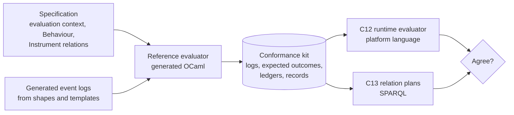

<!-- SPDX-License-Identifier: CC-BY-SA-4.0 -->

# The reference evaluator and its conformance kit

**Unit:** [formal-methods](../plans/formal-methods.md), phase 6. **Status:** sketch, 2026-10-06.
Nothing here is ratified.
**Parent:** [formal methods](formal-methods.md) §9, as revised by §13.1. Reads with the
[evaluation context sketch](evaluation-context.md), the [nested states sketch](nested-states-and-history.md),
and the CCS plan's C11a, C12 and C13.

---

## 1. The problem

CCS C12 builds LATTICE's runtime evaluator: regimes and occasions over a stimulus log, derived
triggers, state occupancies with evidence. C13 builds relation plans in SPARQL. Both are hand-written
interpretations of semantics stated in prose. Without a reference, they can only be compared with
each other and with examples.

The proposal is a reference evaluator generated from the specification, run only in the toolchain,
and a conformance kit that the runtime evaluator must pass. The runtime stays in a platform
language (parent §13.1).

## 2. What is specified

| Part | Specification | Source |
|---|---|---|
| outcome | a value, Undetermined with a reason, or Denied | evaluation context §3 |
| environment | case facts, position, pinned scheme editions, conversion context | evaluation context §7 |
| ledger | accounts on a tree, balances, debits and credits by path | evaluation context §5 |
| log | read sets, provenance, diagnostics | evaluation context §3 |
| combinators | the closed algebra, with a denotation each | evaluation context §4 |
| lifting | effects as the only producers of ledger changes | evaluation context §6 |
| environments | sequential (bind, priority order) and parallel (applicative with a merge) | evaluation context §7 |
| strata | the order inside a pass | evaluation context §8 |
| macrostep | Behaviour's step relation over configurations, with nested states and history | nested states §2 to §7 |
| relations | arising, due, breach, exceptions, gating | CCS sketch §5, Instrument README |

## 3. What is proved

| # | Theorem | Gives |
|---|---|---|
| RE1 | the monad laws for the stack, and the applicative laws for the parallel environment | refactoring and compilation are safe |
| RE2 | a pass commits all its ledger changes or none | atomicity |
| RE3 | a computation that reads only the environment cannot change the ledger | B8 by construction |
| RE4 | the ledger at p+1 is a function of the ledger at p and the pass at p+1 | determinism across positions (B3) |
| RE5 | the sequential and parallel environments agree when no two proposals touch one account | the environment matters only under contention |
| RE6 | proportional merge never over-draws, and does not depend on proposal order | merge safety |
| RE7 | every macrostep preserves B9 to B11 and terminates under B10 | Behaviour's laws hold for every run |
| RE8 | every outcome is the denotation of the instrument's relations at that position | the evaluator means what Instrument says |

RE8 is the theorem that "the evaluator is correct" stands for. RE1 to RE7 are the lemmas it rests
on.

## 4. The conformance kit

| Part | Content |
|---|---|
| inputs | an instrument configuration, as canonical typed JSON and as Turtle, and a stimulus log |
| expected | per position: relation outcomes, occupancies, ledger balances, records with their evidence, diagnostics |
| provenance | the specification digest and the reference evaluator's image digest that produced the expectations |
| generation | event logs from the shapes and the template library, with metamorphic variants: permuted independent events, renamed identifiers, split and merged passes where the semantics allows |
| coverage | every Behaviour law, every Instrument law, every template, every combinator, listed with the logs that exercise it |

The kit is data. The runtime evaluator, whatever its language, runs it and compares. So do the C13
relation plans, run on a store. A difference is a defect in the runtime or in the plans, unless the
kit's provenance shows an outdated specification.

## 5. Where the reference runs

| Use | How |
|---|---|
| generating the kit | a worker job ([toolchain workers sketch](formal-toolchain-workers.md)), per specification change |
| bounded exploration of instance properties | a worker job ([instrument assurance sketch](instrument-assurance.md) §4) |
| replaying a counterexample | a local command through `mise`, with the same binary |
| live evaluation | never. The runtime evaluator does that |

## 6. Effect on CCS

| Slice | Change |
|---|---|
| C11a | its laws gain theory statements. Its worked cases become the first kit entries |
| C12 | builds the runtime evaluator against the kit. Its Validation Pack's mandatory probes (B3, B6) become kit entries that must fail when the runtime is deliberately broken |
| C13 | relation plans are checked against the kit on a store |
| C13a | its satisfiability encoding is checked against the specification's denotation (parent §8.4) |

None of this delays CCS. Until the reference exists, C12 proceeds as planned, and the kit is
applied when it arrives.

## 7. Open questions

| # | Question | Leaning |
|---|---|---|
| RE-Q1 | How many positions should a generated log span? | as many as the longest template's window needs, plus margin, recorded as the kit's bound |
| RE-Q2 | Does the kit include the Datalog backend of the evaluation context §9? | yes, when it exists, as a third realisation |
| RE-Q3 | Who owns the kit's expected outcomes when the specification changes? | the specification. The kit is regenerated, and reviewed as a diff |
