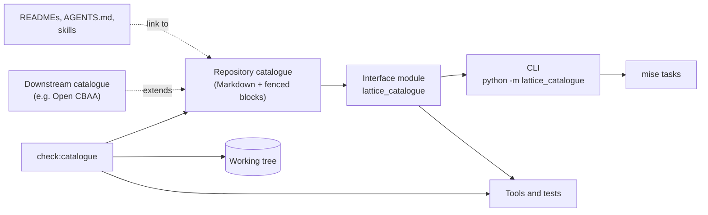

<!-- SPDX-License-Identifier: CC-BY-SA-4.0 -->

# Repository Catalogue — Sketch

**Unit ID:** `repository-catalogue`
**Status:** Sketch. Design questions RC-Q1 to RC-Q8 open. Not yet planned. Shares work with
[`python-test-melting`](../plans/python-test-melting.md) (§8.1)
**Date:** 2026-10-09
**Question prefix:** RC
**Proposes:** ADR-A121, *Repository catalogue and location resolution* (next free number at the
time of writing, A120 being taken. Re-check the [ADR catalogue](../../architecture/decisions/README.md) before filing)
**Related:** [ADR-A77](../../architecture/decisions/ADR-A77-repository-topology-and-documentation-governance.md)
(repository topology), [ADR-A88](../../architecture/decisions/ADR-A88-ontology-import-resolution-for-consumers.md)
(ontology import resolution), [ADR-A29](../../architecture/decisions/ADR-A29-repository-toolchain-and-environment-boundary.md)
(`mise` as the task entry point), [ADR-A117](../../architecture/decisions/ADR-A117-agent-guidance-and-skill-library.md)
(agent guidance and skills)

---

## 1. The problem

Code, tests, `mise` tasks, documents and agent skills each carry their own copy of where things
live in the repository. Each copy is written by hand, and nothing checks that the copies agree or
that the paths still exist.

### 1.1 A worked example

`tools/persistence/src/persistence/witness.py` (formal-methods track H,
slice H1.2, on a formal-methods branch and not yet on `main`) opens with this:

```python
PACKAGE_DIR = Path(__file__).resolve().parent
REPO_ROOT = PACKAGE_DIR.parents[3]
SPEC_TTL = REPO_ROOT / "ontology" / "persistence" / "spec" / "persistence.ttl"
SHAPES_TTL = REPO_ROOT / "ontology" / "persistence" / "shapes" / "constraints.ttl"
EXAMPLES_DIR = REPO_ROOT / "ontology" / "persistence" / "examples"
WITNESS_DIR = REPO_ROOT / "tools" / "persistence" / "tests" / "witnesses"
KNOWN_GAPS = WITNESS_DIR / "known-gaps.txt"
TEMPLATE_DIR = PACKAGE_DIR / "templates"
```

Six facts are encoded here, and five of them are repository layout rather than anything the
module is about.

1. **The repository root is found by counting directories.** `parents[3]` is correct only while
   the file sits exactly four levels below the root and the package is installed editable
   (`pip install -e`, as `mise run bootstrap:persistence` does). A non-editable install, a wheel,
   or a move of `tools/persistence` breaks it without an error until a file is opened.
2. **The ontology root (`ontology/`)** is the ADR-A77 rule, restated.
3. **The module's location (`ontology/persistence`)** is restated.
4. **The module's internal layout** (`spec/<module>.ttl`, `shapes/constraints.ttl`,
   `examples/`) is a convention the [ontology authoring skill](../../../.claude/skills/lattice-ontology-authoring/SKILL.md)
   and [`literate_extract.py`](../../../tools/literate_extract.py) also restate.
5. **The package reaches outside its own source tree** into `tools/persistence/tests/witnesses`,
   through the same counted root.
6. `TEMPLATE_DIR` is package-internal. It is the one path here that belongs to the module itself.

### 1.2 How widespread it is

Measured on 2026-10-09 across the working tree, `spikes/` and `node_modules/` excluded where noted:

| Pattern | Count |
|---|---|
| Python files deriving the root by counting parents of `__file__` | 66 files, at depths `parents[1]` (27 sites), `[2]` (4), `[3]` (12), `[4]` (13), `[5]` (1), plus `.parent.parent[.parent]` chains (10) |
| Python path constructions naming `ontology` literally | 144 in 50 files |
| Python string literals naming a module subdirectory | `"examples"` 56, `"shapes"` 53, `"spec"` 48, `"vocab"` 22, `"fixtures"` 6, `"templates"` 5, `"projection"` 5 |
| `sys.path.insert` to reach a sibling script (outside `spikes/`) | 34 |
| `mise.toml` lines naming an `ontology/` or `tools/` path | 45 |
| Markdown references of the form `ontology/<module>/<spec\|shapes\|vocab\|examples>` | 474 in 126 files |

Some of this metadata is not only duplicated but is a contract that lives nowhere authoritative.

- **Extraction contracts.** `literate_extract.py` writes `turtle-shapes` blocks "to the shape files
  named by the layer's extraction contract". That contract is passed on the command line, so for
  Instrument the list `shapes/structural.ttl shapes/constraints.ttl shapes/single-expression.ttl`
  is repeated verbatim in four tests ([`test_instrument.py`](../../../tools/test_instrument.py),
  [`test_regimes.py`](../../../tools/test_regimes.py),
  [`test_terms_in_time.py`](../../../tools/test_terms_in_time.py),
  [`test_constitutive_terms.py`](../../../tools/test_constitutive_terms.py)). The authoring skill
  says "the layer's README or its test names them".
- **Versioned directories.** [`ontology_version_check.py`](../../../tools/ontology_version_check.py)
  holds `VERSIONED_DIRECTORIES = {"spec", "vocab"}`.
- **Layer membership and order.** [`import_guard.py`](../../../tools/import_guard.py) holds
  `SUBSTRATE` and `ALLOWED`, and its docstring lists the modules outside the order.
- **Proof and reference roots.** [`check_formal_freshness.py`](../../../tools/check_formal_freshness.py)
  holds `tools/proofs` and `tools/reference`.
- **Repository roots.** The "Where things are" table in [AGENTS.md](../../../AGENTS.md) (and its
  generated copy in `.github/copilot-instructions.md`), and ADR-A77's
  [migration manifest](../../architecture/repository-topology-migration.json), which is now a
  historical record.

### 1.3 Module layouts are not uniform

A catalogue that assumes every module has `spec/`, `vocab/`, `shapes/` and `examples/` would be
wrong today.

| Module | Subdirectories present |
|---|---|
| `behaviour` | `examples execution projection shapes spec test vocab` |
| `foundation` | `examples shapes spec vocab` (three shape files, including `rules.ttl`) |
| `party` | `projection shapes spec vocab`, no `examples` |
| `persistence` | `docs examples shapes spec`, no `vocab`, two spec documents and two shape documents |
| `mork` | `examples mtp shapes spec targets test` |
| `vocabulary` | `examples shapes spec`, no `vocab` |
| `governance` | `README.md` only |
| `applied/insurance/peril` | `examples shapes spec vocab`, nested two levels below `applied/` |

So the catalogue needs a convention and per-module declarations, and the check needs to know which
artefacts a module claims to have.

### 1.4 Why it matters now

- The ADR-A77 relocation moved most semantic roots. Every hard-coded path was a manual edit, and
  [lattice-design](../../../.claude/skills/lattice-design/SKILL.md) still has to require "update
  every source, configuration, CI, documentation and website reference in the same change" because
  nothing finds them.
- Projects built on LATTICE, such as Open CBAA, need to locate LATTICE's specs and shapes from
  outside this repository. Today each would have to copy LATTICE's layout into its own code.
- Agents write most new tools. Each new tool copies the nearest existing idiom, so the counted-root
  pattern spreads with every slice.

## 2. What the sketch proposes

1. **One catalogue document** in the repository, in Markdown, holding the location metadata in
   fenced configuration blocks. People read the prose and tables, tools read the blocks. READMEs and
   skills link to it instead of restating paths.
2. **One interface module**, the only code that knows how to find the repository root and read the
   catalogue. Every tool, test and task asks it for locations by role.
3. **A check**, run by `mise run check`, that the catalogue matches the tree and that no new code
   bypasses it.
4. **Skill and guidance changes** so an agent that moves, adds or removes a module, a tool package
   or a documentation area updates the catalogue in the same change.
5. **A migration** in slices, with `witness.py` as the pilot.



### 2.1 Relationship to what exists

| Artefact | Answers | After this unit |
|---|---|---|
| `ontology/catalog-v001.xml` (ADR-A88) | "which file holds the ontology with this IRI?" | unchanged, still generated from the Turtle. The repository catalogue answers a different question, "where is the artefact with this role?" (§6, RC-Q8 on the name) |
| ADR-A77 migration manifest | "what moved where in the topology migration?" | unchanged, a historical record |
| AGENTS.md "Where things are" | "which root owns what?" | generated from, or replaced by a link to, the catalogue's roots block (RC-Q6) |
| Constants in `import_guard`, `ontology_version_check`, `check_formal_freshness` | layer order, versioned directories, proof roots | locations move to the catalogue. Whether layer order moves is RC-Q3 |
| Extraction contracts passed on the command line | which shape files a layer's README extracts to | declared once per module in the catalogue, read by `literate_extract.py` |

## 3. The catalogue document

### 3.1 Shape

A single Markdown file whose prose explains each area and whose fenced blocks carry the data. The
fence tag marks a block as catalogue data, the same device `literate_extract.py` uses for
`turtle-spec` and `turtle-vocab` blocks in layer READMEs. Blocks are merged in document order. A key
defined twice is an error.

The data has five parts.

| Part | Holds |
|---|---|
| `roots` | each top-level root, what it owns, and the ADR that admits it (the AGENTS.md table) |
| `conventions` | the default internal layout of an ontology module and of a tool package, with `{module}` placeholders |
| `modules` | each ontology module, its path, its kind, which artefact roles it has, and any departure from the convention, including its extraction contract |
| `tools` | each tool package, its path, its import name, the module it serves, and the named paths it reaches outside its own source tree |
| `docs` and `generated` | documentation areas (decisions, sketches, plans, status, review, validation) and generated outputs (`catalog-v001.xml`, `execution/`, `mtp/out`, `build/`), the latter marked so checks never depend on them |

### 3.2 An illustration

Illustrative only. The syntax is RC-Q2 and the granularity is RC-Q4.

````markdown
## Ontology modules

Every module follows the layout below unless its entry says otherwise. A role names a
kind of artefact. A tool asks for a role, never for a path.

```toml catalogue
[conventions.module]
readme     = "README.md"
spec       = "spec/{module}.ttl"
vocab      = "vocab/{module}-vocab.ttl"
shapes     = ["shapes/structural.ttl", "shapes/constraints.ttl"]
examples   = "examples/"
projection = "projection/"
execution  = { path = "execution/", generated = true }
versioned  = ["spec", "vocab"]
```

### Instrument

```toml catalogue
[modules.instrument]
path   = "ontology/instrument"
kind   = "substrate"
roles  = ["readme", "spec", "vocab", "shapes", "examples"]
shapes = ["shapes/structural.ttl", "shapes/constraints.ttl", "shapes/single-expression.ttl"]
```

### Persistence

Two spec documents and two shape documents. `spec` keeps the conventional name. The
foundation profile is a named extra role.

```toml catalogue
[modules.persistence]
path   = "ontology/persistence"
kind   = "capability"
roles  = ["readme", "spec", "shapes", "examples", "docs"]
shapes = ["shapes/constraints.ttl", "shapes/persistent-foundation.ttl"]
"spec.persistent-foundation"   = "spec/persistent-foundation.ttl"
"shapes.constraints"           = "shapes/constraints.ttl"
docs   = "docs/"
```

## Tool packages

```toml catalogue
[tools.persistence]
path    = "tools/persistence"
import  = "persistence"
serves  = "persistence"
[tools.persistence.paths]
witnesses  = "tests/witnesses/"
known-gaps = "tests/witnesses/known-gaps.txt"
```
````

### 3.3 Rules for what goes in

- **Cross-boundary locations only.** A path a package uses inside its own source tree, such as
  `witness.py`'s `templates/`, stays relative to the package and is read with
  `importlib.resources`. The catalogue holds what one part of the repository needs to find in
  another.
- **Roles, not inventories.** The catalogue names a module's spec, its shapes in extraction order,
  and its examples directory. It does not list every example file. A test that needs
  `baseline-single-class.ttl` asks for the examples directory and names the file itself (RC-Q4).
- **Declared, then checked.** A module's `roles` list is a claim the check verifies in both
  directions: every declared role resolves to something on disk, and every conventional
  subdirectory on disk is declared.
- **Domain-neutral.** Substrate entries describe structure only. Applied modules are entries like
  any other, with no insurance-specific keys.

### 3.4 Where it lives

Options under RC-Q1. Whichever is chosen, its path is the one location every consumer must know,
so it doubles as the root marker for discovery (§4.3).

## 4. The interface module

### 4.1 Responsibilities

1. Find the repository root, once, by one documented rule.
2. Read and merge the catalogue blocks, apply conventions, and validate the result against a
   schema.
3. Resolve a role to a `Path`, or a tuple of paths for ordered roles such as `shapes`, and fail with
   a named error that says which key is missing and where it should be declared.
4. Expose a small command line for shell consumers (`mise` tasks, CI) and for the check.

It holds no other repository knowledge. In particular it does not parse Turtle, and does not
replace ADR-A88's catalogue for IRI resolution.

### 4.2 Interface sketch (Python)

```python
from lattice_catalogue import load

catalogue = load()                                   # discovers the root (§4.3)
persistence = catalogue.module("persistence")

SPEC_TTL = persistence.file("spec")                  # Path, must exist
SHAPES_TTL = persistence.file("shapes.constraints")  # named role
EXAMPLES_DIR = persistence.directory("examples")
WITNESS_DIR = catalogue.tool("persistence").path("witnesses")
KNOWN_GAPS = catalogue.tool("persistence").path("known-gaps")

catalogue.module("instrument").files("shapes")       # ordered tuple, the extraction contract
catalogue.modules(kind="substrate")                  # entries in declaration order
catalogue.doc("decisions")
catalogue.root
```

```text
python -m lattice_catalogue path persistence spec          # prints one path, for mise tasks
python -m lattice_catalogue paths instrument shapes        # one per line
python -m lattice_catalogue check                          # §5
python -m lattice_catalogue dump --json                    # resolved catalogue for other runtimes
```

Applied to the worked example, `witness.py` loses `REPO_ROOT` and every literal segment, keeps
`TEMPLATE_DIR` (rewritten to `importlib.resources`), and gains a single import.

`load()` is cached per process. Test fixtures that build a temporary tree pass `root=` explicitly.

### 4.3 Root discovery

In order, first match wins:

1. an explicit `root=` argument
2. the `LATTICE_ROOT` environment variable
3. walking up from the current working directory to the first directory holding the catalogue file

`__file__` is never used. Counting parents is the defect this unit removes, and it is wrong for
any non-editable install. `git rev-parse --show-toplevel` is not used either, since a source
archive or a downstream checkout may have no `.git` of LATTICE's own.

Hypothesis to test in the pilot. Every current caller runs from the repository root or below it
(`mise` tasks, pytest, CI), so rule 3 covers them without configuration. A tool run from elsewhere
sets `LATTICE_ROOT`.

### 4.4 Placement and packaging

Options under RC-Q5. The constraints are that every tool package must be able to depend on it,
that the root `pyproject.toml` is `package = false`, and that the root's dependency set is
deliberately small (`rdflib`, `pyshacl`). The module itself needs only the standard library if the
block syntax is TOML or JSON (RC-Q2).

### 4.5 Other runtimes

Java, TypeScript and Erlang code also read repository files, for example the Playwright
configurations under `apps/`. Rather than a reader per language now, `dump --json` writes the
resolved catalogue, and a later slice can add a reader where a runtime needs one. This is a
deferral, not a decision that other runtimes never get a native reader.

## 5. Enforcement

`mise run check:catalogue`, added to `mise run check`, runs `python -m lattice_catalogue check`:

1. **Schema.** Every block parses, keys are known, no key is defined twice.
2. **Catalogue to tree.** Every declared path exists, unless marked `generated`.
3. **Tree to catalogue.** Every directory under `ontology/` holding a `README.md` and a
   conventional subdirectory is a declared module, and every `tools/*/pyproject.toml` is a declared
   tool package.
4. **No bypass.** A static scan of Python sources for `Path(__file__)` combined with `parents[` or
   chained `.parent`, and for literal joins naming a catalogued root (`"ontology"`, `"tools"`,
   `"docs"`). Matches outside the interface module fail, except those listed in a known-exceptions
   file with a reason. The check fails on a listed exception that no longer matches, so the list
   only shrinks. This mirrors `KNOWN_DEFECTS` in `ontology_catalog.py` and `known-gaps.txt` in the
   witness check.
5. **Links.** `mise run topology:links` already checks Markdown links under `docs/`. Its scope widens
   to READMEs under `ontology/` and `tools/`, so a moved path breaks a check rather than a reader.

Markdown keeps literal relative links. A link cannot be resolved through the catalogue at render
time on GitHub, and rewriting 474 links to indirect references would make the documents harder to
read for no gain the link check does not already give. READMEs point at the catalogue for the
layout as a whole and keep their own links to specific files.

## 6. Agent guidance and skills

The catalogue only stays correct if the agents that do most of the moving keep it so.

| Where | Change |
|---|---|
| [AGENTS.md](../../../AGENTS.md) "Where things are" | the table becomes a link to the catalogue's roots, or is generated from them by `mise run build:agent-guidance` (RC-Q6) |
| [lattice-design](../../../.claude/skills/lattice-design/SKILL.md), "Links and paths" | moving a file updates its catalogue entry in the same change, then `check:catalogue` and `topology:links` find the rest |
| [lattice-ontology-authoring](../../../.claude/skills/lattice-ontology-authoring/SKILL.md) | a new module, a new shapes file or a changed extraction order is a catalogue edit. The "README or its test names them" sentence points at the catalogue instead |
| [lattice-toolchain](../../../.claude/skills/lattice-toolchain/SKILL.md) | a new tool package or `mise` task obtains paths from `lattice_catalogue`, never from `__file__` |
| [lattice-architecture](../../../.claude/skills/lattice-architecture/SKILL.md) | a new root or a new kind of directory is a catalogue entry as well as an ADR |
| [lattice-lifecycle](../../../.claude/skills/lattice-lifecycle/SKILL.md) | where status records, plans, sketches and Validation Packs live is read from the catalogue's `docs` block |

`agent_guidance.py`'s check could also verify that each skill naming a path names one the catalogue
resolves. That is optional and can wait until the skills have been migrated.

## 7. Downstream projects

LATTICE is a framework, so the catalogue must not assume it is the only one. A project built on
LATTICE has its own modules and tools, and needs LATTICE's specs and shapes too.

ADR-A88 solved the same shape of problem for IRIs with `nextCatalog`. The analogue is a downstream
catalogue declaring that it extends LATTICE's, at a path or through `LATTICE_ROOT`, with entries
qualified by catalogue (`lattice:instrument`, `cbaa:<module>`). RC-Q7 asks whether to build that now
or only reserve room for it in the format.

## 8. Migration

Each slice ends with `mise run check` passing and the known-exceptions list shorter than before.

| Slice | Scope |
|---|---|
| RC0 | ADR-A121 drafted, catalogue document with roots, conventions and every module, interface module, `check:catalogue` (schema and both tree directions), bypass scan in report-only mode with the exceptions list generated from today's tree |
| RC1 | pilot, `tools/persistence` (`witness.py`, `cli.py`, its tests and its `mise` tasks). Confirms root discovery (§4.3) under pytest, `mise` and CI |
| RC2 | root-level scripts and checks: `literate_extract.py` reads extraction contracts from the catalogue, `ontology_version_check`, `ontology_catalog`, `import_guard`, `check_formal_freshness`, `repository_topology_check`. The four Instrument tests drop their `--shapes` lists |
| RC3 | root-level `tools/test_*.py` (25 files, 19 of them deriving the root from `__file__`). Follows `python-test-melting` TM3 (§8.1), so the 16 modules that share ontology fixtures need one edit in the test support module, not 16 |
| RC4 | tool packages `mork`, `mork_compilers`, `surface`, `vocabulary`, `spc/python`, `reference/*`, then `workers/` |
| RC5 | `mise.toml` tasks that name module paths use the CLI. Bypass scan switches from report-only to failing |
| RC6 | skills and AGENTS.md (§6), READMEs link to the catalogue, link check widened |

`sys.path.insert` sibling imports (34 sites) are related but separate. Many exist only to import a
sibling script's constants, and disappear when those constants move to the catalogue. The rest are
packaging debt and are out of scope.

### 8.1 Work shared with `python-test-melting`

The plan to speed up the Python tests ([`python-test-melting`](../plans/python-test-melting.md))
touches the same 16 test modules and needs the same things. Rather than do it twice, the plan owns
the following, and this unit consumes the result.

| Shared task | Owned by | Effect here |
|---|---|---|
| One test support module holding the layer stack (`LOWER`, the layer order, `ALL_SHAPES`), the extraction-contract shape lists repeated in four Instrument tests, and the one place a test finds the repository root (§1.2) | TM1, TM3 | RC3 shrinks to replacing that module's literals with catalogue lookups. The module is a single entry in the known-exceptions list until then (§5, item 4) |
| Scanning repository files without `git grep` (TD-29), taking its roots as arguments | TM6 | the helper's roots come from the catalogue after RC3. It also removes a dependence on `.git`, which §4.3 already rules out for root discovery |
| Replacing `sys.path.insert` and `from test_parameter_bindings import ...` sibling imports in those modules | TM1, TM3 | fewer of the 34 sites (§8) remain for this unit to count |

Nothing in `python-test-melting` waits for an answer to RC-Q1 to RC-Q8. Its support module takes
locations as ordinary module-level constants and keeps no path logic beyond them, so the catalogue
can replace those constants later without changing a caller.

## 9. Design questions

Each question follows the [lattice-design](../../../.claude/skills/lattice-design/SKILL.md) form.
Leanings are hypotheses, pending our answer.

### RC-Q1. Where does the catalogue live, and is it one file or many?

Today location knowledge is spread across code, AGENTS.md and module READMEs. Module READMEs are
already the authoritative literate specification for each layer.

| Option | Design overheads | Runtime overheads |
|---|---|---|
| **A.** One root file, `CATALOGUE.md` | easiest to find and link from everywhere, including downstream. One more root file. Every module change edits a shared file, so parallel branches may conflict | one file to read |
| **B.** One file under `docs/architecture/`, e.g. `repository-catalogue.md` | sits with the architecture it describes. Discovery needs a fixed relative path from the root, so the root marker becomes a nested path | one file to read |
| **C.** A `catalogue` block in each module README, plus one root file for roots, conventions, tools and docs | each module's metadata sits beside its spec, and parallel module work does not conflict. The whole picture is spread over many files, harder to review as one | reads every module README on load, cacheable |

KISS. A meets every need now. C can be adopted later by letting module READMEs contribute blocks,
since blocks merge in document order and the reader already handles more than one.
**Leaning A**, because the file is also the discovery marker and the link target for READMEs,
skills and downstream projects.

### RC-Q2. What syntax do the fenced blocks use?

| Option | Design overheads | Runtime overheads |
|---|---|---|
| **A.** TOML | comments allowed, readable, used already by `mise.toml` and `pyproject.toml`. Nested tables are verbose | `tomllib` is in the standard library (Python 3.11+, the repository requires 3.14). Java and TypeScript need a library, or read `dump --json` |
| **B.** YAML | most compact, comments allowed. Indentation and implicit typing (`no`, `1.0`) are easy to get wrong | adds PyYAML to every tool package |
| **C.** JSON | no comments, noisy to hand-edit, unambiguous | standard library everywhere |

**Leaning A**, for a standard-library reader with comments, with `dump --json` serving other
runtimes.

### RC-Q3. How much does the catalogue describe?

| Option | Design overheads | Runtime overheads |
|---|---|---|
| **A.** Locations only: roots, modules, roles, tools, docs, generated outputs | narrow and stable. Layer order stays in `import_guard.py`, versioned directories in `ontology_version_check.py` | none |
| **B.** A plus structural facts about locations: module kind, versioned roles, extraction contracts | each fact has one home. The catalogue starts to carry rules that ADRs govern, so an ADR change and a catalogue change must stay in step | none |
| **C.** B plus architecture: the layer import order of ADR-A01 | `import_guard.py` reads its order from the catalogue. The catalogue becomes a place where architecture is changed, which is a governance risk | none |

**Leaning B.** Extraction contracts and versioned roles are layout facts that are duplicated today.
The import order is an architectural decision whose home is ADR-A01, and `import_guard.py` can keep
it until a second consumer needs it.

### RC-Q4. How fine-grained are entries?

| Option | Design overheads | Runtime overheads |
|---|---|---|
| **A.** Roles and directories, with named extra roles where a module departs from convention | small catalogue. Tests still name individual fixture files inside a catalogued directory | none |
| **B.** Every file a tool reads, including individual examples and fixtures | no literal file name anywhere in code. The catalogue grows with every test and churns on every new fixture | larger file to parse |

**Leaning A.** A fixture's name is part of the test that uses it. The directory it sits in is what
moves.

### RC-Q5. Where does the interface module live, and how do tools depend on it?

| Option | Design overheads | Runtime overheads |
|---|---|---|
| **A.** A library under `packages/`, e.g. `packages/catalogue/python`, beside `packages/minting`. Each tool package declares it as a dependency, and bootstrap installs it first | follows the existing `packages/` precedent (ADR-A84). One more bootstrap task | none |
| **B.** A single module `tools/lattice_catalogue.py`, imported by `sys.path.insert` | no packaging work. Extends the sibling-import pattern this unit would otherwise shrink | none |
| **C.** Inside the root `lattice-tooling` project | root is `package = false` today. Making it a package changes what bootstrap installs for everyone | none |

**Leaning A.** It is the only option a downstream project can depend on by version.

### RC-Q6. What happens to AGENTS.md's "Where things are" table?

| Option | Design overheads | Runtime overheads |
|---|---|---|
| **A.** Generated from the catalogue's `roots` block by `mise run build:agent-guidance` | one source. The table stays in context for every agent turn, which matters since AGENTS.md is always loaded | generation step already exists |
| **B.** Replaced by a one-line link to the catalogue | simplest. Agents lose the roots table from always-loaded context and must load the catalogue to see it | none |
| **C.** Left as is, checked against the catalogue | two copies, kept in step by a check | none |

**Leaning A.** The table is small, always useful, and already sits in a generated file.

### RC-Q7. Should downstream extension be built now?

| Option | Design overheads | Runtime overheads |
|---|---|---|
| **A.** Reserve it. Entry keys are unqualified, the format has no `extends` yet, and the schema rejects unknown top-level keys so `extends` can be added without ambiguity | least work now. Open CBAA cannot use LATTICE's catalogue until a later slice | none |
| **B.** Build it now, with qualified names and an `extends` chain | Open CBAA can adopt it at once. Designs extension against one known consumer, which risks fitting that one | follows a chain on load |

**Leaning A**, unless Open CBAA has a slice waiting on it. The roadmap should be checked for that
before this question is answered.

### RC-Q8. What is it called?

"Catalog" already names ADR-A88's OASIS XML catalogues (`catalog-v001.xml`, `ontology_catalog.py`),
which map IRIs to files. "Repository catalogue" differs by one word and one spelling.

| Option | Notes |
|---|---|
| **A.** Repository catalogue (`CATALOGUE.md`, `lattice_catalogue`) | the name in the original request. Likely to be confused with the XML catalog in conversation and in agent prompts |
| **B.** Repository map (`REPOSITORY-MAP.md`, `lattice_map`) | distinct from the XML catalog. "Map" is generic in code |
| **C.** Layout (`LAYOUT.md`, `lattice_layout`) | short and literal. Undersells the roles and contracts it holds |

**Leaning B**, to keep the two mechanisms apart, though A is acceptable if the documents always say
"repository catalogue" in full.

## 10. Risks and open points

- **A second source of truth.** If paths are added to code without the catalogue, it becomes one
  more copy to drift. The bypass scan (§5, item 4) is the mitigation, and it only works once it
  fails rather than reports.
- **Discovery from an unexpected working directory.** A tool started outside the tree fails to find
  the root. The error must say to set `LATTICE_ROOT`. The pilot (RC1) tests this.
- **Scope creep.** Each new kind of metadata will look like it belongs here. RC-Q3's answer is the
  boundary, and the ADR should state it.
- **Merge conflicts on one file** under RC-Q1 option A, if many slices add modules in parallel.
  Hypothesis: module additions are rare enough that this is minor. RC-Q1 option C is the remedy if
  not.

## 11. Next

🔴 PLAN FIRST. RC-Q1 to RC-Q8 need answers, RC-Q3 and RC-Q7 first since they fix the schema's scope.
After that, RC0 can be planned and ADR-A121 drafted as Proposed.
