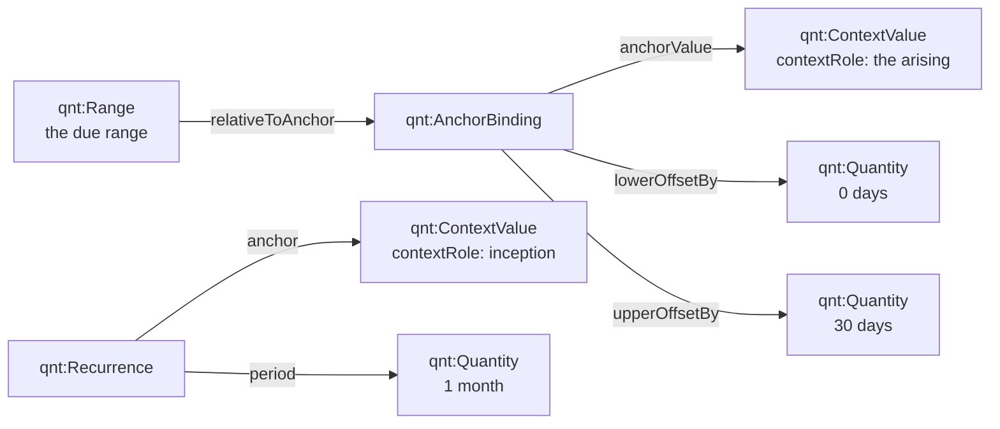
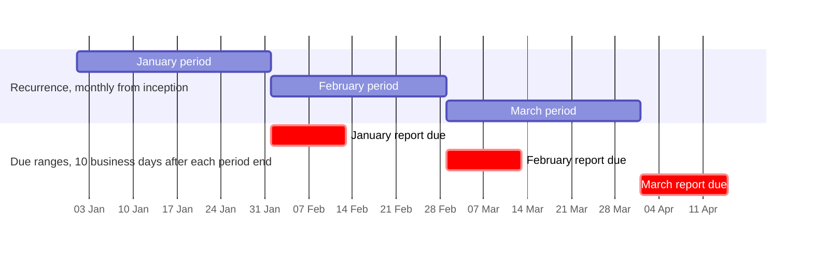
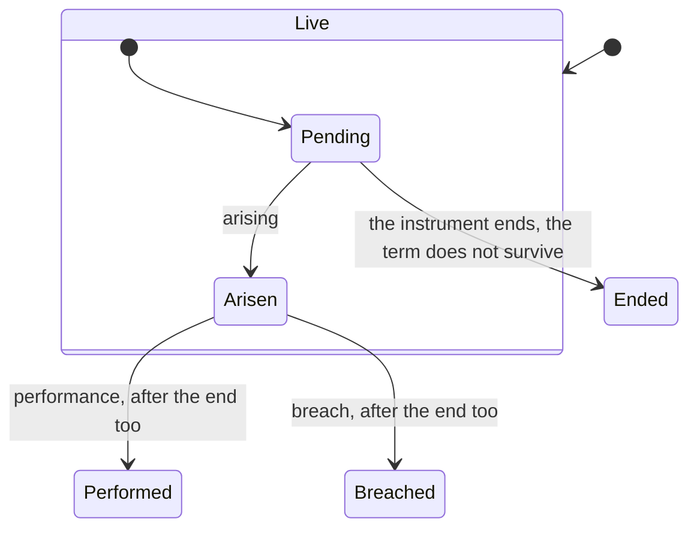
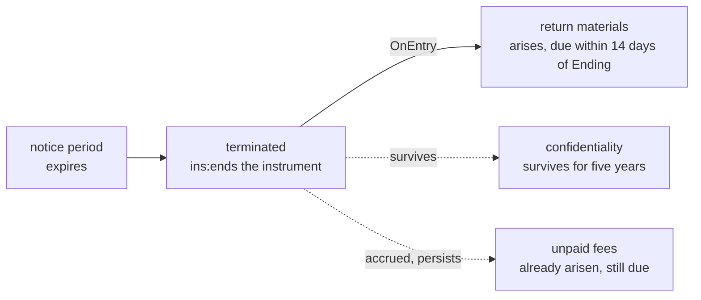
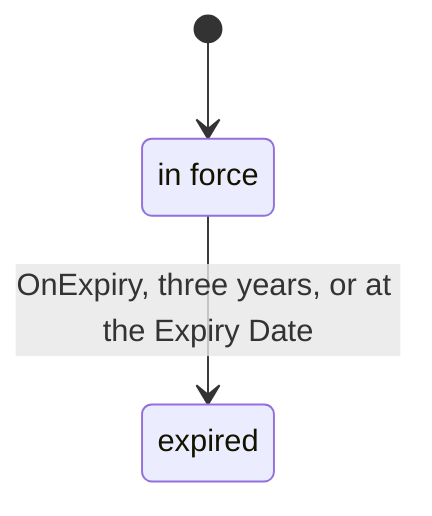
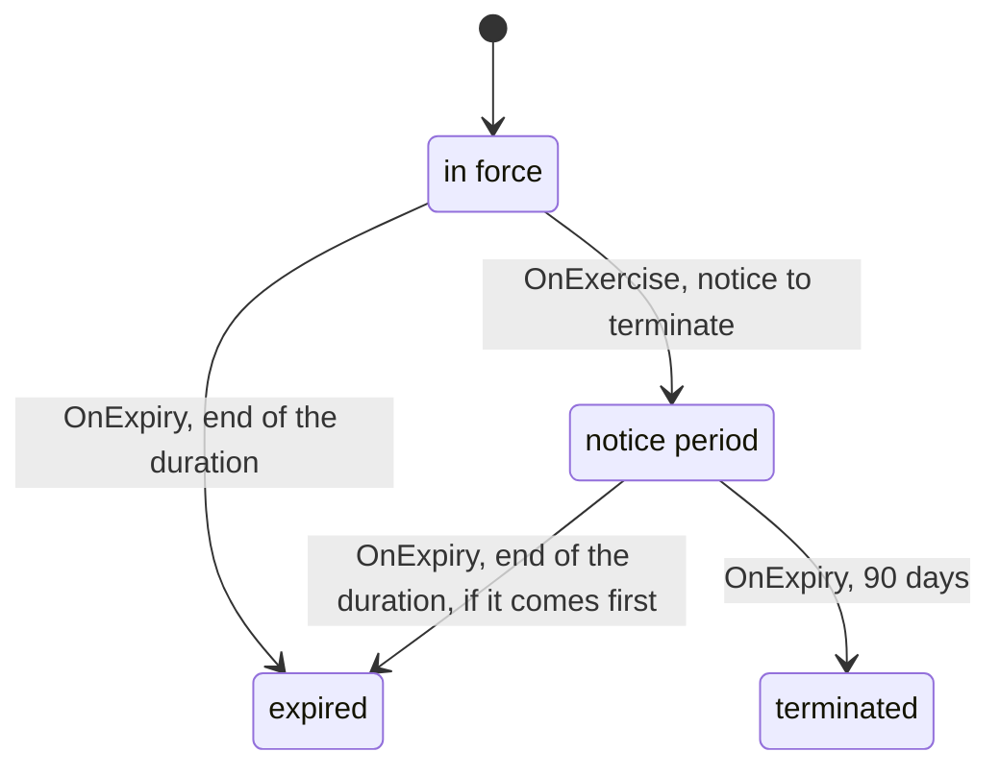
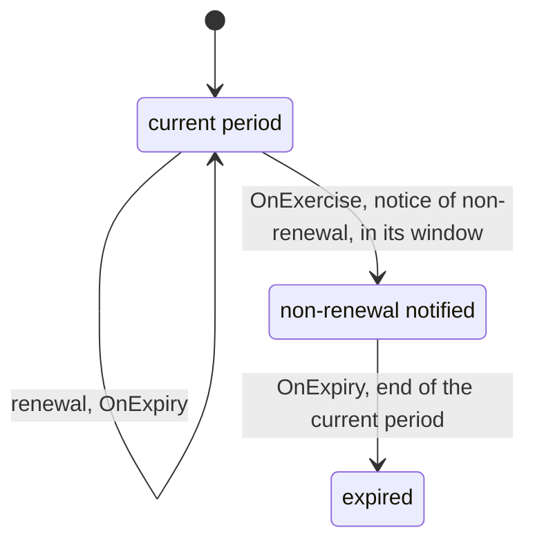

<!-- SPDX-License-Identifier: CC-BY-SA-4.0 -->

# Terms in time: anchored time and the ending of instruments

**Unit:** [`computable-contract-substrate`](../plans/computable-contract-substrate.md), slice C7b.
**Status:** decided 2026-10-05 (TQ1 to TQ7 answered by the human, §9). Designs what C7b-Q3,
C7b-Q4 and C7b-Q5 left open.
**Amends, if accepted:** [ADR-A104](../../architecture/decisions/ADR-A104-instrument-terms-and-legal-relations.md)
decision 6, through an addendum, and Quantification, an additive MINOR under a new ADR-A115.
**Reads with:** the [CCS sketch](computable-contract-substrate.md) §5.5, §7.4 and §7.9, the
[nested states sketch](nested-states-and-history.md), the
[Quantification README](../../../ontology/quantification/README.md) and the
[Instrument README](../../../ontology/instrument/README.md) §4.2.4 and §4.2.13.

---

## 1. Premise

A contract says when things must be done, how long they last, and how it ends. "Within 30 days of
each invoice", "not less than six months before the Expiry Date", "within 10 Business Days after
the end of each month", "this Agreement shall continue for three years", "either party may
terminate on 90 days' notice". Each is stated once, in the words of a clause, and resolves to a
different date for every instrument and every occasion.

This sketch designs two things:

- **Part A, anchored time.** How stated meaning names a time it cannot know, such as "the
  arising" or "the Expiry Date", and how a due range, a window and a recurrence are built on it
  (C7b-Q3, C7b-Q4).
- **Part B, ending.** The ways an instrument or a part of it ends, what ending does to its
  relations, and how the model expresses each (C7b-Q5).

Decided already (2026-10-04): an obligation has at most one due range, and none where its words fix
no time (C7b-Q2). This layer does not model the *reasonable time* that the law implies where no time
is fixed, unless a contract's express words define one. Survival is a node on the term (C7b-Q6), and
`ins:computedBy` is deferred to contract amounts (C7b-Q7).

## 2. Legal terms

| Term | Meaning | Where it lands |
|---|---|---|
| **time for performance**, **falling due** | when an obligation must be performed. An obligation *falls due* when performance can first be demanded | the due range (§4) |
| **accrual** | a right *accrues* when it comes into existence, which may be before it is payable. A debt accrues on supply and falls due on the invoice date | arising (C7a) against falling due (§4) |
| **time of the essence** | a term that any delay is a breach entitling termination | a reading on the term, with C7c's classification |
| **commencement**, **the Term** | the date an instrument takes effect, and the period it lasts. Contract English uses "the Term" for that period, which collides with `ins:Term`, a provision. This layer writes *duration* for the period | the instrument's duration regime (§8) |
| **expiry**, **effluxion of time** | the natural end of an instrument at the end of its duration | an expiry (§8.1) |
| **termination** | an end brought about before expiry, by notice, for breach or on an event. Prospective: it ends the parties' future obligations | an ending state (§7) |
| **rescission** | setting an instrument aside as if it had never been made (*ab initio*), for example for misrepresentation. Retrospective | out of scope here (§10) |
| **discharge** | an obligation's end by performance, agreement, breach or frustration | Behaviour's occasion states, and ending (§7) |
| **accrued rights** | rights and liabilities that arose before termination, which survive it unless the contract says otherwise | the persistence of arisen occasions (§7.2) |
| **survival** | terms that continue to operate after termination, such as confidentiality or an indemnity | `ins:survives` (§7.3) |
| **renewal**, **evergreen** | an instrument continuing for a further period. An *evergreen* or *rolling* contract continues until terminated | §8.3 |
| **break clause** | a power to end an instrument early, exercisable on a date or in a window | a power with an exercise window (§5.3, §8.4) |
| **long-stop date** | the date by which conditions must be met, failing which the instrument ends or never takes effect | §8.6 |
| **lapse** | an offer or an option ending unused at the end of its time | `ins:endsOn` (C7a), with a window (§5.3) |
| **frustration** | discharge of an instrument by an event that makes performance impossible or radically different | out of scope here (§10) |

# Part A. Anchored time

## 3. Use cases

| # | Clause | Anchor | Shape |
|---|---|---|---|
| A1 | "shall report each serious adverse event within 24 hours of becoming aware of it" | the arising of the occasion | up to 24 hours after |
| A2 | "shall pay each invoice within 30 days of its date" | the arising, on the act of invoicing | up to 30 days after |
| A3 | "shall repay each loan on its Maturity Date" | a date the instrument fixes (a variable) | on the day |
| A4 | "shall give notice of non-renewal not less than six months before the Expiry Date" | a date the instrument fixes | up to six months before |
| A5 | "may serve a break notice between six and three months before the Break Date" | a date the instrument fixes | a window with both ends before the anchor |
| A6 | "shall deliver a report within 10 Business Days after the end of each month" | the end of each period of a recurrence | up to 10 business days after |
| A7 | "on each Interest Payment Date", "on the last Business Day of each quarter" | each date of a calendar-aligned recurrence | on the day, with a business day convention |
| A8 | "leverage shall not exceed 3.0 to 1 on each Test Date" | each date of a recurrence | a test date for a continuing obligation |
| A9 | "the Lender may accelerate at any time while an Event of Default is continuing" | none: a regime's state | gating (C7a), not anchored time |
| A10 | "the cure period of 30 Business Days" | entering a state | `ins:OnExpiry`'s `ins:after` (C7a) |
| A11 | "time for payment is extended by any period during which force majeure continues" | the arising, extended | a due range tolled in states, as `ins:tolledIn` (C7a) |
| A12 | "shall return the materials within 14 days after termination" | the instrument's ending | up to 14 days after (with §7.4) |
| A13 | "by 11:00 a.m. London time" | the anchor's day, at a local time | a time of day in a zone (S74, ADR-A94) |
| A14 | "if that day is not a Business Day, on the next Business Day" | a computed date | a business day convention |
| A15 | "the earlier of 30 days after demand and the Expiry Date" | two anchors | a combination (the evaluation context, deferred with `ins:computedBy`) |

## 4. What a design must hold

1. **Stated meaning names, it never gives.** A clause names its anchor (the arising, the Expiry
   Date, the end of each month). The value differs for each instrument and each occasion, and is
   known only at runtime, or once a variable is bound (C8).
2. **One anchor, any offsets.** A due range, a window or a point is the anchor with a lower and an
   upper offset, either open, before or after the anchor (A4, A5).
3. **Offsets carry units, including calendar units.** Business days are counted on a calendar named
   at evaluation (ADR-A94).
4. **Recurrences generate periods, and each period anchors the obligation's occasion** (A6 to A8).
5. **Anchored at a named valid time, never at evaluation time** (law I9).
6. **Tolling applies to due ranges as it does to expiry periods** (A11).
7. **The same construct serves every layer that needs it.** Behaviour's allowance resets and an
   applied capacity model's "reset each policy year from inception" need the same thing as an
   obligation's reporting period.

Requirement 7 is why the design belongs in Quantification.

## 5. Design

### 5.1 Quantification: a value the context supplies

Quantification already has nearly everything:

- `qnt:Range` with `qnt:relativeToAnchor` a `qnt:AnchorBinding`, whose `qnt:anchorValue` is any
  `qnt:Value`
- `qnt:Recurrence`, whose `qnt:anchor` is any `qnt:Value` and whose `qnt:period` is a
  `qnt:Quantity`, units and calendar units included
- `qnt:CalendarUnit`, `qnt:Calendar` and contextual conversions (ADR-A94)

Two things are missing. A value can only be a definite value (a `qnt:Quantity`) or one that is
missing (`qnt:UnresolvedValue`), never one that a context supplies. And an anchor binding's offsets
are unitless decimals in the anchor's own space, so they cannot be business days. The proposal adds
two terms to Quantification, both additive:

```text
qnt:ContextValue  ⊑ qnt:Value      a value supplied by the evaluation context under a named role
  qnt:contextRole   → skos:Concept  exactly one. The role, from a scheme a consuming layer binds to
                                    qnt-voc:ContextRoleContract
  qnt:onSpace       → qnt:ValueSpace  as for every value: the space the supplied value is in

qnt:lowerOffsetBy  AnchorBinding → qnt:Quantity   a signed offset with its own unit
qnt:upperOffsetBy  AnchorBinding → qnt:Quantity   (beside qnt:lowerOffset and qnt:upperOffset,
                                                  which stay for unitless offsets)
```

A `qnt:ContextValue` is distinct from an unresolved value. An unresolved value is a required value
that is missing, with a reason and evidence. A context value is a parameter: complete as stated,
and resolved whenever an evaluation context binds its role. An evaluation that has no binding for
the role is Undetermined, with a diagnostic naming the role.



### 5.2 Instrument: the roles, and where they are used

Instrument supplies the roles, as a baseline scheme bound to Quantification's role contract, and
the properties that use the constructs:

| Role (`ins-voc:`) | Resolved to | Use cases |
|---|---|---|
| `Arising` | the valid time at which the occasion arose (C7a) | A1, A2, A11 |
| `Inception` | the valid time at which the instrument took effect | recurrences from commencement |
| `Ending` | the valid time at which the instrument entered an ending state (§7) | A12, survival periods |
| `PeriodStart`, `PeriodEnd` | the start or end of the recurrence period the occasion belongs to | A6, A8 |
| a date the wording defines ("the Expiry Date", "the Maturity Date", "each Interest Payment Date") | the value of a wording variable, bound per instrument (C8) | A3, A4, A5, A7 |

```text
ins:due         Obligation → qnt:Range       at most one (C7b-Q2). Anchored through a context value
ins:recurrence  Obligation → qnt:Recurrence  one occasion per generated period
ins:window      Power ⊔ Permission → qnt:Range   when the relation may be exercised or used (§5.3)
ins:dueTolledIn qnt:Range → bhv:State         states in which a due range's time does not run (A11)
```

A due range "within 30 days of arising" is stated once, on the stated relation, and a bound
relation restates it in full:

```turtle-example
tmpl:pay-invoice a ins:Obligation , ins:Template ;
    ins:arisesUnder tmpl:term-7-2 ;
    ins:obligor ex:Customer ; ins:obligee ex:Supplier ;
    ins:activity ins-voc:Pay ;
    ins:arisesOn tmpl:on-invoice ;
    ins:due [ a qnt:Range ; qnt:onSpace ex:time ;
        qnt:relativeToAnchor [ a qnt:AnchorBinding ; qnt:offsetKind qnt:Absolute ;
            qnt:anchorValue [ a qnt:ContextValue ; qnt:onSpace ex:time ; qnt:contextRole ins-voc:Arising ] ;
            qnt:lowerOffsetBy [ a qnt:Quantity ; qnt:onSpace ex:days ; qnt:numericValue 0 ; qnt:inUnit ex:day ] ;
            qnt:upperOffsetBy [ a qnt:Quantity ; qnt:onSpace ex:days ; qnt:numericValue 30 ; qnt:inUnit ex:day ] ] ] .
```

This is verbose for the commonest case. The library templates (C8a) carry it, and the README shows
the shorthand reading: *due within 30 days of arising*.

### 5.3 Windows on powers and permissions

Anchored time is not only for obligations. A power is often exercisable only in a window: an option
period, a break window (A5), a period for giving notice of non-renewal. A permission may hold only
at certain times. A window is the same anchored range, on a power or a permission
(`ins:window`). It is distinct from a scope, which says which cases a relation covers, and from a
gate, which says in which regime states it applies. An exercise outside its window has no effect
(law I10). An offer or option that ends unused when its window closes *lapses*. That ending is an
`ins:endsOn` an expiry of the window, or, more simply, follows from the window: once it has closed
the power can never be exercised. The sketch proposes the second reading, so that a lapse needs no
trigger of its own.

### 5.4 Recurrences

A recurring obligation has one occasion for each generated period. The recurrence anchors at a
context value (`ins-voc:Inception` for "each month from the Commencement Date", a calendar date for
"each calendar quarter"), and the due range of each occasion anchors at `PeriodStart` or
`PeriodEnd`. Quantification's existing policies apply: `qnt:boundaryDerivation` for a monthly
recurrence anchored on the 31st, and `qnt:binKeyStrategy` for a stable key per period, which is
also the occasion's case.



A continuing obligation tested on dates (A8) has a recurrence and no due range: each generated
date is a test of `ins:maintains`.

### 5.5 Runtime resolution

The evaluation context binds each role for each occasion: the arising from the occasion's arising
record, inception and ending from the instrument's occupancies, the period bounds from the
recurrence bin, and a wording date from the instrument's variable values (C8). The resolved range
is a definite `qnt:Range`, recorded with the occasion, with `prov:wasDerivedFrom` the stated range.
Its end enters the stimulus log as a positioned stimulus, never as a clock read (law I9). Tolling
extends the range's upper bound by the time spent in the tolling states, as for an expiry. This is
C12's.

### 5.6 What stays open in Part A

- **Business day conventions** (A14) and **times of day in a zone** (A13): Quantification
  conversions under a calendar, or a convention property on the anchor binding. Proposed for
  Quantification with the same release, if small, or held.
- **Combinations of anchors** (A15): the evaluation context's combinators, deferred with
  `ins:computedBy`.

# Part B. Ending

## 6. How instruments end

| # | Ending | Example | Common |
|---|---|---|---|
| E1 | **expiry** at the end of a fixed duration | "this Agreement shall continue for three years from the Commencement Date" | yes |
| E2 | **expiry** on a fixed date | "this Lease expires on 24 June 2032" | yes |
| E3 | **termination on notice** for convenience | "either party may terminate on 90 days' written notice" | yes |
| E4 | **renewal** and **evergreen** continuation | "renews for successive one-year periods unless either party gives six months' notice of non-renewal" | yes |
| E5 | **break** in a window or on a date | "the Tenant may terminate on the fifth anniversary by giving six months' notice" | often |
| E6 | **termination for breach**, at once or after a cure period | "if the breach is capable of remedy and not remedied within 30 days, the other party may terminate" | yes |
| E7 | **automatic termination** on an event | "this Agreement terminates automatically if either party becomes insolvent" | often |
| E8 | **discharge by performance** | "this Agreement terminates once all amounts due have been paid in full" | often |
| E9 | **a long-stop date** for conditions | "if the Conditions are not satisfied by the Long-Stop Date, this Agreement terminates" | often |
| E10 | **termination of a part**: a term, a section, one party's participation, one occasion | "the Sponsor may end the Site's participation", "authority may be withdrawn for any claim" | often |
| E11 | **termination by agreement** | a release, or a new agreement replacing the old | yes |
| E12 | **termination after prolonged force majeure** | "if force majeure continues for more than 90 days, either party may terminate" | often |
| E13 | **rescission** *ab initio* | an instrument set aside for misrepresentation | rare in data |
| E14 | **frustration** | performance made impossible by law | rare in data |

E1 and E3 are the commonest endings, and E4 and E6 follow. Every one of E1 to E12 is a fact the
words state, and the model should express it with the constructs it already has wherever it can.

## 7. What ending does

### 7.1 Ending is entering a state

C7a already models termination on notice as a regime's state: the licence is terminated when it
enters *terminated*. This sketch makes that the one account of ending. A state of a regime may carry
`ins:ends`, naming what entering it ends:

```text
ins:ends      bhv:State → ins-voc:TheInstrument ⊔ ins:Term   what entering the state ends
              the instrument as a whole, or named stated terms (matched to every bound term
              instantiated from them, as C7a's triggers match bound relations)
ins:OnEntry   ⊑ bhv:TriggerDefinition, kind bhv:DerivedTrigger
  ins:ofState → bhv:State   fires when the subject enters the state
```

Every ending of E1 to E12 is then a transition into an ending state, on a legal trigger:

| Ending | The transition into the ending state |
|---|---|
| E1 expiry after a duration | `ins:OnExpiry` `ins:after` the duration, from entering *in force* |
| E2 expiry on a date | `ins:OnExpiry` at a context value (`ins:at` the Expiry Date, §5.2) |
| E3 notice | the C7a notice regime: an exercise into *notice period*, an expiry into *terminated* |
| E4 renewal | §8.3 |
| E5 break | a power with a window (§5.3), whose exercise enters a notice period |
| E6 breach | a power arising on breach, gated by a cure period's expiry where the breach is remediable |
| E7 automatic | an `ins:OnCondition` or `ins:OnAct` straight into the ending state, with no power |
| E8 performance | an `ins:OnCondition` that every obligation of the instrument has been performed |
| E9 long-stop | an `ins:OnExpiry` at the long-stop date, from a *conditional* state that the conditions' satisfaction leaves |
| E10 a part | `ins:ends` naming stated terms, or `ins:endsOn` on one relation (C7a). A party's participation and a section are C7c's and C9's |
| E11 agreement | an amendment or a replacing instrument (C9) |
| E12 prolonged force majeure | a power arising on an `ins:OnExpiry` in the force majeure regime's affected state |

### 7.2 What ending does to relations

Termination is prospective. On entering an ending state:

- **no new occasion arises** under an ended term, unless the term survives (§7.3)
- **occasions already arisen persist**: accrued rights and liabilities survive termination (law I3).
  An arisen duty to pay remains due, and a breach before termination remains a breach
- **occasions pending end**: a relation that applied to a case but had not yet arisen for it cannot
  now arise, so its occasion moves to `bhv:Ended`
- **relations arising on termination arise**, through an `ins:OnEntry` of the ending state (§7.4)



### 7.3 Survival

`ins:survives` on a term names an `ins:Survival`, with an optional period (a `qnt:Quantity`
anchored at `Ending`) and an optional condition (`ins:survivesUntil`). With neither, the term
survives without limit. A surviving term goes on giving rise to occasions after the ending, until
its period or condition ends it. Accrued occasions need no survival (§7.2).

### 7.4 Consequences of termination

"On termination, the Licensee shall return all materials", "the deposit shall be repaid within 30
days after the Lease ends", "the Supplier shall provide transition assistance for six months". Each
is a relation arising on entering the ending state (`ins:arisesOn` an `ins:OnEntry`), whose due
range may anchor at `Ending`. A run-off or wind-down period is a regime entered on the same trigger.
Such a relation arises only once the instrument has ended, so its term must survive, or it could
never arise. A term whose relations arise on an `ins:OnEntry` of an ending state therefore survives
for that purpose without saying so (TQ5).



## 8. The common endings in detail

### 8.1 Expiry

A fixed duration (E1) counts from entering the initial state, which is when the instrument takes
effect. A fixed date (E2) is an `ins:OnExpiry` at a context value, which needs one addition to C7a's
trigger: `ins:at` (a `qnt:Value`, typically a `qnt:ContextValue` for "the Expiry Date"), as an
alternative to `ins:after`.



### 8.2 Notice and expiry together

Most instruments have both. They are one regime with two ways out, since the instrument is in one
of its states at a time:



*Expired* and *terminated* both carry `ins:ends`, and both have the state kind that says which,
for readers and reports.

### 8.3 Renewal and evergreen contracts

"Renews for successive one-year periods unless either party gives six months' notice of
non-renewal" is a regime whose expiry leads back into a further period unless notice was given:



The renewal is an external self-transition (`bhv:transitionType bhv:External`), so the period
restarts on re-entry (nested states sketch §4.1). The notice of non-renewal is a power with a window
(§5.3) that closes six months before the period ends, anchored at the period's end.

### 8.4 Breaks

A break (E5) is a power with a window or a date, whose exercise enters a notice period that ends in
*terminated*, as in §8.2.

### 8.5 Termination for breach

A remediable breach starts a cure period, and the power to terminate arises if it expires uncured:
the C7a facility's cure period, with the termination power gated by *default*. An irremediable
breach gives the power at once: a power arising on breach (C7a). Its exercise is a transition
straight into *terminated*.

### 8.6 Conditions and long-stop dates

An instrument whose obligations wait on conditions (E9) starts in a *conditional* state. Satisfying
the conditions moves it to *in force*, and the long-stop date's expiry moves it to *terminated*.
When the instrument as a whole takes effect only on conditions, that is `ins:takesEffectWhen`, which
is C9's.

## 9. Questions for the human

- **TQ1. Anchored time in Quantification** (§5.1). Add `qnt:ContextValue`, `qnt:contextRole` with
  its role contract, and the quantity offsets `qnt:lowerOffsetBy` and `qnt:upperOffsetBy`, as an
  additive Quantification MINOR. Its cost is a re-pin cascade to every importer: Party, Eligibility,
  Wording, Behaviour, Surface, Instrument and the applied modules, mechanically as F1 did, and
  cleared with any parallel workstream first (risk R6). The alternative is an Instrument-local
  design, which would leave Behaviour and capacity without the construct. **Recommendation:**
  Quantification. **Answered: Quantification.**
- **TQ2. Business day conventions and times of day** (§5.6). Add them to Quantification in the same
  release, or hold them. **Recommendation:** hold, unless the examples need them, and record the
  use cases. **Answered: held**, with A13 and A14 recorded as held design question HQ-3. They are
  needed once there are business continuity examples.
- **TQ3. Windows on powers and permissions** (§5.3). Add `ins:window` in C7b, with lapse following
  from a closed window. **Recommendation:** yes. Breaks, options and notices of non-renewal are
  among the commonest clauses. **Answered: yes.**
- **TQ4. Ending is entering a state** (§7.1). `ins:ends` on a regime's state, naming the instrument
  or stated terms, and a sixth legal trigger, `ins:OnEntry`. Ending at the moment of a power's
  exercise is a transition straight into the ending state. **Recommendation:** yes. It needs an
  ADR-A104 addendum to decision 6. **Answered: yes.**
- **TQ5. Relations arising on termination** (§7.4). A term whose relations arise on entering an
  ending state either survives implicitly for that purpose, or must state `ins:survives`.
  **Recommendation:** implicit, since requiring the authored survival would make every "on
  termination" clause carry a redundant statement. The shapes report a contradiction, such as a
  survival that ends before the relation's due range. **Answered: implicit.** Requiring express
  wording would not work in practice, because contracts rarely say that their termination
  consequences survive termination.
- **TQ6. Expiry at a date** (§8.1). Add `ins:at` to `ins:OnExpiry` beside `ins:after`.
  **Recommendation:** yes. It is the commonest expiry. **Answered: yes.**
- **TQ7. What ending does to pending occasions** (§7.2). They end. **Recommendation:** yes, the
  law's prospective reading. **Answered: yes.**

## 10. Out of scope here

- **Rescission *ab initio*** (E13) undoes occasions that arose. It needs retroactive records
  (ADR-A67, S19), and waits for C12.
- **Frustration** (E14) is a legal finding about the whole instrument, outside its words.
- **A party's participation and a section** ending (E10) are C7c's and C9's.
- **Termination by agreement** (E11) is an amendment or a replacing instrument (C9).
- **Reasonable time**, implied where no time is fixed, is not modelled unless the words define it
  (C7b-Q2).
- **Combinations of times** (A15) wait for the evaluation context.
