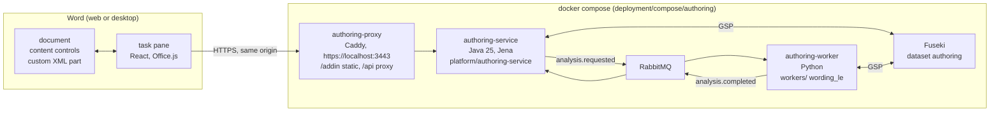

<!-- SPDX-License-Identifier: CC-BY-SA-4.0 -->

# Word authoring proof of concept

Draft for review, 2026-10-01. A spike: a Microsoft Word add-in, with no local installation, through
which a drafter writes a contract wording into a template, marks its variables and defined terms,
and sees the wording read as Logical English and the meaning a backend proposes for it.

**Plan:** [word-authoring-poc.md](../plans/word-authoring-poc.md).
**Status record:** [word-authoring-poc.md](../status/word-authoring-poc.md).
**ADR:** [A-114](../../architecture/decisions/ADR-A114-word-authoring-proof-of-concept.md), Proposed.
**Inputs:** [computable-contract-substrate.md](computable-contract-substrate.md) (CCS) §4 and §5,
[logical-english-alignment.md](logical-english-alignment.md) (LE) §2 and §6,
[ADR-A112](../../architecture/decisions/ADR-A112-wording-layer.md).

---

## 1. What the spike tests

CCS §4 models a text as ordered parts: literals, variable references and object references. LE §2
argues that those parts already are a Logical English sentence's fixed words, slots and constants,
so a clause written with its parts marked can be matched to a sentence form without parsing
English (route D). The spike tests both claims where drafters work, in Word.

| Claim | Shown when |
|---|---|
| A drafter can mark text parts in Word without the markup getting in the way | the sample documents are marked up by hand in Word on the web, and the markup survives save, reopen and edit |
| The marked document maps to the Wording layer without loss | the snapshot round-trips (document → JSON → RDF) and the RDF passes the POC shapes for laws W1 and W2 |
| Templates can say which kinds of term belong in which section | a Prohibition drafted into a licence's Grant section is flagged |
| Marked parts make LE matching mechanical | sample clauses match declared sentence forms with no language model, and unmatched clauses are reported, not guessed |
| A proposed meaning can be shown beside the words | each matched clause yields an `ins:` relation node with its party and parameter bindings, drawn in the task pane |

Out of scope: assembly (CCS §4.4), amendments (§4.6), tables (§4.3), versioned elements, binding
meaning (CCS-D12's `ins:boundIn`), accepting a proposal, multi-user editing, authentication, the
Store SPI (ADR-A75), production deployment.

---

## 2. Shape



| Part | Where | Does |
|---|---|---|
| add-in | `apps/word-authoring-addin` | applies templates, marks parts, reads the body's OOXML into a snapshot, shows findings, LE and the proposed graph |
| service | `platform/authoring-service` | validates the snapshot, maps it to `wrd:` RDF, stores it in Fuseki, runs SHACL and construct detection, checks template conformance, queues analysis, seeds samples |
| worker | `workers/src/lattice_workers/wording_le` and `wording_analysis_worker.py` | reads the wording graph, matches sentence forms, classifies modality, writes spans, an LE program and a proposal graph |
| contracts | `contracts/authoring`, `contracts/events`, `contracts/openapi` | JSON Schemas, templates, samples, fixtures shared by the three runtimes |
| stack | `deployment/compose/authoring`, `tools/authoring_stage.py` | one command builds, stages and starts everything, with the samples seeded |

Java owns everything synchronous and structural. Python owns the linguistic reading, run as a job.
Jobs carry graph references, never RDF, as the existing workers do.

---

## 3. The document

### 3.1 Markup

Word content controls carry the structure. A short tag identifies each control to the add-in, and
the colour and title show it to the drafter, so the distinction is visible and in the data at once.

| Construct | Content control | Tag | Shown as |
|---|---|---|---|
| section | block, rich text | `lat:s:<sectionKey>` | bounding box, grey, title "Section: Interest" |
| clause | block, rich text | `lat:e:<uuid>` | bounding box, blue, title "Clause" |
| definition | block, rich text | `lat:d:<uuid>` | bounding box, purple, title "Definition" |
| defined term inside a definition | inline | `lat:term` | tags, purple, title "Term" |
| variable reference | inline | `lat:v:<variableKey>` | tags, orange, title "Variable: margin" |
| reference to a defined term | inline | `lat:r:<uuid of the definition>` | tags, green, title "Defined term: Borrower" |
| everything else in a clause | none | — | a literal part |

One custom XML part (`urn:nebularis:lattice:authoring:1`) holds the document id, the template id and
the variable declarations (key, label, value type). Nothing is written into the text itself, so the
document prints and reads as an ordinary contract.

A clause in the facility sample, as the drafter sees it and as the parts read:

```text
[Clause [Defined term: Borrower] shall pay interest on each Loan at [Variable: margin] per annum.]
          ↑ object reference              literal                  ↑ variable reference   literal
```

### 3.2 Templates

A template names the sections a document has, which element kinds each holds (clauses or
definitions) and which kinds of term each section admits, with guidance for the drafter and the
variables the form expects. Applying a template writes the headings and empty section and element
controls into the document. The guidance stays in the task pane.

| Template | Sections and admitted term kinds |
|---|---|
| facility agreement | Definitions (Definition), Commitment (Obligation, Permission), Interest (Obligation), Repayment (Obligation), Undertakings (Obligation, Prohibition), Events of Default (Power, Deeming) |
| software licence | Definitions (Definition), Grant (Permission), Restrictions (Prohibition), Fees (Obligation), Warranty Exclusions (Exclusion), Termination (Power) |
| property policy | Definitions (Definition), Insuring Clause (Obligation), Exclusions (Exclusion), Conditions (Obligation, Prohibition), Claims (Obligation, Deeming) |

The two neutral templates come first, as ADR-A-C2 asks of substrate examples. The insurance
template is there because it is where "which terms belong where" is most familiar (decision WA-D9).

### 3.3 Marking text

The author selects words and then chooses what they are, in any of three places:

| Where | How |
|---|---|
| right-click | a LATTICE submenu: Mark as clause, definition, defined term, variable…, reference to a defined term…, Remove LATTICE mark |
| ribbon | a LATTICE group on the Home tab with the same commands, plus Show pane and Analyse |
| task pane | the Markup tab's buttons and forms, and Accept on each suggestion after Analyse |

Commands that need no input act at once. "Variable…" opens the pane with a key and value type
proposed from the selected words, for the author to confirm. "Reference to a defined term…" marks at
once when the words match one definition, and otherwise opens the pane to pick one. A command that
cannot act opens the pane and says why. The commands share the task pane's code through Office's
shared runtime (decision WA-D13). A Word client without it shows only the task pane.

### 3.4 Reading the document

The add-in reads the body's OOXML in one call and parses it. The parser is a pure function, so it
is tested against OOXML fixtures without Word. The add-in writes templates and samples the same way,
by generating OOXML and inserting it, so the writer and parser are tested as a round trip.

---

## 4. The backend's reading

### 4.1 Mapping to the Wording layer

**Historical baseline:** this section describes the implemented POC's provisional mapping.
Wording is now published. The deferred adoption assessment below does not change that mapping.

`wrd:` has no ontology document yet (CCS C3 waits for Gate A). The spike uses the sketch's IRIs for
the terms CCS §4 names, in a provisional vocabulary held by the service, and a POC namespace `wap:`
for what the sketch leaves unnamed. Nothing is added under `ontology/`, so no version changes.

| Snapshot | RDF | CCS term or POC gap |
|---|---|---|
| document | `wrd:Wording` | §4.1 |
| section | `wrd:Element`, `wrd:elementType wap:Section` | §4.1 |
| clause | `wrd:Text`, `wrd:elementType wap:Clause` | §4.1 |
| definition | `wrd:Text`, `wap:DefinitionText`, `wap:definedTerm` | gap: how a definition names its term |
| part | `wrd:TextPart`, `wrd:partIndex`, `wrd:partText` | §3.2 |
| text to part | `wap:hasPart` | gap: the sketch names no property |
| variable part | `wrd:refersToVariable`, `wap:displayText` | §3.2. Displayed text kept apart so W2's three forms stay exclusive |
| reference part | `wrd:refersToObject`, `wap:displayText` | §3.2, as the variable part |
| variable | `wrd:EmbeddedVariable`, `wrd:variableKey`, `wap:valueType` | §4.2. `wap:valueType` stands in for `wrd:valueContract` |
| position | `wrd:rankKey`, and `wrd:objectId` derived from position | §4.1, W7 |
| tree | `wrd:directlyComprises` | §4.1 |

The gaps are listed for C3. Element versions (`fnd:Version`) are not modelled: each revision is its
own named graph.

### 4.1.1 Deferred: adopt the published Wording ontology

**Recorded 2026-10-02. Not scheduled or authorised for implementation.** The human reports that
the POC runs successfully and that Wording is published and stable. The current repository has
[Wording 0.2.0](../../../ontology/wording/README.md), its
[vocabulary](../../../ontology/wording/vocab/wording-vocab.ttl), and
[structural shapes](../../../ontology/wording/shapes/structural.ttl). Pin the selected published
versions when this tranche is approved. Revisit ADR-A114 decision 5 and WA-D3 first, since both
deliberately chose a provisional vocabulary. This note is an impact assessment, not an ADR approval.

The bounded first step would adopt published structure and typing while keeping the existing
Word tags, OOXML, JSON snapshots, sentence forms and task pane behaviour. It need not introduce
assembly, tables, amendments, or full Instrument adoption. Full semantic alignment has a larger
data-model impact than replacing vocabulary constants.

| Surface | Impact |
|---|---|
| Java `rdf/Vocab` and `WordingMapper` | Replace `wap:hasPart` with `wrd:hasTextPart`. Map the existing section, clause and definition kinds to `wrd-voc:Section`, `wrd-voc:Clause` and `wrd-voc:Definition`. Preserve `wrd:directlyComprises`, rank keys, object ids and the three text-part forms. |
| SKOS scheme bindings | Resolve kinds by configured concept IRIs, not labels or local-name parsing. Use the published baseline as the POC default, while allowing a deployment's selected scheme and explicit mappings. Load concept membership and scheme-contract data for validation. Unknown or unbound concepts must produce findings, not silently become a clause. |
| Python `wording_le/model.py` | Change section selection and element-kind comparisons, and read `wrd:hasTextPart`. Keep the internal `Element`/`Part` model so tokenisation, offsets, matching and LE rendering need not change. Replace `_load_variable`'s namespace-local-name decoding if variable typing is migrated. |
| Variable declarations | `wap:valueType` is not a direct rename to `wrd:valueContract`. The published model distinguishes concept-valued variables (`voc:SchemeContract`) from quantity-valued variables (`qnt:ValueSpace`), with admissible ranges and population methods. Decide mappings for each POC value type, including text, date and party. Retaining `wap:valueType` temporarily must be documented as partial adoption. |
| POC extensions | Retain application metadata, definition-term metadata and `wap:displayText` where no published equivalent exists. Display text preserves the exact Word text and UTF-16 offsets. Do not delete the entire provisional resource: it also declares proposal-side `ins:` and `wap:` terms outside this tranche. |
| Java `validation/WordingValidator` | Package pinned ontology, vocabulary, imports and shapes through the local catalog. Supply the required subclass/type evidence without adding a runtime reasoner (ADR-A83). Compose published structural shapes with POC-specific checks. Published structural shapes alone do not replace all WS1 to WS11 or validate every SKOS scheme binding. Map normative shape IRIs to the existing result contract, whose IDs currently require `WS<n>`, or explicitly version that contract. |
| Tests and packaging | Update canonical Wording `.nt` fixtures and hashes, cross-runtime vocabulary checks, and any affected proposal fixtures. Add a producer-to-reader contract test that preserves text, offsets, LE readings and conformance results. Package semantic assets offline in the service artifact, with no network import resolution. |

SKOS does not itself require another runtime dependency: Jena and RDFLib can read these triples.
Concept schemes are data, not new Java subclasses or TypeScript enums. The current JSON enums
can remain an authoring profile projected onto configured concepts. Exposing arbitrary schemes
in the UI would be a separately approved contract and UX expansion.

Two decisions control the larger scope:

- **Version identity.** Published `wrd:Wording` and `wrd:Element` are Foundation versions. The POC
  reuses resource IRIs across revision graphs and has no `fnd:hasIdentity` or supersession model.
  Named graphs alone do not implement immutable versions. Decide whether the first tranche is
  explicitly partial adoption or introduces version-specific IRIs and persistent identities,
  updating `IriMinter`, registry links and proposal `ins:expressedIn` targets together.
- **Stored data.** Decide between preserving old graphs with an explicit compatibility reader,
  migrating them, or an explicitly approved disposable-demo reset. Changed triples change hashes.
  Existing revision records, queued graph references and stored analyses must remain consistent.
  Reseeding skips documents already registered, so restarting the stack is not a data migration.

Before implementation, propose the ADR amendment and a separate tranche plan with slices of at
most two modules each. Validation must cover zero-part and dangling-reference failures, scheme
membership and an alternate configured scheme, unsupported value mappings, cross-runtime
reading, and the chosen old-data/version policy. Preserve existing tests and POC-only checks.
Ontology source changes are not needed merely to consume a release. Any later ontology change
must follow the ontology versioning policy in the same change.

### 4.2 Checks

| Check | Runs in | Finds |
|---|---|---|
| JSON Schema | service | a malformed snapshot, before any RDF is made |
| SHACL, POC shapes | service | W1 (one parent), W2 (part indices and forms), dangling references, duplicate defined terms, unused variables |
| construct detection | service | literal text that looks like a variable (placeholders, amounts, rates, dates, periods), defined terms used without a reference, cross-references |
| template findings | service | empty required sections, unknown sections, text outside any clause |
| sentence forms | worker | each clause's form, its spans, its LE sentence |
| term-kind conformance | service, on the worker's result | a clause whose proposed kind its section does not admit |

Detection proposes and the drafter accepts. An accepted detection becomes a content control. The
backend never edits the document.

### 4.3 Logical English

The worker holds a small sentence-form profile (LE-Q2's "rendering profile", local to the POC).
Each form is an LE template with typed slots and the relation class it proposes, such as
`*a party* shall not *an activity*` for a Prohibition. "shall" stays fixed words (LE-Q3).

A clause is tokenised with its parts kept whole: a variable reference is one slot token, a reference
one constant token. Matching compares fixed words, ignoring LE's ignorable words, and binds slots by
type. A party slot takes only a reference, a variable slot only a variable reference, an activity
slot one or more words. When no form matches, a keyword rule may still classify the clause, and says
so (`basis: keyword`). When neither does, the clause is reported as unmatched, which is the expected
result for drafted English (LE §2, "where the fit stops").

The result for each clause is a list of spans with roles (fixed, ignorable, slot, constant, modal,
connective, unmatched), which the task pane colours, and the document as an LE program text that a
reviewer can copy into LE2's editor (route A, without running LE2).

### 4.4 The proposed graph

For each classified clause the worker writes a node of the proposed `ins:` class,
`ins:expressedIn` the clause, with `ins:obligor` or `ins:holder` pointing to a role named by the
referenced definition, and an `ins:ParameterBinding` with `ins:fromVariable` for each variable slot.
The graph is a proposal: it lives in its own named graph, is generated by a recorded activity, and
nothing reads it as meaning. The task pane draws it as a diagram and shows its Turtle.

---

## 5. Delivery without installation

An Office web add-in is a web page Word loads in a pane. It needs a manifest and an HTTPS origin,
and no software on the machine.

- The stack serves the add-in and the API from one origin, `https://localhost:3443`, through Caddy.
  One origin means no CORS and no mixed content.
- Caddy's internal CA signs the localhost certificate. The drafter trusts that CA once, in the
  current user's certificate store, which needs no administrator rights.
- The manifest is uploaded in Word on the web (Add-ins, Upload My Add-in), or registered for desktop
  Word with one user-level registry value. A tenant administrator can deploy it centrally instead.
- A harness page runs the same task pane against an in-memory document, so every UI test runs
  without Word.

---

## 6. Risks

| # | Risk | Mitigation |
|---|---|---|
| R1 | The tenant blocks uploading add-ins | desktop sideload by registry value, or central deployment by an administrator. The harness proves everything but Word itself |
| R2 | Word's OOXML differs from the fixtures | the task pane has a "copy body OOXML" debug action, and a captured document becomes a fixture |
| R3 | The browser blocks a public page framing `https://localhost` (Private Network Access) | desktop Word, whose WebView2 is not subject to it |
| R4 | Package registries on machine S (TLS interception, mirror gaps) | a preflight slice checks every new dependency before any code, and images are built from artefacts staged on the host |
| R5 | The provisional `wrd:` terms drift from what C3 decides | the gap table in §4.1 is handed to C3, and the POC code keeps all IRIs in one constants class per runtime |
| R6 | The proposal is read as meaning | its own graph, `prov:wasGeneratedBy`, and no reader of it outside the task pane |

---

## 7. Decisions

The plan's §3 lists the decisions (WA-D1 to WA-D13) with recommendations. None is taken by the agent.
