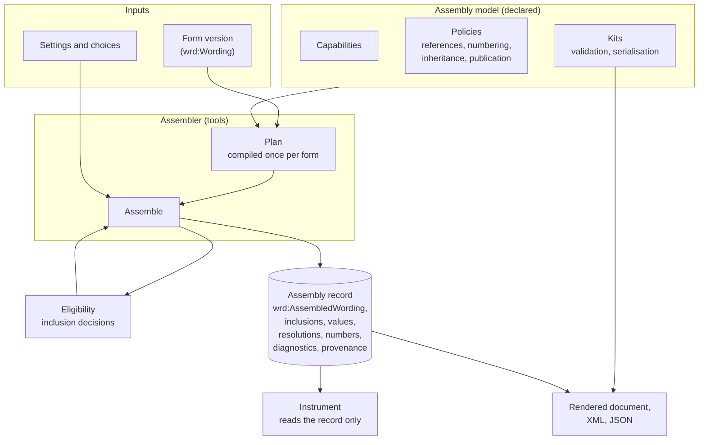
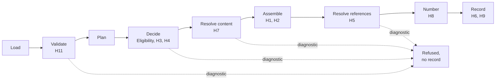
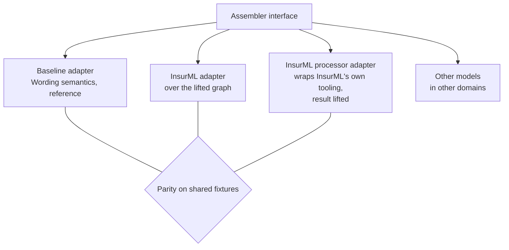
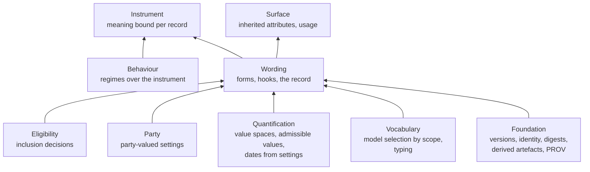

<!-- SPDX-License-Identifier: CC-BY-SA-4.0 -->

# An assembly interface for Wording, with InsurML as the insurance default

**Unit:** [insurml-alignment](../plans/insurml-alignment.md), decision IMA-D17. **Status:** sketch,
2026-10-06, for the human's review. Nothing here is ratified. The domain-neutral parts need a
Wording ADR, and the tools need a topology ADR.
**Reads with:** the [Wording README](../../../ontology/wording/README.md) §5.11 to §5.13 and §8,
[the bridge sketch](insurml-bridge.md) §7 to §12 (which this reframes), [the typing
sketch](insurml-typing.md), the InsurML specification chapter 6 (its document architecture and
processing model), ADR-A19 (staged compilers), ADR-A28 (parity), ADR-A83 (optional backends),
ADR-A85 (scoped binding) and ADR-A92 (derived artefacts).

---

## Contents

1. [The question](#1-the-question)
2. [What Wording has, and what it lacks](#2-what-wording-has-and-what-it-lacks)
3. [InsurML's assembly concepts, one by one](#3-insurmls-assembly-concepts-one-by-one)
4. [The design: models, hooks and one record](#4-the-design-models-hooks-and-one-record)
5. [Assembly models](#5-assembly-models)
6. [The hooks](#6-the-hooks)
7. [The assembly record](#7-the-assembly-record)
8. [The assembler interface in tools](#8-the-assembler-interface-in-tools)
9. [How assembly meets the other strata](#9-how-assembly-meets-the-other-strata)
10. [InsurML as the insurance default](#10-insurml-as-the-insurance-default)
11. [Laws](#11-laws)
12. [Where it lives, and alternatives](#12-where-it-lives-and-alternatives)
13. [Neutral cases](#13-neutral-cases)
14. [Effect on the plan and the other sketches](#14-effect-on-the-plan-and-the-other-sketches)
15. [Open questions](#15-open-questions)

---

## 1. The question

InsurML has a worked-out model of assembly: a manifest of inclusion entries, a normative
processing model with its errors, reference resolution within a contract's scope, inherited
attributes, generated numbers and a publication step. Wording has the result of assembly, an
assembled wording with its inclusions and values, and the laws it must satisfy, but no mechanism.
The aim is to adopt InsurML's mechanism for insurance without making the substrate
insurance-shaped, so that a facility agreement, a trial protocol or a licence can be assembled
under another mechanism, or under LATTICE's own.

The answer proposed here is an interface with three parts. **Assembly models** declare how forms
are assembled. **Hooks** are the points at which a model's mechanism meets LATTICE's layers. **One
assembly record** is the same whichever model produced it, and every other stratum reads only that
record.

## 2. What Wording has, and what it lacks

### 2.1 Touch points that exist

| Touch point | Where | What it gives assembly |
|---|---|---|
| library form and instance | `wrd:Wording`, `wrd:AssembledWording`, `wrd:assembledFrom` (§5.12) | the input and the output, kept apart |
| inclusions, recorded once | `wrd:includes`, recorded at assembly, never recomputed | the result of resolving parts |
| inclusion modes and alternatives | `wrd:inclusionMode` (Mandatory, Variation, Optional, Conditional), `wrd:VariationSlot`, `wrd:hasVariant` (§5.11) | what may be included, and how |
| inclusion conditions | `wrd:includedWhen` to an `elg:AdmissionProfile`, `wrd:readsVariable`, each value posed as an `elg:Question` | conditions with Eligibility's semantics, three-valued |
| variables and values | `wrd:GoverningVariable`, `wrd:EmbeddedVariable`, `wrd:VariableValue`, `wrd:populationMethod`, `wrd:populatedFrom`, `wrd:admissibleValues` (§5.9, §5.12) | settings, checked against their declarations (W6) |
| laws on the result | W3 to W6 (§8), W7 for derived object ids | what any assembly must produce |
| text with references | text parts with `wrd:refersToObject` and `wrd:refersToVariable`, `wrd:Reference`, `wrd:linksTo` | references a resolver can work on |
| content outside the graph | `wrd:DocumentObject`, `wrd:ExternalDocument` | the idea of content held elsewhere |
| change after issue | `wrd:Amendment` with five operations, bespoke elements derived from library ones (§5.13) | re-assembly after an endorsement |
| model selection by scope | Vocabulary's scheme contracts, bindings and scopes (ADR-A85) | a way to choose a model per context |
| design-time checks | slot conditions checked as a set (C5), every kind in CCS C13a | verification before any instance |
| compilation and parity | Eligibility's compilers (ADR-A19), the parity gate (ADR-A28) | compiled plans, and agreement between two realisations |
| provenance and derived artefacts | Foundation's evidence mixin, PROV alignment, `fnd:DerivedArtefact` (ADR-A92) | an assembly as an activity, a plan as a derived artefact |
| read paths | Surface promotions | inherited attributes and usage indexes, generated and disposable |
| storage | Persistence profiles and aggregate boundaries (ADR-A78) | an assembled wording as one aggregate |
| diagnostics | Executable's `exe:Diagnostic` | typed reasons for a refusal or an Undetermined outcome |
| the instrument link | law I1: an instrument version is expressed in exactly one assembled wording | where meaning meets the result |

### 2.2 What is missing

| Gap | Effect today |
|---|---|
| no statement of which mechanism assembled a wording | two assemblies cannot be compared, and an adopter cannot plug in its own |
| no capability declaration | nothing says which constructs a mechanism understands, so a form can be handed to a mechanism that silently drops what it cannot read |
| no reuse of one element version in many forms | bridge §8 |
| no structure inside a sentence | bridge §9 |
| inclusion conditions read governing variables only | clause dependencies need derived variables (bridge §10) |
| no declared treatment of a Denied or Undetermined inclusion | fallback and "ask the question" are a consumer's guess |
| references name versions, and no resolution is recorded | bridge §11 |
| no inheritance of attributes along the assembly | a section's governing law or a translation's legal status has no home |
| no numbering record | object ids are derived (W7), but how is not stated |
| no publication view | guidance and drafting notes cannot be left out by rule |
| no assembly errors | a form with no applicable alternative has no typed failure |
| no assembler | nothing runs it |

## 3. InsurML's assembly concepts, one by one

Each InsurML concept is given one of three dispositions. **Exists**: Wording already has it.
**Hook**: the interface gains a domain-neutral point that InsurML's model fills, and other models
may fill differently. **Model only**: it belongs to InsurML's model and is not lifted into the
substrate.

| InsurML concept | Disposition | In the interface |
|---|---|---|
| exact versions (D80) | exists | `wrd:includes` names versions |
| condition, variable equals value (D81) | exists | an `elg:ExactCondition` in an admission profile, evaluated by Eligibility |
| set of alternatives, exactly one applies (D81, D139) | exists | a variation slot |
| suitability as a condition (D82) | exists | an inclusion condition |
| user selection | exists | inclusion mode Optional |
| settings (Q33) | exists | `wrd:VariableValue` records |
| inclusion entry with its own position and condition (D79) | hook H1 | transclusion (bridge §8) |
| optional phrase, alternatives inside a sentence (D131) | hook H2 | inline parts (bridge §9) |
| include if, exclude if (D130) | hook H3 | inclusion dependencies |
| fallback (D130) | hook H4 | decision treatment |
| selectable if (D130) | model only | what a builder offers. The model's builder reads it |
| scope and reference resolution by shared identifier (D84) | hook H5 | reference resolution policy and its records |
| inheritance along the assembly (D83) | hook H6 | inherited attributes |
| finding the XML and the drift check (D85) | hook H7 | content resolution with digests |
| numbering and generated numbers (D93, D138, Q32) | hook H8 | numbering policy and its record |
| content status, guidance left out when published (D104, D132) | hook H9 | publication view |
| processing steps and their errors (D86) | hook H10 | the assembly stages and their diagnostics |
| validation of the manifest against InsurML's shapes | hook H11 | form validation by the model's kit |
| the assembled contract as XML (D117) | hook H12 | serialisations, as kits |
| endorsement as inclusion or exclusion (D87) | exists, and hook H13 | amendments, and re-assembly after them |
| the manifest as RDF, components as XML files | model only | how InsurML's model reads a form. The lift turns it into Wording |
| path rule `components/{id}/{date}.xml` | model only | InsurML's content resolver (H7) |
| stored SPARQL queries per step | model only | how InsurML's model computes its steps |
| `iml:position` integers in tens | model only | lifted to rank keys |

Thirteen hooks, of which H1 and H2 change Wording's structure and the others add declarations,
records or diagnostics.

## 4. The design: models, hooks and one record



| Part | Holds | Where |
|---|---|---|
| assembly model | what a mechanism can read, its policies, its kits | declared as data in Wording's vocabulary. InsurML's model in the applied insurance profile |
| hooks | the points at which a model's mechanism meets LATTICE | Wording (H1 to H9, H13), Executable diagnostics (H10), kits (H11, H12) |
| assembly record | the result, the same for every model | Wording |
| assembler | the mechanism, as code behind one interface | tools, with one adapter per model |

The record is the interface for everything above Wording. Instrument, Surface and Persistence never
learn which model assembled a wording. Only the assembler and the model's kits know.

## 5. Assembly models

An assembly model is a concept in a scheme bound to a new contract,
`wrd-voc:AssemblyModelContract`, so a deployment chooses its models per scope as it chooses any
scheme (ADR-A85). Wording ships one baseline model, its own semantics of §5.11 to §5.13. A model
carries its declarations as data:

| Declaration | Says | Example, baseline | Example, InsurML |
|---|---|---|---|
| inclusion modes | which modes it reads | all four | all four |
| condition kinds | which Eligibility condition kinds it evaluates natively | every kind | exact conditions only |
| lowerings | how it carries a construct it cannot read natively | none needed | other condition kinds as derived governing variables (bridge §6) |
| transclusion (H1) | whether it reads transclusions | yes, after the Wording change | yes, natively |
| inline parts (H2) | whether it reads them | yes, after the Wording change | yes, natively |
| dependencies (H3) | whether inclusion may depend on another element's inclusion | through derived variables | natively |
| decision treatment (H4) | what a Denied or an Undetermined inclusion does | Denied excludes, Undetermined refuses assembly | Denied excludes or falls back, Undetermined has no InsurML equivalent and asks |
| reference policy (H5) | by version, or by identity within the assembled wording | by version | by identifier within scope |
| inherited attributes (H6) | which properties inherit, and from where | none | language, language status, object families |
| content resolution (H7) | where an element's content comes from | the graph's text parts | component files by path rule, checked by digest |
| numbering policy (H8) | how object ids are derived | a chosen variant takes its slot's number | as InsurML settles Q32 |
| publication view (H9) | what a published document leaves out | nothing | informational content and guidance |
| kits (H11, H12) | validation and serialisation | Wording shapes, a neutral renderer | RELAX NG, Schematron, InsurML SHACL, the assembled contract XML |

Capabilities let the assembler check a form before assembling it. A form that uses a construct its
model neither reads nor lowers is refused at design time with a diagnostic, never assembled with
the construct silently dropped (law WA3).

## 6. The hooks

| # | Hook | Neutral form | Kind of change |
|---|---|---|---|
| H1 | transclusion | an element that transcludes an element version from another wording, carrying its own rank key, mode and condition (bridge §8) | Wording structure, MINOR |
| H2 | inline part | a text part that puts a child element, its inline element, at the part's index (bridge §9) | Wording structure, MINOR |
| H3 | inclusion dependency | a condition that reads whether another element is included in the same assembly, evaluated in dependency order, the dependency graph acyclic | Wording, possibly Eligibility. Derived variables until a neutral case asks for more |
| H4 | decision treatment | a declared action per decision value: include, exclude, offer, ask, refuse | Wording vocabulary |
| H5 | reference resolution | a policy, and a resolution record per reference per assembled wording | Wording |
| H6 | inherited attributes | a declaration of inheriting properties and their source, computed per assembled wording and never written into shared elements | model data, computed as a Surface promotion |
| H7 | content resolution | a content locator and digest per element whose content lives outside the graph, checked at assembly | Wording, with Foundation's digests |
| H8 | numbering | a policy, and a numbering record per assembled wording | Wording |
| H9 | publication view | a classification of content not part of the contract, and a view that omits it | Wording or profile (bridge §12) |
| H10 | stages and errors | the stages load, validate, plan, decide, resolve content, assemble, resolve references, number, record, each failure an `exe:Diagnostic` | Executable vocabulary, MINOR |
| H11 | form validation | the model's validation kit, run with Wording's laws | kits |
| H12 | serialisation | the model's output kits | kits |
| H13 | re-assembly | an amendment, or new settings, yields a new assembled wording version under the same model, with the change recorded | Wording, using §5.13 |



The stages follow InsurML's processing model, generalised. Its three error cases (no applicable
alternative or several, a missing or drifted component file, a reference resolving to none or to
several) become diagnostics at the decide, resolve content and resolve references stages.

## 7. The assembly record

| Part of the record | Exists | New |
|---|---|---|
| `wrd:AssembledWording`, a version with a persistent identity | yes | |
| `wrd:assembledFrom` the form versions | yes | |
| `wrd:includes` every included element version, transclusions and transcluded elements alike | yes | transclusions (H1) |
| `wrd:hasValue` the settings and values | yes | |
| the model and its version | | `wrd:assembledUnder` |
| reference resolutions | | one record per reference (H5) |
| numbers | | a numbering record, or object ids on the instance's view (H8) |
| inherited values | | derived, not stored in the record (H6) |
| lowerings applied | | which constructs were carried by lowering, and how (WA3) |
| provenance | Foundation | the assembly as a `prov:Activity` using the form, settings, model and kit versions, by digest |

```turtle
@prefix wrd:  <https://www.nebularis.org/neuro-semantic/lattice/wording#> .
@prefix prov: <http://www.w3.org/ns/prov#> .

# Hypothetical: wrd:assembledUnder, wrd:hasResolution and wrd:resolvesTo do not exist today.
# An InsurML instance contract: its version IRI is the record's IRI, adopted, not minted.
<https://insurer.example/id/contract/property-pro-0412/2026-03-01>
    a wrd:AssembledWording ;
    wrd:assembledFrom  <https://insurer.example/id/contract/property-pro/2026-01-01> ;
    wrd:assembledUnder <https://deployment.example/vocab/assembly-model/insurml-1-0> ;
    wrd:includes <https://insurer.example/id/component/flood-exclusion/2026-01-01> ;
    wrd:hasResolution <https://deployment.example/resolution/property-pro-0412/2026-03-01/3> ;
    prov:wasGeneratedBy <https://deployment.example/run/assembly/7f3a> .

# Minted in the deployment's namespace, never in the contract IRI's # space, which is the
# publisher's (bridge §5.2).
<https://deployment.example/resolution/property-pro-0412/2026-03-01/3>
    wrd:resolvesTo <https://insurer.example/id/component/flood-definition/2026-01-01> .
```

## 8. The assembler interface in tools

| Operation | Takes | Gives |
|---|---|---|
| `check` | a form version and a model | the model's capability check, lowerings to apply, diagnostics |
| `plan` | a checked form | an assembly plan: compiled inclusion decisions, dependency order, the question plan. A derived artefact (ADR-A92), compiled once per form version (DP5) |
| `assemble` | a plan, settings and choices | an assembly record, or diagnostics and no record |
| `reassemble` | a record and an amendment, or new settings | a new record version |
| `render` | a record and an output kit | a document, published with its digest |



The adapters follow ADR-A83's isolation rules. None is a dependency of core, each passes the
interface's contract tests, and an optional adapter such as the wrapper for InsurML's processor
runs in a separate, non-blocking job. Two realisations of one model must agree under the parity
suite (ADR-A28). The baseline and InsurML adapters must agree on every form that uses only
constructs both read natively.

## 9. How assembly meets the other strata



| Stratum | Gives assembly | Takes from assembly |
|---|---|---|
| Foundation | identity and versions of forms and records, digests for content resolution, PROV for the assembly activity, derived-artefact contracts for plans | nothing new |
| Vocabulary | the binding that chooses a model per scope, the schemes that type elements (typing sketch) | nothing new |
| Quantification | value spaces and admissible values for settings (W6). Dates in the settings become the context values that Instrument's terms in time read (CCS C7b, HQ-4) | nothing new |
| Party | party-valued settings, such as a broker or a coverholder, as occupancies | nothing new |
| Eligibility | every inclusion decision, three-valued, compiled once per form (H3, H4) | question form conditions, unchanged |
| Wording | the hooks and the record | |
| Instrument | nothing. It must not influence assembly | the record. An instrument version is expressed in one assembled wording (I1). Its bound meaning comes from the templates expressed in the included element versions. Parameter bindings read the record's values (C8). Sections and definitions read transclusions and reference resolutions (C7c). An amendment in law causes a re-assembly (C9, H13) |
| Behaviour | nothing. Assembly reads the form, settings and choices only, never runtime state | nothing directly. Regimes govern the instrument the record expresses. An event that leads to an endorsement leads to a new record through H13, never by changing the old one |
| Surface | inherited attributes and usage indexes as promotions (H6) | the record as input |
| Persistence | an assembled wording version as one aggregate, written by compare-and-set on its identity | |
| MORK and Executable | the lift's mapping record, compiled condition plans, diagnostics (H10) | |

Assembly sits entirely at design and issue time. Nothing in it is evaluated per event, as Wording
§5.11 already states, and law WA4 makes that a rule for every model.

## 10. InsurML as the insurance default

The InsurML model is declared in the applied insurance profile (`applied/insurance/wording/`),
not in Wording. A form's model is resolved in this order:

| Order | Source |
|---|---|
| 1 | the model a form states (`wrd:assemblyModel`). Every lifted InsurML form states the InsurML model |
| 2 | the default the profile declares for its binding scope. The insurance profile declares the InsurML model |
| 3 | Wording's baseline model |

So an InsurML form is always assembled under InsurML's semantics, a LATTICE-native insurance form
defaults to them, and a facility agreement in the same deployment is assembled under the baseline.

InsurML's owner confirmed (2026-10-06) that an InsurML contract may be a template or an instance. Under
the InsurML model, assembly therefore produces an instance contract: a contract version of its own,
with its manifest, its settings and its assembled contract XML. The record adopts that version IRI,
and `wrd:assembledFrom` names the template version. An endorsement produces a new version of the
instance contract and so a new version of the record (H13). A renewal produces a new instance
contract with its own identity (identity note §6.2).
Upgrading to a new InsurML edition is a new model version, pinned like an import (ADR-A86), and a
record names the version it was assembled under.

What the InsurML model contributes beyond the baseline, and what the baseline contributes to an
InsurML form through lowering:

| From InsurML to every insurance assembly | From LATTICE to an InsurML assembly |
|---|---|
| inclusion entries as transclusions, dependencies, fallback, scope-based references, inheritance, guidance left out, the assembled contract XML | conditions of every kind through lowering, three-valued decisions with a declared treatment of Undetermined, design-time verification of alternatives for every policy, the assembly record with its own identity, amendments recorded with PROV |

## 11. Laws

Proposed, for the Wording ADR.

| # | Law |
|---|---|
| WA1 | An assembled wording names exactly one assembly model version |
| WA2 | Whatever the model, the record satisfies W3 to W6, and W8 once transclusions exist |
| WA3 | A form is assembled only under a model whose capabilities cover its constructs, directly or by a declared lowering, and the record lists every lowering applied |
| WA4 | Assembly reads the form, the settings and the choices only, never runtime records or state |
| WA5 | The same form version, settings, choices and model version give the same record, up to minted identifiers |
| WA6 | A failed assembly produces diagnostics and no record. No partial record is published |
| WA7 | Two realisations of one model agree on every fixture of the parity suite |

## 12. Where it lives, and alternatives

**Proposal.** The declarations, hooks and record in Wording, one new section and a handful of
terms. The diagnostics in Executable. The assembler interface and adapters in tools. The InsurML
model and its kits in the applied insurance profile.

| Alternative | Why not |
|---|---|
| a new Assembly layer between Wording and Instrument | Instrument would import it to read the record, and Wording already answers "how is a document built" (CCS sketch §1). A layer would hold one model's declarations and no meaning |
| assembly in the applied insurance profile only | other domains need the same mechanism, which is the reason for the interface |
| tools only, nothing in the ontology | the record could not say which model produced it, and capabilities could not be checked at design time |
| adopt InsurML's model as Wording's own | insurance-specific concepts such as the path rule and object families would enter the substrate (IP1) |

## 13. Neutral cases

Each hook needs a case outside insurance before the Wording ADR can accept it (E1).

| Hook | Case |
|---|---|
| H1 transclusion | a tax gross-up clause transcluded into every facility form of a loan library |
| H2 inline part | "[the Borrower] [each Obligor]" bracketed alternatives in a facility template |
| H3 dependency | a clean-down clause included only if the revolving facility clause is included |
| H4 treatment | a trial site annex whose condition cannot be decided until the site is chosen, which asks rather than refuses |
| H5 references | a defined term revised in a library's definitions clause, resolved to the version each agreement includes |
| H6 inheritance | the governing law stated on an agreement and inherited by each schedule |
| H7 content | an annex held as a signed PDF, checked by digest at assembly |
| H8 numbering | clauses renumbered after an optional clause is left out |
| H9 publication | drafting notes in a licence template, never published |

Other assembly mechanisms the interface should be able to host, as a test of its generality, are
DITA's conditional processing and key resolution, from which InsurML borrows, and the interview-led
template engines used for legal document automation. They are examples of the shape, not plans.

## 14. Effect on the plan and the other sketches

| Document | Change |
|---|---|
| bridge sketch §7 to §12 | transclusion, inline parts, dependencies, fallback, references and content status become hooks H1 to H5 and H9 of this interface. Their designs stand |
| epic Phase 4 | becomes the assembly interface: the Wording ADR's slices, the assembler interface, the baseline adapter, the InsurML adapter, the parity suite |
| epic Phase 0 | gains a slice to draft the assembly interface ADR (IMA-0.8), which IMA-0.5 and IMA-0.6 become parts of or follow |
| toolchain sketch §3 | the compiler's passes run inside `check` and `plan` |
| CCS | C7c reads transclusions and reference resolutions for sections and definitions. C9's amendments re-assemble through H13 |

## 15. Open questions

| # | Question | Leaning |
|---|---|---|
| AS-Q1 | Is an assembly model a concept in a scheme, or an instance of a class with its declarations? | both: an individual of `wrd:AssemblyModel` that is also a concept in a bound scheme, so Vocabulary selects it and its declarations are data |
| AS-Q2 | One ADR for the interface with H1 and H2 inside it, or three ADRs? | one ADR for the interface and the record, with H1 and H2 as separate ADRs, since they change structure and can be reviewed alone |
| AS-Q3 | Does a model's default come from the profile, or from a Vocabulary construct for defaults per scope? | the profile, until a second domain needs a default |
| AS-Q4 | Should H6's inherited values be stored on the record for audit, or always derived? | derived, with the promotion's output pinned by digest in the record's provenance |
| AS-Q5 | Does the InsurML adapter run InsurML's own processor, or implement its model over the lifted graph? | both, with parity, as bridge §7 proposes |
| AS-Q6 | Does `wrd:assemblyModel` on a form conflict with a form assembled under two models over its life? | no. The form states its intended model, and each record names the model it was assembled under |
