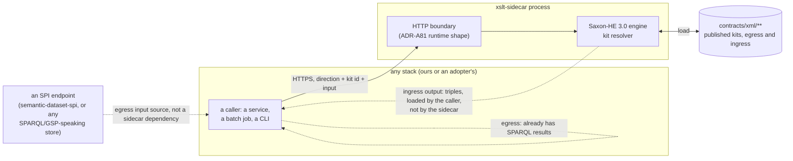

<!-- SPDX-License-Identifier: CC-BY-SA-4.0 -->

# A bidirectional XSLT sidecar, grounded in compiler-generated artefacts

Version 0.1, draft for review, 2026-10-02.

**The position it argues.** Once the persistence compiler (ADR-A78, ADR-A79) and, where present, the
Surface compiler have run, LATTICE already knows the shape of the data an SPI query returns, because
that shape is exactly what those compilers generated. A Saxon-hosted XSLT 3.0 engine, run as a
sidecar process rather than embedded in any one platform component, turns that known shape into
documents, reports and pages on the way out, and turns external XML on the way in into the triples
our persistence tier recognises. The same engine, the same hosting, the same security posture serve
both directions. A MORK compiler backend makes the inbound direction generated rather than
hand-written, the same way `tools/mork2rml.py` already does for RML.

This is deliberately **not** another vertical proof of concept. It is a utility: something another
stack glues in, not something that owns a stack of its own.

---

## Contents

1. [Relationship to existing work](#1-relationship-to-existing-work)
2. [What is actually new here](#2-what-is-actually-new-here)
3. [Grounding: the known shape of SPI data](#3-grounding-the-known-shape-of-spi-data)
4. [Shape: a sidecar, not an embedded module](#4-shape-a-sidecar-not-an-embedded-module)
5. [Direction A: egress, sourced from compiled artefacts](#5-direction-a-egress-sourced-from-compiled-artefacts)
6. [Direction B: ingress, a new capability](#6-direction-b-ingress-a-new-capability)
7. [MORK as a compiler target: `mork2rml`'s sibling](#7-mork-as-a-compiler-target-mork2rmls-sibling)
8. [The sidecar's wire contract](#8-the-sidecars-wire-contract)
9. [Hosting, security and determinism: what changes, what does not](#9-hosting-security-and-determinism-what-changes-what-does-not)
10. [What exists today](#10-what-exists-today)
11. [Decisions](#11-decisions)
12. [Risks](#12-risks)
13. [Open questions](#13-open-questions)

---

## 1. Relationship to existing work

[`xml-egress-and-transformation-kits.md`](xml-egress-and-transformation-kits.md) already argued, in
detail, that SPARQL Query Results XML is the right transform source (its §2), that Saxon in Java is
the right host (its §7), that a transformation kit is query plus stylesheet plus schema plus a
manifest, published so a third party can run it without our code (its §8), and the determinism and
security disciplines a transform needs (its §10, §11). None of that is revisited here. Where this
sketch needs those positions it cites them, and where it departs from that sketch's assumptions it
says so explicitly, once, in §2.

That sketch's own §7.1 already anticipated reuse: "the ingress pipeline's Route B needs an XSLT 2.0
processor for the OASIS normaliser and triplifier. One dependency, two uses." This sketch is the
generalisation that observation was pointing at, except it is a third and fourth use, not a second:
egress for any compiled shape, not only LegalRuleML-bearing instruments, and ingress for any external
XML a MORK mapping can describe, not only the OASIS-specific LegalRuleML normalise-and-triplify
pipeline in [`legalruleml-runtime-pipeline.md`](legalruleml-runtime-pipeline.md). That pipeline's
Route B keeps its own hand-authored OASIS stylesheets and its own RML-based execution. This unit
does not replace it. §11's XS-D7 says so explicitly, because the overlap is easy to assume and wrong
to assume.

## 2. What is actually new here

| Existing sketch's position | What stays | What this sketch adds |
|---|---|---|
| SPARQL Query Results XML is the transform source | unchanged, cited not re-argued | the query is, where possible, one the persistence or Surface compiler already generated, not hand-written (§3) |
| Saxon-HE in a Java module | unchanged | the module is also packaged as a standalone sidecar process, so a non-JVM stack can use it without embedding Java (§4) |
| A kit is query + stylesheet + schema + manifest | unchanged structure | a kit now has a `direction` (`egress` or `ingress`), and an ingress kit's "query" slot is the external XML's own schema, not a SPARQL query (§6, §8) |
| Generation prevents JSON/XML drift (its §9) | unchanged argument, same mechanism | extended to a second drift risk: an ingress stylesheet and a MORK mapping graph disagreeing, solved the same way MORK and RML cannot disagree today — by one being compiled from the other (§7) |
| "No Saxon extension functions" so any conformant processor runs the kit (its §8.2) | unchanged for egress kits | ingress kits inherit the same rule, since an ingress stylesheet is just as publishable as an egress one |

Three things are genuinely new, not extensions of something already decided: **grounding** (§3),
**ingress** (§6), and the **MORK-to-XSLT compiler** (§7). The rest of this sketch is mostly about
those three.

## 3. Grounding: the known shape of SPI data

An adopter who has run the persistence compiler's `instantiate` subcommand already has, on disk, a
set of generic, portable `.rq` files: SPARQL text generated from a `dal:CompiledProfile`, which was
itself resolved from the adopter's own `dal:` configuration against `ontology/persistence`
(ADR-A78, ADR-A79). Two consequences follow directly.

- **The shape of what that query returns is not a guess.** It is exactly what
  `persistence.operations`'s template selection and `persistence.compiler`'s emission produced, for
  the target class, the deployment model and the selected operation. A hand-written `query.rq` in a
  kit (the existing egress sketch's §15 step 2) risks drifting from what the compiler would actually
  produce for the same target, in the same way the existing sketch's §9 worries about JSON and XML
  drifting from each other.
- **Where a compiled operation already covers a kit's target class, the kit's `query.rq` should be
  that generated text, or a thin, declared wrapper around it** (adding `ORDER BY` where the template
  does not already impose one, per the existing sketch's §3), not an independent hand-authored query
  answering the same question a second way.

Where present, the Surface compiler adds a second source of known shape. A `srf:Surface` restates
part of a graph as a locally queryable, flattened structure precisely so a consumer can reach a
value by direct lookup rather than by traversal (`ontology/surface/README.md`). A kit projecting a
carrier Surface already promotes already has its read shape decided by the Surface contract, and a
kit's query should read the promoted property directly rather than re-deriving the traversal the
Surface compiler was built to avoid.

The SHACL shapes a profile's boundary declares (`dal:boundaryShape`, the persistence sketch's §4.3)
are a third source: they describe what a conformant instance of the target class actually looks
like, which is useful as a kit's **test oracle** even where it is not the source of the query text
itself. A kit's golden fixture should validate against the same shapes the persistence profile
already declares, not a separately maintained schema that happens to agree today.

None of this removes hand-written queries as an option. A kit answering a question no compiled
profile covers still needs one, exactly as the existing egress sketch assumed throughout. What
changes is the **order of preference**: ask whether a compiled artefact already answers the
question before writing a query that might silently drift from it.

## 4. Shape: a sidecar, not an embedded module



The existing egress sketch's §7.2 framed the engine as a Java module, `semantic-xml-egress`, called
in-process by whatever Java component needed a projection. That framing still holds as the engine's
**core**: a library with the narrow interface its §7.2 already gives. What changes is that the core
is also wrapped in a small standalone process exposing the same two operations over HTTP, so a
caller that is not a JVM process (a Python worker, a .NET integration, a shell script in someone
else's CI) can use it without embedding Java. Two artefacts, one engine, never two implementations of
the transform logic.

**The sidecar does not talk to an SPI, a triplestore or a message queue.** It takes XML or XML-like
input and a kit identifier, and returns XML or triples. Whatever produced the input (a SPARQL
endpoint, a file, another service) and whatever consumes the output (a loader, a document store, a
browser) are the caller's concern, not the sidecar's. This is the same discipline the existing
sketch's §11.4 already applies to the egress direction (`GraphReference` and `KitId`, never a raw
query). Here it is stated as the sidecar's whole shape, in both directions, so "glue into some other
stack" cannot quietly grow into "the sidecar also talks to your database."

## 5. Direction A: egress, sourced from compiled artefacts

Mechanically unchanged from the existing sketch: a `query.rq` returns SPARQL Query Results XML, a
`transform.xsl` turns the result table into a tree (its §3), a schema admits the output (its §4,
§5), and the kit is published as a versioned directory (its §8). The delta is entirely in where
`query.rq` comes from (§3 above): generated by `persistence instantiate` or a Surface-aware
equivalent where a compiled profile covers the kit's target, hand-written only where none does, and
in both cases checked against the profile's own boundary shapes as the kit's test oracle.

A kit's manifest (the existing sketch's §8) gains one field recording this: `source: generated` with
the compiled profile's own identifying hash, or `source: hand-written` with a note of which SHACL
shapes the golden fixture was checked against. A generated-source kit that drifts from a
regenerated profile is then a detectable manifest mismatch (the existing sketch's §9), not a
silent divergence.

## 6. Direction B: ingress, a new capability

An external document arrives as XML: an ACORD message, a market body's filing format, a partner's
proprietary export, anything that is not already OWL and is not going to become OWL by anyone else's
effort. The sidecar's ingress direction turns it into the triples our persistence tier recognises.

### 6.1 What "our persistence tier recognises" means here

**Canonical, sorted N-Triples text**, not RDF/XML and not a SPARQL `INSERT DATA` block, is the
ingress stylesheet's output (§11, XS-D4). Three reasons, in order of weight:

- It matches the canonicalisation convention the repository already uses wherever a deterministic,
  hashable graph serialisation is needed (sorted N-Triples lines, SHA-256 over the join, as the word
  authoring POC's `CanonicalHash` already does for an unrelated graph). A second, XML-flavoured
  convention invented here for the same purpose would be a needless third way to do a thing the
  repository already has one way to do.
- N-Triples is produced by `<xsl:output method="text"/>` and ordinary string construction, which
  keeps the stylesheet itself simple: no namespace-prefix bookkeeping, no striped-versus-flat
  argument, none of RDF/XML's many-equivalent-serialisations trap (the existing sketch's §2.1) —
  except here the trap cannot spring, because we author every ingress stylesheet and so control its
  one, disciplined output form. RDF/XML was rejected as a transform **source** because a third
  party's serialiser is unpredictable. It was never rejected as something we, as the sole producer,
  cannot emit predictably. N-Triples is simply the plainer way to do that.
- **Loading the triples is explicitly not the sidecar's job.** A thin, generic, non-XSLT-specific
  loader (not part of this unit, since it already exists or is trivial wherever a store SPI write
  path exists) turns N-Triples into a SPARQL `INSERT DATA`, a Graph Store Protocol `PUT`, or
  whatever the target store's own write path wants. Keeping that step outside the sidecar is the
  same boundary discipline as §4's "the sidecar does not talk to an SPI."

### 6.2 Two sources for an ingress stylesheet

| Source | When | Mechanism |
|---|---|---|
| Hand-written | a one-off external schema, or before a MORK mapping for it exists | an XSLT 3.0 stylesheet, authored once, published as a kit exactly like an egress kit, with the external XSD (or a representative sample) replacing `query.rq` in the kit's input role |
| MORK-compiled | a MORK mapping for the external schema already exists, or is worth authoring | §7. The mapping is the source of truth, the stylesheet is its generated projection, and the two cannot disagree for the same reason a MORK mapping and its RML compilation cannot today |

Both land as the same kind of published, versioned, direction-tagged kit (§5's manifest field
generalises to ingress: `source: mork-compiled` names the mapping graph's own identity).

### 6.3 Security, inbound

An ingress stylesheet parses **untrusted external content by design**, which is a stronger version
of the existing sketch's §11.3 concern. There, a *previously-validated* LegalRuleML payload is
re-embedded. Here, the whole document is unvalidated on arrival. Every control in the existing
sketch's §11.1 applies without weakening: DTDs disabled, external entities refused, `DOCTYPE`
rejected at the boundary before parsing. Additionally:

- **Size and depth limits apply to the inbound document itself**, not only to an embedded payload
  within it, since the whole document is now attacker-controlled.
- **An ingress kit's schema (the external XSD, where the source provides one) validates on arrival,
  before the stylesheet runs**, the same ordering the existing sketch's §11.3 already prescribes for
  LegalRuleML: validate on ingress, not only check the output on egress.
- **A MORK-compiled stylesheet carries no more trust than a hand-written one.** Compiling a mapping
  does not make its output stylesheet exempt from the portability and no-extension-functions rule
  (§8), and it does not make the external content it will eventually process any less untrusted.

## 7. MORK as a compiler target: `mork2rml`'s sibling

`tools/mork2rml.py` already implements, in the module's own words, "the compilation functor
C: MorkDAG → RMLDAG", a catamorphism over a MORK mapping graph that produces an RML mapping
document: a static artefact, generated once at compile time, later executed by an RML processor
against whatever source data arrives. **The ingress direction needs exactly the same shape of
compiler, with a different target**: `C': MorkDAG → XSLT`, producing a static XSLT 3.0 stylesheet
instead of an RML document, for the case where the source is already XML and the chosen executor is
Saxon rather than an RML processor.

This is not a competing way to run MORK mappings. RML remains the general case, where the source may
be CSV, JSON, a relational table, or XML. The XSLT target is strictly narrower — it only applies
where the source is XML — and its entire justification is that the sidecar already hosts Saxon for
egress, so an XML-sourced ingestion needs no second runtime (no RML processor, no RMLMapper Java
subprocess, no `pyrml`) alongside it. Where a mapping's source is not XML, `mork2rml` is still the
right compiler, unchanged.

### 7.1 Sharing, not duplicating, the DAG walk

`mork2rml.py` today is one file: graph loading, the case analysis of its own Definition 10.7, and
RML term construction, all in one module. Adding a second backend by copying that file and swapping
its emission logic would duplicate the DAG walk and let the two backends silently diverge on what a
given MORK construct even means — the same drift risk §3 and the existing sketch's §9 both already
worry about, now at the compiler level instead of the data level.

**Factor the DAG walk out first.** A shared module parses the MORK graph and produces an
intermediate case-classified structure (which construct, which cardinality, which join shape) that
both `mork2rml` and the new `mork2xslt` consume, each emitting its own target from the same
classification. This mirrors `tools/mork_compilers`' own "one shared IR, many backends" shape for
Eligibility conditions (ADR-A23), applied to the MORK-mapping compiler family instead. It is a
refactor of existing, working code, done carefully, with `mork2rml`'s existing tests as the
regression guard: every one of them must still pass, unchanged, once it runs against the factored
module.

### 7.2 What `mork2xslt` emits

A static XSLT 3.0 stylesheet whose templates mirror the same subject/predicate/object construction
`mork2rml` already derives for RML's `SubjectMap`/`PredicateObjectMap`/`RefObjectMap`, except each
construction emits an N-Triples line (§6.1) instead of an RDF node in an in-memory RML graph. The
generated stylesheet is published exactly as a hand-written one would be (§6.2), with the same
no-extension-functions constraint, so a `mork2xslt`-generated kit is indistinguishable, to a
consumer running it, from one a person wrote by hand. That indistinguishability is the acceptance
criterion worth testing directly: the same source document, run through the hand-written ingress
kit of §6.2's first row and a MORK-compiled kit built for the same external schema, produces the
same triples.

## 8. The sidecar's wire contract

One HTTP boundary, two operations, matching §4's two directions and the existing sketch's §7.2
interface almost exactly:

```java
public interface XmlProjection {
    /** Egress: project one graph reference through a named, versioned egress kit. */
    XmlResult project(GraphReference ref, KitId kit, ProjectionOptions options);
}

public interface XmlIngestion {
    /** Ingress: lift one external XML document through a named, versioned ingress kit. */
    TripleResult ingest(InputStream externalXml, KitId kit, IngestionOptions options);
}
```

The sidecar process exposes both over HTTP, following ADR-A81's runtime shape (virtual
thread-per-request, a minimal library, mandatory deadline propagation, Jackson at the edge only for
the envelope, not for the XML body itself) rather than inventing a third HTTP convention alongside
the control plane's and the word authoring POC's. Where `platform/runtime-host` (ADR-A81's own
consequence) exists by the time this unit executes, the sidecar is built on it. Where it does not yet
exist, the sidecar uses a minimal library directly and is migrated onto `runtime-host` once that
exists, as a follow-up, not a blocking precondition (§11, XS-D2).

## 9. Hosting, security and determinism: what changes, what does not

| Topic | Existing sketch | This sketch |
|---|---|---|
| Processor | Saxon-HE, XSLT 3.0, XPath 3.1 (its §7.1) | unchanged |
| Licence | MPL 2.0, no ADR-A83 conflict (its §7.1) | unchanged, and now doubly confirmed since the module is used for two directions |
| Module placement | a new Maven module beside the seven that exist (its §7.2) | the module gains a sidecar wrapper (§4), not a second engine |
| XXE and entity controls | §11.1 | unchanged for egress. Strengthened for ingress (§6.3): the whole inbound document is untrusted, not only an embedded subtree |
| No Saxon extensions in a published kit | §8.2 | unchanged, now applies to ingress kits too, hand-written or MORK-compiled |
| Determinism | §10, canonical form, `ORDER BY` for egress | an ingress kit's determinism is "the same input document always compiles to the same N-Triples lines in the same order", checked the same way: a golden fixture, not an assumption |
| Tenant and scope boundary | §11.4, `GraphReference` and `KitId` only | generalised in §4: the sidecar accepts a direction, a kit id and an input, nothing that could act as a raw query or a raw store handle, in either direction |

## 10. What exists today

Extends the existing sketch's own §14 table with what this unit additionally stands on.

| Piece | State |
|---|---|
| Everything the existing sketch's §14 already lists | unchanged, see that sketch |
| `persistence instantiate` | **exists.** Produces portable SPARQL text from a `dal:CompiledProfile` (ADR-A79) |
| Persistence boundary SHACL shapes | **exist**, per resolved profile (`dal:boundaryShape`, persistence sketch §4.3) |
| A Surface compiler producing generated surfaces | **partially exists** (`tools/surface`, `ontology/surface`). Its generated-surface shape is a second grounding source where a kit's target is a promoted property |
| `tools/mork2rml.py` | **exists.** `MorkDAG → RMLDAG`, one file, not yet split into a shared IR plus backend |
| A second MORK compiler backend (XSLT) | **does not exist** |
| ADR-A81 (control plane HTTP runtime) | **Proposed**, not yet built as `platform/runtime-host` |
| A standalone sidecar process anywhere in the repository | **none.** Every existing HTTP surface is embedded in its own service |

## 11. Decisions

None of these is taken without the maintainer. Recorded here as proposals, pending our decision,
in the same spirit as the word authoring POC's WA-D table.

| # | Decision | Options | Recommendation |
|---|---|---|---|
| XS-D1 | Deployment shape | (a) a core Java library plus a standalone sidecar process wrapping it over HTTP, so a non-JVM caller never embeds Java. (b) a library only, embedded per caller, as the existing egress sketch's §7.2 originally framed it | (a): matches "glue into some other stack" literally. The library still exists underneath for a JVM caller that would rather not take a network hop |
| XS-D2 | Sidecar HTTP runtime | (a) align with ADR-A81 (virtual threads, a minimal library, deadline propagation), building on `platform/runtime-host` once it exists, a minimal library directly until then. (b) a bespoke runtime for this unit alone | (a): one HTTP convention across the platform, not a second one invented here |
| XS-D3 | Egress kit query sourcing | (a) prefer `persistence instantiate` output (or a Surface-generated equivalent) where a compiled profile already covers the kit's target, hand-write only otherwise, and check golden fixtures against the profile's own boundary shapes. (b) always hand-write, as the existing sketch assumed | (a): removes a drift risk the existing sketch's §9 already names for a different pair of skins |
| XS-D4 | Ingress output form | (a) canonical sorted N-Triples text, loaded by a caller-supplied, non-XSLT-specific step. (b) RDF/XML. (c) a SPARQL `INSERT DATA` block emitted directly | (a): matches the repository's existing canonical-hash convention, and keeps "the sidecar does not talk to an SPI" (§4) literally true |
| XS-D5 | MORK-to-XSLT compiler placement | (a) factor `mork2rml.py`'s DAG walk into a shared module first, then add the new backend against it, with `mork2rml`'s existing tests as the regression guard. (b) a separate, duplicated implementation | (a): one case analysis, two targets, the same discipline `tools/mork_compilers` already applies elsewhere (ADR-A23) |
| XS-D6 | Kit model for ingress | (a) extend the existing kit concept (manifest, versioned directory, `contracts/xml/`) with a `direction` field, rather than a separate packaging convention. (b) a new, parallel packaging scheme for ingress kits | (a): one publication model, one place a consumer looks, regardless of direction |
| XS-D7 | Scope boundary against the LegalRuleML ingress pipeline | (a) this unit's ingress direction is domain-neutral and does not replace, wrap or depend on the OASIS-specific LegalRuleML normalise-and-triplify pipeline (`legalruleml-runtime-pipeline.md`'s Route B), which keeps its own stylesheets and its own RML-based execution. A later unit may choose to host Route B's Saxon execution on this sidecar, but that is explicitly out of this unit's scope. (b) fold Route B into this unit now | (a): keeps this unit's acceptance criteria about a domain-neutral mechanism, not about LegalRuleML specifically |

## 12. Risks

| # | Risk | Mitigation |
|---|---|---|
| XS-R1 | The sidecar quietly grows a raw-query or raw-store entry point "just for one caller" | §4 and §8's interfaces take a direction, a kit id and an input only. No overload, mirroring the existing sketch's X6 |
| XS-R2 | An ingress stylesheet is trusted more than a hand-written one because it was generated | §6.3 states explicitly that compiled trust is not elevated trust. Every ingress kit, however sourced, gets the same validation and the same security tests |
| XS-R3 | The `mork2rml.py` refactor (XS-D5) breaks an existing, working compiler while adding a new one | its existing tests run, unchanged, against the factored module before any new backend is added, and must still pass |
| XS-R4 | Grounding egress kits in compiled artefacts (XS-D3) couples this unit's schedule to the persistence or Surface compiler's own release cadence | a kit may still be hand-written where no compiled profile exists yet. Grounding is a preference, not a precondition |
| XS-R5 | "Any stack" becomes, in practice, only the stacks this repository already has, because nobody outside the repository tries it | the existing sketch's §8.1 third-party-reproduction test generalises here: a kit, in either direction, must be runnable by a bare Saxon CLI outside our code, proven in the first slice, not assumed |
| XS-R6 | Scope creep into replacing the LegalRuleML ingress pipeline | XS-D7 states the boundary explicitly, and no slice in the plan touches `legalruleml-runtime-pipeline.md`'s own files |

## 13. Open questions

| # | Question |
|---|---|
| XS-Q1 | Should `platform/runtime-host` (ADR-A81) be a precondition for this unit, or should the sidecar start on a minimal library and migrate later? §11's XS-D2 recommends the latter, but it is worth the maintainer confirming rather than assuming |
| XS-Q2 | Does an ingress kit's published schema role (§6.2) need its own `contracts/xml/` subdirectory convention distinct from egress kits, or does the direction field in the manifest suffice on its own? |
| XS-Q3 | Should the sidecar support batching several ingress documents in one call, or is one document per call acceptable for a first version? Scale questions are the existing sketch's §12 concern, revisited here only if a real caller needs it |
| XS-Q4 | Who maintains a MORK mapping once it exists for an external schema: the team integrating that schema, or a central MORK-mapping owner? Not a technical question, but it affects XS-D5's long-run maintenance story |
