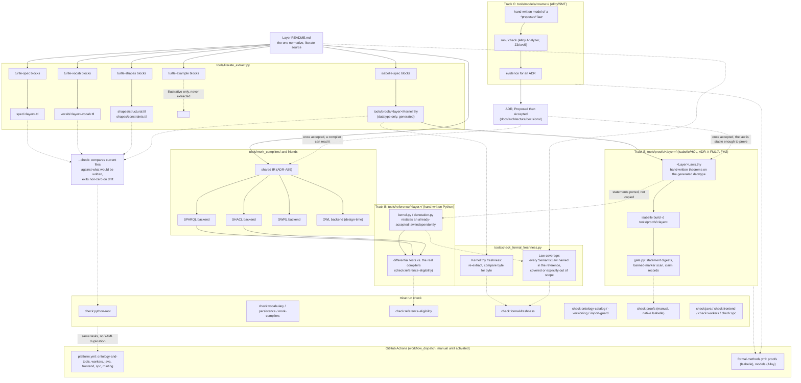

<!-- SPDX-License-Identifier: CC-BY-SA-4.0 -->

# 2. Development-Time Toolchain

What runs when a layer's README changes, a law changes, or a compiler changes — the full chain
`mise run check` exercises, and what each piece catches that the others cannot. See the
[Developer Guide](../developer/developer-guide.md) for the commands and
[Formal Methods in the Development Lifecycle](../developer/formal-methods-lifecycle.md) for the
decision of which parts apply to a given change.

