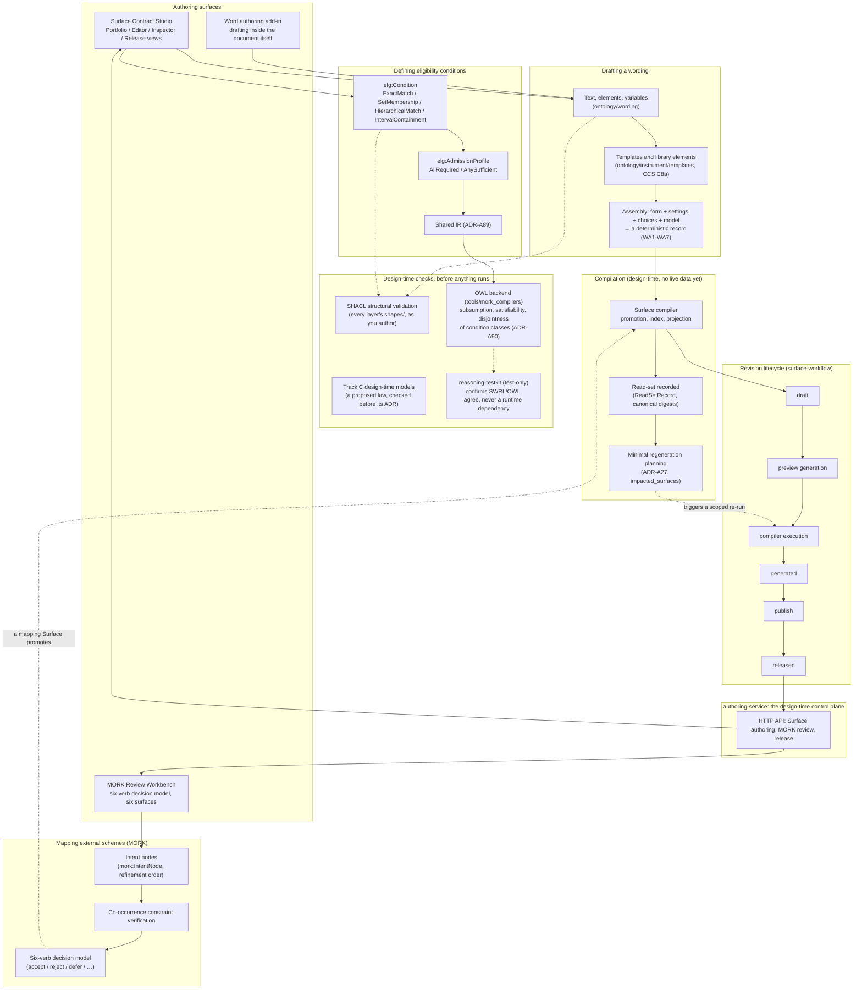

<!-- SPDX-License-Identifier: CC-BY-SA-4.0 -->

# 3. Design-Time Authoring

The moving parts behind authoring a contract or a template: drafting wording, mapping external
schemes, defining eligibility conditions, and everything that checks the result *before* it is
ever evaluated against a real case. See
[`docs/architecture/ux-design.md`](../architecture/ux-design.md) for the two products' own UX
specification and [`docs/architecture/surface-workflow.md`](../architecture/surface-workflow.md)
for the revision lifecycle in full.

