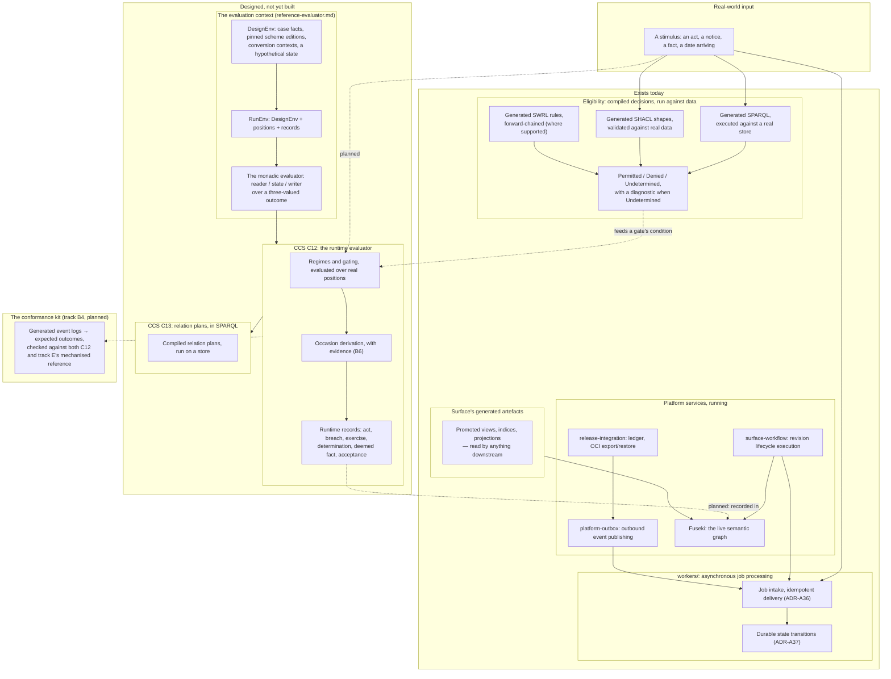

<!-- SPDX-License-Identifier: CC-BY-SA-4.0 -->

# 4. Runtime Capabilities

What actually executes once an instrument is deployed and real data arrives, split clearly
between what exists today and what the architecture has designed but not yet built (dashed edges,
labelled "planned"). Conflating the two is worse than a gap in the picture — see
[`docs/architecture/data-architecture.md`](../architecture/data-architecture.md) for the three
data realms in full and
[`docs/developer/plans/computable-contract-substrate.md`](../developer/plans/computable-contract-substrate.md)
for C12, the runtime evaluator this diagram marks as planned.

