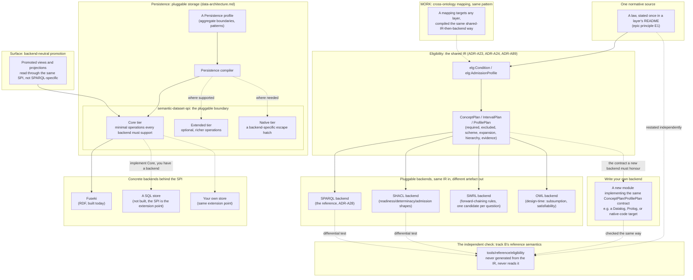

<!-- SPDX-License-Identifier: CC-BY-SA-4.0 -->

# 5. Compiler Backends and Pluggable Surfaces

One semantics, several targets: how Eligibility's shared IR fans out to SPARQL, SHACL, SWRL and a
design-time OWL check, how Persistence's SPI boundary makes the storage backend itself pluggable,
and where you would add a new one — SQL, a different triple store, or an implementation surface
nobody here has built yet. See
[`tools/mork_compilers/README.md`](../../tools/mork_compilers/README.md),
[`tools/persistence/README.md`](../../tools/persistence/README.md) and
[`docs/architecture/rdf-sparql-patterns-guide.md`](../architecture/rdf-sparql-patterns-guide.md).

