<!-- SPDX-License-Identifier: CC-BY-SA-4.0 -->

# Behaviour Ontology — State, Transition, Trigger, Guard, Effect, and Allowance

Literate specification for the Behaviour layer.

---

## 1. Purpose and Scope

Behaviour models declared state spaces, transitions, triggers, guards, effects, executions, and durable state records.

Behaviour imports Foundation, Vocabulary, Quantification, Party and Eligibility. It sits below
Instrument, which builds on it, and names no term of any layer above it
([ADR-A106](../../docs/architecture/decisions/ADR-A106-behaviour-configuration-runtime-occasions-and-records.md),
[ADR-A01](../../docs/architecture/decisions/ADR-A01-layer-dependency-order.md) addendum).

Behaviour is two documents in one namespace:

| Document | File | Holds | Imported by |
|---|---|---|---|
| configuration | `spec/behaviour.ttl` | the declaration tier: state spaces, states, transitions, triggers, guards, effects, allowance definitions, policies | Instrument, applied layers, `behaviour-vocab`, the runtime document |
| runtime | `spec/behaviour-runtime.ttl` | the occurrence, execution and state record tiers: stimuli, executions, effect applications, state occupancies, allowance accounts | the runtime evaluator, applied runtime modules (`applied/capacity`'s execution profile) |

A model that only declares behaviour imports configuration and never meets a runtime record.

## 2. Namespace and Prefixes

```turtle-spec
@prefix bhv:  <https://www.nebularis.org/neuro-semantic/lattice/behaviour#> .
@prefix fnd:  <https://www.nebularis.org/neuro-semantic/lattice/foundation#> .
@prefix voc:  <https://www.nebularis.org/neuro-semantic/lattice/vocabulary#> .
@prefix qnt:  <https://www.nebularis.org/neuro-semantic/lattice/quantification#> .
@prefix pty:  <https://www.nebularis.org/neuro-semantic/lattice/party#> .
@prefix elg:  <https://www.nebularis.org/neuro-semantic/lattice/eligibility#> .
@prefix owl:  <http://www.w3.org/2002/07/owl#> .
@prefix rdf:  <http://www.w3.org/1999/02/22-rdf-syntax-ns#> .
@prefix rdfs: <http://www.w3.org/2000/01/rdf-schema#> .
@prefix xsd:  <http://www.w3.org/2001/XMLSchema#> .
```

## 3. Extraction Contract

- `turtle-spec` blocks generate `spec/behaviour.ttl`, the configuration document.
- `turtle-vocab` blocks generate `vocab/behaviour-vocab.ttl`.
- The `turtle-shapes` block generates `shapes/structural.ttl`. `shapes/constraints.ttl` and
  `shapes/rules.ttl` are authored as files.
- `spec/behaviour-runtime.ttl` is authored as a file (§5.2): the extractor writes one spec
  document per layer.
- `turtle-example` blocks are illustrative only.

```bash
python3 tools/literate_extract.py ontology/behaviour/README.md --layer behaviour --root . \
    --shapes shapes/structural.ttl --check
```

## 4. Four-tier model

Behaviour distinguishes four tiers:

- declaration: `StateSpace`, `State`, `TransitionDefinition`, `TriggerDefinition`, `GuardDefinition`, `EffectDefinition`, `AllowanceDefinition`, policy classes. The configuration document
- occurrence: `Stimulus`. The runtime document
- execution: `TransitionExecution`, `EffectApplication`. The runtime document
- state record: `StateOccupancy`, `AllowanceAccount`. The runtime document

## 5. Core Model

### 5.1 Configuration

```turtle-spec
@base <https://www.nebularis.org/neuro-semantic/behaviour> .

<https://www.nebularis.org/neuro-semantic/behaviour>
	rdf:type owl:Ontology ;
	owl:versionIRI <https://www.nebularis.org/neuro-semantic/lattice/behaviour/0.10.0> ;
	owl:imports <https://www.nebularis.org/neuro-semantic/lattice/foundation/0.3.0> ,
				<https://www.nebularis.org/neuro-semantic/lattice/vocabulary/0.3.0> ,
				<https://www.nebularis.org/neuro-semantic/lattice/quantification/0.5.0> ,
				<https://www.nebularis.org/neuro-semantic/lattice/party/0.5.0> ,
				<https://www.nebularis.org/neuro-semantic/lattice/eligibility/0.7.0> .

bhv:StateSpace a owl:Class ;
	rdfs:subClassOf fnd:Version ;
	rdfs:comment "A declared state space." .

bhv:State a owl:Class ;
	rdfs:comment "A declared state belonging to one state space." ;
	rdfs:subClassOf [ a owl:Restriction ; owl:onProperty bhv:inStateSpace ; owl:cardinality "1"^^xsd:nonNegativeInteger ] .

bhv:TransitionDefinition a owl:Class ;
	rdfs:subClassOf fnd:Version,
		[ a owl:Restriction ; owl:onProperty bhv:fromState ; owl:cardinality "1"^^xsd:nonNegativeInteger ] ,
		[ a owl:Restriction ; owl:onProperty bhv:toState ; owl:cardinality "1"^^xsd:nonNegativeInteger ] ,
		[ a owl:Restriction ; owl:onProperty bhv:hasTrigger ; owl:minCardinality "1"^^xsd:nonNegativeInteger ] ,
		[ a owl:Restriction ; owl:onProperty bhv:selectionPolicy ; owl:cardinality "1"^^xsd:nonNegativeInteger ] ,
		[ a owl:Restriction ; owl:onProperty bhv:activationPolicy ; owl:cardinality "1"^^xsd:nonNegativeInteger ] ;
	rdfs:comment "A declared transition between states. It may have no effect: entering the state is often the whole effect (ADR-A106 decision 4)." .

bhv:TriggerDefinition a owl:Class ; rdfs:comment "A declared trigger condition for a transition." .
bhv:GuardDefinition a owl:Class ; rdfs:comment "A declared eligibility or policy guard." .
bhv:EffectDefinition a owl:Class ; rdfs:comment "A declared effect on a target, of one target kind." .

bhv:AllowanceDefinition a owl:Class ;
	rdfs:subClassOf fnd:Version,
		[ a owl:Restriction ; owl:onProperty bhv:allowanceSpace ; owl:cardinality "1"^^xsd:nonNegativeInteger ] ,
		[ a owl:Restriction ; owl:onProperty bhv:absorptionPolicy ; owl:cardinality "1"^^xsd:nonNegativeInteger ] ;
	rdfs:comment "A declared allowance or quota model." .

bhv:SelectionPolicy a owl:Class .
bhv:ActivationPolicy a owl:Class .
bhv:TriggerKind a owl:Class .
bhv:TargetKind a owl:Class .
bhv:AbsorptionPolicy a owl:Class .
bhv:OperationalProfile a owl:Class ; rdfs:subClassOf fnd:Version .
bhv:EntryMode a owl:Class ; rdfs:comment "How a transition enters a composite state: by default, or by shallow or deep history (behaviour-vocab)." .
bhv:TransitionType a owl:Class ; rdfs:comment "Whether a transition from a state to itself leaves and enters it again (External) or not (Internal) (behaviour-vocab)." .

bhv:inStateSpace a owl:ObjectProperty, owl:FunctionalProperty ; rdfs:domain bhv:State ; rdfs:range bhv:StateSpace .

bhv:initialState a owl:ObjectProperty, owl:FunctionalProperty ;
	rdfs:domain bhv:StateSpace ; rdfs:range bhv:State ;
	rdfs:comment "The state a subject is in when it takes effect, before any transition. Subject: a state space. Value: one of its own states, at most one." ;
	fnd:utility "An occupancy of the initial state needs no transition execution: it carries evidence of the subject taking effect (law B6). Nested states reuse this property for a composite state's initial sub-state." .
bhv:regionOf a owl:ObjectProperty, owl:FunctionalProperty ;
	rdfs:domain bhv:StateSpace ; rdfs:range bhv:State ;
	rdfs:comment "The state this space refines: a region of it. Subject: a state space. Value: a state, at most one." ;
	fnd:utility "A state with one region is compound, with several parallel. Give the region its own bhv:initialState. Nest a machine only when its states mean nothing outside the parent, must end on every exit from it, or must be found again on return. Otherwise make it a separate state space on the same subject (nested states sketch §3.1)." .

bhv:perOccasionOf a owl:ObjectProperty ;
	rdfs:domain bhv:StateSpace ;
	rdfs:comment "A declaration whose every occasion gets its own instance of this space. Subject: a state space. Value: any resource, in practice a relation." ;
	fnd:utility "Deliberately has no range (B7). With bhv:regionOf a core occasion state, the space refines that state for the relation's occasions. Without it, the space is a regime running beside each occasion's core states." .

bhv:fromState a owl:ObjectProperty, owl:FunctionalProperty ; rdfs:domain bhv:TransitionDefinition ; rdfs:range bhv:State .
bhv:toState a owl:ObjectProperty, owl:FunctionalProperty ; rdfs:domain bhv:TransitionDefinition ; rdfs:range bhv:State .
bhv:entryMode a owl:ObjectProperty, owl:FunctionalProperty ;
	rdfs:domain bhv:TransitionDefinition ; rdfs:range bhv:EntryMode ;
	rdfs:comment "How the transition enters its target's regions. Subject: a transition definition. Value: an entry mode, at most one, bhv:DefaultEntry when absent." ;
	fnd:utility "bhv:ShallowHistory and bhv:DeepHistory need a target with a region. History is a property of the entering transition, so one transition may start a state afresh and another resume it (nested states sketch §4)." .

bhv:transitionType a owl:ObjectProperty, owl:FunctionalProperty ;
	rdfs:domain bhv:TransitionDefinition ; rdfs:range bhv:TransitionType ;
	rdfs:comment "Whether a transition from a state to itself leaves and enters it again. Subject: a transition definition. Value: a transition type, at most one. Internal when absent and source equals target, External otherwise." ;
	fnd:utility "Declare bhv:External only to restart what is anchored on entry, such as a notice period re-served. Internal is the default so that an effect-only reaction never restarts a period (nested states sketch §4.1)." .

bhv:hasTrigger a owl:ObjectProperty ; rdfs:domain bhv:TransitionDefinition ; rdfs:range bhv:TriggerDefinition .
bhv:hasGuard a owl:ObjectProperty ; rdfs:domain bhv:TransitionDefinition ; rdfs:range bhv:GuardDefinition .
bhv:hasEffect a owl:ObjectProperty ; rdfs:domain bhv:TransitionDefinition ; rdfs:range bhv:EffectDefinition .
bhv:triggerKind a owl:ObjectProperty, owl:FunctionalProperty ; rdfs:domain bhv:TriggerDefinition ; rdfs:range bhv:TriggerKind .
bhv:selectionPolicy a owl:ObjectProperty, owl:FunctionalProperty ; rdfs:domain bhv:TransitionDefinition ; rdfs:range bhv:SelectionPolicy .
bhv:activationPolicy a owl:ObjectProperty, owl:FunctionalProperty ; rdfs:domain bhv:TransitionDefinition ; rdfs:range bhv:ActivationPolicy .
bhv:priority a owl:DatatypeProperty, owl:FunctionalProperty ; rdfs:domain bhv:TransitionDefinition ; rdfs:range xsd:integer .
bhv:requiresEligibility a owl:ObjectProperty, owl:FunctionalProperty ; rdfs:domain bhv:GuardDefinition ; rdfs:range elg:AdmissionProfile .

bhv:requiresState a owl:ObjectProperty ;
	rdfs:domain bhv:GuardDefinition ; rdfs:range bhv:State ;
	rdfs:comment "A state the subject must be in for the guard to hold. Subject: a guard definition. Value: a state, any number: one of them per top-level state space they belong to." ;
	fnd:utility "Reads another regime's state on the same subject, as SCXML's In(). A dependency between two regimes is a guard or a trigger, not a nesting." .

bhv:excludesState a owl:ObjectProperty ;
	rdfs:domain bhv:GuardDefinition ; rdfs:range bhv:State ;
	rdfs:comment "A state the subject must not be in for the guard to hold. Subject: a guard definition. Value: a state, any number. The guard fails if any is active." .
bhv:targetKind a owl:ObjectProperty, owl:FunctionalProperty ; rdfs:domain bhv:EffectDefinition ; rdfs:range bhv:TargetKind .

bhv:targets a owl:ObjectProperty ;
	rdfs:domain bhv:EffectDefinition ;
	rdfs:comment "What an effect acts on. Subject: an effect definition. Value: any resource." ;
	fnd:utility "Deliberately has no range: an effect may target a relation, an occasion, an instrument or anything else, and a range would classify every target as one kind. The layer that declares a target kind checks proper targets with its own shapes (ADR-A106 decision 2). Use bhv:targetsOccupancy or bhv:targetsAllowance where they fit." .

bhv:targetsOccupancy a owl:ObjectProperty ;
	rdfs:subPropertyOf bhv:targets ;
	rdfs:domain bhv:EffectDefinition ; rdfs:range pty:RoleOccupancy ;
	rdfs:comment "An effect's target that is a role occupancy. Subject: an effect definition. Value: a role occupancy." .

bhv:targetsAllowance a owl:ObjectProperty ;
	rdfs:subPropertyOf bhv:targets ;
	rdfs:domain bhv:EffectDefinition ; rdfs:range bhv:AllowanceDefinition ;
	rdfs:comment "An effect's target that is an allowance. Subject: an effect definition. Value: an allowance definition." .

bhv:usesAllowance a owl:ObjectProperty, owl:FunctionalProperty ; rdfs:domain bhv:EffectDefinition ; rdfs:range bhv:AllowanceDefinition .
bhv:consumesAmount a owl:ObjectProperty, owl:FunctionalProperty ; rdfs:domain bhv:EffectDefinition ; rdfs:range qnt:Quantity .
bhv:allowanceSpace a owl:ObjectProperty, owl:FunctionalProperty ; rdfs:domain bhv:AllowanceDefinition ; rdfs:range qnt:ValueSpace .
bhv:resetRecurrence a owl:ObjectProperty, owl:FunctionalProperty ; rdfs:domain bhv:AllowanceDefinition ; rdfs:range qnt:Recurrence .
bhv:absorptionPolicy a owl:ObjectProperty, owl:FunctionalProperty ; rdfs:domain bhv:AllowanceDefinition ; rdfs:range bhv:AbsorptionPolicy .

[] a owl:AllDisjointClasses ;
	owl:members ( bhv:StateSpace bhv:State bhv:TransitionDefinition bhv:TriggerDefinition bhv:GuardDefinition bhv:EffectDefinition bhv:AllowanceDefinition bhv:SelectionPolicy bhv:ActivationPolicy bhv:TriggerKind bhv:TargetKind bhv:AbsorptionPolicy bhv:OperationalProfile bhv:EntryMode bhv:TransitionType ) .
```

### 5.2 Runtime

`spec/behaviour-runtime.ttl` (version IRI `…/lattice/behaviour-runtime/0.10.0`) imports the
configuration document and declares the other three tiers:

| Tier | Classes | Properties |
|---|---|---|
| occurrence | `Stimulus`, `Occasion`, and the records below | `occasionOf`, `forCase`, `occasionParty`, `fromStimulus`, `actor` |
| execution | `TransitionExecution`, `EffectApplication` | `executedTransition`, `appliesEffect`, `causedByStimulus`, `usesProfile` |
| state record | `StateOccupancy`, `AllowanceAccount` | `occupiesState`, `forSubject`, `enteredBy`, `exitedBy`, `resumedFrom`, `isHypothetical`, `isCurrent`, `tracksAllowance`, `availableBalance` |

`bhv:forSubject` has no range: a state occupancy may be for a role occupancy, an instrument's
persistent identity, a section, a term or an occasion. Where the subject is versioned, the occupancy
is for its persistent identity, so its state outlives a new version (ADR-A106 decision 5). Every
runtime class is disjoint from every other Behaviour class.

**Occasions.** An occasion is one declaration (a legal relation, in practice) applied to one case.
`bhv:occasionOf` and `bhv:forCase` have no range, so Behaviour names nothing of the layer that
declares the relation. Its parties are role occupancy versions, fixed when it arises: a later version
of a party's occupancy does not change them (law I11). Its states are `bhv:OccasionStates` (§6).

**Records.** Each record is a `bhv:Record`, evidenced and temporally scoped: it carries a
`fnd:Evidence` (when it was recorded, and by whom when it is asserted) and a `fnd:TemporalScope` (its
valid time). It points at what it is about through properties with no range.

| Record | Records | Carries |
|---|---|---|
| `bhv:ActRecord` | an act of an activity by an actor for a case | `activity`, `actor`, `forCase` |
| `bhv:BreachRecord` | a breach of an occasion, derived or asserted by an adjudicator | `ofOccasion`, `closureReliedOn` |
| `bhv:ExerciseRecord` | an exercise of a power, whether or not it took effect | `exercised`, `actor`, `tookEffect`, `reasonNotTaken` |
| `bhv:DeterminationRecord` | a determination by the party a contract names | `matter`, `determiner`, `determinedValue` |
| `bhv:DeemedFactRecord` | a fact taken to hold by a deeming | `deeming`, `conditionSatisfied` |
| `bhv:AcceptanceRecord` | a party's acceptance of a version | `accepted`, `actor` |

**Every state entry is recorded** (law B6). An occupancy names the execution that entered it
(`bhv:enteredBy`), which names its stimulus, or carries evidence: of the subject taking effect when
it occupies its space's initial state, of an external log entry otherwise. An occupancy of an
occasion state is a derived artefact (law B1), `prov:wasDerivedFrom` the records it rests on.

### 5.3 Nested states, history, and concurrent regimes

Behaviour takes W3C SCXML as its reference for statecharts, without claiming conformance to it.
The design and every departure are in the
[nested states sketch](../../docs/developer/sketches/nested-states-and-history.md), and the
decisions in ADR-A106's 2026-10-02 addendum. The worked state machines of §10 show each construct
on a full record.

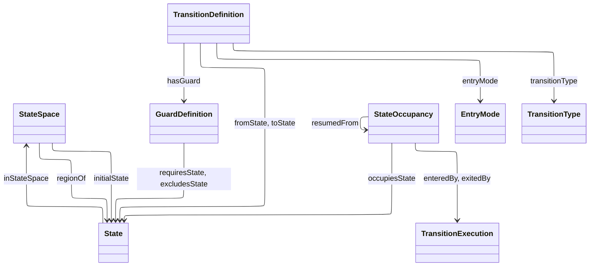

**Regions.** A state holds sub-states through regions. A region is a state space that names the
state it refines with `bhv:regionOf`, and has its own `bhv:initialState`. A state with one region
is compound, a state with several is parallel. A transition may leave from, or arrive at, a state
at any level of one tree. Arriving at a composite enters each region at its initial state.
Leaving a composite leaves every state inside it.

**When to nest.** States that happen at the same time are not nested on that account. Nest a
machine inside a state only when one of these holds:

| Test | Holds when | Example |
|---|---|---|
| existence | its states mean nothing outside the parent | a cure period is a stage of a default |
| exit | every way out of the parent must end it | leaving run-off ends claims servicing and premium collection |
| return | re-entering the parent must find it again | a standstill ends and the default resumes where it was |

Otherwise the machines are separate state spaces on the same subject. A dependency between them
is a guard that reads a state (`bhv:requiresState`, `bhv:excludesState`), or a trigger on
something a party does. Garden leave during notice is the worked case (§10.4).

**History** belongs to the transition that enters a composite state, so one transition may start
it afresh and another resume it:

| `bhv:entryMode` | Each region of the target is entered at |
|---|---|
| `bhv:DefaultEntry` (when absent) | its initial state |
| `bhv:ShallowHistory` | the state it held when the target was last exited. Below that, initial states |
| `bhv:DeepHistory` | the whole configuration below the target, as it was when last exited |

A target never exited before is entered by default. History stores nothing of its own: every
occupancy an execution ends records `bhv:exitedBy`, and a history entry finds the occupancies the
target's last exit ended. Each occupancy it creates names the one it resumes with
`bhv:resumedFrom`.

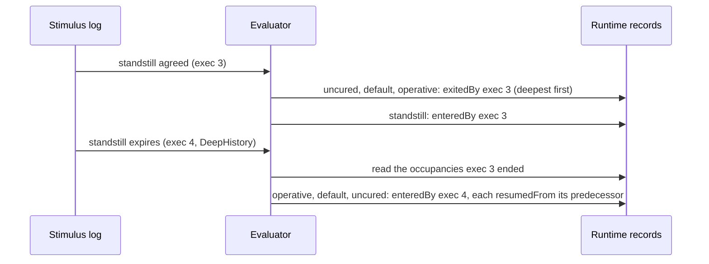

**Internal transitions.** A transition from a state to itself is internal unless it declares
`bhv:transitionType bhv:External`. It applies its effects and records an execution, and creates no
occupancy, so the state's entry time and its history are unchanged. This is the reverse of
SCXML's default, on purpose: an effect-only reaction must never restart a period anchored on entry.
A self-transition that must restart one (notice re-served) says `bhv:External`.

**Concurrent regimes** take two forms. Separate state spaces on one subject are independent
machines that may overlap at any time. Parallel regions exist only while their state does.
Behaviour never ranks one regime over another. A relation gated on states of several regimes
applies when, for each regime, the subject is in one of the states named for it. A conflict between
the relations two regimes gate is resolved by the layer that declares the relations.

**Occasions.** `bhv:perOccasionOf` gives a state space one instance per occasion of a declaration.
With `bhv:regionOf` a core occasion state, it refines that state for that relation's occasions,
and its transitions stay inside it (B9). Without, it is a regime running beside each occasion,
such as a dispute (§10.6, §10.7).

**The pass.** The evaluator takes one pass per positioned stimulus:

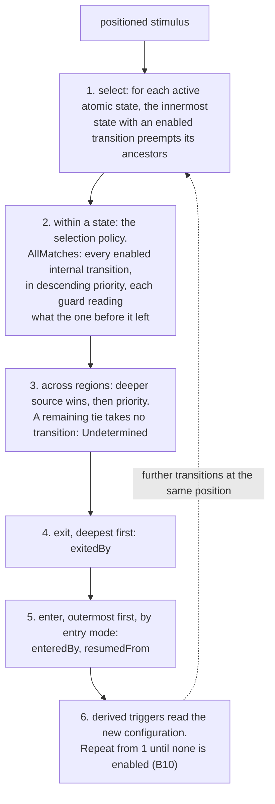

Internal transitions fire before the state's state-changing transition on the same trigger.
`bhv:AllMatches` applies only to internal transitions. State-changing transitions from one state on
one trigger declare one selection policy between them.

**Laws.** B1, B5, B6, B9 and B11 are shapes (§8). B10 needs what each derived trigger reads,
which the layer above declares, so the evaluator's compile step checks it.

| Law | Statement |
|---|---|
| B1 | An occupancy of an occasion state, or of a state nested in one, is derived from a record |
| B5 | A history entry enters the configuration its target held when last exited, shallow or deep as declared. Each occupancy it creates names the occupancy it resumes |
| B6 | Every occupancy an execution creates or ends names it, including ancestors and default sub-states, and the execution names its stimulus |
| B9 | A transition's source and target belong to one top-level state space. A refinement's transitions stay inside it |
| B10 | Derived triggers cannot form a cycle of transitions at one position |
| B11 | Current occupancies form a well-formed configuration: a nested state's parent is occupied, and each region of an occupied state that applies to the subject holds exactly one current state |

## 6. Mechanism vocabulary

The policies, trigger and target kinds, entry modes and transition types are named individuals.
The occasion state space is a fixed core whose transitions are the evaluator's (law I7 of the
layer above, CCS C11-Q1). `bhv:Live` holds the two states an occasion can be suspended from, so
reinstatement follows deep history into it (law B5), and restores any refinement a deployment adds:

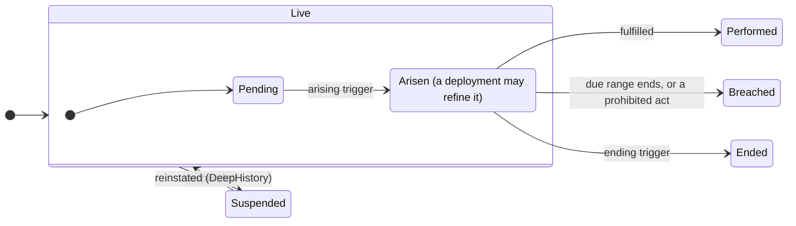

```turtle-vocab
@prefix bhv:  <https://www.nebularis.org/neuro-semantic/lattice/behaviour#> .
@prefix owl:  <http://www.w3.org/2002/07/owl#> .
@prefix rdfs: <http://www.w3.org/2000/01/rdf-schema#> .
@prefix fnd:  <https://www.nebularis.org/neuro-semantic/lattice/foundation#> .
@base <https://www.nebularis.org/neuro-semantic/behaviour-vocab> .

<https://www.nebularis.org/neuro-semantic/behaviour-vocab>
	a owl:Ontology ;
	owl:versionIRI <https://www.nebularis.org/neuro-semantic/lattice/behaviour-vocab/0.10.0> ;
	owl:imports <https://www.nebularis.org/neuro-semantic/lattice/behaviour/0.10.0> .

bhv:ExternalStimulus a bhv:TriggerKind .
bhv:ScheduledTrigger a bhv:TriggerKind .
bhv:DerivedTrigger a bhv:TriggerKind .

bhv:SingleMatch a bhv:SelectionPolicy .
bhv:AllMatches a bhv:SelectionPolicy .
bhv:PriorityOrdered a bhv:SelectionPolicy .

bhv:ImmediateActivation a bhv:ActivationPolicy .
bhv:DeferredActivation a bhv:ActivationPolicy .
bhv:ManualActivation a bhv:ActivationPolicy .

bhv:InstrumentTarget a bhv:TargetKind ;
	owl:deprecated true ;
	rdfs:comment "Deprecated in behaviour-vocab 0.8.0. A target kind is declared by the layer that owns the target, so Instrument declares its own (ADR-A104, ADR-A106)." .
bhv:PartyTarget a bhv:TargetKind .
bhv:AllowanceTarget a bhv:TargetKind .

bhv:DefaultEntry a bhv:EntryMode ;
	rdfs:label "Default entry"@en ;
	rdfs:comment "Each region of the target is entered at its initial state. The mode when none is declared." .
bhv:ShallowHistory a bhv:EntryMode ;
	rdfs:label "Shallow history"@en ;
	rdfs:comment "Each region of the target resumes the state it held when the target was last exited. Below those, regions start at their initial states." .
bhv:DeepHistory a bhv:EntryMode ;
	rdfs:label "Deep history"@en ;
	rdfs:comment "The whole configuration below the target is resumed as it was when the target was last exited." .

bhv:Internal a bhv:TransitionType ;
	rdfs:label "Internal"@en ;
	rdfs:comment "Applies its effects without leaving its state: no occupancy is ended or created. Only from a state to itself, and the default there." .
bhv:External a bhv:TransitionType ;
	rdfs:label "External"@en ;
	rdfs:comment "Leaves its source and enters its target. Always so between two states. Declared on a self-transition that must restart what is anchored on entry." .

bhv:Sequential a bhv:AbsorptionPolicy .
bhv:Proportional a bhv:AbsorptionPolicy .

bhv:B-P1 a bhv:OperationalProfile ; rdfs:comment "Direct transition-evaluation profile" .
bhv:B-P2 a bhv:OperationalProfile ; rdfs:comment "Sequential allowance-evaluation profile" .

# ---- The occasion state space: a fixed core, refined by sub-states ----------
# Its transitions are the runtime evaluator's, derived from the legal
# algorithms and protected by law I7, so they are not declared here. A
# deployment refines a core state with a region of its own (bhv:regionOf,
# bhv:perOccasionOf) and adds regimes per occasion, never a new state of this
# space (CCS C11-Q1). bhv:Live holds the states an occasion can be suspended
# from, so reinstatement is deep history into it (C11a-Q1).

bhv:OccasionStates a bhv:StateSpace ;
	fnd:hasIdentity bhv:OccasionStates-identity ;
	bhv:initialState bhv:Live ;
	rdfs:label "Occasion states"@en ;
	rdfs:comment "The states of an occasion: one legal relation applied to one case." .

bhv:Live a bhv:State ; bhv:inStateSpace bhv:OccasionStates ;
	rdfs:label "Live"@en ;
	rdfs:comment "The occasion has not been performed, breached or ended, and is not suspended: it is pending or arisen. The initial state. The evaluator's." .
bhv:Performed a bhv:State ; bhv:inStateSpace bhv:OccasionStates ;
	rdfs:label "Performed"@en ;
	rdfs:comment "The relation has been fulfilled for the case. The evaluator's." .
bhv:Breached a bhv:State ; bhv:inStateSpace bhv:OccasionStates ;
	rdfs:label "Breached"@en ;
	rdfs:comment "The relation has been breached for the case, as derived or as asserted by an adjudicator. The evaluator's." .
bhv:Ended a bhv:State ; bhv:inStateSpace bhv:OccasionStates ;
	rdfs:label "Ended"@en ;
	rdfs:comment "The relation ended for the case without being performed or breached. The evaluator's." .
bhv:Suspended a bhv:State ; bhv:inStateSpace bhv:OccasionStates ;
	rdfs:label "Suspended"@en ;
	rdfs:comment "The relation is suspended for the case. Entered from bhv:Live. Reinstatement enters bhv:Live by deep history, resuming the state, and any refinement of it, the suspension interrupted (law B5). The evaluator's." .

bhv:LiveStates a bhv:StateSpace ;
	fnd:hasIdentity bhv:LiveStates-identity ;
	bhv:regionOf bhv:Live ;
	bhv:initialState bhv:Pending ;
	rdfs:label "Live states"@en ;
	rdfs:comment "The region of bhv:Live." .

bhv:Pending a bhv:State ; bhv:inStateSpace bhv:LiveStates ;
	rdfs:label "Pending"@en ;
	rdfs:comment "The relation applies to the case, and has not yet arisen. The initial state of bhv:LiveStates. The evaluator's." .
bhv:Arisen a bhv:State ; bhv:inStateSpace bhv:LiveStates ;
	rdfs:label "Arisen"@en ;
	rdfs:comment "The relation has arisen for the case and is live. The state deployments most often refine. The evaluator's." .
```

## 7. Extent profile

The allowance extent profile is how an allowance is measured and drawn down. It was set by the
delivery gates of the first Eligibility and Behaviour build
([validation and test plan](../../docs/validation-and-test-plan.md)). The profile binds directly to Quantification:

- `bhv:AllowanceDefinition` binds to one `qnt:ValueSpace`.
- `bhv:AllowanceAccount` carries one current `qnt:Quantity` balance.
- `bhv:Sequential` absorption is supported.
- `bhv:Proportional` is declared but rejected by a shape (`bhv:SequentialOnlyAtGate3`), so its
  deferred status is visible rather than silent (ADR-A11).

`bhv:Proportional` stays unusable until the repository carries two non-domain motivating examples,
an explicit proportional conservation law, and cross-profile conformance coverage. Reset edge cases
are deferred for the same reason: they need explicit law statements and fixtures, not inferred
behaviour. Proportional absorption is the merge rule of a parallel environment, which the
[evaluation context](../../docs/developer/sketches/evaluation-context.md) sketch (§7) takes up.

State occupancy records distinguish hypothetical from current execution state through `bhv:isHypothetical` and `bhv:isCurrent`. A non-hypothetical subject may have at most one current occupancy in a given state space.

## 8. Shapes

`shapes/constraints.ttl` adds the checks that need SPARQL: an initial state belongs to its own
space, an occupancy of an occasion state, or of a state nested in one, is derived from a record
(law B1), and the nested-state rules of §5.3: regions nest without a cycle, history targets a
composite, only a self-transition is internal, one tree per transition and closed refinements
(B9), `AllMatches` only on internal transitions with distinct priorities, one selection policy
among state-changing competitors, resumption as history (B5) and a well-formed configuration
(B11). The target rule is checked without inference: the alternative path names `bhv:targets` and its
sub-properties, so an effect targeting an allowance conforms without a reasoner deriving
`bhv:targets`. Selection and activation policies stay required on every transition (ADR-A09,
ADR-A10, ADR-A106 decision 6).

```turtle-shapes
@prefix sh:   <http://www.w3.org/ns/shacl#> .
@prefix bhv:  <https://www.nebularis.org/neuro-semantic/lattice/behaviour#> .
@prefix pty:  <https://www.nebularis.org/neuro-semantic/lattice/party#> .
@prefix fnd:  <https://www.nebularis.org/neuro-semantic/lattice/foundation#> .
@prefix elg:  <https://www.nebularis.org/neuro-semantic/lattice/eligibility#> .
@prefix xsd:  <http://www.w3.org/2001/XMLSchema#> .

bhv:TransitionDefinitionShape a sh:NodeShape ;
	sh:targetClass bhv:TransitionDefinition ;
	sh:property [ sh:path bhv:fromState ; sh:minCount 1 ; sh:maxCount 1 ] ;
	sh:property [ sh:path bhv:toState ; sh:minCount 1 ; sh:maxCount 1 ] ;
	sh:property [ sh:path bhv:hasTrigger ; sh:minCount 1 ] ;
	sh:property [ sh:path bhv:selectionPolicy ; sh:minCount 1 ; sh:maxCount 1 ] ;
	sh:property [ sh:path bhv:activationPolicy ; sh:minCount 1 ; sh:maxCount 1 ] ;
	sh:property [ sh:path bhv:entryMode ; sh:maxCount 1 ;
		sh:in ( bhv:DefaultEntry bhv:ShallowHistory bhv:DeepHistory ) ;
		sh:message "A transition has at most one entry mode: default, shallow history or deep history." ] ;
	sh:property [ sh:path bhv:transitionType ; sh:maxCount 1 ;
		sh:in ( bhv:Internal bhv:External ) ;
		sh:message "A transition is Internal or External, at most one." ] .

bhv:TransitionSubjectShape a sh:NodeShape ;
	sh:targetSubjectsOf bhv:entryMode , bhv:transitionType ;
	sh:class bhv:TransitionDefinition ;
	sh:message "Only a transition definition has an entry mode or a transition type." .

# ---- Regions and occasions -------------------------------------------------------

bhv:RegionShape a sh:NodeShape ;
	sh:targetSubjectsOf bhv:regionOf , bhv:perOccasionOf ;
	sh:class bhv:StateSpace ;
	sh:property [ sh:path bhv:regionOf ; sh:maxCount 1 ; sh:class bhv:State ;
		sh:message "A region refines at most one state." ] ;
	sh:message "Only a state space is a region or is instantiated per occasion." .

# ---- Guards that read a state ----------------------------------------------------

bhv:StateGuardShape a sh:NodeShape ;
	sh:targetSubjectsOf bhv:requiresState , bhv:excludesState ;
	sh:class bhv:GuardDefinition ;
	sh:property [ sh:path bhv:requiresState ; sh:class bhv:State ] ;
	sh:property [ sh:path bhv:excludesState ; sh:class bhv:State ] ;
	sh:message "Only a guard requires or excludes a state." .

bhv:EffectDefinitionShape a sh:NodeShape ;
	sh:targetClass bhv:EffectDefinition ;
	sh:property [ sh:path bhv:targetKind ; sh:minCount 1 ; sh:maxCount 1 ;
		sh:message "An effect declares exactly one target kind." ] ;
	sh:property [ sh:path [ sh:alternativePath ( bhv:targets bhv:targetsOccupancy bhv:targetsAllowance ) ] ; sh:minCount 1 ;
		sh:message "An effect names at least one target, through bhv:targets or one of its sub-properties." ] .

bhv:AllowanceDefinitionShape a sh:NodeShape ;
	sh:targetClass bhv:AllowanceDefinition ;
	sh:property [ sh:path bhv:allowanceSpace ; sh:minCount 1 ; sh:maxCount 1 ] ;
	sh:property [ sh:path bhv:absorptionPolicy ; sh:minCount 1 ; sh:maxCount 1 ] .

bhv:AllowanceAccountShape a sh:NodeShape ;
	sh:targetClass bhv:AllowanceAccount ;
	sh:property [ sh:path bhv:tracksAllowance ; sh:minCount 1 ; sh:maxCount 1 ] ;
	sh:property [ sh:path bhv:availableBalance ; sh:minCount 1 ; sh:maxCount 1 ] .

bhv:InitialStateShape a sh:NodeShape ;
	sh:targetClass bhv:StateSpace ;
	sh:property [ sh:path bhv:initialState ; sh:maxCount 1 ; sh:class bhv:State ;
		sh:message "A state space has at most one initial state." ] .

# ---- B6: every state entry is recorded ---------------------------------------

bhv:StateEntryRecordedShape a sh:NodeShape ;
	sh:targetClass bhv:StateOccupancy ;
	sh:or (
		[ sh:path bhv:enteredBy ; sh:minCount 1 ]
		[ sh:path fnd:hasEvidence ; sh:minCount 1 ]
	) ;
	sh:message "A state occupancy names the execution that entered it, or carries evidence (law B6)." ;
	sh:property [ sh:path bhv:enteredBy ; sh:maxCount 1 ; sh:class bhv:TransitionExecution ;
		sh:node [ sh:property [ sh:path bhv:causedByStimulus ; sh:minCount 1 ;
			sh:message "An execution that entered a state names the stimulus that caused it (law B6)." ] ] ] .

bhv:EnteredBySubjectShape a sh:NodeShape ;
	sh:targetSubjectsOf bhv:enteredBy , bhv:exitedBy , bhv:resumedFrom ;
	sh:class bhv:StateOccupancy ;
	sh:message "Only a state occupancy is entered, exited or resumed." .

bhv:StateExitRecordedShape a sh:NodeShape ;
	sh:targetClass bhv:StateOccupancy ;
	sh:property [ sh:path bhv:exitedBy ; sh:maxCount 1 ; sh:class bhv:TransitionExecution ;
		sh:node [ sh:property [ sh:path bhv:causedByStimulus ; sh:minCount 1 ] ] ;
		sh:message "An execution that ended a state names the stimulus that caused it (law B6), and an occupancy is ended at most once." ] ;
	sh:property [ sh:path bhv:resumedFrom ; sh:maxCount 1 ; sh:class bhv:StateOccupancy ;
		sh:message "An occupancy resumes at most one earlier occupancy." ] .

# ---- Occasions, with parties fixed at arising (I11) -------------------------------

bhv:OccasionSubjectShape a sh:NodeShape ;
	sh:targetSubjectsOf bhv:occasionOf , bhv:occasionParty ;
	sh:class bhv:Occasion ;
	sh:message "Only an occasion applies a declaration or has occasion parties." .

bhv:ForCaseSubjectShape a sh:NodeShape ;
	sh:targetSubjectsOf bhv:forCase ;
	sh:or ( [ sh:class bhv:Occasion ] [ sh:class bhv:ActRecord ] ) ;
	sh:message "Only an occasion or an act record is for a case." .

bhv:OccasionShape a sh:NodeShape ;
	sh:targetClass bhv:Occasion ;
	sh:property [ sh:path bhv:occasionOf ; sh:minCount 1 ; sh:maxCount 1 ] ;
	sh:property [ sh:path bhv:forCase ; sh:minCount 1 ; sh:maxCount 1 ] ;
	sh:property [ sh:path bhv:occasionParty ; sh:class pty:RoleOccupancy ;
		sh:not [ sh:class fnd:PersistentIdentity ] ;
		sh:message "An occasion's parties are role occupancy versions, fixed at arising, never persistent identities (law I11)." ] .

# ---- Records ----------------------------------------------------------------------

bhv:RecordSubjectShape a sh:NodeShape ;
	sh:targetSubjectsOf bhv:fromStimulus , bhv:actor ;
	sh:class bhv:Record ;
	sh:message "Only a record comes from a stimulus or names an actor." .

bhv:RecordShape a sh:NodeShape ;
	sh:targetClass bhv:Record ;
	sh:property [ sh:path bhv:fromStimulus ; sh:maxCount 1 ; sh:class bhv:Stimulus ] ;
	sh:property [ sh:path bhv:actor ; sh:class pty:RoleOccupancy ] .

bhv:ActRecordSubjectShape a sh:NodeShape ;
	sh:targetSubjectsOf bhv:activity ; sh:class bhv:ActRecord ;
	sh:message "Only an act record names an activity." .
bhv:ActRecordShape a sh:NodeShape ;
	sh:targetClass bhv:ActRecord ;
	sh:property [ sh:path bhv:activity ; sh:minCount 1 ; sh:maxCount 1 ; sh:nodeKind sh:IRI ] ;
	sh:property [ sh:path bhv:forCase ; sh:minCount 1 ; sh:maxCount 1 ] .

bhv:BreachRecordSubjectShape a sh:NodeShape ;
	sh:targetSubjectsOf bhv:ofOccasion , bhv:closureReliedOn ; sh:class bhv:BreachRecord ;
	sh:message "Only a breach record names an occasion or a closure relied on." .
bhv:BreachRecordShape a sh:NodeShape ;
	sh:targetClass bhv:BreachRecord ;
	sh:property [ sh:path bhv:ofOccasion ; sh:minCount 1 ; sh:maxCount 1 ; sh:class bhv:Occasion ] .

bhv:ExerciseRecordSubjectShape a sh:NodeShape ;
	sh:targetSubjectsOf bhv:exercised , bhv:tookEffect , bhv:reasonNotTaken ; sh:class bhv:ExerciseRecord ;
	sh:message "Only an exercise record names what was exercised and whether it took effect." .
bhv:ExerciseRecordShape a sh:NodeShape ;
	sh:targetClass bhv:ExerciseRecord ;
	sh:property [ sh:path bhv:exercised ; sh:minCount 1 ; sh:maxCount 1 ] ;
	sh:property [ sh:path bhv:tookEffect ; sh:minCount 1 ; sh:maxCount 1 ; sh:datatype xsd:boolean ] ;
	sh:property [ sh:path bhv:reasonNotTaken ; sh:maxCount 1 ; sh:datatype xsd:string ] .

bhv:DeterminationRecordSubjectShape a sh:NodeShape ;
	sh:targetSubjectsOf bhv:matter , bhv:determiner , bhv:determinedValue ; sh:class bhv:DeterminationRecord ;
	sh:message "Only a determination record names a matter, a determiner or a determined value." .
bhv:DeterminationRecordShape a sh:NodeShape ;
	sh:targetClass bhv:DeterminationRecord ;
	sh:property [ sh:path bhv:matter ; sh:minCount 1 ; sh:maxCount 1 ] ;
	sh:property [ sh:path bhv:determiner ; sh:minCount 1 ; sh:maxCount 1 ; sh:class pty:RoleOccupancy ] ;
	sh:property [ sh:path bhv:determinedValue ; sh:minCount 1 ] .

bhv:DeemedFactRecordSubjectShape a sh:NodeShape ;
	sh:targetSubjectsOf bhv:deeming , bhv:conditionSatisfied ; sh:class bhv:DeemedFactRecord ;
	sh:message "Only a deemed-fact record names a deeming or the condition satisfied." .
bhv:DeemedFactRecordShape a sh:NodeShape ;
	sh:targetClass bhv:DeemedFactRecord ;
	sh:property [ sh:path bhv:deeming ; sh:minCount 1 ; sh:maxCount 1 ] ;
	sh:property [ sh:path bhv:conditionSatisfied ; sh:maxCount 1 ; sh:class elg:Condition ] .

bhv:AcceptanceRecordSubjectShape a sh:NodeShape ;
	sh:targetSubjectsOf bhv:accepted ; sh:class bhv:AcceptanceRecord ;
	sh:message "Only an acceptance record names a version accepted." .
bhv:AcceptanceRecordShape a sh:NodeShape ;
	sh:targetClass bhv:AcceptanceRecord ;
	sh:property [ sh:path bhv:accepted ; sh:minCount 1 ; sh:maxCount 1 ; sh:class fnd:Version ] ;
	sh:property [ sh:path bhv:actor ; sh:minCount 1 ] .
```

## 9. Worked examples

Examples are authored in:

- `ontology/behaviour/examples/state-transition.ttl`
- `ontology/behaviour/examples/sequential-allowance.ttl`
- `ontology/behaviour/examples/adverse-event-occasion.ttl`: an occasion of a reporting duty that
  arises on an event and is breached when its window closes, each state derived from its record
- `ontology/behaviour/examples/licence-suspension.ttl`: a state space with an initial state, exercise
  records that took effect and one that did not, and acceptance, determination and deemed-fact
  records
- eight worked state machines for nested states, history, internal transitions and concurrent
  regimes, each taken in turn in §10

```turtle-example
@prefix bhv: <https://www.nebularis.org/neuro-semantic/lattice/behaviour#> .
@prefix ex:  <https://example.org/lattice/behaviour/> .

ex:exec-1 a bhv:TransitionExecution .
```

## 10. Worked state machines

Each example below is a full configuration and a full record of what happened, in
`examples/`. Every occupancy names the execution that entered it and the one that ended it, every
execution names its stimulus, and every occupancy has its valid time. The sections show the
statechart, the configuration that matters in Turtle, the occupancies as a timeline, and what the
example proves.

Relations gated on states belong to the layer above. The examples point at them with `ex:` names
and describe them in words, since Behaviour names no term of a higher layer (B7).

| § | Example | Construct |
|---|---|---|
| 10.1 | [`covenant-default.ttl`](examples/covenant-default.ttl) | a compound state, default entry, leaving from a composite |
| 10.2 | [`run-off.ttl`](examples/run-off.ttl) | a parallel state, regions moving independently, all ending together |
| 10.3 | [`standstill.ttl`](examples/standstill.ttl) | three levels, deep history and shallow history |
| 10.4 | [`garden-leave.ttl`](examples/garden-leave.ttl) | separate regimes instead of nesting, a guard reading a state, an external self-transition |
| 10.5 | [`force-majeure.ttl`](examples/force-majeure.ttl) | overlapping regimes acting on each other through an exercise |
| 10.6 | [`occasion-refinement.ttl`](examples/occasion-refinement.ttl) | refining `bhv:Arisen`, suspension and reinstatement into `bhv:Live` |
| 10.7 | [`disputed-occasion.ttl`](examples/disputed-occasion.ttl) | a regime per occasion |
| 10.8 | [`ordered-draws.ttl`](examples/ordered-draws.ttl) | `AllMatches` over internal transitions, then a state change, in one pass |

### 10.1 A cure period within default

A facility tests a leverage covenant each quarter. A failed test puts it in default, which starts
with a cure period of 20 business days and is then uncured. The lenders may accelerate only once it
is uncured. Meeting the covenant again cures the default from either stage.

The cure period passes the first test of §5.3: it means nothing outside a default. So default is
compound.

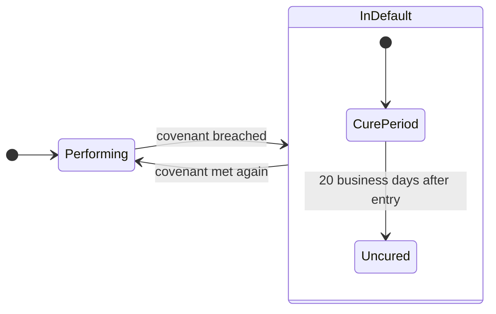

The region is a state space naming its parent. The cure leaves from the composite, so it ends
whichever stage holds:

```turtle-example
ex:default-stages a bhv:StateSpace ;
    bhv:regionOf ex:default ;
    bhv:initialState ex:cure-period .

ex:cure a bhv:TransitionDefinition ;
    bhv:fromState ex:default ;
    bhv:toState ex:performing ;
    bhv:hasTrigger ex:on-covenant-met ;
    bhv:selectionPolicy bhv:SingleMatch ;
    bhv:activationPolicy bhv:ImmediateActivation .
```

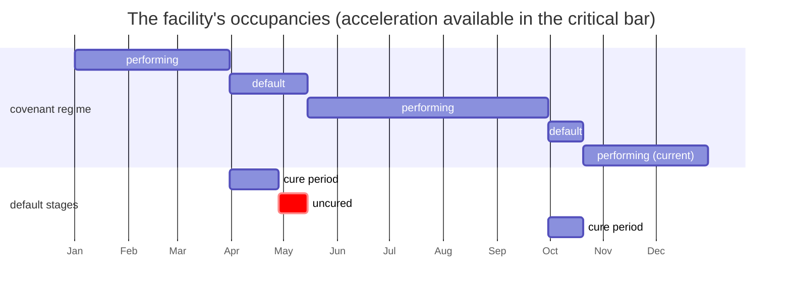

| Date | Stimulus | Exited | Entered |
|---|---|---|---|
| 2027-01-01 | takes effect | | performing, with evidence |
| 2027-03-31 | Q1 test failed | performing | default and cure period, by one execution |
| 2027-04-28 | 20 business days pass | cure period | uncured |
| 2027-05-15 | equity cure | uncured, then default | performing |
| 2027-09-30 | Q3 test failed | performing | default, cure period |
| 2027-10-20 | cured within the cure period | cure period, then default | performing |

**Proves:** entry into a composite enters its initial stage with it (B6 names one execution for
both), and a transition from a composite ends its stages first, deepest first.

### 10.2 Run-off as a parallel state

A terminated binding authority goes into run-off for six years. The coverholder keeps servicing
claims and collecting premium. The insurer may suspend and reinstate claims authority while
premium collection runs on. When run-off ends, both end.

Both machines pass the exit test, and each runs on its own, so run-off has two regions.

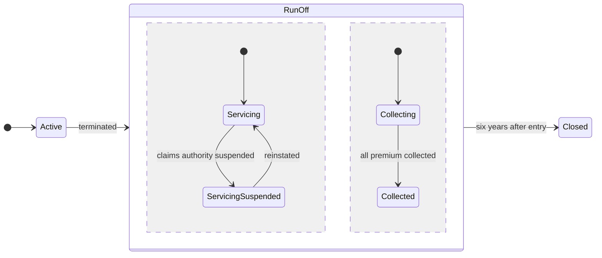

Two regions name the same state, which makes it parallel:

```turtle-example
ex:claims-servicing a bhv:StateSpace ;
    bhv:regionOf ex:run-off ;
    bhv:initialState ex:servicing .

ex:premium-collection a bhv:StateSpace ;
    bhv:regionOf ex:run-off ;
    bhv:initialState ex:collecting .
```

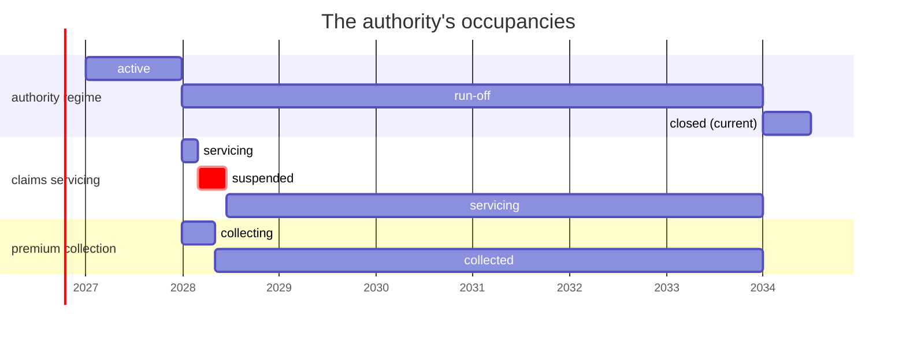

**Proves:** one execution enters a parallel state and every region's initial state. Each region
holds exactly one current state while its parent holds (B11). Leaving the parent ends both regions'
states, then the parent, with one execution.

### 10.3 Standstill: deep and shallow history

Two facilities on the same terms fall into default, let the cure period run out, and agree a
standstill. Facility A's standstill expires and it resumes exactly where it was: uncured. Facility
B's lenders reinstate it early with a fresh cure period: it returns to default, but its stages
start again.

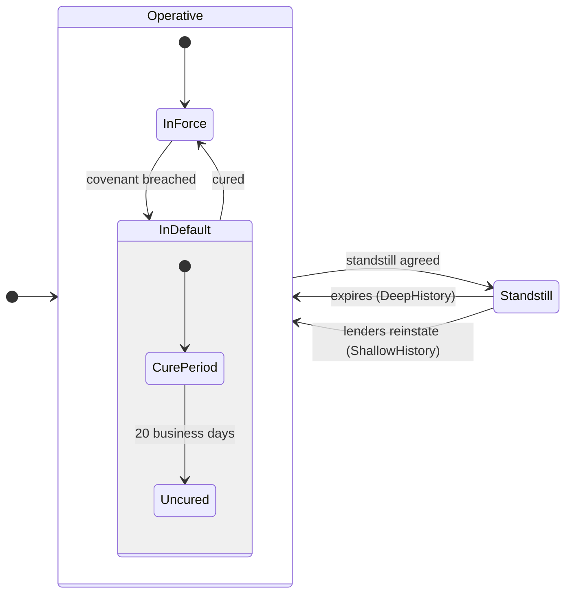

History is declared on each returning transition, not on `Operative`:

```turtle-example
ex:standstill-expires a bhv:TransitionDefinition ;
    bhv:fromState ex:standstill ;
    bhv:toState ex:operative ;
    bhv:entryMode bhv:DeepHistory ;
    bhv:hasTrigger ex:on-standstill-expiry ;
    bhv:selectionPolicy bhv:SingleMatch ;
    bhv:activationPolicy bhv:ImmediateActivation .

ex:reinstate-with-fresh-cure a bhv:TransitionDefinition ;
    bhv:fromState ex:standstill ;
    bhv:toState ex:operative ;
    bhv:entryMode bhv:ShallowHistory ;
    bhv:hasTrigger ex:on-reinstatement ;
    bhv:selectionPolicy bhv:SingleMatch ;
    bhv:activationPolicy bhv:ImmediateActivation .
```

The standstill's execution ends three occupancies. Facility A's return resumes each of them:

```turtle-example
ex:a-occ-uncured-1 a bhv:StateOccupancy ;
    bhv:forSubject ex:facility-a ;
    bhv:occupiesState ex:uncured ;
    bhv:enteredBy ex:a-exec-2 ;
    bhv:exitedBy ex:a-exec-3 .          # the standstill

ex:a-occ-uncured-2 a bhv:StateOccupancy ;
    bhv:forSubject ex:facility-a ;
    bhv:occupiesState ex:uncured ;
    bhv:enteredBy ex:a-exec-4 ;         # the expiry, DeepHistory
    bhv:resumedFrom ex:a-occ-uncured-1 .
```

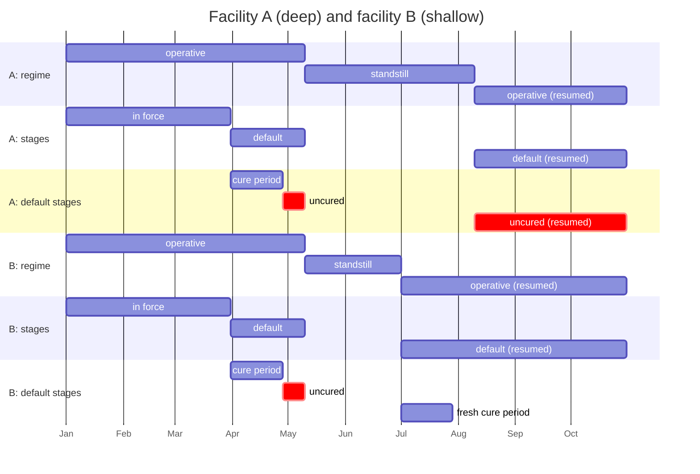

**Proves:** history stores nothing of its own. It reads what the target's last exit ended
(`bhv:exitedBy`), and each resumed occupancy points back with `bhv:resumedFrom` (B5). Deep history
restores every level. Shallow history restores one level and enters the rest by default, so
facility B's fresh cure period resumes nothing.

### 10.4 Garden leave: separate regimes, not nesting

An employment has a termination regime and an attendance regime. Garden leave can start with no
notice given, notice can be served during garden leave, and garden leave depends on no stage of
notice. None of the tests of §5.3 holds, so the two are separate regimes on one subject.

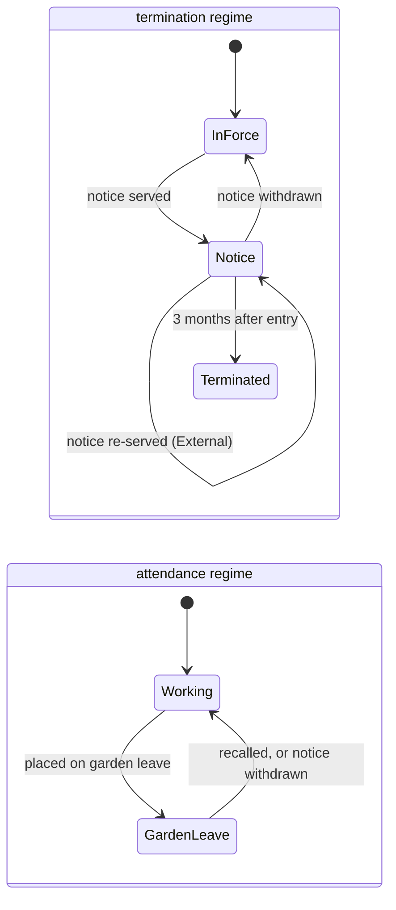

Two contracts differ only in their attendance regime. Ben's allows garden leave only during notice,
which is a guard reading the other regime, and ends it when notice is withdrawn, which is a
transition on the same trigger as the withdrawal:

```turtle-example
ex:only-during-notice a bhv:GuardDefinition ;
    bhv:requiresState ex:notice .

ex:b-place-on-garden-leave a bhv:TransitionDefinition ;
    bhv:fromState ex:b-working ;
    bhv:toState ex:b-garden-leave ;
    bhv:hasTrigger ex:on-garden-leave-directed ;
    bhv:hasGuard ex:only-during-notice ;
    bhv:selectionPolicy bhv:SingleMatch ;
    bhv:activationPolicy bhv:ImmediateActivation .

ex:b-end-garden-leave-on-withdrawal a bhv:TransitionDefinition ;
    bhv:fromState ex:b-garden-leave ;
    bhv:toState ex:b-working ;
    bhv:hasTrigger ex:on-notice-withdrawn ;
    bhv:selectionPolicy bhv:SingleMatch ;
    bhv:activationPolicy bhv:ImmediateActivation .
```

Re-serving notice must restart the three months, which are anchored on entry, so it is external:

```turtle-example
ex:re-serve-notice a bhv:TransitionDefinition ;
    bhv:fromState ex:notice ;
    bhv:toState ex:notice ;
    bhv:transitionType bhv:External ;
    bhv:hasTrigger ex:on-notice-served ;
    bhv:selectionPolicy bhv:SingleMatch ;
    bhv:activationPolicy bhv:ImmediateActivation .
```

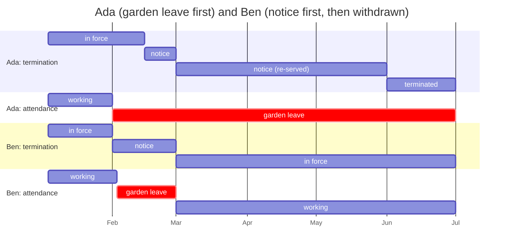

On 2027-01-20 the employer tried to put Ben on garden leave before any notice. The guard failed:
no execution, no occupancy, and an exercise record with `bhv:tookEffect false` and its reason.
On 2027-03-01 one stimulus took a transition in each of Ben's regimes, in one pass.

**Proves:** a dependency between regimes is a guard or a trigger, and either order of events is
an ordinary configuration. An external self-transition gives a new occupancy and a new entry time.
An internal one would not.

### 10.5 Force majeure overlapping notice

A supply agreement has a termination regime and a force majeure regime. A flood stops the
supplier. While it continues the buyer serves notice for convenience. When the force majeure has
lasted 90 days it is prolonged, and the buyer terminates at once for prolonged force majeure.

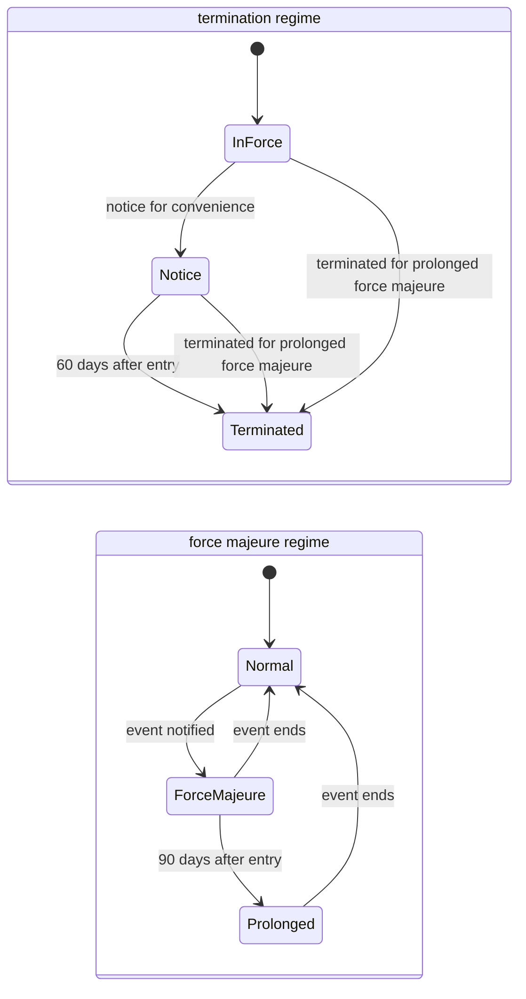

The regimes do not refer to each other. The power to terminate for prolonged force majeure is
gated on `ex:prolonged` by the layer above, and its exercise is the termination regime's trigger:

```turtle-example
ex:on-termination-for-force-majeure a bhv:TriggerDefinition ;
    bhv:triggerKind bhv:ExternalStimulus .

ex:terminate-for-force-majeure-on-notice a bhv:TransitionDefinition ;
    bhv:fromState ex:notice ;
    bhv:toState ex:terminated ;
    bhv:hasTrigger ex:on-termination-for-force-majeure ;
    bhv:selectionPolicy bhv:SingleMatch ;
    bhv:activationPolicy bhv:ImmediateActivation .
```

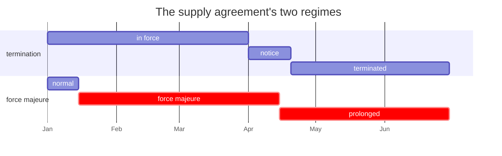

The notice's own expiry, due on 2027-05-31, never becomes a stimulus: the notice state was left
first. Whether a notice period runs during force majeure is a term of the contract, declared on the
expiry trigger by the layer above. This contract says it runs.

**Proves:** concurrent regimes need no ranking. One regime acts on another only through something
a party does.

### 10.6 Refining an occasion, and reinstating it

An insurer's duty to indemnify arises for each claim. The deployment refines `bhv:Arisen` with
claims handling. Claim 41 is notified, an adjuster appointed, and cover suspended for unpaid
premium. On reinstatement the claim returns under assessment, not back to notified.

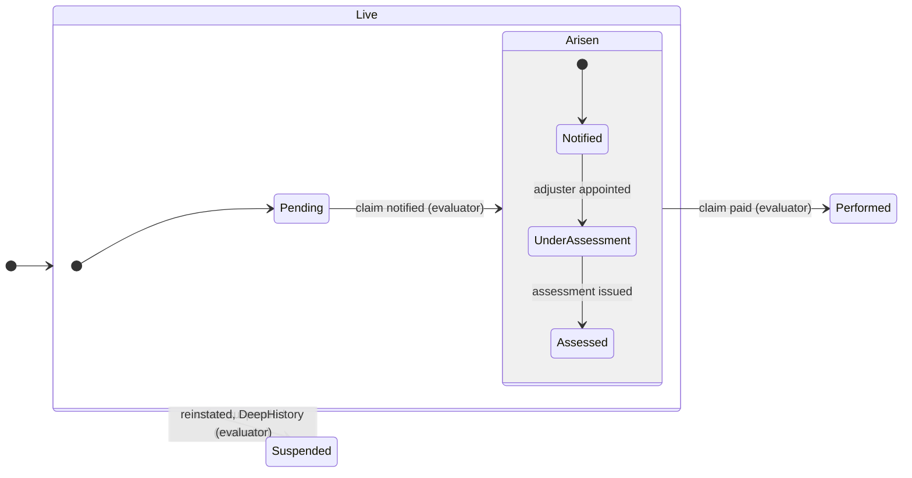

The refinement is a region of the core state, instantiated for one relation's occasions. Its own
transitions stay inside it (B9). The evaluator's transitions are not configuration:

```turtle-example
ex:claims-handling a bhv:StateSpace ;
    bhv:regionOf bhv:Arisen ;
    bhv:perOccasionOf ex:indemnify-insured ;
    bhv:initialState ex:notified .

ex:appoint-adjuster a bhv:TransitionDefinition ;
    bhv:fromState ex:notified ;
    bhv:toState ex:under-assessment ;
    bhv:hasTrigger ex:on-adjuster-appointed ;
    bhv:selectionPolicy bhv:SingleMatch ;
    bhv:activationPolicy bhv:ImmediateActivation .
```

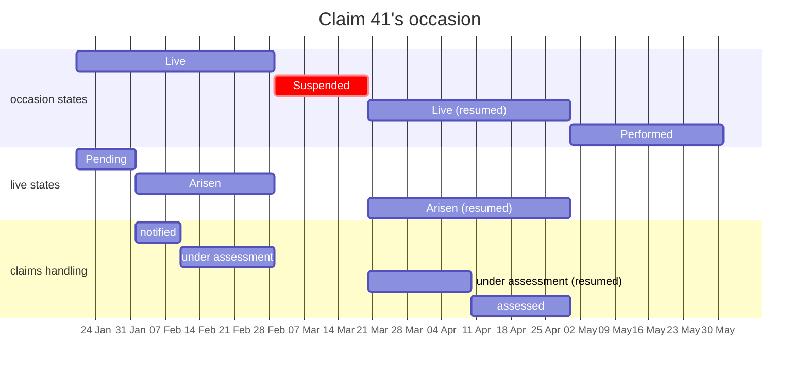

Every occupancy is derived from the record it rests on (B1), the refinement's included.

**Proves:** a deployment can see where an arisen occasion has got to without reaching the
evaluator's transitions. Suspension and reinstatement use the same deep history as any other
state, so the refinement survives them.

### 10.7 A dispute per occasion

A services agreement obliges the client to pay each invoice within 30 days. A dispute regime runs
once per occasion of that duty. Invoice 101 goes unpaid and is disputed, so its occasion is
breached and disputed at once until an expert determines it. Invoice 102 is paid on time.

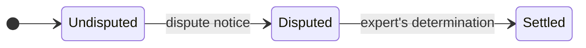

```turtle-example
ex:dispute-regime a bhv:StateSpace ;
    bhv:perOccasionOf ex:pay-invoice ;
    bhv:initialState ex:undisputed .
```

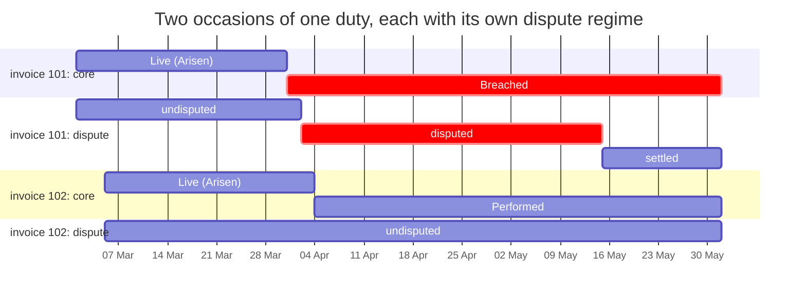

The dispute does not change the occasion's core state: invoice 101 is breached whatever the
dispute. What it changes is a consequence the layer above gates on `ex:disputed`, an exclusion of
the power to terminate for non-payment, read from the dispute regime of the occasion the breach
belongs to.

**Proves:** a regime per occasion keeps each case's history separate, and runs beside the core
states without touching them.

### 10.8 Ordered draws in one pass

A licence comes with a prepaid bundle of 3 seats and a quota of 3 low-balance alerts a year. Each
seat activation draws a seat, then an alert if the activation leaves fewer than 2 seats, then moves
the licence to overage billing once the bundle is empty.

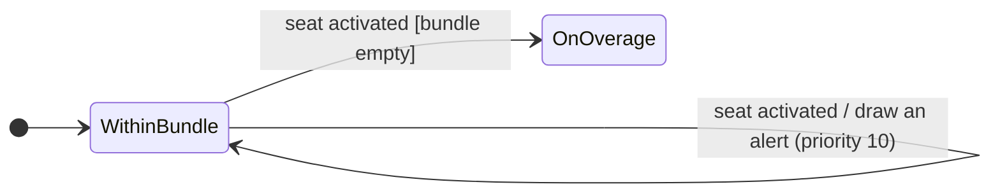

The two draws are internal transitions under `bhv:AllMatches`, with distinct priorities. The state
change is a separate transition on the same trigger, which fires after them:

```turtle-example
ex:draw-a-seat a bhv:TransitionDefinition ;
    bhv:fromState ex:within-bundle ;
    bhv:toState ex:within-bundle ;
    bhv:hasTrigger ex:on-seat-activated ;
    bhv:hasGuard ex:while-a-seat-remains ;
    bhv:hasEffect ex:take-a-seat ;
    bhv:selectionPolicy bhv:AllMatches ;
    bhv:priority 20 ;
    bhv:activationPolicy bhv:ImmediateActivation .

ex:draw-an-alert a bhv:TransitionDefinition ;
    bhv:fromState ex:within-bundle ;
    bhv:toState ex:within-bundle ;
    bhv:hasTrigger ex:on-seat-activated ;
    bhv:hasGuard ex:when-few-seats-remain ;
    bhv:hasEffect ex:send-an-alert ;
    bhv:selectionPolicy bhv:AllMatches ;
    bhv:priority 10 ;
    bhv:activationPolicy bhv:ImmediateActivation .
```

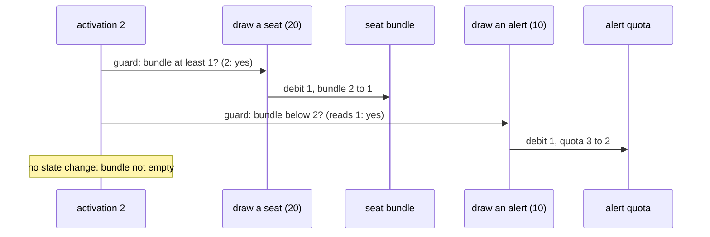

| Activation | Seat draw | Alert draw | State change |
|---|---|---|---|
| 1 | bundle 3 to 2 | no: 2 seats remain | no |
| 2 | bundle 2 to 1 | yes: quota 3 to 2 | no |
| 3 | bundle 1 to 0 | yes: quota 2 to 1 | within bundle to on overage |

The licence holds one occupancy of `within-bundle` from taking effect until the third activation:
the internal transitions created none.

**Proves:** under `AllMatches` every enabled internal transition fires, in descending priority,
each guard reading what the one before it left, and the state change follows in the same pass. A
guard reading the bundle as the pass found it would have sent no alert on activation 2. That
reading is the parallel environment, which is deferred to the
[evaluation context](../../docs/developer/sketches/evaluation-context.md) design. Either-or
consequences, such as "from the bundle, else from overage", are `bhv:PriorityOrdered` instead,
where only the highest enabled transition fires.

## 11. Release notes

Breaking versions at major version zero ([ADR-A113](../../docs/architecture/decisions/ADR-A113-breaking-changes-at-major-version-zero.md)):

- 0.8.0 (breaking): Behaviour no longer imports Instrument, and moves below it. `bhv:targetsElement`
  is replaced by `bhv:targets`, with no range. `bhv:forSubject` loses its range. A transition needs
  no effect. The occurrence, execution and state record tiers move to `behaviour-runtime` 0.8.0.
  `bhv:InstrumentTarget` is deprecated. ADR-A106.
- 0.9.0: occasions, records and `bhv:initialState` added (`behaviour` and `behaviour-runtime` 0.9.0,
  additive). Shapes 0.3.0 (breaking): every state occupancy must name the execution that entered it
  or carry evidence (law B6), and an occasion's parties must be role occupancy versions (law I11).
  ADR-A106.
- 0.10.0: regions (`bhv:regionOf`), per-occasion spaces (`bhv:perOccasionOf`), entry modes and
  transition types, guards that read a state, and `bhv:exitedBy` and `bhv:resumedFrom` (`behaviour`
  and `behaviour-runtime` 0.10.0, additive). `behaviour-vocab` 0.10.0 (breaking): `bhv:Live` becomes
  the occasion space's initial state, with `bhv:Pending` and `bhv:Arisen` moved into its region
  `bhv:LiveStates`, so data reading `bhv:inStateSpace bhv:OccasionStates` for those two finds
  nothing. Shapes 0.4.0 (breaking): the nested-state rules of §5.3, `AllMatches` only on internal
  transitions with distinct priorities, one selection policy among state-changing competitors, and
  laws B5, B9 and B11. ADR-A106 addendum (2026-10-02).
