<!-- SPDX-License-Identifier: CC-BY-SA-4.0 -->

# Eligibility Ontology — Conditions, Questions, and Admissibility Decisions

Literate specification for the Eligibility layer.

---

## 1. Purpose and Scope

Eligibility models admissibility by declaring reusable conditions, collecting evaluation questions, and recording a three-valued decision (`Permitted`, `Denied`, `Undetermined`).

Eligibility imports Foundation, Vocabulary, Quantification, and Party. Quantification is a direct dependency because interval admissibility uses declared `qnt:Range` and `qnt:RangeSet` semantics.

## 2. Namespace and Prefixes

```turtle-spec
@prefix elg:  <https://www.nebularis.org/neuro-semantic/lattice/eligibility#> .
@prefix fnd:  <https://www.nebularis.org/neuro-semantic/lattice/foundation#> .
@prefix voc:  <https://www.nebularis.org/neuro-semantic/lattice/vocabulary#> .
@prefix qnt:  <https://www.nebularis.org/neuro-semantic/lattice/quantification#> .
@prefix pty:  <https://www.nebularis.org/neuro-semantic/lattice/party#> .
@prefix owl:  <http://www.w3.org/2002/07/owl#> .
@prefix rdf:  <http://www.w3.org/1999/02/22-rdf-syntax-ns#> .
@prefix rdfs: <http://www.w3.org/2000/01/rdf-schema#> .
@prefix xsd:  <http://www.w3.org/2001/XMLSchema#> .
@prefix skos: <http://www.w3.org/2004/02/skos/core#> .
@base <https://www.nebularis.org/neuro-semantic/eligibility> .
```

## 3. Extraction Contract

- `turtle-spec` blocks generate `spec/eligibility.ttl`.
- `turtle-vocab` blocks generate `vocab/eligibility-vocab.ttl`.
- `turtle-shapes` blocks generate, in order, `shapes/structural.ttl` (§7.1),
  `shapes/constraints.ttl` (§7.2) and `shapes/rules.ttl` (§7.3).
- `turtle-example` blocks are illustrative only.
- `isabelle-spec` blocks (§10) generate `tools/proofs/eligibility/Kernel.thy`'s closed
  datatype and the kernel connectives' defining equations (`or3`, `and3`, `neg3`; FM-D17),
  and are also rendered into `tools/reference/eligibility/src/reference_eligibility/_kernel_defs.py`.
  The theory's proofs, and `decision_leq`, are hand-written, not generated.

```bash
python3 tools/literate_extract.py ontology/eligibility/README.md --layer eligibility --root . \
    --shapes shapes/structural.ttl shapes/constraints.ttl shapes/rules.ttl \
    --proofs-root tools/proofs --reference-root tools/reference --check
```

## 4. Strategy Algebra

- Included match strategies: `ExactMatch`, `SetMembership`, `IntervalContainment`, `HierarchicalMatch`, `Wildcard`.
- Excluded: `IntervalOverlap` as an admissibility strategy.
- Compatibility operations: `AllRequired`, `AnySufficient`, `DimensionConsistent`.
- Wildcard policies: `NoWildcard`, `SingleDimensionWildcard`, `MultiDimensionWildcard`.

Every condition declares exactly one of each mechanism, independently of the other two:

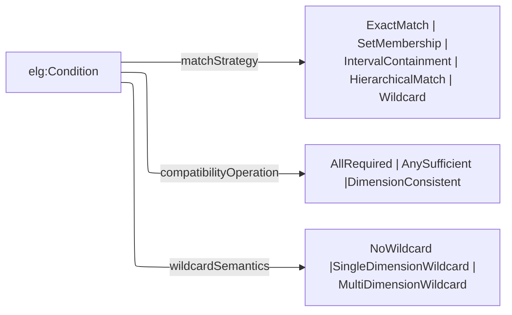

`HierarchicalMatch` is valid when a dimension is backed by a concept scheme whose membership is resolved against a well-founded `skos:broader` hierarchy. Evaluation may compute closure at query time or use a generated surface, provided closure is interpreted over the bound scheme. A scheme can reach a hierarchical condition without a hierarchy, because a contract resolves to different schemes in different contexts (ADR-A85). Where no member of the resolved scheme has a broader concept within it, the condition decides only the concepts it names (L14, ADR-A100).

Conditions matching by `ExactMatch`, `SetMembership`, or `HierarchicalMatch` state what they match against with `elg:requiredConcept` and `elg:excludedConcept`. A candidate *matches* a concept by equality under `ExactMatch` and `SetMembership`, and by standing at or below it in the bound scheme's ordering under `HierarchicalMatch`. Several required concepts are alternatives to one another, and each excluded concept excludes independently. Neither reading changes how the condition's compatibility operation is interpreted. An admission profile declares no concepts of its own, since its conditions do. A layer above may place one of its defined words, itself a `skos:Concept`, in `elg:requiredConcept` or `elg:excludedConcept` ("a Site in the Territory"), and replace it for each instance by the concepts the word means, so that a condition it generates never names a word. Instrument does, and its shapes report a word that is also a concept of the scheme its condition is constrained by, and a word whose meaning is not a concept (Instrument README §15.1). A word's meaning may come from a variable or from another word, and must not loop back to itself (Instrument README §18.4). A question offers its candidate with `elg:candidateConcept`. `IntervalContainment` needs no exclusion construct: a `qnt:RangeSet` is a union of ranges and already expresses gaps.

| Candidate | Decision | Law |
|---|---|---|
| absent, unresolved, more than one per question, or outside the bound scheme where the decision needs that scheme | `Undetermined` | |
| matches an excluded concept | `Denied`, whether or not it also matches a required concept | L10 |
| under `HierarchicalMatch`, stands strictly above an excluded concept and is otherwise admitted | `Undetermined`, since its true value may fall under the exclusion | L11 |
| under `HierarchicalMatch`, is a member of a resolved scheme in which no member has a broader concept within the scheme, and is neither a required nor an excluded concept | `Undetermined`, since the scheme cannot place it | L14 |
| matches a required concept, or the condition declares exclusions only and the candidate is a member of the bound scheme | `Permitted` | L12 for the second case |
| otherwise | `Denied` | |

The table reads as a decision flow, each row a condition on the way to a leaf:

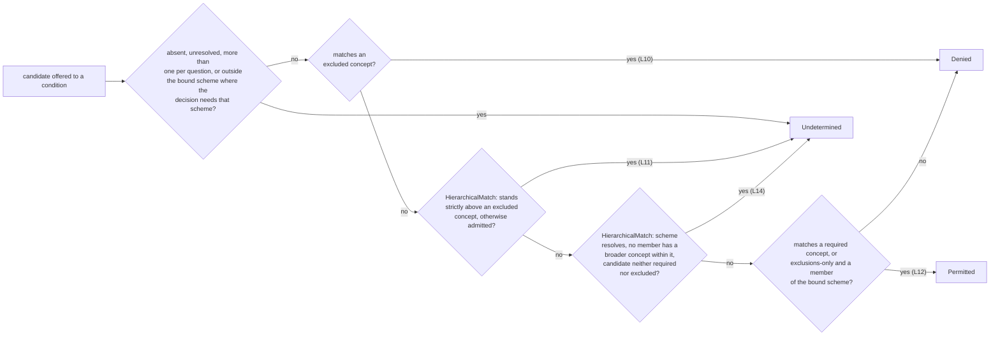

**Evidence bindings.** A condition reads its candidate from an `elg:Question` unless an `elg:EvidenceBinding` binds it. A binding names the class of subjects the condition evaluates (`elg:subjectClass`) and an ordered path of `elg:EvidenceStep`s from each subject to its candidate, over the applied ontology's own properties (ADR-A91). The path ends at a `skos:Concept` for a concept condition. For an interval condition it ends at a `qnt:Quantity` on the condition's value space, or at a literal where the binding reads on that space (`elg:readOnSpace`). A subject with no value at the end of the path, or several, is `Undetermined`, as is one whose value is on another space, unless the binding declares how several values are read (`elg:valueReading`, ADR-A103). Under `elg:SomeValue` or `elg:EveryValue` each value is decided as a single candidate would be, and the outcomes are combined by strong Kleene logic (L15). A subject with no value stays `Undetermined`. A condition may be negated (`elg:negated true`): it is evaluated as it stands, including its reading, and Permitted and Denied are then swapped, while `Undetermined` stays `Undetermined` (L16). A profile evaluates either questions or one class of bound subjects. A binding may claim that each step of its path yields at most one value (`elg:singleValued`). The design-time OWL backend compiles only claimed paths (ADR-A90).

## 5. Core Model

The model has two layers: conditions that state what to match, and the evaluation records that
pose and answer the question. A profile composes conditions, a question offers a candidate to one
condition, and a decision binds a profile and its questions to one `elg:Decision`. A condition
evaluated for a whole class of subjects an applied ontology already describes may use an
`elg:EvidenceBinding` instead of an authored question (§5.5).

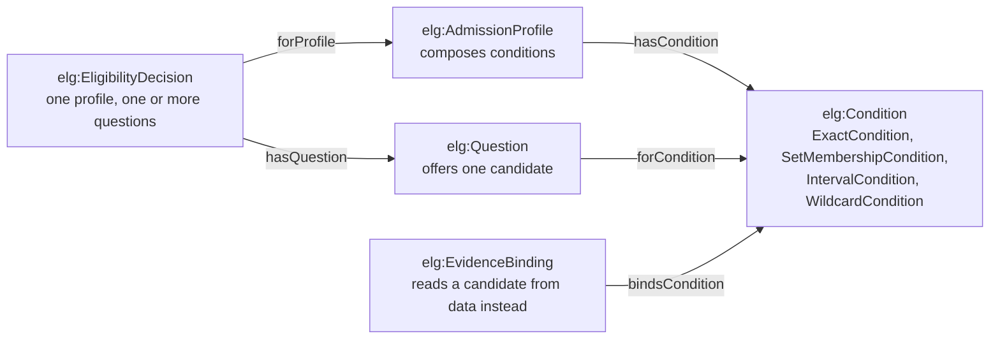

```turtle-spec
<https://www.nebularis.org/neuro-semantic/eligibility>
	rdf:type owl:Ontology ;
	owl:versionIRI <https://www.nebularis.org/neuro-semantic/lattice/eligibility/0.10.0> ;
	owl:imports <https://www.nebularis.org/neuro-semantic/lattice/foundation/0.4.0> ,
				<https://www.nebularis.org/neuro-semantic/lattice/vocabulary/0.4.0> ,
				<https://www.nebularis.org/neuro-semantic/lattice/quantification/0.7.0> ,
				<https://www.nebularis.org/neuro-semantic/lattice/party/0.8.0> .
```

### 5.1 Conditions and profiles

Four condition classes each commit to one match strategy no other can use correctly:
`ExactCondition` and `SetMembershipCondition` to `ExactMatch`/`SetMembership`, `IntervalCondition`
to `IntervalContainment`, `WildcardCondition` to `Wildcard`. `HierarchicalMatch` names no subclass
of its own: `elg:Condition` directly carries it, constrained by a scheme contract instead of its
own type (§4). An `elg:AdmissionProfile` is itself a condition, so profiles compose: a profile can
be one of another profile's conditions.

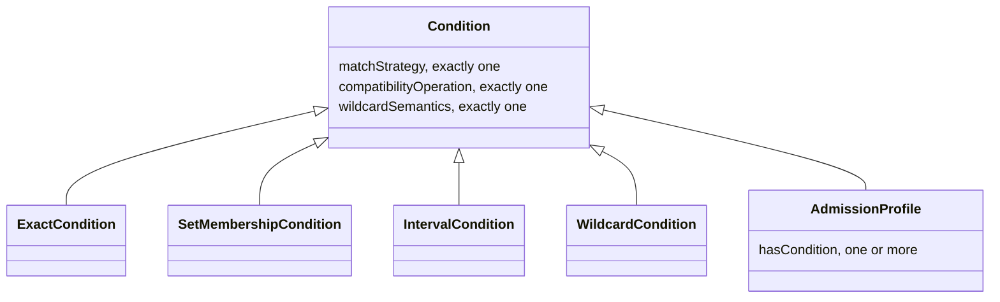

```turtle-spec
elg:Condition a owl:Class ;
	rdfs:comment "A declared admissibility condition." .

elg:ExactCondition a owl:Class ; rdfs:subClassOf elg:Condition .
elg:SetMembershipCondition a owl:Class ; rdfs:subClassOf elg:Condition .
elg:IntervalCondition a owl:Class ; rdfs:subClassOf elg:Condition .
elg:WildcardCondition a owl:Class ; rdfs:subClassOf elg:Condition .

elg:AdmissionProfile a owl:Class ;
	rdfs:subClassOf elg:Condition, fnd:Version,
		[ a owl:Restriction ; owl:onProperty elg:hasCondition ; owl:minCardinality "1"^^xsd:nonNegativeInteger ] ;
	rdfs:comment "A reusable admissibility profile that composes one or more conditions." .
```

### 5.2 Questions and decisions

A question is evidenced (`fnd:Evidenced`, Foundation) and names exactly one condition. A decision
is evidenced too, and names exactly one profile, at least one question, and exactly one decision
value, so a profile with several conditions can be answered by several questions under one
decision record.

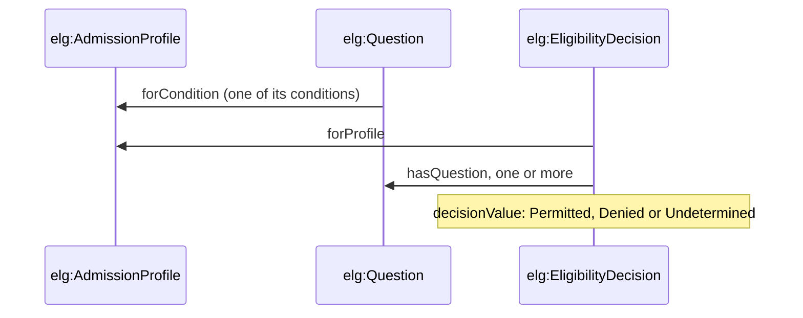

```turtle-spec
elg:Question a owl:Class ;
	rdfs:subClassOf fnd:Evidenced,
		[ a owl:Restriction ; owl:onProperty elg:forCondition ; owl:cardinality "1"^^xsd:nonNegativeInteger ] ;
	rdfs:comment "An evaluation question posed against one condition." .

elg:EligibilityDecision a owl:Class ;
	rdfs:subClassOf fnd:Evidenced,
		[ a owl:Restriction ; owl:onProperty elg:forProfile ; owl:cardinality "1"^^xsd:nonNegativeInteger ] ,
		[ a owl:Restriction ; owl:onProperty elg:hasQuestion ; owl:minCardinality "1"^^xsd:nonNegativeInteger ] ,
		[ a owl:Restriction ; owl:onProperty elg:decisionValue ; owl:cardinality "1"^^xsd:nonNegativeInteger ] ;
	rdfs:comment "A recorded admissibility decision for one profile and one or more questions." .
```

### 5.3 The mechanism types

The next seven classes carry no properties of their own: each is a closed set of named
individuals, declared in §6. `elg:MatchStrategy`, `elg:CompatibilityOperation` and
`elg:WildcardSemantics` are the three mechanisms §4 names. `elg:OperationalProfile` is versioned
(`fnd:Version`), since the six reference profiles E1-E6 (§6) are themselves subject to change
control. `elg:Law` and `elg:LawRegister` classify L1-L16 (§6) by how each is discharged, a semantic
law by argument, a static constraint by a shape.

```turtle-spec
elg:MatchStrategy a owl:Class .
elg:CompatibilityOperation a owl:Class .
elg:WildcardSemantics a owl:Class .
elg:Decision a owl:Class .
elg:OperationalProfile a owl:Class ; rdfs:subClassOf fnd:Version .
elg:Law a owl:Class .
elg:LawRegister a owl:Class .
```

### 5.4 Condition, question and decision properties

Most of the properties below appear, wired together, in the worked examples of §8. For instance,
`interval-containment.ttl` (§8.2) connects a condition's `requiredRangeSet` to a question's
`candidateRangeSet` of the same range set, and a decision's `hasQuestion` and `decisionValue`
record the outcome:

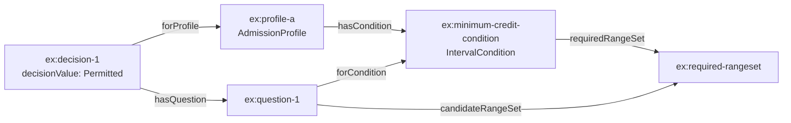

```turtle-spec
elg:hasCondition a owl:ObjectProperty ;
	rdfs:domain elg:AdmissionProfile ; rdfs:range elg:Condition .

elg:forCondition a owl:ObjectProperty, owl:FunctionalProperty ;
	rdfs:domain elg:Question ; rdfs:range elg:Condition .

elg:requiredRangeSet a owl:ObjectProperty ;
	rdfs:domain elg:Condition ; rdfs:range qnt:RangeSet .

elg:requiredConcept a owl:ObjectProperty ;
	rdfs:domain elg:Condition ; rdfs:range skos:Concept ;
	rdfs:comment "A concept a candidate must match, under the condition's match strategy. Several required concepts are alternatives to one another." .

elg:excludedConcept a owl:ObjectProperty ;
	rdfs:domain elg:Condition ; rdfs:range skos:Concept ;
	rdfs:comment "A concept a candidate must not match, under the condition's match strategy. Each excluded concept excludes independently of the others." .

elg:candidateRangeSet a owl:ObjectProperty ;
	rdfs:domain elg:Question ; rdfs:range qnt:RangeSet .

elg:candidateValue a owl:ObjectProperty ;
	rdfs:domain elg:Question ; rdfs:range qnt:Value .

elg:candidateConcept a owl:ObjectProperty ;
	rdfs:domain elg:Question ; rdfs:range skos:Concept ;
	rdfs:comment "The concept a question offers to a condition matching by ExactMatch, SetMembership or HierarchicalMatch." .

elg:matchStrategy a owl:ObjectProperty, owl:FunctionalProperty ;
	rdfs:domain elg:Condition ; rdfs:range elg:MatchStrategy .

elg:constrainedByContract a owl:ObjectProperty ;
	rdfs:domain elg:Condition ; rdfs:range voc:SchemeContract .

elg:compatibilityOperation a owl:ObjectProperty, owl:FunctionalProperty ;
	rdfs:domain elg:Condition ; rdfs:range elg:CompatibilityOperation .

elg:wildcardSemantics a owl:ObjectProperty, owl:FunctionalProperty ;
	rdfs:domain elg:Condition ; rdfs:range elg:WildcardSemantics .

elg:forProfile a owl:ObjectProperty, owl:FunctionalProperty ;
	rdfs:domain elg:EligibilityDecision ; rdfs:range elg:AdmissionProfile .

elg:hasQuestion a owl:ObjectProperty ;
	rdfs:domain elg:EligibilityDecision ; rdfs:range elg:Question .

elg:decisionValue a owl:ObjectProperty, owl:FunctionalProperty ;
	rdfs:domain elg:EligibilityDecision ; rdfs:range elg:Decision .

elg:lawRegister a owl:ObjectProperty, owl:FunctionalProperty ;
	rdfs:domain elg:Law ; rdfs:range elg:LawRegister .

elg:usesOperationalProfile a owl:ObjectProperty, owl:FunctionalProperty ;
	rdfs:domain elg:EligibilityDecision ; rdfs:range elg:OperationalProfile .

elg:subjectRoleOccupancy a owl:ObjectProperty ;
	rdfs:domain elg:Question ; rdfs:range pty:RoleOccupancy .

elg:conditionKey a owl:DatatypeProperty, owl:FunctionalProperty ;
	rdfs:domain elg:Condition ; rdfs:range xsd:string .
```

### 5.5 Evidence bindings

Where a profile evaluates a whole class of subjects an applied ontology already describes (such as
every `ex:Employee`), an `elg:EvidenceBinding` reaches each subject's candidate by a path of
`elg:EvidenceStep`s over the applied ontology's own properties, instead of an authored question
(§4, "Evidence bindings"; ADR-A91). `evidence-binding.ttl` (§8.4) binds a hierarchical condition to
`ex:Employee` by a two-step path, through a role to its job family:

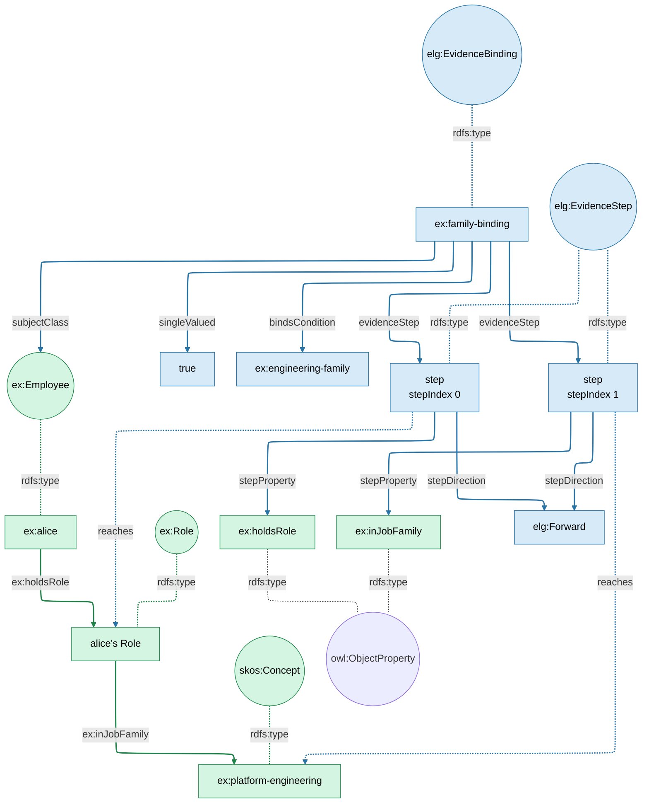

Green is the applied domain ontology (`ex:`) and the SKOS concept it uses. Blue is Eligibility
(`elg:`), including the binding and condition, which are Eligibility individuals named in the
example's namespace. Solid lines are asserted triples. Dotted lines are `rdfs:type`, or show what
each step reaches when a subject's path is followed. Each step is a node of its own, positioned by
`elg:stepIndex`, naming the property it traverses and its direction.

A path ending at a literal instead of a `skos:Concept` or `qnt:Quantity` names the value space it
reads on (`elg:readOnSpace`), as `ex:tenure-binding` does for `ex:tenureYears`. A binding that reads
more than one value states how they combine (`elg:valueReading`, §6): `elg:SomeValue` and
`elg:EveryValue` each decide every value as a single candidate would be decided, then combine the
outcomes by strong Kleene `or3`/`and3` (§10).

```turtle-spec
elg:EvidenceBinding a owl:Class ;
	rdfs:comment "Binds a condition to the class of subjects it evaluates and to the path that reaches each subject's candidate on the applied ontology's own properties (ADR-A91)." .

elg:EvidenceStep a owl:Class ;
	rdfs:comment "One positioned traversal within an evidence binding's path, in a stated direction. Shaped like srf:PathStep." .

elg:StepDirection a owl:Class .

rdf:Property a owl:Class .

elg:bindsCondition a owl:ObjectProperty, owl:FunctionalProperty ;
	rdfs:domain elg:EvidenceBinding ; rdfs:range elg:Condition .

elg:subjectClass a owl:ObjectProperty, owl:FunctionalProperty ;
	rdfs:domain elg:EvidenceBinding ;
	rdfs:comment "The class whose instances the bound condition evaluates." .

elg:evidenceStep a owl:ObjectProperty ;
	rdfs:domain elg:EvidenceBinding ; rdfs:range elg:EvidenceStep .

elg:stepIndex a owl:DatatypeProperty, owl:FunctionalProperty ;
	rdfs:domain elg:EvidenceStep ; rdfs:range xsd:nonNegativeInteger ;
	rdfs:comment "Zero-based position of the step in traversal order." .

elg:stepProperty a owl:ObjectProperty, owl:FunctionalProperty ;
	rdfs:domain elg:EvidenceStep ; rdfs:range rdf:Property .

elg:stepDirection a owl:ObjectProperty, owl:FunctionalProperty ;
	rdfs:domain elg:EvidenceStep ; rdfs:range elg:StepDirection .

elg:readOnSpace a owl:ObjectProperty, owl:FunctionalProperty ;
	rdfs:domain elg:EvidenceBinding ; rdfs:range qnt:ValueSpace ;
	rdfs:comment "The value space a literal at the end of an interval condition's path is read on. A qnt:Quantity at the end of the path states its own space." .

elg:singleValued a owl:DatatypeProperty, owl:FunctionalProperty ;
	rdfs:domain elg:EvidenceBinding ; rdfs:range xsd:boolean ;
	rdfs:comment "The author's claim that each step of the binding's path yields at most one value. The design-time OWL backend compiles only claimed paths, and checks the claim on data with a generated shape (ADR-A90 addendum, option B)." .

elg:ValueReading a owl:Class ;
	rdfs:comment "How a bound condition reads the values its binding's path reaches: one value, some value, or every value (ADR-A103, L15)." .

elg:valueReading a owl:ObjectProperty, owl:FunctionalProperty ;
	rdfs:domain elg:EvidenceBinding ; rdfs:range elg:ValueReading ;
	rdfs:comment "The binding's value reading. A binding without one reads a single value (elg:SingleValue)." .

elg:negated a owl:DatatypeProperty, owl:FunctionalProperty ;
	rdfs:domain elg:Condition ; rdfs:range xsd:boolean ;
	rdfs:comment "When true, the condition is evaluated as it stands, including its value reading, and then Permitted and Denied are swapped. Undetermined stays Undetermined (ADR-A103, L16)." .

[] a owl:AllDisjointClasses ;
	owl:members ( elg:Condition elg:Question elg:EligibilityDecision elg:MatchStrategy elg:CompatibilityOperation elg:WildcardSemantics elg:Decision elg:OperationalProfile elg:Law elg:EvidenceBinding elg:EvidenceStep elg:StepDirection elg:ValueReading ) .
```

## 6. Mechanism Vocabulary

The three mechanisms §4's diagram names are each a closed set of named individuals, not an open
`owl:Class` a reader could extend without a new decision:

```turtle-vocab
@prefix elg:  <https://www.nebularis.org/neuro-semantic/lattice/eligibility#> .
@prefix owl:  <http://www.w3.org/2002/07/owl#> .
@prefix rdfs: <http://www.w3.org/2000/01/rdf-schema#> .
@base <https://www.nebularis.org/neuro-semantic/eligibility-vocab> .

<https://www.nebularis.org/neuro-semantic/eligibility-vocab>
	a owl:Ontology ;
	owl:versionIRI <https://www.nebularis.org/neuro-semantic/lattice/eligibility-vocab/0.12.0> ;
	owl:imports <https://www.nebularis.org/neuro-semantic/lattice/eligibility/0.10.0> .

elg:ExactMatch a elg:MatchStrategy .
elg:SetMembership a elg:MatchStrategy .
elg:IntervalContainment a elg:MatchStrategy .
elg:HierarchicalMatch a elg:MatchStrategy .
elg:Wildcard a elg:MatchStrategy .

elg:AllRequired a elg:CompatibilityOperation .
elg:AnySufficient a elg:CompatibilityOperation .
elg:DimensionConsistent a elg:CompatibilityOperation .
```

### 6.1 Value readings

A binding that reaches more than one value (§5.5) decides each one as a single candidate would be,
then combines the outcomes by strong Kleene logic (L15, §10):

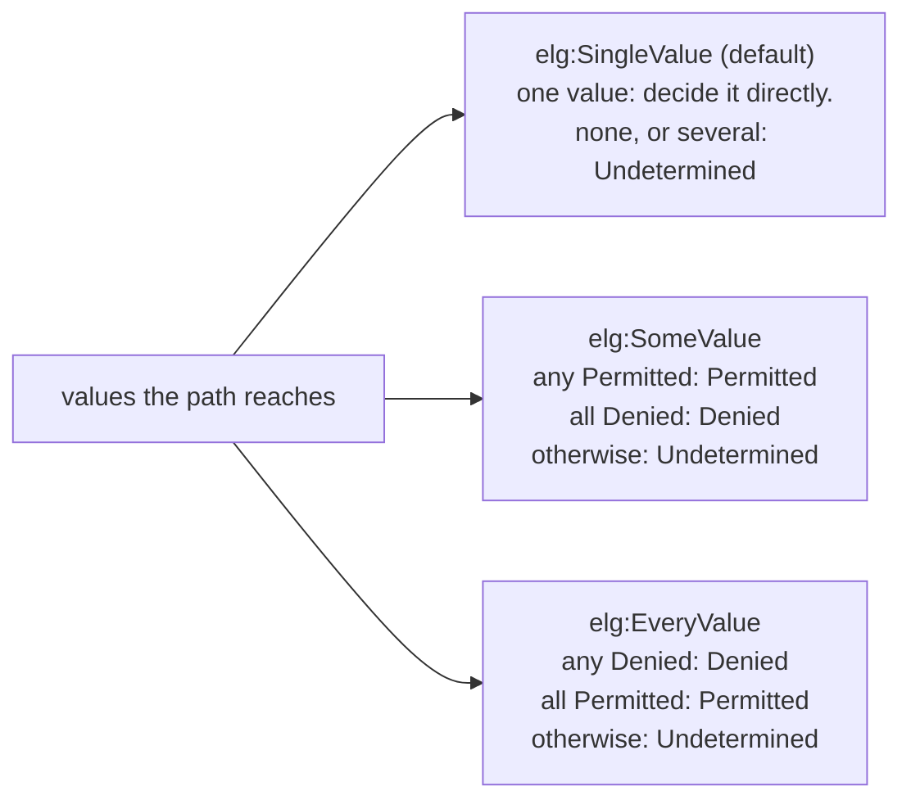

```turtle-vocab
elg:SingleValue a elg:ValueReading ;
	rdfs:comment "The path reaches one value. None, or several, leaves the condition undetermined. The default reading." .
elg:SomeValue a elg:ValueReading ;
	rdfs:comment "Permitted when any value is Permitted, Denied when every value is Denied, otherwise, or with no value, Undetermined (L15)." .
elg:EveryValue a elg:ValueReading ;
	rdfs:comment "Denied when any value is Denied, Permitted when every value is Permitted, otherwise, or with no value, Undetermined (L15)." .
```

### 6.2 Wildcard semantics, decision and direction

`elg:WildcardSemantics`'s three individuals govern a `WildcardCondition` (§4): `NoWildcard` rules
it out, `SingleDimensionWildcard` lets the condition stand in for one dimension of a multi-dimension
match, `MultiDimensionWildcard` lets it stand in for several at once. `elg:Decision`'s three
individuals carry the information order §10 formalises: `Undetermined` sits below both decided
values, which are each other's own fixed point only.

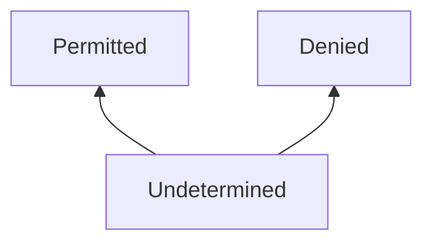

`elg:StepDirection`'s two individuals name which way an `elg:EvidenceStep` traverses its property
(§5.5): `Forward`, subject to object, as `ex:family-binding`'s steps do, or `Inverse`, object to
subject, for a path that reaches its candidate against the direction a property is normally read.

```turtle-vocab
elg:NoWildcard a elg:WildcardSemantics .
elg:SingleDimensionWildcard a elg:WildcardSemantics .
elg:MultiDimensionWildcard a elg:WildcardSemantics .

elg:Permitted a elg:Decision .
elg:Denied a elg:Decision .
elg:Undetermined a elg:Decision .

elg:Forward a elg:StepDirection ; rdfs:comment "Traversed from subject to object." .
elg:Inverse a elg:StepDirection ; rdfs:comment "Traversed from object to subject." .
```

### 6.3 Operational profiles

Each `elg:OperationalProfile` individual names one reference conformance profile the differential
test harness (`tools/reference/eligibility/`) checks a compiler backend against, one per mechanism
combination worth testing in isolation.

```turtle-vocab
elg:E1 a elg:OperationalProfile ; rdfs:comment "Exact-match profile" .
elg:E2 a elg:OperationalProfile ; rdfs:comment "Interval-containment profile" .
elg:E3 a elg:OperationalProfile ; rdfs:comment "Wildcard profile" .
elg:E4 a elg:OperationalProfile ; rdfs:comment "Compatibility-any profile" .
elg:E5 a elg:OperationalProfile ; rdfs:comment "Compatibility-all profile" .
elg:E6 a elg:OperationalProfile ; rdfs:comment "Dimension-consistency profile" .
```

### 6.4 Laws

Each law is registered as either a semantic law, discharged by the formal argument of §10, or a
static constraint, discharged by one of the shapes of §7:

```mermaid
flowchart TB
    subgraph Static["elg:StaticConstraint, a shape (§7)"]
        L1["L1 one match strategy"]
        L2["L2 one compatibility operation"]
        L3["L3 one wildcard policy"]
        L4["L4 IntervalContainment needs a range set"]
        L5["L5 IntervalOverlap excluded"]
        L6["L6 one decision value"]
        L7["L7 at least one question"]
        L8["L8 one operational profile"]
        L13["L13 reachable exclusions"]
    end
    subgraph Semantic["elg:SemanticLaw, an argument (§10)"]
        L9["L9 hierarchical closure"]
        L10["L10 exclusion precedence"]
        L11["L11 exclusion granularity"]
        L12["L12 default inclusion"]
        L14["L14 hierarchy precondition"]
        L15["L15 set readings"]
        L16["L16 negation"]
    end
```

```turtle-vocab
elg:SemanticLaw a elg:LawRegister ; rdfs:comment "Discharged by formal argument." .
elg:StaticConstraint a elg:LawRegister ; rdfs:comment "Discharged by SHACL, SPARQL, or other static analysis of declarations." .

elg:L1 a elg:Law ; rdfs:comment "Each condition declares exactly one match strategy." .
elg:L2 a elg:Law ; rdfs:comment "Each condition declares exactly one compatibility operation." .
elg:L3 a elg:Law ; rdfs:comment "Each condition declares exactly one wildcard policy." .
elg:L4 a elg:Law ; rdfs:comment "IntervalContainment requires declared requiredRangeSet." .
elg:L5 a elg:Law ; rdfs:comment "IntervalOverlap is excluded from admissibility decisions." .
elg:L6 a elg:Law ; rdfs:comment "EligibilityDecision has exactly one decision value." .
elg:L7 a elg:Law ; rdfs:comment "EligibilityDecision references at least one question." .
elg:L8 a elg:Law ; rdfs:comment "EligibilityDecision names one operational profile." .
elg:L9 a elg:Law ;
	elg:lawRegister elg:SemanticLaw ;
	rdfs:comment "Hierarchical match closure. A candidate value satisfies a condition under hierarchical match exactly when it stands in the reflexive-transitive closure of the bound scheme's ordering relation, restricted to that scheme's members, below the asserted value. The ordering relation is acyclic over the bound scheme; a scheme carrying a cycle is not evaluable under hierarchical match. A condition under hierarchical match with no resolved scheme at all has no closure to test a candidate against, and is undetermined for every candidate, the same reasoning L14 applies once a scheme resolves but states nothing about the candidate's position within it." .
elg:L10 a elg:Law ;
	elg:lawRegister elg:SemanticLaw ;
	rdfs:comment "Exclusion precedence. A candidate that matches an excluded concept of a condition, under the condition's match strategy, does not satisfy the condition, whether or not it also matches a required concept." .
elg:L11 a elg:Law ;
	elg:lawRegister elg:SemanticLaw ;
	rdfs:comment "Exclusion granularity. Under hierarchical match, a candidate that stands strictly above an excluded concept in the bound scheme's ordering, and is otherwise admitted, leaves the condition undetermined for that candidate. Its true value may or may not fall under the exclusion." .
elg:L12 a elg:Law ;
	elg:lawRegister elg:SemanticLaw ;
	rdfs:comment "Default inclusion. A condition that declares excluded concepts and no required concept requires every member of its bound scheme, so it admits any member not excluded." .
elg:L13 a elg:Law ;
	elg:lawRegister elg:StaticConstraint ;
	rdfs:comment "Reachable exclusions. Where a condition declares required concepts, each of its excluded concepts matches at least one of them under the condition's match strategy. An exclusion outside every inclusion excludes nothing." .
elg:L14 a elg:Law ;
	elg:lawRegister elg:SemanticLaw ;
	rdfs:comment "Hierarchy precondition. Under hierarchical match, when no member of the resolved scheme has a broader concept within that scheme, a candidate that is a member and is neither a required nor an excluded concept leaves the condition undetermined. The scheme cannot say whether the candidate falls under a required or an excluded concept. This takes precedence over default inclusion (L12)." .
elg:L15 a elg:Law ;
	elg:lawRegister elg:SemanticLaw ;
	rdfs:comment "Set readings. A bound condition whose binding reads some or every value decides each value it reaches as a single candidate would be decided, then combines the outcomes by strong Kleene logic: under some value, Permitted if any is Permitted and Denied if all are Denied, under every value, Denied if any is Denied and Permitted if all are Permitted, and Undetermined otherwise or when there is no value." .
elg:L16 a elg:Law ;
	elg:lawRegister elg:SemanticLaw ;
	rdfs:comment "Negation. A negated condition is evaluated as it stands, including its value reading, and its outcome is then swapped: Permitted becomes Denied and Denied becomes Permitted. Undetermined stays Undetermined, with its reason." .
```

## 7. Shapes

Three `turtle-shapes` blocks generate the three shape files, in order (§3). A shape lives in one
block only, so no violation is reported twice.

### 7.1 Structural shapes

`shapes/structural.ttl` holds the cardinalities of conditions, profiles, decisions and evidence
bindings. `elg:ConditionShape` discharges L1 to L3, and `elg:EligibilityDecisionShape` L6 to L8.

```turtle-shapes
@prefix sh:   <http://www.w3.org/ns/shacl#> .
@prefix elg:  <https://www.nebularis.org/neuro-semantic/lattice/eligibility#> .
@prefix xsd:  <http://www.w3.org/2001/XMLSchema#> .

elg:ConditionShape a sh:NodeShape ;
	sh:targetClass elg:Condition ;
	sh:property [ sh:path elg:matchStrategy ; sh:minCount 1 ; sh:maxCount 1 ] ;
	sh:property [ sh:path elg:compatibilityOperation ; sh:minCount 1 ; sh:maxCount 1 ] ;
	sh:property [ sh:path elg:wildcardSemantics ; sh:minCount 1 ; sh:maxCount 1 ] ;
	sh:property [ sh:path elg:negated ; sh:maxCount 1 ; sh:datatype xsd:boolean ] .

elg:AdmissionProfileShape a sh:NodeShape ;
	sh:targetClass elg:AdmissionProfile ;
	sh:property [ sh:path elg:hasCondition ; sh:minCount 1 ] .

elg:EligibilityDecisionShape a sh:NodeShape ;
	sh:targetClass elg:EligibilityDecision ;
	sh:property [ sh:path elg:forProfile ; sh:minCount 1 ; sh:maxCount 1 ] ;
	sh:property [ sh:path elg:hasQuestion ; sh:minCount 1 ] ;
	sh:property [ sh:path elg:decisionValue ; sh:minCount 1 ; sh:maxCount 1 ] ;
	sh:property [ sh:path elg:usesOperationalProfile ; sh:minCount 1 ; sh:maxCount 1 ] .

elg:EvidenceBindingShape a sh:NodeShape ;
	sh:targetClass elg:EvidenceBinding ;
	sh:property [ sh:path elg:bindsCondition ; sh:minCount 1 ; sh:maxCount 1 ] ;
	sh:property [ sh:path elg:subjectClass ; sh:minCount 1 ; sh:maxCount 1 ] ;
	sh:property [ sh:path elg:evidenceStep ; sh:minCount 1 ] ;
	sh:property [ sh:path elg:singleValued ; sh:maxCount 1 ; sh:datatype xsd:boolean ] ;
	sh:property [ sh:path elg:valueReading ; sh:maxCount 1 ; sh:in ( elg:SingleValue elg:SomeValue elg:EveryValue ) ] .

elg:EvidenceStepShape a sh:NodeShape ;
	sh:targetClass elg:EvidenceStep ;
	sh:property [ sh:path elg:stepIndex ; sh:minCount 1 ; sh:maxCount 1 ] ;
	sh:property [ sh:path elg:stepProperty ; sh:minCount 1 ; sh:maxCount 1 ] ;
	sh:property [ sh:path elg:stepDirection ; sh:minCount 1 ; sh:maxCount 1 ; sh:in ( elg:Forward elg:Inverse ) ] .
```

### 7.2 Constraints

`shapes/constraints.ttl` holds the other constraints.
`elg:IntervalContainmentRequiresRangeSet` discharges L4 for an `elg:IntervalCondition`.
`elg:WildcardPolicyConsistency` reports a `Wildcard` match strategy under `NoWildcard` (ADR-A06).
`elg:ConceptConditionDeclarationShape` warns of a concept condition that states nothing to match
(ADR-A87), and `elg:ReachableExclusionShape` discharges L13.

```turtle-shapes
@prefix sh:   <http://www.w3.org/ns/shacl#> .
@prefix elg:  <https://www.nebularis.org/neuro-semantic/lattice/eligibility#> .

elg:IntervalContainmentRequiresRangeSet a sh:NodeShape ;
	sh:targetClass elg:IntervalCondition ;
	sh:property [ sh:path elg:requiredRangeSet ; sh:minCount 1 ] .

elg:WildcardPolicyConsistency a sh:NodeShape ;
	sh:targetClass elg:Condition ;
	sh:sparql [
		sh:message "NoWildcard requires a non-Wildcard match strategy." ;
		sh:select """
			PREFIX elg: <https://www.nebularis.org/neuro-semantic/lattice/eligibility#>
			SELECT $this WHERE {
				$this elg:wildcardSemantics elg:NoWildcard ;
					  elg:matchStrategy elg:Wildcard .
			}
		"""
	] .

elg:ConceptConditionDeclarationShape a sh:NodeShape ;
	sh:targetClass elg:Condition ;
	sh:severity sh:Warning ;
	sh:sparql [
		sh:message "A condition matching by ExactMatch, SetMembership or HierarchicalMatch declares neither a required nor an excluded concept, so it states nothing to match against." ;
		sh:select """
			PREFIX elg: <https://www.nebularis.org/neuro-semantic/lattice/eligibility#>
			SELECT $this WHERE {
				$this elg:matchStrategy ?strategy .
				FILTER (?strategy IN (elg:ExactMatch, elg:SetMembership, elg:HierarchicalMatch))
				FILTER NOT EXISTS { $this elg:requiredConcept ?required }
				FILTER NOT EXISTS { $this elg:excludedConcept ?excluded }
				FILTER NOT EXISTS { $this elg:hasCondition ?member }
			}
		"""
	] ;
	sh:sparql [
		sh:message "A required or excluded concept is declared on a condition whose match strategy does not match concepts. IntervalContainment expresses gaps through its range set instead." ;
		sh:select """
			PREFIX elg: <https://www.nebularis.org/neuro-semantic/lattice/eligibility#>
			SELECT $this WHERE {
				$this elg:matchStrategy ?strategy .
				FILTER (?strategy IN (elg:IntervalContainment, elg:Wildcard))
				{ $this elg:requiredConcept ?concept } UNION { $this elg:excludedConcept ?concept }
			}
		"""
	] .

elg:ReachableExclusionShape a sh:NodeShape ;
	sh:targetClass elg:Condition ;
	sh:severity sh:Warning ;
	sh:sparql [
		sh:message "An excluded concept matches none of the condition's required concepts, so it excludes nothing. Discharges elg:L13." ;
		sh:select """
			PREFIX elg: <https://www.nebularis.org/neuro-semantic/lattice/eligibility#>
			PREFIX skos: <http://www.w3.org/2004/02/skos/core#>
			SELECT $this ?value WHERE {
				$this elg:excludedConcept ?value ;
					  elg:requiredConcept ?anyRequired .
				FILTER NOT EXISTS {
					$this elg:requiredConcept ?required .
					FILTER (?value = ?required || EXISTS {
						$this elg:matchStrategy elg:HierarchicalMatch .
						?value skos:broader+ ?required .
					})
				}
			}
		"""
	] .
```

### 7.3 Rules

`shapes/rules.ttl` holds `elg:HierarchyWellFoundednessShape`, which discharges L9 clause (a) by
reporting a cycle in any scheme a hierarchically matched condition's contract could resolve to, and
`elg:UndeterminedWhenNoCandidateInput`, a SHACL rule that infers `Undetermined` for a decision
whose questions offer no candidate.

```turtle-shapes
@prefix sh:   <http://www.w3.org/ns/shacl#> .
@prefix rdf:  <http://www.w3.org/1999/02/22-rdf-syntax-ns#> .
@prefix skos: <http://www.w3.org/2004/02/skos/core#> .
@prefix voc:  <https://www.nebularis.org/neuro-semantic/lattice/vocabulary#> .
@prefix elg:  <https://www.nebularis.org/neuro-semantic/lattice/eligibility#> .

elg:HierarchyWellFoundednessShape a sh:NodeShape ;
	sh:targetClass elg:Condition ;
	sh:sparql [
		sh:message "A scheme this hierarchically-matched condition's contract could resolve to, via boundScheme or a voc:SchemeBinding, contains a cycle in its ordering relation, so hierarchical match has no truth condition under that scheme. Discharges elg:L9 clause (a)." ;
		sh:select """
			PREFIX elg: <https://www.nebularis.org/neuro-semantic/lattice/eligibility#>
			PREFIX voc: <https://www.nebularis.org/neuro-semantic/lattice/vocabulary#>
			PREFIX skos: <http://www.w3.org/2004/02/skos/core#>
			SELECT $this WHERE {
				$this elg:matchStrategy elg:HierarchicalMatch ;
					  elg:constrainedByContract ?schemeContract .
				{
					?schemeContract voc:boundScheme ?scheme .
				} UNION {
					?binding voc:forContract ?schemeContract ;
							 voc:bindsScheme ?scheme .
				}
				?concept skos:inScheme ?scheme ;
						 skos:broader+ ?concept .
			}
		"""
	] .

elg:UndeterminedWhenNoCandidateInput a sh:NodeShape ;
	sh:targetClass elg:EligibilityDecision ;
	sh:rule [
		a sh:SPARQLRule ;
		sh:construct """
			PREFIX elg: <https://www.nebularis.org/neuro-semantic/lattice/eligibility#>
			CONSTRUCT {
				$this elg:decisionValue elg:Undetermined .
			}
			WHERE {
				$this elg:hasQuestion ?q .
				FILTER NOT EXISTS { ?q elg:candidateValue ?v }
				FILTER NOT EXISTS { ?q elg:candidateRangeSet ?r }
				FILTER NOT EXISTS { ?q elg:candidateConcept ?c }
			}
		"""
	] .
```

## 8. Worked Examples

Illustrative non-domain examples are authored in `ontology/eligibility/examples/`, each validated
against the shapes of §7, without a reasoner.

### 8.1 Condition taxonomy

[`condition-taxonomy.ttl`](examples/condition-taxonomy.ttl). One of each condition class, so every
match strategy appears with its own declared requirement.

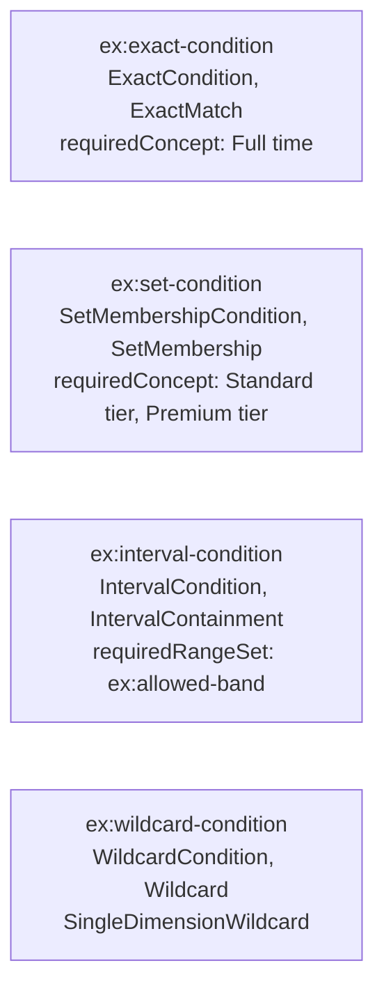

What it shows: a condition's class and its `matchStrategy` always agree (`ExactCondition` with
`ExactMatch`, and so on), and `elg:ConceptConditionDeclarationShape` (§7) would warn if
`ex:exact-condition` or `ex:set-condition` declared no `requiredConcept` at all, since a concept
condition with nothing to match against states nothing.

### 8.2 Interval containment

[`interval-containment.ttl`](examples/interval-containment.ttl). A minimum credit score band, 700
to 850 inclusive, checked by a question offering the same range set back.

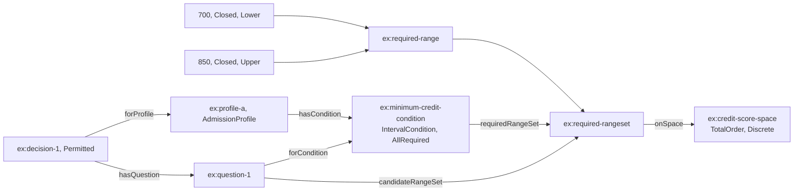

The question's candidate range set is the required range set itself, so the condition's
`AllRequired` compatibility operation is satisfied trivially:

```turtle-example
@prefix elg: <https://www.nebularis.org/neuro-semantic/lattice/eligibility#> .
@prefix ex:  <https://example.org/lattice/eligibility/> .

ex:decision-1 a elg:EligibilityDecision ;
	elg:decisionValue elg:Permitted .
```

What it shows: an interval condition needs no `requiredConcept`, and reads its candidate through
Quantification's own `qnt:Range`/`qnt:RangeSet`, never a bespoke numeric type.

### 8.3 Hierarchical match

[`hierarchical-match.ttl`](examples/hierarchical-match.ttl). A three-level hazard scheme (Peril,
broader than Fire, broader than Industrial Fire), constrained by a scheme contract, with a
condition requiring `Fire`.

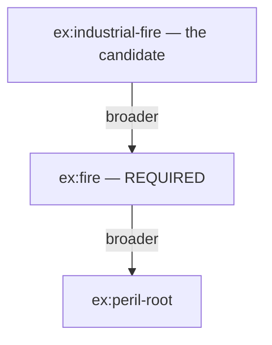

The candidate stands below the required concept in the scheme's closure (L9), so the condition is
satisfied although the question names `ex:industrial-fire`, never `ex:fire` itself:

| Candidate | Stands in closure of `ex:fire`? | Decision |
|---|---|---|
| `ex:industrial-fire` (this example) | yes, one `skos:broader` step | Permitted |
| `ex:fire` itself | yes, reflexively | Permitted |
| `ex:peril-root` | no, it is broader than `ex:fire`, not narrower (L11) | Undetermined |
| a concept outside `ex:hazard-scheme` | the scheme cannot place it | Undetermined |

What it shows: `elg:constrainedByContract` binds the condition to the scheme, not the concept
directly, so the same condition re-evaluates correctly if the contract is re-pinned to a revised
edition of the scheme (ADR-A85).

### 8.4 Evidence binding

[`evidence-binding.ttl`](examples/evidence-binding.ttl). A relocation benefit for engineering job
families, excluding contractor grades, with at least two years' tenure, evaluated directly over an
employment ontology's own data, with no `elg:Question` authored at all.

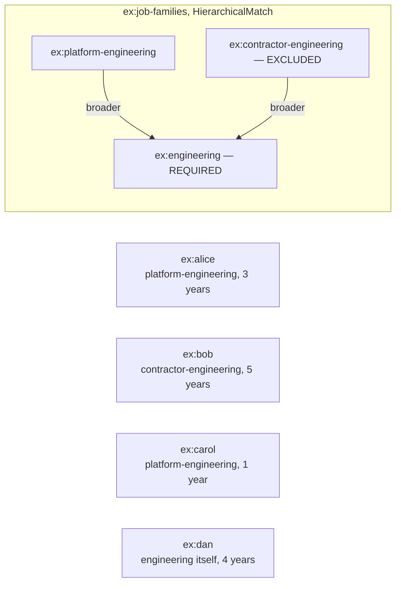

Two bindings reach each employee's candidates: `ex:family-binding` (through `holdsRole` then
`inJobFamily`, §5.5) and `ex:tenure-binding` (through `tenureYears`, read on `ex:tenure-space`).
Both conditions compose under the profile's `AllRequired`, so either one deciding `Denied` decides
the whole profile `Denied`, and either one `Undetermined` with the other `Permitted` leaves it
`Undetermined`:

| Employee | Family condition | Tenure condition | Decision |
|---|---|---|---|
| `ex:alice` | Permitted (platform-engineering, below engineering) | Permitted (3 ≥ 2) | **Permitted** |
| `ex:bob` | Denied (matches the exclusion) | Permitted (5 ≥ 2) | **Denied** |
| `ex:carol` | Permitted | Denied (1 < 2) | **Denied** |
| `ex:dan` | Undetermined (stands at `engineering` itself, above the exclusion, L11) | Permitted (4 ≥ 2) | **Undetermined** |

What it shows: an evidence binding lets a profile evaluate a whole class of subjects without
authoring one question per subject, and `ex:dan`'s row is L11 in practice, not merely a stated
rule: the scheme cannot yet say whether he is a platform engineer or a contractor, so the exclusion
is only possible, not certain.

## 9. Canonicalisation

Eligibility canonicalisation is declaration-first and profile-stable:

- `elg:conditionKey` is the canonical identifier of a condition declaration for comparison, caching, and replay.
- Canonicalisation never changes the declared strategy (`elg:matchStrategy`), compatibility operation (`elg:compatibilityOperation`), or wildcard semantics (`elg:wildcardSemantics`).
- Interval admissibility canonicalises through Quantification ranges and range sets only, using `elg:requiredRangeSet` and `elg:candidateRangeSet` with `qnt:Range`/`qnt:RangeSet`.

## 10. Formalisation

`elg:Decision`'s three named individuals (§6) are a closed, three-valued type under Belnap and
Fitting's strong Kleene reading (L15, L16): `Undetermined` is below `Permitted` and `Denied` in
the information order, which are each other's own fixed point only.

The three connectives' truth tables, for a reader's reference (FM-D17):

**`or3`, strong Kleene disjunction (L15's `SomeValue` combinator)**

| or3 | Permitted | Denied | Undetermined |
|---|---|---|---|
| **Permitted** | Permitted | Permitted | Permitted |
| **Denied** | Permitted | Denied | Undetermined |
| **Undetermined** | Permitted | Undetermined | Undetermined |

**`and3`, strong Kleene conjunction (L15's `EveryValue` combinator)**

| and3 | Permitted | Denied | Undetermined |
|---|---|---|---|
| **Permitted** | Permitted | Denied | Undetermined |
| **Denied** | Denied | Denied | Denied |
| **Undetermined** | Undetermined | Denied | Undetermined |

**`neg3`, negation (L16)**

| neg3 | result |
|---|---|
| **Permitted** | Denied |
| **Denied** | Permitted |
| **Undetermined** | Undetermined |

The tables above are for a reader, never extracted or checked mechanically. The Isabelle clauses
below are the one hand-written, normative statement of the same three connectives (FM-D17: this
`isabelle-spec` block now carries the kernel's defining equations, not only its closed datatype),
type-checked by Isabelle directly and proved against in `KernelLaws.thy`.
`tools/literate_extract.py` also renders this same block into
`tools/reference/eligibility/src/reference_eligibility/_kernel_defs.py` (generated, never
hand-edited), so the table above, the Isabelle clauses and the Python reference agree by
construction, not by two independent authors' care. `decision_leq` is deliberately not generated:
it is a predicate over equality, not a finite case table, and stays hand-written once in each of
`KernelLaws.thy` and `kernel.py`.

```isabelle-spec
theory Kernel
imports Main
begin

datatype decision = Permitted | Denied | Undetermined

fun or3 :: "decision \<Rightarrow> decision \<Rightarrow> decision" where
  "or3 Permitted _ = Permitted"
| "or3 Denied b = b"
| "or3 Undetermined Permitted = Permitted"
| "or3 Undetermined Denied = Undetermined"
| "or3 Undetermined Undetermined = Undetermined"

fun and3 :: "decision \<Rightarrow> decision \<Rightarrow> decision" where
  "and3 Permitted b = b"
| "and3 Denied _ = Denied"
| "and3 Undetermined Permitted = Undetermined"
| "and3 Undetermined Denied = Denied"
| "and3 Undetermined Undetermined = Undetermined"

fun neg3 :: "decision \<Rightarrow> decision" where
  "neg3 Permitted = Denied"
| "neg3 Denied = Permitted"
| "neg3 Undetermined = Undetermined"

end
```

## 11. Release notes

Earlier versions are listed in the [ontology release register](../../docs/architecture/ontology-releases.md).

- `eligibility-vocab` 0.12.0 (additive, CCS C9b0): L9's comment adds that a hierarchical condition
  with no resolved scheme is undetermined for every candidate (FM-EP, B2.2). The vocabulary's
  ontology header joins the README, which is again the source of every Eligibility spec, vocab and
  shapes file. `eligibility` 0.10.0 and the shapes, 0.2.0, are unchanged.
