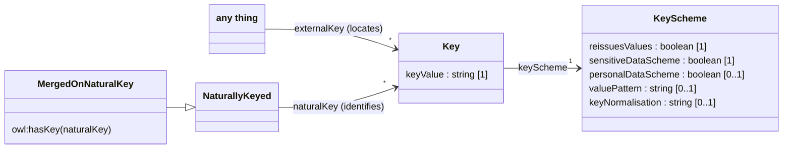
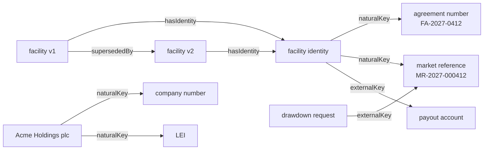
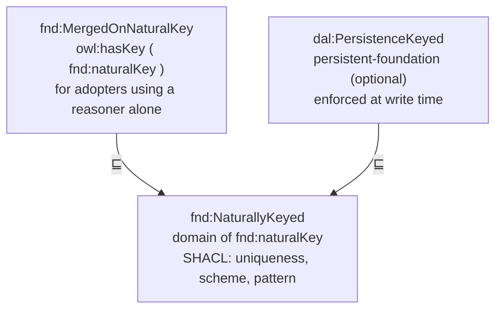

<!-- SPDX-License-Identifier: CC-BY-SA-4.0 -->

# Foundation Ontology — Description Logic Elements

*Literate specification. This document and `spec/foundation.ttl` are meant to be regenerated from one another — see [§3, How to Read This Document](#3-how-to-read-this-document) for the exact mechanics.*

---

## 1. Purpose and Scope

Foundation provides four independent, composable capabilities: persistent identity and versioning, evidential support, temporal scoping, and governance status.

Foundation's own governance-status concept is therefore a bare value, not a lifecycle — a downstream layer wanting transitions, triggers, and guards around that value composes Behaviour on top of it. This constraint shapes several of the decisions below and is worth keeping in mind.

## 2. Namespace and Prefixes

Base namespace for all LATTICE ontologies:

```
https://www.nebularis.org/neuro-semantic/lattice/
```

Each layer gets its own hash namespace under that base, following the convention:

| Layer | Namespace | Prefix |
|---|---|---|
| Foundation | `.../lattice/foundation#` | `fnd:` |
| Vocabulary | `.../lattice/vocabulary#` | `voc:` |
| Party | `.../lattice/party#` | `pty:` |
| Instrument | `.../lattice/instrument#` | `ins:` |
| Eligibility | `.../lattice/eligibility#` | `elg:` |
| Behaviour | `.../lattice/behaviour#` | `bhv:` |
| Mapping (MORK) | `.../lattice/mork#` | `mrk:` |

Hash namespaces are preferred to slash namespaces so that every term in a layer resolves with a single retrieval of that layer's ontology document, rather than requiring per-term de-referencing.

This document uses only the prefixes Foundation's own axioms actually need:

```turtle-spec
@prefix fnd:  <https://www.nebularis.org/neuro-semantic/lattice/foundation#> .
@prefix owl:  <http://www.w3.org/2002/07/owl#> .
@prefix rdf:  <http://www.w3.org/1999/02/22-rdf-syntax-ns#> .
@prefix rdfs: <http://www.w3.org/2000/01/rdf-schema#> .
@prefix xsd:  <http://www.w3.org/2001/XMLSchema#> .
@prefix prov: <http://www.w3.org/ns/prov#> .
```

The ontology header, with the version every importer pins (ADR-A86):

```turtle-spec
<https://www.nebularis.org/neuro-semantic/foundation>
    a owl:Ontology ;
    owl:versionIRI <https://www.nebularis.org/neuro-semantic/lattice/foundation/0.4.0> ;
    owl:imports <http://www.w3.org/ns/prov-o-20130430> .
```

## 3. How to Read This Document

Every class, property, and axiom group below follows the same fixed template:

> #### `fnd:TermName`
>
> **Definition.** One line — becomes the term's `rdfs:comment`.
>
> **Utility.** A paragraph explaining why the term exists and what it's for — becomes the term's `fnd:utility` value (defined in §5 below).
>
> ```turtle-example
> fnd:TermName a owl:Class ;
>     rdfs:comment "..." ;
>     fnd:utility "..." .
> ```

**NOTE FOR LLMs Regenerating `spec/foundation.ttl` from this document:** `tools/literate_extract.py` concatenates every ` ```turtle-spec ` block in document order: the prefix and header blocks in §2, then **§5, §6 (including its Disjointness subsection), §7, §8 and §9**. Every ` ```turtle-shapes ` block (§8) becomes `shapes/constraints.ttl`. The template illustration in this section (§3) and the worked example in §10 also use ` ```turtle ` fences but are not specification content — the template shows the pattern with a placeholder name rather than a real term, and the worked example deliberately uses `ins:` and `ex:` prefixes that aren't part of Foundation's own namespace and aren't declared in §2. A naive "every turtle block in the document" extraction will pull both in by mistake; an extraction tool should filter by section number, not merely by fence language. (This rule was tightened after testing the extraction against this exact document turned up precisely that mistake — worth keeping the explicit section list here rather than reverting to the vaguer phrasing.)

The blocks are fragments, not independently complete files — prefixes are declared once, not repeated per block, both to keep this document readable and to keep its own token footprint down if it's ever fed back to a model for extension. Nothing else in the document (the Definition/Utility prose, the tables) is authoritative; it's a rendering of what the Turtle blocks already say via `rdfs:comment` and `fnd:utility`.

**Regenerating this document from `spec/foundation.ttl`:** walk the ontology's classes and properties, and for each, render its `rdfs:comment` as Definition, its `fnd:utility` as Utility, and its full axiom set as the Turtle block, in the section order given by §5–9 below (Annotation Properties, Classes, Object and Data Properties, Keys, Alignments). Because the prose is sourced from annotation values rather than written independently, the two artefacts can't drift apart from ordinary editing of either one — drift can only happen if someone edits the rendered Markdown prose directly instead of the annotation value it came from, which the convention above is designed to make unnecessary.

## 4. Design Decisions

**Alignment with PROV-O.** Evidence is modelled as a subclass of `prov:Entity`, and `fnd:assertedBy` as a sub-property of `prov:wasAttributedTo`. Temporal scoping is *not* aligned with OWL-Time's `time:Instant`/`time:Interval` apparatus, since that would require modelling `validFrom`/`validTo` as individuals rather than plain `xsd:dateTime` literals. This is a considered asymmetry, not an oversight, and it's reversible later if temporal reasoning requirements grow.

**Four focused mixins.** An earlier pass considered a single `fnd:Governed` class carrying all four capabilities at once. This was rejected as it would force every class adopting any one capability to adopt all four, which overclaims, whereas independent, non-disjoint mixins let a downstream class pick exactly what it needs.

**`GovernanceState` is open at the OWL level, closed in SHACL.** OWL's open-world assumption sees us push closed-world constraints into `shapes/constraints.ttl` via `sh:in` restrictions over named individuals. The class exists here so the property `fnd:hasGovernanceState` has somewhere to range over; the enumeration itself is a different layer's concern, per the established `spec/` vs `vocab/` vs `shapes/` architectural boundary.

## 5. Annotation Properties

#### `fnd:utility`

**Definition.** A concise explanation of what a term is for and how to use it.

**Utility.** `rdfs:comment` gives a formal one-line definition. `fnd:utility` gives the fuller explanation someone applying the term needs — what it's for, how it composes with related terms, and what to populate and when. It is not a record of why the ontology's authors shaped a term this way rather than some other way.

```turtle-spec
fnd:utility a owl:AnnotationProperty ;
    rdfs:comment "A concise explanation of what a term is for and how to use it." .
```

## 6. Classes

#### `fnd:Version`

**Definition.** An individual representing a specific, identified state of some persistent thing.

**Utility.** A mixin for identity that survives change. The domain individual itself plays the role of being a version, rather than pointing out to a separate version object. Subclass this when a domain concept needs identity that survives being edited or restated. Instances of a Version-bearing class are the versions themselves, each carrying identity via `hasIdentity`, and successive versions linking through `supersededBy`.

```turtle-spec
fnd:Version a owl:Class ;
    rdfs:comment "An individual representing a specific, identified state of some persistent thing." ;
    fnd:utility "A mixin for identity that survives change. The domain individual itself plays the role of being a version, rather than pointing out to a separate version object. Subclass this when a domain concept needs identity that survives being edited or restated. Instances of a Version-bearing class are the versions themselves; each carries identity via hasIdentity, and successive versions link through supersededBy." ;
    rdfs:subClassOf [
        a owl:Restriction ;
        owl:onProperty fnd:hasIdentity ;
        owl:cardinality "1"^^xsd:nonNegativeInteger
    ] .
```

#### `fnd:PersistentIdentity`

**Definition.** The stable identifier for a thing across all of its versions.

**Utility.** Separating identity from version is what makes "this is the same Obligation, edited" distinguishable from "this is a different Obligation that happens to look similar." Without this split, versioning collapses into a flat sequence of unrelated snapshots with no way to assert they're states of one continuant.

```turtle-spec
fnd:PersistentIdentity a owl:Class ;
    rdfs:comment "The stable identifier for a thing across all of its versions." ;
    fnd:utility "Separates 'the same thing, edited' from 'a different thing that looks similar' — without this, a version history is just a set of unrelated snapshots with no continuant they're all states of." ;
    rdfs:subClassOf [
        a owl:Restriction ;
        owl:onProperty fnd:hasVersion ;
        owl:minCardinality "1"^^xsd:nonNegativeInteger
    ] .
```

#### `fnd:Evidenced`

**Definition.** A mixin for anything that can carry supporting evidence.

**Utility.** Subclass this when something needs to carry supporting evidence for why it holds — an assertion, a binding, or a decision. Attach evidence via `hasEvidence`, and leave it empty initially when something is true but support has not yet been recorded.

```turtle-spec
fnd:Evidenced a owl:Class ;
    rdfs:comment "A mixin for anything that can carry supporting evidence." ;
    fnd:utility "Subclass this when something needs to carry supporting evidence for why it holds. Attach evidence via hasEvidence; a fresh instance doesn't need any evidence yet, since something can be true before anyone has recorded why." .
```

#### `fnd:Evidence`

**Definition.** An item of evidence supporting some assertion or entity.

**Utility.** An item of evidence — a document reference, system log entry, or recorded assertion — supporting some other fact in the graph. Populate `supports` to say what it supports, `assertedBy` for who or what provided it, and `recordedAt` for when. Every piece of evidence must support at least one thing.

```turtle-spec
fnd:Evidence a owl:Class ;
    rdfs:subClassOf prov:Entity ;
    rdfs:comment "An item of evidence supporting some assertion or entity." ;
    fnd:utility "An item of evidence supporting some other fact in the graph. Populate supports to say what it's evidence for, assertedBy for who or what provided it, and recordedAt for when. Every piece of evidence must support at least one thing." ;
    rdfs:subClassOf [
        a owl:Restriction ;
        owl:onProperty fnd:supports ;
        owl:minCardinality "1"^^xsd:nonNegativeInteger
    ] , [
        a owl:Restriction ;
        owl:onProperty fnd:recordedAt ;
        owl:cardinality "1"^^xsd:nonNegativeInteger
    ] .
```

#### `fnd:TemporallyScoped`

**Definition.** A mixin for anything with a validity period distinct from when it was recorded.

**Utility.** Subclass this when something has a period during which it holds true, distinct from when someone recorded that fact. Use `hasTemporalScope` for validity, and keep that separate from recording timestamps.

```turtle-spec
fnd:TemporallyScoped a owl:Class ;
    rdfs:comment "A mixin for anything with a validity period distinct from when it was recorded." ;
    fnd:utility "Subclass this when something has a period during which it holds true, distinct from when someone recorded that fact. Use hasTemporalScope to state the validity period." ;
    rdfs:subClassOf [
        a owl:Restriction ;
        owl:onProperty fnd:hasTemporalScope ;
        owl:cardinality "1"^^xsd:nonNegativeInteger
    ] .
```

#### `fnd:TemporalScope`

**Definition.** A validity period: a start, and an optional end.

**Utility.** A validity period with a start (`validFrom`) and an optional end (`validTo`). If something becomes valid, lapses, and later becomes valid again, model that as a new `Version` with its own new `TemporalScope`.

```turtle-spec
fnd:TemporalScope a owl:Class ;
    rdfs:comment "A validity period: a start, and an optional end." ;
    fnd:utility "A validity period with a start and an optional end. If something becomes valid, lapses, and later becomes valid again, model that as a new Version with its own new TemporalScope rather than adding a second window here." ;
    rdfs:subClassOf [
        a owl:Restriction ;
        owl:onProperty fnd:validFrom ;
        owl:cardinality "1"^^xsd:nonNegativeInteger
    ] .
```

#### `fnd:Governable`

**Definition.** A mixin for anything that carries a governance-lifecycle status.

**Utility.** Subclass this when something moves through a review lifecycle before being trusted — a Wording Template, a SHACL shape, or an ontology term. Use `hasGovernanceState` to record its current status.

```turtle-spec
fnd:Governable a owl:Class ;
    rdfs:comment "A mixin for anything that carries a governance-lifecycle status." ;
    fnd:utility "Subclass this when something moves through a review lifecycle before being trusted — a Wording Template, a SHACL shape, an ontology term itself. Use hasGovernanceState to record its current status. Most ordinary facts in a populated graph won't need this mixin at all." ;
    rdfs:subClassOf [
        a owl:Restriction ;
        owl:onProperty fnd:hasGovernanceState ;
        owl:cardinality "1"^^xsd:nonNegativeInteger
    ] .
```

#### `fnd:GovernanceState`

**Definition.** The status of a governed artefact within its review lifecycle.

**Utility.** The current status of a Governable thing within its review lifecycle — draft, reviewed, active, or superseded, with named values declared in `vocab/foundation-vocab.ttl`. Point `hasGovernanceState` at whichever value currently applies.

```turtle-spec
fnd:GovernanceState a owl:Class ;
    rdfs:comment "The status of a governed artefact within its review lifecycle." ;
    fnd:utility "The current status of a Governable thing within its review lifecycle — draft, reviewed, active, or superseded. Point hasGovernanceState at whichever value currently applies. Tracking the transition itself is a separate concern from recording the current value; pair with a state-machine mechanism elsewhere if you need it." .
```

#### `fnd:DerivedArtefact`

**Definition.** Something produced from declared sources by a derivation, not authored directly.

**Utility.** A compiled, generated, validated or materialised product (ADR-A12, ADR-A92). Subclass it for a layer's own derived records. Name the kind with `derivationKind`, the run that produced it with `prov:wasGeneratedBy`, and its sources with `prov:wasDerivedFrom`.

```turtle-spec
fnd:DerivedArtefact a owl:Class ;
    rdfs:subClassOf prov:Entity ;
    rdfs:comment "Something produced from declared sources by a derivation, not authored directly." ;
    fnd:utility "A compiled, generated, validated or materialised product. Subclass it for a layer's own derived records. Name the kind with derivationKind, the run that produced it with prov:wasGeneratedBy, and its sources with prov:wasDerivedFrom." .
```

#### `fnd:DerivationRun`

**Definition.** One execution of a derivation.

**Utility.** The activity that produced one or more derived artefacts. Link the sources it read with `prov:used`.

```turtle-spec
fnd:DerivationRun a owl:Class ;
    rdfs:subClassOf prov:Activity ;
    rdfs:comment "One execution of a derivation." ;
    fnd:utility "The activity that produced one or more derived artefacts. Link the sources it read with prov:used." .
```

#### `fnd:DerivationKind`

**Definition.** The kind of derivation that produced an artefact.

**Utility.** One of the derivation kinds ADR-A12 names, declared in `vocab/foundation-vocab.ttl`: inferred, validated, materialised, projected, indexed, generated, compiled, or a decision or execution record.

```turtle-spec
fnd:DerivationKind a owl:Class ;
    rdfs:comment "The kind of derivation that produced an artefact." ;
    fnd:utility "One of the derivation kinds ADR-A12 names: inferred, validated, materialised, projected, indexed, generated, compiled, or a decision or execution record." .
```

### Disjointness

```turtle-spec
[] a owl:AllDisjointClasses ;
    owl:members ( fnd:Version fnd:PersistentIdentity fnd:Evidence fnd:TemporalScope fnd:GovernanceState fnd:DerivationKind fnd:Key fnd:KeyScheme ) .

fnd:Evidenced owl:disjointWith fnd:Evidence .
fnd:TemporallyScoped owl:disjointWith fnd:TemporalScope .
fnd:Governable owl:disjointWith fnd:GovernanceState .
```

**Utility.** `Version`, `PersistentIdentity`, `Evidence`, `TemporalScope`, `GovernanceState`, `DerivationKind`, `Key` and `KeyScheme` should never be classified as one another. Separately, `Evidenced`, `TemporallyScoped`, and `Governable` should each not be classified as the value object they point at, while still being combinable with one another and with `Version`.

## 7. Object and Data Properties

#### `fnd:hasIdentity` / `fnd:hasVersion`

**Definition.** `hasIdentity`: a Version's persistent identity. `hasVersion`: a PersistentIdentity's versions (inverse).

**Utility.** `hasIdentity` points a `Version` at its `PersistentIdentity`. Set this once when creating the version. `hasVersion` points a `PersistentIdentity` at all its versions and is often populated by query as the inverse of `hasIdentity`.

```turtle-spec
fnd:hasIdentity a owl:ObjectProperty, owl:FunctionalProperty ;
    rdfs:domain fnd:Version ;
    rdfs:range fnd:PersistentIdentity ;
    owl:inverseOf fnd:hasVersion ;
    rdfs:comment "A Version's persistent identity." ;
    fnd:utility "Points a Version at its PersistentIdentity. Set this once, when the version is created — it won't need to change even as the thing itself is edited into later versions." .

fnd:hasVersion a owl:ObjectProperty ;
    rdfs:domain fnd:PersistentIdentity ;
    rdfs:range fnd:Version ;
    rdfs:comment "A PersistentIdentity's versions." ;
    fnd:utility "Points a PersistentIdentity at all of its versions. Typically populated by querying rather than asserted directly, since it's the inverse of hasIdentity." .
```

#### `fnd:supersededBy`

**Definition.** Direct succession between two versions of the same identity.

**Utility.** Points one version at the version that directly replaced it. Set this when you create a new version to supersede an old one. To find the latest version, follow this property repeatedly until none points onward.

```turtle-spec
fnd:supersededBy a owl:ObjectProperty, owl:AsymmetricProperty, owl:IrreflexiveProperty ;
    rdfs:domain fnd:Version ;
    rdfs:range fnd:Version ;
    rdfs:comment "Direct succession between two versions of the same identity." ;
    fnd:utility "Points one version at the version that directly replaced it. Set this when creating a new version to supersede an old one. Records immediate succession only — to find the latest in a chain, follow this property repeatedly rather than expecting a single hop." .
```

#### `fnd:hasEvidence` / `fnd:supports`

**Definition.** `hasEvidence`: the evidence supporting an Evidenced thing. `supports`: the inverse.

**Utility.** Not `Functional` in either direction — an individual can accumulate multiple pieces of evidence over time, and one piece of evidence could in principle support more than one thing. No minimum cardinality on `hasEvidence`: an Evidenced thing may have no evidence yet, which is the normal starting state, not an error.

```turtle-spec
fnd:hasEvidence a owl:ObjectProperty ;
    rdfs:domain fnd:Evidenced ;
    rdfs:range fnd:Evidence ;
    owl:inverseOf fnd:supports ;
    rdfs:comment "The evidence supporting an Evidenced thing." ;
    fnd:utility "Not Functional — an individual can accumulate multiple pieces of evidence over time. No minimum: having no evidence yet is a normal starting state, not an error." .

fnd:supports a owl:ObjectProperty ;
    rdfs:domain fnd:Evidence ;
    rdfs:range fnd:Evidenced ;
    rdfs:comment "The inverse of hasEvidence." ;
    fnd:utility "The inverse direction of hasEvidence; Evidence's own minimum-one restriction (§6) is what actually requires every piece of evidence to support something." .
```

#### `fnd:assertedBy`

**Definition.** The agent that asserted a piece of evidence.

**Utility.** Points a piece of evidence at whoever or whatever asserted it — a person, an organisation, or an automated system. Any `prov:Agent` is valid.

```turtle-spec
fnd:assertedBy a owl:ObjectProperty ;
    rdfs:domain fnd:Evidence ;
    rdfs:range prov:Agent ;
    rdfs:subPropertyOf prov:wasAttributedTo ;
    rdfs:comment "The agent that asserted a piece of evidence." ;
    fnd:utility "Points a piece of evidence at whoever or whatever asserted it — a person, an organisation, or an automated system. Any prov:Agent individual is a valid value." .
```

#### `fnd:recordedAt`

**Definition.** When a piece of evidence was recorded.

**Utility.** The point when a piece of evidence was recorded, not when the supported fact became true.

```turtle-spec
fnd:recordedAt a owl:DatatypeProperty, owl:FunctionalProperty ;
    rdfs:domain fnd:Evidence ;
    rdfs:range xsd:dateTime ;
    rdfs:comment "When a piece of evidence was recorded." ;
    fnd:utility "The point at which a piece of evidence was recorded — not when the fact it supports became true, which is answered separately by whatever TemporalScope applies to the thing being supported." .
```

#### `fnd:hasTemporalScope`

**Definition.** The validity period of a TemporallyScoped thing.

```turtle-spec
fnd:hasTemporalScope a owl:ObjectProperty, owl:FunctionalProperty ;
    rdfs:domain fnd:TemporallyScoped ;
    rdfs:range fnd:TemporalScope ;
    rdfs:comment "The validity period of a TemporallyScoped thing." ;
    fnd:utility "Points a TemporallyScoped thing at its validity period. If the thing later lapses and becomes valid again, that's a new version with its own new TemporalScope, not a second value here." .
```

#### `fnd:validFrom` / `fnd:validTo`

**Definition.** The start (required) and end (optional) of a validity period.

**Utility.** `validFrom` is the required start point for a validity period. If the exact start is unknown, use the best available estimate. `validTo` remains optional for open-ended validity.

```turtle-spec
fnd:validFrom a owl:DatatypeProperty, owl:FunctionalProperty ;
    rdfs:domain fnd:TemporalScope ;
    rdfs:range xsd:dateTime ;
    rdfs:comment "The start of a validity period." ;
    fnd:utility "The point at which a validity period begins. Always required — use the best available estimate if you don't know a precise start." .

fnd:validTo a owl:DatatypeProperty, owl:FunctionalProperty ;
    rdfs:domain fnd:TemporalScope ;
    rdfs:range xsd:dateTime ;
    rdfs:comment "The end of a validity period, if it has one." ;
    fnd:utility "Optional and capped at one — an open-ended scope simply omits this rather than needing a sentinel value." .
```

#### `fnd:hasGovernanceState`

**Definition.** The current governance status of a Governable thing.

```turtle-spec
fnd:hasGovernanceState a owl:ObjectProperty, owl:FunctionalProperty ;
    rdfs:domain fnd:Governable ;
    rdfs:range fnd:GovernanceState ;
    rdfs:comment "The current governance status of a Governable thing." ;
    fnd:utility "Points a Governable thing at its current governance status. Keep one current value at a time and update it as review status changes." .
```

#### `fnd:derivationKind`

**Definition.** The kind of derivation that produced a derived artefact.

```turtle-spec
fnd:derivationKind a owl:ObjectProperty ;
    rdfs:domain fnd:DerivedArtefact ;
    rdfs:range fnd:DerivationKind ;
    rdfs:comment "The kind of derivation that produced a derived artefact." ;
    fnd:utility "Points a derived artefact at the kind of derivation that produced it." .
```

## 8. Keys

Decided by [ADR-A114](../../docs/architecture/decisions/ADR-A114-external-and-natural-keys.md),
added in Foundation 0.4.0.

The things a contract is about already have names the world gives them: a company has a
registration number and a legal entity identifier, an agreement has its number and a market
reference, a person has a national identity number. Other records cite and match things by these
names. Some pick out exactly one thing. Others are carried by many things that relate to one: every
drawdown request under a facility carries the facility's market reference.

**A key is not an identity.** Every versioned thing already has a persistent identity, an IRI
LATTICE mints and never reuses (ADR-A51). A key is a name some authority outside LATTICE gives it:

| | Identity | Key |
|---|---|---|
| issued by | LATTICE, when the thing is first recorded | a registry, a market, a party |
| how many | exactly one per thing | any number, from different schemes |
| changes | never | a thing may gain keys, and a key may be withdrawn |
| readable | opaque by design | the value people quote |
| may be sensitive | never, by construction | sometimes (a national ID, an account number) |

The word "identifier" is avoided for keys, to keep the two apart.

### 8.1 The model



- **A key is a node** with exactly one value, held as issued, and exactly one scheme. Its IRI is
  minted from its scheme and value, so one value of one scheme is one node wherever it is recorded.
- **A scheme is declared once**, by whoever uses it. Foundation declares none. A scheme states
  whether it reissues values (whether a value it withdrew may later name something else) and whether
  its values are sensitive, and may state whether they are also personal data, a regular expression
  they match, and the normalisation used to compare them (one of the minting specification's three
  pipelines: `NfkcTrimCasefold`, `NfkcTrimUppercase`, `NfkcTrimLowercase`).
- **`fnd:externalKey` locates.** It links anything to a key it carries, and is many-to-many: a
  facility, its drawdown requests and a transfer certificate all carry its market reference.
- **`fnd:naturalKey` identifies**, and is a sub-property of `fnd:externalKey`. The facility, and
  only the facility, has the market reference as its natural key. It is not functional: a company
  has a company number and an LEI, each identifying it. Only a scheme that never reissues values
  supplies natural keys.

### 8.2 Keys belong to what persists

On a versioned thing, keys attach to its persistent identity, since an agreement number names the
agreement across all its versions. On an unversioned thing they attach to the thing itself.



The path `fnd:hasIdentity?/fnd:naturalKey` reaches a natural key from a version or from an
unversioned thing. A version also locates by every key of its identity through a property chain,
`fnd:externalKey ⊒ fnd:hasIdentity ∘ fnd:externalKey`, so to a reasoner each version carries its
identity's keys, natural ones included through the sub-property. The chain infers only
`fnd:externalKey`, so a version never becomes `fnd:NaturallyKeyed` and never trips the uniqueness
check below. Without a reasoner, a Surface promotion contract materialises the same triples
(`ontology/surface/examples/keys.ttl`).

### 8.3 A scheme's key class

A scheme may be given the class of its keys, defined from the scheme by an OWL restriction, so a
reasoner classifies every key of the scheme and a tool without one can target the class:

```turtle-example
ex:market-reference a fnd:KeyScheme ;
    fnd:reissuesValues false ;
    fnd:sensitiveDataScheme false ;
    fnd:valuePattern "^MR-[0-9]{4}-[0-9]{6}$" ;
    fnd:keyNormalisation "NfkcTrimUppercase" .

ex:MarketReferenceKey a owl:Class ;
    rdfs:subClassOf fnd:Key ;
    owl:equivalentClass [ a owl:Restriction ;
        owl:onProperty fnd:keyScheme ; owl:hasValue ex:market-reference ] .
```

The scheme and its class are two IRIs joined by an axiom, never one punned IRI: OWL 2 DL treats a
punned class and individual as unrelated. Foundation does not require a key class. Persistence
does, because its profiles target classes (below). Declaring an adopter's schemes
`owl:AllDifferent` is good practice: OWL makes no unique-name assumption, and a key typed with one
scheme's class while carrying another would otherwise lead a reasoner to infer the two schemes are
the same.

### 8.4 Sensitive keys

A sensitive scheme's values never appear in an IRI, hashed or not (ADR-A51): its keys are minted as
a random surrogate, found by a keyed claim. `fnd:sensitiveDataScheme` covers any value a
deployment must not expose. `fnd:personalDataScheme` marks the sensitive schemes whose values are
also personal data, so that erasure rules apply. The flags state the facts. What a deployment does
with them is Persistence's privacy profile.

### 8.5 Natural keys mean one thing, in three ways



- **`fnd:NaturallyKeyed`** is the common mixin. Foundation's shapes check its natural keys everywhere.
- **`fnd:MergedOnNaturalKey`** adds `owl:hasKey ( fnd:naturalKey )`. To an OWL reasoner, two named
  members sharing a natural key are the same individual: `owl:hasKey` infers `owl:sameAs`, it never
  rejects.
- **`dal:PersistenceKeyed`**, in Persistence's optional `persistent-foundation` document, adds no
  key axiom. Persistence enforces uniqueness when the data is written, and a violation is rejected,
  quarantined or recorded as a reviewable merge relation, never `owl:sameAs`.

**LATTICE recommends Persistence** for any deployment that writes keyed data: `owl:hasKey` merges
on any collision, including a mistaken one, and nothing in OWL can undo a merge or say why it
happened. A class takes one of the two sub-mixins, never both.

### 8.6 Terms

```turtle-spec
fnd:Key a owl:Class ;
    rdfs:comment "A name an authority outside LATTICE gives a thing: one value, issued under one scheme." ;
    fnd:utility "Subject: a key node. Holds exactly one keyValue, as issued, and exactly one keyScheme. Mint its IRI from its scheme and value, so one value of one scheme is one node wherever it is recorded. Link things to it with externalKey or naturalKey." ;
    rdfs:subClassOf [
        a owl:Restriction ;
        owl:onProperty fnd:keyValue ;
        owl:cardinality "1"^^xsd:nonNegativeInteger
    ] , [
        a owl:Restriction ;
        owl:onProperty fnd:keyScheme ;
        owl:cardinality "1"^^xsd:nonNegativeInteger
    ] .

fnd:KeyScheme a owl:Class ;
    rdfs:comment "An authority's scheme of keys: a register, a market's references, a party's own numbers." ;
    fnd:utility "Subject: a scheme. Declared once, by whoever uses it, never by Foundation. States reissuesValues and sensitiveDataScheme, and may state personalDataScheme, valuePattern and keyNormalisation. A scheme may be given a key class, defined by an owl:hasValue restriction on keyScheme." .

fnd:NaturallyKeyed a owl:Class ;
    rdfs:comment "A mixin for anything that can be identified by a key the world gives it." ;
    fnd:utility "The domain of naturalKey. Foundation's shapes report two different members sharing a natural key. Take MergedOnNaturalKey for OWL's merging, or Persistence's PersistenceKeyed for write-time enforcement, not both." .

fnd:MergedOnNaturalKey a owl:Class ;
    rdfs:subClassOf fnd:NaturallyKeyed ;
    owl:hasKey ( fnd:naturalKey ) ;
    rdfs:comment "A naturally keyed thing that an OWL reasoner merges with any named thing sharing one of its natural keys." ;
    fnd:utility "For adopters who use LATTICE's ontologies with a reasoner and without Persistence. Two named members sharing a natural key are inferred owl:sameAs, never rejected, and Foundation's shapes report the pair as a warning so the merge can be reviewed." .

fnd:NaturallyKeyed owl:disjointWith fnd:Key .

fnd:keyValue a owl:DatatypeProperty, owl:FunctionalProperty ;
    rdfs:domain fnd:Key ;
    rdfs:range xsd:string ;
    rdfs:comment "A key's value, as issued." ;
    fnd:utility "Subject: a key. Value: the string the authority issued, unnormalised. Matching compares the scheme's normalised form, never this string directly." .

fnd:keyScheme a owl:ObjectProperty, owl:FunctionalProperty ;
    rdfs:domain fnd:Key ;
    rdfs:range fnd:KeyScheme ;
    rdfs:comment "The scheme a key was issued under." ;
    fnd:utility "Subject: a key. Value: its scheme. Exactly one." .

fnd:externalKey a owl:ObjectProperty ;
    rdfs:range fnd:Key ;
    owl:propertyChainAxiom ( fnd:hasIdentity fnd:externalKey ) ;
    rdfs:comment "A key a thing carries, which locates it without identifying it." ;
    fnd:utility "Subject: anything. Value: a key it carries. Many things may share one key, and one thing may carry many. A version carries every key of its persistent identity, by the property chain." .

fnd:naturalKey a owl:ObjectProperty ;
    rdfs:subPropertyOf fnd:externalKey ;
    rdfs:domain fnd:NaturallyKeyed ;
    rdfs:range fnd:Key ;
    rdfs:comment "A key that identifies a thing: the thing it names, and nothing else." ;
    fnd:utility "Subject: a naturally keyed thing, the persistent identity of a versioned thing or an unversioned thing itself. Value: a key from a scheme that never reissues values. Not functional: a thing may have one natural key per scheme." .

fnd:reissuesValues a owl:DatatypeProperty, owl:FunctionalProperty ;
    rdfs:domain fnd:KeyScheme ;
    rdfs:range xsd:boolean ;
    rdfs:comment "Whether a scheme may issue a withdrawn value again, naming something else." ;
    fnd:utility "Subject: a scheme. Value: true if a withdrawn value may later name another thing. A scheme that reissues values never supplies natural keys." .

fnd:sensitiveDataScheme a owl:DatatypeProperty, owl:FunctionalProperty ;
    rdfs:domain fnd:KeyScheme ;
    rdfs:range xsd:boolean ;
    rdfs:comment "Whether a scheme's values must be kept hidden." ;
    fnd:utility "Subject: a scheme. Value: true for personal data, or any other value a deployment must not expose. A sensitive value never appears in an IRI, hashed or not (ADR-A51)." .

fnd:personalDataScheme a owl:DatatypeProperty, owl:FunctionalProperty ;
    rdfs:domain fnd:KeyScheme ;
    rdfs:range xsd:boolean ;
    rdfs:comment "Whether a sensitive scheme's values are also personal data." ;
    fnd:utility "Subject: a scheme. Value: true if its values are personal data, so that erasure rules apply. Optional, and allowed only on a sensitive scheme." .

fnd:valuePattern a owl:DatatypeProperty, owl:FunctionalProperty ;
    rdfs:domain fnd:KeyScheme ;
    rdfs:range xsd:string ;
    rdfs:comment "A regular expression every value of a scheme matches." ;
    fnd:utility "Subject: a scheme. Value: an XPath regular expression, checked against each key's value as issued by a shape." .

fnd:keyNormalisation a owl:DatatypeProperty, owl:FunctionalProperty ;
    rdfs:domain fnd:KeyScheme ;
    rdfs:range xsd:string ;
    rdfs:comment "The normalisation a scheme's values are compared under." ;
    fnd:utility "Subject: a scheme. Value: one of the minting specification's pipelines, NfkcTrimCasefold, NfkcTrimUppercase or NfkcTrimLowercase. Minting and uniqueness for the scheme's keys both use it." .
```

### 8.7 Shapes

Foundation's shapes check keys for every adopter, with or without a reasoner or Persistence. The
uniqueness check has two severities:

| Two different things share a natural key, and | Severity | Read it as |
|---|---|---|
| at least one is not `fnd:MergedOnNaturalKey` | violation | an error: one thing recorded twice under two IRIs, or a key that only locates recorded as identifying |
| both are `fnd:MergedOnNaturalKey` | warning | the merge announced: a reasoner will infer the two are `owl:sameAs`. Review it. If they really are different things, the data is wrong and the warning is the only report you get |

```turtle-shapes
@prefix sh:   <http://www.w3.org/ns/shacl#> .
@prefix fnd:  <https://www.nebularis.org/neuro-semantic/lattice/foundation#> .
@prefix xsd:  <http://www.w3.org/2001/XMLSchema#> .

fnd:KeyShape a sh:NodeShape ;
    sh:targetClass fnd:Key ;
    sh:targetSubjectsOf fnd:keyValue , fnd:keyScheme ;
    sh:property [
        sh:path fnd:keyValue ; sh:minCount 1 ; sh:maxCount 1 ; sh:datatype xsd:string ;
        sh:message "A key has exactly one fnd:keyValue, a string as issued."
    ] ;
    sh:property [
        sh:path fnd:keyScheme ; sh:minCount 1 ; sh:maxCount 1 ; sh:class fnd:KeyScheme ;
        sh:message "A key has exactly one fnd:keyScheme, a declared fnd:KeyScheme."
    ] .

fnd:KeySchemeShape a sh:NodeShape ;
    sh:targetClass fnd:KeyScheme ;
    sh:property [
        sh:path fnd:reissuesValues ; sh:minCount 1 ; sh:maxCount 1 ; sh:datatype xsd:boolean ;
        sh:message "A key scheme states fnd:reissuesValues exactly once."
    ] ;
    sh:property [
        sh:path fnd:sensitiveDataScheme ; sh:minCount 1 ; sh:maxCount 1 ; sh:datatype xsd:boolean ;
        sh:message "A key scheme states fnd:sensitiveDataScheme exactly once."
    ] ;
    sh:property [
        sh:path fnd:personalDataScheme ; sh:maxCount 1 ; sh:datatype xsd:boolean ;
        sh:message "A key scheme states fnd:personalDataScheme at most once."
    ] ;
    sh:property [
        sh:path fnd:valuePattern ; sh:maxCount 1 ; sh:datatype xsd:string ;
        sh:message "A key scheme states at most one fnd:valuePattern."
    ] ;
    sh:property [
        sh:path fnd:keyNormalisation ; sh:maxCount 1 ;
        sh:in ( "NfkcTrimCasefold" "NfkcTrimUppercase" "NfkcTrimLowercase" ) ;
        sh:message "fnd:keyNormalisation names one of the minting specification's pipelines: NfkcTrimCasefold, NfkcTrimUppercase or NfkcTrimLowercase."
    ] ;
    sh:sparql [
        sh:message "{$this} states fnd:personalDataScheme true but not fnd:sensitiveDataScheme true. Personal data is sensitive: mark the scheme sensitive as well." ;
        sh:select """
            PREFIX fnd: <https://www.nebularis.org/neuro-semantic/lattice/foundation#>
            SELECT $this WHERE {
                $this fnd:personalDataScheme true .
                FILTER NOT EXISTS { $this fnd:sensitiveDataScheme true }
            }
        """
    ] .

fnd:KeyValuePatternShape a sh:NodeShape ;
    sh:targetSubjectsOf fnd:keyValue ;
    sh:sparql [
        sh:message "The key value {?value} does not match its scheme {?scheme}'s fnd:valuePattern {?pattern}." ;
        sh:select """
            PREFIX fnd: <https://www.nebularis.org/neuro-semantic/lattice/foundation#>
            SELECT $this ?value ?scheme ?pattern WHERE {
                $this fnd:keyValue ?value ;
                      fnd:keyScheme ?scheme .
                ?scheme fnd:valuePattern ?pattern .
                FILTER (!REGEX(STR(?value), ?pattern))
            }
        """
    ] .

fnd:NaturalKeySchemeShape a sh:NodeShape ;
    sh:targetSubjectsOf fnd:naturalKey ;
    sh:sparql [
        sh:message "{$this} has {?key} as a natural key, but its scheme {?scheme} reissues values, so the key may later name something else. Record it with fnd:externalKey, which locates without identifying." ;
        sh:select """
            PREFIX fnd: <https://www.nebularis.org/neuro-semantic/lattice/foundation#>
            SELECT $this ?key ?scheme WHERE {
                $this fnd:naturalKey ?key .
                ?key fnd:keyScheme ?scheme .
                ?scheme fnd:reissuesValues true .
            }
        """
    ] .

fnd:NaturalKeyUniquenessShape a sh:NodeShape ;
    sh:targetSubjectsOf fnd:naturalKey ;
    sh:sparql [
        sh:message "{$this} and {?other} both have {?key} as a natural key. A natural key identifies one thing: either they are one thing recorded under two IRIs, or one of them only carries the key and should record it with fnd:externalKey." ;
        sh:select """
            PREFIX fnd:  <https://www.nebularis.org/neuro-semantic/lattice/foundation#>
            PREFIX rdf:  <http://www.w3.org/1999/02/22-rdf-syntax-ns#>
            PREFIX rdfs: <http://www.w3.org/2000/01/rdf-schema#>
            SELECT $this ?other ?key WHERE {
                $this fnd:naturalKey ?key .
                ?other fnd:naturalKey ?key .
                FILTER (?other != $this)
                FILTER NOT EXISTS {
                    $this rdf:type/rdfs:subClassOf* fnd:MergedOnNaturalKey .
                    ?other rdf:type/rdfs:subClassOf* fnd:MergedOnNaturalKey .
                }
            }
        """
    ] .

fnd:MergedNaturalKeyShape a sh:NodeShape ;
    sh:targetSubjectsOf fnd:naturalKey ;
    sh:severity sh:Warning ;
    sh:sparql [
        sh:message "{$this} and {?other} both have {?key} as a natural key, and both are fnd:MergedOnNaturalKey, so an OWL reasoner will infer they are the same individual (owl:sameAs). Not an error: review the merge. If they are different things, the data is wrong, and this warning is the only report of it." ;
        sh:select """
            PREFIX fnd:  <https://www.nebularis.org/neuro-semantic/lattice/foundation#>
            PREFIX rdf:  <http://www.w3.org/1999/02/22-rdf-syntax-ns#>
            PREFIX rdfs: <http://www.w3.org/2000/01/rdf-schema#>
            SELECT $this ?other ?key WHERE {
                $this fnd:naturalKey ?key ;
                      rdf:type/rdfs:subClassOf* fnd:MergedOnNaturalKey .
                ?other fnd:naturalKey ?key ;
                       rdf:type/rdfs:subClassOf* fnd:MergedOnNaturalKey .
                FILTER (?other != $this)
            }
        """
    ] .
```

The shapes match subclasses through `rdfs:subClassOf*` in the data graph, so validate data
together with the adopter's ontology. A pair is reported from both sides, once per member.

### 8.8 Worked example and related documents

[`examples/keys.ttl`](examples/keys.ttl) walks a facility agreement, its borrower, guarantor and
account through every construct above: six schemes, their key classes, natural and external keys
on a versioned identity and on unversioned things, and the lookup queries. Its key IRIs are minted
by the recipes Persistence's [`persistent-foundation-keys`](../persistence/examples/persistent-foundation-keys.ttl)
example compiles to, and [`ontology/surface/examples/keys.ttl`](../surface/examples/keys.ttl)
promotes the identity's keys onto its versions. The Persistence README explains
`persistent-foundation` and how write-time uniqueness works.

## 9. Alignments

Collected here for visibility, and to make them easy to extract into a separate optional module later if that split (discussed in §4) is taken up. Nothing in this section introduces new LATTICE classes or properties — it only relates existing ones to PROV-O.

```turtle-spec
fnd:Evidence rdfs:subClassOf prov:Entity .
fnd:assertedBy rdfs:subPropertyOf prov:wasAttributedTo .
fnd:DerivedArtefact rdfs:subClassOf prov:Entity .
fnd:DerivationRun rdfs:subClassOf prov:Activity .
```

## 10. Worked Micro-Example

Illustration only — `ins:Obligation` isn't defined here; it belongs to Instrument. This shows how a domain class from another layer would compose Foundation's mixins.

```turtle-example
# Illustrative only — ins: is not part of Foundation's own namespace.
ins:Obligation rdfs:subClassOf fnd:Version, fnd:Evidenced, fnd:TemporallyScoped .

ex:ob1
    a ins:Obligation ;
    fnd:hasIdentity ex:ob-identity-471 ;
    fnd:hasTemporalScope [
        fnd:validFrom "2026-03-03T00:00:00Z"^^xsd:dateTime
    ] ;
    fnd:hasEvidence [
        a fnd:Evidence ;
        fnd:supports ex:ob1 ;
        fnd:recordedAt "2026-03-03T09:14:00Z"^^xsd:dateTime ;
        fnd:assertedBy ex:underwriting-system
    ] .
```

`ex:ob1` doesn't take on `fnd:Governable` — an ordinary contract fact, as distinct from a specification artefact, has no review lifecycle to track, and the mixins were designed precisely so it doesn't have to.

## 11. Axiom Index

| Term | Kind | Key characteristics |
|---|---|---|
| `fnd:utility` | Annotation property | — |
| `fnd:Version` | Class (mixin) | `hasIdentity` cardinality 1 |
| `fnd:PersistentIdentity` | Class | `hasVersion` min 1 |
| `fnd:Evidenced` | Class (mixin) | — |
| `fnd:Evidence` | Class | subClassOf `prov:Entity`; `supports` min 1; `recordedAt` cardinality 1 |
| `fnd:TemporallyScoped` | Class (mixin) | `hasTemporalScope` cardinality 1 |
| `fnd:TemporalScope` | Class | `validFrom` cardinality 1 |
| `fnd:Governable` | Class (mixin) | `hasGovernanceState` cardinality 1 |
| `fnd:GovernanceState` | Class | open at T-box; closed via SHACL |
| `fnd:hasIdentity` | Object property | Functional; inverse of `hasVersion` |
| `fnd:hasVersion` | Object property | inverse-functional (entailed) |
| `fnd:supersededBy` | Object property | Asymmetric, Irreflexive; not Transitive |
| `fnd:hasEvidence` | Object property | inverse of `supports` |
| `fnd:supports` | Object property | domain `Evidence`, range `Evidenced` |
| `fnd:assertedBy` | Object property | subPropertyOf `prov:wasAttributedTo` |
| `fnd:recordedAt` | Data property | Functional, `xsd:dateTime` |
| `fnd:hasTemporalScope` | Object property | Functional |
| `fnd:validFrom` | Data property | Functional, required |
| `fnd:validTo` | Data property | Functional, optional |
| `fnd:hasGovernanceState` | Object property | Functional |

| `fnd:Key` | Class | `keyValue` cardinality 1, `keyScheme` cardinality 1 |
| `fnd:KeyScheme` | Class | individuals declared by adopters, never by Foundation |
| `fnd:NaturallyKeyed` | Class (mixin) | domain of `naturalKey`, disjoint from `Key` |
| `fnd:MergedOnNaturalKey` | Class (mixin) | subClassOf `NaturallyKeyed`, `owl:hasKey ( naturalKey )` |
| `fnd:keyValue` | Data property | Functional, `xsd:string` |
| `fnd:keyScheme` | Object property | Functional |
| `fnd:externalKey` | Object property | many-to-many, chain `hasIdentity ∘ externalKey` |
| `fnd:naturalKey` | Object property | subPropertyOf `externalKey`, not functional |
| `fnd:reissuesValues`, `fnd:sensitiveDataScheme`, `fnd:personalDataScheme` | Data properties | Functional, `xsd:boolean` |
| `fnd:valuePattern`, `fnd:keyNormalisation` | Data properties | Functional, `xsd:string` |

Eight classes mutually disjoint (`Version`, `PersistentIdentity`, `Evidence`, `TemporalScope`, `GovernanceState`, `DerivationKind`, `Key`, `KeyScheme`); each of the four "points-to" mixins disjoint from its own value class.

## 12. Open Items

- **Alignment module split.** §9's PROV-O alignment axioms are candidates for a separate, optional file a consumer could choose not to import, keeping `spec/foundation.ttl` itself free of external dependencies. Not built yet — a decision for whoever builds `tools/`.
- **`fnd:GovernanceState`'s named individuals** (`Draft`, `Reviewed`, `Active`, `Superseded`) and **`fnd:DerivationKind`'s** (`Inferred`, `Validated`, `Materialised`, `Projected`, `Indexed`, `Generated`, `Compiled`, `DecisionRecord`) belong in `vocab/foundation-vocab.ttl`, not written here — this document only establishes the classes and properties they populate.
- **The `same-identity` integrity check** on `fnd:supersededBy` (§7) belongs in `shapes/constraints.ttl` as a SHACL-SPARQL rule, not attempted here as an OWL property chain.
- **This Turtle has been checked by manual syntax review, not by an actual OWL/Turtle parser** — no parser was available in the environment this document was drafted in. Running it through `riot` (Apache Jena) or `rdflib` before merging into `spec/foundation.ttl` is a needed step, not an optional one.
- ~~Extraction tooling should assert its section filter explicitly~~ — **Resolved.** Spec content is now fenced ` ```turtle-spec `; illustration is fenced ` ```turtle-example `. Extraction filters on the fence tag alone; no section-number knowledge is required.

## 13. Release notes

- **0.4.0** (additive, CCS F1, ADR-A114). Keys: `fnd:Key`, `fnd:KeyScheme`, `fnd:keyValue`,
  `fnd:keyScheme`, `fnd:externalKey` with its property chain, `fnd:naturalKey`,
  `fnd:NaturallyKeyed`, `fnd:MergedOnNaturalKey`, and the scheme properties (§8). `Key` and
  `KeyScheme` join the disjoint classes. The first shapes in `shapes/constraints.ttl`, and this
  document is again the source of `spec/foundation.ttl` (the ontology header is now a block in §2).
  Every importer re-pins in the same release.
