<!-- SPDX-License-Identifier: CC-BY-SA-4.0 -->

# Instrument Ontology — Terms and Legal Relations

Literate specification for the Lattice Instrument Ontology layer.

---

## 1. Purpose and Scope

This ontological substrate allows a user to state what legally binding outcomes an agreement binds its parties to. An instrument is expressed in an assembled wording (linking back to the `wording` ontology). Its clauses give rise to terms, and its terms to the five legal relations: what a party must do, must not do, may do despite a prohibition, need not do, and can do to change another's position. Each can be written and checked as structured data.

### 1.1 Dependencies 

Instrument imports Foundation, Vocabulary, Quantification, Party, Eligibility, Wording and Behaviour's configuration document. Instrument's runtime document is upstream of it. Nothing outside Instrument imports it ([ADR-A104](../../docs/architecture/decisions/ADR-A104-instrument-terms-and-legal-relations.md), [ADR-A106](../../docs/architecture/decisions/ADR-A106-behaviour-configuration-runtime-occasions-and-records.md)).

This version (0.12.0, CCS slice C7c) holds the instrument, its terms in two tiers, the five relations, their parties and their content (C6), the legal triggers, the regimes they move, and the gating of relations by a regime's state (C7a), terms in time, namely due ranges, windows, recurrences, ending and survival (C7b), and what terms are and whom they bind: definitions, deemings and classification, sections, and parties resolved through the case (C7c). Later slices add, in order:

| Slice | Adds |
|---|---|
| C8 | parameter bindings from variables, encoding status, law I17's shapes |
| C9 | amendments, consent rules, incorporation, instruments made under a power |

Nothing in this version evaluates.

## 2. Namespace and Prefixes

```turtle-spec
@prefix ins:  <https://www.nebularis.org/neuro-semantic/lattice/instrument#> .
@prefix fnd:  <https://www.nebularis.org/neuro-semantic/lattice/foundation#> .
@prefix pty:  <https://www.nebularis.org/neuro-semantic/lattice/party#> .
@prefix elg:  <https://www.nebularis.org/neuro-semantic/lattice/eligibility#> .
@prefix wrd:  <https://www.nebularis.org/neuro-semantic/lattice/wording#> .
@prefix bhv:  <https://www.nebularis.org/neuro-semantic/lattice/behaviour#> .
@prefix qnt:  <https://www.nebularis.org/neuro-semantic/lattice/quantification#> .
@prefix prov: <http://www.w3.org/ns/prov#> .
@prefix skos: <http://www.w3.org/2004/02/skos/core#> .
@prefix owl:  <http://www.w3.org/2002/07/owl#> .
@prefix rdf:  <http://www.w3.org/1999/02/22-rdf-syntax-ns#> .
@prefix rdfs: <http://www.w3.org/2000/01/rdf-schema#> .
@prefix xsd:  <http://www.w3.org/2001/XMLSchema#> .
```

```turtle-spec
<https://www.nebularis.org/neuro-semantic/instrument>
	rdf:type owl:Ontology ;
	owl:versionIRI <https://www.nebularis.org/neuro-semantic/lattice/instrument/0.12.0> ;
	owl:imports <https://www.nebularis.org/neuro-semantic/lattice/foundation/0.4.0> ,
				<https://www.nebularis.org/neuro-semantic/lattice/vocabulary/0.4.0> ,
				<https://www.nebularis.org/neuro-semantic/lattice/quantification/0.7.0> ,
				<https://www.nebularis.org/neuro-semantic/lattice/party/0.8.0> ,
				<https://www.nebularis.org/neuro-semantic/lattice/eligibility/0.10.0> ,
				<https://www.nebularis.org/neuro-semantic/lattice/wording/0.6.0> ,
				<https://www.nebularis.org/neuro-semantic/lattice/behaviour/0.13.0> .
```

The vocabulary (`ins-voc:`) is `vocab/instrument-vocab.ttl`, in the namespace `https://www.nebularis.org/neuro-semantic/lattice/instrument/vocab#` (§18).

## 3. Extraction Contract

This README is the source of three kinds of file. `tools/literate_extract.py` concatenates every ` ```turtle-spec ` block into `spec/instrument.ttl` and every ` ```turtle-vocab ` block into `vocab/instrument-vocab.ttl`, and writes the three ` ```turtle-shapes ` blocks, in order, to
`shapes/structural.ttl`, `shapes/constraints.ttl` and `shapes/single-expression.ttl`. A ` ```turtle-example ` block is illustration only.

```bash
python tools/literate_extract.py ontology/instrument/README.md --layer instrument --root . \
    --shapes shapes/structural.ttl shapes/constraints.ttl shapes/single-expression.ttl
```

## 4. Terminology

A lawyer reads words such as "term", "obligation", "exclusion" and "power" as terms of the art developed over millennia of law making, with centuries of meaning behind them. By contrast, a software engineer reads terms like "relation", "template" and "variable", in the context of computing. The naming convention for this layer attempts to adopt the terms a contract lawyer would recognise. This section defines, for every class and property, where its name comes from and why it was chosen over the alternatives. Historical naming conventions and adjustment decisions are recorded in the [CCS sketch](../../docs/developer/sketches/computable-contract-substrate.md) §1.1 and §2, CC-D1 and ADR-A104.

### 4.1 Contract

The word "contract" can refer to any one of three things: words on a page, the rights and duties those words create, and a whole agreement resulting from the other two meanings:

| Word | Its meaning in law and financial markets | In LATTICE |
|---|---|---|
| **wording** | the text and form of a contract: "policy wording", "loan agreement wordings", "the wording of clause 5". A market's own text model, for example, would be something like the LMA **Wording Information Model** | the Wording layer (`wrd:`): text and its structure, with no claim to legal effect |
| **instrument** | a formal legal document that creates, defines or transfers rights and duties: a deed, a contract, a policy, a licence. From the Latin *instrumentum*, a means or tool, and in Roman and later law a written document of record | this layer (`ins:`): the rights and duties a wording creates |
| **contract** | the legally binding agreement itself, and colloquially its document | the **computable contract**: a wording and an instrument together. No layer or class is called Contract, since a layer holding only part of the whole would claim all of it |

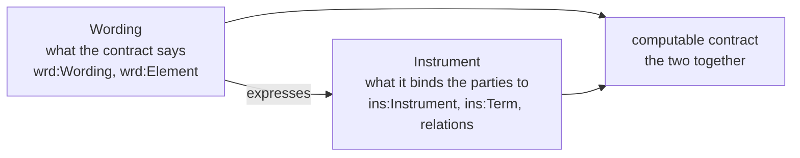

### 4.2 Classes

#### 4.2.1 **`ins:Instrument`.** 

Has the same meaning as the legal sense above: one version of the legal instrument, expressed in one assembled wording. Distinct from *contract* (which would name the whole), *agreement* (one kind of instrument, and a deed or a licence is not always considered one), or *document*.

A document codifies an *instrument* when it is **operative**: executing it changes the parties' legal positions. For example, a lease grants a tenancy, a guarantee makes the guarantor answerable for another's debt, a licence permits what would otherwise be forbidden, or a facility agreement commits lenders to lend.

An instrument changes over time, by amendment, variation, or restatement, and remains the same instrument. LATTICE models this longevity with Foundation's versioning capability: each `ins:Instrument` is one **version**, and every version of one instrument shares one `fnd:PersistentIdentity`. The persistent identity carries the instrument's keys, such as an agreement number (Foundation §8), and any runtime state, such as which regime it is in (ADR-A106). A version represents what was agreed at a point in time: it is expressed in exactly one assembled wording (law I1), and its bound terms belong to it.

`ins:Instrument` acts as an aggregate for the purposes of versioning. Terms and relations are treated as part of their owning clause or instrument version, and change only when it does (law I18). That constaint ensures there is only one answer to "what did the parties agree on 1 March": the instrument version in force on 1 March, its wording, and its bound terms.

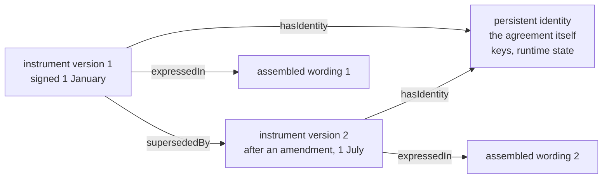

#### 4.2.2 **`ins:Term`.**

In contract law, a "term" is a provision the parties are bound by: "the terms of the agreement", "an implied term", "terms and conditions". A term may be *express*, stated in the words, or *implied*, by statute, custom or the course of dealing between the parties. "Term" has a second sense, of duration ("the term of the lease", "a five-year term"), which LATTICE handles with Foundation's `TemporalScope`. Note that `ins:Term` means only the provision and not the duration.

The following similar, but distinct terminology, is provided for reference here.

- **A Provision**, which means both a clause and what a clause provides, and was retired from the ontology for that duplication 
- **A Clause**, which is a piece of text, wording's element type
- **A Condition**, which in contracts has three senses: a heading ("General Conditions"), a class of term
  whose breach lets the other side terminate (a condition, as against a warranty), and a contingency
  ("subject to the following condition"). Contingencies are `elg:Condition`, and the class of a term
  is its classification (§15.4). No `ins:` class is named Condition
- **A Norm** or **A Statement**, which are words of legal theory that a contract lawyer would not use for a
  provision
  
**Express and implied terms.** Most terms are *express*: the parties wrote them, and a clause states
each one. Some terms bind the parties although no clause states them. They are *implied*:

- **by statute**: many legal systems imply into a sale of goods a term that the goods are of
  satisfactory quality and fit for their purpose, whatever the contract says
- **by custom**: a usage so settled in a trade that the parties are taken to have agreed it
- **by the course of dealing**: terms the same parties have always used in their past contracts
- **in fact**: a term so obvious, or so necessary to make the contract work, that it goes without saying

An express term is a stated term, expressed in a clause. An implied term has no clause to express it, so it has no stated meaning. Its bound term names its source instead (`ins:impliedBy`). 

**A term is not a clause.** A clause is a piece of text. A term is what the parties are bound by.
They usually line up one to one, but not always:

- one clause may state several terms: "The Supplier shall deliver the goods by 1 March, and shall
  pack them for sea transport" is two provisions in one sentence
- one term may need several clauses to state it, when a definition, the main clause and a schedule
  together make one provision. Its stated term is then expressed in the element that contains
  them, such as their section (law I2 requires it to map to exactly one wording element version)

Since a term gives rise to relations, and in a well-modelled contract it is common for one term to give rise to more than one (§21.1, clause 8.1), it has been modelled as an independent node. The law treats a term as a unit, and several things attach to the whole provision rather than to any one relation under it:

| Attaches to the term | Meaning | Slice |
|---|---|---|
| its relations, definitions, deemings, and qualifiers | these determine what the provision creates | C6, C7c, C8 |
| classification | a *condition* (any breach lets the other side terminate), a *warranty* (breach gives damages only), or an *innominate* term (it depends on how serious the breach is) | C7c |
| survival | whether the provision outlives the termination of the instrument, as confidentiality clauses often do | C7b |
| sections it applies within | for an instrument divided into sections, which ones the provision governs | C7c |
| precedence | which provision prevails when two conflict | NRS N10 |

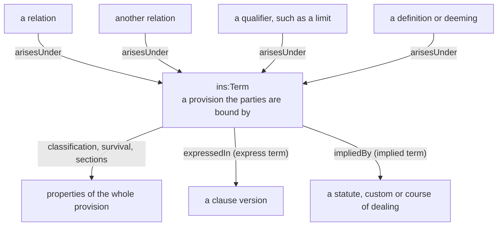

#### 4.2.3 **`ins:Template`.**

Drafters reuse text, and the word *template* comes from that practice. Two kinds of clause matter here:

- a **standard clause** (also *model clause* or clause *template*) is drafted once, in general words,
  and included in many contracts. For example the form clause "The Borrower shall repay each loan to the
  Lenders", might appear in every facility that a lender signs
- a **bespoke clause** is drafted for one contract only: a clause negotiated for Acme's facility and
  no other, such as "The Borrower shall keep its head office in Leeds"

Both kinds have a meaning in their own words, and those words name roles and variables, rather than the parties of a particular contract: "the Borrower", "the Lenders", "{margin}". LATTICE calls this the clause's **stated meaning**, and each node of it a **template**: meaning fixed by the words, waiting for the parties and values of a particular contract. When a contract includes the clause, its template is instantiated with that contract's parties and values, which gives the contract's **bound meaning** (§5.2).

A standard clause's template is instantiated for every contract that includes the clause. A bespoke clause's template is instantiated for one contract only. It is still a template, so every clause works the same way, whether it is used once or a thousand times: its meaning is stated once and instantiated per contract.

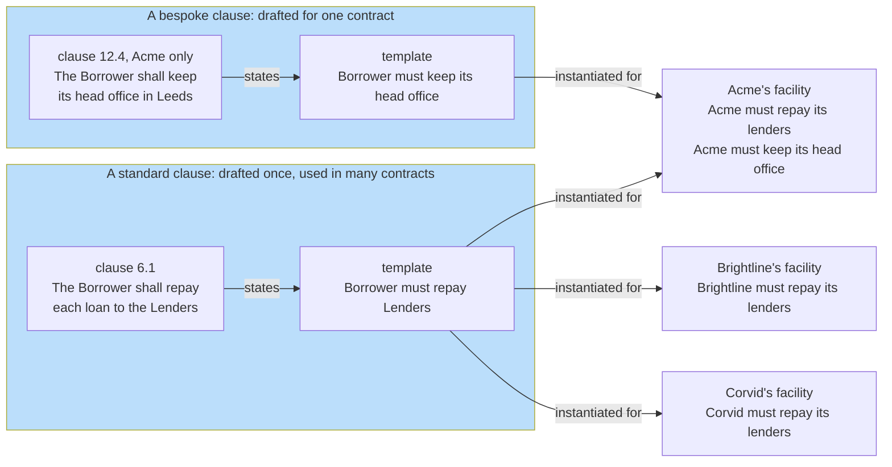

`ins:Template` is a mixin rather than a class of its own, because terms, relations and qualifiers each have a stated form: a stated term is both an `ins:Term` and an `ins:Template`. A regime is always a template: it is stated once by its clause and never instantiated (§11.1).

#### 4.2.4 **`ins:LegalRelation`.**

In jurisprudence a *legal relation* (or *jural relation*) is a bond the law recognises between two persons concerning some conduct: one owes, the other can claim. The phrase is Hohfeld's (§4.4), and every relation in this layer has his shape: two ends and an act. The name is not to be confused with a "relation" in RDF and OWL terminology, which names a property axiom. Similar but distinct terms include:

- **A Right**, which Hohfeld showed covers four different things (a claim, a liberty, a power, and an
  immunity).
- **A Duty**, which names only one end of an obligation
- **A Rule** or **A Norm**, which suggest a general law rather than a bond between named parties

Whatever its kind, a legal relation in this layer will have the same parts:

- **two ends**: the party bound or exposed, and the party who benefits or acts. An obligation has an
  obligor and obligees, the other kinds, a holder and counterparties
- **an act**: what the relation is about, its `ins:activity`, such as repaying, enrolling or
  terminating
- **a scope**: the cases it applies to, as an Eligibility condition (`ins:scope`)
- **a term**: the provision it arises under, and belongs to (`ins:arisesUnder`)
- **when it exists**: what makes it arise, and what ends it, where its words say so
  (`ins:arisesOn`, `ins:endsOn`, below)
- **when it applies**: the situations it is confined to, where its words say so
  (`ins:appliesInState`, §4.2.13)

A relation is always between parties. "The goods must be delivered" becomes an obligation of the supplier, owed to the buyer, to deliver.

**Choosing a kind:** Contract wording signals the kind of a relation by its verbs, but the test is what the provision does to the parties' positions:

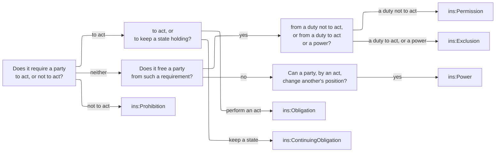

The four kinds are disjoint: nothing is both an obligation and a power. A clause that seems to be
both, such as "the Tenant may terminate by giving notice, and shall give notice in writing", is two
relations under one term: a power to terminate, and an obligation about the form of notice.

##### 4.2.4.1 **Arising: when a relation comes into existence.** 

In law, a right or a duty *arises*, or comes into existence, when the facts that bring it into existence occur. The contract or rule that creates it names those facts. "If the Supplier fails to deliver, the Buyer may terminate" gives the buyer a power that arises when the supplier fails to deliver. Hohfeld called such facts *operative facts*, the facts that, under a rule or a contract, create, change, or end a legal relation. He distinguished them from *evidential facts*, which prove them. Giving notice, failing to pay, issuing an invoice, and leverage passing a threshold are all operative facts. Contract English uses "arise" in two senses, which this layer keeps apart.

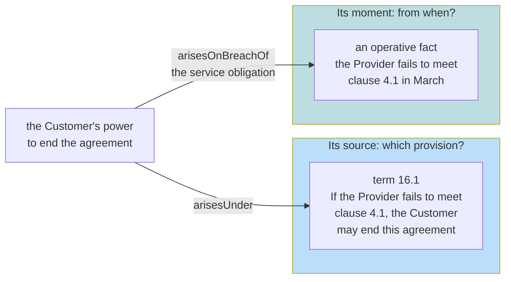

| Sense | Contract English | Answers | In this layer |
|---|---|---|---|
| its **source** | "any obligation arising under this agreement", "liabilities arising under clause 9" | which provision creates it? | `ins:arisesUnder` exactly one term, fixed by the words |
| its **moment** | "a right to terminate arises if the Supplier fails to deliver", "the duty to pay arises on the issue of each invoice" | from when does it exist? | `ins:arisesOn` a legal trigger (§4.2.15), or the short forms `ins:arisesOnBreachOf` and `ins:arisesOnExerciseOf`. Optional |

A relation whose words name no operative fact exists from the moment its instrument takes effect. **Arising is not falling due.** "The Borrower shall repay each loan on its maturity date" binds the borrower from signing, although nothing is payable until maturity, in the way that a debt *accrues* before it is *payable*. The relation's due range (C7b) states when performance is owed.

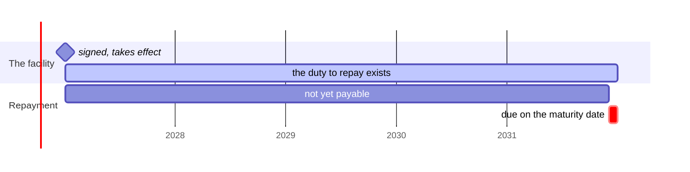

A relation whose words name an operative fact exists only once that fact occurs, and then for the
case in which it occurred. The fact is of one of four kinds.

- **A breach.** "If the Supplier fails to deliver, the Buyer may terminate" is a power arising on
  breach of the duty to deliver. "The Borrower shall pay default interest on any overdue sum" is an
  obligation arising on breach of the duty to pay. A primary duty and the relations arising on its
  breach form a *breach chain*. A chain may fan out, so that one failure gives a remedy, a fee and a
  power to terminate together.
- **An exercise.** "On acceleration, the Borrower shall repay all loans at once" is an obligation
  arising on exercise of the power to accelerate.
- **An act.** "On the issue of each invoice, the Customer shall pay it." Issuing an invoice
  exercises no power and breaches nothing.
- **A condition.** "If leverage exceeds 3.5 to 1, the Borrower shall deliver a remediation plan."

In this breach chain from a supply agreement, one failure to deliver gives rise to three relations.

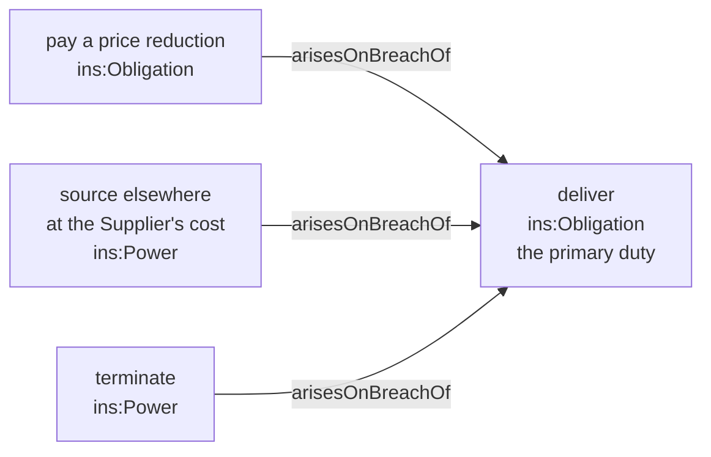

**Ending.** `ins:endsOn` names the operative facts on which a relation ends, as in "the Supplier's
duty of exclusivity ends if the Buyer fails to meet its minimum order" or "the Lender's power to
accelerate ends once the Event of Default is waived". A relation with none ends with its
instrument. C7b adds the termination of whole terms, and survival after termination. Ending is
final for the case concerned, and an ended occasion stays ended. A recurring relation, such as a
monthly service, recurs as a new occasion.

**What happens at runtime.** For each case a relation applies to, Behaviour keeps an *occasion*,
the relation applied to that case, with its own state. Arising and ending move the occasion through
Behaviour's core occasion states, which the runtime evaluator derives from records (C12).

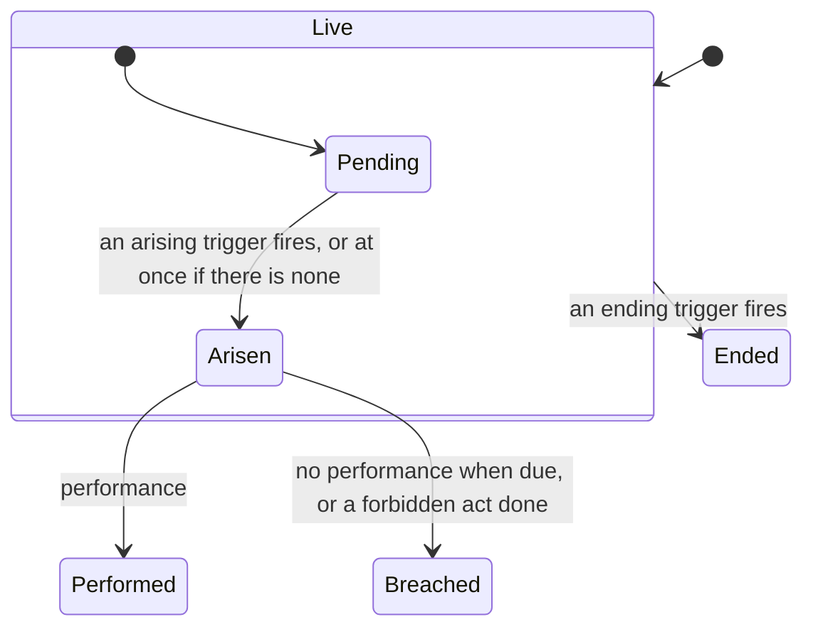

*Pending* means that the relation applies to the case but has not yet arisen. *Arisen* means that
it exists and is live. A breach of one occasion is itself an operative fact, so an `ins:OnBreach` of
it may make another relation arise. This is how a breach chain runs. A relation has one occasion
per case, so a monthly duty has twelve occasions a year, each with its own state.

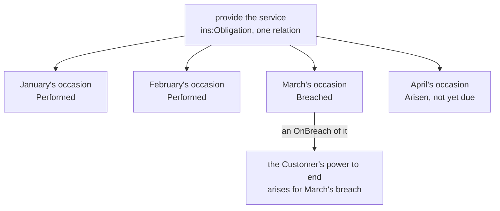

Arising and ending determine *whether* a relation exists. Whether an existing relation applies
*now*, in the instrument's current situation, is a separate question, which regimes answer
(§4.2.13).

#### 4.2.5 **`ins:Obligation`.**

From Roman law's *obligatio*, which Justinian's Institutes define as a bond of law (*vinculum iuris*) binding a person to perform something: the bond between the *obligor*, who owes, and the *obligee*, who is owed. It is what "shall" and "must" create in a contract. Once again we can contrast this with *Duty* (one end of the bond), and *Covenant* (a promise in a deed, and in finance a particular kind of undertaking).

An obligation is one bond with two ends. The *duty* is the obligor's end, and the *claim* is the
obligee's: the right to have the act performed, and to a remedy if it is not. They are not two
facts to keep in step, but one fact seen from two sides (§4.4).

**What an obligation states:**

- **who owes**: exactly one obligor. Where several parties owe together, the obligor is a
  participation group, and the group's composition rule says how they owe: each for its own share
  (several), or each for the whole (joint and several) (§4.2, `ins:RelationParty`)
- **to whom**: one or more obligees, who need not be parties to the instrument. A beneficiary named
  in a contract is an obligee who signed nothing (§6.1)
- **what**: the act owed, `ins:activity`: repay, deliver, report, repair
- **in which cases**: its scope, where it applies only to some
- **by when**: its due range, such as "within 30 days of each invoice" (C7b)
- **what counts as performance**: `ins:fulfilledWhen`, where performance is more than the act being
  done. Without it, performance is an act of the activity, for the case, by the obligor or someone
  the obligor delegated to (Party's `pty:Delegation`)

**Examples across domains:** the borrower shall repay each loan, the tenant shall pay rent
quarterly, the investigator shall report each serious adverse event within 24 hours, the
manufacturer shall repair a product that fails, the employer shall pay salary monthly.

An obligation of this kind is an *achievement* obligation in deontic logic: it is met by doing
something. Its counterpart, an obligation met by keeping something true, is the continuing
obligation below.

#### 4.2.6 **`ins:ContinuingObligation`.**

English contract law speaks of a *continuing* obligation: one that must be kept for a period rather than performed once. "The Borrower shall ensure that leverage does not exceed 3.0 to 1", holds on every day the facility is in force.

Deontic logic, the logic of obligation and permission, draws the same line more sharply. It distinguishes two ways an obligation can be met.

- **An achievement obligation** requires that something be *brought about* at least once, usually by a deadline: "the Borrower shall repay the loan by 31 December". This is fulfilled the moment the act is done and asks nothing more thereafter. It is breached only when the deadline passes and the act has not happened.
- **A maintenance obligation** requires that something *hold throughout* a period: "the Borrower shall ensure that leverage does not exceed 3.0 to 1". It is never discharged by a single act. It is fulfilled only if the state holds at every moment of the period, and it is breached at any moment it does not. This is a common type of obligation in insurance contracts that define subjectivities, which are requirements set by an insurer that a policyholder must meet in order to activate or maintain coverage. 

The difference matters for a computable model, because the two are checked in opposite ways:

- **Breach of a maintenance obligation is a positive fact.** It is found by looking at the state at a point in time. If leverage was 3.4 on 30 June, the covenant was breached on 30 June. That is evidence a rule can read directly.
- **Breach of an achievement obligation is an absence.** It is found only by establishing that the act did *not* happen before the deadline. That needs a record of what happened and a closed view of it, which an open-world reasoner cannot assume. This is why later slices handle the two differently when deriving breach (C12, C13).
- **Their content differs.** An achievement obligation names an act and a time to do it by: `ins:activity`, and a due range from C7b. A maintenance obligation names a state to keep: `ins:maintains`, an Eligibility condition such as "leverage ≤ 3.0", tested against the case at each point.

The literature refines achievement obligations further:

- **Preemptive or not.** Can the act be done early, before the obligation arises, and still count? Paying an invoice before it is issued is the usual example.
- **Perdurant or not.** Does the obligation survive its own breach? A late payment is still owed after the due date has passed.

These distinctions belong to arising and due (C7b), and C6 does not model them yet.

So LATTICE maps the two kinds onto two classes:

- `ins:Obligation` is the achievement case: an act, owed, and later due.
- `ins:ContinuingObligation` is the maintenance case, with the state it keeps in `ins:maintains`.

Other continuing obligations across domains: the tenant shall keep the premises in good repair,
the licensee shall keep the source code confidential while it holds a copy, the supplier shall
maintain the certifications listed in the schedule, the employer shall maintain a safe place of
work.

#### 4.2.7 **`ins:Prohibition`.**

What "shall not" and "must not" create: an obligation not to do something. In deontic logic F p, "p is forbidden", is defined as O ¬p, "not-p is obligatory", which is why `ins:Prohibition` is a kind of `ins:Obligation`. A market's *negative covenant* and *negative pledge* are examples of prohibitions.

In deontic logic a prohibition is a maintenance obligation, in negative form. "The Borrower shall not create any security" creates an obligation to keep *not creating security* true throughout the period the instrument remains in force. Unlike a covenant on a state, though, its breach is an act. Creating security on March 3rd breaches it on March 3rd, again a positive fact.

That is why `ins:Prohibition` is not an `ins:ContinuingObligation`, and the T-Box declares the two
disjoint. Both hold throughout a period, but they say different things:

| | `ins:ContinuingObligation` | `ins:Prohibition` |
|---|---|---|
| what it names | a **state** to keep: leverage at most 3.0 | an **act** not to do: create security |
| its content | `ins:maintains`, a condition | `ins:activity`, a concept, and usually a scope |
| what breaches it | the state failing to hold at a moment | the act being done |
| how it is excepted | an exclusion for some period or case | a permission for some cases |

**Scope makes a prohibition precise.** Few prohibitions forbid an act everywhere. "The Employee
shall not work for a competitor within 50 miles for six months after leaving" forbids working for a
competitor only within that scope: the act is `Work for competitor`, and the place and period are
its scope. Keeping the act plain and the circumstances in the scope lets a permission except part
of the same act (below).

**Examples across domains:** a negative pledge (shall not create security), a non-compete (shall not
work for a competitor), a confidentiality clause (shall not disclose confidential information), a
restriction on assignment (shall not assign this licence), a trial's eligibility rule (shall not
enrol a participant who fails the criteria).

#### 4.2.8 **`ins:Permission`.**

A *permission* in the strong sense of deontic logic: a positive licence to do what a prohibition would otherwise forbid. Contracts write it as an exception: "Clause 8.1 does not apply to any lien arising by operation of law", "Permitted Security", "the Sponsor may waive". A permission always excepts a prohibition. Weak permission, the mere absence of a prohibition, needs no node and has none. *Liberty* and *Privilege*, Hohfeld's words, are not suitable here, since "privilege" has other legal senses (legal professional privilege).

The name is shared with the Eligibility decision value `elg:Permitted`, which is a different thing entirely, with both carrying a comment saying as much.

**Strong and weak permission.** deontic logic distinguishes two senses of "permitted":

- **weak permission**: an act is permitted because nothing forbids it. Nothing in a lease forbids
  the tenant from painting the walls, so painting them is permitted in the weak sense
- **strong permission**: an act is permitted because a provision says so, usually as an exception
  to something that would otherwise forbid it. "The Tenant shall not alter the premises, except
  that the Tenant may decorate the interior" gives a strong permission to decorate

Only strong permission is a node in this layer. Weak permission is the absence of a prohibition,
and an absence is not a fact an open-world model can record: there may be a prohibition the graph
does not hold. A strong permission is written in the wording, so it is a fact like any other.

**How a permission works.** A permission always excepts exactly one prohibition (`ins:excepts`),
and takes effect within its own scope. The act is forbidden where the prohibition's scope holds,
unless the permission's scope holds too:

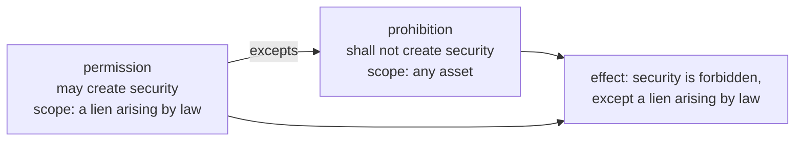

Law I8 ties a permission to the prohibition it excepts:

- its **holder** is the prohibition's **obligor**: only the party who is forbidden can be freed
- its **activity** is the prohibition's activity: it permits the same act, in fewer cases

A permission that broke either rule would free someone who was never bound, or permit an act that
was never forbidden. The shapes report both.

**Examples across domains:** permitted security under a negative pledge, a sponsor's written waiver
of an eligibility criterion, consent to assign a licence, a landlord's permission to sublet part of
the premises.

#### 4.2.9 **`ins:Exclusion`.**

An *exclusion clause* or *exemption clause*: "the Manufacturer shall not be liable for", "Clause 2.1 does not apply to damage caused by misuse", "is not obliged to". It frees its holder from an obligation within its scope, or protects its holder from a power: "the Licensor may not end the licence once the perpetual fee is paid", which is an *immunity*. Distinct from *Exemption* (also a tax and regulatory word), *Immunity* (only the second kind), *Waiver* (an act of giving up a right, not a term).

An exclusion has two forms, according to what it excepts:

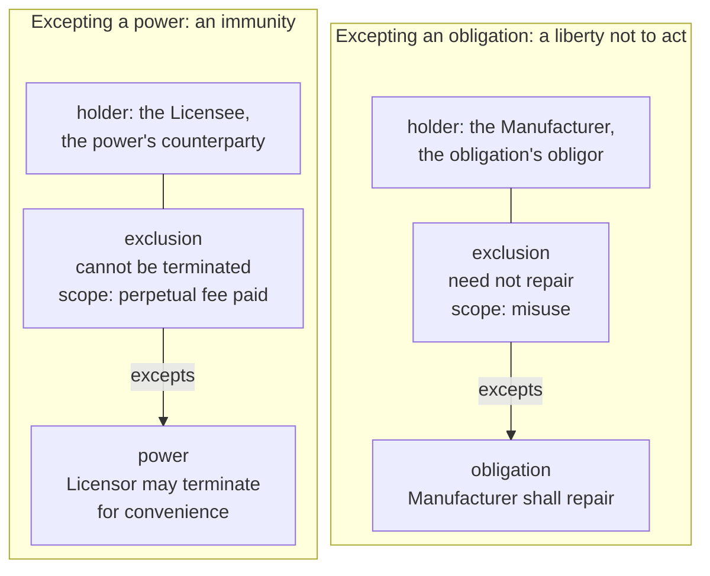

- **Excepting an obligation**, the exclusion is a *liberty not to act*: within its scope the obligor
  need not perform. Its holder is the obligation's obligor, the party who would otherwise be bound
  (law I8). A product warranty that does not cover misuse, a supplier who need not deliver on public
  holidays, an employee who need not work on rest days.
- **Excepting a power**, the exclusion is an *immunity*: within its scope the power cannot be
  exercised against its holder. Its holder is the power's counterparty, the party who would
  otherwise be exposed (law I8). A perpetual licence that cannot be ended for convenience, a lease
  that the landlord cannot end early while the rent is paid.

**Why Exclusion and Permission are separate classes.** Both are Hohfeldian privileges, and both are
exceptions. They differ in the direction of the duty they free from: a permission frees from a duty
*not* to act, so its holder *may* act. An exclusion frees from a duty *to* act, so its holder *need
not* act, or from exposure to a power, so its holder *cannot be made* subject to it. Contract
English uses different words for them ("may", "need not", "shall not be liable"), and a reader of
the data should see the same distinction.

**Carve-backs.** Exclusions are often narrowed by a carve-back: "Clause 2.1 does not apply to damage
caused by misuse, unless the failure was caused by a manufacturing defect". The carve-back belongs
in the exclusion's scope, as a negated member of the scope's condition (§9, §21.3), not as a second
relation.

#### 4.2.10 **`ins:Power`.**

Hohfeld's *power*: the ability, by one's own act, to change someone else's legal position. Contracts write it as "may" with an effect: "the Lenders may by notice declare all loans due", "may terminate", "may accept". "May" is a permission if it only frees the holder, and a power if it changes someone else's relations. Distinct from *Right* ("right to terminate" is a power, but "right" covers four things), *Option* (one kind of power), *Authority* (an agent's power, which an applied ontology may specialise from `ins:Power`).

**Power and permission, side by side.** "The Tenant may decorate the interior" and "the Tenant may
terminate the lease on six months' notice" both say "may", but they do different things. After the
tenant decorates, nobody's rights have changed: the act was simply allowed. After the tenant gives
notice, the lease ends in six months, and with it the tenant's duty to pay rent and the landlord's
duty to give possession. The first is a permission. The second is a power, because exercising it
has a legal effect on someone else.

**What exercising a power does.** The act that exercises a power is its `ins:activity`. Its effect is
on the counterparty's legal position, in one of three ways:

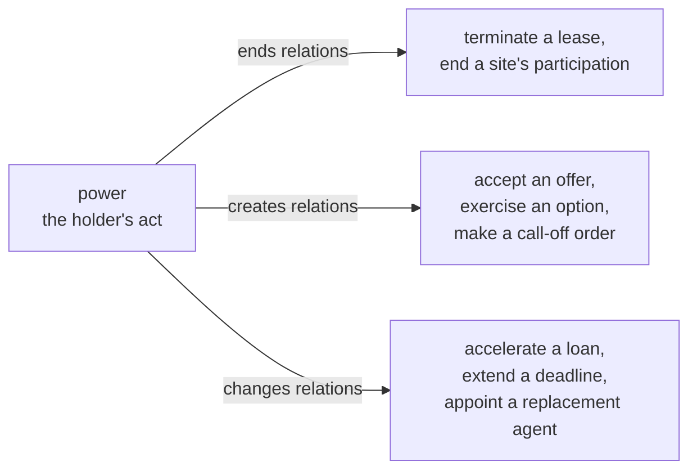

Legal triggers say what a power's exercise does: an `ins:OnExercise` moves a regime, such as
a licence into its notice period, and a relation may arise or end on the exercise (§10). An
instrument made by exercising a power, such as an order under a framework agreement, records the
power it was made under (C9).

**When a power can be exercised.** A power is often limited: to its scope, to a regime's state
("only while an event of default is continuing", `ins:appliesInState`, §11.3), or by a consent rule where a group holds it ("by lenders
holding two thirds of the commitments", C9). The counterparty's end of a power is Hohfeld's
*liability*, a word this layer never uses (§4.6). An exclusion of the power gives the counterparty
an *immunity* (above).

#### 4.2.11 **`ins:Qualifier`.**

A limit, level, retention, or any other thing that qualifies a term or a relation: it says how much, not what.

A qualifier never creates a relation of its own. It bounds one that already exists:

- a cap: "the Licensor's aggregate liability under this agreement shall not exceed the fees paid in
  the previous twelve months" qualifies the licensor's obligations to pay damages
- a minimum: "the Buyer shall order at least 1,000 units in each quarter" qualifies the obligation
  to order
- a threshold: a covenant that bites only above a certain level of borrowing
- a level of performance: "with an availability of at least 99.9% in each month"

A qualifier arises under exactly one term, like a relation, and qualifies exactly one term or
relation (`ins:qualifies`). It is its own node because amounts are rarely just numbers: they have a
unit and currency, a period they reset over, and a basis, such as per claim or in the aggregate.
That structure is defined with contract amounts (C8), and C6 declares only the class and its links.

#### 4.2.12 **`ins:RelationParty`.**

A *party* is an entity (e.g., person or organisation) bound by or benefiting from an instrument. This union of types, names what may stand at the end of a relation: a role occupancy (a party filling a role for a period, Party layer), a participation group (several parties acting together), or, in stated meaning only, a role. "Party" alone would read as a person, and sit beside the property `ins:party` (C6-Q4).

The three members come from the Party layer, and each answers a different question:

| Member | Answers | Example |
|---|---|---|
| `pty:Role` | which capacity? | the Borrower, the Licensee, the Sponsor |
| `pty:RoleOccupancy` | who fills it, from when? | Acme Holdings plc as Borrower, from 1 January |
| `pty:ParticipationGroup` | which several parties, acting how? | the lenders, each for its own share |

A **role** is a capacity, independent of who fills it. Stated meaning names roles, because a
clause's words do: "the Borrower" means whoever is the borrower under each contract the clause is
used in (law I13). A **role occupancy** is one party filling one role, for a period. Bound meaning
names occupancies, because a contract's parties are particular entities. An occupancy may exist
before anyone fills it, a *contingent* occupancy, for a party that depends on the case (§8).

A **participation group** is several occupancies standing at one end of a relation together, with a
composition rule that says how they stand there:

- **several**: each is owed, or owes, only its own share. Two lenders lending 60% and 40% are each
  owed repayment of their own part only
- **joint and several**: each is liable for the whole, and the creditor may pursue any one of them.
  Two tenants who sign one lease are often jointly and severally liable for the whole rent

**Party to the instrument, and party to a relation.** These differ. `ins:party` lists who is party to
the instrument: who signed it. The ends of a relation name whoever the relation binds or benefits,
who may include persons who signed nothing: a beneficiary for whose benefit a promise was made, or
a regulator given a power of inspection. That is why `ins:party` is authored, and never derived from
the relations' parties (§6.1).

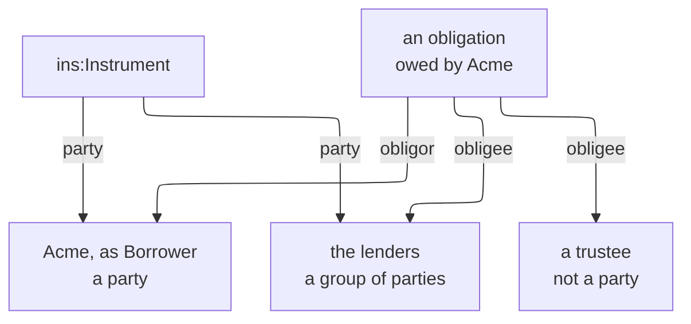

#### 4.2.13 **`ins:Regime`.**

In legal terminology, a regime is a body of rules that applies to a specific situation, or for a specific period of time, for example an insolvency regime, or "the regime that applies during the notice period", and so on. It is synonymous with *dispensation*, in its older sense of an order of things that holds for a period. In this substrate, a *regime* is modelled as a set of states an instrument can be in, along with rules that can be used to move it between states. Some examples include a notice regime (in force, notice period, terminated), suspension regime (in force, suspended), or event-of-default regime (performing, cure period, defaulted).

Arising and ending (§4.2.4) describe events that happen once. A relation comes into existence, later ends, and does not return. Contracts also describe *situations* that an instrument enters and leaves, sometimes more than once, and that change what applies under the contract while they last. For example:

- while notice of termination is running
- while deliveries are suspended
- while an event of default is continuing
- while a force majeure event prevents performance

A regime models one such family of situations. Its states are the situations, and its transitions are the operative facts that move the instrument from one to the next.

##### 4.2.13.1 **Where an instrument's regimes come from.**

A regime arises under the term of the clause that describes the situation (`ins:arisesUnder`), as a relation does. A licence's termination clause, for example, states its notice regime. An instrument has a regime only if its wording includes the clause that states it. A licence with no termination on notice has no notice regime, and nothing in it can depend on a notice period. An instrument may therefore have no regimes or several, each independent of the others. A clause may state a regime together with relations, as the licence's clause 11.1 states both the power to end on notice and the notice regime its exercise starts. A clause may also state a regime alone, as a force majeure clause does.

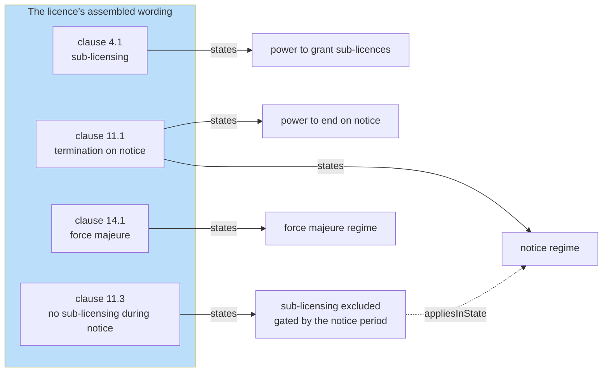

A licence on a form without clause 14.1 would have one regime, not two.

**An instrument is always in exactly one state of each of its regimes.** The instrument enters each regime's initial state (`bhv:initialState`) when it takes effect. After that it moves only along the regime's transitions, each on a legal trigger.

Each regime runs independently, so being in a notice period says nothing about force majeure. The instrument's position is not part of what was agreed. It is a runtime record, a Behaviour *state occupancy* for the instrument's persistent identity, which begins when the instrument enters the state and ends when a transition leaves it (§11.1). The diagram shows one licence over a year, with illustrative dates.

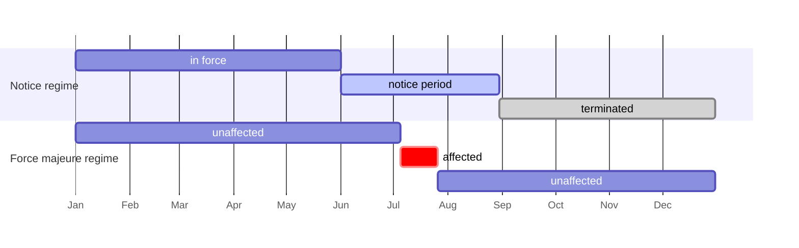

##### 4.2.13.2 **Gating: relations that apply only in a situation.**

Most relations apply whenever they exist. Some apply only under specific circumstances, and their clauses say so, for example: "during the notice period, the Licensee may not grant sub-licences", or "while an Event of Default is continuing, the Lender may declare the Loan due", or "the Supplier is relieved of clause 3.1 while a force majeure event prevents it from performing". 

Such a relation names the states it applies in (`ins:appliesInState`). Those states are its *gate*. While the instrument is in one of them, the gate is open and the relation applies. Otherwise the gate is closed, and the relation, though it still exists, does not apply. The diagram shows the licence again, with the exclusion of sub-licensing and the power it excepts beneath the notice regime.

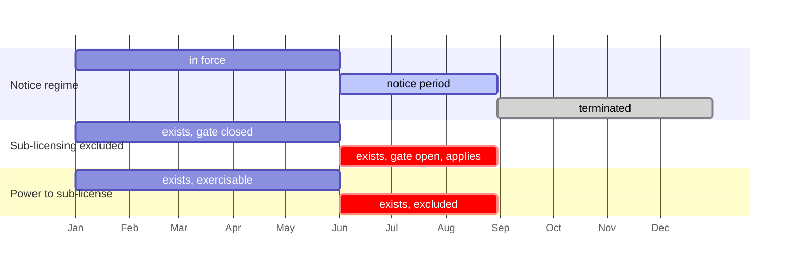

The exclusion exists all along and applies only while its gate is open. While it applies, the power it excepts cannot be exercised. When the licence terminates, both end with it.

**A relation's regimes** are those its named states belong to. They are its instrument's, stated by
the relation's own clause or another. Most relations name no state, so have no gate and no regimes. Like its scope, a relation's gate is fixed by its clause's words.

Three questions about one relation at one moment have separate answers, from separate parts of the model. The table answers them for the licence's exclusion of the power to grant sub-licences (§21.5).

| Question | Answered by | For the exclusion |
|---|---|---|
| Does it exist? | arising and ending (`ins:arisesOn`, `ins:endsOn`, §4.2.4) | from signing, since its clause names no operative fact, until the licence ends |
| Does it apply now? | its gate (`ins:appliesInState`), read against the instrument's regimes | only while the licence is in its notice period |
| Does it apply to this case? | its scope (`ins:scope`) | to every sub-licence, since it has no scope |

For an obligation, its occasion's state answers a fourth question, whether it is due, performed or breached for a case (§4.2.4, C7b, C12). The questions are asked in order, and a relation takes effect for a case only when every answer is yes.

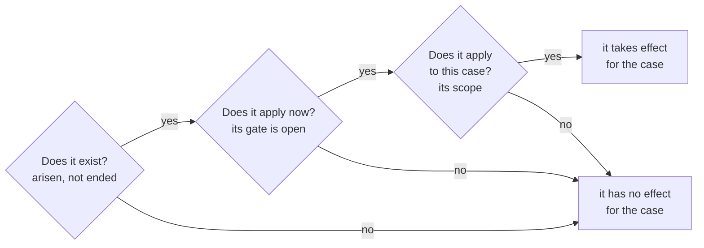

**Why a gate, and not arising and ending.** "During the notice period, the Licensee may not grant sub-licences" could also be read as an exclusion that arises when notice is given and ends when the licence terminates. For a regime that only moves forward, the two readings agree. They differ in three ways.

- **Situations recur.** A supply agreement can be suspended, reinstated and suspended again. Ending is final, so a relation that ended on suspension would not return on reinstatement. A gate opens and closes each time the instrument enters and leaves the state. A suspension is therefore a state and not an ending, because it can be reinstated.

  ```mermaid
  gantt
      dateFormat YYYY-MM-DD
      axisFormat %b
      section Suspension regime
      in force                      :s1, 2027-01-01, 2027-03-01
      suspended                     :crit, s2, 2027-03-01, 2027-04-01
      in force                      :s3, 2027-04-01, 2027-08-01
      suspended                     :crit, s4, 2027-08-01, 2027-09-01
      in force                      :s5, 2027-09-01, 2027-12-31
      section Duty to deliver, gated
      applies                       :active, g1, 2027-01-01, 2027-03-01
      applies                       :active, g2, 2027-04-01, 2027-08-01
      applies                       :active, g3, 2027-09-01, 2027-12-31
      section Duty to deliver, ended on suspension
      exists                        :active, e1, 2027-01-01, 2027-03-01
      ended for good                :done, e2, 2027-03-01, 2027-12-31
  ```
- **Situations are shared.** Several relations often depend on one situation. During a notice
  period, for example, a licensee may lose its power to sub-license and gain a duty to help migrate
  its users. With a gate, the situation is stated once, in its regime, and each relation names the
  state. With arising and
  ending, each relation would restate the facts that start and stop the situation, and nothing
  would keep them in step.

  ```mermaid
  flowchart LR
      subgraph GATE["With a gate: the situation stated once"]
          NP["notice period"]
          X1["sub-licensing excluded"] -- "appliesInState" --> NP
          X2["help migrate users"] -- "appliesInState" --> NP
      end
      subgraph ARISE["With arising and ending: restated per relation"]
          Y1["sub-licensing excluded"] -- "arisesOn" --> N1["notice given"]
          Y1 -- "endsOn" --> E1["licence ends"]
          Y2["help migrate users"] -- "arisesOn" --> N2["notice given"]
          Y2 -- "endsOn" --> E2["licence ends"]
      end
      style GATE fill:#BBDEFB
  ```
- **Situations are not cases.** A relation's scope states which cases it covers, and design-time
  comparisons read it, for example to ask whether version 2 of the licence widens the licensee's
  powers. A gate states when the relation applies, and only the runtime reads it. Keeping the two
  apart stops the serving of notice from looking like an amendment (DP6, §11.5).

**Several regimes on one relation.** A relation may name states of more than one regime. The states
of one regime are alternatives, so the relation applies in any of them. Across regimes the
conditions combine, so the relation applies only when every one of them is in a named state. The
supply agreement's duty to deliver names *in force* from its suspension regime and *unaffected*
from its force majeure regime. It applies only when deliveries are not suspended and no force
majeure continues (§11.3).

**Regimes for each occasion.** Some situations belong to one occasion of a relation rather than to
the instrument. One month's service failure may be disputed while the others are not. A
*per-occasion* regime (`bhv:perOccasionOf` a relation) runs once for each occasion of that
relation, from when the occasion exists. A relation gated by its state must identify the occasion
it concerns, and does so through arising. An exclusion that arises on breach of the service
obligation reads the dispute regime of the breached occasion (§11.4). Here arising and regimes meet
most directly.

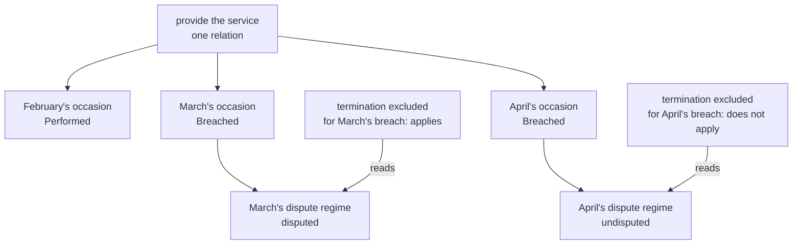

The customer may end the agreement for April's failure, which the provider has not disputed, and
not for March's, which it has.

**One operative fact, several effects.** The legal triggers that make relations arise and end also
move regimes (§4.2.15), so one fact can have several effects. When the licensor gives notice under
clause 11.1, that exercise of its power moves the licence's notice regime into the notice period.
This opens the gate on the exclusion of sub-licensing, and starts the 90 days after which the
licence terminates.

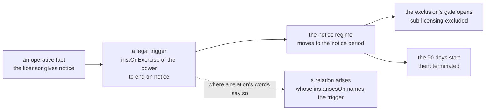

**Kinds of regime.** Regimes are of three kinds (§11.2).

| Kind | Examples | Shape |
|---|---|---|
| **period** | notice, cure, probation, garden leave, run-off | entered on a trigger, left at a duration from entry or on an end trigger, whichever comes first |
| **switching** | suspension and reinstatement, force majeure | states switched back and forth by triggers |
| **threshold** | a usage cap, an aggregate limit exhausted | states defined by ranges of a measured value, entered as the value crosses into each |

**A regime is stated once.** Unlike a relation, a regime has no bound form. Its clause states its states and transitions once, and every instrument that includes the clause shares them. Each instrument's progress through them is held at runtime against its persistent identity (§11.1). An instrument's regimes are therefore the stated regimes of the clauses in its wording, and its positions in them are its occupancies.

#### 4.2.14 **`ins:RegimeTransition`.**

A move between two states of a regime on a legal trigger, as in "on the expiry of the notice period, this licence terminates" or "if the Borrower remedies the breach within the cure period, the Event of Default does not occur". It is a `bhv:TransitionDefinition` whose engine settings are fixed. A regime takes one transition at a time (`bhv:SingleMatch`), and takes it at once (`bhv:ImmediateActivation`), because a contract's words never say that two outcomes compete, or that a change waits for someone to run it. Distinct from *event*, what happened, which the runtime records, and *amendment*, a change of the words (C9).

#### 4.2.15 **The legal triggers: `ins:OnExercise`, `ins:OnBreach`, `ins:OnAct`, `ins:OnCondition`, `ins:OnExpiry`, `ins:OnEntry`.**

A *trigger* is what makes something happen, written in contracts as "on", "upon", "if", "when" or "following". The six legal triggers are the six kinds of fact on which a contract's words make a consequence turn.

| Trigger | Contract English | Fires on | Behaviour's kind |
|---|---|---|---|
| `ins:OnExercise` | "on the giving of notice under clause 11.1", "upon acceptance" | the exercise of a power (`ins:ofPower`) | an external stimulus, a party's act |
| `ins:OnBreach` | "if the Borrower fails to pay", "following any breach of clause 4" | the breach of an obligation (`ins:ofObligation`) | derived by the runtime from the obligation's occasions |
| `ins:OnAct` | "if the Provider disputes the report", "on delivery" | an act that exercises no power (`ins:activity`, optionally `ins:by`) | an external stimulus |
| `ins:OnCondition` | "if leverage exceeds 3.0 to 1", "while a force majeure event prevents performance" | a condition coming to hold (`ins:condition`) | derived |
| `ins:OnExpiry` | "on the expiry of 90 days", "within 30 Business Days", "on the Expiry Date" | the end of a period counted from entering a state (`ins:after`), or a time (`ins:at`) | scheduled, known in advance |
| `ins:OnEntry` | "on termination", "on the expiry of this Agreement", "upon the commencement of the run-off period" | the subject entering a state (`ins:ofState`) | derived |

The names follow drafting's "on" with the event, as in "on termination" and "on expiry". *Exercise* and *breach* are the law's words for a power used and an obligation not performed. *Expiry* is its word for a period coming to an end, as in "the expiry of the notice period". *Act* is the plain word, as in deontic logic, for what a party does. *Entry*, for `ins:OnEntry`, is the plain word for coming into a state, so "on termination" is the entry into a terminated state. Distinct from *event* (what happened, not what an instrument waits for), *condition* in its other senses (§4.6, here only the trigger's Eligibility condition), and *deadline*, a due range (§13).

Five of the triggers also determine when a relation arises or ends (`ins:arisesOn`, `ins:endsOn`, §4.2.4). One vocabulary therefore governs both relations and regimes. What moves a licence into its notice period is the same kind of fact as what gives a customer a power to terminate, and what ends a licence is the same kind of fact as what makes its "on termination" duties arise. `ins:OnExpiry` moves only regimes, because it counts from entering a state, and a relation has no state to enter. A relation's own periods, such as a duty due within 30 days of arising, are due ranges (§13).

```mermaid
flowchart LR
    T["a legal trigger"]
    T -- "moves" --> R["a regime<br/>between its states"]
    T -- "makes arise, or end<br/>(not an expiry)" --> L["a legal relation"]
    R -- "its states gate" --> L
```

#### 4.2.16 **`ins:Survival`.**

*Survival* is contract English for a term continuing to operate after its instrument has ended, as
in "this clause survives termination" or "the confidentiality obligations continue for five years
after termination". A survival says for how long, whether for a period, until a condition comes to hold, or
without limit (§14.4). Distinct from *accrued rights*, which persist after termination without any
clause saying so, and from *renewal*, which continues the whole instrument.

#### 4.2.17 **`ins:Definition`.**

A *definition* is how a contract gives a word its meaning: "'Obligors' means the Borrower and each
Guarantor". The word is the *defined term*, often capitalised, and its meaning holds wherever the
words use it, within the parts the definition applies to. "Defined term" is not used for the node,
since `ins:Term` is a provision: the node is the definition, and what it defines is the *word*
(§15.1).

#### 4.2.18 **`ins:Deeming`.**

To *deem* is to take something to hold whether or not it does: "deemed received", "deemed to have
been made on the date of the first claim". A deeming is *conclusive* when no proof displaces it and
*rebuttable* when it holds until shown otherwise. *Relation back* deems a later fact to have
happened earlier, usually *for the purposes of* named clauses only (§15.2). Distinct from a
*presumption*, which the law, not the contract, supplies.

#### 4.2.19 **`ins:Sectioning`.**

A *section* is a part of an instrument with a meaning of its own: its own parties, authority, words
or terms. Markets call it many things: a *lot* in a framework, a *tower* in outsourcing, a *coverage
section* in a package policy, a *tranche* in a facility, a *column* of a binding authority's
schedule, an *agreement segment* in the CBAA. A *sectioning clause* divides an instrument into
sections and says that what each contains applies only within it. Wording's element type Section is
a heading's type, and does not by itself make a section in law (§16.1).

#### 4.2.20 **`ins:PartyResolution`.**

"Any Insured Person against whom a claim is made", "the Participant in whom the adverse event
occurred": a party the words describe but do not name, known only when each case arises. A
*resolution* is how it is found from the case (§17.2). The word avoids *binding*, which here means
instantiating a template, and *evidence binding*, Eligibility's, which feeds a value to a condition.

Two kinds of term create no relation. An *interpretation clause* says how the words are read ("a
reference to a person includes its successors"). A *status declaration* says what a party is ("the
Seller is an independent contractor"). Both are terms with nothing arising under them (§15.3).

### 4.3 Properties

The properties fall into seven groups: those that tie meaning to text and to its owner, those that name a relation's parties, those that state a relation's content, a party's details for one instrument, those of triggers, regimes and gating, those of time and ending, and those of words, sections and whom terms bind.

#### Text and ownership: `ins:expressedIn`, `ins:alsoExpressedIn`, `ins:boundIn`, `ins:boundFrom`, `ins:impliedBy`, `ins:arisesUnder`

These six properties are how every computable node reaches the words that create it (§5.1).

- **`ins:expressedIn`** comes from the law's *express* terms, terms the words state: "the terms
  expressed in this agreement". A stated term is expressed in exactly one clause version, which owns
  it. An instrument version is expressed in exactly one assembled wording, the text its parties
  signed. One property serves both, because both say "these are the words that state this".
- **`ins:alsoExpressedIn`** carries the same stated term into a second element: the French text of a
  bilingual agreement, or a consolidated copy that restates amended clauses. The term still has one
  owner, its `ins:expressedIn`. A deployment that never does this can load the optional
  `single-expression.ttl` to refuse it (ADR-A96).
- **`ins:boundIn`** and **`ins:boundFrom`** borrow computing's *bound variable*. A template's roles and
  variables are free, waiting for values. Instantiating it for one contract binds them to that
  contract's parties and values. The result is bound meaning: each bound term is part of exactly one
  instrument version (`ins:boundIn`), and each bound node points at the stated node it was
  instantiated from (`ins:boundFrom`), so its derivation is always traceable. `ins:boundFrom` is a
  sub-property of PROV's `prov:wasDerivedFrom`, the W3C provenance vocabulary's word for exactly
  this. The phrase also echoes the law's "the parties are bound by its terms".
- **`ins:impliedBy`** takes the place of `ins:boundFrom` for an implied term (§4.2, `ins:Term`): a
  term no clause states has no template to be instantiated from, so it names the statute, custom or
  course of dealing that implies it.
- **`ins:arisesUnder`** is contract English: "any obligation arising under this agreement", "any
  dispute arising under this licence". A relation, definition, deeming or qualifier arises under the
  term that creates it, and belongs to it. Only the term carries `ins:expressedIn` or `ins:boundIn`,
  so a relation reaches its clause or its instrument through its term, never directly.

```mermaid
---
config:
  layout: elk
---
flowchart LR
    BR["bound relation"] -- "arisesUnder" --> BT["bound term"]
    BT -- "boundIn" --> IN["instrument version"]
    BT -- "boundFrom" --> ST["stated term"]
    BR -- "boundFrom" --> SR["stated relation"]
    SR -- "arisesUnder" --> ST
    ST -- "expressedIn" --> CL["clause version"]
    ST -. "alsoExpressedIn" .-> TR["the clause in French"]
    IT["implied term"] -- "boundIn" --> IN
    IT -- "impliedBy" --> SRC["a statute"]
```

#### A relation's parties: `ins:party`, `ins:obligor`, `ins:obligee`, `ins:holder`, `ins:counterparty`

- **`ins:party`** is "the parties to this agreement": who is party to the instrument, as authored.
  It is not the same as who stands at the ends of the relations (§4.2, `ins:RelationParty`).
- **`ins:obligor`** and **`ins:obligee`** are civil law's names for the two ends of an *obligatio*:
  the one who owes and the one owed. They are used for every obligation, continuing obligation and
  prohibition.
- **`ins:holder`** and **`ins:counterparty`** name the two ends of the other three kinds. *Holder* is
  how the law speaks of a power or a right: "the holder of the power", "the holder of the option".
  *Counterparty* is finance's word for the other side of an arrangement. Hohfeld named the far end
  of each kind (no-right, liability, disability), but those words are never used: "liability" in
  particular has settled senses of its own, such as a liability to pay.

| Kind | The bound or freed end | The other end |
|---|---|---|
| `ins:Obligation`, `ins:ContinuingObligation`, `ins:Prohibition` | `ins:obligor` (exactly one), who owes | `ins:obligee` (at least one), who is owed |
| `ins:Permission` | `ins:holder` (exactly one), who may act | `ins:counterparty`, who cannot object |
| `ins:Exclusion` | `ins:holder` (exactly one), who need not act or is immune | `ins:counterparty`, who cannot demand or cannot exercise the power |
| `ins:Power` | `ins:holder` (exactly one), who can act | `ins:counterparty`, whose position the act changes |

#### A relation's content: `ins:activity`, `ins:scope`, `ins:maintains`, `ins:fulfilledWhen`, `ins:excepts`, `ins:qualifies`

- **`ins:activity`** is deontic logic's *action*: the act a relation is about. It names the act
  plainly, without its circumstances: `Repay`, `Enrol`, `Terminate`. An activity is a concept from a
  scheme bound to `ins-voc:ActivityContract`, so a deployment can use its own list of acts (§18). The same property names the act an `ins:OnAct`
  trigger waits for (§10), so a trigger on an act of repaying names the same concept as the duty to
  repay.
- **`ins:scope`** is "the scope of the exclusion", "within the scope of this clause": the cases a
  relation applies to. It is an Eligibility condition, so the same machinery that decides whether
  a case is admissible decides whether a relation applies to it. Keeping circumstances in the scope
  rather than the activity is what lets a permission except part of a prohibition: both have the
  activity `Enrol`, and their scopes say where enrolment is forbidden and where it is allowed.
- **`ins:maintains`** is deontic logic's *maintenance* obligation (§4.2,
  `ins:ContinuingObligation`): the state a continuing obligation keeps holding, as a condition.
- **`ins:fulfilledWhen`** is the *fulfilment* or *performance* of an obligation: the test that says
  it was performed. It is needed only when performance is more than the act being done, such as a
  report that must be accepted, not merely sent.
- **`ins:excepts`** comes from "except", "save that", "does not apply to": an *exception* names what
  it takes effect against. A permission excepts a prohibition, and an exclusion an obligation or a
  power.
- **`ins:qualifies`** links a qualifier to the term or relation whose amount it bounds. A bound
  qualifier spanning sections qualifies every bound relation generated from the stated one (§16.5).

#### A party's details for one instrument: `ins:noticeAddress`, `ins:operatesAt`

Instruments state where each party takes notices and where it operates, and these are details of
the party *for this instrument*, so they sit on the role occupancy rather than on the party itself
(S97). The same company may give one notice address in its lease and another in its loan.

- **`ins:noticeAddress`** comes from the notices clause: "notices shall be given at the address set
  out above". It is the address as written, a string. It never identifies the party, whose identity
  is its keys (Foundation §8).
- **`ins:operatesAt`** is "operates at", "carries on business at": a place the party operates at
  under this instrument, as a concept from the deployment's own territory or site scheme, bound to
  `ins-voc:LocationContract`.

#### Triggers, regimes and gating: `ins:ofPower`, `ins:ofObligation`, `ins:by`, `ins:condition`, `ins:after`, `ins:tolledIn`, `ins:stateKind`, `ins:appliesInState`, `ins:arisesOn`, `ins:arisesOnBreachOf`, `ins:arisesOnExerciseOf`, `ins:endsOn`

- **`ins:ofPower`** and **`ins:ofObligation`** come from "the exercise *of* the power" and "a breach
  *of* clause 4.1". They name the relation whose exercise or breach a trigger watches. In a regime they
  name the stated relation, and match the exercise or breach of every bound relation instantiated
  from it (§11.1).
- **`ins:by`** comes from "notice given *by* the Licensor". It names a party whose act an
  `ins:OnAct` waits for.
  Without it, an act of that kind by any party fires the trigger.
- **`ins:condition`** is the Eligibility condition an `ins:OnCondition` waits for. The trigger fires
  when the condition comes to hold.
- **`ins:after`** comes from "*after* 90 days". It is the length of an `ins:OnExpiry` period, a
  Quantification quantity in a unit of time, counted from entering the state the transition leaves. A unit whose
  length depends on a calendar, such as a business day, is a `qnt:CalendarUnit` (ADR-A94).
- **`ins:tolledIn`** comes from *tolling*, the law's word for stopping a period from running. A
  limitation period is *tolled*, and a *tolling agreement* stops time running between the parties.
  English drafting says "time shall not run while ...", or writes a "stop the clock" provision.
  `ins:tolledIn` names the states during which an expiry period does not run, as in "the cure
  period does not run while a force majeure event continues". *Suspended* is not used, because
  Behaviour's core occasion state `bhv:Suspended` has that name, and *paused* is not legal English.
- **`ins:stateKind`** classifies a regime's state, for example as a notice period or a cure period,
  with a concept from a scheme bound to `ins-voc:StateKindContract`. It serves readers and reports,
  so that two instruments' notice periods can be found together although each clause states its
  own states. The evaluator never reads it, and a state that no reader needs to classify has none.
- **`ins:appliesInState`** comes from "this clause applies only while ..." and "during the notice
  period the Licensee may not ...". A relation applies only while its regimes are in the states it
  names, so the state *gates* a relation that otherwise exists (§11.3).
- **`ins:arisesOn`** and **`ins:endsOn`** come from "the obligation arises on ..." and "this licence
  ends on ...". They name the legal trigger on which a relation arises or ends. Several values are
  alternatives.
- **`ins:arisesOnBreachOf`** and **`ins:arisesOnExerciseOf`** are short forms of `ins:arisesOn` with
  an `ins:OnBreach` or an `ins:OnExercise`. "If the Provider fails to meet clause 4.1, the Customer
  may end this agreement" is a power arising on breach of the service obligation. A breach chain,
  from a primary duty to the consequences of its breach, is written with them.

```mermaid
---
config:
  layout: elk
---
flowchart LR
    OE["ins:OnExercise"] -- "ofPower" --> PW["ins:Power"]
    OB["ins:OnBreach"] -- "ofObligation" --> OG["ins:Obligation"]
    OA["ins:OnAct"] -- "activity" --> AC["skos:Concept"]
    OA -- "by" --> PA["a party"]
    OC["ins:OnCondition"] -- "condition" --> EC["elg:Condition"]
    OX["ins:OnExpiry"] -- "after" --> QT["qnt:Quantity"]
    OX -- "tolledIn" --> TS["bhv:State<br/>of another state space"]
    LR["ins:LegalRelation"] -- "appliesInState" --> ST["bhv:State<br/>of an ins:Regime"]
    LR -- "arisesOn, endsOn" --> TG["a legal trigger"]
    LR -- "arisesOnBreachOf" --> OG
    LR -- "arisesOnExerciseOf" --> PW
    ST -- "stateKind" --> SK["skos:Concept"]
```

#### Time and ending: `ins:due`, `ins:recurrence`, `ins:window`, `ins:dueTolledIn`, `ins:at`, `ins:ofState`, `ins:ends`, `ins:survives`, `ins:survivalPeriod`, `ins:survivesUntil`

- **`ins:due`** comes from *falling due*, the moment performance can first be demanded. It names the
  obligation's due range, anchored at a named time (§13.2).
- **`ins:recurrence`** comes from "each month" and "each Quarter Day". A recurring obligation has one
  occasion for each period (§13.4).
- **`ins:window`** is the time in which a power may be exercised or a permission used, as in an
  option period or a break window. A power not exercised in its window *lapses* (§13.3).
- **`ins:dueTolledIn`** extends tolling (`ins:tolledIn`) to a due range, as in "time for payment is
  extended by any period of force majeure" (§13.5).
- **`ins:at`** comes from "on the Expiry Date". It is the time at which an expiry falls, where
  `ins:after` is a length counted from entering a state.
- **`ins:ofState`** names the state whose entry an `ins:OnEntry` waits for. "On termination" waits
  for the entry into *terminated*.
- **`ins:ends`** comes from "this Agreement ends" and "the Lease shall end". It names what entering a
  state ends, the instrument or named terms (§14.2).
- **`ins:survives`**, **`ins:survivalPeriod`** and **`ins:survivesUntil`** come from "this clause
  survives termination", "for five years after termination", "until all claims are settled"
  (§14.4).

```mermaid
---
config:
  layout: elk
---
flowchart LR
    OG["ins:Obligation"] -- "due" --> R["qnt:Range"]
    OG -- "recurrence" --> RC["qnt:Recurrence"]
    OG -- "dueTolledIn" --> ST["bhv:State"]
    PW["ins:Power, ins:Permission"] -- "window" --> R
    R -- "relativeToAnchor, anchorValue" --> CV["qnt:ContextValue<br/>a role"]
    RC -- "anchor" --> CV
    OX["ins:OnExpiry"] -- "at" --> CV
    OE["ins:OnEntry"] -- "ofState" --> ES["bhv:State<br/>an ending state"]
    ES -- "ends" --> EN["the instrument,<br/>or stated terms"]
    TM["ins:Term"] -- "survives" --> SV["ins:Survival"]
    SV -- "survivalPeriod" --> QT["qnt:Quantity"]
    SV -- "survivesUntil" --> EC["elg:Condition"]
```

#### Words, sections and whom terms bind

- **`ins:defines`** and **`ins:means`** are a definition's two halves, as the words put them:
  "'X' means Y". **`ins:actingRule`** is the "jointly and severally" a definition adds when its word
  means several parties, and **`ins:prevailsOver`** the "shall prevail" between two definitions.
- **`ins:deems`**, **`ins:when`**, **`ins:conclusive`** and **`ins:forPurposeOf`** follow the
  words of a deeming: "is deemed", "if", "conclusively", "for the purposes of".
- **`ins:classification`** is the class a term is said to be in, such as a condition.
- **`ins:section`** names what a sectioning clause divides the instrument into, and
  **`ins:appliesWithin`** and **`ins:notWithin`** what a term's words place it in or exclude it
  from. **`ins:boundWithin`** is binding's record of the sections a generated bound term covers,
  after `ins:boundIn`.
- **`ins:boundUnder`** is "awarded under", "bound under": the power an instrument was made under.
- **`ins:resolvedBy`** and the resolution's **`ins:resolvesFrom`**, **`ins:resolutionStep`** and
  **`ins:resolutionFilter`** say how a party the words describe is found from the case.

#### At a glance

| Property | Origin | Why this name |
|---|---|---|
| `ins:expressedIn`, `ins:alsoExpressedIn` | "the terms expressed in this agreement", *express* terms: terms the words state | a term is expressed in its clause, and an instrument in its wording. "Also" carries the same term in another language or a consolidated text |
| `ins:boundIn`, `ins:boundFrom` | from computing's *bound variable*: a template's roles and variables are bound to particular parties and values. Also echoes "the parties are bound by its terms" | bound meaning is the template's meaning with its roles and variables bound. "Bound" is also a term of art in some domains, so it is always written "bound meaning" or "bound term", never alone |
| `ins:impliedBy` | *implied terms*: terms implied by statute, custom or the course of dealing, which no clause states | names the source that implies the term in place of a clause |
| `ins:arisesUnder` | "obligations arising under this agreement", "any dispute arising under this licence" | a relation arises under the term that gives rise to it, and belongs to it |
| `ins:party` | "the parties to this agreement" | lists who is party to the instrument, as authored. A beneficiary named in a relation may be no party |
| `ins:obligor`, `ins:obligee` | civil law's *obligor* and *obligee*, the two ends of an *obligatio* | standard legal terms, and unambiguous where "debtor" and "creditor" suggest money |
| `ins:holder`, `ins:counterparty` | "the holder of the power", "the holder of the right", and finance's *counterparty*, the other side of an arrangement | the two ends of a permission, exclusion or power. Hohfeld's names for the far end (no-right, liability, disability) are never used: "liability" has settled senses of its own, such as a liability to pay |
| `ins:activity` | deontic logic's *action*: what a party does | the act a relation is about, or an act a trigger waits for, named plainly (repay, terminate), never with its circumstances |
| `ins:scope` | "the scope of the exclusion", "within the scope of this clause" | the cases a relation applies to, as an Eligibility condition |
| `ins:maintains` | deontic logic's *maintenance* obligation | the state a continuing obligation keeps holding |
| `ins:fulfilledWhen` | *fulfilment* or *performance* of an obligation | the test of performance |
| `ins:excepts` | "except", "save that", "does not apply to": an *exception* | what an exception takes effect against |
| `ins:qualifies` | a qualifier qualifies | what a limit or level applies to |
| `ins:noticeAddress` | the *notices* clause: "notices shall be given at the address set out" | a party's address for notices under this instrument |
| `ins:operatesAt` | "operates at", "carries on business at" | a place a party operates at under this instrument |
| `ins:ofPower`, `ins:ofObligation` | "the exercise of the power", "a breach of clause 4.1" | the relation an exercise or breach trigger watches |
| `ins:by` | "notice given by the Licensor" | a party whose act a trigger waits for |
| `ins:condition` | "if leverage exceeds 3.0 to 1" | the Eligibility condition a trigger waits for |
| `ins:after` | "after 90 days", "on the expiry of 30 Business Days" | the length of an expiry period |
| `ins:tolledIn` | *tolling*: "time shall not run while" | the states in which an expiry period stops running |
| `ins:stateKind` | "a notice period", "a cure period" | what kind of state a regime's state is |
| `ins:appliesInState` | "applies only while", "during the notice period" | the states that gate a relation |
| `ins:arisesOn`, `ins:endsOn` | "arises on", "ends on" | the triggers a relation arises or ends on |
| `ins:arisesOnBreachOf`, `ins:arisesOnExerciseOf` | "if the Provider fails to", "on exercise of" | short forms for arising on a breach or an exercise |
| `ins:due` | *falling due*, the time for performance | when an obligation must be performed |
| `ins:recurrence` | "each month", "on each Quarter Day" | one occasion per period |
| `ins:window` | "may exercise the option between", "not less than six months before the Break Date" | when a power may be exercised |
| `ins:dueTolledIn` | *tolling*: "time for payment is extended by any period of" | the states in which a due range stops running |
| `ins:at` | "on the Expiry Date" | the time at which an expiry falls |
| `ins:ofState` | "on termination", "on expiry" | the state whose entry a trigger waits for |
| `ins:ends` | "this Agreement ends", "the Lease shall end" | what entering a state ends |
| `ins:survives`, `ins:survivalPeriod`, `ins:survivesUntil` | "survives termination", "for five years after", "until" | how long a term continues after its instrument ends |
| `ins:defines`, `ins:means` | "'Obligors' means…" | the word a definition gives meaning to, and the meaning |
| `ins:actingRule` | "jointly and severally", "each for its share" | how the several parties a word means act together |
| `ins:prevailsOver` | "prevails over", "shall prevail in the event of conflict" | which of two overlapping definitions is read |
| `ins:deems`, `ins:when`, `ins:conclusive`, `ins:forPurposeOf` | "is deemed", "if", "conclusively", "for the purposes of clause 9.1" | what a deeming takes to hold, on what footing, how firmly, and for which clauses |
| `ins:classification` | "this is a condition", "warranty", "condition precedent" | the class of a term, for reading |
| `ins:section` | "divided into the Lots", "each Coverage Section" | the sections a sectioning clause declares |
| `ins:appliesWithin`, `ins:notWithin` | "in Lots 1 and 2", "except in Lot 4", "solely with respect to" | the parts a term applies within, and those it excludes |
| `ins:boundWithin` | binding, as `ins:boundIn` | the sections a generated bound term covers |
| `ins:boundUnder` | "awarded under", "bound under the binding authority" | the power whose exercise created an instrument |
| `ins:resolvedBy`, `ins:resolvesFrom`, `ins:resolutionStep`, `ins:resolutionFilter` | "any Insured Person against whom a claim is made, who was a director at the time" | how a party that depends on the case is found from it |

### 4.4 Hohfeld's legal relations

Wesley Newcomb Hohfeld, an American legal theorist, showed that the word "right" in judges' reasoning covered four different things, and that confusing them produced bad decisions. He proposed eight fundamental conceptions, arranged as four pairs of **correlatives**: the two ends of one relation between two people. Whenever one person has the first, the other has the second.

| One party has | The other party has | Means | In this layer |
|---|---|---|---|
| a **claim** (right) | a **duty** | B must do X for A | `ins:Obligation`: obligee and obligor |
| a **privilege** (liberty) | a **no-right** | A may do X, and B cannot demand otherwise | `ins:Permission` (A may act despite a duty not to), `ins:Exclusion` of an obligation (A need not act despite a duty to) |
| a **power** | a **liability** | A can, by an act, change B's legal position | `ins:Power`: holder and counterparty |
| an **immunity** | a **disability** | B cannot change A's legal position | `ins:Exclusion` excepting a `ins:Power` |

```mermaid
flowchart LR
    subgraph FIRST["First order: what a party must or may do"]
        CL["claim"] ---|"correlative"| DU["duty"]
        PV["privilege"] ---|"correlative"| NR["no-right"]
    end
    subgraph SECOND["Second order: who can change the first order"]
        PW["power"] ---|"correlative"| LI["liability"]
        IM["immunity"] ---|"correlative"| DI["disability"]
    end
    OB["ins:Obligation"] -.- DU
    PE["ins:Permission<br/>ins:Exclusion of an obligation"] -.- PV
    PO["ins:Power"] -.- PW
    EX["ins:Exclusion of a power"] -.- IM
```

Why this matters for a computable model:

- **Correlatives are one node.** A duty and its claim are the two ends of one `ins:Obligation`, the
  obligor's end and the obligee's. Nothing has to keep a duty and a claim consistent, because they
  are the same fact seen from two sides.
- **No word is overloaded.** "Right to be paid" is the obligee's end of an obligation, "right to
  terminate" is a power, "right to use" is a permission. Each lands on its own class.
- **Privileges are exceptions.** Hohfeld defines a privilege as the absence of a duty to the
  contrary. Contracts create one by excepting a duty, which is exactly what `ins:excepts` records: a
  permission excepts a prohibition, an exclusion excepts an obligation or a power.
- **First and second order.** Claims, duties and privileges say what parties must and may do now.
  Powers and immunities say who can change that: a power to terminate ends obligations, a power of
  acceptance creates them. Instrument's legal triggers and regimes carry the changes (§10, §11).

Contract English names the privileges differently depending on the duty they are against, so the
T-Box does too: a privilege against a duty not to act is a **permission**, a privilege against a
duty to act is an **exclusion**, and an immunity, a privilege against a power, is also an
**exclusion**.

The same classes meet **deontic logic**, the logic of obligation and permission: O ("obligatory")
is `ins:Obligation`, F ("forbidden", O ¬) is `ins:Prohibition`, and P ("permitted") is
`ins:Permission`, in its strong sense, as an exception.

### 4.5 One modal verb per class

Each class can be read with one modal verb, so a sentence rendered from data can be consistently made:

| Class | Reads as |
|---|---|
| `ins:Obligation` | *the obligor **must** {activity} for the obligee* |
| `ins:ContinuingObligation` | *the obligor **must ensure** that {state} holds* |
| `ins:Prohibition` | *the obligor **must not** {activity}* |
| `ins:Permission` | *the holder **may** {activity}, despite {the prohibition}* |
| `ins:Exclusion` | *the holder **need not** {the obligation's activity}*, or *{the power} **cannot be exercised** against the holder* |
| `ins:Power` | *the holder **may** {activity}, which changes the counterparty's position* |

```mermaid
flowchart TB
    subgraph WORDS["What the wording says"]
        SH["shall, must"]
        SE["shall ensure"]
        SN["shall not, must not"]
        DN["does not apply to, save that, permitted"]
        NL["shall not be liable, not obliged"]
        MN["may by notice, may terminate, may accept"]
    end
    SH --> OB["ins:Obligation"]
    SE --> CO["ins:ContinuingObligation"]
    SN --> PR["ins:Prohibition"]
    DN --> PE["ins:Permission"]
    NL --> EX["ins:Exclusion"]
    MN --> PO["ins:Power"]
```

### 4.6 Words this layer does not use

| Word | Why not |
|---|---|
| Right | covers four Hohfeldian things. Each has its own class |
| Duty, Claim | one end of an obligation each |
| Liability | has settled senses of its own, such as a liability to pay, so a reader would misread it. The far end of a power is `ins:counterparty` |
| Condition | three senses in contracts (§4.2) |
| Provision | both a clause and what it provides |
| Clause, Section, Schedule | parts of a document, so Wording's element types |
| Contract | the whole of wording and instrument |
| Norm, Statement | legal theory, not contract English |
| Lifecycle | not used in the T-Box (CC-D8). An instrument may be in several regimes at once, each named for what it is (§4.2, `ins:Regime`) |
| Status | one value, where an instrument may be in several regimes at once. A regime's state is a `bhv:State` |
| Suspended, paused (of a period) | a period that stops running is *tolled* (`ins:tolledIn`). `bhv:Suspended` is Behaviour's core occasion state |
| Event (for a trigger) | names what happened, which the runtime records. What an instrument waits for is a legal trigger |
| Term (for a duration) | contract English uses "the Term" for an instrument's duration, which collides with `ins:Term`, a provision. This layer writes *duration*, and the instrument's states say whether it is in force (§4.7) |
| Deadline | a due range (§13.2), which may have a lower bound as well as an upper one |
| Basis | reserved for the unit an amount applies on (contract amounts) |
| Binder | a term of art in some domains, with a meaning of its own. What turns stated meaning into bound meaning is **instantiation** |

### 4.7 Time and ending in contract law

Contracts speak about time and ending with words of art, and this layer keeps their senses apart.

| Term | Meaning | In this layer |
|---|---|---|
| **time for performance**, **falling due** | when an obligation must be performed. It *falls due* when performance can first be demanded | the due range (§13.2) |
| **accrual** | a right *accrues* when it comes into existence, which may be before it is payable | arising (§4.2.4), against falling due (§13.2) |
| **reasonable time** | the time the law implies where a contract fixes none, decided case by case | not modelled, unless the words define it (§13.2) |
| **commencement**, **the Term** | the date an instrument takes effect, and the period it lasts. "The Term" collides with `ins:Term`, a provision | inception (`ins-voc:Inception`), and the instrument's regime |
| **expiry**, **effluxion of time** | the natural end of an instrument at the end of its duration | an expiry into an ending state (§14.1) |
| **termination** | an end brought about earlier, by notice, for breach or on an event. Prospective | entering an ending state (§14.2) |
| **accrued rights** | rights and liabilities that arose before termination, and survive it | arisen occasions persist (§14.3) |
| **survival** | a term that continues after termination | `ins:survives` (§14.4) |
| **renewal**, **evergreen** | an instrument continuing for a further period, or until someone gives notice | a renewing self-transition (§14.6) |
| **break clause** | a power to end an instrument early, on a date or in a window | a power with a window (§13.3, §14.7) |
| **long-stop date** | the date by which conditions must be met, failing which the instrument ends | an expiry from a conditional state (§14.7) |
| **lapse** | an offer or option ending unused at the end of its time | a window that has closed (§13.3) |
| **rescission**, **frustration** | setting aside from the start, and discharge by impossibility | not modelled (§14.1) |

```mermaid
flowchart LR
    C["commencement<br/>inception"] --> F["in force<br/>obligations arise,<br/>fall due, are performed"]
    F --> E["expiry<br/>by effluxion of time"]
    F --> T["termination<br/>on notice, for breach,<br/>on an event"]
    E --> A["after the end<br/>accrued rights persist,<br/>surviving terms continue,<br/>termination duties arise"]
    T --> A
    F -. "renewal" .-> F
```

## 5. Model Overview

### 5.1 The words are the contract

A contract's legal force comes from its words. A court reads the wording the parties signed, not a
database. A computable contract therefore keeps two things side by side, and never lets them drift
apart:

- **the wording**, held exactly as written by the Wording layer: every clause, each in its own
  version, assembled for each instrument with the values its particulars supply
- **the meaning**, held by this layer: the terms the clauses give rise to, and the legal relations
  under them, as data a machine can check and, in later slices, evaluate

The connection between the two is the point of the whole substrate. Every computable node in this
layer is tied back to the words that create it:

- a **stated term** is part of exactly one clause version (`ins:expressedIn`). The meaning is the
  clause's, and it cannot change unless the clause does, since a changed clause is a new clause
  version with new stated meaning
- an **instrument** is expressed in exactly one assembled wording (`ins:expressedIn`, law I1): the
  exact text this instrument's parties agreed
- a **bound term** is part of exactly one instrument version (`ins:boundIn`), instantiated from the
  stated term of a clause that instrument's wording includes (`ins:boundFrom`)
- a **relation** belongs to its term (`ins:arisesUnder`), and through it to the clause or the
  instrument

So from any relation the evaluator acts on, there is one path back to the words: relation, bound
term, stated term, clause version, the text itself. Nothing in this layer has legal effect of its
own. If the data and the words ever disagree, the words win, and the data is wrong. A term no clause
states, a term *implied* by law, names the statute, custom or course of dealing that implies it
(`ins:impliedBy`) in place of a clause.

```mermaid
---
config:
  layout: elk
---
flowchart TB
    subgraph LEGAL["Legally binding: the Wording layer"]
        F["the form<br/>wrd:Wording"]
        C1["clause 6.1, version 1<br/>The Borrower shall repay each loan..."]
        AW["Acme's assembled wording<br/>wrd:AssembledWording<br/>the text Acme signed"]
        F -- "comprises" --> C1
        AW -- "assembledFrom" --> F
        AW -- "includes" --> C1
    end
    subgraph COMPUTABLE["Computable: this layer"]
        ST["stated term 6.1<br/>the clause's meaning, in roles"]
        SR["stated obligation<br/>Borrower must repay Lenders"]
        IN["Acme's facility<br/>ins:Instrument"]
        BT["bound term 6.1<br/>for Acme's facility"]
        BR["bound obligation<br/>Acme must repay the lenders"]
        SR -- "arisesUnder" --> ST
        BR -- "arisesUnder" --> BT
        BT -- "boundFrom" --> ST
        BR -- "boundFrom" --> SR
    end
    ST -- "expressedIn" --> C1
    IN -- "expressedIn" --> AW
    BT -- "boundIn" --> IN
    style LEGAL fill:#BBDEFB
    style COMPUTABLE fill:#bcdee1
```

### 5.2 From words to data

Meaning is written once per clause, and instantiated once per instrument. A lender's form holds
clauses used in every facility it signs. Each clause's stated meaning names the form's roles: "the
Borrower", "the Lenders". When Acme signs a facility on the form, instantiation takes the stated
meaning of each clause Acme's wording includes, the values Acme's particulars supply, and Acme's
parties, and produces the bound meaning of Acme's facility: Acme Holdings plc must repay North Bank
and South Bank. Bound meaning is a derived artefact (ADR-A92): it can be rebuilt from its three
inputs at any time, and is never the source of truth.

```mermaid
flowchart LR
    CL["clause versions<br/>Wording"] -- "state" --> SM["stated meaning<br/>templates, naming roles"]
    AW["the instrument's assembled wording<br/>which clauses, which values"] --> INST
    PA["the instrument's parties<br/>role occupancies, groups"] --> INST
    SM --> INST(("instantiation"))
    INST --> BM["bound meaning<br/>naming parties and values"]
    BM --> EV["evaluation<br/>C12, C13"]
    style INST fill:#fff3cd
```

### 5.3 Tracing a decision back to the words

When the evaluator later reports that Acme is in breach of its leverage covenant, the finding must
point at the clause that makes it so. The path is always the same, and always one step at a time:

```mermaid
sequenceDiagram
    participant E as evaluation (later slices)
    participant BR as bound relation
    participant BT as bound term
    participant ST as stated term
    participant CL as clause version
    E->>BR: Acme's leverage covenant is breached
    BR->>BT: arisesUnder
    BT->>ST: boundFrom
    ST->>CL: expressedIn
    CL-->>E: clause 7.1, version 1, its text
```

### 5.4 When the words change

Meaning never changes on its own (law I18). New words are a new clause version, which states new
meaning. An instrument reaches new words only through a new assembled wording, and so a new
instrument version, made by an amendment (C9), whose bound meaning is instantiated afresh. The old
version, its wording and its bound meaning stay as they were, so what was agreed at any time can
always be read.

```mermaid
flowchart LR
    subgraph V1["Version 1"]
        C1["clause 7.1 v1<br/>3.0 to 1"] --> S1["stated term v1"]
        I1["facility v1"] --> B1["bound term<br/>3.0 to 1"]
    end
    subgraph V2["Version 2, after an amendment"]
        C2["clause 7.1 v2<br/>3.5 to 1"] --> S2["stated term v2"]
        I2["facility v2"] --> B2["bound term<br/>3.5 to 1"]
    end
    C1 -. "superseded by" .-> C2
    I1 -. "superseded by" .-> I2
    B1 -. "boundFrom" .-> S1
    B2 -. "boundFrom" .-> S2
```

A correction, fixing how a clause was read with no change to its words, regenerates the clause's
stated meaning and is not an amendment (law I18).

### 5.5 The model in one picture

The whole layer, with the law each link enforces:

```mermaid
flowchart LR
    IN["ins:Instrument<br/>a fnd:Version"]
    AW["wrd:AssembledWording"]
    EL["wrd:Element<br/>a clause version"]
    ST["stated ins:Term<br/>a ins:Template"]
    BT["bound ins:Term"]
    SR["stated relation<br/>names pty:Roles"]
    BR["bound relation<br/>names occupancies and groups"]
    IN -- "expressedIn (exactly one, I1)" --> AW
    AW -- "includes" --> EL
    ST -- "expressedIn (exactly one, I2)" --> EL
    BT -- "boundIn (exactly one, I2)" --> IN
    BT -- "boundFrom (exactly one)" --> ST
    SR -- "arisesUnder (exactly one)" --> ST
    BR -- "arisesUnder (exactly one)" --> BT
    BR -- "boundFrom" --> SR
```

Every relation arises under exactly one term, and belongs to it. A stated term belongs to the
element version of the wording that expresses it. A bound term belongs to the instrument version
that binds it, and is bound from the stated term it instantiates (§6). An exception names what it
excepts.

### 5.6 The relation classes

The four kinds of legal relation, and the two kinds of obligation (§7):

```mermaid
flowchart TB
    LR["ins:LegalRelation<br/>≡ Obligation ⊔ Permission ⊔ Exclusion ⊔ Power"]
    OB["ins:Obligation<br/>obligor must perform for obligee"]
    CO["ins:ContinuingObligation<br/>must keep a state holding"]
    PR["ins:Prohibition<br/>must not perform"]
    PE["ins:Permission<br/>may perform despite a prohibition"]
    EX["ins:Exclusion<br/>need not perform, or is immune"]
    PO["ins:Power<br/>can change the counterparty's position"]
    OB --> LR
    PE --> LR
    EX --> LR
    PO --> LR
    CO --> OB
    PR --> OB
    PE -. "excepts" .-> PR
    EX -. "excepts" .-> OB
    EX -. "excepts" .-> PO
```

### 5.7 Regimes and triggers in one picture

A regime is stated by its clause, like a template, and is never bound. Each instrument that includes
the clause has its own progress through it, held at runtime as Behaviour occupancies of the
regime's states for the instrument's persistent identity. A bound relation gated by a state names
the stated regime's state, and reads that occupancy (§11).

```mermaid
flowchart LR
    subgraph STATED["Stated meaning: part of the clause version"]
        ST["stated term"]
        RG["ins:Regime<br/>a bhv:StateSpace"]
        S1["in force<br/>a bhv:State"]
        S2["notice period<br/>a bhv:State"]
        RT["ins:RegimeTransition"]
        TG["ins:OnExercise<br/>ofPower the stated power"]
        RG -- "arisesUnder" --> ST
        S1 -- "inStateSpace" --> RG
        S2 -- "inStateSpace" --> RG
        RT -- "fromState" --> S1
        RT -- "toState" --> S2
        RT -- "hasTrigger" --> TG
    end
    subgraph BOUND["Bound meaning: part of the instrument version"]
        BR["bound relation"]
    end
    subgraph RUNTIME["Runtime: Behaviour's records"]
        OC["occupancy<br/>forSubject the instrument's identity"]
    end
    BR -- "appliesInState" --> S2
    OC -- "occupiesState" --> S2
    style STATED fill:#BBDEFB
    style BOUND fill:#bcdee1
```

## 6. Instrument and Term

### 6.1 Instrument

An instrument is the legal instrument itself: a contract, policy, agreement, deed, licence or
protocol. It is the only version in this layer. Its persistent identity carries its keys, such as
an agreement number (Foundation §8), and its runtime state (ADR-A106).

`ins:party` lists the parties to the instrument as authored: who signs it. It is not derived from
the relations' parties, because a relation may name a beneficiary or a regulator who is no party
(CC-Q4), and each party executes separately (S90, C9).

```turtle-spec
ins:Instrument a owl:Class ;
	rdfs:subClassOf fnd:Version ;
	rdfs:comment "A legal instrument: a contract, policy, agreement, deed, licence or protocol. The only version in this layer." ;
	fnd:utility "Subject: one version of an instrument. Expressed in exactly one assembled wording (ins:expressedIn, law I1). Its persistent identity carries its keys and its runtime state. Its terms are bound in it (ins:boundIn)." .

ins:party a owl:ObjectProperty ;
	rdfs:domain ins:Instrument ;
	rdfs:range ins:RelationParty ;
	rdfs:comment "A party to an instrument version." ;
	fnd:utility "Subject: an instrument version. Value: a role occupancy or participation group party to it, as authored. Never derived from the relations' parties: a beneficiary or regulator named in a relation may be no party." .

ins:expressedIn a owl:ObjectProperty ;
	rdfs:comment "The text that states an instrument version or a stated term." ;
	fnd:utility "Subject: an instrument version, or a stated term. Value: for an instrument, exactly one wrd:AssembledWording (law I1). For a stated term, exactly one wrd:Element version, its owner (law I2). The shapes check each case." .
```

### 6.2 Terms in two tiers

A term is a provision the parties are bound by. It exists apart from its relations because:

- one provision may give rise to several relations: "shall not create security, except a lien
  arising by operation of law" is a prohibition and the permission excepting it (the facility
  example, clause 8.1)
- what belongs to the whole provision attaches to the term: its classification and survival, the
  sections it applies within, and definitions and deemings, which arise under terms without being
  relations (§15), and qualifiers such as limits (C8)
- terms implied by law (`ins:impliedBy`) and incorporated terms (C9) work at the level of the
  provision
- the term is the unit that is owned and bound: one stated term per element version, one bound
  term per instrument version

Every clause's meaning exists in two tiers, each with exactly one owner (CC-D12, ADR-A104
decision 2):

| Tier | Says | Names | Owner |
|---|---|---|---|
| **stated meaning** (`ins:Template`) | what the clause says in its own words: "the Borrower shall repay" | `pty:Role`s, defined words, variables | exactly one element version (`ins:expressedIn`) |
| **bound meaning** | what it says for one instrument: Acme owes the lenders | role occupancies, groups, values | exactly one instrument version (`ins:boundIn`) |

A relation belongs to its term (`ins:arisesUnder`), and through it to the term's owner. Only terms
carry `ins:expressedIn` or `ins:boundIn`.

Bound meaning is what **instantiation** produces from stated meaning, the wording's variable values
and the instance's parties (a derived artefact, ADR-A92). A bound relation restates its template in
full. RDF has no override: a bound relation that stated only what differs would leave both the
template's role and the occupancy as its parties. Only bound relations are evaluated (law I13).
Regimes have one tier: a regime is stated meaning only, read as stated for each subject (§11.1).

```mermaid
flowchart TB
    subgraph STATED["Stated meaning: part of the clause version"]
        S1["tmpl:term-8-1<br/>a ins:Term, ins:Template"]
        S2["tmpl:negative-pledge<br/>obligor Borrower (a role)"]
        S3["tmpl:permitted-liens<br/>holder Borrower (a role)"]
        S2 -- "arisesUnder" --> S1
        S3 -- "arisesUnder" --> S1
    end
    subgraph BOUND["Bound meaning: part of the instrument version"]
        B1["ex:term-8-1<br/>a ins:Term"]
        B2["ex:negative-pledge<br/>obligor ex:borrower-occ"]
        B3["ex:permitted-liens<br/>holder ex:borrower-occ"]
        B2 -- "arisesUnder" --> B1
        B3 -- "arisesUnder" --> B1
    end
    CL["clause 8.1 v1"]
    IN["ex:facility-v1"]
    S1 -- "expressedIn" --> CL
    B1 -- "boundIn" --> IN
    B1 -- "boundFrom" --> S1
    B2 -- "boundFrom" --> S2
    B3 -- "boundFrom" --> S3
    style STATED fill:#BBDEFB
    style BOUND fill:#bcdee1
```

```turtle-spec
ins:Term a owl:Class ;
	rdfs:comment "A provision the parties are bound by." ;
	fnd:utility "Subject: a term, stated or bound. Not a version: it is part of its owner and changes only with it. A stated term (an ins:Template) is expressed in exactly one element version. A bound term is bound in exactly one instrument version, from exactly one stated term or implied by a source (law I2). Relations and qualifiers arise under it." .

ins:Template a owl:Class ;
	rdfs:comment "Stated meaning: a term, relation or qualifier as its clause states it." ;
	fnd:utility "A mixin on ins:Term, ins:LegalRelation, ins:Qualifier and ins:Regime. A template names pty:Roles, defined words and variables, never occupancies or values (law I13). A term, relation or qualifier template is never evaluated. A regime is always a template, stated once and read as stated for each subject (C7a-Q1). Its term is expressed in exactly one element version." .

ins:alsoExpressedIn a owl:ObjectProperty ;
	rdfs:domain ins:Term ;
	rdfs:range wrd:Element ;
	rdfs:comment "Another element that states the same stated term." ;
	fnd:utility "Subject: a stated term. Value: an element version stating it again, in another language or a consolidated text (ADR-A96). Its owner stays its one ins:expressedIn. The optional shapes/single-expression.ttl refuses it where every term is expressed once." .

ins:boundIn a owl:ObjectProperty, owl:FunctionalProperty ;
	rdfs:domain ins:Term ;
	rdfs:range ins:Instrument ;
	rdfs:comment "The instrument version a bound term is part of." ;
	fnd:utility "Subject: a bound term. Value: the one instrument version that owns it (law I2). Relations carry none: they belong to their term." .

ins:boundFrom a owl:ObjectProperty, owl:FunctionalProperty ;
	rdfs:subPropertyOf prov:wasDerivedFrom ;
	rdfs:comment "The stated node a bound node was instantiated from." ;
	fnd:utility "Subject: a bound term, relation or qualifier. Value: the one stated node of the same kind it was instantiated from. A bound node has this or ins:impliedBy, never both." .

ins:impliedBy a owl:ObjectProperty ;
	rdfs:comment "The source that implies a term no clause states." ;
	fnd:utility "Subject: a bound term or relation implied by law. Value: the statute, custom or course of dealing that implies it, in place of ins:boundFrom." .
```

## 7. Legal Relations

Five classes, each arising under exactly one term ([ADR-A104](../../docs/architecture/decisions/ADR-A104-instrument-terms-and-legal-relations.md)
decision 3). Permission and Exclusion are both Hohfeldian privileges: a liberty to act despite a
duty not to, and a liberty not to act despite a duty to, or an immunity against a power. Contract
English names them differently, and so does the T-Box.

| Class | Reads as | Parties | Required content |
|---|---|---|---|
| `ins:Obligation` | the obligor must perform the activity for the obligees | one `ins:obligor`, `ins:obligee`s | `ins:activity` |
| `ins:ContinuingObligation` | the obligor must keep a state holding | same | `ins:maintains` |
| `ins:Prohibition` | the obligor must not perform the activity within the scope | same | `ins:activity` |
| `ins:Permission` | the holder may perform the activity despite a prohibition | one `ins:holder`, `ins:counterparty`s | `ins:activity`, `ins:excepts` a prohibition |
| `ins:Exclusion` | the holder need not perform an obligation, or is immune from a power, within the scope | same | `ins:excepts` an obligation or a power |
| `ins:Power` | the holder can, by an act, change the counterparty's legal position | same | `ins:activity` |

```turtle-spec
ins:LegalRelation a owl:Class ;
	owl:equivalentClass [ a owl:Class ; owl:unionOf ( ins:Obligation ins:Permission ins:Exclusion ins:Power ) ] ;
	rdfs:comment "A legal relation between parties: an obligation, permission, exclusion or power." ;
	fnd:utility "Subject: a relation, stated or bound. Arises under exactly one term (ins:arisesUnder) and belongs to it. Never a version." .

ins:Obligation a owl:Class ;
	rdfs:subClassOf ins:LegalRelation ;
	rdfs:comment "The obligor must perform an activity for the obligees." ;
	fnd:utility "Subject: an obligation. Exactly one ins:obligor, at least one ins:obligee, and an ins:activity unless continuing." .

ins:ContinuingObligation a owl:Class ;
	rdfs:subClassOf ins:Obligation ;
	rdfs:comment "The obligor must ensure a state holds throughout." ;
	fnd:utility "Subject: a continuing obligation, such as a financial covenant. States the state it keeps with ins:maintains." .

ins:Prohibition a owl:Class ;
	rdfs:subClassOf ins:Obligation ;
	rdfs:comment "The obligor must not perform an activity within the scope." ;
	fnd:utility "Subject: a prohibition, such as a negative pledge. A permission may except it." .

ins:Permission a owl:Class ;
	rdfs:subClassOf ins:LegalRelation ;
	rdfs:comment "The holder may perform an activity despite a prohibition." ;
	fnd:utility "Subject: a permission. Excepts exactly one prohibition, whose obligor is its holder, with the same activity (law I8). A licence to act with nothing forbidding it is no relation in this layer." .

ins:Exclusion a owl:Class ;
	rdfs:subClassOf ins:LegalRelation ;
	rdfs:comment "The holder need not perform an obligation, or cannot be made subject to a power, within the scope." ;
	fnd:utility "Subject: an exclusion. Excepts exactly one obligation, whose obligor is its holder, or one power, whose counterparty is its holder (law I8). An exclusion of a power is an immunity." .

ins:Power a owl:Class ;
	rdfs:subClassOf ins:LegalRelation ;
	rdfs:comment "The holder can, by an act, change the counterparty's legal position." ;
	fnd:utility "Subject: a power, such as acceleration or termination. Its activity is the act that exercises it." .

[] a owl:AllDisjointClasses ;
	owl:members ( ins:Obligation ins:Permission ins:Exclusion ins:Power ) .

ins:ContinuingObligation owl:disjointWith ins:Prohibition .

ins:arisesUnder a owl:ObjectProperty, owl:FunctionalProperty ;
	rdfs:range ins:Term ;
	rdfs:comment "The term a relation, regime or qualifier arises under, and belongs to." ;
	fnd:utility "Subject: a relation, regime or qualifier. Value: its one term. A stated relation arises under a stated term, a bound relation under a bound term. A regime is stated only, so it arises under a stated term." .

ins:excepts a owl:ObjectProperty, owl:FunctionalProperty ;
	rdfs:range ins:LegalRelation ;
	rdfs:comment "The relation an exception takes effect against." ;
	fnd:utility "Subject: a permission or an exclusion. Value: for a permission, the prohibition it excepts. For an exclusion, the obligation or power it excepts. Bound exceptions except bound relations." .
```

## 8. Parties

The four party properties range over one union, named once ([C6-Q4](../../docs/developer/plans/computable-contract-substrate.md)):
a role occupancy, a participation group, or, on stated meaning only, a role (law I13).

- A **group** is the obligee of a several duty (each lender for its share) or the holder of a
  joint power (the lenders together). Its composition rule says how its members stand. A stated
  clause says so ("each for its share") through a defined party word's acting rule (§15.1, §17.3).
- A **contingent occupancy** (ADR-A102), a role with no actor, stands for a party that depends on
  the case: the owner of a product when a claim is made. It is filled for each case by a resolution
  or a record (§17.2).
- **Party details** belong to the occupancy, since they are this party's details for this
  instrument (S97). A notice address is a string as written: the party's identity is its keys.

What stands at each end of a relation, in each tier, and who is party to the instrument:

```mermaid
---
config:
  layout: elk
---
flowchart TB
    subgraph STATED["Stated meaning"]
        SO["stated obligation"] -- "obligor" --> RB["pty:Role Borrower"]
        SO -- "obligee" --> RL["pty:Role Lender"]
    end
    subgraph BOUND["Bound meaning"]
        BO["bound obligation"] -- "obligor" --> OC["pty:RoleOccupancy<br/>Acme as Borrower"]
        BO -- "obligee" --> GR["pty:ParticipationGroup<br/>the lenders, EachForOwnShare"]
        BO -- "obligee" --> TR["pty:RoleOccupancy<br/>trustee, no party"]
        GR -- "hasParticipant" --> M1["membership 0.6<br/>North Bank"]
        GR -- "hasParticipant" --> M2["membership 0.4<br/>South Bank"]
    end
    IN["ins:Instrument"] -- "party" --> OC
    IN -- "party" --> M1occ["North Bank's occupancy"]
    IN -- "party" --> M2occ["South Bank's occupancy"]
    M1 -- "memberOccupancy" --> M1occ
    M2 -- "memberOccupancy" --> M2occ
    BO -- "boundFrom" --> SO
    style STATED fill:#BBDEFB
    style BOUND fill:#bcdee1
```

A contingent occupancy has a role and no actor until the case fills it:

```mermaid
flowchart LR
    RE["repair<br/>ins:Obligation"] -- "obligee" --> OW["owner occupancy<br/>inRole Owner<br/>no occupiedBy"]
    CL["a claim, later"] -. "fills it for that claim (§17.2)" .-> OW
```

```turtle-spec
ins:RelationParty a owl:Class ;
	owl:equivalentClass [ a owl:Class ; owl:unionOf ( pty:RoleOccupancy pty:ParticipationGroup pty:Role ) ] ;
	rdfs:comment "What a relation's party may be: a role occupancy, a participation group, or on stated meaning a role." ;
	fnd:utility "The range of the four party properties and of ins:party. Stated meaning names roles, bound meaning occupancies and groups (law I13)." .

pty:RoleOccupancy rdfs:subClassOf ins:RelationParty .
pty:ParticipationGroup rdfs:subClassOf ins:RelationParty .
pty:Role rdfs:subClassOf ins:RelationParty .

ins:obligor a owl:ObjectProperty ;
	rdfs:domain ins:Obligation ;
	rdfs:range ins:RelationParty ;
	rdfs:comment "The party who must perform an obligation." ;
	fnd:utility "Subject: an obligation. Value: exactly one party: a role on stated meaning, an occupancy or group on bound meaning." .

ins:obligee a owl:ObjectProperty ;
	rdfs:domain ins:Obligation ;
	rdfs:range ins:RelationParty ;
	rdfs:comment "A party an obligation is owed to." ;
	fnd:utility "Subject: an obligation. Value: one of at least one parties it is owed to, who need not be a party to the instrument." .

ins:holder a owl:ObjectProperty ;
	rdfs:domain ins:LegalRelation ;
	rdfs:range ins:RelationParty ;
	rdfs:comment "The party who holds a permission, exclusion or power." ;
	fnd:utility "Subject: a permission, exclusion or power. Value: exactly one party." .

ins:counterparty a owl:ObjectProperty ;
	rdfs:domain ins:LegalRelation ;
	rdfs:range ins:RelationParty ;
	rdfs:comment "A party against whom a permission, exclusion or power holds." ;
	fnd:utility "Subject: a permission, exclusion or power. Value: one of at least one parties whose position it affects." .

ins:noticeAddress a owl:DatatypeProperty ;
	rdfs:domain pty:RoleOccupancy ;
	rdfs:range xsd:string ;
	rdfs:comment "Where a party takes notices under an instrument." ;
	fnd:utility "Subject: a role occupancy. Value: the address as written in the instrument. Never the party's identity, which is its keys (CC-D9)." .

ins:operatesAt a owl:ObjectProperty ;
	rdfs:domain pty:RoleOccupancy ;
	rdfs:range skos:Concept ;
	rdfs:comment "A place a party operates at under an instrument." ;
	fnd:utility "Subject: a role occupancy. Value: a concept from the territory or site scheme a deployment binds to ins-voc:LocationContract." .
```

## 9. Content of a Relation and Qualifiers

An activity names the act, never the circumstances it is done in: those are the scope. Enrolment
is `ins-voc:Enrol` whether or not the participant meets the criteria, and a prohibition on
enrolling the ineligible is `Enrol` with that scope. Termination for convenience and for breach are
both `ins-voc:Terminate`.

What a relation says, besides its parties:

```mermaid
flowchart LR
    R["a legal relation"]
    R -- "activity (the act)" --> A["ins-voc:Terminate<br/>a concept"]
    R -- "scope (the cases)" --> S["elg:Condition<br/>without cause"]
    R -- "arisesUnder" --> T["its term"]
    CO["a continuing obligation"] -- "maintains (the state)" --> M["elg:Condition<br/>leverage ≤ 3.0"]
    OB["an obligation"] -- "fulfilledWhen (performance)" --> F["elg:Condition"]
    EXC["a permission or exclusion"] -- "excepts" --> X["the relation it excepts"]
    Q["ins:Qualifier"] -- "qualifies" --> R
```

A scope with a carve-back, from the warranty: the exclusion applies to misuse, unless the failure
was caused by a manufacturing defect.

```mermaid
flowchart LR
    EX["misuse exclusion"] -- "scope" --> AND["misuse, not a defect<br/>AllRequired"]
    AND -- "hasCondition" --> M["caused by misuse"]
    AND -- "hasCondition" --> D["caused by a defect<br/>negated: the carve-back"]
    EX -- "excepts" --> RE["the duty to repair"]
```

```turtle-spec
ins:activity a owl:ObjectProperty ;
	rdfs:range skos:Concept ;
	rdfs:comment "The act a relation is about, or an act a trigger waits for." ;
	fnd:utility "Subject: a relation, or an ins:OnAct trigger. No domain, since its subjects are of both kinds (C7a-Q2): the shapes check each. Value: a concept naming the act, from the scheme bound to ins-voc:ActivityContract. Never a circumstance of the act, which is the scope." .

ins:scope a owl:ObjectProperty, owl:FunctionalProperty ;
	rdfs:domain ins:LegalRelation ;
	rdfs:comment "The cases a relation applies to." ;
	fnd:utility "Subject: a relation. Value: at most one Eligibility condition over the case, or on stated meaning a word a definition defines, which binding replaces (§15.1). A carve-back is a negated member of it." .

ins:maintains a owl:ObjectProperty ;
	rdfs:domain ins:ContinuingObligation ;
	rdfs:comment "The state a continuing obligation keeps holding." ;
	fnd:utility "Subject: a continuing obligation. Value: exactly one condition that must hold throughout, or on stated meaning a defined word (§15.1)." .

ins:fulfilledWhen a owl:ObjectProperty ;
	rdfs:domain ins:Obligation ;
	rdfs:range elg:Condition ;
	rdfs:comment "The test of an obligation's performance." ;
	fnd:utility "Subject: an obligation. Value: the condition its performance meets. Without one, performance is an act of its activity for the case by the obligor or a delegate." .

ins:Qualifier a owl:Class ;
	rdfs:comment "A limit, level or retention on a term or a relation." ;
	fnd:utility "Subject: a qualifier. Arises under exactly one term. A stated qualifier qualifies exactly one term or relation, and a bound one every bound node generated from it (§16.5). Its amounts are defined with contract amounts (C8)." .

ins:qualifies a owl:ObjectProperty ;
	rdfs:domain ins:Qualifier ;
	rdfs:comment "The term or relation a qualifier qualifies." ;
	fnd:utility "Subject: a qualifier. Value: on stated meaning, exactly one term or relation. On bound meaning, every bound term or relation generated from the stated one, so that a qualifier spanning sections is bound once (§16.5)." .

[] a owl:AllDisjointClasses ;
	owl:members ( ins:Instrument ins:Term ins:LegalRelation ins:Qualifier ins:Definition ins:Deeming ins:Sectioning ins:PartyResolution ) .

ins:Term owl:disjointWith fnd:Version .
ins:LegalRelation owl:disjointWith fnd:Version .
ins:Qualifier owl:disjointWith fnd:Version .
ins:Template owl:disjointWith ins:Instrument .
```

## 10. Legal Triggers

A legal trigger is what an instrument makes a consequence turn on (§4.2). Each of the six is a
Behaviour trigger definition with one required value ([ADR-A104](../../docs/architecture/decisions/ADR-A104-instrument-terms-and-legal-relations.md)
decision 6, and its 2026-10-05 addendum for `ins:OnEntry`). Each moves regimes, as the trigger of a
regime transition (§11). All but `ins:OnExpiry` also mark the moment a relation arises or ends
(`ins:arisesOn`, `ins:endsOn`). An expiry counts from entering a state, and a relation has no state
to enter, so a relation's own periods are due ranges (§13).

| Trigger | Required value | Optional | Kind, fixed by the class |
|---|---|---|---|
| `ins:OnExercise` | exactly one power (`ins:ofPower`) | | `bhv:ExternalStimulus` |
| `ins:OnBreach` | exactly one obligation (`ins:ofObligation`) | | `bhv:DerivedTrigger` |
| `ins:OnAct` | exactly one concept (`ins:activity`) | the parties whose act counts (`ins:by`) | `bhv:ExternalStimulus` |
| `ins:OnCondition` | exactly one Eligibility condition (`ins:condition`) | | `bhv:DerivedTrigger` |
| `ins:OnExpiry` | exactly one quantity of time (`ins:after`), or one time (`ins:at`) | the states in which the period does not run (`ins:tolledIn`) | `bhv:ScheduledTrigger` |
| `ins:OnEntry` | exactly one state (`ins:ofState`) | | `bhv:DerivedTrigger` |

**The kind follows from the class.** An exercise and an act come from outside, as a stimulus the
runtime receives when a party acts. A breach, a condition and an entry into a state are derived by
the runtime from what it already holds. An expiry is scheduled, since the runtime knows in advance when it falls. Each
class therefore fixes its kind as an `owl:hasValue` restriction, and its shape permits only that
value (§12).

**An expiry** counts its period from entering the state its transition leaves, and fires when the
period has run. The length is a `qnt:Quantity` in a unit of time, days in the licence (§21.5) and
business days in the facility (§21.7). Counting business days needs the calendar in force, which a
conversion context names when the expiry is evaluated (ADR-A94, C12). A length that the instrument
supplies, such as a notice period set by a variable, is resolved for each instrument at runtime
(C8).

**Tolling.** "The cure period does not run while a force majeure event prevents the Borrower from
reporting" is `ins:tolledIn` on the cure period's expiry, naming the force majeure regime's affected
state. The period's clock stops while the subject is in any of the named states, and restarts when
it leaves them. C12 counts the period over the occupancy history (ADR-A106 addendum, decision 9). A
tolling state is never a state of the space in which the period runs. Leaving the period's state
for a sibling ends the period anyway, and the period's own state cannot stop its own clock. A
sub-state of the period's state, in a region of it, may stop it (C11a-Q2).

The diagram shows the facility's cure period, with a force majeure event beginning part way
through it. The dates are illustrative.

```mermaid
gantt
    dateFormat YYYY-MM-DD
    axisFormat %d %b
    section Default regime
    cure period, counting         :active, c1, 2027-10-01, 2027-10-20
    cure period, tolled           :crit, c2, 2027-10-20, 2027-10-27
    cure period, counting again   :active, c3, 2027-10-27, 2027-11-15
    default                       :done, d1, 2027-11-15, 2027-11-25
    section Force majeure regime
    unaffected                    :u1, 2027-10-01, 2027-10-20
    affected                      :crit, f1, 2027-10-20, 2027-10-27
    unaffected                    :u2, 2027-10-27, 2027-11-25
```

**Arising and ending** (§4.2.4). A relation that exists only once something has happened says so
with `ins:arisesOn`, for example a power to terminate that arises on breach of the service
obligation, or a duty to repay at once that arises on acceleration. `ins:arisesOnBreachOf` and
`ins:arisesOnExerciseOf` are its short forms, and the usual way to write a breach chain, from the
primary duty to each consequence of its breach. Several values of these properties are
alternatives, and the relation arises on any of them. `ins:endsOn` names the triggers on which a relation ends. A relation with no arising trigger
has arisen once its instrument takes effect. A bound relation's arising names bound relations,
since it restates its template in full (ADR-A104 2026-10-04 addendum, decision 3). Due ranges,
recurrence, survival and `ins:ends` are C7b's.

```mermaid
flowchart LR
    PS["provide service<br/>ins:Obligation"]
    EF["end for failure<br/>ins:Power"]
    TX["termination excluded<br/>ins:Exclusion"]
    EF -- "arisesOnBreachOf" --> PS
    TX -- "arisesOnBreachOf" --> PS
    TX -. "excepts" .-> EF
```

```turtle-spec
ins:OnExercise a owl:Class ;
	rdfs:subClassOf bhv:TriggerDefinition ,
		[ a owl:Restriction ; owl:onProperty bhv:triggerKind ; owl:hasValue bhv:ExternalStimulus ] ;
	rdfs:comment "A legal trigger: the exercise of a power." ;
	fnd:utility "Subject: a trigger. Names exactly one power (ins:ofPower). In a regime, a stated power: the trigger fires on the exercise of every bound power instantiated from it. Its kind is bhv:ExternalStimulus. Assert bhv:TriggerDefinition and the kind where no reasoner runs (§12)." .

ins:OnBreach a owl:Class ;
	rdfs:subClassOf bhv:TriggerDefinition ,
		[ a owl:Restriction ; owl:onProperty bhv:triggerKind ; owl:hasValue bhv:DerivedTrigger ] ;
	rdfs:comment "A legal trigger: the breach of an obligation." ;
	fnd:utility "Subject: a trigger. Names exactly one obligation (ins:ofObligation). In a regime, a stated obligation: the trigger fires on the breach of an occasion of every bound obligation instantiated from it. Its kind is bhv:DerivedTrigger. Assert bhv:TriggerDefinition and the kind where no reasoner runs (§12)." .

ins:OnAct a owl:Class ;
	rdfs:subClassOf bhv:TriggerDefinition ,
		[ a owl:Restriction ; owl:onProperty bhv:triggerKind ; owl:hasValue bhv:ExternalStimulus ] ;
	rdfs:comment "A legal trigger: an act that exercises no power." ;
	fnd:utility "Subject: a trigger. Names exactly one act (ins:activity), and optionally the parties whose act counts (ins:by). Its kind is bhv:ExternalStimulus. Assert bhv:TriggerDefinition and the kind where no reasoner runs (§12)." .

ins:OnCondition a owl:Class ;
	rdfs:subClassOf bhv:TriggerDefinition ,
		[ a owl:Restriction ; owl:onProperty bhv:triggerKind ; owl:hasValue bhv:DerivedTrigger ] ;
	rdfs:comment "A legal trigger: a condition coming to hold." ;
	fnd:utility "Subject: a trigger. Names exactly one Eligibility condition (ins:condition), and fires when it comes to hold. Its kind is bhv:DerivedTrigger. Assert bhv:TriggerDefinition and the kind where no reasoner runs (§12)." .

ins:OnExpiry a owl:Class ;
	rdfs:subClassOf bhv:TriggerDefinition ,
		[ a owl:Restriction ; owl:onProperty bhv:triggerKind ; owl:hasValue bhv:ScheduledTrigger ] ;
	rdfs:comment "A legal trigger: the end of a period counted from entering a state." ;
	fnd:utility "Subject: a trigger. Names exactly one length (ins:after), counted from entering the state its transition leaves, and optionally the states in which the period does not run (ins:tolledIn). Its kind is bhv:ScheduledTrigger. Assert bhv:TriggerDefinition and the kind where no reasoner runs (§12)." .

ins:ofPower a owl:ObjectProperty, owl:FunctionalProperty ;
	rdfs:domain ins:OnExercise ;
	rdfs:range ins:Power ;
	rdfs:comment "The power whose exercise a trigger waits for." ;
	fnd:utility "Subject: an ins:OnExercise, which the domain lets a reasoner infer (§12). Value: exactly one power. In a regime, a stated power." .

ins:ofObligation a owl:ObjectProperty, owl:FunctionalProperty ;
	rdfs:domain ins:OnBreach ;
	rdfs:range ins:Obligation ;
	rdfs:comment "The obligation whose breach a trigger waits for." ;
	fnd:utility "Subject: an ins:OnBreach, which the domain lets a reasoner infer (§12). Value: exactly one obligation. In a regime, a stated obligation." .

ins:by a owl:ObjectProperty ;
	rdfs:range ins:RelationParty ;
	rdfs:comment "A party whose act an act trigger waits for." ;
	fnd:utility "Subject: an ins:OnAct. Value: a party, any number. A regime is stated, so its triggers name roles. Without one, an act of the kind by any party fires the trigger." .

ins:condition a owl:ObjectProperty, owl:FunctionalProperty ;
	rdfs:comment "The condition a condition trigger waits for." ;
	fnd:utility "Subject: an ins:OnCondition. Value: exactly one Eligibility condition, or on a stated trigger a word a definition defines, which binding replaces in a generated trigger (§15.1). The trigger fires when the condition comes to hold. No domain: terms in time may reuse the property (C7b)." .

ins:after a owl:ObjectProperty, owl:FunctionalProperty ;
	rdfs:range qnt:Quantity ;
	rdfs:comment "The length of an expiry period." ;
	fnd:utility "Subject: an ins:OnExpiry. Value: exactly one quantity of time, counted from entering the state the trigger's transition leaves. A business day or another calendar-dependent unit is a qnt:CalendarUnit (ADR-A94). No domain: terms in time may reuse the property (C7b)." .

ins:tolledIn a owl:ObjectProperty ;
	rdfs:domain ins:OnExpiry ;
	rdfs:range bhv:State ;
	rdfs:comment "A state in which an expiry period does not run." ;
	fnd:utility "Subject: an ins:OnExpiry, which the domain lets a reasoner infer (§12). Value: a state, any number, never of the state space the period runs in. The period's clock stops while the subject is in any of them (C11a-Q2)." .

ins:arisesOn a owl:ObjectProperty ;
	rdfs:range bhv:TriggerDefinition ;
	rdfs:comment "A legal trigger on which a relation arises." ;
	fnd:utility "Subject: a relation. Value: an exercise, breach, act or condition trigger, any number: alternatives. Never an ins:OnExpiry, which counts from entering a state. A relation with none has arisen once its instrument takes effect." .

ins:arisesOnBreachOf a owl:ObjectProperty ;
	rdfs:range ins:Obligation ;
	rdfs:comment "An obligation on whose breach a relation arises." ;
	fnd:utility "Subject: a relation. Value: an obligation, any number: alternatives. Short for ins:arisesOn an ins:OnBreach of it. A stated relation names a stated obligation, a bound relation a bound one." .

ins:arisesOnExerciseOf a owl:ObjectProperty ;
	rdfs:range ins:Power ;
	rdfs:comment "A power on whose exercise a relation arises." ;
	fnd:utility "Subject: a relation. Value: a power, any number: alternatives. Short for ins:arisesOn an ins:OnExercise of it. A stated relation names a stated power, a bound relation a bound one." .

ins:endsOn a owl:ObjectProperty ;
	rdfs:range bhv:TriggerDefinition ;
	rdfs:comment "A legal trigger on which a relation ends." ;
	fnd:utility "Subject: a relation. Value: an exercise, breach, act or condition trigger, any number: alternatives. Never an ins:OnExpiry, which counts from entering a state. A relation with none ends with its instrument." .
```

## 11. Regimes and Gating

### 11.1 A regime is stated once

A relation has two tiers (§6.2). Its clause states it once, and instantiation binds it for each
instrument. A regime has one tier, stated meaning only (ADR-A104 2026-10-04 addendum, decision 1),
with four consequences.

- it arises under the stated term of the clause that states it, and its states, transitions and
  triggers are shared by every instrument whose wording includes that clause
- each instrument's progress through it is an occupancy of its states, `bhv:forSubject` the
  instrument's persistent identity. The occupancies tell the instruments apart, as a relation's
  bound forms do
- a bound relation gated by the regime names the stated regime's state in `ins:appliesInState`
- a value an instrument supplies, such as a notice length set by a variable, is resolved for that
  instrument at runtime from its assembled wording (C8)

Law I13 reads accordingly. Only bound relations are evaluated, and regimes are read as stated for
each subject.

**Why one tier.** Two facts of Behaviour's model decide it.

- **A state belongs to exactly one state space** (`bhv:inStateSpace` is functional). A bound copy of
  a regime per instrument version would need its own copy of every state and transition, restated in
  full, since RDF has no override.
- **Runtime state belongs to the instrument's persistent identity**, so that a notice period
  survives an amendment that leaves the notice clause alone. With a copy per version, every
  amendment would move every regime's occupancy from one version's states to the next version's,
  even where nothing changed. Stated once, an occupancy moves to new states only when the regime's
  own clause changes, as a new clause version (C9).

```mermaid
flowchart LR
    subgraph CLAUSE["Clause 11.1, stated once"]
        IF["in force"]
        NP["notice period"]
        TM["terminated"]
    end
    A["Fernwood's licence"] -. "occupies, from 1 June" .-> NP
    B["Ashby's licence"] -. "occupies, from 1 March" .-> IF
    C["Moreton's licence"] -. "occupies, from 9 May" .-> TM
    style CLAUSE fill:#BBDEFB
```

**Triggers name stated relations.** A regime's `ins:ofPower` and `ins:ofObligation` name the stated
relation, and fire on the exercise or breach of any bound relation instantiated from it. In the
licence (§21.5) the notice trigger names `tmpl:end-on-notice`. Corvid's exercise of
`ex:end-on-notice`, the bound power in Fernwood's licence, fires it for that licence. The subject
is the persistent identity of the instrument in which the bound power's term is bound. A
per-occasion regime names its stated relation in the same way (§11.4). A bound relation's own
references, to its arising triggers and to what it excepts, name bound relations, since it
restates its template in full.

**Examples.** Stating a regime once matters wherever one clause serves many instruments, or one
instrument changes often.

- **A framework agreement with many call-off orders.** The framework's suspension clause applies to
  every order made under it. Its regime has one set of states, and each order's suspension is an
  occupancy for that order. A thousand orders are a thousand subjects, not a thousand copies.
- **A facility amended many times.** A facility is amended to add a lender, extend a date or reset a
  covenant. Its event-of-default regime is untouched by all of these, so a cure period running on
  the day of an amendment carries on.
- **Layered insurance cover, an example use-case.** A broker divides a large risk into layers, each
  attaching where the one below is exhausted, and places each layer with one or more insurers.
  Before anything is accepted, insurers respond with proposals at different levels of commitment,
  and each proposal is checked by the same rules as a contract. The proposals are many. Because a
  regime is stated once, a proposal's regimes are its clauses' regimes, checked once. Running one
  for a what-if, such as how a limit erodes under a claim scenario, means creating occupancies with
  that proposal as the subject. Several insurers may share a layer, and a following insurer may add
  terms of its own for its share. Those terms give rise to a regime under the follower's own
  clause, while the leader's regimes stay shared. Endorsements land mid-term and renewals replace
  the contracts each year, and the occupancies stay where they are unless a regime's own clause
  changes. A proposal's commitment is itself legal, since a binding quote confers a
  power of acceptance. How precise or complete its values are is recorded beside its terms, never
  inside them.

### 11.2 Kinds of regime

**Period regimes** are entered on a trigger and left at a duration from entry or on an end trigger,
whichever comes first. The licence's notice regime (§21.5):

```mermaid
stateDiagram-v2
    state "in force" as InForce
    state "notice period" as NoticePeriod
    state "terminated" as Terminated
    [*] --> InForce
    InForce --> NoticePeriod : OnExercise, the power to end on notice
    NoticePeriod --> Terminated : OnExpiry, 90 days
    InForce --> Terminated : OnExercise, the power to end for breach
    NoticePeriod --> Terminated : OnExercise, the power to end for breach
```

A transition has one source state, so "at any time, for breach" needs a transition from each state
in which it applies. The facility's cure period (§21.7) is a period regime with a way back, tolled
by another regime.

```mermaid
stateDiagram-v2
    state "performing" as Performing
    state "cure period" as Cure
    state "default" as InDefault
    [*] --> Performing
    Performing --> Cure : OnCondition, leverage above 3.0
    Cure --> Performing : OnCondition, leverage within 3.0
    Cure --> InDefault : OnExpiry, 30 business days, tolled while affected
```

**Switching regimes** move back and forth. The supply agreement (§21.6) has two on one instrument.
They are separate regimes, drawn together here, and each is in one state at every moment.

```mermaid
stateDiagram-v2
    state "suspension regime" as SR {
        state "in force" as InForce
        state "suspended" as Suspended
        [*] --> InForce
        InForce --> Suspended : OnExercise, the power to suspend
        Suspended --> InForce : OnExercise, the power to require resumption
    }
    state "force majeure regime" as FR {
        state "unaffected" as Unaffected
        state "affected" as Affected
        [*] --> Unaffected
        Unaffected --> Affected : OnCondition, force majeure prevents performance
        Affected --> Unaffected : OnCondition, it no longer does
    }
```

**Threshold regimes** have states defined by a `qnt:RangeSet` partition of a measured value, each
entered by an `ins:OnCondition` whose condition is an Eligibility interval condition over one range.
The measured value changes with use, such as an aggregate eroded by claims or a usage cap, and is
held by an applied layer's capacity model. No example in this layer runs one.

```mermaid
stateDiagram-v2
    state "within the cap" as Within
    state "over the cap" as Over
    [*] --> Within
    Within --> Over : OnCondition, usage above the cap
    Over --> Within : OnCondition, usage within the cap
```

A static classification of a case, such as whether a site is within the territory, is an
Eligibility decision, not a regime. A regime exists where something switches over time.

### 11.3 Gating

A relation's `ins:appliesInState` values are its **gate**, evaluated by four rules (nested states
sketch §6.2).

1. the values are grouped by the top-level regime their states belong to
2. within one regime's group, the relation applies in any of the named states
3. across regimes, it applies only when every group holds
4. a composite state holds while any of its descendants is active

The supply agreement's duty to deliver names one state of each of its two regimes (§21.6).

```mermaid
flowchart LR
    D["duty to deliver"]
    D -- "appliesInState" --> IF["in force<br/>suspension regime"]
    D -- "appliesInState" --> UN["unaffected<br/>force majeure regime"]
    IF --> G1{"suspension group:<br/>in force?"}
    UN --> G2{"force majeure group:<br/>unaffected?"}
    G1 -- "and" --> AP["the duty applies"]
    G2 -- "and" --> AP
```

| Suspension regime | Force majeure regime | The duty to deliver |
|---|---|---|
| in force | unaffected | applies |
| in force | affected | does not apply |
| suspended | unaffected | does not apply |
| suspended | affected | does not apply |

A relation that names two states of one regime applies in either, so a power exercisable "while
this agreement is in force or during the notice period" names both. A relation with no
`ins:appliesInState` is not gated. While a relation's gate is closed, the relation does not apply.
How a gated relation is evaluated is C13's.

Regimes never rank one another. A conflict between relations is Instrument's to resolve, through
exceptions and, later, precedence (NRS N10), never Behaviour's. One regime reacts to another only through legal triggers or a guard
that reads the other's state (nested states sketch §6.2).

### 11.4 Whose state gates a relation

A gate reads the occupancy of one subject (C7a-Q5).

- For a regime of the instrument, the subject is the persistent identity of the instrument in which
  the relation's term is bound.
- For a per-occasion regime (`bhv:perOccasionOf`), it is the occasion that the relation's arising
  chain reaches (C11a-Q4).

A **per-occasion regime** runs once for each occasion of a relation, such as each month's service
or each invoice. It names the stated relation, and covers the occasions of every bound relation
instantiated from it. A relation gated by its state must therefore identify the occasion it
concerns, and does so by arising on that relation's breach or exercise. In the services agreement
(§21.8), the exclusion of the customer's power to terminate arises on breach of the service
obligation, so for one month's breach its gate reads that month's dispute regime. Where the chain does not reach
exactly one occasion, the gate is Undetermined (ADR-A106 addendum, decision 9). A relation gated by
a per-occasion state that arises on no breach or exercise of the relation is rejected at design
time (§19.2).

```mermaid
flowchart LR
    TX["termination excluded<br/>bound ins:Exclusion"] -- "appliesInState" --> DS["disputed"]
    TX -- "arisesOnBreachOf" --> PS["provide service<br/>bound ins:Obligation"]
    PS -- "boundFrom" --> SPS["provide service<br/>stated"]
    DR["dispute regime"] -- "perOccasionOf" --> SPS
    DS -- "inStateSpace" --> DR
    PS -. "has occasion" .-> MO["March's occasion<br/>breached"]
    MO -. "its dispute occupancy" .-> DS
```

The model is first made consistent within one legally binding agreement. A gate whose subject is
something else is held as design question HQ-2 (CCS plan). One such subject is a participant's share
within an agreement, where several parties are each liable for their own share and each share has
its own state. Another is a separate agreement, where one contract responds only once another is
exhausted.

### 11.5 Structure and state stay apart (DP6)

`ins:appliesInState` never enters a design-time comparison, such as of authority envelopes,
materiality, overlaps or gaps (ADR-A104 decision 8). A comparison asks what a relation covers over every case, and
a state is a fact about one subject at one time. A state may be a fixed parameter of a comparison
("compare the two licences as they stand during a notice period"), never a variable within one (law
B8, ADR-A106).

The licence shows the separation (§21.5). The licensee's power to grant sub-licences has an
activity and parties, and its scope never mentions the notice period. The notice period's effect is
a separate exclusion, gated by the state. Two versions of the licence compare equal on the power's
terms whatever regime either is in.

```mermaid
flowchart LR
    subgraph STRUCTURE["Structure: compared at design time"]
        PW["grant sub-licences<br/>activity, scope, parties"]
    end
    subgraph STATE["State: read at runtime"]
        EX["sub-licensing excluded"]
        NP["notice period"]
        EX -- "appliesInState" --> NP
    end
    EX -. "excepts" .-> PW
    style STRUCTURE fill:#BBDEFB
    style STATE fill:#bcdee1
```

```turtle-spec
ins:Regime a owl:Class ;
	rdfs:subClassOf bhv:StateSpace ;
	skos:altLabel "Dispensation"@en ;
	rdfs:comment "A state space whose states gate legal relations." ;
	fnd:utility "Subject: a regime, stated meaning only (an ins:Template, C7a-Q1). Arises under exactly one stated term, and is shared by every instrument whose wording includes the term's clause. Each instrument's progress through it is an occupancy for its persistent identity. Its transitions are ins:RegimeTransitions. Assert bhv:StateSpace where no reasoner runs (§12)." .

ins:RegimeTransition a owl:Class ;
	rdfs:subClassOf bhv:TransitionDefinition ,
		[ a owl:Restriction ; owl:onProperty bhv:selectionPolicy ; owl:hasValue bhv:SingleMatch ] ,
		[ a owl:Restriction ; owl:onProperty bhv:activationPolicy ; owl:hasValue bhv:ImmediateActivation ] ;
	rdfs:comment "A transition between a regime's states, on a legal trigger." ;
	fnd:utility "Subject: a transition of a regime. Its triggers are legal triggers. Its selection is bhv:SingleMatch and its activation bhv:ImmediateActivation, fixed: assert bhv:TransitionDefinition and both where no reasoner runs, and an OWL 2 RL reasoner adds them where one does (§12)." .

ins:stateKind a owl:ObjectProperty, owl:FunctionalProperty ;
	rdfs:range skos:Concept ;
	rdfs:comment "What kind of state a regime's state is." ;
	fnd:utility "Subject: a state of a regime. Value: at most one concept from the scheme bound to ins-voc:StateKindContract. For readers and reports: the evaluator never reads it." .

ins:appliesInState a owl:ObjectProperty ;
	rdfs:range bhv:State ;
	rdfs:comment "A state a relation applies in." ;
	fnd:utility "Subject: a relation. Value: a state of an ins:Regime, any number. Grouped by top-level regime: within one, any named state admits the relation, and across regimes every group must. A composite state holds while any descendant does. Read for the relation's own instrument, or for the occasion its arising chain reaches (§11.4). Never part of a design-time comparison (DP6)." .
```

## 12. Authoring With and Without a Reasoner

Behaviour's engine reads only Behaviour's terms, namely `bhv:StateSpace`, `bhv:TransitionDefinition`
with its `bhv:selectionPolicy` and `bhv:activationPolicy`, and `bhv:TriggerDefinition` with its
`bhv:triggerKind`. Every Instrument specialisation fixes some of these. A regime is always a state
space, a regime transition always selects one match and activates at once, and each legal trigger
always has the same kind. A regime is stated once and never instantiated, so no instantiation step
can add these terms. They come from one of two places (ADR-A104 2026-10-04 addendum, decision 5).

### 12.1 The asserted baseline

Data read without a reasoner states every Behaviour term beside its Instrument term. Every example
in this layer is written in this form, as is every library template, so that both kinds of consumer
can use it.

```turtle-example
tmpl:notice-regime a ins:Regime , bhv:StateSpace , ins:Template ;
    fnd:hasIdentity tmpl:notice-regime-identity ;
    ins:arisesUnder tmpl:term-11-1 ;
    bhv:initialState tmpl:in-force .

tmpl:on-notice-given a ins:OnExercise , bhv:TriggerDefinition ;
    bhv:triggerKind bhv:ExternalStimulus ;
    ins:ofPower tmpl:end-on-notice .

tmpl:give-notice a ins:RegimeTransition , bhv:TransitionDefinition ;
    bhv:fromState tmpl:in-force ; bhv:toState tmpl:notice-period ;
    bhv:hasTrigger tmpl:on-notice-given ;
    bhv:selectionPolicy bhv:SingleMatch ; bhv:activationPolicy bhv:ImmediateActivation .
```

The explicit `bhv:` type is law B4, and a shape requires it (§19.1). The engine matches
`rdf:type bhv:TransitionDefinition` as written, so a node typed only `ins:RegimeTransition` would be
invisible to it. Shapes alone do not reveal the gap, because SHACL's `sh:targetClass` and
`sh:class` follow the `rdfs:subClassOf` triples in the data graph. Validated with this spec, as
§19.1 requires, a node typed only `ins:RegimeTransition` is selected by Behaviour's shapes, and its
missing policies are reported. Validated without the spec, Behaviour's shapes never select the
node. The B4 shapes therefore check the `rdf:type` triple itself (`sh:path rdf:type ;
sh:hasValue`), which no subclass axiom satisfies.

### 12.2 The entailed convenience

An author working with an OWL 2 RL reasoner, or a more expressive one, may write the Instrument
terms alone and let the reasoner add Behaviour's.

```turtle-example
tmpl:notice-regime a ins:Regime , ins:Template ;
    fnd:hasIdentity tmpl:notice-regime-identity ;
    ins:arisesUnder tmpl:term-11-1 ;
    bhv:initialState tmpl:in-force .

tmpl:on-notice-given ins:ofPower tmpl:end-on-notice .

tmpl:give-notice a ins:RegimeTransition ;
    bhv:fromState tmpl:in-force ; bhv:toState tmpl:notice-period ;
    bhv:hasTrigger tmpl:on-notice-given .
```

The axioms that make this work are on the Instrument classes and properties (§10, §11).

| Term | Axiom | What a reasoner adds, and by which OWL 2 RL rule |
|---|---|---|
| `ins:Regime` | `rdfs:subClassOf bhv:StateSpace` | `bhv:StateSpace` (cax-sco) |
| `ins:RegimeTransition` | `rdfs:subClassOf bhv:TransitionDefinition`, `owl:hasValue bhv:SingleMatch` on `bhv:selectionPolicy`, `owl:hasValue bhv:ImmediateActivation` on `bhv:activationPolicy` | the type (cax-sco), both policies (cls-hv1) |
| `ins:OnExercise`, `ins:OnAct` | `rdfs:subClassOf bhv:TriggerDefinition`, `owl:hasValue bhv:ExternalStimulus` on `bhv:triggerKind` | the type, the kind |
| `ins:OnBreach`, `ins:OnCondition` | the same, with `bhv:DerivedTrigger` | the type, the kind |
| `ins:OnExpiry` | the same, with `bhv:ScheduledTrigger` | the type, the kind |
| `ins:OnEntry` | the same, with `bhv:DerivedTrigger` | the type, the kind |
| `ins:ofPower` | `rdfs:domain ins:OnExercise` | the trigger's class (prp-dom), and from it the type and the kind |
| `ins:ofObligation` | `rdfs:domain ins:OnBreach` | the same |
| `ins:tolledIn` | `rdfs:domain ins:OnExpiry` | the same |
| `ins:ofState` | `rdfs:domain ins:OnEntry` | the same |

Three points of OWL determine the form of these axioms.

- **`owl:hasValue`, not `owl:allValuesFrom`.** An `owl:allValuesFrom` restriction only constrains a
  value already stated, saying what the value must be if there is one. An `owl:hasValue` restriction
  in a superclass asserts that the value is present, so a reasoner adds it to every member of the
  class.
- **OWL 2 RL, not RDFS.** RDFS inference follows `rdfs:subClassOf` and `rdfs:domain`, so it adds the
  `bhv:` types. It does not read restrictions, so it adds no policy and no kind. OWL 2 RL, the
  rule-based profile, does (rule cls-hv1). pySHACL's `inference="owlrl"` closes the graph under OWL
  2 RL before validating.
- **Domains only where every subject is that class.** `ins:ofPower`, `ins:ofObligation` and
  `ins:tolledIn` are used by one trigger class each, so a domain infers nothing false. `ins:condition`
  and `ins:after` have no domain, because terms in time (C7b) may reuse them on other subjects.

### 12.3 Validate the graph the engine reads

```mermaid
flowchart TB
    A["authored data"] --> Q{"a reasoner<br/>at design time?"}
    Q -- "no" --> V1["validate the asserted graph<br/>with every layer's shapes"]
    Q -- "yes, OWL 2 RL or more" --> C["close the graph"]
    C --> V2["validate the closed graph<br/>with every layer's shapes"]
    V1 --> E1["the engine reads<br/>the asserted graph"]
    V2 --> E2["the engine reads<br/>the closed graph"]
```

Without a reasoner, the engine reads the asserted graph and the shapes validate it, so B4's shape
rejects a regime node that lacks its `bhv:` type. With a reasoner, the engine reads the closed
graph and the shapes validate that, where B4 holds because the reasoner has added the types. The lean form above
fails B4 on its asserted graph, and passes every shape on its closed graph.

### 12.4 A wrong stated value

`bhv:selectionPolicy`, `bhv:activationPolicy` and `bhv:triggerKind` are functional, and Behaviour
does not declare its policy and kind individuals distinct. Suppose an author states
`bhv:selectionPolicy bhv:AllMatches` on a regime transition, with a reasoner running. The reasoner
concludes that `bhv:AllMatches` and `bhv:SingleMatch` are one individual (`owl:sameAs`). Every
transition in the graph then has both values, and the error appears everywhere except where it was
made.

Two measures address it.

- **Instrument's value shapes** list the one permitted value with `sh:in`, for example `sh:in (
  bhv:SingleMatch )` on a regime transition's selection, and likewise for activation and each
  trigger kind (§19.1). On the asserted graph they report a wrong value at the node that states it,
  in either mode, and allow a value that the reasoner will add to be absent. On the closed graph they report the wrong value at every
  node the merge reached.
- **Distinct individuals in Behaviour.** `owl:AllDifferent` over the policies and the kinds would let
  a reasoner report the merge as an inconsistency, at the triple that caused it. It is a change to
  Behaviour's vocabulary, held as follow-up FU-C7a-a (CCS plan) and TD-17.

`sh:hasValue` is not used for the fixed values, because it fails in both modes.

| Case | `sh:hasValue bhv:SingleMatch` | `sh:in ( bhv:SingleMatch )` |
|---|---|---|
| correct lean data, asserted graph | rejected, as the value is not yet there | passes |
| correct lean data, closed graph | passes | passes |
| a wrong stated value, asserted graph | reported at that transition | reported at that transition |
| a wrong stated value, closed graph | missed, as the merge also supplies `bhv:SingleMatch` | reported at every regime transition |

A value's presence is checked by the minimum counts, Behaviour's for the two policies and
Instrument's for each trigger's kind, on the graph the engine reads.

## 13. Anchored Time

A contract states times relative to dates that lie in the future when it is signed, some of which depend on events that may never happen: "within 24 hours of becoming aware of the loss", "within 10 Business Days after the end of each month", "not less than six months before the Break Date".

Each is stated once, and resolves to a different date for each instrument and each occasion. This section describes how a clause names such a time, and how an obligation's due range, a power's window and a recurrence are built on it (the [terms in time sketch](../../docs/developer/sketches/terms-in-time.md) Part A, [ADR-A115](../../docs/architecture/decisions/ADR-A115-quantification-context-values.md)).

### 13.1 An anchor and its offsets

An anchored time is a Quantification range set relative to an anchor. The anchor is a `qnt:ContextValue`, a value the evaluation context supplies under a named role. The offsets are quantities with units (hours, days, months or business days), and a negative offset lies before the anchor.

```mermaid
flowchart LR
    OB["an obligation"]
    R["qnt:Range"]
    AB["qnt:AnchorBinding<br/>offsetKind Absolute"]
    CV["qnt:ContextValue<br/>contextRole ins-voc:Arising"]
    LO["qnt:Quantity<br/>0 hours"]
    UO["qnt:Quantity<br/>24 hours"]
    OB -- "ins:due" --> R
    R -- "relativeToAnchor" --> AB
    AB -- "anchorValue" --> CV
    AB -- "lowerOffsetBy" --> LO
    AB -- "upperOffsetBy" --> UO
```

Instrument binds a baseline of roles to Quantification's role contract (§18):

| Role (`ins-voc:`) | Resolved, for each occasion, to | Used by |
|---|---|---|
| `Arising` | the valid time at which the occasion arose (§4.2.4) | "within 24 hours of becoming aware", "within 30 days of each invoice" |
| `Inception` | the valid time at which the instrument took effect | recurrences "from the Commencement Date" |
| `Ending` | the valid time at which the instrument entered an ending state (§14) | "within 14 days after termination", survival periods |
| `PeriodStart`, `PeriodEnd` | the start or end of the recurrence period the occasion belongs to | "in advance on each Quarter Day", "within 10 Business Days after the end of each month" |

A date the wording defines, such as the Expiry Date or a Maturity Date, is also a role, whose value
comes from the wording's variables, bound for each instrument (C8). Until C8, the examples give such
dates roles of their own, which are left unbound (§21.10, held design question HQ-4).

A range names its anchor's role, never a date and never the time of evaluation (law I9). One stated
range therefore serves every instrument, because each instrument resolves the role to its own date.
The range names no party or role of its own, so a bound relation names its template's range rather
than a copy of it, just as it names its template's scope condition.

### 13.2 Due ranges

The *time for performance* of an obligation is when it must be performed. An obligation *falls
due* when performance can first be demanded, and it is late once its time has passed. An
obligation has at most one due range (`ins:due`), and none where its words fix no time.
"The Sponsor shall pay the Site the fees set out in Schedule 2" fixes no time, so it has none. The
law implies a *reasonable time* where a contract fixes none, but what is reasonable is decided case
by case, and this layer does not model it unless a contract's own words define it. A continuing
obligation and a prohibition have no due range, because they are kept throughout, not performed by
a time (law I5).

| Clause | Anchor | `lowerOffsetBy` | `upperOffsetBy` |
|---|---|---|---|
| "within 24 hours of becoming aware of it" | `Arising` | 0 hours | 24 hours |
| "within 30 days of each invoice" | `Arising`, on the act of invoicing | 0 days | 30 days |
| "within 10 Business Days after the end of each month" | `PeriodEnd` | 0 business days | 10 business days |
| "in advance on each Quarter Day" | `PeriodStart` | 0 days | 1 day |
| "within 30 days after this Lease ends" | `Ending` | 0 days | 30 days |
| "not less than six months before the Expiry Date" | the Expiry Date | none (open) | −6 months |

*Accrual* and falling due are different moments. A duty to pay for goods may arise on delivery, and
fall due 30 days after the invoice. Arising is when the relation comes into existence for a case
(§4.2.4), and the due range, often anchored at that arising, is when performance is owed.

```mermaid
gantt
    dateFormat YYYY-MM-DD
    axisFormat %d %b
    section Occasion of the duty to pay
    arisen, not yet due             :a1, 2027-03-01, 2027-03-02
    due range, 30 days              :crit, d1, 2027-03-02, 2027-04-01
    late, if unpaid                 :done, l1, 2027-04-01, 2027-04-15
```

### 13.3 Windows on powers and permissions

A *window* is the time in which a power may be exercised or a permission used, such as an option period,
a break window, the period in which notice of non-renewal may be given. `ins:window` names it, as a
range anchored in the same way as a due range. An exercise outside the window has no effect (law
I10). An offer or an option not exercised before its window closes *lapses*. The lapse needs no
modelling of its own, because once the window has closed the power can no longer be exercised.

A window differs from a scope and from a gate. A scope says which cases a relation covers. A gate
says in which states of a regime it applies. A window says when, in time, it may be exercised.

The lease's break (§21.10) reads "The Tenant may end this Lease on the Break Date by giving not less
than six months' notice". Its window has no start, and closes six months before the Break Date.

```mermaid
gantt
    dateFormat YYYY-MM-DD
    axisFormat %b %Y
    section The break power
    exercisable, window open        :active, w1, 2031-01-01, 2031-12-24
    window closed, notice too late  :crit, w2, 2031-12-24, 2032-06-24
    Break Date                      :milestone, b1, 2032-06-24, 0d
```

### 13.4 Recurrences

A recurring obligation has one occasion for each period of a recurrence (`ins:recurrence`, a
`qnt:Recurrence`). The recurrence is anchored at a context value, the instrument's `Inception` for
"each month from the Commencement Date", or a date the wording defines for "each Quarter Day". Each
occasion's due range anchors at its own period, through `PeriodStart` or `PeriodEnd`.
Quantification's recurrence policies apply unchanged, such as `qnt:boundaryDerivation` for a monthly
recurrence anchored on the 31st, and `qnt:binKeyStrategy`, which gives each period a stable key that
also identifies the occasion's case.

```mermaid
gantt
    dateFormat YYYY-MM-DD
    axisFormat %d %b
    section Recurrence, monthly from inception
    March period                    :p1, 2027-03-01, 2027-04-01
    April period                    :p2, 2027-04-01, 2027-05-01
    May period                      :p3, 2027-05-01, 2027-06-01
    section Due, 10 business days after each period end
    March report                    :crit, d1, 2027-04-01, 2027-04-15
    April report                    :crit, d2, 2027-05-01, 2027-05-14
    May report                      :crit, d3, 2027-06-01, 2027-06-14
```

A continuing obligation with a recurrence and no due range is tested on each generated date: "the
Site shall ensure that at least 20 participants are enrolled, tested at the end of each quarter".

### 13.5 Tolling a due range

"Time for payment is extended by any period during which force majeure continues" stops a due
range's time running, as `ins:tolledIn` stops an expiry period (§10). `ins:dueTolledIn`, on the
obligation, names the states in which its due range does not run. The range's end moves later by the
time the subject spends in them (C12).

### 13.6 Resolution at runtime

The evaluation context binds each role for each occasion, from the occasion's arising record, the
instrument's occupancies, the recurrence bin and the instrument's variable values (C8). The resolved
range is recorded with the occasion, as derived from the stated range. Its end enters the
stimulus log as a positioned stimulus, never as a clock read (law I9).

```mermaid
sequenceDiagram
    participant S as Stated range
    participant C as Evaluation context
    participant O as The occasion
    S->>C: anchored at role PeriodEnd, 0 to 10 business days
    C->>C: the occasion's period ends 2027-04-01
    C->>C: counts 10 business days on the calendar in force (ADR-A94)
    C->>O: due from 2027-04-01 to 2027-04-15
    Note over C,O: an unbound role gives Undetermined, naming the role
```

### 13.7 Held and deferred

Business day conventions, such as rolling a date that falls on a non-business day to the next one,
and times of day in a zone, such as "by 11:00 a.m. London time", are held until there are business
continuity examples (CCS held design question HQ-3). A time computed from others, such as "the
earlier of 30 days after demand and the Expiry Date", waits for the evaluation context, with
`ins:computedBy`.

```turtle-spec
ins:due a owl:ObjectProperty, owl:FunctionalProperty ;
	rdfs:range qnt:Range ;
	rdfs:comment "The range in which an obligation must be performed." ;
	fnd:utility "Subject: an obligation that is neither continuing nor a prohibition. Value: at most one range, anchored at a qnt:ContextValue (law I9), with offsets in any unit. None where the words fix no time (law I5). A bound relation names its template's range." .

ins:recurrence a owl:ObjectProperty, owl:FunctionalProperty ;
	rdfs:range qnt:Recurrence ;
	rdfs:comment "The recurrence that gives an obligation one occasion per period." ;
	fnd:utility "Subject: an obligation. Value: one recurrence anchored at a qnt:ContextValue. Each period is an occasion, whose due range may anchor at ins-voc:PeriodStart or ins-voc:PeriodEnd. On a continuing obligation, its periods are test dates." .

ins:window a owl:ObjectProperty, owl:FunctionalProperty ;
	rdfs:range qnt:Range ;
	rdfs:comment "The range in which a power may be exercised or a permission used." ;
	fnd:utility "Subject: a power or a permission. Value: one range anchored at a qnt:ContextValue. An exercise outside it has no effect (law I10). An offer or option lapses when its window closes." .

ins:dueTolledIn a owl:ObjectProperty ;
	rdfs:range bhv:State ;
	rdfs:comment "A state in which an obligation's due range does not run." ;
	fnd:utility "Subject: an obligation with a due range. Value: a state, any number. The due range's end moves later by the time the subject spends in any of them (C12)." .
```

## 14. Ending

### 14.1 How instruments end

An instrument ends in one of a small number of ways, and the words state which:

| Ending | Example | How the model states it |
|---|---|---|
| **expiry** after a duration, by *effluxion of time* | "this Agreement continues for three years from the Commencement Date" | an `ins:OnExpiry` `ins:after` the duration, into an ending state |
| **expiry** at a date | "the term of this Lease ends on the Expiry Date" | an `ins:OnExpiry` `ins:at` the date |
| **termination on notice** | "either party may terminate on 90 days' notice" | a notice regime (§11.2) |
| **renewal** and **evergreen** continuation | "renews for successive one-year periods unless notice of non-renewal is given" | a self-transition that renews, and an expiry when notice was given (§14.6) |
| **break** | "the Tenant may end this Lease on the Break Date" | a power with a window (§13.3), into a notice period |
| **termination for breach** | "if the breach is not remedied within 30 days, the other party may terminate" | a power arising on breach, gated by a cure period's expiry (§14.7) |
| **automatic termination** | "this Agreement terminates automatically if either party becomes insolvent" | an `ins:OnCondition` or `ins:OnAct` straight into the ending state |
| **discharge by performance** | "terminates once all amounts due have been paid in full" | an `ins:OnCondition` that everything has been performed |
| **long-stop date** | "if the Conditions are not satisfied by the Long-Stop Date, this Agreement terminates" | a conditional state left at the date (§14.7) |
| **termination of a part** | "the Sponsor may end the Site's participation" | `ins:ends` naming stated terms, or `ins:endsOn` on one relation (C7a). A section's ending is §16.6, and a party's participation C9's |
| **termination by agreement** | a release, or a replacing agreement | an amendment or a new instrument (C9) |
| **rescission** *ab initio*, **frustration** | setting aside for misrepresentation, impossibility | outside this layer: rescission undoes the past, and frustration is a finding about the whole instrument |

The commonest are expiry and termination on notice. *Expiry* is an instrument's natural end at the
end of its duration. *Termination* is an end brought about earlier, and is prospective. It ends the
parties' future obligations, and leaves what has already happened in place. *Rescission*
undoes the instrument from the start, as if it had never been made, and is not modelled here.

### 14.2 Ending is entering a state

An instrument or a term ends when a regime enters a state that ends it. `ins:ends`, on a state of
a regime, names what entering the state ends, either the instrument as a whole (`ins-voc:TheInstrument`)
or named stated terms, matched to every bound term instantiated from them. Every ending of §14.1
that this layer models is a transition into an ending state on a legal trigger.

```mermaid
flowchart LR
    T["a legal trigger<br/>an expiry, an exercise,<br/>a condition, an act"]
    S["an ending state<br/>expired, terminated"]
    I["the instrument,<br/>or named terms"]
    T -- "moves the regime into" --> S
    S -- "ins:ends" --> I
```

A sixth legal trigger, `ins:OnEntry` (`ins:ofState`), fires when the subject enters a state. A
relation may arise on it, which is how a contract attaches consequences to termination, and
another regime may react to it, which is how a run-off period starts on termination.

An expiry at a date uses `ins:at`, a value such as the Expiry Date, in place of `ins:after`. An
expiry has exactly one of the two.

### 14.3 What ending does

Termination is prospective. On entering an ending state:

- **no new occasion arises** under an ended term, unless the term survives (§14.4)
- **occasions already arisen persist**. *Accrued rights and liabilities* survive termination (law
  I3), so an unpaid invoice remains payable, and a breach before termination remains a breach
- **pending occasions end**. A relation that applied to a case but had not yet arisen for it can no
  longer arise, so its occasion moves to `bhv:Ended`
- **relations arising on termination arise**, through an `ins:OnEntry` of the ending state

```mermaid
stateDiagram-v2
    state "Live" as Live {
        state "Pending" as Pending
        state "Arisen" as Arisen
        [*] --> Pending
        Pending --> Arisen : arising
    }
    state "Ended" as Ended
    state "Performed" as Performed
    state "Breached" as Breached
    [*] --> Live
    Pending --> Ended : the instrument ends, the term does not survive
    Arisen --> Performed : performance, after the end too
    Arisen --> Breached : breach, after the end too
```

### 14.4 Survival

*Survival* is the continuing operation of a term after its instrument has ended:
"confidentiality obligations continue for five years after termination", "clauses 9 and 12 survive
termination". `ins:survives`, on a stated term, names an `ins:Survival`, with an optional period
from the ending (`ins:survivalPeriod`) and an optional condition (`ins:survivesUntil`). With
neither, the term survives without limit. A surviving term goes on giving rise to occasions after
the ending, until its period or condition ends it. Survival is stated once, on the stated term, and
each instrument reads it through its bound term's `ins:boundFrom`, as regimes are read.

Arisen occasions need no survival (§14.3). A term whose relations arise on termination survives for
that purpose without saying so. "Within 14 days after this licence ends, the Licensee shall return
all materials" could otherwise never arise, and contracts rarely state that such consequences
survive termination.

```mermaid
flowchart LR
    N["notice period<br/>expires"]
    T["terminated<br/>ins:ends the instrument"]
    R["return materials<br/>arises, due within 14 days of Ending"]
    C["confidentiality<br/>survives for five years"]
    I["the indemnity<br/>survives without limit"]
    P["an unpaid claim<br/>already arisen, still owed"]
    N --> T
    T -- "OnEntry" --> R
    T -. "survives" .-> C
    T -. "survives" .-> I
    T -. "accrued, persists" .-> P
```

```mermaid
gantt
    dateFormat YYYY-MM-DD
    axisFormat %Y
    section The licence
    in force                        :a1, 2027-02-01, 2029-06-01
    notice period                   :active, a2, 2029-06-01, 2029-08-30
    section After termination
    return materials, 14 days       :crit, r1, 2029-08-30, 2029-09-13
    confidentiality survives        :c1, 2029-08-30, 2034-08-30
    indemnity survives              :i1, 2029-08-30, 2036-12-31
```

### 14.5 Expiry and notice

An instrument with a fixed duration expires at its end. One that may also be terminated on notice
puts both ways out in one regime, because it is in exactly one of the regime's states at a time.

```mermaid
stateDiagram-v2
    state "in force" as InForce
    state "notice period" as Notice
    state "expired" as Expired
    state "terminated" as Terminated
    [*] --> InForce
    InForce --> Expired : OnExpiry, at the Expiry Date
    InForce --> Notice : OnExercise, notice to terminate
    Notice --> Terminated : OnExpiry, 90 days
    Notice --> Expired : OnExpiry, at the Expiry Date, if it comes first
```

*Expired* and *terminated* both carry `ins:ends`. Their state kinds tell readers and reports which
ending occurred.

### 14.6 Renewal and evergreen agreements

A *renewal* continues an instrument for a further period. An *evergreen* or *rolling* agreement
renews itself until someone gives notice that it should not. The services agreement (§21.12)
renews each year unless the Customer gives notice of non-renewal in the first half of the current
period:

```mermaid
stateDiagram-v2
    state "period regime" as PR {
        state "current period" as Current {
            state "notice open" as Open
            state "notice closed" as Closed
            [*] --> Open
            Open --> Closed : OnExpiry, six months
        }
        state "expired" as Expired
        state YearEnd <<choice>>
        [*] --> Current
        Current --> YearEnd : OnExpiry, one year
        YearEnd --> Current : guard, renewing (re-entered)
        YearEnd --> Expired : guard, not renewing
    }
    state "election regime" as ER {
        state "renewing" as Renewing
        state "not renewing" as NotRenewing
        [*] --> Renewing
        Renewing --> NotRenewing : OnExercise, notice of non-renewal
    }
```

- **The renewal** is an external self-transition (`bhv:External`), so the current period is left
  and entered again, restarting its year and returning its region to *notice open*.
- **The notice window** is the region's *notice open* state, and the power to give notice is gated
  by it and by *renewing*. The window closes six months before the period ends, a time known only
  from when the period was entered, so it is modelled as a state of the period rather than as an
  `ins:window`.
- **Which way the year ends** is chosen by guards on the two transitions, which read the election
  regime's state (nested states sketch §6.3). The diagram draws the choice as a diamond. The data
  has no such node: Behaviour has no pseudo-states, so it is two transitions on one expiry, each
  with its guard.

### 14.7 Breaks, breach and long-stop dates

A **break** is a power with a window (§13.3) whose exercise starts a notice period, which ends in
*terminated* at the Break Date. **Termination for breach** follows a cure period where a breach can
be remedied. The power to terminate is gated by the default state that the cure period's expiry
enters (§21.7), and its exercise is a transition straight into *terminated*. Where the breach
cannot be remedied, the power arises on the breach itself. An instrument whose obligations wait on
conditions starts in a conditional state, left for *in force* when the conditions are satisfied,
or for *terminated* at the *long-stop date*.

```mermaid
stateDiagram-v2
    state "conditional" as Conditional
    state "in force" as InForce
    state "break notice" as Break
    state "terminated" as Terminated
    [*] --> Conditional
    Conditional --> InForce : OnCondition, conditions satisfied
    Conditional --> Terminated : OnExpiry, at the Long-Stop Date
    InForce --> Break : OnExercise, the break, in its window
    Break --> Terminated : OnExpiry, at the Break Date
```

When the instrument as a whole takes effect only on conditions, that is `ins:takesEffectWhen`
(C9).

```turtle-spec
ins:OnEntry a owl:Class ;
	rdfs:subClassOf bhv:TriggerDefinition ,
		[ a owl:Restriction ; owl:onProperty bhv:triggerKind ; owl:hasValue bhv:DerivedTrigger ] ;
	rdfs:comment "A legal trigger: the subject entering a state." ;
	fnd:utility "Subject: a trigger. Names exactly one state (ins:ofState), and fires when the subject enters it: on termination, on expiry, on entering a run-off. Its kind is bhv:DerivedTrigger. Assert bhv:TriggerDefinition and the kind where no reasoner runs (§12)." .

ins:ofState a owl:ObjectProperty, owl:FunctionalProperty ;
	rdfs:domain ins:OnEntry ;
	rdfs:range bhv:State ;
	rdfs:comment "The state whose entry a trigger waits for." ;
	fnd:utility "Subject: an ins:OnEntry, which the domain lets a reasoner infer (§12). Value: exactly one state of a regime." .

ins:at a owl:ObjectProperty, owl:FunctionalProperty ;
	rdfs:range qnt:Value ;
	rdfs:comment "The time at which an expiry falls." ;
	fnd:utility "Subject: an ins:OnExpiry, in place of ins:after. Value: one value, typically a qnt:ContextValue such as the Expiry Date. An expiry has exactly one of ins:at and ins:after." .

ins:ends a owl:ObjectProperty ;
	rdfs:comment "What entering a state ends." ;
	fnd:utility "Subject: a state of a regime. Value: ins-voc:TheInstrument, the instrument as a whole, a stated term, matched to every bound term instantiated from it, or a section's persistent identity, ending for that section's cases every term bound within it (§16.6). Any number. Once the state is entered, no new occasion arises under what it ends, unless a term survives (§14.3)." .

ins:Survival a owl:Class ;
	rdfs:comment "How long a term continues to operate after its instrument ends." ;
	fnd:utility "Subject: a survival. An optional period from the ending (ins:survivalPeriod) and an optional condition (ins:survivesUntil). With neither, the term survives without limit." .

ins:survives a owl:ObjectProperty, owl:FunctionalProperty ;
	rdfs:range ins:Survival ;
	rdfs:comment "The survival of a term after its instrument ends." ;
	fnd:utility "Subject: a stated term. Value: one survival. Read for each instrument through the bound term's ins:boundFrom. A term whose relations arise on entering an ending state survives for that purpose without it." .

ins:survivalPeriod a owl:ObjectProperty, owl:FunctionalProperty ;
	rdfs:range qnt:Quantity ;
	rdfs:comment "How long a term survives after its instrument ends." ;
	fnd:utility "Subject: a survival. Value: one quantity of time, counted from the ending (ins-voc:Ending)." .

ins:survivesUntil a owl:ObjectProperty, owl:FunctionalProperty ;
	rdfs:range elg:Condition ;
	rdfs:comment "The condition until which a term survives." ;
	fnd:utility "Subject: a survival. Value: one Eligibility condition. The term stops surviving when it comes to hold." .
```

## 15. Constitutive Terms

A term may create no legal relation. It may give a word its meaning, take something to hold, say
how the words are read, or declare a status. These terms are *constitutive*: they constitute the
meaning the other terms rely on. Each arises under its term and belongs to it, as a relation does
(decision 2, law I2), and none of them is evaluated as a relation is.

### 15.1 Definitions

A **definition** gives a word its meaning: "'Material Adverse Effect' means…", "'the Obligors'
means the Borrower and each Guarantor". The word is the **defined term**. An `ins:Definition`
`ins:defines` exactly one word and `ins:means` at least one thing.

The word is the node stated meaning names wherever the text uses it:

| Word | Stated meaning names | `ins:defines` | `ins:means` on stated meaning | `ins:means` on bound meaning |
|---|---|---|---|---|
| a party word: "the Supplier", "the Obligors" | the role | the `pty:Role` | roles | occupancies or groups |
| a condition word: "Material Adverse Effect", "Service Failure" | the word, a `skos:Concept` | the concept | an Eligibility condition | the same condition |
| a concept word: "the Territory" | the word, a `skos:Concept` | the concept | a concept or a scheme | the same |

**Stated meaning names words, bound meaning names meanings.** A party word is a role on stated
meaning, and binding replaces it by the occupancies or group its definition means. A condition word
works the same way. A slot that takes a condition on bound meaning (`ins:scope`, `ins:maintains`,
`ins:condition`, `ins:deems`, `ins:when`, `ins:resolutionFilter`) may take, on stated meaning, a
word a definition defines, and binding replaces it by the condition that definition means. An
author writes the word, with no condition of its own standing in for it: the word is a thunk
binding forces. Because the replacement happens per section (§16.3), a word may mean something
different in each section, as "Service Failure" does in each tower of `service-towers.ttl`.

```mermaid
---
config:
  layout: elk
---
flowchart LR
    subgraph STATED["Stated meaning: words"]
        TR["on failure<br/>OnCondition"] -- "condition" --> W["ex:ServiceFailure<br/>a word, skos:Concept"]
        DA["Tower A's definition"] -- "defines" --> W
        DA -- "means" --> CA["p1 unresolved<br/>elg:Condition"]
        DB["Tower B's definition"] -- "defines" --> W
        DB -- "means" --> CB["data centre unavailable<br/>elg:Condition"]
    end
    subgraph BOUND["Generated bound meaning: meanings"]
        TA["on failure in Tower A"] -- "condition" --> CA
        TB["on failure in Tower B"] -- "condition" --> CB
    end
    TA -. "replaces the word in Tower A" .-> TR
    TB -. "replaces the word in Tower B" .-> TR
    style STATED fill:#BBDEFB
    style BOUND fill:#bcdee1
```

A party word that means several parties says how they act together with `ins:actingRule`, a Party
composition rule (§17.3): "jointly and severally" is `pty:EachForWhole`. Binding gives the rule to
the group the instance names, and the group's rule must agree with it. A definition meaning several
parties with no acting rule is silent, and the relations it reaches are Undetermined (CC-D10).

Date and amount words, such as "the Expiry Date" and "the Commitment", mean values a wording's
variables carry, and wait for C8's parameter bindings.

```turtle-spec
ins:Definition a owl:Class ;
	rdfs:comment "A term's giving a word its meaning." ;
	fnd:utility "Subject: a definition. Arises under exactly one term and belongs to it, as a relation does. Defines exactly one word and means at least one thing. Stated or bound, as relations are." .

ins:defines a owl:ObjectProperty, owl:FunctionalProperty ;
	rdfs:comment "The word a definition defines." ;
	fnd:utility "Subject: a definition. Value: exactly one word, the node stated meaning names wherever the text uses it: a pty:Role for a party word, a skos:Concept for a condition or concept word." .

ins:means a owl:ObjectProperty ;
	rdfs:comment "What a defined word means." ;
	fnd:utility "Subject: a definition. Value: at least one meaning. For a party word, roles on stated meaning and occupancies or groups on bound meaning (law I13). For a condition word, an Eligibility condition. For a concept word, a concept or a scheme. Several values are meant together." .

ins:actingRule a owl:ObjectProperty, owl:FunctionalProperty ;
	rdfs:range pty:CompositionRule ;
	rdfs:comment "How the several parties a word means act together." ;
	fnd:utility "Subject: a definition of a party word meaning several parties. Value: one Party composition rule, on stated and bound meaning alike. Binding gives it to the group it builds, whose rule must agree. Without one, the definition is silent and the relations it reaches are Undetermined (CC-D10)." .

ins:prevailsOver a owl:ObjectProperty ;
	rdfs:comment "A definition that prevails over another of the same word where both apply." ;
	fnd:utility "Subject: a definition. Value: another definition of the same word, any number. Where both apply within one section, only the prevailing one is read, and no overlap is reported (law I16). Between definitions only, until NRS N10 widens it to terms." .
```

### 15.2 Deemings

A **deeming** takes something to hold whether or not it does: "a notice delivered by hand is
deemed received when it is delivered". It is **conclusive** when no proof displaces it, and
**rebuttable** when it holds only until shown otherwise. A deeming **for the purposes of** named
clauses applies to those alone. **Relation back** is such a deeming about time: "an injury apparent
within 12 months after the last visit is deemed to have arisen during the trial, for the purposes of
clause 9.1".

An `ins:Deeming` `ins:deems` exactly one condition to hold `ins:when` at most one other does,
conclusively or not (`ins:conclusive`), and `ins:forPurposeOf` limits it to named relations or
terms. Either condition may be a word a definition defines (§15.1).

A deeming whose condition reads an **absence** ("deemed inactive if it enrols no participant within
90 days") licenses its evaluator to treat what has not been recorded as not having happened, within
the window the condition names. That closure is declared by ADR-A105, not yet drafted (held design
question HQ-6), and C11's deemed-fact records receive what a deeming produces.

```mermaid
flowchart LR
    T["term 5.4"] --- D["deemed inactive<br/>ins:Deeming<br/>conclusive false"]
    D -- "when" --> A["no enrolment in 90 days<br/>an absence"]
    D -- "deems" --> I["site inactive"]
    P["end for site<br/>ins:Power"] -- "scope" --> I
    T92["term 9.2"] --- RB["relation back<br/>ins:Deeming"]
    RB -- "forPurposeOf" --> C["compensate<br/>clause 9.1 only"]
```

```turtle-spec
ins:Deeming a owl:Class ;
	rdfs:comment "A term's taking something to hold, whether or not it does." ;
	fnd:utility "Subject: a deeming. Arises under exactly one term and belongs to it. Deems exactly one condition, on at most one footing. Stated or bound, as relations are." .

ins:deems a owl:ObjectProperty, owl:FunctionalProperty ;
	rdfs:comment "What a deeming takes to hold." ;
	fnd:utility "Subject: a deeming. Value: exactly one Eligibility condition, or on stated meaning a word a definition defines." .

ins:when a owl:ObjectProperty, owl:FunctionalProperty ;
	rdfs:comment "The footing on which a deeming holds." ;
	fnd:utility "Subject: a deeming. Value: at most one Eligibility condition, or on stated meaning a defined word. Without one, the deeming holds throughout. A condition reading an absence relies on the closure the deeming licenses (ADR-A105)." .

ins:conclusive a owl:DatatypeProperty, owl:FunctionalProperty ;
	rdfs:range xsd:boolean ;
	rdfs:comment "Whether a deeming is conclusive." ;
	fnd:utility "Subject: a deeming. Value: true when no proof displaces it, false when it holds until shown otherwise. Without one, the deeming is rebuttable." .

ins:forPurposeOf a owl:ObjectProperty ;
	rdfs:comment "A relation or term a deeming applies for." ;
	fnd:utility "Subject: a deeming. Value: a relation or a term, any number, stated for a stated deeming and bound for a bound one. Without one, the deeming applies wherever its condition is read." .
```

### 15.3 Terms with no relation

Two kinds of term create nothing at all in this layer.

- An **interpretation clause** says how the words are read: "a reference to a person includes its
  successors in title". It governs reading, not anyone's conduct (S71).
- A **status declaration** says what a party is: "the Seller is an independent contractor, and
  nothing in this Agreement creates a partnership". Its consequences are the law's (S61).

Each is a stated term with nothing arising under it, which C6 already allows. Its bound term is
generated like any other.

### 15.4 Classification

English law classifies a term as a **condition** (any breach lets the other side terminate), a
**warranty** (breach gives damages only) or an **innominate term** (termination depends on how
serious the breach is), and insurance has its own classes, such as a condition precedent.
`ins:classification` on a stated term names a concept from the scheme a deployment binds to
`ins-voc:TermClassificationContract`. Instrument has no baseline: the classes are a legal system's.

A classification is read, never evaluated (law I12). What a breach permits is written out as
relations arising on the breach, and an evaluator reads those. "Condition" collides twice: with
`elg:Condition`, a contingency, and with InsurML's component type Condition, a heading. Here it is a
class of term only, and no `ins:` class is named Condition.

```turtle-spec
ins:classification a owl:ObjectProperty ;
	rdfs:range skos:Concept ;
	rdfs:comment "A class a term belongs to, such as a condition or a warranty." ;
	fnd:utility "Subject: a stated term. Value: a concept from the scheme bound to ins-voc:TermClassificationContract, any number. Read for each instrument through the bound term's ins:boundFrom. Never evaluated: a breach's effect is stated as relations (law I12)." .

ins:Definition owl:disjointWith fnd:Version .
ins:Deeming owl:disjointWith fnd:Version .
```

## 16. Sections

A **section** is a part of an instrument with its own parties, authority, words or terms: the lots
of a framework, the towers of an outsourcing agreement, the coverage sections of a package policy,
the tranches of a facility, the columns of a binding authority's schedule. Terms may apply only
within some sections, and a word may mean something different in each.

### 16.1 Declaring sections

A **sectioning clause** divides an instrument: "The definitions, terms, conditions and limitations
set forth in each Coverage Section shall apply only to that particular Coverage Section." Its term
gives rise to an `ins:Sectioning`, which names the sections (`ins:section`) and places within each
section the terms that section contains. A section is named by its element's persistent identity,
never by an element version (§16.3), and must be included in the instrument's assembled wording.
Sections nest along the wording tree: a part of a tower that terms apply to solely is a section
within the tower, and is declared too.

An instrument with no sectioning term has one section, the whole instrument. Any element a term's
words scope to (§16.2) is then a section by being named, and nothing is placed by containment. So
"except in Lot 4" works without a sectioning clause, and an unsectioned facility needs nothing.

A section is a section because a term declares or names it, never because of its element type.
`wrd-voc:Section` is a reading aid. InsurML's section groups, which match Wording's Section only by
`skos:relatedMatch`, are made sections by a sectioning term the lift writes on the group that holds
them, which records the review finding that they are sections in law.

### 16.2 Placing terms

A term contained in a declared section applies within it. A term elsewhere applies within the parts
its words name:

- `ins:appliesWithin` names the sections, or a part above them, within which the term applies.
  Several values are alternatives
- `ins:notWithin` excludes the parts at or below it: "except in Lot 4" is `ins:appliesWithin` Part
  2 and `ins:notWithin` Lot 4
- a term with neither, and not contained in a section, governs the whole instrument

A case falls within a term when its section is at or below an `ins:appliesWithin` part and not at
or below an `ins:notWithin` part: Eligibility's hierarchical match with exclusion (ADR-A87) over the
wording tree. A case placed at a section above an excluded part is Undetermined. A scope that names a
part inside a declared section, which is not itself a section, is reported while drafting, so that
the drafter declares it or states the condition as a scope.

"Only" against additive scope: "Sections A1, D1 and E1 only" names three sections, and a word
defined "for Section B2" adds to whatever else defines it there unless one definition prevails
(§16.7).

### 16.3 What an instance stores, and what binding generates

An instance stores only what differs from its form: the instrument and its identity and keys, its
parties, the values its words take (C8), the elements its assembled wording includes,
`ins:boundUnder`, and records filling a contingent party. Stated meaning belongs to element
versions, which are content-addressed (ADR-A51), so a wording seen before brings its stated meaning
with it and is never restated. Only changed, endorsed or novel elements add any. For that to hold,
**stated meaning is context-free**: a stated term never names another element's version, and a
scope or an ending names a section's persistent identity, resolved within the assembled wording's
inclusions.

**Bound meaning is generated, never stored with the instance.** It is a derived artefact (ADR-A92),
built on demand from the form and the instance, cached as need dictates, and kept in a subgraph of
its own where processing allows. Only bound meaning is evaluated (law I13), so evaluation generates
what it reads. Generated nodes have deterministic identities, fixed by the instrument version, the
stated node and the sections, so an instance may refer to one, as a call-off's `ins:boundUnder`
does, and regeneration gives the same IRI.

**Binding resolves every word, per section, and shares what does not differ.** For each stated
term, binding computes a resolution signature in each section where it applies: what each of its
words resolves to there, whatever definitions said so. Sections with equal signatures share one
bound term, which records them with `ins:boundWithin`. A bound term covering the whole instrument
records none. An unsectioned instrument has one section, so every stated term binds once.

```mermaid
---
config:
  layout: elk
---
flowchart LR
    subgraph FORM["The form, shared and matched on its hash"]
        S31["stated term 3.1<br/>appliesWithin Part 2<br/>notWithin Lot 4"]
        SUP["the Supplier<br/>a role"]
    end
    subgraph INST["The instance: only what differs"]
        FW["framework v1"]
        ASH["Ash, Lot Supplier"]
        GRP["Birch and Cedar<br/>EachForWhole"]
    end
    subgraph GEN["Generated bound meaning, not stored"]
        B12["3.1 within Lots 1 and 2<br/>owed by Ash"]
        B3["3.1 within Lot 3<br/>owed by the group"]
    end
    S31 --> B12
    S31 --> B3
    ASH --> B12
    GRP --> B3
    style FORM fill:#BBDEFB
    style INST fill:#f6e7c1
    style GEN fill:#bcdee1
```

In the framework, Lots 1 and 2 have different definitions of "the Supplier" (row S1.1, and rows
S1.1 and S1.2) but both resolve to Ash Ltd, so clause 3.1 binds once for both. Sharing across
instruments, by content address, is CCS slice C16b.

### 16.4 A case's sections

A case bound under a power falls in the one section the power is bound within (law I15).
`ins:boundUnder` names the generated bound power whose exercise created the instrument: a call-off
awarded under Lot 2's award power falls in Lot 2, and every term of the framework bound within Lot
2 governs it. A power that cases are bound under must be bound within exactly one section. No
property records a case's section: it is reached along the path.

Any other case, such as a claim under a package policy, is not placed. Each section's bound
relations evaluate it in their own right, so one incident may be a Service Failure in two towers,
and cross-section terms (§16.5) read which sections responded.

```mermaid
flowchart LR
    CO["call-off CO-0042<br/>ins:Instrument"] -- "boundUnder" --> AP["award power, Lot 2<br/>bound"]
    AP -- "arisesUnder" --> BT["bound term L2.1"]
    BT -- "boundWithin" --> L2["Lot 2's identity"]
    T31["3.1 within Lots 1 and 2"] -- "boundWithin" --> L2
    CO -. "governed by" .-> T31
```

### 16.5 Cross-section terms

A term may span sections. The AIG sample policy's aggregate, "the Insurer's maximum liability for
all Loss under all Coverage Sections combined", is one counter across every section, though "Loss"
is defined in each. A qualifier spanning sections is bound once, and qualifies every bound relation
generated from the stated relation it qualifies, each of which reads its words as its own section
defines them. Splitting it per section would give each section an aggregate of its own, which the
words do not say.

A cross-section term whose own words vary by section is split per section, and binding reports it
while drafting for a reviewer to confirm. "The Supplier's aggregate liability across all Lots shall
not exceed £10m" may mean one cap shared by every supplier or one cap for each.

### 16.6 Ending a section

`ins:ends` may name a section. Entering the state ends, for that section's cases, every term bound
within it, and nothing else: withdrawing Lot 4 ends L4.1 to L4.3, row S1.4 and the part of clause
3.2 bound for Lot 4, for Lot 4's call-offs. What the words keep alive after the ending is survival
(§14.4).

### 16.7 Definitions per section, and overlap

Definitions of one word may apply within different sections, as "the Supplier" does in each lot.
Where two apply within one section, they combine at binding, in that section (law I16):

| The overlapping definitions mean | Result in the section | Reported |
|---|---|---|
| the same parties, or the same condition | that meaning | a warning naming both and the section |
| different parties, under one agreed acting rule | one group of all of them, under that rule | a warning |
| different parties no definition describes together | a group with no rule, so its relations are Undetermined (CC-D10) | a warning |
| parties under conflicting acting rules | none | a violation |

`ins:prevailsOver` between two definitions removes the overlap: only the prevailing one is read.
Whether an overlap was meant is a reading, so the warning puts it in front of a reviewer, and an
applied profile may make it a violation, as an InsurML profile would.

```turtle-spec
ins:Sectioning a owl:Class ;
	rdfs:comment "A term's dividing its instrument into sections." ;
	fnd:utility "Subject: a sectioning. Stated meaning only, an ins:Template, arising under exactly one stated term. Names at least one section, and places within each section the terms it contains. Read by binding, never evaluated." .

ins:section a owl:ObjectProperty ;
	rdfs:range fnd:PersistentIdentity ;
	rdfs:comment "A section a sectioning declares." ;
	fnd:utility "Subject: a sectioning. Value: the persistent identity of a wording element, any number, resolved within each instrument's assembled wording. Never an element version, so the stated meaning stays context-free." .

ins:appliesWithin a owl:ObjectProperty ;
	rdfs:range fnd:PersistentIdentity ;
	rdfs:comment "A part of an instrument a term applies within." ;
	fnd:utility "Subject: a stated term. Value: the persistent identity of a section, or of a part above sections, any number: alternatives. Without one, a term applies within the section that contains it, or the whole instrument." .

ins:notWithin a owl:ObjectProperty ;
	rdfs:range fnd:PersistentIdentity ;
	rdfs:comment "A part of an instrument a term does not apply within." ;
	fnd:utility "Subject: a stated term. Value: the persistent identity of a part, at or below one of the term's ins:appliesWithin parts where it has any, any number. Excludes the parts at or below it." .

ins:boundWithin a owl:ObjectProperty ;
	rdfs:range fnd:PersistentIdentity ;
	rdfs:comment "A section a bound term was generated for." ;
	fnd:utility "Subject: a bound term. Value: the persistent identity of a section, any number: the sections whose words resolve alike, sharing this bound term. Without one, the bound term covers the whole instrument. Two bound terms from one stated term never share a section." .

ins:boundUnder a owl:ObjectProperty, owl:FunctionalProperty ;
	rdfs:range ins:Power ;
	rdfs:comment "The power whose exercise created an instrument." ;
	fnd:utility "Subject: an instrument version, such as a call-off or a policy under a binding authority. Value: at most one bound power of another instrument. The instrument falls in the one section the power is bound within (law I15). Amendments, consent rules and incorporation are C9's." .
```

## 17. Who Terms Bind

### 17.1 Party words

A stated relation names a role: the role of a party word ("the Supplier") where the words use one.
Binding resolves it, in each section, to the occupancies or group the word's definitions mean
there, so **a bound relation always names its parties**. An instrument whose word means one party
throughout binds it once.

### 17.2 Parties that depend on the case

"The Sponsor shall compensate the Participant": the participant is whoever the adverse event
occurred in, and is known only when each occasion arises. Such a party is a **contingent
occupancy** (ADR-A102), a role occupancy with no actor, and is filled in one of two ways, which the
occupancy states:

- **by a resolution**: `ins:resolvedBy` names an `ins:PartyResolution`. It starts at the case's
  class (`ins:resolvesFrom`), follows an ordered path of Eligibility's `elg:EvidenceStep`s to actors
  (`ins:resolutionStep`), and keeps those satisfying at most one condition (`ins:resolutionFilter`):
  "any Insured Person against whom a claim is made, who was a director at the date of the claim"
- **by a record**: without a resolution, a record of each occasion fills it (C11)

Either way the party is fixed when the occasion arises, and stays fixed (law I11). A resolution
reuses Eligibility's steps, so the compilers read one kind of path, but it is not an evidence
binding: a binding feeds a value to a condition, and a resolution chooses who stands at a
relation's end.

```mermaid
flowchart LR
    REL["compensate<br/>bound Obligation"] -- "obligee" --> OCC["participant occupancy<br/>inRole Participant<br/>no occupiedBy"]
    OCC -- "resolvedBy" --> RES["ins:PartyResolution"]
    RES -- "resolvesFrom" --> AE["ex:AdverseEvent<br/>the case's class"]
    RES -- "resolutionStep 0" --> ST["occurredIn, forward"]
    RES -- "resolutionFilter" --> F["enrolled at the event's date"]
```

### 17.3 Groups and how they act

A word meaning several parties binds to a Party group, whose composition rule says how its members
stand towards the other side. Party's terms are domain-neutral, and an instrument reads them as
liability:

| Wording | Composition rule | Shares |
|---|---|---|
| "each for its share", several liability | `pty:EachForOwnShare` | each member's `pty:outwardShare`, summing to 1 |
| "jointly and severally" | `pty:EachForWhole` | no outward share. `pty:inwardShare`s where the members' arrangement between themselves is stated |

A duty owed by or to a group is decided by its rule. A power held by a group, and a group with no
rule, are Undetermined until C9's consent rules arrive (CC-D10), and the full set of group
behaviours follows C9 (held design question HQ-5). A cap on what one member stands for, such as a
limit of liability for one member of a joint and several group, is a qualifier on the relation,
with C8's amounts. A net contribution clause leaves the outward shares unfixed, to be found for
each occasion (C13).

```turtle-spec
ins:PartyResolution a owl:Class ;
	rdfs:comment "How a party that depends on the case is resolved from it." ;
	fnd:utility "Subject: a party resolution. Starts at exactly one class (ins:resolvesFrom), follows at least one Eligibility step to actors, and keeps those satisfying at most one condition. Not an elg:EvidenceBinding: its result is actors, not a decision." .

ins:resolvedBy a owl:ObjectProperty, owl:FunctionalProperty ;
	rdfs:range ins:PartyResolution ;
	rdfs:comment "How a contingent occupancy is filled for each case." ;
	fnd:utility "Subject: a role occupancy with no actor (ADR-A102). Value: at most one party resolution. Without one, a record of each occasion fills the occupancy. The party is fixed when the occasion arises (law I11)." .

ins:resolvesFrom a owl:ObjectProperty, owl:FunctionalProperty ;
	rdfs:comment "The class of case a party resolution starts from." ;
	fnd:utility "Subject: a party resolution. Value: exactly one class, the class of the case each occasion arises on, such as an adverse event or a claim." .

ins:resolutionStep a owl:ObjectProperty ;
	rdfs:range elg:EvidenceStep ;
	rdfs:comment "One step of a party resolution's path." ;
	fnd:utility "Subject: a party resolution. Value: an elg:EvidenceStep, at least one, ordered by elg:stepIndex from 0. The last step reaches actors, never literals." .

ins:resolutionFilter a owl:ObjectProperty, owl:FunctionalProperty ;
	rdfs:comment "The condition each actor a resolution reaches must satisfy." ;
	fnd:utility "Subject: a party resolution. Value: at most one Eligibility condition, or on stated meaning a defined word, applied to each actor the path reaches. An actor it does not keep is no party for the occasion." .
```

## 18. Vocabulary

The activity scheme follows Wording's element types (C3-Q1): `ins-voc:ActivityContract` constrains
`ins:activity`, with a baseline scheme bound as fallback that a deployment may extend or replace.
The location contract has no baseline: a deployment binds its own territory or site scheme, and
neither has the term classification contract, since the classes of term are a legal system's
(§15.4). The
state kind scheme follows the activity scheme. `ins-voc:StateKindContract` constrains
`ins:stateKind`, with a baseline of the kinds the examples use. `ins-voc:Suspended` is a kind of
regime state, the state of an instrument whose performance is suspended, and is distinct from
Behaviour's core occasion state `bhv:Suspended`. The context roles of anchored time (§13.1) are a
baseline scheme bound to Quantification's role contract, and `ins-voc:TheInstrument` names the
instrument as a whole as a value of `ins:ends` (§14.2).

```turtle-vocab
@prefix ins:     <https://www.nebularis.org/neuro-semantic/lattice/instrument#> .
@prefix ins-voc: <https://www.nebularis.org/neuro-semantic/lattice/instrument/vocab#> .
@prefix bhv:     <https://www.nebularis.org/neuro-semantic/lattice/behaviour#> .
@prefix fnd:     <https://www.nebularis.org/neuro-semantic/lattice/foundation#> .
@prefix voc:     <https://www.nebularis.org/neuro-semantic/lattice/vocabulary#> .
@prefix skos:    <http://www.w3.org/2004/02/skos/core#> .
@prefix owl:     <http://www.w3.org/2002/07/owl#> .
@prefix rdf:     <http://www.w3.org/1999/02/22-rdf-syntax-ns#> .
@prefix rdfs:    <http://www.w3.org/2000/01/rdf-schema#> .

<https://www.nebularis.org/neuro-semantic/instrument-vocab>
	rdf:type owl:Ontology ;
	owl:versionIRI <https://www.nebularis.org/neuro-semantic/lattice/instrument-vocab/0.12.0> ;
	owl:imports <https://www.nebularis.org/neuro-semantic/lattice/instrument/0.12.0> .

ins-voc:ActivityContract a voc:SchemeContract ;
	fnd:hasIdentity ins-voc:ActivityContract-identity ;
	fnd:hasGovernanceState fnd:Active ;
	skos:prefLabel "Activity scheme contract"@en ;
	voc:constrainsProperty ins:activity ;
	voc:boundScheme ins-voc:Activities .

ins-voc:LocationContract a voc:SchemeContract ;
	fnd:hasIdentity ins-voc:LocationContract-identity ;
	fnd:hasGovernanceState fnd:Active ;
	skos:prefLabel "Location scheme contract"@en ;
	voc:constrainsProperty ins:operatesAt .

ins-voc:TermClassificationContract a voc:SchemeContract ;
	fnd:hasIdentity ins-voc:TermClassificationContract-identity ;
	fnd:hasGovernanceState fnd:Active ;
	skos:prefLabel "Term classification scheme contract"@en ;
	voc:constrainsProperty ins:classification .

ins-voc:Activities a voc:ConceptScheme ;
	fnd:hasIdentity ins-voc:Activities-identity ;
	fnd:hasGovernanceState fnd:Active ;
	skos:prefLabel "Baseline activities"@en ;
	skos:definition "Acts a relation may be about. A baseline, not a closed set. Each names the act, never the circumstances of it."@en .

ins-voc:Repay a skos:Concept ; skos:inScheme ins-voc:Activities ;
	skos:prefLabel "Repay"@en ; skos:definition "Pay back money lent."@en .

ins-voc:CreateSecurity a skos:Concept ; skos:inScheme ins-voc:Activities ;
	skos:prefLabel "Create security"@en ; skos:definition "Grant a security interest over an asset."@en .

ins-voc:DeclareDue a skos:Concept ; skos:inScheme ins-voc:Activities ;
	skos:prefLabel "Declare due"@en ; skos:definition "Declare amounts immediately due and payable."@en .

ins-voc:ReportAdverseEvent a skos:Concept ; skos:inScheme ins-voc:Activities ;
	skos:prefLabel "Report adverse event"@en ; skos:definition "Report an adverse event to another party."@en .

ins-voc:Enrol a skos:Concept ; skos:inScheme ins-voc:Activities ;
	skos:prefLabel "Enrol"@en ; skos:definition "Admit a participant to a programme or study."@en .

ins-voc:EndParticipation a skos:Concept ; skos:inScheme ins-voc:Activities ;
	skos:prefLabel "End participation"@en ; skos:definition "End another party's participation in an arrangement."@en .

ins-voc:Repair a skos:Concept ; skos:inScheme ins-voc:Activities ;
	skos:prefLabel "Repair"@en ; skos:definition "Restore a product to working order."@en .

ins-voc:Terminate a skos:Concept ; skos:inScheme ins-voc:Activities ;
	skos:prefLabel "Terminate"@en ; skos:definition "End an instrument or a relationship under it."@en .

ins-voc:GrantSublicence a skos:Concept ; skos:inScheme ins-voc:Activities ;
	skos:prefLabel "Grant sub-licence"@en ; skos:definition "Grant another party a licence of rights held under a licence."@en .

ins-voc:Deliver a skos:Concept ; skos:inScheme ins-voc:Activities ;
	skos:prefLabel "Deliver"@en ; skos:definition "Hand over goods to another party."@en .

ins-voc:Suspend a skos:Concept ; skos:inScheme ins-voc:Activities ;
	skos:prefLabel "Suspend"@en ; skos:definition "Stop performing under an instrument for a time, without ending it."@en .

ins-voc:Reinstate a skos:Concept ; skos:inScheme ins-voc:Activities ;
	skos:prefLabel "Reinstate"@en ; skos:definition "Restore performance that has been suspended."@en .

ins-voc:ProvideService a skos:Concept ; skos:inScheme ins-voc:Activities ;
	skos:prefLabel "Provide service"@en ; skos:definition "Make a service available to another party."@en .

ins-voc:Dispute a skos:Concept ; skos:inScheme ins-voc:Activities ;
	skos:prefLabel "Dispute"@en ; skos:definition "Contest a claim, report or assertion another party has made."@en .

ins-voc:Pay a skos:Concept ; skos:inScheme ins-voc:Activities ;
	skos:prefLabel "Pay"@en ; skos:definition "Pay money owed to another party."@en .

ins-voc:Report a skos:Concept ; skos:inScheme ins-voc:Activities ;
	skos:prefLabel "Report"@en ; skos:definition "Deliver a report to another party."@en .

ins-voc:ReturnMaterials a skos:Concept ; skos:inScheme ins-voc:Activities ;
	skos:prefLabel "Return materials"@en ; skos:definition "Return another party's materials or property."@en .

ins-voc:Disclose a skos:Concept ; skos:inScheme ins-voc:Activities ;
	skos:prefLabel "Disclose"@en ; skos:definition "Make information known to a third party."@en .

ins-voc:Indemnify a skos:Concept ; skos:inScheme ins-voc:Activities ;
	skos:prefLabel "Indemnify"@en ; skos:definition "Make good another party's loss arising from a stated cause."@en .

ins-voc:DeclineRenewal a skos:Concept ; skos:inScheme ins-voc:Activities ;
	skos:prefLabel "Decline renewal"@en ; skos:definition "Give notice that an instrument shall not renew."@en .

ins-voc:Award a skos:Concept ; skos:inScheme ins-voc:Activities ;
	skos:prefLabel "Award"@en ; skos:definition "Award a contract or an order under an arrangement, creating a new instrument."@en .

ins:InstrumentTarget a bhv:TargetKind ;
	rdfs:comment "A Behaviour effect's target kind for an instrument." ;
	fnd:utility "Declared here, since Behaviour no longer names Instrument (ADR-A106). Behaviour's bhv:InstrumentTarget is deprecated in its favour." .
```

The state kinds:

```turtle-vocab
ins-voc:StateKindContract a voc:SchemeContract ;
	fnd:hasIdentity ins-voc:StateKindContract-identity ;
	fnd:hasGovernanceState fnd:Active ;
	skos:prefLabel "State kind scheme contract"@en ;
	voc:constrainsProperty ins:stateKind ;
	voc:boundScheme ins-voc:StateKinds .

ins-voc:StateKinds a voc:ConceptScheme ;
	fnd:hasIdentity ins-voc:StateKinds-identity ;
	fnd:hasGovernanceState fnd:Active ;
	skos:prefLabel "Baseline state kinds"@en ;
	skos:definition "Kinds of state a regime's state may be. A baseline, not a closed set: a deployment adds kinds without a release of this layer."@en .

ins-voc:InForce a skos:Concept ; skos:inScheme ins-voc:StateKinds ;
	skos:prefLabel "In force"@en ; skos:definition "The instrument is in force and performed in the ordinary course."@en .

ins-voc:NoticePeriod a skos:Concept ; skos:inScheme ins-voc:StateKinds ;
	skos:prefLabel "Notice period"@en ; skos:definition "Notice has been given and is running."@en .

ins-voc:CurePeriod a skos:Concept ; skos:inScheme ins-voc:StateKinds ;
	skos:prefLabel "Cure period"@en ; skos:definition "A breach or a failed test may still be remedied before it has its consequence."@en .

ins-voc:Default a skos:Concept ; skos:inScheme ins-voc:StateKinds ;
	skos:prefLabel "Default"@en ; skos:definition "An event of default has occurred and is continuing."@en .

ins-voc:Suspended a skos:Concept ; skos:inScheme ins-voc:StateKinds ;
	skos:prefLabel "Suspended"@en ; skos:definition "Performance under the instrument is suspended. A regime's state, not Behaviour's core occasion state bhv:Suspended."@en .

ins-voc:ForceMajeure a skos:Concept ; skos:inScheme ins-voc:StateKinds ;
	skos:prefLabel "Force majeure"@en ; skos:definition "An event beyond a party's control prevents it from performing."@en .

ins-voc:Disputed a skos:Concept ; skos:inScheme ins-voc:StateKinds ;
	skos:prefLabel "Disputed"@en ; skos:definition "A claim, report or assertion has been disputed, and the dispute is not settled."@en .

ins-voc:Terminated a skos:Concept ; skos:inScheme ins-voc:StateKinds ;
	skos:prefLabel "Terminated"@en ; skos:definition "The instrument, or the arrangement the regime governs, has ended before its natural end."@en .

ins-voc:Expired a skos:Concept ; skos:inScheme ins-voc:StateKinds ;
	skos:prefLabel "Expired"@en ; skos:definition "The instrument has come to its natural end, by effluxion of time."@en .
```

The context roles, and the instrument as a whole:

```turtle-vocab
@prefix qnt:     <https://www.nebularis.org/neuro-semantic/lattice/quantification#> .
@prefix xsd:     <http://www.w3.org/2001/XMLSchema#> .

ins-voc:ContextRoles a voc:ConceptScheme ;
	fnd:hasIdentity ins-voc:ContextRoles-identity ;
	fnd:hasGovernanceState fnd:Active ;
	skos:prefLabel "Instrument context roles"@en ;
	skos:definition "Named times that an evaluation context supplies for an instrument or an occasion (§13.1). A baseline: a date the wording defines is a role bound from its variable (C8)."@en .

ins-voc:ContextRolesBinding a voc:SchemeBinding ;
	voc:forContract qnt:ContextRoleContract ;
	voc:bindsScheme ins-voc:ContextRoles ;
	fnd:hasTemporalScope [ a fnd:TemporalScope ; fnd:validFrom "2026-10-05T00:00:00Z"^^xsd:dateTime ] .

ins-voc:Arising a skos:Concept ; skos:inScheme ins-voc:ContextRoles ;
	skos:prefLabel "Arising"@en ; skos:definition "The valid time at which the occasion arose."@en .

ins-voc:Inception a skos:Concept ; skos:inScheme ins-voc:ContextRoles ;
	skos:prefLabel "Inception"@en ; skos:definition "The valid time at which the instrument took effect."@en .

ins-voc:Ending a skos:Concept ; skos:inScheme ins-voc:ContextRoles ;
	skos:prefLabel "Ending"@en ; skos:definition "The valid time at which the instrument entered an ending state."@en .

ins-voc:PeriodStart a skos:Concept ; skos:inScheme ins-voc:ContextRoles ;
	skos:prefLabel "Period start"@en ; skos:definition "The start of the recurrence period the occasion belongs to."@en .

ins-voc:PeriodEnd a skos:Concept ; skos:inScheme ins-voc:ContextRoles ;
	skos:prefLabel "Period end"@en ; skos:definition "The end of the recurrence period the occasion belongs to."@en .

ins-voc:TheInstrument a skos:Concept ;
	skos:prefLabel "The instrument"@en ;
	skos:definition "The instrument as a whole, as a value of ins:ends: entering the state ends every term not surviving it."@en .
```

## 19. Shapes

### 19.1 Structural shapes (SHACL Core)

Each property's subject and value, a relation's single term, its required content per class, the
two tiers (law I2) and what each names (law I13). For regimes, they check a regime's term, its
explicit Behaviour types (law B4), each trigger's one required value, the fixed values of §12 as
`sh:in` shapes, and what may be gated or arise. For terms in time, they check due ranges (law I5),
windows and recurrences and their anchors (law I9), ending states, `ins:OnEntry`, an expiry's
length or time, and survival. For what terms are and whom they bind, they check definitions and
deemings and their tiers, sectionings, scopes naming persistent identities, a bound term's
sections, law I15's one section for a case bound under a power, party resolutions, a classification's
subject, and a condition slot's word (§15.1). Validate data with this spec, so that subclasses are
known, and validate the graph the engine reads (§12.3).

```turtle-shapes
@prefix sh:   <http://www.w3.org/ns/shacl#> .
@prefix ins:  <https://www.nebularis.org/neuro-semantic/lattice/instrument#> .
@prefix fnd:  <https://www.nebularis.org/neuro-semantic/lattice/foundation#> .
@prefix pty:  <https://www.nebularis.org/neuro-semantic/lattice/party#> .
@prefix elg:  <https://www.nebularis.org/neuro-semantic/lattice/eligibility#> .
@prefix wrd:  <https://www.nebularis.org/neuro-semantic/lattice/wording#> .
@prefix bhv:  <https://www.nebularis.org/neuro-semantic/lattice/behaviour#> .
@prefix qnt:  <https://www.nebularis.org/neuro-semantic/lattice/quantification#> .
@prefix rdf:  <http://www.w3.org/1999/02/22-rdf-syntax-ns#> .
@prefix xsd:  <http://www.w3.org/2001/XMLSchema#> .
@prefix skos: <http://www.w3.org/2004/02/skos/core#> .
@prefix ins-voc: <https://www.nebularis.org/neuro-semantic/lattice/instrument/vocab#> .

ins:InstrumentShape a sh:NodeShape ;
	sh:targetClass ins:Instrument ;
	sh:property [
		sh:path ins:expressedIn ; sh:minCount 1 ; sh:maxCount 1 ; sh:class wrd:AssembledWording ;
		sh:message "An instrument version is expressed in exactly one assembled wording (law I1)."
	] ;
	sh:property [
		sh:path ins:party ; sh:or ( [ sh:class pty:RoleOccupancy ] [ sh:class pty:ParticipationGroup ] ) ;
		sh:message "An instrument's parties are role occupancies or participation groups, never roles."
	] .

ins:TermShape a sh:NodeShape ;
	sh:targetClass ins:Term ;
	sh:message "A term is either stated, an ins:Template expressed in exactly one element version and bound in none, or bound, bound in exactly one instrument version from exactly one stated term or implied by a source, and expressed in none (law I2)." ;
	sh:xone (
		[ sh:class ins:Template ;
		  sh:property [ sh:path ins:expressedIn ; sh:minCount 1 ; sh:maxCount 1 ; sh:class wrd:Element ] ;
		  sh:property [ sh:path ins:boundIn ; sh:maxCount 0 ] ]
		[ sh:not [ sh:class ins:Template ] ;
		  sh:property [ sh:path ins:boundIn ; sh:minCount 1 ; sh:maxCount 1 ; sh:class ins:Instrument ] ;
		  sh:property [ sh:path ins:expressedIn ; sh:maxCount 0 ] ;
		  sh:xone (
			[ sh:property [ sh:path ins:boundFrom ; sh:minCount 1 ; sh:maxCount 1 ; sh:class ins:Template ] ]
			[ sh:property [ sh:path ins:impliedBy ; sh:minCount 1 ] ]
		  ) ]
	) .

ins:LegalRelationShape a sh:NodeShape ;
	sh:targetClass ins:LegalRelation ;
	sh:property [
		sh:path ins:arisesUnder ; sh:minCount 1 ; sh:maxCount 1 ; sh:class ins:Term ;
		sh:message "A relation arises under exactly one term."
	] ;
	sh:property [
		sh:path ins:boundIn ; sh:maxCount 0 ;
		sh:message "A relation carries no ins:boundIn: it belongs to its term, which does (law I2)."
	] ;
	sh:property [
		sh:path ins:scope ; sh:maxCount 1 ; sh:node ins:ConditionOrWordShape ;
		sh:message "A relation has at most one scope, an Eligibility condition or a defined word."
	] ;
	sh:property [
		sh:path ins:activity ; sh:maxCount 1 ; sh:nodeKind sh:IRI ;
		sh:message "A relation has at most one activity, a concept."
	] ;
	sh:not [ sh:class fnd:Version ] ;
	sh:message "A relation is never a version: it changes only with its owner (law I18)." .

ins:RelationTierShape a sh:NodeShape ;
	sh:targetClass ins:LegalRelation ;
	sh:message "A stated relation (an ins:Template) arises under a stated term and names roles as its parties. A bound relation arises under a bound term, names occupancies or groups and conditions, never roles or words, and is instantiated from exactly one stated relation or implied by a source (laws I2, I13)." ;
	sh:xone (
		[ sh:class ins:Template ;
		  sh:property [ sh:path ins:arisesUnder ; sh:class ins:Template ] ;
		  sh:property [ sh:path [ sh:alternativePath ( ins:obligor ins:obligee ins:holder ins:counterparty ) ] ; sh:class pty:Role ] ]
		[ sh:not [ sh:class ins:Template ] ;
		  sh:property [ sh:path ins:arisesUnder ; sh:not [ sh:class ins:Template ] ] ;
		  sh:property [ sh:path [ sh:alternativePath ( ins:obligor ins:obligee ins:holder ins:counterparty ) ] ;
		                sh:or ( [ sh:class pty:RoleOccupancy ] [ sh:class pty:ParticipationGroup ] ) ] ;
		  sh:property [ sh:path [ sh:alternativePath ( ins:scope ins:maintains ( ins:arisesOn ins:condition ) ) ] ;
		                sh:class elg:Condition ] ;
		  sh:xone (
			[ sh:property [ sh:path ins:boundFrom ; sh:minCount 1 ; sh:maxCount 1 ; sh:class ins:Template ] ]
			[ sh:property [ sh:path ins:impliedBy ; sh:minCount 1 ] ]
		  ) ]
	) .

ins:ObligationShape a sh:NodeShape ;
	sh:targetClass ins:Obligation ;
	sh:property [ sh:path ins:obligor ; sh:minCount 1 ; sh:maxCount 1 ;
		sh:message "An obligation has exactly one obligor. Several owing together are a participation group." ] ;
	sh:property [ sh:path ins:obligee ; sh:minCount 1 ;
		sh:message "An obligation is owed to at least one obligee." ] ;
	sh:property [ sh:path ins:excepts ; sh:maxCount 0 ;
		sh:message "An obligation excepts nothing: only a permission or an exclusion does." ] ;
	sh:or (
		[ sh:class ins:ContinuingObligation ]
		[ sh:property [ sh:path ins:activity ; sh:minCount 1 ] ]
	) ;
	sh:message "An obligation that is not continuing states its activity." .

ins:ContinuingObligationShape a sh:NodeShape ;
	sh:targetClass ins:ContinuingObligation ;
	sh:property [ sh:path ins:maintains ; sh:minCount 1 ; sh:maxCount 1 ; sh:node ins:ConditionOrWordShape ;
		sh:message "A continuing obligation states the one condition it keeps holding (ins:maintains), or on stated meaning a defined word." ] .

ins:HeldRelationShape a sh:NodeShape ;
	sh:targetClass ins:Permission , ins:Exclusion , ins:Power ;
	sh:property [ sh:path ins:holder ; sh:minCount 1 ; sh:maxCount 1 ;
		sh:message "A permission, exclusion or power has exactly one holder. Several holding together are a participation group." ] ;
	sh:property [ sh:path ins:counterparty ; sh:minCount 1 ;
		sh:message "A permission, exclusion or power has at least one counterparty." ] ;
	sh:property [ sh:path ins:obligor ; sh:maxCount 0 ; sh:message "Only an obligation has an obligor." ] ;
	sh:property [ sh:path ins:obligee ; sh:maxCount 0 ; sh:message "Only an obligation has obligees." ] .

ins:PermissionShape a sh:NodeShape ;
	sh:targetClass ins:Permission ;
	sh:property [ sh:path ins:activity ; sh:minCount 1 ;
		sh:message "A permission states the activity it permits." ] ;
	sh:property [ sh:path ins:excepts ; sh:minCount 1 ; sh:maxCount 1 ; sh:class ins:Prohibition ;
		sh:message "A permission excepts exactly one prohibition." ] .

ins:ExclusionShape a sh:NodeShape ;
	sh:targetClass ins:Exclusion ;
	sh:property [ sh:path ins:excepts ; sh:minCount 1 ; sh:maxCount 1 ;
		sh:or ( [ sh:class ins:Obligation ] [ sh:class ins:Power ] ) ;
		sh:message "An exclusion excepts exactly one obligation or power." ] .

ins:PowerShape a sh:NodeShape ;
	sh:targetClass ins:Power ;
	sh:property [ sh:path ins:activity ; sh:minCount 1 ;
		sh:message "A power states the act that exercises it." ] ;
	sh:property [ sh:path ins:excepts ; sh:maxCount 0 ;
		sh:message "A power excepts nothing: only a permission or an exclusion does." ] .

ins:QualifierShape a sh:NodeShape ;
	sh:targetClass ins:Qualifier ;
	sh:property [ sh:path ins:arisesUnder ; sh:minCount 1 ; sh:maxCount 1 ; sh:class ins:Term ;
		sh:message "A qualifier arises under exactly one term." ] ;
	sh:property [ sh:path ins:qualifies ; sh:minCount 1 ;
		sh:or ( [ sh:class ins:Term ] [ sh:class ins:LegalRelation ] ) ;
		sh:message "A qualifier qualifies terms or relations, at least one." ] ;
	sh:or ( [ sh:not [ sh:class ins:Template ] ] [ sh:property [ sh:path ins:qualifies ; sh:maxCount 1 ] ] ) ;
	sh:message "A stated qualifier qualifies exactly one term or relation. Only a bound one, spanning sections, qualifies several (§16.5)." .

ins:PartyDetailsShape a sh:NodeShape ;
	sh:targetSubjectsOf ins:noticeAddress , ins:operatesAt ;
	sh:class pty:RoleOccupancy ;
	sh:property [ sh:path ins:noticeAddress ; sh:datatype xsd:string ;
		sh:message "A notice address is a string, the address as written." ] ;
	sh:property [ sh:path ins:operatesAt ; sh:nodeKind sh:IRI ;
		sh:message "An operating location is a concept from the bound location scheme." ] ;
	sh:message "Party details belong to a role occupancy." .

ins:RegimeShape a sh:NodeShape ;
	sh:targetClass ins:Regime ;
	sh:class ins:Template ;
	sh:message "A regime is stated meaning only, an ins:Template: it is stated once and read for each subject (C7a-Q1)." ;
	sh:property [ sh:path ins:arisesUnder ; sh:minCount 1 ; sh:maxCount 1 ; sh:class ins:Term ;
		sh:message "A regime arises under exactly one term." ] ;
	sh:property [ sh:path ins:arisesUnder ; sh:class ins:Template ;
		sh:message "A regime arises under a stated term (C7a-Q1)." ] ;
	sh:property [ sh:path ins:boundFrom ; sh:maxCount 0 ;
		sh:message "A regime is never bound: it is stated once and read for each subject (law I13)." ] .

# Law B4 is about the triple the engine reads, so these shapes check rdf:type
# itself. sh:class would follow ins:Regime's rdfs:subClassOf in the data graph
# and pass without the triple (§12.1).
ins:RegimeTypeShape a sh:NodeShape ;
	sh:targetClass ins:Regime ;
	sh:property [ sh:path rdf:type ; sh:hasValue bhv:StateSpace ;
		sh:message "A regime is also typed bhv:StateSpace in the graph the engine reads: assert it where no reasoner runs (law B4, §12)." ] .

ins:RegimeTransitionShape a sh:NodeShape ;
	sh:targetClass ins:RegimeTransition ;
	sh:property [ sh:path bhv:hasTrigger ;
		sh:or ( [ sh:class ins:OnExercise ] [ sh:class ins:OnBreach ] [ sh:class ins:OnAct ] [ sh:class ins:OnCondition ] [ sh:class ins:OnExpiry ] [ sh:class ins:OnEntry ] ) ;
		sh:message "A regime transition's triggers are legal triggers." ] ;
	sh:property [ sh:path bhv:selectionPolicy ; sh:in ( bhv:SingleMatch ) ;
		sh:message "A regime transition's selection policy is bhv:SingleMatch, fixed (ADR-A104 decision 7). A reasoner adds it where none is stated (§12)." ] ;
	sh:property [ sh:path bhv:activationPolicy ; sh:in ( bhv:ImmediateActivation ) ;
		sh:message "A regime transition's activation policy is bhv:ImmediateActivation, fixed (ADR-A104 decision 7). A reasoner adds it where none is stated (§12)." ] .

ins:RegimeTransitionTypeShape a sh:NodeShape ;
	sh:targetClass ins:RegimeTransition ;
	sh:property [ sh:path rdf:type ; sh:hasValue bhv:TransitionDefinition ;
		sh:message "A regime transition is also typed bhv:TransitionDefinition in the graph the engine reads: assert it where no reasoner runs (law B4, §12)." ] .

ins:LegalTriggerTypeShape a sh:NodeShape ;
	sh:targetClass ins:OnExercise , ins:OnBreach , ins:OnAct , ins:OnCondition , ins:OnExpiry , ins:OnEntry ;
	sh:property [ sh:path rdf:type ; sh:hasValue bhv:TriggerDefinition ;
		sh:message "A legal trigger is also typed bhv:TriggerDefinition in the graph the engine reads: assert it where no reasoner runs (law B4, §12)." ] .

ins:OnExerciseShape a sh:NodeShape ;
	sh:targetClass ins:OnExercise ;
	sh:property [ sh:path ins:ofPower ; sh:minCount 1 ; sh:maxCount 1 ; sh:class ins:Power ;
		sh:message "An exercise trigger names exactly one power (ins:ofPower)." ] ;
	sh:property [ sh:path bhv:triggerKind ; sh:minCount 1 ; sh:in ( bhv:ExternalStimulus ) ;
		sh:message "An exercise trigger's kind is bhv:ExternalStimulus, fixed. Assert it where no reasoner runs (§12)." ] .

ins:OnBreachShape a sh:NodeShape ;
	sh:targetClass ins:OnBreach ;
	sh:property [ sh:path ins:ofObligation ; sh:minCount 1 ; sh:maxCount 1 ; sh:class ins:Obligation ;
		sh:message "A breach trigger names exactly one obligation (ins:ofObligation)." ] ;
	sh:property [ sh:path bhv:triggerKind ; sh:minCount 1 ; sh:in ( bhv:DerivedTrigger ) ;
		sh:message "A breach trigger's kind is bhv:DerivedTrigger, fixed. Assert it where no reasoner runs (§12)." ] .

ins:OnActShape a sh:NodeShape ;
	sh:targetClass ins:OnAct ;
	sh:property [ sh:path ins:activity ; sh:minCount 1 ; sh:maxCount 1 ; sh:nodeKind sh:IRI ;
		sh:message "An act trigger names exactly one act (ins:activity), a concept." ] ;
	sh:property [ sh:path ins:by ;
		sh:or ( [ sh:class pty:Role ] [ sh:class pty:RoleOccupancy ] [ sh:class pty:ParticipationGroup ] ) ;
		sh:message "An act trigger's ins:by names parties." ] ;
	sh:property [ sh:path bhv:triggerKind ; sh:minCount 1 ; sh:in ( bhv:ExternalStimulus ) ;
		sh:message "An act trigger's kind is bhv:ExternalStimulus, fixed. Assert it where no reasoner runs (§12)." ] .

ins:OnConditionShape a sh:NodeShape ;
	sh:targetClass ins:OnCondition ;
	sh:property [ sh:path ins:condition ; sh:minCount 1 ; sh:maxCount 1 ; sh:node ins:ConditionOrWordShape ;
		sh:message "A condition trigger names exactly one Eligibility condition (ins:condition), or on stated meaning a defined word." ] ;
	sh:property [ sh:path bhv:triggerKind ; sh:minCount 1 ; sh:in ( bhv:DerivedTrigger ) ;
		sh:message "A condition trigger's kind is bhv:DerivedTrigger, fixed. Assert it where no reasoner runs (§12)." ] .

ins:OnExpiryShape a sh:NodeShape ;
	sh:targetClass ins:OnExpiry ;
	sh:property [ sh:path ins:after ; sh:maxCount 1 ; sh:class qnt:Quantity ;
		sh:message "An expiry trigger's length (ins:after) is one quantity of time." ] ;
	sh:property [ sh:path ins:at ; sh:maxCount 1 ; sh:class qnt:Value ;
		sh:message "An expiry trigger's time (ins:at) is one value." ] ;
	sh:xone ( [ sh:property [ sh:path ins:after ; sh:minCount 1 ] ] [ sh:property [ sh:path ins:at ; sh:minCount 1 ] ] ) ;
	sh:message "An expiry trigger states exactly one of a length (ins:after) and a time (ins:at)." ;
	sh:property [ sh:path ins:tolledIn ; sh:class bhv:State ;
		sh:message "An expiry period is tolled in states." ] ;
	sh:property [ sh:path bhv:triggerKind ; sh:minCount 1 ; sh:in ( bhv:ScheduledTrigger ) ;
		sh:message "An expiry trigger's kind is bhv:ScheduledTrigger, fixed. Assert it where no reasoner runs (§12)." ] .

ins:StateKindShape a sh:NodeShape ;
	sh:targetSubjectsOf ins:stateKind ;
	sh:class bhv:State ;
	sh:message "Only a state has a state kind." ;
	sh:property [ sh:path ins:stateKind ; sh:maxCount 1 ; sh:nodeKind sh:IRI ;
		sh:message "A state has at most one kind, a concept." ] .

ins:GatedRelationShape a sh:NodeShape ;
	sh:targetSubjectsOf ins:appliesInState ;
	sh:class ins:LegalRelation ;
	sh:message "Only a legal relation is gated by a state (ins:appliesInState)." ;
	sh:property [ sh:path ins:appliesInState ; sh:class bhv:State ;
		sh:message "A relation is gated by states." ] .

ins:ArisingShape a sh:NodeShape ;
	sh:targetSubjectsOf ins:arisesOn , ins:endsOn , ins:arisesOnBreachOf , ins:arisesOnExerciseOf ;
	sh:class ins:LegalRelation ;
	sh:message "Only a legal relation arises or ends on a trigger." ;
	sh:property [ sh:path [ sh:alternativePath ( ins:arisesOn ins:endsOn ) ] ;
		sh:or ( [ sh:class ins:OnExercise ] [ sh:class ins:OnBreach ] [ sh:class ins:OnAct ] [ sh:class ins:OnCondition ] [ sh:class ins:OnEntry ] ) ;
		sh:message "A relation arises or ends on an exercise, a breach, an act, a condition or an entry into a state. An expiry counts from entering a state, so it moves only regimes: a relation's own periods are due ranges (§13)." ] ;
	sh:property [ sh:path ins:arisesOnBreachOf ; sh:class ins:Obligation ;
		sh:message "A relation arises on the breach of an obligation." ] ;
	sh:property [ sh:path ins:arisesOnExerciseOf ; sh:class ins:Power ;
		sh:message "A relation arises on the exercise of a power." ] .

ins:ArisingTierShape a sh:NodeShape ;
	sh:targetClass ins:LegalRelation ;
	sh:message "A stated relation arises on the breach or exercise of stated relations, and a bound relation of bound ones (ADR-A104 2026-10-04 addendum, decision 3)." ;
	sh:or (
		[ sh:class ins:Template ;
		  sh:property [ sh:path [ sh:alternativePath ( ins:arisesOnBreachOf ins:arisesOnExerciseOf ) ] ; sh:class ins:Template ] ]
		[ sh:not [ sh:class ins:Template ] ;
		  sh:property [ sh:path [ sh:alternativePath ( ins:arisesOnBreachOf ins:arisesOnExerciseOf ) ] ; sh:not [ sh:class ins:Template ] ] ]
	) .

ins:OnEntryShape a sh:NodeShape ;
	sh:targetClass ins:OnEntry ;
	sh:property [ sh:path ins:ofState ; sh:minCount 1 ; sh:maxCount 1 ; sh:class bhv:State ;
		sh:message "An entry trigger names exactly one state (ins:ofState)." ] ;
	sh:property [ sh:path bhv:triggerKind ; sh:minCount 1 ; sh:in ( bhv:DerivedTrigger ) ;
		sh:message "An entry trigger's kind is bhv:DerivedTrigger, fixed. Assert it where no reasoner runs (§12)." ] .

ins:DueShape a sh:NodeShape ;
	sh:targetSubjectsOf ins:due ;
	sh:class ins:Obligation ;
	sh:not [ sh:or ( [ sh:class ins:ContinuingObligation ] [ sh:class ins:Prohibition ] ) ] ;
	sh:message "Only an obligation that is neither continuing nor a prohibition has a due range (law I5)." ;
	sh:property [ sh:path ins:due ; sh:maxCount 1 ; sh:class qnt:Range ;
		sh:message "An obligation has at most one due range, a range (law I5)." ] ;
	sh:property [ sh:path ( ins:due qnt:relativeToAnchor qnt:anchorValue ) ; sh:minCount 1 ; sh:class qnt:ContextValue ;
		sh:message "A due range is anchored at a named time, a qnt:ContextValue, never at a fixed date or at evaluation time (law I9)." ] ;
	sh:property [ sh:path ins:dueTolledIn ; sh:class bhv:State ;
		sh:message "A due range is tolled in states." ] .

ins:DueTolledInShape a sh:NodeShape ;
	sh:targetSubjectsOf ins:dueTolledIn ;
	sh:property [ sh:path ins:due ; sh:minCount 1 ;
		sh:message "Only an obligation with a due range has its due range tolled." ] .

ins:WindowShape a sh:NodeShape ;
	sh:targetSubjectsOf ins:window ;
	sh:or ( [ sh:class ins:Power ] [ sh:class ins:Permission ] ) ;
	sh:message "Only a power or a permission has a window." ;
	sh:property [ sh:path ins:window ; sh:maxCount 1 ; sh:class qnt:Range ;
		sh:message "A relation has at most one window, a range." ] ;
	sh:property [ sh:path ( ins:window qnt:relativeToAnchor qnt:anchorValue ) ; sh:minCount 1 ; sh:class qnt:ContextValue ;
		sh:message "A window is anchored at a named time, a qnt:ContextValue (law I9)." ] .

ins:RecurrenceShape a sh:NodeShape ;
	sh:targetSubjectsOf ins:recurrence ;
	sh:class ins:Obligation ;
	sh:message "Only an obligation recurs." ;
	sh:property [ sh:path ins:recurrence ; sh:maxCount 1 ; sh:class qnt:Recurrence ;
		sh:message "An obligation has at most one recurrence." ] ;
	sh:property [ sh:path ( ins:recurrence qnt:anchor ) ; sh:minCount 1 ; sh:class qnt:ContextValue ;
		sh:message "A recurrence is anchored at a named time, a qnt:ContextValue (law I9)." ] .

ins:EndsShape a sh:NodeShape ;
	sh:targetSubjectsOf ins:ends ;
	sh:class bhv:State ;
	sh:message "Only a state ends an instrument or terms, when it is entered (§14.2)." ;
	sh:property [ sh:path ins:ends ;
		sh:or ( [ sh:in ( ins-voc:TheInstrument ) ] [ sh:and ( [ sh:class ins:Term ] [ sh:class ins:Template ] ) ] [ sh:node ins:ElementIdentityShape ] ) ;
		sh:message "A state ends the instrument (ins-voc:TheInstrument) or stated terms, or a section by its persistent identity (§16.6)." ] .

ins:SurvivalShape a sh:NodeShape ;
	sh:targetSubjectsOf ins:survives ;
	sh:and ( [ sh:class ins:Term ] [ sh:class ins:Template ] ) ;
	sh:message "Only a stated term survives: survival is read for each instrument through its bound terms (§14.4)." ;
	sh:property [ sh:path ins:survives ; sh:maxCount 1 ; sh:class ins:Survival ;
		sh:message "A term has at most one survival." ] .

ins:SurvivalDetailShape a sh:NodeShape ;
	sh:targetClass ins:Survival ;
	sh:property [ sh:path ins:survivalPeriod ; sh:maxCount 1 ; sh:class qnt:Quantity ;
		sh:message "A survival period is one quantity of time." ] ;
	sh:property [ sh:path ins:survivesUntil ; sh:maxCount 1 ; sh:class elg:Condition ;
		sh:message "A survival lasts until at most one Eligibility condition." ] .

ins:ElementIdentityShape a sh:NodeShape ;
	sh:property [ sh:path [ sh:inversePath fnd:hasIdentity ] ; sh:minCount 1 ; sh:class wrd:Element ] ;
	sh:message "A section or a part is named by the persistent identity of a wording element, never by an element version (§16.3)." .

ins:ConditionOrWordShape a sh:NodeShape ;
	sh:or (
		[ sh:class elg:Condition ]
		[ sh:class skos:Concept ; sh:property [ sh:path [ sh:inversePath ins:defines ] ; sh:minCount 1 ] ]
	) ;
	sh:message "A condition slot takes an Eligibility condition or, on stated meaning, a word a definition defines (§15.1)." .

ins:DefinitionShape a sh:NodeShape ;
	sh:targetClass ins:Definition ;
	sh:property [ sh:path ins:arisesUnder ; sh:minCount 1 ; sh:maxCount 1 ; sh:class ins:Term ;
		sh:message "A definition arises under exactly one term." ] ;
	sh:property [ sh:path ins:defines ; sh:minCount 1 ; sh:maxCount 1 ;
		sh:or ( [ sh:class pty:Role ] [ sh:class skos:Concept ] ) ;
		sh:message "A definition defines exactly one word, a role or a concept (§15.1)." ] ;
	sh:property [ sh:path ins:means ; sh:minCount 1 ;
		sh:message "A definition means at least one thing." ] ;
	sh:property [ sh:path ins:actingRule ; sh:maxCount 1 ; sh:class pty:CompositionRule ;
		sh:message "A definition has at most one acting rule, a Party composition rule." ] .

ins:DeemingShape a sh:NodeShape ;
	sh:targetClass ins:Deeming ;
	sh:property [ sh:path ins:arisesUnder ; sh:minCount 1 ; sh:maxCount 1 ; sh:class ins:Term ;
		sh:message "A deeming arises under exactly one term." ] ;
	sh:property [ sh:path ins:deems ; sh:minCount 1 ; sh:maxCount 1 ; sh:node ins:ConditionOrWordShape ;
		sh:message "A deeming deems exactly one condition, or on stated meaning a defined word." ] ;
	sh:property [ sh:path ins:when ; sh:maxCount 1 ; sh:node ins:ConditionOrWordShape ;
		sh:message "A deeming holds on at most one footing (ins:when), a condition or a defined word." ] ;
	sh:property [ sh:path ins:conclusive ; sh:maxCount 1 ; sh:datatype xsd:boolean ;
		sh:message "A deeming is conclusive or not, once (xsd:boolean)." ] ;
	sh:property [ sh:path ins:forPurposeOf ; sh:or ( [ sh:class ins:LegalRelation ] [ sh:class ins:Term ] ) ;
		sh:message "A deeming applies for relations or terms." ] .

ins:ConstitutiveTierShape a sh:NodeShape ;
	sh:targetClass ins:Definition , ins:Deeming ;
	sh:message "A stated definition or deeming (an ins:Template) arises under a stated term, and a stated party word means roles. A bound one arises under a bound term, is bound from exactly one stated one, means occupancies, groups and conditions, never roles or words, and applies for bound relations and terms (laws I2, I13)." ;
	sh:xone (
		[ sh:class ins:Template ;
		  sh:property [ sh:path ins:arisesUnder ; sh:class ins:Template ] ;
		  sh:property [ sh:path ins:means ; sh:not [ sh:or ( [ sh:class pty:RoleOccupancy ] [ sh:class pty:ParticipationGroup ] ) ] ] ;
		  sh:property [ sh:path ins:forPurposeOf ; sh:class ins:Template ] ]
		[ sh:not [ sh:class ins:Template ] ;
		  sh:property [ sh:path ins:arisesUnder ; sh:not [ sh:class ins:Template ] ] ;
		  sh:property [ sh:path ins:boundFrom ; sh:minCount 1 ; sh:maxCount 1 ; sh:class ins:Template ] ;
		  sh:property [ sh:path ins:means ; sh:not [ sh:class pty:Role ] ] ;
		  sh:property [ sh:path [ sh:alternativePath ( ins:deems ins:when ) ] ; sh:class elg:Condition ] ;
		  sh:property [ sh:path ins:forPurposeOf ; sh:not [ sh:class ins:Template ] ] ]
	) .

ins:PrevailsOverShape a sh:NodeShape ;
	sh:targetSubjectsOf ins:prevailsOver ;
	sh:class ins:Definition ;
	sh:message "Only a definition prevails over another, until NRS N10 (§16.7)." ;
	sh:property [ sh:path ins:prevailsOver ; sh:class ins:Definition ;
		sh:message "A definition prevails over definitions only, until NRS N10." ] .

ins:ClassificationShape a sh:NodeShape ;
	sh:targetSubjectsOf ins:classification ;
	sh:and ( [ sh:class ins:Term ] [ sh:class ins:Template ] ) ;
	sh:message "Only a stated term is classified: a bound term reads it through ins:boundFrom (§15.4)." ;
	sh:property [ sh:path ins:classification ; sh:nodeKind sh:IRI ;
		sh:message "A classification is a concept." ] .

ins:SectioningShape a sh:NodeShape ;
	sh:targetClass ins:Sectioning ;
	sh:class ins:Template ;
	sh:message "A sectioning is stated meaning only, an ins:Template, read by binding (§16.1)." ;
	sh:property [ sh:path ins:arisesUnder ; sh:minCount 1 ; sh:maxCount 1 ; sh:class ins:Term ;
		sh:message "A sectioning arises under exactly one term." ] ;
	sh:property [ sh:path ins:section ; sh:minCount 1 ; sh:node ins:ElementIdentityShape ;
		sh:message "A sectioning names at least one section, by its persistent identity, never an element version (§16.3)." ] ;
	sh:property [ sh:path ins:boundFrom ; sh:maxCount 0 ;
		sh:message "A sectioning is never bound." ] .

ins:ScopeShape a sh:NodeShape ;
	sh:targetSubjectsOf ins:appliesWithin , ins:notWithin ;
	sh:and ( [ sh:class ins:Term ] [ sh:class ins:Template ] ) ;
	sh:message "Only a stated term is placed: a bound term records the sections it covers with ins:boundWithin (§16.3)." ;
	sh:property [ sh:path [ sh:alternativePath ( ins:appliesWithin ins:notWithin ) ] ; sh:node ins:ElementIdentityShape ;
		sh:message "A scope names a part by its persistent identity, never an element version, so stated meaning stays context-free (§16.3)." ] .

ins:BoundWithinShape a sh:NodeShape ;
	sh:targetSubjectsOf ins:boundWithin ;
	sh:class ins:Term ;
	sh:not [ sh:class ins:Template ] ;
	sh:message "Only a bound term records the sections it covers (§16.3)." ;
	sh:property [ sh:path ins:boundWithin ; sh:node ins:ElementIdentityShape ;
		sh:message "A bound term's sections are the persistent identities of wording elements." ] .

ins:BoundUnderShape a sh:NodeShape ;
	sh:targetSubjectsOf ins:boundUnder ;
	sh:class ins:Instrument ;
	sh:message "Only an instrument is bound under a power." ;
	sh:property [ sh:path ins:boundUnder ; sh:maxCount 1 ; sh:class ins:Power ; sh:not [ sh:class ins:Template ] ;
		sh:message "An instrument is bound under at most one bound power." ] ;
	sh:property [ sh:path ( ins:boundUnder ins:arisesUnder ins:boundWithin ) ; sh:maxCount 1 ;
		sh:message "A power that cases are bound under is bound within exactly one section, which fixes the case's section (law I15)." ] .

ins:PartyResolutionShape a sh:NodeShape ;
	sh:targetClass ins:PartyResolution ;
	sh:property [ sh:path ins:resolvesFrom ; sh:minCount 1 ; sh:maxCount 1 ; sh:nodeKind sh:IRI ;
		sh:message "A party resolution starts from exactly one class (ins:resolvesFrom)." ] ;
	sh:property [ sh:path ins:resolutionStep ; sh:minCount 1 ; sh:class elg:EvidenceStep ;
		sh:message "A party resolution follows at least one Eligibility step (ins:resolutionStep)." ] ;
	sh:property [ sh:path ins:resolutionFilter ; sh:maxCount 1 ; sh:node ins:ConditionOrWordShape ;
		sh:message "A party resolution keeps actors by at most one condition (ins:resolutionFilter)." ] .

ins:ResolvedByShape a sh:NodeShape ;
	sh:targetSubjectsOf ins:resolvedBy ;
	sh:class pty:RoleOccupancy ;
	sh:message "Only a role occupancy is resolved for each case." ;
	sh:property [ sh:path pty:occupiedBy ; sh:maxCount 0 ;
		sh:message "A resolved occupancy is contingent: it names no actor (ADR-A102, §17.2)." ] ;
	sh:property [ sh:path ins:resolvedBy ; sh:maxCount 1 ; sh:class ins:PartyResolution ;
		sh:message "A contingent occupancy is resolved by at most one party resolution." ] .
```

### 19.2 Constraint shapes (SHACL-SPARQL)

Supersession within one identity, and law I8: an exception's holder is the party the excepted
relation binds, and a permission permits the act the prohibition forbids. For regimes, they check
that every transition between a regime's states is a regime transition, a gate names a state of a regime, a
gate on a per-occasion regime reaches its occasion (C11a-Q4), and a period is never tolled by a
state of its own state space. For C7c, they check that an excluded part lies below a part applied
within, report a scope cutting through a declared section (a warning), check that only a section
is ended, that declared sections are included in the wording, that one stated term binds each
section at most once, overlapping definitions (law I16: a warning, or a violation for conflicting
acting rules), that a definition's acting rule is its group's, a classification's scheme, and that
a party resolution reaches actors.

```turtle-shapes
@prefix sh:   <http://www.w3.org/ns/shacl#> .
@prefix ins:  <https://www.nebularis.org/neuro-semantic/lattice/instrument#> .

ins:SupersessionSameIdentityShape a sh:NodeShape ;
	sh:targetClass ins:Instrument ;
	sh:sparql [
		sh:message "An instrument version is superseded only by a version of the same instrument: fnd:supersededBy points to a version with another fnd:hasIdentity." ;
		sh:select """
			PREFIX fnd: <https://www.nebularis.org/neuro-semantic/lattice/foundation#>
			SELECT $this WHERE {
				$this fnd:hasIdentity ?identity ;
					  fnd:supersededBy ?next .
				?next fnd:hasIdentity ?other .
				FILTER (?identity != ?other)
			}
		"""
	] .

ins:PermissionExceptsOwnProhibitionShape a sh:NodeShape ;
	sh:targetClass ins:Permission ;
	sh:sparql [
		sh:message "The permission's holder {?holder} is not the obligor of the prohibition it excepts, {?prohibition} (law I8)." ;
		sh:select """
			PREFIX ins: <https://www.nebularis.org/neuro-semantic/lattice/instrument#>
			SELECT $this ?holder ?prohibition WHERE {
				$this ins:excepts ?prohibition ;
					  ins:holder ?holder .
				FILTER NOT EXISTS { ?prohibition ins:obligor ?holder }
			}
		"""
	] ;
	sh:sparql [
		sh:message "The permission's activity {?activity} is not the activity of the prohibition it excepts, {?prohibition} (law I8)." ;
		sh:select """
			PREFIX ins: <https://www.nebularis.org/neuro-semantic/lattice/instrument#>
			SELECT $this ?activity ?prohibition WHERE {
				$this ins:excepts ?prohibition ;
					  ins:activity ?activity .
				FILTER NOT EXISTS { ?prohibition ins:activity ?activity }
			}
		"""
	] .

ins:ExclusionHolderShape a sh:NodeShape ;
	sh:targetClass ins:Exclusion ;
	sh:sparql [
		sh:message "The exclusion's holder {?holder} is not the obligor of the obligation it excepts, {?excepted} (law I8)." ;
		sh:select """
			PREFIX ins:  <https://www.nebularis.org/neuro-semantic/lattice/instrument#>
			PREFIX rdf:  <http://www.w3.org/1999/02/22-rdf-syntax-ns#>
			PREFIX rdfs: <http://www.w3.org/2000/01/rdf-schema#>
			SELECT $this ?holder ?excepted WHERE {
				$this ins:excepts ?excepted ;
					  ins:holder ?holder .
				?excepted rdf:type/rdfs:subClassOf* ins:Obligation .
				FILTER NOT EXISTS { ?excepted ins:obligor ?holder }
			}
		"""
	] ;
	sh:sparql [
		sh:message "The exclusion's holder {?holder} is not a counterparty of the power it excepts, {?excepted}: an immunity protects the party the power is held against (law I8)." ;
		sh:select """
			PREFIX ins:  <https://www.nebularis.org/neuro-semantic/lattice/instrument#>
			PREFIX rdf:  <http://www.w3.org/1999/02/22-rdf-syntax-ns#>
			PREFIX rdfs: <http://www.w3.org/2000/01/rdf-schema#>
			SELECT $this ?holder ?excepted WHERE {
				$this ins:excepts ?excepted ;
					  ins:holder ?holder .
				?excepted rdf:type/rdfs:subClassOf* ins:Power .
				FILTER NOT EXISTS { ?excepted ins:counterparty ?holder }
			}
		"""
	] .

ins:RegimeTransitionsShape a sh:NodeShape ;
	sh:targetClass ins:Regime ;
	sh:sparql [
		sh:message "{?transition} moves to or from a state of the regime {$this}, but is not an ins:RegimeTransition." ;
		sh:select """
			PREFIX ins:  <https://www.nebularis.org/neuro-semantic/lattice/instrument#>
			PREFIX bhv:  <https://www.nebularis.org/neuro-semantic/lattice/behaviour#>
			PREFIX rdf:  <http://www.w3.org/1999/02/22-rdf-syntax-ns#>
			PREFIX rdfs: <http://www.w3.org/2000/01/rdf-schema#>
			SELECT DISTINCT $this ?transition WHERE {
				?transition (bhv:fromState|bhv:toState)/bhv:inStateSpace $this .
				FILTER NOT EXISTS { ?transition rdf:type/rdfs:subClassOf* ins:RegimeTransition }
			}
		"""
	] .

ins:GateStateShape a sh:NodeShape ;
	sh:targetSubjectsOf ins:appliesInState ;
	sh:sparql [
		sh:message "{$this} is gated by {?state}, which is not a state of an ins:Regime." ;
		sh:select """
			PREFIX ins:  <https://www.nebularis.org/neuro-semantic/lattice/instrument#>
			PREFIX bhv:  <https://www.nebularis.org/neuro-semantic/lattice/behaviour#>
			PREFIX rdf:  <http://www.w3.org/1999/02/22-rdf-syntax-ns#>
			PREFIX rdfs: <http://www.w3.org/2000/01/rdf-schema#>
			SELECT $this ?state WHERE {
				$this ins:appliesInState ?state .
				FILTER NOT EXISTS {
					?state bhv:inStateSpace/(bhv:regionOf/bhv:inStateSpace)* ?regime .
					?regime rdf:type/rdfs:subClassOf* ins:Regime .
				}
			}
		"""
	] .

ins:PerOccasionGateShape a sh:NodeShape ;
	sh:targetSubjectsOf ins:appliesInState ;
	sh:sparql [
		sh:message "{$this} is gated by {?state}, a state of a regime for each occasion of {?relation}, but arises on no breach or exercise of it, so no occasion is reached (C11a-Q4)." ;
		sh:select """
			PREFIX ins:  <https://www.nebularis.org/neuro-semantic/lattice/instrument#>
			PREFIX bhv:  <https://www.nebularis.org/neuro-semantic/lattice/behaviour#>
			SELECT $this ?state ?relation WHERE {
				$this ins:appliesInState ?state .
				?state bhv:inStateSpace/(bhv:regionOf/bhv:inStateSpace)* ?space .
				?space bhv:perOccasionOf ?relation .
				FILTER NOT EXISTS {
					$this (ins:arisesOnBreachOf|ins:arisesOnExerciseOf|ins:arisesOn/(ins:ofObligation|ins:ofPower)) ?arising .
					?arising ins:boundFrom? ?relation .
				}
			}
		"""
	] .

ins:EndingStateShape a sh:NodeShape ;
	sh:targetSubjectsOf ins:ends ;
	sh:sparql [
		sh:message "{$this} ends something, but is not a state of an ins:Regime (§14.2)." ;
		sh:select """
			PREFIX ins:  <https://www.nebularis.org/neuro-semantic/lattice/instrument#>
			PREFIX bhv:  <https://www.nebularis.org/neuro-semantic/lattice/behaviour#>
			PREFIX rdf:  <http://www.w3.org/1999/02/22-rdf-syntax-ns#>
			PREFIX rdfs: <http://www.w3.org/2000/01/rdf-schema#>
			SELECT $this WHERE {
				FILTER NOT EXISTS {
					$this bhv:inStateSpace/(bhv:regionOf/bhv:inStateSpace)* ?regime .
					?regime rdf:type/rdfs:subClassOf* ins:Regime .
				}
			}
		"""
	] .

ins:TollingShape a sh:NodeShape ;
	sh:targetSubjectsOf ins:tolledIn ;
	sh:sparql [
		sh:message "The period of {$this} is tolled in {?state}, a state of the state space it runs in: a period's clock is stopped only by another space's state, such as another regime's or a sub-state's (C11a-Q2)." ;
		sh:select """
			PREFIX ins:  <https://www.nebularis.org/neuro-semantic/lattice/instrument#>
			PREFIX bhv:  <https://www.nebularis.org/neuro-semantic/lattice/behaviour#>
			SELECT DISTINCT $this ?state WHERE {
				$this ins:tolledIn ?state .
				?transition bhv:hasTrigger $this ;
					bhv:fromState/bhv:inStateSpace ?space .
				?state bhv:inStateSpace ?space .
			}
		"""
	] .

ins:NotWithinBelowShape a sh:NodeShape ;
	sh:targetSubjectsOf ins:notWithin ;
	sh:sparql [
		sh:message "{$this} excludes {?part}, which lies below none of the parts it applies within (§16.2)." ;
		sh:select """
			PREFIX ins:  <https://www.nebularis.org/neuro-semantic/lattice/instrument#>
			PREFIX fnd:  <https://www.nebularis.org/neuro-semantic/lattice/foundation#>
			PREFIX wrd:  <https://www.nebularis.org/neuro-semantic/lattice/wording#>
			PREFIX pty:  <https://www.nebularis.org/neuro-semantic/lattice/party#>
			PREFIX rdf:  <http://www.w3.org/1999/02/22-rdf-syntax-ns#>
			PREFIX rdfs: <http://www.w3.org/2000/01/rdf-schema#>
			SELECT $this ?part WHERE {
				$this ins:notWithin ?part .
				FILTER EXISTS { $this ins:appliesWithin ?any }
				FILTER NOT EXISTS {
					$this ins:appliesWithin ?above .
					?upper fnd:hasIdentity ?above .
					?lower fnd:hasIdentity ?part .
					?upper wrd:directlyComprises* ?lower .
				}
			}
		"""
	] .

ins:ScopeCutsSectionShape a sh:NodeShape ;
	sh:targetSubjectsOf ins:appliesWithin , ins:notWithin ;
	sh:severity sh:Warning ;
	sh:sparql [
		sh:message "{$this} is scoped to {?part}, which lies inside the declared section {?section} and is not itself a section: declare it, or state the condition as a scope (§16.2)." ;
		sh:select """
			PREFIX ins:  <https://www.nebularis.org/neuro-semantic/lattice/instrument#>
			PREFIX fnd:  <https://www.nebularis.org/neuro-semantic/lattice/foundation#>
			PREFIX wrd:  <https://www.nebularis.org/neuro-semantic/lattice/wording#>
			SELECT $this ?part ?section WHERE {
				$this ins:appliesWithin|ins:notWithin ?part .
				?sectioning ins:section ?section .
				FILTER NOT EXISTS { ?any ins:section ?part }
				?upper fnd:hasIdentity ?section .
				?lower fnd:hasIdentity ?part .
				?upper wrd:directlyComprises+ ?lower .
			}
		"""
	] .

ins:EndsSectionShape a sh:NodeShape ;
	sh:targetSubjectsOf ins:ends ;
	sh:sparql [
		sh:message "{$this} ends {?part}, which no sectioning declares and no scope names: only a section ends this way (§16.6)." ;
		sh:select """
			PREFIX ins:  <https://www.nebularis.org/neuro-semantic/lattice/instrument#>
			PREFIX fnd:  <https://www.nebularis.org/neuro-semantic/lattice/foundation#>
			PREFIX wrd:  <https://www.nebularis.org/neuro-semantic/lattice/wording#>
			SELECT $this ?part WHERE {
				$this ins:ends ?part .
				?element fnd:hasIdentity ?part .
				FILTER NOT EXISTS { ?sectioning ins:section ?part }
				FILTER NOT EXISTS { ?term ins:appliesWithin|ins:notWithin ?part }
			}
		"""
	] .

ins:DeclaredSectionIncludedShape a sh:NodeShape ;
	sh:targetClass ins:Instrument ;
	sh:sparql [
		sh:message "{?section}, a section the instrument's sectioning declares, is not an element its assembled wording includes (§16.1)." ;
		sh:select """
			PREFIX ins:  <https://www.nebularis.org/neuro-semantic/lattice/instrument#>
			PREFIX fnd:  <https://www.nebularis.org/neuro-semantic/lattice/foundation#>
			PREFIX wrd:  <https://www.nebularis.org/neuro-semantic/lattice/wording#>
			PREFIX pty:  <https://www.nebularis.org/neuro-semantic/lattice/party#>
			PREFIX rdf:  <http://www.w3.org/1999/02/22-rdf-syntax-ns#>
			PREFIX rdfs: <http://www.w3.org/2000/01/rdf-schema#>
			SELECT $this ?section WHERE {
				$this ins:expressedIn ?wording .
				?wording wrd:includes ?clause .
				?term ins:expressedIn ?clause .
				?sectioning ins:arisesUnder ?term ; rdf:type ins:Sectioning ; ins:section ?section .
				FILTER NOT EXISTS { ?wording wrd:includes ?element . ?element fnd:hasIdentity ?section }
			}
		"""
	] .

ins:BoundSectionsDisjointShape a sh:NodeShape ;
	sh:targetClass ins:Term ;
	sh:sparql [
		sh:message "{$this} and {?other} are bound from one stated term in one instrument and share a section: binding shares one bound term across sections whose words resolve alike, and never binds one section twice (§16.3)." ;
		sh:select """
			PREFIX ins:  <https://www.nebularis.org/neuro-semantic/lattice/instrument#>
			PREFIX fnd:  <https://www.nebularis.org/neuro-semantic/lattice/foundation#>
			PREFIX wrd:  <https://www.nebularis.org/neuro-semantic/lattice/wording#>
			PREFIX pty:  <https://www.nebularis.org/neuro-semantic/lattice/party#>
			PREFIX rdf:  <http://www.w3.org/1999/02/22-rdf-syntax-ns#>
			PREFIX rdfs: <http://www.w3.org/2000/01/rdf-schema#>
			SELECT $this ?other WHERE {
				$this ins:boundIn ?instrument ; ins:boundFrom ?stated .
				?other ins:boundIn ?instrument ; ins:boundFrom ?stated .
				FILTER (?other != $this)
				{ $this ins:boundWithin ?s . ?other ins:boundWithin ?s }
				UNION { FILTER NOT EXISTS { $this ins:boundWithin ?any } }
			}
		"""
	] .

ins:DefinitionOverlapShape a sh:NodeShape ;
	sh:targetClass ins:Definition ;
	sh:severity sh:Warning ;
	sh:sparql [
		sh:message "{$this} and {?other} both define {?word} within {?section}: they combine by union. Confirm that no \"only\" was meant, or state which prevails (law I16)." ;
		sh:select """
			PREFIX ins:  <https://www.nebularis.org/neuro-semantic/lattice/instrument#>
			PREFIX fnd:  <https://www.nebularis.org/neuro-semantic/lattice/foundation#>
			PREFIX wrd:  <https://www.nebularis.org/neuro-semantic/lattice/wording#>
			PREFIX pty:  <https://www.nebularis.org/neuro-semantic/lattice/party#>
			PREFIX rdf:  <http://www.w3.org/1999/02/22-rdf-syntax-ns#>
			PREFIX rdfs: <http://www.w3.org/2000/01/rdf-schema#>
			SELECT DISTINCT $this ?other ?word ?section WHERE {
				$this ins:arisesUnder ?term ; ins:defines ?word .
				?term ins:boundIn ?instrument .
				?other a ins:Definition ; ins:arisesUnder ?term2 ; ins:defines ?word .
				?term2 ins:boundIn ?instrument .
				FILTER (?other != $this)
				FILTER NOT EXISTS { $this rdf:type ins:Template }
				FILTER NOT EXISTS { $this ins:prevailsOver ?other }
				FILTER NOT EXISTS { ?other ins:prevailsOver $this }
				{ ?term ins:boundWithin ?s . ?term2 ins:boundWithin ?s }
				UNION { ?term ins:boundWithin ?s . FILTER NOT EXISTS { ?term2 ins:boundWithin ?any } }
				UNION { ?term2 ins:boundWithin ?s . FILTER NOT EXISTS { ?term ins:boundWithin ?any } }
				UNION { FILTER NOT EXISTS { ?term ins:boundWithin ?any } FILTER NOT EXISTS { ?term2 ins:boundWithin ?any2 } }
				BIND (COALESCE(STR(?s), "the whole instrument") AS ?section)
				FILTER (STR($this) < STR(?other))
			}
		"""
	] .

ins:ActingRuleConflictShape a sh:NodeShape ;
	sh:targetClass ins:Definition ;
	sh:sparql [
		sh:message "{$this} and {?other} both define {?word} within {?section} under conflicting acting rules, and neither prevails (law I16)." ;
		sh:select """
			PREFIX ins:  <https://www.nebularis.org/neuro-semantic/lattice/instrument#>
			PREFIX fnd:  <https://www.nebularis.org/neuro-semantic/lattice/foundation#>
			PREFIX wrd:  <https://www.nebularis.org/neuro-semantic/lattice/wording#>
			PREFIX pty:  <https://www.nebularis.org/neuro-semantic/lattice/party#>
			PREFIX rdf:  <http://www.w3.org/1999/02/22-rdf-syntax-ns#>
			PREFIX rdfs: <http://www.w3.org/2000/01/rdf-schema#>
			SELECT DISTINCT $this ?other ?word ?section WHERE {
				$this ins:arisesUnder ?term ; ins:defines ?word .
				?term ins:boundIn ?instrument .
				?other a ins:Definition ; ins:arisesUnder ?term2 ; ins:defines ?word .
				?term2 ins:boundIn ?instrument .
				FILTER (?other != $this)
				FILTER NOT EXISTS { $this rdf:type ins:Template }
				FILTER NOT EXISTS { $this ins:prevailsOver ?other }
				FILTER NOT EXISTS { ?other ins:prevailsOver $this }
				{ ?term ins:boundWithin ?s . ?term2 ins:boundWithin ?s }
				UNION { ?term ins:boundWithin ?s . FILTER NOT EXISTS { ?term2 ins:boundWithin ?any } }
				UNION { ?term2 ins:boundWithin ?s . FILTER NOT EXISTS { ?term ins:boundWithin ?any } }
				UNION { FILTER NOT EXISTS { ?term ins:boundWithin ?any } FILTER NOT EXISTS { ?term2 ins:boundWithin ?any2 } }
				BIND (COALESCE(STR(?s), "the whole instrument") AS ?section)
				$this ins:actingRule ?rule .
				?other ins:actingRule ?rule2 .
				FILTER (?rule != ?rule2)
			}
		"""
	] .

ins:ActingRuleAgreesShape a sh:NodeShape ;
	sh:targetClass ins:Definition ;
	sh:sparql [
		sh:message "{$this} states the acting rule {?rule}, but the group it means, {?group}, does not (§15.1)." ;
		sh:select """
			PREFIX ins:  <https://www.nebularis.org/neuro-semantic/lattice/instrument#>
			PREFIX fnd:  <https://www.nebularis.org/neuro-semantic/lattice/foundation#>
			PREFIX wrd:  <https://www.nebularis.org/neuro-semantic/lattice/wording#>
			PREFIX pty:  <https://www.nebularis.org/neuro-semantic/lattice/party#>
			PREFIX rdf:  <http://www.w3.org/1999/02/22-rdf-syntax-ns#>
			PREFIX rdfs: <http://www.w3.org/2000/01/rdf-schema#>
			SELECT $this ?rule ?group WHERE {
				$this ins:actingRule ?rule ; ins:means ?group .
				?group rdf:type pty:ParticipationGroup .
				FILTER NOT EXISTS { ?group pty:hasCompositionRule ?rule }
			}
		"""
	] .

ins:ClassificationSchemeShape a sh:NodeShape ;
	sh:targetSubjectsOf ins:classification ;
	sh:sparql [
		sh:message "{?class} is not in a scheme bound to ins-voc:TermClassificationContract (§15.4)." ;
		sh:select """
			PREFIX ins:     <https://www.nebularis.org/neuro-semantic/lattice/instrument#>
			PREFIX ins-voc: <https://www.nebularis.org/neuro-semantic/lattice/instrument/vocab#>
			PREFIX voc:     <https://www.nebularis.org/neuro-semantic/lattice/vocabulary#>
			PREFIX skos:    <http://www.w3.org/2004/02/skos/core#>
			SELECT $this ?class WHERE {
				$this ins:classification ?class .
				FILTER NOT EXISTS {
					{ ins-voc:TermClassificationContract voc:boundScheme ?scheme }
					UNION { ?binding voc:forContract ins-voc:TermClassificationContract ; voc:bindsScheme ?scheme }
					?class skos:inScheme ?scheme
				}
			}
		"""
	] .

ins:ResolutionReachesActorsShape a sh:NodeShape ;
	sh:targetClass ins:PartyResolution ;
	sh:sparql [
		sh:message "{$this}'s path steps through {?property}, a datatype property: a party resolution reaches actors, never literals (§17.2)." ;
		sh:select """
			PREFIX ins: <https://www.nebularis.org/neuro-semantic/lattice/instrument#>
			PREFIX elg: <https://www.nebularis.org/neuro-semantic/lattice/eligibility#>
			PREFIX owl: <http://www.w3.org/2002/07/owl#>
			SELECT $this ?property WHERE {
				$this ins:resolutionStep/elg:stepProperty ?property .
				?property a owl:DatatypeProperty .
			}
		"""
	] .
```

### 19.3 Optional: one expression per term

Load only where every stated term is expressed in one element version. A term may otherwise be
expressed again in another language or a consolidated text (ADR-A96).

```turtle-shapes
# Optional (ADR-A96). Load only where every stated term is expressed in one
# element version.

@prefix sh:  <http://www.w3.org/ns/shacl#> .
@prefix ins: <https://www.nebularis.org/neuro-semantic/lattice/instrument#> .

ins:SingleExpressionShape a sh:NodeShape ;
	sh:targetClass ins:Term ;
	sh:property [ sh:path ins:alsoExpressedIn ; sh:maxCount 0 ;
		sh:message "This deployment expresses each term in one element version only (ADR-A96)." ] .
```

## 20. Laws

| Law | Statement | Register in 0.12.0 |
|---|---|---|
| I1 | An instrument version is expressed in exactly one assembled wording | `ins:InstrumentShape` |
| I2 | A stated term is part of exactly one element version. A bound term is part of exactly one instrument version, bound from exactly one stated term or implied by a source. A relation belongs to its term | `ins:TermShape`, `ins:LegalRelationShape`, `ins:RelationTierShape` |
| I3 | A relation arises under exactly one term. Once arisen, an occasion persists until performed, breached or ended, and survives its instrument's termination as an accrued right. A pending occasion ends with its term, unless the term survives | `ins:SurvivalShape`. Evaluated by C12 |
| I5 | An obligation has at most one due range, and a continuing obligation or a prohibition none (C7b-Q2) | `ins:DueShape` |
| I8 | A permission's holder is the excepted prohibition's obligor, with the same activity. An exclusion's holder is the excepted obligation's obligor or the power's counterparty | `ins:PermissionExceptsOwnProhibitionShape`, `ins:ExclusionHolderShape` |
| I11 | A relation's parties are fixed when its occasion arises. A party that depends on the case is a contingent occupancy, resolved or recorded for each occasion | `ins:ResolvedByShape`, `ins:PartyResolutionShape`, `ins:ResolutionReachesActorsShape`. Evaluated by C12 |
| I12 | A term's classification is read, never evaluated: what a breach permits is stated as relations | `ins:ClassificationShape`, `ins:ClassificationSchemeShape` |
| I13 | Stated meaning names roles and words, bound meaning occupancies, groups and meanings. Only bound relations are evaluated, and bound meaning is generated, never stored with the instance. A regime and a sectioning are stated only, read as stated for each subject (C7a-Q1) | `ins:RelationTierShape`, `ins:ArisingTierShape`, `ins:ConstitutiveTierShape`, `ins:RegimeShape`, `ins:SectioningShape` |
| I15 | A case bound under a power falls in the one section the power is bound within | `ins:BoundUnderShape` |
| I16 | Definitions of one word that apply within one section combine by union, unless one prevails, and every overlap is reported. Conflicting acting rules are a violation | `ins:DefinitionOverlapShape` (warning), `ins:ActingRuleConflictShape` |
| I9 | A due range, a window and a recurrence are anchored at a named time, never at evaluation time | `ins:DueShape`, `ins:WindowShape`, `ins:RecurrenceShape` |
| I18 | No term or relation is a version: meaning changes only with its owner | disjointness with `fnd:Version`, `ins:LegalRelationShape` |
| B4 (Behaviour's) | Every Instrument specialisation of a Behaviour term carries the Behaviour type in the graph the engine reads | `ins:RegimeTypeShape`, `ins:RegimeTransitionTypeShape`, `ins:LegalTriggerTypeShape` |

C7c's other design-time rules are registered without a law number. They are that stated meaning is
context-free (`ins:ScopeShape`, `ins:SectioningShape`), declared sections are included
(`ins:DeclaredSectionIncludedShape`), an excluded part lies below a part applied within
(`ins:NotWithinBelowShape`), a scope does not cut through a section (`ins:ScopeCutsSectionShape`,
a warning), only a section is ended (`ins:EndsSectionShape`), one stated term binds each section once (`ins:BoundSectionsDisjointShape`),
and a definition's acting rule is its group's (`ins:ActingRuleAgreesShape`).

C7a's other design-time rules are registered without a law number. They are that a regime's
transitions are regime transitions with legal triggers and the fixed engine settings (`ins:RegimeTransitionShape`,
`ins:RegimeTransitionsShape`), each trigger's required value and kind (`ins:OnExerciseShape` to
`ins:OnExpiryShape`), a gate names a state of a regime (`ins:GateStateShape`) and reaches its
occasion (`ins:PerOccasionGateShape`), and tolling (`ins:TollingShape`). The gating rule itself,
per-occasion resolution and tolling are evaluated by C12 and C13.

Laws I4, I6, I7, I10, I14 and I17 arrive with the slices that build their terms. I6, the
acyclic graph of breach, exercise and state reading, is checked once C13's state reading exists.

## 21. Worked Examples

Seventeen instruments in [`examples/`](examples/), each with a small wording of its own, its
clauses' stated meaning, and the bound meaning of one instrument. §21.5 to §21.8 state regimes,
§21.9 to §21.12 terms in time, and §21.13 to §21.17 what terms are and whom they bind. The C7c
examples are in three parts: the form, the instance, which stores only what differs from the form,
and the generated bound meaning, headed as the expected output a binder produces, not stored
(§16.3). Each is validated with the lower layers' shapes and these, without a reasoner.

### 21.1 A facility agreement

[`facility-agreement.ttl`](examples/facility-agreement.ttl). A borrower and two lenders, 60% and 40%.

```mermaid
---
config:
  layout: elk
---
flowchart LR
    T61["term 6.1"] --- RP["repay<br/>Obligation"]
    T71["term 7.1"] --- LV["leverage<br/>ContinuingObligation<br/>maintains leverage ≤ 3.0"]
    T81["term 8.1"] --- NP["negative pledge<br/>Prohibition<br/>CreateSecurity"]
    T81 --- PL["permitted liens<br/>Permission<br/>scope: lien by law"]
    T101["term 10.1"] --- AC["accelerate<br/>Power<br/>DeclareDue"]
    PL -. "excepts" .-> NP
    BO["borrower occupancy<br/>Acme"]
    LG["lenders<br/>group, EachForOwnShare"]
    TR["security trustee<br/>no party"]
    RP -- "obligor" --> BO
    RP -- "obligee" --> LG
    LV -- "obligee" --> LG
    LV -- "obligee" --> TR
    AC -- "holder" --> LG
    AC -- "counterparty" --> BO
```

What it shows: term 8.1 gives rise to two relations, the negative pledge and the permission
excepting it. Repayment is owed to a group severally, under `pty:EachForOwnShare`. The leverage
covenant is owed also to a security trustee who is no party to the agreement, so it is an obligee
and not in `ins:party`. The facility's agreement number and market reference are natural keys on
its persistent identity. Acceleration gated by an event of default is the facility of §21.7. The
consent rule for a group's power is C9's.

### 21.2 A clinical trial protocol

[`trial-protocol.ttl`](examples/trial-protocol.ttl). A sponsor and site 104's investigator.

```mermaid
flowchart LR
    SAE["report adverse events<br/>Obligation"]
    NE["no ineligible enrolment<br/>Prohibition: Enrol<br/>scope: fails the criteria"]
    WV["waiver<br/>Permission: Enrol<br/>scope: written waiver"]
    END["end participation<br/>Power"]
    INV["investigator"]
    SP["sponsor"]
    WV -. "excepts" .-> NE
    SAE -- "obligor" --> INV
    NE -- "obligor" --> INV
    WV -- "holder" --> INV
    END -- "holder" --> SP
    END -- "counterparty" --> INV
```

What it shows: law I8, where the waiver's holder is the prohibition's obligor, with the same
activity, `Enrol`. The prohibition's scope says whom it forbids enrolling, and the waiver's scope
when it permits it. The reporting deadline is a due range (C7b).

### 21.3 A product warranty

[`product-warranty.ttl`](examples/product-warranty.ttl). A manufacturer and whoever owns the kettle.

```mermaid
flowchart LR
    RE["repair<br/>Obligation"]
    EX["misuse exclusion<br/>Exclusion<br/>scope: misuse, not a defect"]
    MF["manufacturer"]
    OW["owner<br/>contingent occupancy<br/>role, no actor"]
    EX -. "excepts" .-> RE
    RE -- "obligor" --> MF
    RE -- "obligee" --> OW
    EX -- "holder" --> MF
    EX -- "counterparty" --> OW
```

What it shows: an exclusion excepting an obligation, whose holder is the obligation's obligor (I8).
Its carve-back is a negated member of its scope ("misuse, unless a manufacturing defect"). The
owner is a contingent occupancy: whoever owns the kettle when a claim is made fills it, as C7b
decides.

### 21.4 A software licence

[`software-licence.ttl`](examples/software-licence.ttl). A licensor and a licensee.

```mermaid
flowchart LR
    TC["end for convenience<br/>Power: Terminate<br/>scope: without cause"]
    IM["perpetual immunity<br/>Exclusion<br/>scope: perpetual fee paid"]
    LR["licensor"]
    LE["licensee<br/>notice address<br/>operates at Leeds, Dublin"]
    IM -. "excepts" .-> TC
    TC -- "holder" --> LR
    TC -- "counterparty" --> LE
    IM -- "holder" --> LE
```

What it shows: an immunity, an exclusion of a power held by the power's counterparty (I8). The
power's activity is plain `Terminate`, its scope "without cause". Party details sit on the
occupancies. The grant of use is not modelled: a permission excepts a prohibition, and a bare
licence to use has none to except.

### 21.5 A licence with a notice period

[`licence-notice.ttl`](examples/licence-notice.ttl). A licensor and a licensee. A period regime.

```mermaid
stateDiagram-v2
    state "in force" as InForce
    state "notice period" as NoticePeriod
    state "terminated" as Terminated
    [*] --> InForce
    InForce --> NoticePeriod : exercise of end on notice (11.1)
    NoticePeriod --> Terminated : expiry, 90 days
    InForce --> Terminated : exercise of end for breach (11.2)
    NoticePeriod --> Terminated : exercise of end for breach (11.2)
```

```mermaid
flowchart LR
    GS["grant sub-licences<br/>ins:Power: GrantSublicence"]
    SE["sub-licensing excluded<br/>ins:Exclusion"]
    NP["notice period"]
    SE -. "excepts" .-> GS
    SE -- "appliesInState" --> NP
```

The example shows a period regime under clause 11.1, the term of the power whose exercise starts
it. Its triggers name the stated powers (§11.1). Termination for breach applies from either state,
so it takes two transitions. Clause 11.3 takes away the licensee's power to grant sub-licences
while notice runs, by an exclusion of the power. The exclusion is the licensor's immunity, held by
the licensor as the power's counterparty (I8), and gated by the notice period. The grant's own
scope never mentions the regime (DP6, §11.5). The 90 days are a quantity in a day unit, on a
duration space that the example declares.

### 21.6 A supply agreement with suspension and force majeure

[`supply-suspension.ttl`](examples/supply-suspension.ttl). A supplier and a buyer. Two switching
regimes on one instrument.

```mermaid
flowchart LR
    DL["deliver<br/>ins:Obligation"]
    SU["suspend<br/>ins:Power, Supplier"]
    RR["require resumption<br/>ins:Power, Buyer"]
    IF["in force"]
    SP["suspended"]
    UN["unaffected"]
    AF["affected"]
    DL -- "appliesInState" --> IF
    DL -- "appliesInState" --> UN
    RR -- "appliesInState" --> SP
    SU -. "exercise moves" .-> SP
    RR -. "exercise moves" .-> IF
    subgraph SR["suspension regime"]
        IF
        SP
    end
    subgraph FR["force majeure regime"]
        UN
        AF
    end
```

The example shows a switching regime moved by two parties' powers, the supplier's power to suspend
and the buyer's power to have deliveries resumed, and a force majeure regime moved by conditions.
The duty to deliver is gated across both regimes, and applies only while in force and unaffected
(§11.3). The buyer's power is itself gated by the suspended state, so it applies only while there
is a suspension to end.
Clause 14.1 states no relation of its own, only its regime, so its term binds nothing (ADR-A104
2026-10-04 addendum, decision 1). The unaffected state has no kind.

### 21.7 A facility with a cure period

[`facility-cure-period.ttl`](examples/facility-cure-period.ttl). A lender and a borrower. A period
regime entered and left on conditions, tolled by a second regime.

```mermaid
stateDiagram-v2
    state "performing" as Performing
    state "cure period" as Cure
    state "default" as InDefault
    [*] --> Performing
    Performing --> Cure : leverage above 3.0
    Cure --> Performing : leverage within 3.0
    Cure --> InDefault : expiry, 30 business days, tolled while affected
```

The example shows a cure period entered and left by `ins:OnCondition`s over two interval
conditions that partition the leverage ratio at 3.0, one of which is the condition the covenant
maintains. Default follows the expiry of 30 business days, a `qnt:CalendarUnit`, counted only while
the force majeure regime is unaffected (`ins:tolledIn`, §10). The power to accelerate is gated by
the default state. Clauses 22.1 and 22.2 state only regimes, so their terms bind nothing.

### 21.8 A services agreement with a dispute per occasion

[`service-dispute.ttl`](examples/service-dispute.ttl). A provider and a customer. A per-occasion
regime.

```mermaid
stateDiagram-v2
    state "undisputed" as Undisputed
    state "disputed" as Disputed
    state "dispute over" as Over
    [*] --> Undisputed
    Undisputed --> Disputed : the Provider's act of disputing
    Disputed --> Over : the dispute is settled
```

The example shows a dispute regime `bhv:perOccasionOf` the stated service obligation, so every
monthly occasion of every bound service obligation has its own dispute regime. The customer's power
to end the agreement and the exclusion of that power both arise on breach of the service
obligation (`ins:arisesOnBreachOf`), and the exclusion is gated by the disputed state. For one
month's breach, the gate reads that month's dispute regime (§11.4). Raising a dispute is an
`ins:OnAct` naming the act and the party (`ins:by`). Its activity uses the same property as a
relation (C7a-Q2).

### 21.9 A trial agreement's reporting duties

[`trial-reporting.ttl`](examples/trial-reporting.ttl). A sponsor, a site and an investigator. Three
ways of fixing a time, and one duty that fixes none.

```mermaid
flowchart LR
    SAE["report each serious adverse event<br/>ins:Obligation"]
    MR["monthly safety report<br/>ins:Obligation"]
    EN["at least 20 enrolled<br/>ins:ContinuingObligation"]
    PF["pay the fees<br/>ins:Obligation"]
    D1["due: 0 to 24 hours<br/>from Arising"]
    D2["due: 0 to 10 business days<br/>from PeriodEnd"]
    R1["each month from Inception"]
    R2["each quarter from Inception<br/>test dates"]
    SAE -- "due" --> D1
    MR -- "due" --> D2
    MR -- "recurrence" --> R1
    EN -- "recurrence" --> R2
    PF -. "no due range" .-> X["no time fixed"]
```

The example shows a due range anchored at each occasion's arising, a monthly recurrence with a due
range in business days from each period's end, and a continuing obligation tested at the end of
each quarter, with a recurrence and no due range (law I5). The Sponsor's duty to pay the fees
fixes no time, so it has no due range, and it can never be found late. The stated and the bound
relations name the same ranges and recurrences, as they name the same scope conditions.

### 21.10 A lease with an Expiry Date and a break

[`lease-expiry.ttl`](examples/lease-expiry.ttl). A landlord and a tenant.

```mermaid
stateDiagram-v2
    state "in force" as InForce
    state "break notice" as Break
    state "expired" as Expired
    state "terminated" as Terminated
    [*] --> InForce
    InForce --> Expired : OnExpiry, at the Expiry Date
    InForce --> Break : OnExercise, the break, in its window
    Break --> Terminated : OnExpiry, at the Break Date
```

The example shows an expiry at a date the wording defines (`ins:at`), a break exercisable only in
a window that closes six months before the Break Date (`ins:window`, an upper offset of −6 months),
and rent due on each Quarter Day (a recurrence, with a due range of one day from each period's
start). *Expired* and *terminated* both end the instrument (`ins:ends`). The deposit is repaid
within 30 days after the lease ends, whichever way it ends. Its obligation arises on an
`ins:OnEntry` of either state, as alternatives, and its due range anchors at `Ending`. Its term
survives for that purpose without saying so (§14.4). The Expiry Date, the Break Date and the first
Quarter Day are the example's own roles, and are left unbound. Instrument's baseline is already
bound to the role contract, and a contract resolves to one scheme (held design question HQ-4). C8
binds such dates from the wording's variables.

### 21.11 A licence's termination and survival

[`licence-survival.ttl`](examples/licence-survival.ttl). A licensor and a licensee.

```mermaid
flowchart LR
    NR["notice regime"] --> T["terminated<br/>ins:ends the instrument"]
    T -- "OnEntry" --> RM["return materials<br/>due within 14 days of Ending"]
    T -. "survives five years" .-> CF["no disclosure<br/>ins:Prohibition"]
    T -. "survives without limit" .-> IN["indemnify against claims<br/>ins:Obligation"]
```

The example shows ending as entering the notice regime's *terminated* state, a duty to return
materials arising on termination, a prohibition on disclosure whose term survives for five years
(`ins:survivalPeriod`), and an indemnity whose term survives without limit (an empty
`ins:Survival`). An indemnity claim made before termination is an arisen occasion, and persists
whatever the survival says (§14.3). Survival is stated on the stated terms only.

### 21.12 An evergreen services agreement

[`service-renewal.ttl`](examples/service-renewal.ttl). A provider and a customer. The state diagram
is §14.6's.

The example shows renewal as an external self-transition of the current period, a notice window as
a region of each period that restarts on renewal, an election regime recording the customer's
notice of non-renewal, and guards that read it to choose between renewal and expiry. The power to
give notice is gated by both *notice open* and *renewing*, one state from each regime, so it can be
exercised only once, and only in the first half of a period. The service obligation ends with the
agreement.

### 21.13 A framework in lots

[`framework-lots.ttl`](examples/framework-lots.ttl). A public body, four lots and two call-offs.

```mermaid
---
config:
  layout: elk
---
flowchart LR
    SEC["clause 2.1<br/>Sectioning"] -- "section" --> L1["Lot 1"] & L2["Lot 2"] & L3["Lot 3"] & L4["Lot 4"]
    S31["3.1 except in Lot 4"] --> B12["bound within Lots 1 and 2<br/>owed by Ash"]
    S31 --> B3["bound within Lot 3<br/>owed by Birch and Cedar<br/>EachForWhole"]
    CO42["call-off CO-0042"] -- "boundUnder" --> AW2["award power, Lot 2"]
    CO57["call-off CO-0057"] -- "boundUnder" --> AW3["award power, Lot 3"]
    W4["Lot 4 withdrawn"] -- "ends" --> L4
```

What it shows: clause 2.1 declares the lots, and places each award power by containment. Clause 3.1
names Part 2 and excludes Lot 4. "The Supplier" is defined row by row in Schedule 1, and rows S1.1
and S1.2 overlap at Lot 2, both meaning Ash Ltd, so binding warns (law I16). Lots 1 and 2 resolve
3.1 alike and share one bound term. Lot 3's suppliers each stand for the whole and bear it equally
between themselves, so their duty under 3.1 is decided and their power under 3.2 is Undetermined
until C9. Each call-off falls in its award power's lot (law I15). Withdrawing Lot 4 ends its terms
for its call-offs.

### 21.14 An outsourcing agreement in service towers

[`service-towers.ttl`](examples/service-towers.ttl). A provider, a customer and three towers, one
with a nested section.

What it shows: each tower defines "Service Failure", a plain concept the stated trigger names, and
binding generates one credit term and trigger per tower, each reading its tower's condition. The cap
across towers is bound once and qualifies all three credits. Clause 6.1's words are the same
everywhere, so it binds once. An incident that is a Service Failure in two towers is placed in
neither, and both towers' credits arise on it.

### 21.15 A facility's definitions and notices

[`facility-definitions.ttl`](examples/facility-definitions.ttl). A borrower, a guarantor and a
lender, with no sections.

What it shows: "Material Adverse Effect" is a condition word, and the generated trigger reads its
meaning. "Obligors" means the borrower and the guarantor, each for the whole, by its acting rule.
An interpretation clause has nothing arising under it, and a deemed receipt is conclusive. The
instrument has one section, so nothing records `ins:boundWithin`.

### 21.16 A trial agreement's parties and deemings

[`trial-definitions.ttl`](examples/trial-definitions.ttl). A sponsor and a site, and a participant
resolved through each adverse event.

What it shows: the participant is a contingent occupancy resolved from the adverse event along one
step, and filtered to those enrolled at the event's date (§17.2). A site that enrols no one in 90
days is deemed inactive, rebuttably, and the sponsor's power to end the agreement for it reads the
deemed condition. A late injury is deemed to have arisen during the trial for clause 9.1 only.

### 21.17 A supply agreement's classified terms

[`supply-classification.ttl`](examples/supply-classification.ttl). A seller and a buyer.

What it shows: the delivery, conformity and support terms are classified condition, warranty and
innominate under the example's own scheme, and what each breach permits is written as powers and
duties arising on it, so that no evaluator reads a classification. The seller's status as an
independent contractor is a term with no relation.

## 22. Release Notes

Breaking versions at major version zero ([ADR-A113](../../docs/architecture/decisions/ADR-A113-breaking-changes-at-major-version-zero.md)):

- 0.12.0 (breaking, CCS C7c, ADR-A104 and its 2026-10-06 addendum): new: definitions
  (`ins:Definition`, `ins:defines`, `ins:means`, `ins:actingRule`, `ins:prevailsOver`), deemings
  (`ins:Deeming`, `ins:deems`, `ins:when`, `ins:conclusive`, `ins:forPurposeOf`), classification
  (`ins:classification`), sections (`ins:Sectioning`, `ins:section`, `ins:appliesWithin`,
  `ins:notWithin`, `ins:boundWithin`), `ins:boundUnder` (brought forward from C9), and party
  resolution (`ins:PartyResolution`, `ins:resolvedBy`, `ins:resolvesFrom`, `ins:resolutionStep`,
  `ins:resolutionFilter`). Changed: `ins:scope`, `ins:maintains` and `ins:condition` lose their
  range, since on stated meaning they may name a word (§15.1). `ins:qualifies` is no longer
  functional, so a bound qualifier spanning sections qualifies every relation generated from its
  stated one. `ins:ends` may name a section. Re-pinned to Party 0.8.0, whose shares and composition
  rules are domain-neutral and renamed (`pty:outwardShare`, `pty:inwardShare`,
  `pty:EachForOwnShare`, `pty:EachForWhole`), and to the layers re-pinned with it.
  `instrument-vocab` 0.12.0 adds `ins-voc:TermClassificationContract`, with no baseline, and the
  activity `Award`. Shapes 0.5.0: definitions, deemings and their tiers, sectionings, scopes,
  sections a bound term covers, law I15, law I16 (a warning, and a violation for conflicting acting
  rules), acting rules, classification, party resolution, and words in condition slots. A stated
  qualifier still qualifies exactly one node, and a bound relation's conditions are conditions,
  never words.

- 0.11.0 (CCS C7b, ADR-A104 and its 2026-10-05 addendum, ADR-A115): additive. New: due ranges
  (`ins:due`, at most one, law I5 restated), windows on powers and permissions (`ins:window`),
  recurrences (`ins:recurrence`), tolling of due ranges (`ins:dueTolledIn`), ending as entering a
  state (`ins:ends`), the sixth legal trigger `ins:OnEntry` with `ins:ofState`, expiry at a time
  (`ins:at`), and survival (`ins:Survival`, `ins:survives`, `ins:survivalPeriod`,
  `ins:survivesUntil`). Re-pinned to Quantification 0.7.0 and the layers re-pinned with it.
  `instrument-vocab` 0.11.0 adds the context roles bound to Quantification's role contract,
  `ins-voc:TheInstrument`, the state kind `Expired`, and six activities. Shapes 0.4.0 (additive,
  rejecting only data that uses the new terms, and an expiry with neither `ins:after` nor
  `ins:at`): due ranges, windows, recurrences and their anchors, ending states, `ins:OnEntry`,
  survival, and `ins:OnEntry` admitted wherever a legal trigger is.

- 0.10.0 (CCS C7a, ADR-A104 and its 2026-10-04 addendum): additive. New: the five legal triggers
  (`ins:OnExercise`, `ins:OnBreach`, `ins:OnAct`, `ins:OnCondition`, `ins:OnExpiry`) with
  `ins:ofPower`, `ins:ofObligation`, `ins:by`, `ins:condition`, `ins:after` and `ins:tolledIn`,
  `ins:Regime`, `ins:RegimeTransition`, `ins:stateKind`, `ins:appliesInState`, and arising and
  ending (`ins:arisesOn`, `ins:arisesOnBreachOf`, `ins:arisesOnExerciseOf`, `ins:endsOn`). The
  Behaviour terms each Instrument class fixes are `owl:hasValue` restrictions, and
  `ins:ofPower`, `ins:ofObligation` and `ins:tolledIn` have domains, so an OWL 2 RL reasoner adds
  them (§12). `ins:activity` loses its domain, which rejects nothing that conformed (C7a-Q2).
  `instrument-vocab` 0.10.0 adds the state kind contract and its baseline scheme, and six
  activities. Shapes 0.3.0 (additive, rejecting only data that uses the new terms): regimes, their
  transitions and triggers, B4, gating, the per-occasion arising rule, tolling, and the tiers of
  arising.

- 0.9.0 (breaking, CCS C6, ADR-A104): the minimal ADR-A07b shape is replaced. Retired:
  `ins:Element`, `ins:Provision`, `ins:hasProvision`, `ins:partOfInstrument`, `ins:hasObligation`,
  `ins:inProvision`, `ins:hasQualifier`, `ins:hasCondition`, `ins:fulfilledBy`. New: the instrument,
  terms in two tiers, the five relations, their parties and content, qualifiers. `instrument-vocab`
  0.9.0 adds the activity and location contracts and `ins:InstrumentTarget`. Shapes 0.2.0
  (breaking): every shape is new, the supersession shape targets `ins:Instrument`, and the optional
  `single-provision.ttl` becomes `single-expression.ttl`. The projection to Party is retired, since
  Instrument now imports Party.
- 0.8.0: re-pinned to Foundation 0.4.0 and the layers re-pinned with it, with no other change (CCS
  F1, ADR-A114).
