<!-- SPDX-License-Identifier: CC-BY-SA-4.0 -->

# Instrument Ontology — Terms and Legal Relations

Literate specification for the Instrument layer.

---

## 1. Purpose and Scope

Instrument states what an agreement binds its parties to. An instrument is expressed in one assembled wording (Wording layer). Its clauses give rise to terms, and its terms to the five legal relations: what a party must do, must not do, may do despite a prohibition, need not do, and can
do to change another's position. Each can be written and checked as data.

Instrument imports Foundation, Vocabulary, Quantification, Party, Eligibility, Wording and Behaviour's configuration document. Instrument's runtime document is upstream of it. Nothing outside Instrument imports it ([ADR-A104](../../docs/architecture/decisions/ADR-A104-instrument-terms-and-legal-relations.md), [ADR-A106](../../docs/architecture/decisions/ADR-A106-behaviour-configuration-runtime-occasions-and-records.md)).

This version (0.9.0, CCS slice C6) holds the instrument, its terms in two tiers, the five relations, their parties and their content. Later slices add, in order:

| Slice | Adds |
|---|---|
| C7a | legal triggers, regimes and gating by state |
| C7b | arising, due and ending, survival, definitions and deemings, sections, classification of terms, resolution of parties that depend on the case |
| C8 | parameter bindings from variables, encoding status, law I17's shapes |
| C9 | amendments, consent rules, incorporation, instruments made under a power |

Nothing in this version evaluates.

## 2. Namespace and Prefixes

```turtle-spec
@prefix ins:  <https://www.nebularis.org/neuro-semantic/lattice/instrument#> .
@prefix fnd:  <https://www.nebularis.org/neuro-semantic/lattice/foundation#> .
@prefix pty:  <https://www.nebularis.org/neuro-semantic/lattice/party#> .
@prefix elg:  <https://www.nebularis.org/neuro-semantic/lattice/eligibility#> .
@prefix wrd:  <https://www.nebularis.org/neuro-semantic/lattice/wording#> .
@prefix prov: <http://www.w3.org/ns/prov#> .
@prefix skos: <http://www.w3.org/2004/02/skos/core#> .
@prefix owl:  <http://www.w3.org/2002/07/owl#> .
@prefix rdf:  <http://www.w3.org/1999/02/22-rdf-syntax-ns#> .
@prefix rdfs: <http://www.w3.org/2000/01/rdf-schema#> .
@prefix xsd:  <http://www.w3.org/2001/XMLSchema#> .
```

```turtle-spec
<https://www.nebularis.org/neuro-semantic/instrument>
	rdf:type owl:Ontology ;
	owl:versionIRI <https://www.nebularis.org/neuro-semantic/lattice/instrument/0.9.0> ;
	owl:imports <https://www.nebularis.org/neuro-semantic/lattice/foundation/0.4.0> ,
				<https://www.nebularis.org/neuro-semantic/lattice/vocabulary/0.4.0> ,
				<https://www.nebularis.org/neuro-semantic/lattice/quantification/0.6.0> ,
				<https://www.nebularis.org/neuro-semantic/lattice/party/0.6.0> ,
				<https://www.nebularis.org/neuro-semantic/lattice/eligibility/0.8.0> ,
				<https://www.nebularis.org/neuro-semantic/lattice/wording/0.4.0> ,
				<https://www.nebularis.org/neuro-semantic/lattice/behaviour/0.11.0> .
```

The vocabulary (`ins-voc:`) is `vocab/instrument-vocab.ttl`, in the namespace
`https://www.nebularis.org/neuro-semantic/lattice/instrument/vocab#` (§10).

## 3. Extraction Contract

This README is the source of three kinds of file. `tools/literate_extract.py` concatenates every
` ```turtle-spec ` block into `spec/instrument.ttl` and every ` ```turtle-vocab ` block into
`vocab/instrument-vocab.ttl`, and writes the three ` ```turtle-shapes ` blocks, in order, to
`shapes/structural.ttl`, `shapes/constraints.ttl` and `shapes/single-expression.ttl`. A
` ```turtle-example ` block is illustration only.

```bash
python tools/literate_extract.py ontology/instrument/README.md --layer instrument --root . \
    --shapes shapes/structural.ttl shapes/constraints.ttl shapes/single-expression.ttl
```

## 4. Terminology

This layer is read by two audiences who use the same words differently. A lawyer reads "term",
"obligation", "exclusion" and "power" as terms of art with centuries of meaning behind them. An
engineer reads "relation", "template" and "bound" as computing words. Every name in this layer is
chosen so that each word carries one sense, the sense a contract lawyer would recognise, and so
that no computing sense contradicts it. This section says, for every class and property, where its
name comes from and why it was chosen over the alternatives. The decisions are recorded in the
[CCS sketch](../../docs/developer/sketches/computable-contract-substrate.md) §1.1 and §2, CC-D1 and
ADR-A104.

### 4.1 The three names for a contract

A contract is three things at once: words on a page, the rights and duties those words create, and
the agreement as a whole. LATTICE gives each its own name, taken from how lawyers and markets
already use them (CC-D1):

| Word | Its meaning in law and financial markets | In LATTICE |
|---|---|---|
| **wording** | the text and form of a contract: "the policy wording", "the loan agreement wordings", "the wording of clause 5". A market's own text model, for example, would be something like the LMA **Wording Information Model** | the Wording layer (`wrd:`): text and its structure, with no claim to legal effect |
| **instrument** | a formal legal document that creates, defines or transfers rights and duties: a deed, a contract, a policy, a licence. From the Latin *instrumentum*, a means or tool, and in Roman and later law a written document of record | this layer (`ins:`): the rights and duties a wording creates |
| **contract** | the legally binding agreement itself, and colloquially its document | the **computable contract**: a wording and an instrument together. No layer or class is called Contract, since a layer holding only part of the whole would claim all of it |

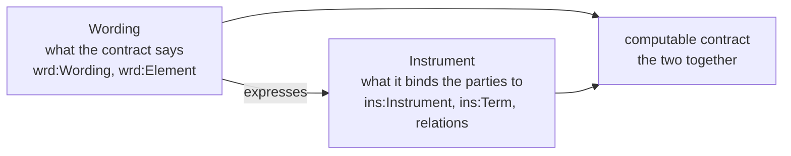

### 4.2 Classes

#### **`ins:Instrument`.** 

Has the same meaning as the legal sense above: one version of the legal instrument, expressed in one assembled wording. Distinct from *contract* (which would name the whole), *agreement* (one kind of instrument, and a deed or a licence is not always considered one), or *document*.

What makes a document an *instrument* is that it is **operative**: executing it changes the parties' legal positions. A lease grants a tenancy, a guarantee makes the guarantor answerable for another's debt, a licence permits what would otherwise be forbidden, a facility agreement commits lenders to lend.

An instrument changes over time, by amendment, variation, or restatement, and remains the same instrument. LATTICE models this longevity with Foundation's versioning capability: each `ins:Instrument` is one **version**, and every version of one instrument shares one `fnd:PersistentIdentity`. The persistent identity carries the instrument's keys, such as an agreement number (Foundation §8), and any runtime state, such as which regime it is in (ADR-A106). A version represents what was agreed at a point in time: it is expressed in exactly one assembled wording (law I1), and its bound terms belong to it.

`ins:Instrument` acts as an aggregate for the purposes of versioning. Terms and relations are treated as part of their owning clause or instrument version, and change only when it does (law I18). That constaint ensures there is only one answer to "what did the parties agree on 1 March": the instrument version in force on 1 March, its wording, and its bound terms.

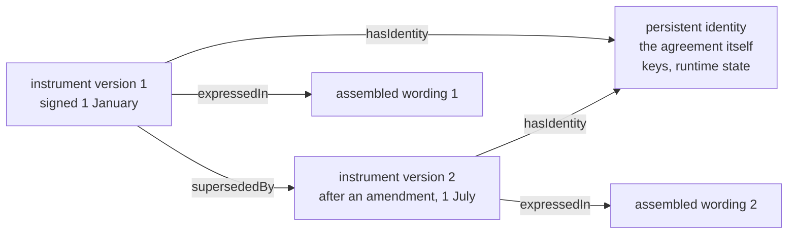

#### **`ins:Term`.**

In contract law a term is a provision the parties are bound by: "the terms of the agreement", "an implied term", "terms and conditions". A term may be *express*, stated in the words, or *implied*, by statute, custom or the course of dealing between the parties. "Term" has a second sense, of duration ("the term of the lease", "a five-year term"), which LATTICE handles with Foundation's `TemporalScope`. Note that `ins:Term` means only the provision and not the duration in time.

The following similar, but distinct terminology, is rejected in favour of `Term` for a number of reasons:

- **A Provision**, which means both a clause and what a clause provides, and was retired for that reason
- **A Clause**, which is a piece of text, and is Wording's element type
- **A Condition**, which in contracts has three senses: a heading ("General Conditions"), a class of term
  whose breach lets the other side terminate (a condition, as against a warranty), and a contingency
  ("subject to the following condition"). Contingencies are `elg:Condition`, and the class of a term
  is its classification (C7b). No `ins:` class is named Condition
- **A Norm** or **A Statement**, which are words of legal theory that a contract lawyer would not use for a
  provision

**Express and implied terms.** Most terms are *express*: the parties wrote them, and a clause states
each one. Some terms bind the parties although no clause states them. They are *implied*:

- **by statute**: many legal systems imply into a sale of goods a term that the goods are of
  satisfactory quality and fit for their purpose, whatever the contract says
- **by custom**: a usage so settled in a trade that the parties are taken to have agreed it
- **by the course of dealing**: terms the same parties have always used in their past contracts
- **in fact**: a term so obvious, or so necessary to make the contract work, that it goes without
  saying

An express term is a stated term, expressed in a clause. An implied term has no clause to express it, so it has no stated meaning. Its bound term names its source instead (`ins:impliedBy`). 

**A term is not a clause.** A clause is a piece of text. A term is what the parties are bound by.
They usually line up one to one, but not always:

- one clause may state several terms: "The Supplier shall deliver the goods by 1 March, and shall
  pack them for sea transport" is two provisions in one sentence
- one term may need several clauses to state it, when a definition, the main clause and a schedule
  together make one provision. Its stated term is then expressed in the element that contains
  them, such as their section (law I2 requires it to map to exactly one wording element version)

Since a term gives rise to relations, and in a well-modelled contract it is common for one term to give rise to more than one (§13.1, clause 8.1), it has been modelled as an independent node. The law treats a term as a unit, and several things attach to the whole provision rather than to any one relation under it:

| Attaches to the term | Meaning | Slice |
|---|---|---|
| its relations, definitions, deemings, and qualifiers | these determine what the provision creates | C6, C7b, C8 |
| classification | a *condition* (any breach lets the other side terminate), a *warranty* (breach gives damages only), or an *innominate* term (it depends on how serious the breach is) | C7b |
| survival | whether the provision outlives the termination of the instrument, as confidentiality clauses often do | C7b |
| sections it applies within | for an instrument divided into sections, which ones the provision governs | C7b |
| precedence | which provision prevails when two conflict | NRS N10 |

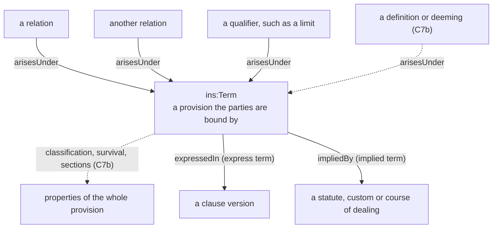

#### **`ins:Template`.**

Drafters reuse text, and the word *template* comes from that practice. Two kinds of clause matter here:

- a **standard clause** (also *model clause* or clause *template*) is drafted once, in general words,
  and included in many contracts. For example the form clause "The Borrower shall repay each loan to the
  Lenders", might appear in every facility that a lender signs
- a **bespoke clause** is drafted for one contract only: a clause negotiated for Acme's facility and
  no other, such as "The Borrower shall keep its head office in Leeds"

Both kinds have a meaning in their own words, and those words name roles and variables, never the
parties of a particular contract: "the Borrower", "the Lenders", "{margin}". LATTICE calls this the
clause's **stated meaning**, and each node of it a **template**: meaning fixed by the words, waiting
for the parties and values of a particular contract. When a contract includes the clause, its
template is instantiated with that contract's parties and values, which gives the contract's **bound
meaning** (§5.2).

A standard clause's template is instantiated for every contract that includes the clause. A bespoke
clause's template is instantiated for one contract only. It is still a template, so every clause
works the same way, whether it is used once or a thousand times: its meaning is stated once and
instantiated per contract.

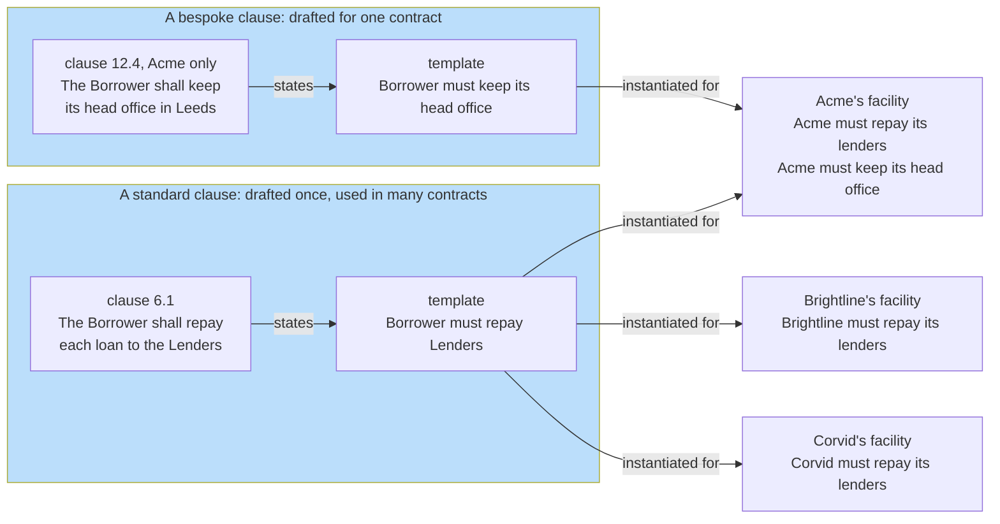

`ins:Template` is a mixin rather than a class of its own, because terms, relations and qualifiers
each have a stated form: a stated term is both an `ins:Term` and an `ins:Template`.

#### **`ins:LegalRelation`.**

In jurisprudence a *legal relation* (or *jural relation*) is a bond the law recognises between two persons concerning some conduct: one owes, the other can claim. The phrase is Hohfeld's (§4.4), and every relation in this layer has his shape: two ends and an act. The name is not to be confused with a "relation" in RDF and OWL terminology, which names a property axiom. Similar but distinct terms include:

- **A Right**, which Hohfeld showed covers four different things (a claim, a liberty, a power, and an
  immunity).
- **A Duty**, which names only one end of an obligation
- **A Rule** or **A Norm**, which suggest a general law rather than a bond between named parties

Whatever its kind, a legal relation in this layer will have the same parts:

- **two ends**: the party bound or exposed, and the party who benefits or acts. An obligation has an
  obligor and obligees, the other kinds, a holder and counterparties
- **an act**: what the relation is about, its `ins:activity`, such as repaying, enrolling or
  terminating
- **a scope**: the cases it applies to, as an Eligibility condition (`ins:scope`)
- **a term**: the provision it arises under, and belongs to (`ins:arisesUnder`)

A relation is always between parties. "The goods must be delivered" becomes an obligation of the supplier, owed to the buyer, to deliver.

**Choosing a kind:** Contract wording signals the kind of a relation by its verbs, but the test is what the provision does to the parties' positions:

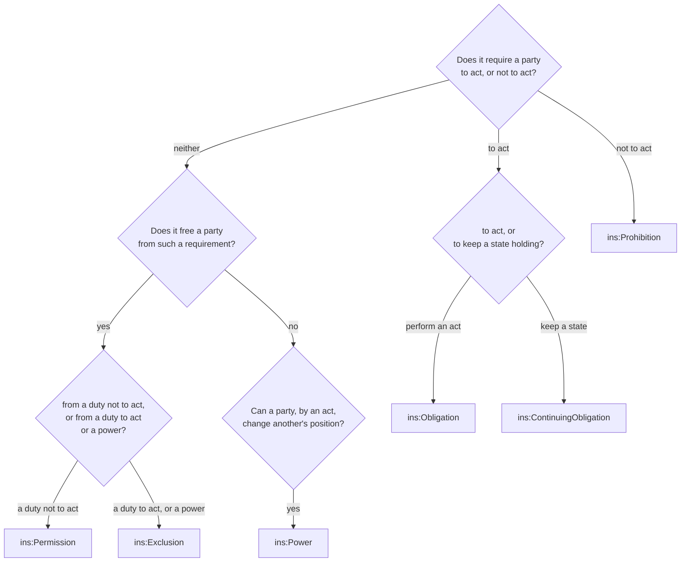

The four kinds are disjoint: nothing is both an obligation and a power. A clause that seems to be
both, such as "the Tenant may terminate by giving notice, and shall give notice in writing", is two
relations under one term: a power to terminate, and an obligation about the form of notice.

#### **`ins:Obligation`.**

From Roman law's *obligatio*, which Justinian's Institutes define as a bond of law (*vinculum iuris*) binding a person to perform something: the bond between the *obligor*, who owes, and the *obligee*, who is owed. It is what "shall" and "must" create in a contract. Once again we can contrast this with *Duty* (one end of the bond), and *Covenant* (a promise in a deed, and in finance a particular kind of undertaking).

An obligation is one bond with two ends. The *duty* is the obligor's end, and the *claim* is the
obligee's: the right to have the act performed, and to a remedy if it is not. They are not two
facts to keep in step, but one fact seen from two sides (§4.4).

**What an obligation states:**

- **who owes**: exactly one obligor. Where several parties owe together, the obligor is a
  participation group, and the group's composition rule says how they owe: each for its own share
  (several), or each for the whole (joint and several) (§4.2, `ins:RelationParty`)
- **to whom**: one or more obligees, who need not be parties to the instrument. A beneficiary named
  in a contract is an obligee who signed nothing (§6.1)
- **what**: the act owed, `ins:activity`: repay, deliver, report, repair
- **in which cases**: its scope, where it applies only to some
- **by when**: its due range, such as "within 30 days of each invoice" (C7b)
- **what counts as performance**: `ins:fulfilledWhen`, where performance is more than the act being
  done. Without it, performance is an act of the activity, for the case, by the obligor or someone
  the obligor delegated to (Party's `pty:Delegation`)

**Examples across domains:** the borrower shall repay each loan, the tenant shall pay rent
quarterly, the investigator shall report each serious adverse event within 24 hours, the
manufacturer shall repair a product that fails, the employer shall pay salary monthly.

An obligation of this kind is an *achievement* obligation in deontic logic: it is met by doing
something. Its counterpart, an obligation met by keeping something true, is the continuing
obligation below.

#### **`ins:ContinuingObligation`.**

English contract law speaks of a *continuing* obligation: one that must be kept for a period rather than performed once. "The Borrower shall ensure that leverage does not exceed 3.0 to 1", holds on every day the facility is in force.

Deontic logic, the logic of obligation and permission, draws the same line more sharply. It distinguishes two ways an obligation can be met.

- **An achievement obligation** requires that something be *brought about* at least once, usually by a deadline: "the Borrower shall repay the loan by 31 December". This is fulfilled the moment the act is done and asks nothing more thereafter. It is breached only when the deadline passes and the act has not happened.
- **A maintenance obligation** requires that something *hold throughout* a period: "the Borrower shall ensure that leverage does not exceed 3.0 to 1". It is never discharged by a single act. It is fulfilled only if the state holds at every moment of the period, and it is breached at any moment it does not. This is a common type of obligation in insurance contracts that define subjectivities, which are requirements set by an insurer that a policyholder must meet in order to activate or maintain coverage. 

The difference matters for a computable model, because the two are checked in opposite ways:

- **Breach of a maintenance obligation is a positive fact.** It is found by looking at the state at a point in time. If leverage was 3.4 on 30 June, the covenant was breached on 30 June. That is evidence a rule can read directly.
- **Breach of an achievement obligation is an absence.** It is found only by establishing that the act did *not* happen before the deadline. That needs a record of what happened and a closed view of it, which an open-world reasoner cannot assume. This is why later slices handle the two differently when deriving breach (C12, C13).
- **Their content differs.** An achievement obligation names an act and a time to do it by: `ins:activity`, and a due range from C7b. A maintenance obligation names a state to keep: `ins:maintains`, an Eligibility condition such as "leverage ≤ 3.0", tested against the case at each point.

The literature refines achievement obligations further:

- **Preemptive or not.** Can the act be done early, before the obligation arises, and still count? Paying an invoice before it is issued is the usual example.
- **Perdurant or not.** Does the obligation survive its own breach? A late payment is still owed after the due date has passed.

These distinctions belong to arising and due (C7b), and C6 does not model them yet.

So LATTICE maps the two kinds onto two classes:

- `ins:Obligation` is the achievement case: an act, owed, and later due.
- `ins:ContinuingObligation` is the maintenance case, with the state it keeps in `ins:maintains`.

Other continuing obligations across domains: the tenant shall keep the premises in good repair,
the licensee shall keep the source code confidential while it holds a copy, the supplier shall
maintain the certifications listed in the schedule, the employer shall maintain a safe place of
work.

#### **`ins:Prohibition`.**

What "shall not" and "must not" create: an obligation not to do something. In deontic logic F p, "p is forbidden", is defined as O ¬p, "not-p is obligatory", which is why `ins:Prohibition` is a kind of `ins:Obligation`. A market's *negative covenant* and *negative pledge* are examples of prohibitions.

In deontic logic a prohibition is a maintenance obligation, in negative form. "The Borrower shall not create any security" creates an obligation to keep *not creating security* true throughout the period the instrument remains in force. Unlike a covenant on a state, though, its breach is an act. Creating security on March 3rd breaches it on March 3rd, again a positive fact.

That is why `ins:Prohibition` is not an `ins:ContinuingObligation`, and the T-Box declares the two
disjoint. Both hold throughout a period, but they say different things:

| | `ins:ContinuingObligation` | `ins:Prohibition` |
|---|---|---|
| what it names | a **state** to keep: leverage at most 3.0 | an **act** not to do: create security |
| its content | `ins:maintains`, a condition | `ins:activity`, a concept, and usually a scope |
| what breaches it | the state failing to hold at a moment | the act being done |
| how it is excepted | an exclusion for some period or case | a permission for some cases |

**Scope makes a prohibition precise.** Few prohibitions forbid an act everywhere. "The Employee
shall not work for a competitor within 50 miles for six months after leaving" forbids working for a
competitor only within that scope: the act is `Work for competitor`, and the place and period are
its scope. Keeping the act plain and the circumstances in the scope lets a permission except part
of the same act (below).

**Examples across domains:** a negative pledge (shall not create security), a non-compete (shall not
work for a competitor), a confidentiality clause (shall not disclose confidential information), a
restriction on assignment (shall not assign this licence), a trial's eligibility rule (shall not
enrol a participant who fails the criteria).

#### **`ins:Permission`.**

A *permission* in the strong sense of deontic logic: a positive licence to do what a prohibition would otherwise forbid. Contracts write it as an exception: "Clause 8.1 does not apply to any lien arising by operation of law", "Permitted Security", "the Sponsor may waive". A permission always excepts a prohibition. Weak permission, the mere absence of a prohibition, needs no node and has none. *Liberty* and *Privilege*, Hohfeld's words, are not suitable here, since "privilege" has other legal senses (legal professional privilege).

The name is shared with the Eligibility decision value `elg:Permitted`, which is a different thing entirely, with both carrying a comment saying as much.

**Strong and weak permission.** deontic logic distinguishes two senses of "permitted":

- **weak permission**: an act is permitted because nothing forbids it. Nothing in a lease forbids
  the tenant from painting the walls, so painting them is permitted in the weak sense
- **strong permission**: an act is permitted because a provision says so, usually as an exception
  to something that would otherwise forbid it. "The Tenant shall not alter the premises, except
  that the Tenant may decorate the interior" gives a strong permission to decorate

Only strong permission is a node in this layer. Weak permission is the absence of a prohibition,
and an absence is not a fact an open-world model can record: there may be a prohibition the graph
does not hold. A strong permission is written in the wording, so it is a fact like any other.

**How a permission works.** A permission always excepts exactly one prohibition (`ins:excepts`),
and takes effect within its own scope. The act is forbidden where the prohibition's scope holds,
unless the permission's scope holds too:

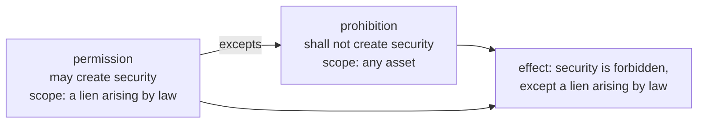

Law I8 ties a permission to the prohibition it excepts:

- its **holder** is the prohibition's **obligor**: only the party who is forbidden can be freed
- its **activity** is the prohibition's activity: it permits the same act, in fewer cases

A permission that broke either rule would free someone who was never bound, or permit an act that
was never forbidden. The shapes report both.

**Examples across domains:** permitted security under a negative pledge, a sponsor's written waiver
of an eligibility criterion, consent to assign a licence, a landlord's permission to sublet part of
the premises.

#### **`ins:Exclusion`.**

An *exclusion clause* or *exemption clause*: "the Manufacturer shall not be liable for", "Clause 2.1 does not apply to damage caused by misuse", "is not obliged to". It frees its holder from an obligation within its scope, or protects its holder from a power: "the Licensor may not end the licence once the perpetual fee is paid", which is an *immunity*. Distinct from *Exemption* (also a tax and regulatory word), *Immunity* (only the second kind), *Waiver* (an act of giving up a right, not a term).

An exclusion has two forms, according to what it excepts:

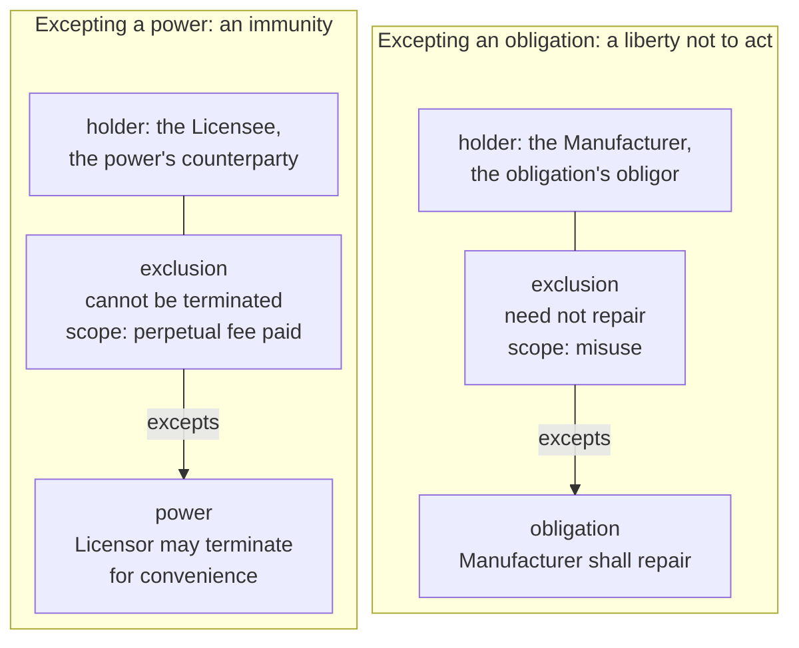

- **Excepting an obligation**, the exclusion is a *liberty not to act*: within its scope the obligor
  need not perform. Its holder is the obligation's obligor, the party who would otherwise be bound
  (law I8). A product warranty that does not cover misuse, a supplier who need not deliver on public
  holidays, an employee who need not work on rest days.
- **Excepting a power**, the exclusion is an *immunity*: within its scope the power cannot be
  exercised against its holder. Its holder is the power's counterparty, the party who would
  otherwise be exposed (law I8). A perpetual licence that cannot be ended for convenience, a lease
  that the landlord cannot end early while the rent is paid.

**Why Exclusion and Permission are separate classes.** Both are Hohfeldian privileges, and both are
exceptions. They differ in the direction of the duty they free from: a permission frees from a duty
*not* to act, so its holder *may* act. An exclusion frees from a duty *to* act, so its holder *need
not* act, or from exposure to a power, so its holder *cannot be made* subject to it. Contract
English uses different words for them ("may", "need not", "shall not be liable"), and a reader of
the data should see the same distinction.

**Carve-backs.** Exclusions are often narrowed by a carve-back: "Clause 2.1 does not apply to damage
caused by misuse, unless the failure was caused by a manufacturing defect". The carve-back belongs
in the exclusion's scope, as a negated member of the scope's condition (§9, §13.3), not as a second
relation.

#### **`ins:Power`.**

Hohfeld's *power*: the ability, by one's own act, to change someone else's legal position. Contracts write it as "may" with an effect: "the Lenders may by notice declare all loans due", "may terminate", "may accept". "May" is a permission if it only frees the holder, and a power if it changes someone else's relations. Distinct from *Right* ("right to terminate" is a power, but "right" covers four things), *Option* (one kind of power), *Authority* (an agent's power, which an applied ontology may specialise from `ins:Power`).

**Power and permission, side by side.** "The Tenant may decorate the interior" and "the Tenant may
terminate the lease on six months' notice" both say "may", but they do different things. After the
tenant decorates, nobody's rights have changed: the act was simply allowed. After the tenant gives
notice, the lease ends in six months, and with it the tenant's duty to pay rent and the landlord's
duty to give possession. The first is a permission. The second is a power, because exercising it
has a legal effect on someone else.

**What exercising a power does.** The act that exercises a power is its `ins:activity`. Its effect is
on the counterparty's legal position, in one of three ways:

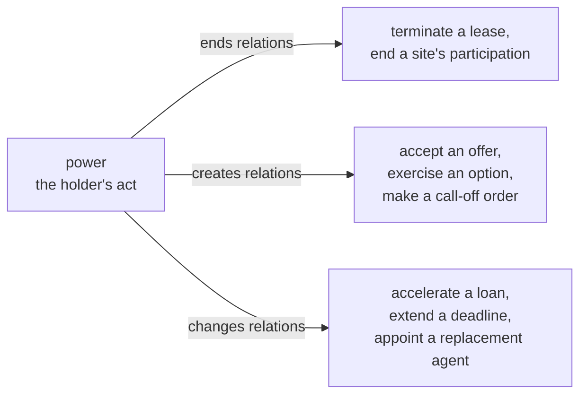

The effects themselves are modelled by later slices: legal triggers and regimes say which relations
a power's exercise ends or starts (C7a), and an instrument made by exercising a power, such as an
order under a framework agreement, records the power it was made under (C9).

**When a power can be exercised.** A power is often limited: to its scope, to a regime ("only while
an event of default is continuing", C7a), or by a consent rule where a group holds it ("by lenders
holding two thirds of the commitments", C9). The counterparty's end of a power is Hohfeld's
*liability*, a word this layer never uses (§4.6). An exclusion of the power gives the counterparty
an *immunity* (above).

#### **`ins:Qualifier`.**

A limit, level, retention, or any other thing that qualifies a term or a relation: it says how much, not what.

A qualifier never creates a relation of its own. It bounds one that already exists:

- a cap: "the Licensor's aggregate liability under this agreement shall not exceed the fees paid in
  the previous twelve months" qualifies the licensor's obligations to pay damages
- a minimum: "the Buyer shall order at least 1,000 units in each quarter" qualifies the obligation
  to order
- a threshold: a covenant that bites only above a certain level of borrowing
- a level of performance: "with an availability of at least 99.9% in each month"

A qualifier arises under exactly one term, like a relation, and qualifies exactly one term or
relation (`ins:qualifies`). It is its own node because amounts are rarely just numbers: they have a
unit and currency, a period they reset over, and a basis, such as per claim or in the aggregate.
That structure is defined with contract amounts (C8), and C6 declares only the class and its links.

#### **`ins:RelationParty`.**

A *party* is an entity (e.g., person or organisation) bound by or benefiting from an instrument. This union of types, names what may stand at the end of a relation: a role occupancy (a party filling a role for a period, Party layer), a participation group (several parties acting together), or, in stated meaning only, a role. "Party" alone would read as a person, and sit beside the property `ins:party` (C6-Q4).

The three members come from the Party layer, and each answers a different question:

| Member | Answers | Example |
|---|---|---|
| `pty:Role` | which capacity? | the Borrower, the Licensee, the Sponsor |
| `pty:RoleOccupancy` | who fills it, from when? | Acme Holdings plc as Borrower, from 1 January |
| `pty:ParticipationGroup` | which several parties, acting how? | the lenders, each for its own share |

A **role** is a capacity, independent of who fills it. Stated meaning names roles, because a
clause's words do: "the Borrower" means whoever is the borrower under each contract the clause is
used in (law I13). A **role occupancy** is one party filling one role, for a period. Bound meaning
names occupancies, because a contract's parties are particular entities. An occupancy may exist
before anyone fills it, a *contingent* occupancy, for a party that depends on the case (§8).

A **participation group** is several occupancies standing at one end of a relation together, with a
composition rule that says how they stand there:

- **several**: each is owed, or owes, only its own share. Two lenders lending 60% and 40% are each
  owed repayment of their own part only
- **joint and several**: each is liable for the whole, and the creditor may pursue any one of them.
  Two tenants who sign one lease are often jointly and severally liable for the whole rent

**Party to the instrument, and party to a relation.** These differ. `ins:party` lists who is party to
the instrument: who signed it. The ends of a relation name whoever the relation binds or benefits,
who may include persons who signed nothing: a beneficiary for whose benefit a promise was made, or
a regulator given a power of inspection. That is why `ins:party` is authored, and never derived from
the relations' parties (§6.1).

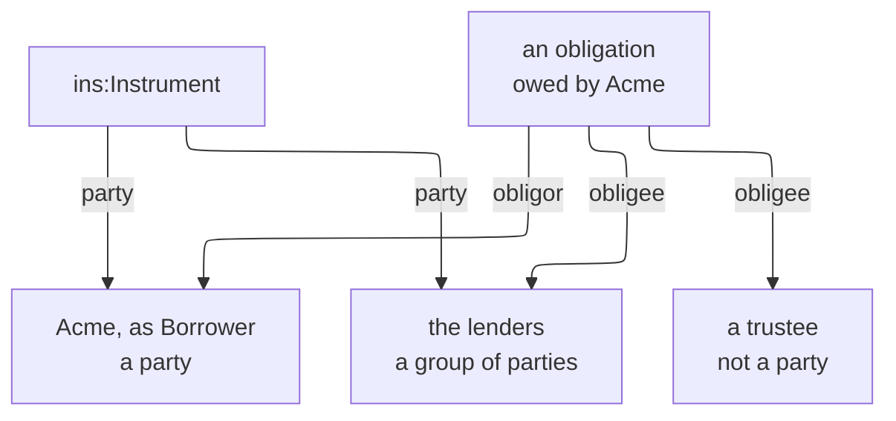

### 4.3 Properties

The properties fall into four groups: those that tie meaning to text and to its owner, those that
name a relation's parties, those that state a relation's content, and a party's details for one
instrument.

#### Text and ownership: `ins:expressedIn`, `ins:alsoExpressedIn`, `ins:boundIn`, `ins:boundFrom`, `ins:impliedBy`, `ins:arisesUnder`

These six properties are how every computable node reaches the words that create it (§5.1).

- **`ins:expressedIn`** comes from the law's *express* terms, terms the words state: "the terms
  expressed in this agreement". A stated term is expressed in exactly one clause version, which owns
  it. An instrument version is expressed in exactly one assembled wording, the text its parties
  signed. One property serves both, because both say "these are the words that state this".
- **`ins:alsoExpressedIn`** carries the same stated term into a second element: the French text of a
  bilingual agreement, or a consolidated copy that restates amended clauses. The term still has one
  owner, its `ins:expressedIn`. A deployment that never does this can load the optional
  `single-expression.ttl` to refuse it (ADR-A96).
- **`ins:boundIn`** and **`ins:boundFrom`** borrow computing's *bound variable*. A template's roles and
  variables are free, waiting for values. Instantiating it for one contract binds them to that
  contract's parties and values. The result is bound meaning: each bound term is part of exactly one
  instrument version (`ins:boundIn`), and each bound node points at the stated node it was
  instantiated from (`ins:boundFrom`), so its derivation is always traceable. `ins:boundFrom` is a
  sub-property of PROV's `prov:wasDerivedFrom`, the W3C provenance vocabulary's word for exactly
  this. The phrase also echoes the law's "the parties are bound by its terms".
- **`ins:impliedBy`** takes the place of `ins:boundFrom` for an implied term (§4.2, `ins:Term`): a
  term no clause states has no template to be instantiated from, so it names the statute, custom or
  course of dealing that implies it.
- **`ins:arisesUnder`** is contract English: "any obligation arising under this agreement", "any
  dispute arising under this licence". A relation, definition, deeming or qualifier arises under the
  term that creates it, and belongs to it. Only the term carries `ins:expressedIn` or `ins:boundIn`,
  so a relation reaches its clause or its instrument through its term, never directly.

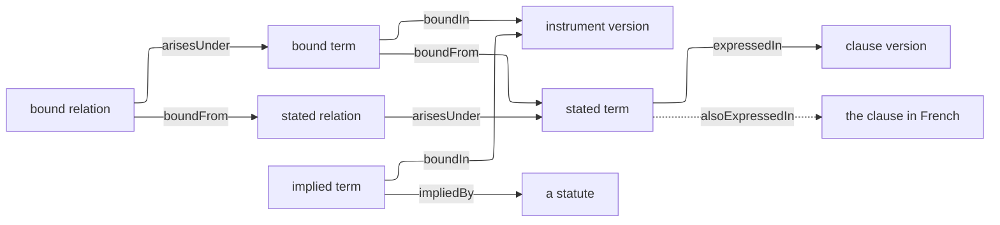

#### A relation's parties: `ins:party`, `ins:obligor`, `ins:obligee`, `ins:holder`, `ins:counterparty`

- **`ins:party`** is "the parties to this agreement": who is party to the instrument, as authored.
  It is not the same as who stands at the ends of the relations (§4.2, `ins:RelationParty`).
- **`ins:obligor`** and **`ins:obligee`** are civil law's names for the two ends of an *obligatio*:
  the one who owes and the one owed. They are used for every obligation, continuing obligation and
  prohibition.
- **`ins:holder`** and **`ins:counterparty`** name the two ends of the other three kinds. *Holder* is
  how the law speaks of a power or a right: "the holder of the power", "the holder of the option".
  *Counterparty* is finance's word for the other side of an arrangement. Hohfeld named the far end
  of each kind (no-right, liability, disability), but those words are never used: "liability" in
  particular has settled senses of its own, such as a liability to pay.

| Kind | The bound or freed end | The other end |
|---|---|---|
| `ins:Obligation`, `ins:ContinuingObligation`, `ins:Prohibition` | `ins:obligor` (exactly one), who owes | `ins:obligee` (at least one), who is owed |
| `ins:Permission` | `ins:holder` (exactly one), who may act | `ins:counterparty`, who cannot object |
| `ins:Exclusion` | `ins:holder` (exactly one), who need not act or is immune | `ins:counterparty`, who cannot demand or cannot exercise the power |
| `ins:Power` | `ins:holder` (exactly one), who can act | `ins:counterparty`, whose position the act changes |

#### A relation's content: `ins:activity`, `ins:scope`, `ins:maintains`, `ins:fulfilledWhen`, `ins:excepts`, `ins:qualifies`

- **`ins:activity`** is deontic logic's *action*: the act a relation is about. It names the act
  plainly, without its circumstances: `Repay`, `Enrol`, `Terminate`. An activity is a concept from a
  scheme bound to `ins-voc:ActivityContract`, so a deployment can use its own list of acts (§10).
- **`ins:scope`** is "the scope of the exclusion", "within the scope of this clause": the cases a
  relation applies to. It is an Eligibility condition, so the same machinery that decides whether
  a case is admissible decides whether a relation applies to it. Keeping circumstances in the scope
  rather than the activity is what lets a permission except part of a prohibition: both have the
  activity `Enrol`, and their scopes say where enrolment is forbidden and where it is allowed.
- **`ins:maintains`** is deontic logic's *maintenance* obligation (§4.2,
  `ins:ContinuingObligation`): the state a continuing obligation keeps holding, as a condition.
- **`ins:fulfilledWhen`** is the *fulfilment* or *performance* of an obligation: the test that says
  it was performed. It is needed only when performance is more than the act being done, such as a
  report that must be accepted, not merely sent.
- **`ins:excepts`** comes from "except", "save that", "does not apply to": an *exception* names what
  it takes effect against. A permission excepts a prohibition, and an exclusion an obligation or a
  power.
- **`ins:qualifies`** links a qualifier to the term or relation whose amount it bounds.

#### A party's details for one instrument: `ins:noticeAddress`, `ins:operatesAt`

Instruments state where each party takes notices and where it operates, and these are details of
the party *for this instrument*, so they sit on the role occupancy rather than on the party itself
(S97). The same company may give one notice address in its lease and another in its loan.

- **`ins:noticeAddress`** comes from the notices clause: "notices shall be given at the address set
  out above". It is the address as written, a string. It never identifies the party, whose identity
  is its keys (Foundation §8).
- **`ins:operatesAt`** is "operates at", "carries on business at": a place the party operates at
  under this instrument, as a concept from the deployment's own territory or site scheme, bound to
  `ins-voc:LocationContract`.

#### At a glance

| Property | Origin | Why this name |
|---|---|---|
| `ins:expressedIn`, `ins:alsoExpressedIn` | "the terms expressed in this agreement", *express* terms: terms the words state | a term is expressed in its clause, and an instrument in its wording. "Also" carries the same term in another language or a consolidated text |
| `ins:boundIn`, `ins:boundFrom` | from computing's *bound variable*: a template's roles and variables are bound to particular parties and values. Also echoes "the parties are bound by its terms" | bound meaning is the template's meaning with its roles and variables bound. "Bound" is also a term of art in some domains, so it is always written "bound meaning" or "bound term", never alone |
| `ins:impliedBy` | *implied terms*: terms implied by statute, custom or the course of dealing, which no clause states | names the source that implies the term in place of a clause |
| `ins:arisesUnder` | "obligations arising under this agreement", "any dispute arising under this licence" | a relation arises under the term that gives rise to it, and belongs to it |
| `ins:party` | "the parties to this agreement" | lists who is party to the instrument, as authored. A beneficiary named in a relation may be no party |
| `ins:obligor`, `ins:obligee` | civil law's *obligor* and *obligee*, the two ends of an *obligatio* | standard legal terms, and unambiguous where "debtor" and "creditor" suggest money |
| `ins:holder`, `ins:counterparty` | "the holder of the power", "the holder of the right", and finance's *counterparty*, the other side of an arrangement | the two ends of a permission, exclusion or power. Hohfeld's names for the far end (no-right, liability, disability) are never used: "liability" has settled senses of its own, such as a liability to pay |
| `ins:activity` | deontic logic's *action*: what a party does | the act a relation is about, named plainly (repay, terminate), never with its circumstances |
| `ins:scope` | "the scope of the exclusion", "within the scope of this clause" | the cases a relation applies to, as an Eligibility condition |
| `ins:maintains` | deontic logic's *maintenance* obligation | the state a continuing obligation keeps holding |
| `ins:fulfilledWhen` | *fulfilment* or *performance* of an obligation | the test of performance |
| `ins:excepts` | "except", "save that", "does not apply to": an *exception* | what an exception takes effect against |
| `ins:qualifies` | a qualifier qualifies | what a limit or level applies to |
| `ins:noticeAddress` | the *notices* clause: "notices shall be given at the address set out" | a party's address for notices under this instrument |
| `ins:operatesAt` | "operates at", "carries on business at" | a place a party operates at under this instrument |

### 4.4 Hohfeld's legal relations

Wesley Newcomb Hohfeld, an American legal theorist, showed that the word "right" in judges' reasoning covered four different things, and that confusing them produced bad decisions. He proposed eight fundamental conceptions, arranged as four pairs of **correlatives**: the two ends of one relation between two people. Whenever one person has the first, the other has the second.

| One party has | The other party has | Means | In this layer |
|---|---|---|---|
| a **claim** (right) | a **duty** | B must do X for A | `ins:Obligation`: obligee and obligor |
| a **privilege** (liberty) | a **no-right** | A may do X, and B cannot demand otherwise | `ins:Permission` (A may act despite a duty not to), `ins:Exclusion` of an obligation (A need not act despite a duty to) |
| a **power** | a **liability** | A can, by an act, change B's legal position | `ins:Power`: holder and counterparty |
| an **immunity** | a **disability** | B cannot change A's legal position | `ins:Exclusion` excepting a `ins:Power` |

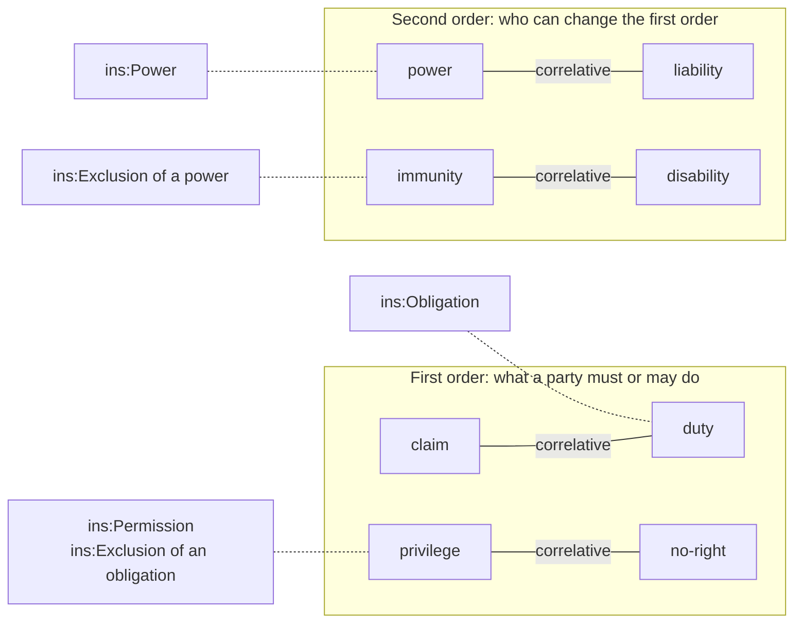

Why this matters for a computable model:

- **Correlatives are one node.** A duty and its claim are the two ends of one `ins:Obligation`, the
  obligor's end and the obligee's. Nothing has to keep a duty and a claim consistent, because they
  are the same fact seen from two sides.
- **No word is overloaded.** "Right to be paid" is the obligee's end of an obligation, "right to
  terminate" is a power, "right to use" is a permission. Each lands on its own class.
- **Privileges are exceptions.** Hohfeld defines a privilege as the absence of a duty to the
  contrary. Contracts create one by excepting a duty, which is exactly what `ins:excepts` records: a
  permission excepts a prohibition, an exclusion excepts an obligation or a power.
- **First and second order.** Claims, duties and privileges say what parties must and may do now.
  Powers and immunities say who can change that: a power to terminate ends obligations, a power of
  acceptance creates them. Behaviour's regimes and Instrument's legal triggers (C7a) carry the
  changes.

Contract English names the privileges differently depending on the duty they are against, so the
T-Box does too: a privilege against a duty not to act is a **permission**, a privilege against a
duty to act is an **exclusion**, and an immunity, a privilege against a power, is also an
**exclusion**.

The same classes meet **deontic logic**, the logic of obligation and permission: O ("obligatory")
is `ins:Obligation`, F ("forbidden", O ¬) is `ins:Prohibition`, and P ("permitted") is
`ins:Permission`, in its strong sense, as an exception.

### 4.5 One modal verb per class

Each class can be read with one modal verb, so a sentence rendered from data can be consistently made:

| Class | Reads as |
|---|---|
| `ins:Obligation` | *the obligor **must** {activity} for the obligee* |
| `ins:ContinuingObligation` | *the obligor **must ensure** that {state} holds* |
| `ins:Prohibition` | *the obligor **must not** {activity}* |
| `ins:Permission` | *the holder **may** {activity}, despite {the prohibition}* |
| `ins:Exclusion` | *the holder **need not** {the obligation's activity}*, or *{the power} **cannot be exercised** against the holder* |
| `ins:Power` | *the holder **may** {activity}, which changes the counterparty's position* |

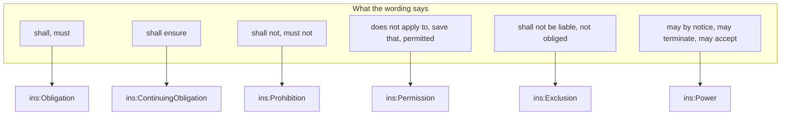

### 4.6 Words this layer does not use

| Word | Why not |
|---|---|
| Right | covers four Hohfeldian things. Each has its own class |
| Duty, Claim | one end of an obligation each |
| Liability | has settled senses of its own, such as a liability to pay, so a reader would misread it. The far end of a power is `ins:counterparty` |
| Condition | three senses in contracts (§4.2) |
| Provision | both a clause and what it provides |
| Clause, Section, Schedule | parts of a document, so Wording's element types |
| Contract | the whole of wording and instrument |
| Norm, Statement | legal theory, not contract English |
| Lifecycle | not used in the T-Box (CC-D8). Regimes are named for what they are (C7a) |
| Basis | reserved for the unit an amount applies on (contract amounts) |
| Binder | a term of art in some domains, with a meaning of its own. What turns stated meaning into bound meaning is **instantiation** |

## 5. Model Overview

### 5.1 The words are the contract

A contract's legal force comes from its words. A court reads the wording the parties signed, not a
database. A computable contract therefore keeps two things side by side, and never lets them drift
apart:

- **the wording**, held exactly as written by the Wording layer: every clause, each in its own
  version, assembled for each instrument with the values its particulars supply
- **the meaning**, held by this layer: the terms the clauses give rise to, and the legal relations
  under them, as data a machine can check and, in later slices, evaluate

The connection between the two is the point of the whole substrate. Every computable node in this
layer is tied back to the words that create it:

- a **stated term** is part of exactly one clause version (`ins:expressedIn`). The meaning is the
  clause's, and it cannot change unless the clause does, since a changed clause is a new clause
  version with new stated meaning
- an **instrument** is expressed in exactly one assembled wording (`ins:expressedIn`, law I1): the
  exact text this instrument's parties agreed
- a **bound term** is part of exactly one instrument version (`ins:boundIn`), instantiated from the
  stated term of a clause that instrument's wording includes (`ins:boundFrom`)
- a **relation** belongs to its term (`ins:arisesUnder`), and through it to the clause or the
  instrument

So from any relation the evaluator acts on, there is one path back to the words: relation, bound
term, stated term, clause version, the text itself. Nothing in this layer has legal effect of its
own. If the data and the words ever disagree, the words win, and the data is wrong. A term no clause
states, a term *implied* by law, names the statute, custom or course of dealing that implies it
(`ins:impliedBy`) in place of a clause.

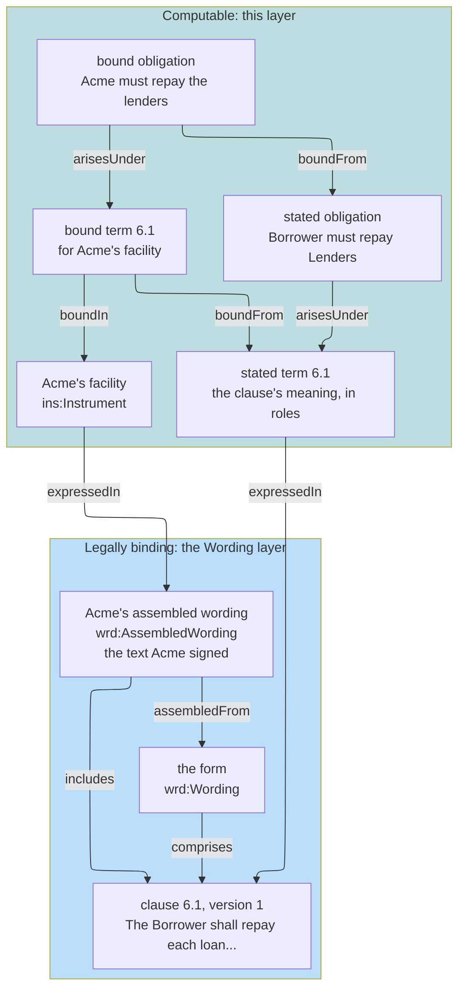

### 5.2 From words to data

Meaning is written once per clause, and instantiated once per instrument. A lender's form holds
clauses used in every facility it signs. Each clause's stated meaning names the form's roles: "the
Borrower", "the Lenders". When Acme signs a facility on the form, instantiation takes the stated
meaning of each clause Acme's wording includes, the values Acme's particulars supply, and Acme's
parties, and produces the bound meaning of Acme's facility: Acme Holdings plc must repay North Bank
and South Bank. Bound meaning is a derived artefact (ADR-A92): it can be rebuilt from its three
inputs at any time, and is never the source of truth.

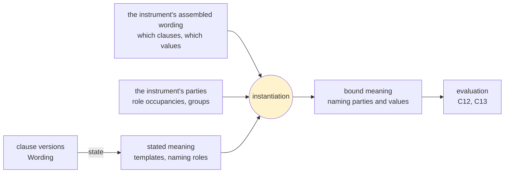

### 5.3 Tracing a decision back to the words

When the evaluator later reports that Acme is in breach of its leverage covenant, the finding must
point at the clause that makes it so. The path is always the same, and always one step at a time:

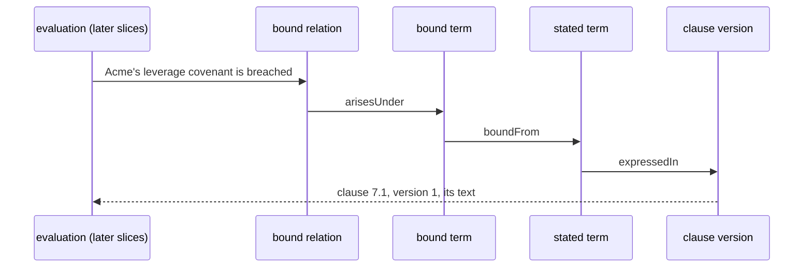

### 5.4 When the words change

Meaning never changes on its own (law I18). New words are a new clause version, which states new
meaning. An instrument reaches new words only through a new assembled wording, and so a new
instrument version, made by an amendment (C9), whose bound meaning is instantiated afresh. The old
version, its wording and its bound meaning stay as they were, so what was agreed at any time can
always be read.

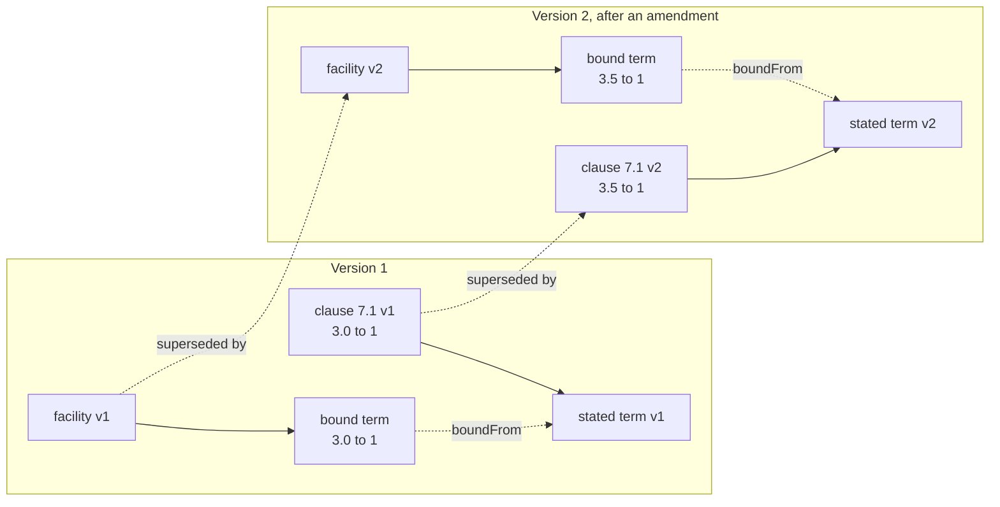

A correction, fixing how a clause was read with no change to its words, regenerates the clause's
stated meaning and is not an amendment (law I18).

### 5.5 The model in one picture

The whole layer, with the law each link enforces:

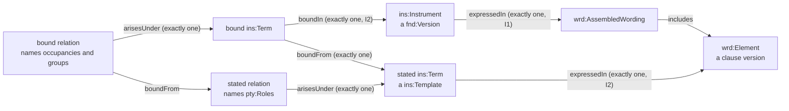

Every relation arises under exactly one term, and belongs to it. A stated term belongs to the
element version of the wording that expresses it. A bound term belongs to the instrument version
that binds it, and is bound from the stated term it instantiates (§6). An exception names what it
excepts.

### 5.6 The relation classes

The four kinds of legal relation, and the two kinds of obligation (§7):

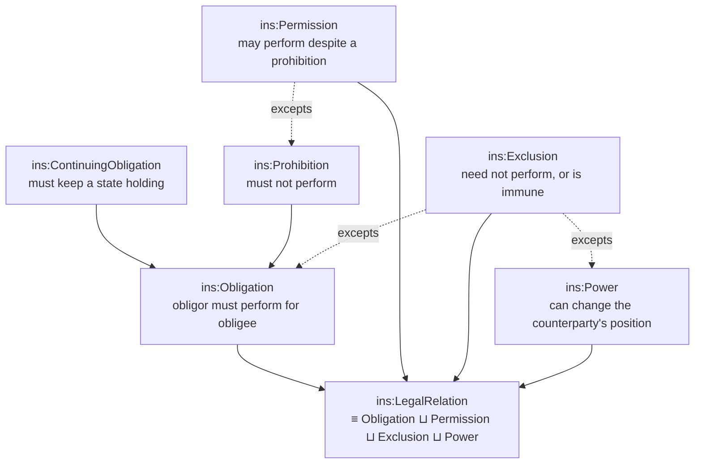

## 6. Instrument and Term

### 6.1 Instrument

An instrument is the legal instrument itself: a contract, policy, agreement, deed, licence or
protocol. It is the only version in this layer. Its persistent identity carries its keys, such as
an agreement number (Foundation §8), and its runtime state (ADR-A106).

`ins:party` lists the parties to the instrument as authored: who signs it. It is not derived from
the relations' parties, because a relation may name a beneficiary or a regulator who is no party
(CC-Q4), and each party executes separately (S90, C9).

```turtle-spec
ins:Instrument a owl:Class ;
	rdfs:subClassOf fnd:Version ;
	rdfs:comment "A legal instrument: a contract, policy, agreement, deed, licence or protocol. The only version in this layer." ;
	fnd:utility "Subject: one version of an instrument. Expressed in exactly one assembled wording (ins:expressedIn, law I1). Its persistent identity carries its keys and its runtime state. Its terms are bound in it (ins:boundIn)." .

ins:party a owl:ObjectProperty ;
	rdfs:domain ins:Instrument ;
	rdfs:range ins:RelationParty ;
	rdfs:comment "A party to an instrument version." ;
	fnd:utility "Subject: an instrument version. Value: a role occupancy or participation group party to it, as authored. Never derived from the relations' parties: a beneficiary or regulator named in a relation may be no party." .

ins:expressedIn a owl:ObjectProperty ;
	rdfs:comment "The text that states an instrument version or a stated term." ;
	fnd:utility "Subject: an instrument version, or a stated term. Value: for an instrument, exactly one wrd:AssembledWording (law I1). For a stated term, exactly one wrd:Element version, its owner (law I2). The shapes check each case." .
```

### 6.2 Terms in two tiers

A term is a provision the parties are bound by. It exists apart from its relations because:

- one provision may give rise to several relations: "shall not create security, except a lien
  arising by operation of law" is a prohibition and the permission excepting it (the facility
  example, clause 8.1)
- what belongs to the whole provision attaches to the term: its classification and survival, the
  sections it applies within, and definitions and deemings, which arise under terms without being
  relations (C7b), and qualifiers such as limits (C8)
- terms implied by law (`ins:impliedBy`) and incorporated terms (C9) work at the level of the
  provision
- the term is the unit that is owned and bound: one stated term per element version, one bound
  term per instrument version

Every clause's meaning exists in two tiers, each with exactly one owner (CC-D12, ADR-A104
decision 2):

| Tier | Says | Names | Owner |
|---|---|---|---|
| **stated meaning** (`ins:Template`) | what the clause says in its own words: "the Borrower shall repay" | `pty:Role`s, defined words, variables | exactly one element version (`ins:expressedIn`) |
| **bound meaning** | what it says for one instrument: Acme owes the lenders | role occupancies, groups, values | exactly one instrument version (`ins:boundIn`) |

A relation belongs to its term (`ins:arisesUnder`), and through it to the term's owner. Only terms
carry `ins:expressedIn` or `ins:boundIn`.

Bound meaning is what **instantiation** produces from stated meaning, the wording's variable values
and the instance's parties (a derived artefact, ADR-A92). A bound relation restates its template in
full. RDF has no override: a bound relation that stated only what differs would leave both the
template's role and the occupancy as its parties. Only bound meaning is evaluated (law I13).

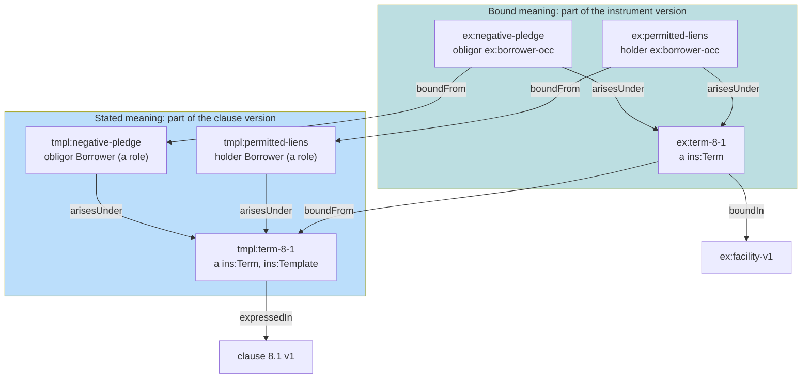

```turtle-spec
ins:Term a owl:Class ;
	rdfs:comment "A provision the parties are bound by." ;
	fnd:utility "Subject: a term, stated or bound. Not a version: it is part of its owner and changes only with it. A stated term (an ins:Template) is expressed in exactly one element version. A bound term is bound in exactly one instrument version, from exactly one stated term or implied by a source (law I2). Relations and qualifiers arise under it." .

ins:Template a owl:Class ;
	rdfs:comment "Stated meaning: a term, relation or qualifier as its clause states it." ;
	fnd:utility "A mixin on ins:Term, ins:LegalRelation and ins:Qualifier. A template names pty:Roles, defined words and variables, never occupancies or values (law I13), and is never evaluated. Its term is expressed in exactly one element version." .

ins:alsoExpressedIn a owl:ObjectProperty ;
	rdfs:domain ins:Term ;
	rdfs:range wrd:Element ;
	rdfs:comment "Another element that states the same stated term." ;
	fnd:utility "Subject: a stated term. Value: an element version stating it again, in another language or a consolidated text (ADR-A96). Its owner stays its one ins:expressedIn. The optional shapes/single-expression.ttl refuses it where every term is expressed once." .

ins:boundIn a owl:ObjectProperty, owl:FunctionalProperty ;
	rdfs:domain ins:Term ;
	rdfs:range ins:Instrument ;
	rdfs:comment "The instrument version a bound term is part of." ;
	fnd:utility "Subject: a bound term. Value: the one instrument version that owns it (law I2). Relations carry none: they belong to their term." .

ins:boundFrom a owl:ObjectProperty, owl:FunctionalProperty ;
	rdfs:subPropertyOf prov:wasDerivedFrom ;
	rdfs:comment "The stated node a bound node was instantiated from." ;
	fnd:utility "Subject: a bound term, relation or qualifier. Value: the one stated node of the same kind it was instantiated from. A bound node has this or ins:impliedBy, never both." .

ins:impliedBy a owl:ObjectProperty ;
	rdfs:comment "The source that implies a term no clause states." ;
	fnd:utility "Subject: a bound term or relation implied by law. Value: the statute, custom or course of dealing that implies it, in place of ins:boundFrom." .
```

## 7. Legal Relations

Five classes, each arising under exactly one term ([ADR-A104](../../docs/architecture/decisions/ADR-A104-instrument-terms-and-legal-relations.md)
decision 3). Permission and Exclusion are both Hohfeldian privileges: a liberty to act despite a
duty not to, and a liberty not to act despite a duty to, or an immunity against a power. Contract
English names them differently, and so does the T-Box.

| Class | Reads as | Parties | Required content |
|---|---|---|---|
| `ins:Obligation` | the obligor must perform the activity for the obligees | one `ins:obligor`, `ins:obligee`s | `ins:activity` |
| `ins:ContinuingObligation` | the obligor must keep a state holding | same | `ins:maintains` |
| `ins:Prohibition` | the obligor must not perform the activity within the scope | same | `ins:activity` |
| `ins:Permission` | the holder may perform the activity despite a prohibition | one `ins:holder`, `ins:counterparty`s | `ins:activity`, `ins:excepts` a prohibition |
| `ins:Exclusion` | the holder need not perform an obligation, or is immune from a power, within the scope | same | `ins:excepts` an obligation or a power |
| `ins:Power` | the holder can, by an act, change the counterparty's legal position | same | `ins:activity` |

```turtle-spec
ins:LegalRelation a owl:Class ;
	owl:equivalentClass [ a owl:Class ; owl:unionOf ( ins:Obligation ins:Permission ins:Exclusion ins:Power ) ] ;
	rdfs:comment "A legal relation between parties: an obligation, permission, exclusion or power." ;
	fnd:utility "Subject: a relation, stated or bound. Arises under exactly one term (ins:arisesUnder) and belongs to it. Never a version." .

ins:Obligation a owl:Class ;
	rdfs:subClassOf ins:LegalRelation ;
	rdfs:comment "The obligor must perform an activity for the obligees." ;
	fnd:utility "Subject: an obligation. Exactly one ins:obligor, at least one ins:obligee, and an ins:activity unless continuing." .

ins:ContinuingObligation a owl:Class ;
	rdfs:subClassOf ins:Obligation ;
	rdfs:comment "The obligor must ensure a state holds throughout." ;
	fnd:utility "Subject: a continuing obligation, such as a financial covenant. States the state it keeps with ins:maintains." .

ins:Prohibition a owl:Class ;
	rdfs:subClassOf ins:Obligation ;
	rdfs:comment "The obligor must not perform an activity within the scope." ;
	fnd:utility "Subject: a prohibition, such as a negative pledge. A permission may except it." .

ins:Permission a owl:Class ;
	rdfs:subClassOf ins:LegalRelation ;
	rdfs:comment "The holder may perform an activity despite a prohibition." ;
	fnd:utility "Subject: a permission. Excepts exactly one prohibition, whose obligor is its holder, with the same activity (law I8). A licence to act with nothing forbidding it is no relation in this layer." .

ins:Exclusion a owl:Class ;
	rdfs:subClassOf ins:LegalRelation ;
	rdfs:comment "The holder need not perform an obligation, or cannot be made subject to a power, within the scope." ;
	fnd:utility "Subject: an exclusion. Excepts exactly one obligation, whose obligor is its holder, or one power, whose counterparty is its holder (law I8). An exclusion of a power is an immunity." .

ins:Power a owl:Class ;
	rdfs:subClassOf ins:LegalRelation ;
	rdfs:comment "The holder can, by an act, change the counterparty's legal position." ;
	fnd:utility "Subject: a power, such as acceleration or termination. Its activity is the act that exercises it." .

[] a owl:AllDisjointClasses ;
	owl:members ( ins:Obligation ins:Permission ins:Exclusion ins:Power ) .

ins:ContinuingObligation owl:disjointWith ins:Prohibition .

ins:arisesUnder a owl:ObjectProperty, owl:FunctionalProperty ;
	rdfs:range ins:Term ;
	rdfs:comment "The term a relation or qualifier arises under, and belongs to." ;
	fnd:utility "Subject: a relation or qualifier. Value: its one term. A stated relation arises under a stated term, a bound relation under a bound term." .

ins:excepts a owl:ObjectProperty, owl:FunctionalProperty ;
	rdfs:range ins:LegalRelation ;
	rdfs:comment "The relation an exception takes effect against." ;
	fnd:utility "Subject: a permission or an exclusion. Value: for a permission, the prohibition it excepts. For an exclusion, the obligation or power it excepts. Bound exceptions except bound relations." .
```

## 8. Parties

The four party properties range over one union, named once ([C6-Q4](../../docs/developer/plans/computable-contract-substrate.md)):
a role occupancy, a participation group, or, on stated meaning only, a role (law I13).

- A **group** is the obligee of a several duty (each lender for its share) or the holder of a
  joint power (the lenders together). Its composition rule says how its members act. How a stated
  clause says so ("each for its share") is stated in C7b, by a defined party word.
- A **contingent occupancy** (ADR-A102), a role with no actor, stands for a party that depends on
  the case: the owner of a product when a claim is made. How it is resolved for each case is
  decided in C7b.
- **Party details** belong to the occupancy, since they are this party's details for this
  instrument (S97). A notice address is a string as written: the party's identity is its keys.

What stands at each end of a relation, in each tier, and who is party to the instrument:

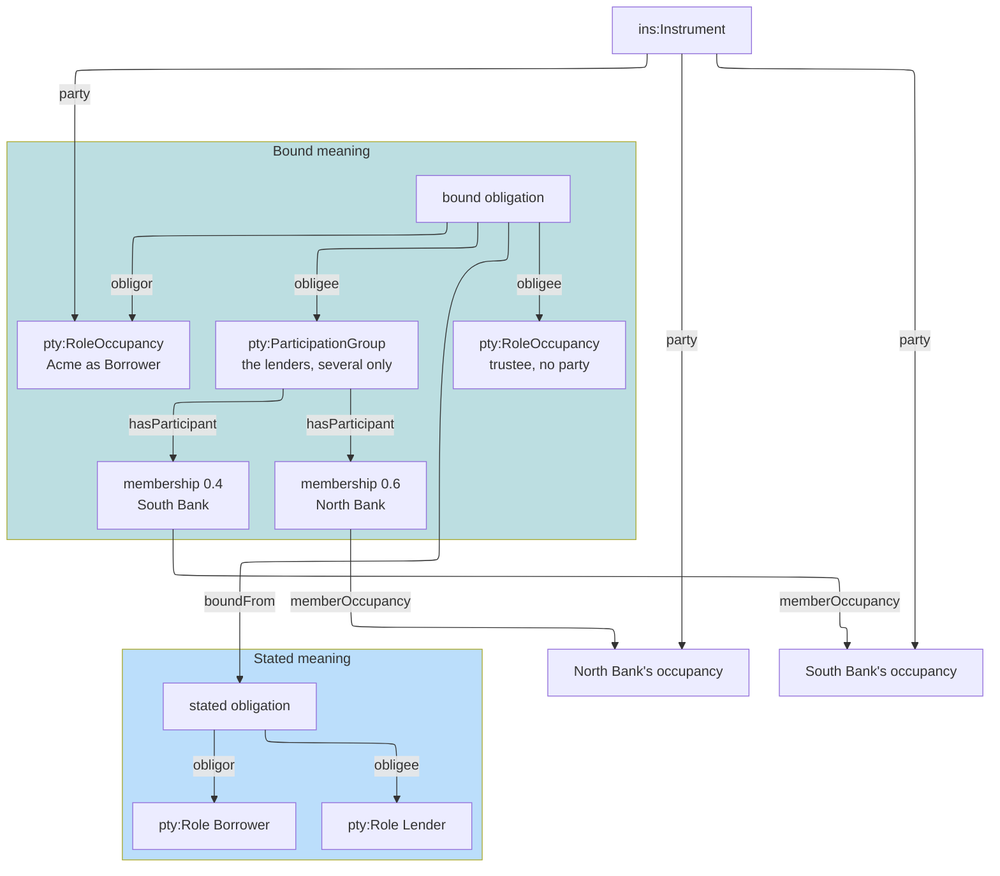

A contingent occupancy has a role and no actor until the case fills it:

```mermaid
flowchart LR
    RE["repair<br/>ins:Obligation"] -- "obligee" --> OW["owner occupancy<br/>inRole Owner<br/>no occupiedBy"]
    CL["a claim, later"] -. "fills it for that claim (C7b)" .-> OW
```

```turtle-spec
ins:RelationParty a owl:Class ;
	owl:equivalentClass [ a owl:Class ; owl:unionOf ( pty:RoleOccupancy pty:ParticipationGroup pty:Role ) ] ;
	rdfs:comment "What a relation's party may be: a role occupancy, a participation group, or on stated meaning a role." ;
	fnd:utility "The range of the four party properties and of ins:party. Stated meaning names roles, bound meaning occupancies and groups (law I13)." .

pty:RoleOccupancy rdfs:subClassOf ins:RelationParty .
pty:ParticipationGroup rdfs:subClassOf ins:RelationParty .
pty:Role rdfs:subClassOf ins:RelationParty .

ins:obligor a owl:ObjectProperty ;
	rdfs:domain ins:Obligation ;
	rdfs:range ins:RelationParty ;
	rdfs:comment "The party who must perform an obligation." ;
	fnd:utility "Subject: an obligation. Value: exactly one party: a role on stated meaning, an occupancy or group on bound meaning." .

ins:obligee a owl:ObjectProperty ;
	rdfs:domain ins:Obligation ;
	rdfs:range ins:RelationParty ;
	rdfs:comment "A party an obligation is owed to." ;
	fnd:utility "Subject: an obligation. Value: one of at least one parties it is owed to, who need not be a party to the instrument." .

ins:holder a owl:ObjectProperty ;
	rdfs:domain ins:LegalRelation ;
	rdfs:range ins:RelationParty ;
	rdfs:comment "The party who holds a permission, exclusion or power." ;
	fnd:utility "Subject: a permission, exclusion or power. Value: exactly one party." .

ins:counterparty a owl:ObjectProperty ;
	rdfs:domain ins:LegalRelation ;
	rdfs:range ins:RelationParty ;
	rdfs:comment "A party against whom a permission, exclusion or power holds." ;
	fnd:utility "Subject: a permission, exclusion or power. Value: one of at least one parties whose position it affects." .

ins:noticeAddress a owl:DatatypeProperty ;
	rdfs:domain pty:RoleOccupancy ;
	rdfs:range xsd:string ;
	rdfs:comment "Where a party takes notices under an instrument." ;
	fnd:utility "Subject: a role occupancy. Value: the address as written in the instrument. Never the party's identity, which is its keys (CC-D9)." .

ins:operatesAt a owl:ObjectProperty ;
	rdfs:domain pty:RoleOccupancy ;
	rdfs:range skos:Concept ;
	rdfs:comment "A place a party operates at under an instrument." ;
	fnd:utility "Subject: a role occupancy. Value: a concept from the territory or site scheme a deployment binds to ins-voc:LocationContract." .
```

## 9. Content of a Relation and Qualifiers

An activity names the act, never the circumstances it is done in: those are the scope. Enrolment
is `ins-voc:Enrol` whether or not the participant meets the criteria, and a prohibition on
enrolling the ineligible is `Enrol` with that scope. Termination for convenience and for breach are
both `ins-voc:Terminate`.

What a relation says, besides its parties:

```mermaid
flowchart LR
    R["a legal relation"]
    R -- "activity (the act)" --> A["ins-voc:Terminate<br/>a concept"]
    R -- "scope (the cases)" --> S["elg:Condition<br/>without cause"]
    R -- "arisesUnder" --> T["its term"]
    CO["a continuing obligation"] -- "maintains (the state)" --> M["elg:Condition<br/>leverage ≤ 3.0"]
    OB["an obligation"] -- "fulfilledWhen (performance)" --> F["elg:Condition"]
    EXC["a permission or exclusion"] -- "excepts" --> X["the relation it excepts"]
    Q["ins:Qualifier"] -- "qualifies" --> R
```

A scope with a carve-back, from the warranty: the exclusion applies to misuse, unless the failure
was caused by a manufacturing defect.

```mermaid
flowchart LR
    EX["misuse exclusion"] -- "scope" --> AND["misuse, not a defect<br/>AllRequired"]
    AND -- "hasCondition" --> M["caused by misuse"]
    AND -- "hasCondition" --> D["caused by a defect<br/>negated: the carve-back"]
    EX -- "excepts" --> RE["the duty to repair"]
```

```turtle-spec
ins:activity a owl:ObjectProperty ;
	rdfs:domain ins:LegalRelation ;
	rdfs:range skos:Concept ;
	rdfs:comment "The act a relation is about." ;
	fnd:utility "Subject: a relation. Value: a concept naming the act, from the scheme bound to ins-voc:ActivityContract. Never a circumstance of the act, which is the scope." .

ins:scope a owl:ObjectProperty, owl:FunctionalProperty ;
	rdfs:domain ins:LegalRelation ;
	rdfs:range elg:Condition ;
	rdfs:comment "The cases a relation applies to." ;
	fnd:utility "Subject: a relation. Value: at most one Eligibility condition over the case. A carve-back is a negated member of it." .

ins:maintains a owl:ObjectProperty ;
	rdfs:domain ins:ContinuingObligation ;
	rdfs:range elg:Condition ;
	rdfs:comment "The state a continuing obligation keeps holding." ;
	fnd:utility "Subject: a continuing obligation. Value: exactly one condition that must hold throughout." .

ins:fulfilledWhen a owl:ObjectProperty ;
	rdfs:domain ins:Obligation ;
	rdfs:range elg:Condition ;
	rdfs:comment "The test of an obligation's performance." ;
	fnd:utility "Subject: an obligation. Value: the condition its performance meets. Without one, performance is an act of its activity for the case by the obligor or a delegate." .

ins:Qualifier a owl:Class ;
	rdfs:comment "A limit, level or retention on a term or a relation." ;
	fnd:utility "Subject: a qualifier. Arises under exactly one term and qualifies exactly one term or relation. Its amounts are defined with contract amounts (C8)." .

ins:qualifies a owl:ObjectProperty, owl:FunctionalProperty ;
	rdfs:domain ins:Qualifier ;
	rdfs:comment "The term or relation a qualifier qualifies." ;
	fnd:utility "Subject: a qualifier. Value: exactly one term or relation." .

[] a owl:AllDisjointClasses ;
	owl:members ( ins:Instrument ins:Term ins:LegalRelation ins:Qualifier ) .

ins:Term owl:disjointWith fnd:Version .
ins:LegalRelation owl:disjointWith fnd:Version .
ins:Qualifier owl:disjointWith fnd:Version .
ins:Template owl:disjointWith ins:Instrument .
```

## 10. Vocabulary

The activity scheme follows Wording's element types (C3-Q1): `ins-voc:ActivityContract` constrains
`ins:activity`, with a baseline scheme bound as fallback that a deployment may extend or replace.
The location contract has no baseline: a deployment binds its own territory or site scheme.

```turtle-vocab
@prefix ins:     <https://www.nebularis.org/neuro-semantic/lattice/instrument#> .
@prefix ins-voc: <https://www.nebularis.org/neuro-semantic/lattice/instrument/vocab#> .
@prefix bhv:     <https://www.nebularis.org/neuro-semantic/lattice/behaviour#> .
@prefix fnd:     <https://www.nebularis.org/neuro-semantic/lattice/foundation#> .
@prefix voc:     <https://www.nebularis.org/neuro-semantic/lattice/vocabulary#> .
@prefix skos:    <http://www.w3.org/2004/02/skos/core#> .
@prefix owl:     <http://www.w3.org/2002/07/owl#> .
@prefix rdf:     <http://www.w3.org/1999/02/22-rdf-syntax-ns#> .
@prefix rdfs:    <http://www.w3.org/2000/01/rdf-schema#> .

<https://www.nebularis.org/neuro-semantic/instrument-vocab>
	rdf:type owl:Ontology ;
	owl:versionIRI <https://www.nebularis.org/neuro-semantic/lattice/instrument-vocab/0.9.0> ;
	owl:imports <https://www.nebularis.org/neuro-semantic/lattice/instrument/0.9.0> .

ins-voc:ActivityContract a voc:SchemeContract ;
	fnd:hasIdentity ins-voc:ActivityContract-identity ;
	fnd:hasGovernanceState fnd:Active ;
	skos:prefLabel "Activity scheme contract"@en ;
	voc:constrainsProperty ins:activity ;
	voc:boundScheme ins-voc:Activities .

ins-voc:LocationContract a voc:SchemeContract ;
	fnd:hasIdentity ins-voc:LocationContract-identity ;
	fnd:hasGovernanceState fnd:Active ;
	skos:prefLabel "Location scheme contract"@en ;
	voc:constrainsProperty ins:operatesAt .

ins-voc:Activities a voc:ConceptScheme ;
	fnd:hasIdentity ins-voc:Activities-identity ;
	fnd:hasGovernanceState fnd:Active ;
	skos:prefLabel "Baseline activities"@en ;
	skos:definition "Acts a relation may be about. A baseline, not a closed set. Each names the act, never the circumstances of it."@en .

ins-voc:Repay a skos:Concept ; skos:inScheme ins-voc:Activities ;
	skos:prefLabel "Repay"@en ; skos:definition "Pay back money lent."@en .

ins-voc:CreateSecurity a skos:Concept ; skos:inScheme ins-voc:Activities ;
	skos:prefLabel "Create security"@en ; skos:definition "Grant a security interest over an asset."@en .

ins-voc:DeclareDue a skos:Concept ; skos:inScheme ins-voc:Activities ;
	skos:prefLabel "Declare due"@en ; skos:definition "Declare amounts immediately due and payable."@en .

ins-voc:ReportAdverseEvent a skos:Concept ; skos:inScheme ins-voc:Activities ;
	skos:prefLabel "Report adverse event"@en ; skos:definition "Report an adverse event to another party."@en .

ins-voc:Enrol a skos:Concept ; skos:inScheme ins-voc:Activities ;
	skos:prefLabel "Enrol"@en ; skos:definition "Admit a participant to a programme or study."@en .

ins-voc:EndParticipation a skos:Concept ; skos:inScheme ins-voc:Activities ;
	skos:prefLabel "End participation"@en ; skos:definition "End another party's participation in an arrangement."@en .

ins-voc:Repair a skos:Concept ; skos:inScheme ins-voc:Activities ;
	skos:prefLabel "Repair"@en ; skos:definition "Restore a product to working order."@en .

ins-voc:Terminate a skos:Concept ; skos:inScheme ins-voc:Activities ;
	skos:prefLabel "Terminate"@en ; skos:definition "End an instrument or a relationship under it."@en .

ins:InstrumentTarget a bhv:TargetKind ;
	rdfs:comment "A Behaviour effect's target kind for an instrument." ;
	fnd:utility "Declared here, since Behaviour no longer names Instrument (ADR-A106). Behaviour's bhv:InstrumentTarget is deprecated in its favour." .
```

## 11. Shapes

### 11.1 Structural shapes (SHACL Core)

Each property's subject and value, a relation's single term, its required content per class, the
two tiers (law I2) and what each names (law I13). Validate data with this spec, so that subclasses
are known.

```turtle-shapes
@prefix sh:   <http://www.w3.org/ns/shacl#> .
@prefix ins:  <https://www.nebularis.org/neuro-semantic/lattice/instrument#> .
@prefix fnd:  <https://www.nebularis.org/neuro-semantic/lattice/foundation#> .
@prefix pty:  <https://www.nebularis.org/neuro-semantic/lattice/party#> .
@prefix elg:  <https://www.nebularis.org/neuro-semantic/lattice/eligibility#> .
@prefix wrd:  <https://www.nebularis.org/neuro-semantic/lattice/wording#> .
@prefix xsd:  <http://www.w3.org/2001/XMLSchema#> .

ins:InstrumentShape a sh:NodeShape ;
	sh:targetClass ins:Instrument ;
	sh:property [
		sh:path ins:expressedIn ; sh:minCount 1 ; sh:maxCount 1 ; sh:class wrd:AssembledWording ;
		sh:message "An instrument version is expressed in exactly one assembled wording (law I1)."
	] ;
	sh:property [
		sh:path ins:party ; sh:or ( [ sh:class pty:RoleOccupancy ] [ sh:class pty:ParticipationGroup ] ) ;
		sh:message "An instrument's parties are role occupancies or participation groups, never roles."
	] .

ins:TermShape a sh:NodeShape ;
	sh:targetClass ins:Term ;
	sh:message "A term is either stated, an ins:Template expressed in exactly one element version and bound in none, or bound, bound in exactly one instrument version from exactly one stated term or implied by a source, and expressed in none (law I2)." ;
	sh:xone (
		[ sh:class ins:Template ;
		  sh:property [ sh:path ins:expressedIn ; sh:minCount 1 ; sh:maxCount 1 ; sh:class wrd:Element ] ;
		  sh:property [ sh:path ins:boundIn ; sh:maxCount 0 ] ]
		[ sh:not [ sh:class ins:Template ] ;
		  sh:property [ sh:path ins:boundIn ; sh:minCount 1 ; sh:maxCount 1 ; sh:class ins:Instrument ] ;
		  sh:property [ sh:path ins:expressedIn ; sh:maxCount 0 ] ;
		  sh:xone (
			[ sh:property [ sh:path ins:boundFrom ; sh:minCount 1 ; sh:maxCount 1 ; sh:class ins:Template ] ]
			[ sh:property [ sh:path ins:impliedBy ; sh:minCount 1 ] ]
		  ) ]
	) .

ins:LegalRelationShape a sh:NodeShape ;
	sh:targetClass ins:LegalRelation ;
	sh:property [
		sh:path ins:arisesUnder ; sh:minCount 1 ; sh:maxCount 1 ; sh:class ins:Term ;
		sh:message "A relation arises under exactly one term."
	] ;
	sh:property [
		sh:path ins:boundIn ; sh:maxCount 0 ;
		sh:message "A relation carries no ins:boundIn: it belongs to its term, which does (law I2)."
	] ;
	sh:property [
		sh:path ins:scope ; sh:maxCount 1 ; sh:class elg:Condition ;
		sh:message "A relation has at most one scope, an Eligibility condition."
	] ;
	sh:property [
		sh:path ins:activity ; sh:maxCount 1 ; sh:nodeKind sh:IRI ;
		sh:message "A relation has at most one activity, a concept."
	] ;
	sh:not [ sh:class fnd:Version ] ;
	sh:message "A relation is never a version: it changes only with its owner (law I18)." .

ins:RelationTierShape a sh:NodeShape ;
	sh:targetClass ins:LegalRelation ;
	sh:message "A stated relation (an ins:Template) arises under a stated term and names roles as its parties. A bound relation arises under a bound term, names occupancies or groups, and is instantiated from exactly one stated relation or implied by a source (laws I2, I13)." ;
	sh:xone (
		[ sh:class ins:Template ;
		  sh:property [ sh:path ins:arisesUnder ; sh:class ins:Template ] ;
		  sh:property [ sh:path [ sh:alternativePath ( ins:obligor ins:obligee ins:holder ins:counterparty ) ] ; sh:class pty:Role ] ]
		[ sh:not [ sh:class ins:Template ] ;
		  sh:property [ sh:path ins:arisesUnder ; sh:not [ sh:class ins:Template ] ] ;
		  sh:property [ sh:path [ sh:alternativePath ( ins:obligor ins:obligee ins:holder ins:counterparty ) ] ;
		                sh:or ( [ sh:class pty:RoleOccupancy ] [ sh:class pty:ParticipationGroup ] ) ] ;
		  sh:xone (
			[ sh:property [ sh:path ins:boundFrom ; sh:minCount 1 ; sh:maxCount 1 ; sh:class ins:Template ] ]
			[ sh:property [ sh:path ins:impliedBy ; sh:minCount 1 ] ]
		  ) ]
	) .

ins:ObligationShape a sh:NodeShape ;
	sh:targetClass ins:Obligation ;
	sh:property [ sh:path ins:obligor ; sh:minCount 1 ; sh:maxCount 1 ;
		sh:message "An obligation has exactly one obligor. Several owing together are a participation group." ] ;
	sh:property [ sh:path ins:obligee ; sh:minCount 1 ;
		sh:message "An obligation is owed to at least one obligee." ] ;
	sh:property [ sh:path ins:excepts ; sh:maxCount 0 ;
		sh:message "An obligation excepts nothing: only a permission or an exclusion does." ] ;
	sh:or (
		[ sh:class ins:ContinuingObligation ]
		[ sh:property [ sh:path ins:activity ; sh:minCount 1 ] ]
	) ;
	sh:message "An obligation that is not continuing states its activity." .

ins:ContinuingObligationShape a sh:NodeShape ;
	sh:targetClass ins:ContinuingObligation ;
	sh:property [ sh:path ins:maintains ; sh:minCount 1 ; sh:maxCount 1 ; sh:class elg:Condition ;
		sh:message "A continuing obligation states the one condition it keeps holding (ins:maintains)." ] .

ins:HeldRelationShape a sh:NodeShape ;
	sh:targetClass ins:Permission , ins:Exclusion , ins:Power ;
	sh:property [ sh:path ins:holder ; sh:minCount 1 ; sh:maxCount 1 ;
		sh:message "A permission, exclusion or power has exactly one holder. Several holding together are a participation group." ] ;
	sh:property [ sh:path ins:counterparty ; sh:minCount 1 ;
		sh:message "A permission, exclusion or power has at least one counterparty." ] ;
	sh:property [ sh:path ins:obligor ; sh:maxCount 0 ; sh:message "Only an obligation has an obligor." ] ;
	sh:property [ sh:path ins:obligee ; sh:maxCount 0 ; sh:message "Only an obligation has obligees." ] .

ins:PermissionShape a sh:NodeShape ;
	sh:targetClass ins:Permission ;
	sh:property [ sh:path ins:activity ; sh:minCount 1 ;
		sh:message "A permission states the activity it permits." ] ;
	sh:property [ sh:path ins:excepts ; sh:minCount 1 ; sh:maxCount 1 ; sh:class ins:Prohibition ;
		sh:message "A permission excepts exactly one prohibition." ] .

ins:ExclusionShape a sh:NodeShape ;
	sh:targetClass ins:Exclusion ;
	sh:property [ sh:path ins:excepts ; sh:minCount 1 ; sh:maxCount 1 ;
		sh:or ( [ sh:class ins:Obligation ] [ sh:class ins:Power ] ) ;
		sh:message "An exclusion excepts exactly one obligation or power." ] .

ins:PowerShape a sh:NodeShape ;
	sh:targetClass ins:Power ;
	sh:property [ sh:path ins:activity ; sh:minCount 1 ;
		sh:message "A power states the act that exercises it." ] ;
	sh:property [ sh:path ins:excepts ; sh:maxCount 0 ;
		sh:message "A power excepts nothing: only a permission or an exclusion does." ] .

ins:QualifierShape a sh:NodeShape ;
	sh:targetClass ins:Qualifier ;
	sh:property [ sh:path ins:arisesUnder ; sh:minCount 1 ; sh:maxCount 1 ; sh:class ins:Term ;
		sh:message "A qualifier arises under exactly one term." ] ;
	sh:property [ sh:path ins:qualifies ; sh:minCount 1 ; sh:maxCount 1 ;
		sh:or ( [ sh:class ins:Term ] [ sh:class ins:LegalRelation ] ) ;
		sh:message "A qualifier qualifies exactly one term or relation." ] .

ins:PartyDetailsShape a sh:NodeShape ;
	sh:targetSubjectsOf ins:noticeAddress , ins:operatesAt ;
	sh:class pty:RoleOccupancy ;
	sh:property [ sh:path ins:noticeAddress ; sh:datatype xsd:string ;
		sh:message "A notice address is a string, the address as written." ] ;
	sh:property [ sh:path ins:operatesAt ; sh:nodeKind sh:IRI ;
		sh:message "An operating location is a concept from the bound location scheme." ] ;
	sh:message "Party details belong to a role occupancy." .
```

### 11.2 Constraint shapes (SHACL-SPARQL)

Supersession within one identity, and law I8: an exception's holder is the party the excepted
relation binds, and a permission permits the act the prohibition forbids.

```turtle-shapes
@prefix sh:   <http://www.w3.org/ns/shacl#> .
@prefix ins:  <https://www.nebularis.org/neuro-semantic/lattice/instrument#> .

ins:SupersessionSameIdentityShape a sh:NodeShape ;
	sh:targetClass ins:Instrument ;
	sh:sparql [
		sh:message "An instrument version is superseded only by a version of the same instrument: fnd:supersededBy points to a version with another fnd:hasIdentity." ;
		sh:select """
			PREFIX fnd: <https://www.nebularis.org/neuro-semantic/lattice/foundation#>
			SELECT $this WHERE {
				$this fnd:hasIdentity ?identity ;
					  fnd:supersededBy ?next .
				?next fnd:hasIdentity ?other .
				FILTER (?identity != ?other)
			}
		"""
	] .

ins:PermissionExceptsOwnProhibitionShape a sh:NodeShape ;
	sh:targetClass ins:Permission ;
	sh:sparql [
		sh:message "The permission's holder {?holder} is not the obligor of the prohibition it excepts, {?prohibition} (law I8)." ;
		sh:select """
			PREFIX ins: <https://www.nebularis.org/neuro-semantic/lattice/instrument#>
			SELECT $this ?holder ?prohibition WHERE {
				$this ins:excepts ?prohibition ;
					  ins:holder ?holder .
				FILTER NOT EXISTS { ?prohibition ins:obligor ?holder }
			}
		"""
	] ;
	sh:sparql [
		sh:message "The permission's activity {?activity} is not the activity of the prohibition it excepts, {?prohibition} (law I8)." ;
		sh:select """
			PREFIX ins: <https://www.nebularis.org/neuro-semantic/lattice/instrument#>
			SELECT $this ?activity ?prohibition WHERE {
				$this ins:excepts ?prohibition ;
					  ins:activity ?activity .
				FILTER NOT EXISTS { ?prohibition ins:activity ?activity }
			}
		"""
	] .

ins:ExclusionHolderShape a sh:NodeShape ;
	sh:targetClass ins:Exclusion ;
	sh:sparql [
		sh:message "The exclusion's holder {?holder} is not the obligor of the obligation it excepts, {?excepted} (law I8)." ;
		sh:select """
			PREFIX ins:  <https://www.nebularis.org/neuro-semantic/lattice/instrument#>
			PREFIX rdf:  <http://www.w3.org/1999/02/22-rdf-syntax-ns#>
			PREFIX rdfs: <http://www.w3.org/2000/01/rdf-schema#>
			SELECT $this ?holder ?excepted WHERE {
				$this ins:excepts ?excepted ;
					  ins:holder ?holder .
				?excepted rdf:type/rdfs:subClassOf* ins:Obligation .
				FILTER NOT EXISTS { ?excepted ins:obligor ?holder }
			}
		"""
	] ;
	sh:sparql [
		sh:message "The exclusion's holder {?holder} is not a counterparty of the power it excepts, {?excepted}: an immunity protects the party the power is held against (law I8)." ;
		sh:select """
			PREFIX ins:  <https://www.nebularis.org/neuro-semantic/lattice/instrument#>
			PREFIX rdf:  <http://www.w3.org/1999/02/22-rdf-syntax-ns#>
			PREFIX rdfs: <http://www.w3.org/2000/01/rdf-schema#>
			SELECT $this ?holder ?excepted WHERE {
				$this ins:excepts ?excepted ;
					  ins:holder ?holder .
				?excepted rdf:type/rdfs:subClassOf* ins:Power .
				FILTER NOT EXISTS { ?excepted ins:counterparty ?holder }
			}
		"""
	] .
```

### 11.3 Optional: one expression per term

Load only where every stated term is expressed in one element version. A term may otherwise be
expressed again in another language or a consolidated text (ADR-A96).

```turtle-shapes
# Optional (ADR-A96). Load only where every stated term is expressed in one
# element version.

@prefix sh:  <http://www.w3.org/ns/shacl#> .
@prefix ins: <https://www.nebularis.org/neuro-semantic/lattice/instrument#> .

ins:SingleExpressionShape a sh:NodeShape ;
	sh:targetClass ins:Term ;
	sh:property [ sh:path ins:alsoExpressedIn ; sh:maxCount 0 ;
		sh:message "This deployment expresses each term in one element version only (ADR-A96)." ] .
```

## 12. Laws

| Law | Statement | Register in 0.9.0 |
|---|---|---|
| I1 | An instrument version is expressed in exactly one assembled wording | `ins:InstrumentShape` |
| I2 | A stated term is part of exactly one element version. A bound term is part of exactly one instrument version, bound from exactly one stated term or implied by a source. A relation belongs to its term | `ins:TermShape`, `ins:LegalRelationShape`, `ins:RelationTierShape` |
| I8 | A permission's holder is the excepted prohibition's obligor, with the same activity. An exclusion's holder is the excepted obligation's obligor or the power's counterparty | `ins:PermissionExceptsOwnProhibitionShape`, `ins:ExclusionHolderShape` |
| I13 | Stated meaning names roles, bound meaning occupancies and groups. Only bound meaning is evaluated | `ins:RelationTierShape` |
| I18 | No term or relation is a version: meaning changes only with its owner | disjointness with `fnd:Version`, `ins:LegalRelationShape` |

Laws I3 to I7, I9 to I12 and I14 to I17 arrive with the slices that build their terms.

## 13. Worked Examples

Four instruments in [`examples/`](examples/), each with a small wording of its own, its clauses'
stated meaning, and the bound meaning of one instrument. Each is validated with the lower layers'
shapes and these.

### 13.1 A facility agreement

[`facility-agreement.ttl`](examples/facility-agreement.ttl). A borrower and two lenders, 60% and 40%.

```mermaid
---
config:
  layout: elk
---
flowchart LR
    T61["term 6.1"] --- RP["repay<br/>Obligation"]
    T71["term 7.1"] --- LV["leverage<br/>ContinuingObligation<br/>maintains leverage ≤ 3.0"]
    T81["term 8.1"] --- NP["negative pledge<br/>Prohibition<br/>CreateSecurity"]
    T81 --- PL["permitted liens<br/>Permission<br/>scope: lien by law"]
    T101["term 10.1"] --- AC["accelerate<br/>Power<br/>DeclareDue"]
    PL -. "excepts" .-> NP
    BO["borrower occupancy<br/>Acme"]
    LG["lenders<br/>group, several only"]
    TR["security trustee<br/>no party"]
    RP -- "obligor" --> BO
    RP -- "obligee" --> LG
    LV -- "obligee" --> LG
    LV -- "obligee" --> TR
    AC -- "holder" --> LG
    AC -- "counterparty" --> BO
```

What it shows: term 8.1 gives rise to two relations, the negative pledge and the permission
excepting it. Repayment is owed to a group severally, under `pty:SeveralOnly`. The leverage
covenant is owed also to a security trustee who is no party to the agreement, so it is an obligee
and not in `ins:party`. The facility's agreement number and market reference are natural keys on
its persistent identity. Acceleration's gating on an event of default (C7a) and its consent rule
(C9) come later.

### 13.2 A clinical trial protocol

[`trial-protocol.ttl`](examples/trial-protocol.ttl). A sponsor and site 104's investigator.

```mermaid
flowchart LR
    SAE["report adverse events<br/>Obligation"]
    NE["no ineligible enrolment<br/>Prohibition: Enrol<br/>scope: fails the criteria"]
    WV["waiver<br/>Permission: Enrol<br/>scope: written waiver"]
    END["end participation<br/>Power"]
    INV["investigator"]
    SP["sponsor"]
    WV -. "excepts" .-> NE
    SAE -- "obligor" --> INV
    NE -- "obligor" --> INV
    WV -- "holder" --> INV
    END -- "holder" --> SP
    END -- "counterparty" --> INV
```

What it shows: law I8, where the waiver's holder is the prohibition's obligor, with the same
activity, `Enrol`. The prohibition's scope says whom it forbids enrolling, and the waiver's scope
when it permits it. The reporting deadline is a due range (C7b).

### 13.3 A product warranty

[`product-warranty.ttl`](examples/product-warranty.ttl). A manufacturer and whoever owns the kettle.

```mermaid
flowchart LR
    RE["repair<br/>Obligation"]
    EX["misuse exclusion<br/>Exclusion<br/>scope: misuse, not a defect"]
    MF["manufacturer"]
    OW["owner<br/>contingent occupancy<br/>role, no actor"]
    EX -. "excepts" .-> RE
    RE -- "obligor" --> MF
    RE -- "obligee" --> OW
    EX -- "holder" --> MF
    EX -- "counterparty" --> OW
```

What it shows: an exclusion excepting an obligation, whose holder is the obligation's obligor (I8).
Its carve-back is a negated member of its scope ("misuse, unless a manufacturing defect"). The
owner is a contingent occupancy: whoever owns the kettle when a claim is made fills it, as C7b
decides.

### 13.4 A software licence

[`software-licence.ttl`](examples/software-licence.ttl). A licensor and a licensee.

```mermaid
flowchart LR
    TC["end for convenience<br/>Power: Terminate<br/>scope: without cause"]
    IM["perpetual immunity<br/>Exclusion<br/>scope: perpetual fee paid"]
    LR["licensor"]
    LE["licensee<br/>notice address<br/>operates at Leeds, Dublin"]
    IM -. "excepts" .-> TC
    TC -- "holder" --> LR
    TC -- "counterparty" --> LE
    IM -- "holder" --> LE
```

What it shows: an immunity, an exclusion of a power held by the power's counterparty (I8). The
power's activity is plain `Terminate`, its scope "without cause". Party details sit on the
occupancies. The grant of use is not modelled: a permission excepts a prohibition, and a bare
licence to use has none to except.

## 14. Release Notes

Breaking versions at major version zero ([ADR-A113](../../docs/architecture/decisions/ADR-A113-breaking-changes-at-major-version-zero.md)):

- 0.9.0 (breaking, CCS C6, ADR-A104): the minimal ADR-A07b shape is replaced. Retired:
  `ins:Element`, `ins:Provision`, `ins:hasProvision`, `ins:partOfInstrument`, `ins:hasObligation`,
  `ins:inProvision`, `ins:hasQualifier`, `ins:hasCondition`, `ins:fulfilledBy`. New: the instrument,
  terms in two tiers, the five relations, their parties and content, qualifiers. `instrument-vocab`
  0.9.0 adds the activity and location contracts and `ins:InstrumentTarget`. Shapes 0.2.0
  (breaking): every shape is new, the supersession shape targets `ins:Instrument`, and the optional
  `single-provision.ttl` becomes `single-expression.ttl`. The projection to Party is retired, since
  Instrument now imports Party.
- 0.8.0: re-pinned to Foundation 0.4.0 and the layers re-pinned with it, with no other change (CCS
  F1, ADR-A114).
