<!-- SPDX-License-Identifier: CC-BY-SA-4.0 -->

# Persistence Ontology — the Data Access Layer (`dal:`)

Literate specification and guide for the persistence profile substrate.

This README is meant to be read on its own. It explains why storing changing data safely in an RDF
store needs machinery that a relational database gives for free, what that machinery is, which
choices it leaves to an adopter, and how this ontology records those choices so that a compiler can
turn them into SPARQL. The full reasoning lives in two architecture guides, the
[RDF and SPARQL patterns guide](../../docs/architecture/rdf-sparql-patterns-guide.md) (cited here as
*the guide*) and the [IRI and identity patterns guide](../../docs/architecture/iri-identity-patterns.md)
(*the identity guide*). This document summarises what an adopter needs from them, so that a design
built on Persistence can be understood without reading either first.

**Contents**

1. [Purpose and scope](#1-purpose-and-scope)
2. [Why persistence in RDF is hard](#2-why-persistence-in-rdf-is-hard)
3. [The infrastructure the patterns add](#3-the-infrastructure-the-patterns-add)
4. [One write, end to end](#4-one-write-end-to-end)
5. [The configuration model](#5-the-configuration-model)
6. [Scopes, targets and resolution](#6-scopes-targets-and-resolution)
7. [The dimensions, one by one](#7-the-dimensions-one-by-one)
8. [Capability self-checks](#8-capability-self-checks)
9. [What the compiler produces](#9-what-the-compiler-produces)
10. [Choosing a profile](#10-choosing-a-profile)
11. [Worked examples](#11-worked-examples)
12. [Validation](#12-validation)
13. [Repository layout](#13-repository-layout)
14. [Cross references](#14-cross-references)

---

## 1. Purpose and scope

LATTICE ships ontologies, libraries and control-plane infrastructure the way a framework does, not
the way a single application does. An adopter builds their own applied ontology on the substrate
layers, and then has to decide how its data is stored: whether a population of individuals forms
aggregates that change together, how concurrent writers are kept from overwriting each other, what
order changes are recorded in, how much history is kept, how keys are kept unique, how identifiers
are minted, and how personal data is erased.

Those decisions depend on the adopter's domain, workload and store, so LATTICE does not make them.
The guides document **what the options are and what each one costs**. This ontology is **how one
adopter records which options they chose**, per class and per deployment, and the
[`tools/persistence`](../../tools/persistence/README.md) compiler turns that record into generated,
portable SPARQL and identity minting recipes.

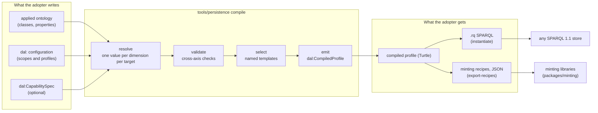

**This ontology targets classes, graphs and shapes by IRI reference only.** It imports nothing from
Foundation, Vocabulary, Quantification, Party, Eligibility, Wording, Behaviour or Instrument, and none
of them imports it. It has no place in the layer order of
[ontology-architecture.md](../../docs/architecture/ontology-architecture.md#the-lattice-layers):
it sits beside Surface and MORK as a cross-cutting substrate. An adopter's domain ontology never needs
to know that Persistence exists, and a configuration can be added, changed or removed without touching
it (ADR-A78).

**Persistence is optional.** An adopter may use LATTICE's ontologies without this vocabulary, the
compiler, or any runtime component. Everything here is for adopters who write changing data to an RDF
store and want the guarantees described below.

### Namespace

```turtle
@prefix dal: <https://www.nebularis.org/neuro-semantic/lattice/persistence#> .
```

The directory is named `persistence` because the compiler, and any future housekeeping or runtime
component (ADR-A80), belong to that subsystem. The ontology inside it is named for what it is: a
**Data Access Layer** configuration vocabulary, hence `dal:`.

---

## 2. Why persistence in RDF is hard

A relational database gives an application three things it barely notices until they are gone: a
`UNIQUE` index, a row that two writers collide on, and a return value saying how many rows an
`UPDATE` touched. RDF over SPARQL gives none of them (guide, Chapter 1).

**Set semantics hide lost updates.** An RDF graph is a set of triples. Inserting a triple that is
already present is a no-op, and so is deleting one that is absent. Two writers who both move the
world from state A to state B therefore do not collide. They merge:

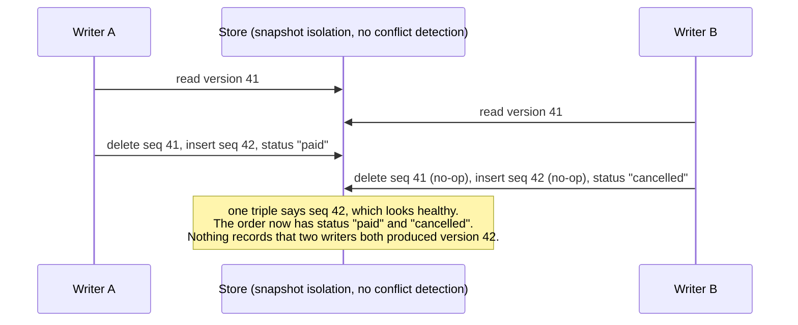

**There is no return value.** A SPARQL update endpoint replies `200` or `204` whether it changed ten
thousand triples or none. A conditional update whose condition failed looks exactly like one that
succeeded. Reading the version back afterwards does not help: it shows the current version, not
whether *your* write produced it.

**Isolation is underspecified.** SPARQL 1.1 says one request SHOULD be atomic and says nothing about
isolation. A check-then-write has to fit in one request, and even then `INSERT … WHERE { FILTER NOT
EXISTS { … } }` is a textbook write skew under snapshot isolation: two writers both see "no such key"
and both insert.

**OWL does not help, and can hurt.** `owl:InverseFunctionalProperty` and `owl:hasKey` look like
uniqueness constraints and are not. With a reasoner, two people who share an email are not rejected.
They are silently merged by an inferred `owl:sameAs`, which cannot be cleanly retracted if the merge
was wrong.

What the patterns rebuild, and where this README covers it:

| A relational database gives | An RDF store needs | Here |
|---|---|---|
| a `UNIQUE` index | a deterministic claim node per key value, with at most one owner | §7.6 |
| a `SERIAL` sequence | a counter rewritten inside the writing transaction | §7.3 |
| a row two writers collide on | one small version row per aggregate, kept apart from its payload | §3, §7.1 |
| `UPDATE … RETURNING` | a transaction claim keyed by a client-generated id, checked after the write | §4 |
| `BEGIN … COMMIT` across statements | one request, or a vendor transaction API, gated by capability | §7.2, §8 |
| a documented isolation level | an empirical conformance test per backend | §8 |

The guide calls the version-row machinery the **strong profile**, and is explicit that it is not the
platform default. Data addressed by immutable revision hashes, or data with no concurrent writers,
can use a **baseline profile** that relies on the store's own behaviour. Every choice below is made
per class or per deployment, so the strong profile can be switched on where it pays for itself and
left off where it does not.

---

## 3. The infrastructure the patterns add

The patterns keep changing data in several kinds of graph, each with its own mutability, retention,
access control and contention (guide §2.3). Separating them is not decoration: several guarantees
depend on it.

| Graph | Holds | Mutability | Example IRI | Present when |
|---|---|---|---|---|
| Payload | the domain triples of one aggregate | replaced whole, or immutable per revision | `urn:g:orders/1` | always |
| Meta (sharded) | one **version row** per aggregate or stream: epoch, sequence, head, tombstone | one small hot statement per row | `urn:g:meta/17` | strong profile |
| Keys | one **key claim** per unique key value | append, tombstoned, or deleted under erasure | `urn:g:keys` | any uniqueness constraint |
| Txn | one **transaction claim** per client transaction id, with a digest of the request | append, pruned after a time-to-live | `urn:g:txn` | strong profile |
| Log | append-only **receipts**, one per write, bucketed by month | append, pruned only from the oldest end | `urn:g:txlog/2026-09` | strong profile |
| Pinned heads | receipts still serving as a stream's head when their bucket is pruned | replaced as heads move | `urn:g:txlog/pinned` | retention on receipts |
| Events | domain events of append-only streams | append | `urn:g:events/orders/2026-09` | append form |
| Deltas | the triples each revision added and removed | immutable | `urn:g:delta/orders/1/…/add` | patch-log receipts |
| Snapshots | one sealed payload graph per revision | immutable | `urn:g:orders/1/e…/…` | snapshot receipts |
| Retention | per-target low-water marks | rewritten by the retention job | `urn:g:retention` | retention on receipts |
| Registry | the family's list of log, event, delta, txn and key graphs | rewritten on bucket rotation | `urn:g:registry/orders` | strong profile |
| Dataset | the dataset node: the current **epoch** | rewritten only by the epoch authority | `urn:g:dataset` | strong profile |

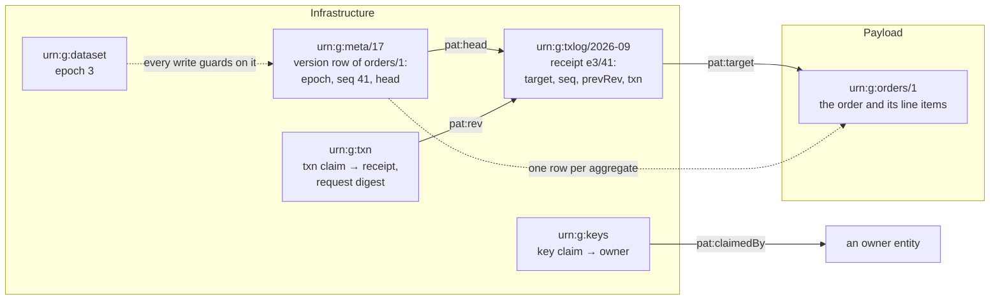

The terms, in one place:

- **Aggregate.** The unit of consistency: an order and its line items change together and are read
  together. Choosing what an aggregate is belongs to the adopter (§7.1).
- **Version row.** A tiny record, kept apart from the payload, holding the aggregate's current
  sequence number and head receipt. Every write to the aggregate rewrites this one statement, which is
  what makes two concurrent writers collide. Keeping it out of the payload graph is what lets a write
  replace the payload whole without erasing its own history (guide §17.1, A3).
- **Receipt.** An append-only record of one write: which aggregate, which position, which previous
  receipt, which client transaction. Receipts order the writes and audit them. Whether they also let
  a reader replay the change depends on the receipt model (§7.4).
- **Transaction claim.** A node keyed by the client's transaction id. It is how a writer learns, after
  the fact, whether its write applied (§4).
- **Key claim.** A deterministic node per unique key value, owned by at most one entity. It turns
  global uniqueness into a per-node cardinality check (§7.6).
- **Epoch.** A number on the dataset, bumped on every restore, rebuild or migration. Positions are
  `(epoch, seq)` pairs, so a position recorded before a restore can never be mistaken for one minted
  after it (§7.8).

**Every IRI in these examples is illustrative.** The `urn:g:`, `urn:rev:`, `urn:key:` and similar
namespaces are unregistered and would collide the moment two deployments merge. A deployment chooses a
controlled `https` authority, a `tag:` URI or a registered scheme through its identity profile (§7.7).
The compiler currently binds the infrastructure graph IRIs above as fixed constants (§9).

---

## 4. One write, end to end

The strong profile's write is a single guarded SPARQL update, followed by a confirmation read
(guide Chapters 14, 15 and 19). Everything below is generated by the compiler: an adopter does not
write it by hand.

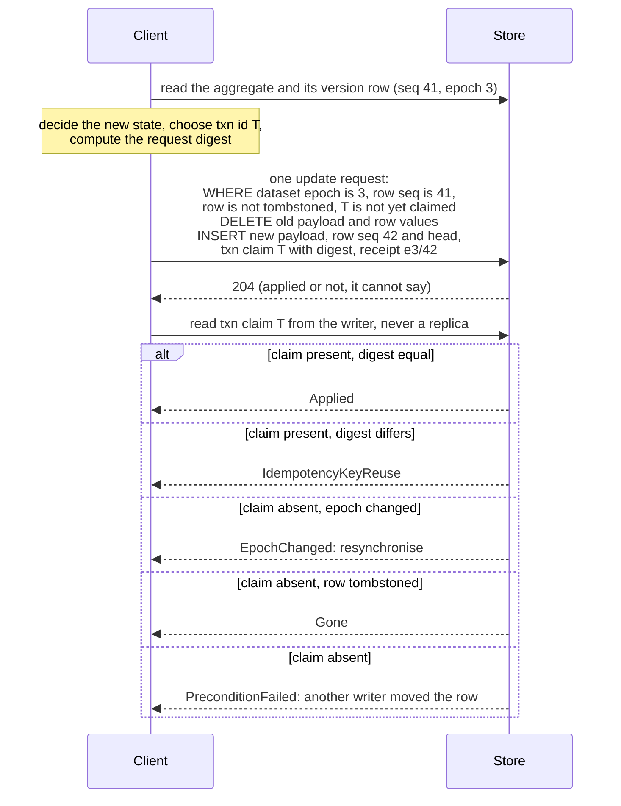

Each guard in the `WHERE` clause has a job:

| Guard | Stops | Outcome when it fails |
|---|---|---|
| the dataset epoch equals the writer's | a write started before a restore landing after it | `EpochChanged` |
| the row's sequence equals the expected one | a lost update: someone else wrote first | `PreconditionFailed` (`412`) |
| the row carries no tombstone | an editor with a stale tag resurrecting a deleted aggregate | `Gone` (`410`) |
| the transaction id is not yet claimed | a retry applying the same change twice | the retry is a no-op, then `Applied` |

**Why the transaction claim, not a re-read.** After a timeout, the write may or may not have applied,
and reading the version shows only what is current. A claim keyed by the client's own transaction id
is definitive and survives concurrent writers. The claim carries a digest of the request, so a client
that reuses an id for a different request is told so instead of being told it succeeded. An `Unknown`
outcome (a transport failure) is resolved by resending the identical request and then confirming:
the resend either applies once or is a no-op against the claim. A claim protects retries only for as
long as it is kept, so its time-to-live must cover the longest redelivery horizon (guide §15.2,
§24.2).

**Compare-and-set or append.** The same version row serves two contracts (guide Chapter 22):

| | Append | Compare-and-set |
|---|---|---|
| client knows the current sequence | no | yes, it read the aggregate |
| the new sequence is computed by | the store, inside the update | the client |
| fails when | the stream is tombstoned, the epoch changed, the txn is already claimed | those, and the expected sequence does not match |
| retry on conflict | resend as is | re-read, re-decide, resend |
| used for | event streams, decision records, ingestion | aggregate replace, state machines |

An aggregate replaced whole is always compare-and-set. An event stream is always append. Both write
the same version row, transaction claim and receipt shape, so one stream can be appended to by
ingestion and compare-and-set by an editor without two mechanisms.

**HTTP agrees with SPARQL by construction.** The ETag of an aggregate is derived, never stored:
`"{epoch}-{seq}"`, a strong validator (§7.2). `If-Match: "3-41"` on a Graph Store Protocol `PUT` is
the same guard as the SPARQL above.

---

## 5. The configuration model

An adopter's configuration is a graph of `dal:` individuals of two kinds: **scopes**, which say what
a profile applies to, and **profiles**, which declare values for one or more **dimensions**.

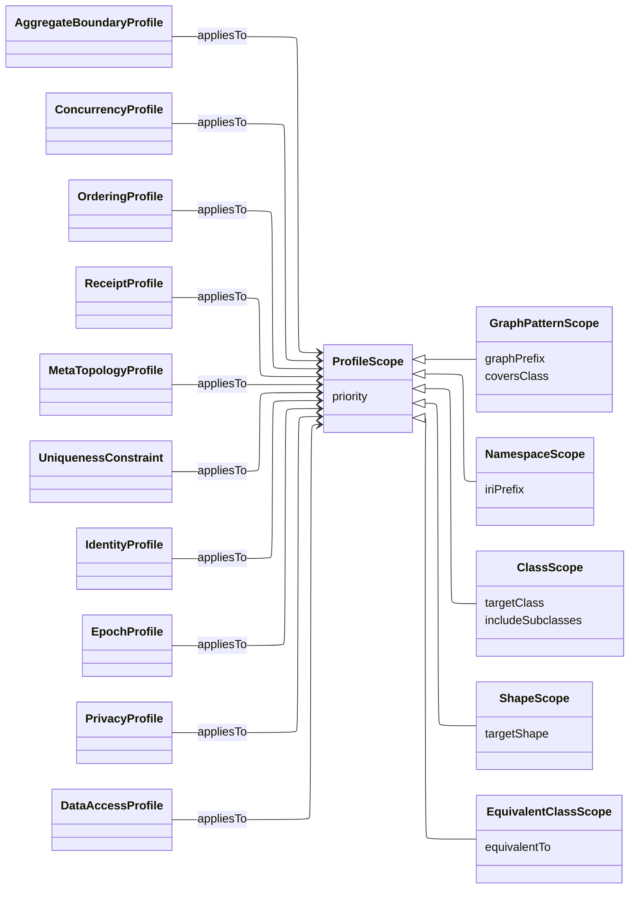

Every dimension resolves **on its own**, per target (§6). The table lists each one, the class that
declares it, its values, and the platform baseline default the compiler uses when no scope matches.

| Dimension | Declared on | Values | Baseline | § |
|---|---|---|---|---|
| Aggregate boundary | `dal:AggregateBoundaryProfile` (`dal:strategy`) | `dal:NamedGraphBoundary`, `dal:CompositePropertyBoundary`, `dal:NoBoundary` | named graph | 7.1 |
| First write | `dal:AggregateBoundaryProfile` (`dal:firstWrite`) | `dal:AbsentRow`, `dal:PreCreatedRow` | absent row | 7.1 |
| Concurrency | `dal:ConcurrencyProfile` (`dal:concurrencyProfile`) | `dal:ProvidedConcurrency`, `dal:Optimistic`, `dal:AppendOnly`, `dal:LockingConcurrency` (marker only) | provided | 7.2 |
| Deadlock policy | `dal:ConcurrencyProfile` | `dal:EngineDetectAndRetry`, `dal:SortedAcquisition`, `dal:PartitionedWriter` | engine detect and retry | 7.2 |
| ETag form and representation | `dal:ConcurrencyProfile` | `dal:StrongEtag`/`dal:WeakEtag`, `dal:SingleRepresentation`/`dal:TaggedRepresentation` | strong, single | 7.2 |
| Ordering grain | `dal:OrderingProfile` (`dal:orderingGrain`) | `dal:CommitGrain`, `dal:EventGrain` | commit | 7.3 |
| Dataset tier | `dal:OrderingProfile` (`dal:datasetTierModel`) | `dal:DerivedFeed`, `dal:GlobalDenseCounter`, `dal:HybridLogicalClock` | none | 7.3 |
| Global read | `dal:OrderingProfile` | `dal:WatermarkedRead`, `dal:LagWindowRead` (with `dal:lagWindowMillis`), `dal:DenseFeedRead`, `dal:NoGlobalRead` | none | 7.3 |
| Contiguity check | `dal:OrderingProfile` | `dal:BlockingContiguityCheck`, `dal:AdvisoryContiguityCheck` | blocking | 7.3 |
| Receipt model | `dal:ReceiptProfile` (`dal:receiptModel`) | `dal:ReceiptOnly`, `dal:PatchLog`, `dal:SnapshotPerRevision` | receipt only | 7.4 |
| Retention | `dal:ReceiptProfile` | `dal:PrefixOnlyRetention`, `dal:BucketAnyRetention`, plus `dal:asOfFloorSource` | prefix only | 7.4 |
| Meta topology | `dal:MetaTopologyProfile` (`dal:metaTopology`) | `dal:SharedSharded`, `dal:PerAggregate`, plus `dal:metaShards`, `dal:txnShards`, `dal:logShards`, `dal:keyShards`, `dal:registryGraph` | shared, sharded | 7.5 |
| Uniqueness | `dal:UniquenessConstraint` | many-valued: zero, one or several keyed constraints per target | none | 7.6 |
| Identity minting | `dal:IdentityProfile` | one `dal:IdentityStrategy` per `dal:ResourceRole`, each role its own dimension `identity:<Role>` | none | 7.7 |
| Epoch | `dal:EpochProfile` | authority: `dal:ExternalHighWaterMark`, `dal:RestoreControlledEpoch`, `dal:WriterStartRefusal`, `dal:StoreLocalEpoch` (warned). Guard: `dal:DatasetLevelGuard`, `dal:RowLevelGuardOnly` (warned) | row-level guard (warned) | 7.8 |
| Privacy and erasure | `dal:PrivacyProfile` | class: `dal:PersonalData`, `dal:InternalData`, `dal:PublicData`. Strategy: `dal:PerSubjectGraphDrop`, `dal:CryptoShred`, `dal:NoErasure`. Precedence: `dal:ErasureWins`, `dal:MonotonicityWins` | none | 7.9 |

"None" means the absence is itself meaningful and checked where it matters: an undeclared privacy
profile means "this scope declares no privacy stance", not "this scope is public data". The epoch
guard's baseline is the discouraged row-level guard, kept so that no existing deployment's generated
SPARQL changed when the dimension was introduced, and it raises its warning whether it was declared
or defaulted.

**Two authoring conveniences.**

- A **`dal:DataAccessProfile`** is sugar: one node declaring several dimensions at one scope. It
  decomposes into the same per-dimension model and is never a special case.
- **Extension properties** (`dal:firstWrite`, `dal:etagForm`, `dal:lagWindowMillis`, the shard counts
  and the rest) each resolve as a dimension of their own, even though they share a class with another
  row. A node typed with a specific profile class must carry that class's primary value (for example
  `dal:concurrencyProfile` on a `dal:ConcurrencyProfile`), so an extension property declared on its
  own goes on a `dal:DataAccessProfile` node. The compiled profile records each resolved value, using
  `dal:resolvedLiteral` for literal-valued ones.

---

## 6. Scopes, targets and resolution

### 6.1 Five scope kinds

A scope says which resources a profile applies to. Four kinds need no reasoning, and one does:

| Scope kind | Matches | Needs reasoning |
|---|---|---|
| `dal:GraphPatternScope` | instances of the classes named by `dal:coversClass`, in graphs whose IRI starts with `dal:graphPrefix` | no |
| `dal:NamespaceScope` | resources whose own IRI starts with `dal:iriPrefix` | no |
| `dal:ClassScope` | asserted `rdf:type`, optionally with the asserted `rdfs:subClassOf*` closure (`dal:includeSubclasses`) | no |
| `dal:ShapeScope` | resources conforming to a named `sh:NodeShape`, resolved once at compile time | no |
| `dal:EquivalentClassScope` | resources reachable through `owl:equivalentClass` and `owl:intersectionOf` | **yes** |

### 6.2 A target is a class, plus a deployment

The compiler resolves profiles for **targets**. A target is a class, or a class together with one of
its deployments: a shared class written by two applied ontologies into two graph families is two
targets, because what differs between the deployments is which graph the data lives in, not the
class (ADR-A78 point 5). One target is compiled per `dal:GraphPatternScope` that covers the class,
plus an unscoped fallback for instances outside any of them.

Every other scope kind matches on the class alone, so its values apply across all of the class's
deployments. Two consequences matter when designing a configuration:

- **Profiles cannot vary per instance.** Two instances of one class in the same deployment always get
  the same profile. Data that needs different treatment is told apart by class, or by the graph it is
  written to.
- **A shared class carries no profile of its own.** Authority belongs to whichever applied ontology
  deploys it, scoped to that deployment's graph pattern, which structurally outranks a bare class
  scope.

### 6.3 Precedence

When several profiles declare a value for the same dimension at scopes that all match one target,
the compiler picks one, the same way every time, on any machine
([precedence and resolution](docs/precedence-and-resolution.md)):

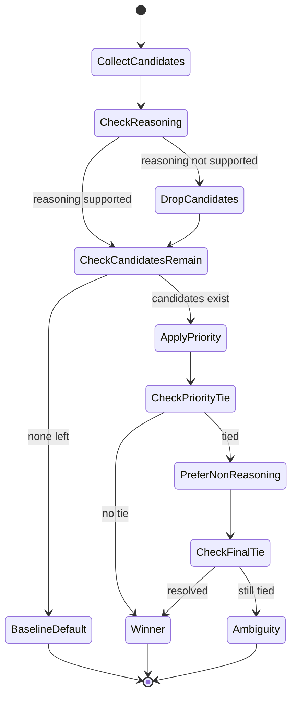

The algorithm never ranks scope kinds against each other: a graph-pattern scope naming one exact graph
can be narrower than a class scope matching millions of individuals, so `dal:priority` is how an
adopter says what they mean. A remaining tie is a refusal, never a guess.

---

## 7. The dimensions, one by one

### 7.1 Aggregate boundary

**The question.** Which triples change together, and so must be written as one unit?

Only the adopter can say: whether an order's line items are part of the order, or independent
entities it refers to, is a fact about their domain
([aggregate boundaries](docs/aggregate-boundaries.md)).

| Strategy | What the aggregate is | Authoring | Write |
|---|---|---|---|
| `dal:NamedGraphBoundary` | everything in one named graph per aggregate root | `dal:graphIriTemplate` | the whole graph is replaced |
| `dal:CompositePropertyBoundary` | the closure reached from the root along declared properties | `dal:boundaryShape`, an `sh:NodeShape`, and `dal:maxTraversalDepth` | the closure is swept and rewritten |
| `dal:NoBoundary` | no aggregate: one property's value | `dal:valueGuardProperty` on the concurrency profile | a value-based guard on that property |

**Why replace whole.** If the previous version of an order had three line items and the new one has
two, a patch that forgets the third leaves a dangling triple. Replacing the aggregate makes each write
the complete new state, which is what an aggregate is. This is safe only because the version row lives
outside the payload graph: a whole-graph delete would otherwise erase the aggregate's own ordering
evidence on every write.

**Why a shape, not a sub-property.** A composite boundary is declared by pointing a SHACL shape at the
domain's own properties by IRI. Asserting a domain property as `rdfs:subPropertyOf dal:isCompositeOf`
was rejected (ADR-A78 point 4): it would leak OWL entailments into the domain ontology and create the
import dependency this ontology otherwise avoids. The compiler walks the shape once, offline, with a
cycle check. No store is ever asked to run SHACL to find a write's boundary, and the same shape can
keep serving the adopter's own validation.

**First write.** A family picks one way to create a version row, declared as `dal:firstWrite`:

- **`dal:AbsentRow`** (baseline). No row exists until a create operation writes the first payload,
  sequence 1, the first receipt and the head in one update. The create is a uniqueness problem (the
  row must not exist yet), with the same write-skew exposure as any key claim.
- **`dal:PreCreatedRow`**. A row at sequence 0 is written when the aggregate's id is allocated, so
  every later write, including the first, rewrites an existing statement. On stores with
  multi-version concurrency, this removes the creation race entirely.

### 7.2 Concurrency

**The question.** How are two writers to one aggregate kept from silently overwriting each other?

| Strategy | Means | Use when |
|---|---|---|
| `dal:ProvidedConcurrency` (baseline) | rely on the store. The compiler generates an unconditional write | no concurrent writers, or a store that serialises them |
| `dal:Optimistic` | the guarded compare-and-set of §4 | read-modify-write by concurrent writers on a store that detects write conflicts |
| `dal:AppendOnly` | the append form of §4: the store allocates the next position | event streams and decision records |
| `dal:LockingConcurrency` | a marker that mutual exclusion lives outside the store (an external lock, a single writer per partition) | the store's isolation is too weak or unknown. No guard is generated |

`dal:minConcurrencyLevel` (`dal:Linearizable`, `dal:BestEffort`) records the level the family needs,
which a capability check compares with the store (§8).

**Choosing, by situation** (guide §16.6):

| Situation | Use |
|---|---|
| one aggregate per graph, HTTP in front (LDP, Solid, Graph Store Protocol with ETags) | HTTP preconditions over the same version row |
| a store with a real transaction API | explicit serializable transactions, with the guards as defence in depth |
| a store with only a SPARQL Update endpoint | `dal:Optimistic`: guarded single-request update, transaction claim, receipts, retry, verified by the conformance tests |
| weak or unknown isolation | a single-writer queue or an external lock with fencing tokens (`dal:LockingConcurrency`) |
| audit, offline clients, multi-master | a patch log or event sourcing (§7.4) |

**Deadlocks across aggregates.** A write that touches two version rows can deadlock on stores that
lock, or livelock on stores that abort and retry. SPARQL specifies no evaluation order, so listing the
rows in sorted order in the query text does not make the engine acquire them in that order.
`dal:deadlockPolicy` says who is responsible:

- **`dal:EngineDetectAndRetry`** (baseline). The engine detects deadlocks. An abort is treated as an
  ordinary conflict and retried with jitter.
- **`dal:SortedAcquisition`**. The client itself acquires in sorted order. Valid only for multi-request
  transactions and external locks, where acquisition really is separate steps. The compiler warns when
  it is combined with a single guarded update.
- **`dal:PartitionedWriter`**. Every target of a multi-target write goes through one partition, so no
  ordering is needed.

**ETags.** `dal:etagForm` should stay `dal:StrongEtag`: HTTP `If-Match` requires strong comparison,
and a weak tag never satisfies it, so a store emitting weak tags would fail every conditional write
(a warning, `dal:WeakEtagCasWarningShape`). A strong tag also promises identical bytes for every
response carrying it, so a store serving several media types either serves one representation for
conditional requests (`dal:SingleRepresentation`) or folds the representation into the tag
(`dal:TaggedRepresentation`).

**Value-based guards.** With `dal:NoBoundary`, compare-and-set guards on the old value of one property
(`dal:valueGuardProperty`) instead of a version row. It suits a status field in a state machine, and it
cannot detect a concurrent change to any other field.

### 7.3 Ordering

**The question.** In what order did changes happen, and can a consumer tell whether it missed one?

"Ordering" names five different requirements (guide §3.1), and conflating them causes most of the
trouble:

| | Requirement | Needs |
|---|---|---|
| O1 | total order for replay and sync: "everything after where I left off" | a dense, gap-detectable position |
| O2 | causal order per entity: version 3 supersedes version 2 | a per-stream counter |
| O3 | domain order: sorted by when things happened in the world | a valid time, with commit order only as a tiebreak |
| O4 | point-in-time reads: "as of last Tuesday" | history (§7.4) |
| O5 | ordered collections inside the data | a rank or index property, a different problem entirely |

Three clocks are kept apart, and never allowed to stand in for each other:

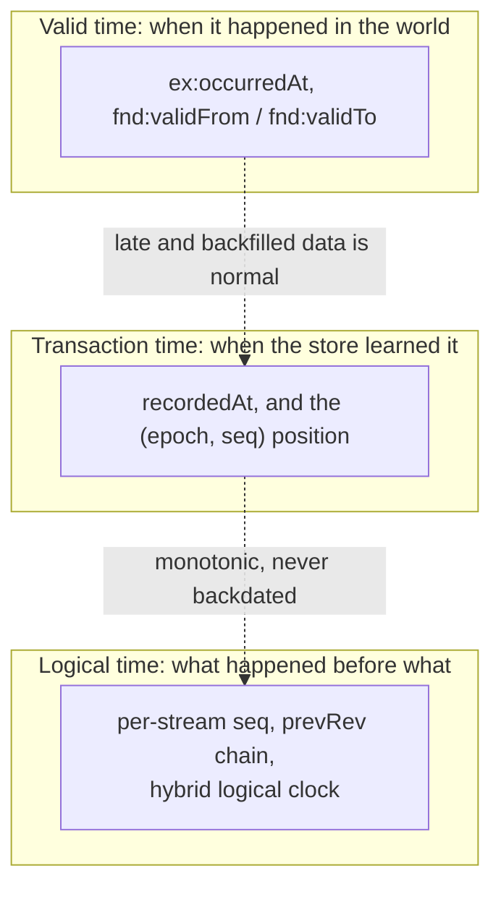

**Dense or sparse.** A dense counter has no gaps, so "did I miss anything?" is answerable, but writers
to one counter take turns. A sparse clock (a hybrid logical clock, a store's log position) never makes
writers wait, but gaps are expected and completeness cannot be checked. Both cannot be had at once. The
usable middle is **dense per stream, sparse across streams**, which is why the grain of a sequence
matters more than its encoding.

**Why the counter is in the writing transaction.** Any scheme that allocates a number before the
transaction commits loses data under concurrency:

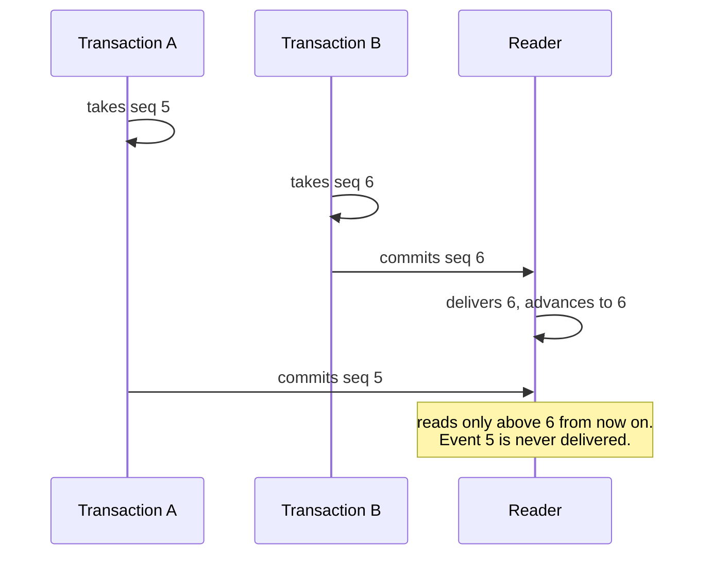

Putting the read-and-increment of the counter in the same update as the payload write, on one shared
statement, closes the hole: the transaction that commits position *n+1* necessarily read the value
committed by the holder of *n*. Allocation order equals commit order, the sequence is dense, and
aborted transactions consume nothing (guide §9, G2). The version row is that statement, so the
compare-and-set guard and the dense counter are the same operation.

**Grain.** `dal:orderingGrain` is `dal:CommitGrain` (one position per write, the baseline) or
`dal:EventGrain`, where one write carrying several events orders them by a client-supplied ordinal,
`opSeq` (`dal:opSeqRequired true`). A SPARQL update cannot generate distinct ordinals itself: `NOW()`
is constant within an execution, and `UUID()` is unordered. Commit grain with `opSeq` required is
refused as contradictory.

**The dataset tier.** The per-stream tier comes free with the version row. A total order across
streams is a separate, weaker, derived concern, declared by `dal:datasetTierModel`:
`dal:DerivedFeed` (the store's own dense change feed), `dal:GlobalDenseCounter` (affordable only on
a store that already serialises every write) or `dal:HybridLogicalClock` (sparse, comparable across
nodes). A single dataset-wide counter in the meta graph would make every write in the dataset
contend on one statement, so it is never the default.

**Reading across streams.** `dal:globalReadStrategy` says how a consumer of the dataset tier reads
without skipping a write that commits late:

| Strategy | Reads up to | Needs |
|---|---|---|
| `dal:WatermarkedRead` | a published watermark below which no writer can still land | a watermark source |
| `dal:LagWindowRead` | now minus a fixed lag | `dal:lagWindowMillis`, at least the maximum transaction time plus clock skew plus replica lag plus a margin |
| `dal:DenseFeedRead` | the store's own dense change feed | a backend with one |
| `dal:NoGlobalRead` | nothing: only per-stream reads exist | no cross-aggregate consumers (warned when a dataset tier is declared) |

A hybrid logical clock is stamped before the transaction commits, so a read without an upper bound
can deliver past a write that is still in flight and skip it forever. The upper bound is what makes
the read safe, and a late-arrival audit backs it up.

**Contiguity.** A consumer checks that the sequence numbers it has seen per stream have no gaps.
`dal:BlockingContiguityCheck` (baseline) halts and raises an alarm on a gap, because a silently skipped
gap looks exactly like data loss. `dal:AdvisoryContiguityCheck` logs and continues, for a family whose
downstream reconciliation re-derives completeness independently, and is warned.

### 7.4 Receipts, history and retention

**The question.** What does the log remember about each write, and for how long?

Replacing an aggregate whole discards the difference between versions, so receipts alone order and
audit writes but cannot replay them. A family declares one of three models (guide Chapter 20):

| Model | Records | Gives | Costs | Use when |
|---|---|---|---|---|
| `dal:ReceiptOnly` (baseline) | that a write happened, where, and by which transaction | outcome, audit, order | lowest | compare-and-set outcomes and light audit are enough |
| `dal:PatchLog` | plus the triples each write added and removed, in delta graphs | replay, change data capture, as-of reads | about twice the write volume | downstream replay or deterministic history is needed |
| `dal:SnapshotPerRevision` | a sealed payload graph per revision | point-in-time reads without replay, immutable evidence | the most storage and graphs | compliance, forensics, data already addressed by revision |

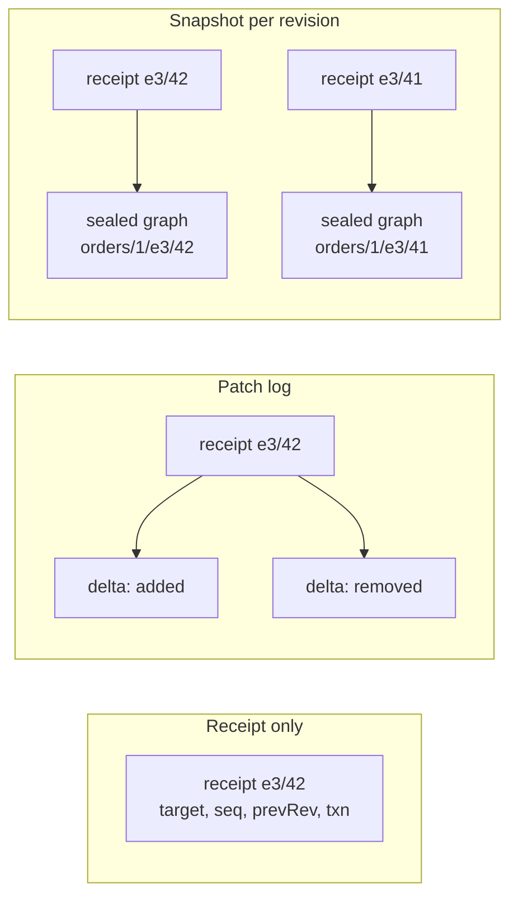

Decision records (eligibility decisions, behaviour state changes, MORK outcomes) are always
append-only, so for them a receipt-only model with whole replace is not an option. A composite
boundary with receipts only is refused: a closure sweep is not a single graph replace, and a receipt
could not say what changed inside it. A graph family whose targets resolve to different receipt
models raises a warning, so a consumer is told rather than left to assume uniformity.

**Retention.** History that is kept forever grows forever, so receipts are pruned (guide §24.2):

- **Only from the oldest end** (`dal:PrefixOnlyRetention`, baseline). Receipts live in monthly buckets,
  and buckets are dropped whole, oldest first. The oldest position that as-of replay can reconstruct is
  then one number per family. Dropping a bucket from the middle would leave a hole that replay reads
  across silently, so `dal:BucketAnyRetention` with an as-of floor is refused.
- **Low-water marks first.** Before a bucket is dropped, each affected stream's retention low-water
  mark is raised in its own transaction, so a gap check never mistakes pruning for loss.
- **Live heads are carried forward.** A stream written once in March and never since still has its head
  receipt in March's bucket. Before dropping it, the retention job copies every receipt that is still
  some stream's head into a pinned-heads graph.
- `dal:asOfFloorSource` names the job that advances the as-of floor.

Retention, epoch bumps and the erasure procedure are housekeeping (ADR-A80): the compiler does not
generate them, and this vocabulary records the choices they must honour.

### 7.5 Meta topology

**The question.** Where do the version rows live, and what do concurrent writers collide on?

| Topology | Version rows | Strength | Cost |
|---|---|---|---|
| `dal:SharedSharded` (baseline) | in a fixed set of meta graphs, `dal:metaShards` of them, by hash | controls the number of graphs | collisions are as fine as the store's conflict detection within a graph |
| `dal:PerAggregate` | one meta graph per aggregate | isolates conflicts on stores that detect them per graph | doubles the number of graphs |

Neither is better in general. Which wins depends on whether the store detects conflicts per
statement, per graph or per page, which only a conformance test on the target store can say. Sharding
the meta graph is not enough by itself: every write also inserts into the transaction-claim graph, the
current log bucket and the key graph, so `dal:txnShards`, `dal:logShards` and `dal:keyShards` declare
how those are sharded too. The current templates still write one of each, and a declared count above 1
raises a `ShardingNotHonoured` warning.

Changing `dal:metaShards` moves every version row, which is a migration: the compiler refuses it unless
`dal:priorMetaShards` and `dal:epochBumpAcknowledged true` record that the epoch will be bumped (§7.8).
`dal:registryGraph` names the graph that lists the family's log, event, delta, transaction and key
graphs, so audits and readers find them by explicit links, never by scanning graph-name prefixes.

### 7.6 Uniqueness

**The question.** How is "no two people share an email" kept true when an RDF store will happily hold
both?

RDF gives one uniqueness guarantee for free: no duplicate triples. Everything people mean by "unique"
has to be built, and there are four kinds (guide Chapter 4):

| Kind | Example | Difficulty |
|---|---|---|
| K1 cardinality | a person has at most one tax number | easy: `sh:maxCount 1` |
| K2 global key | no two people share an email | hard: needs a scan or an index |
| K3 scoped key | an order number is unique per tenant | hard, plus normalisation |
| K4 entity identity | do not mint two IRIs for one real-world thing | the one that bites in production |

The patterns reduce K2 and K3 to K1, because cardinality is the only kind every store checks cheaply.
They are stacked, not chosen between (guide Chapters 5 to 8):

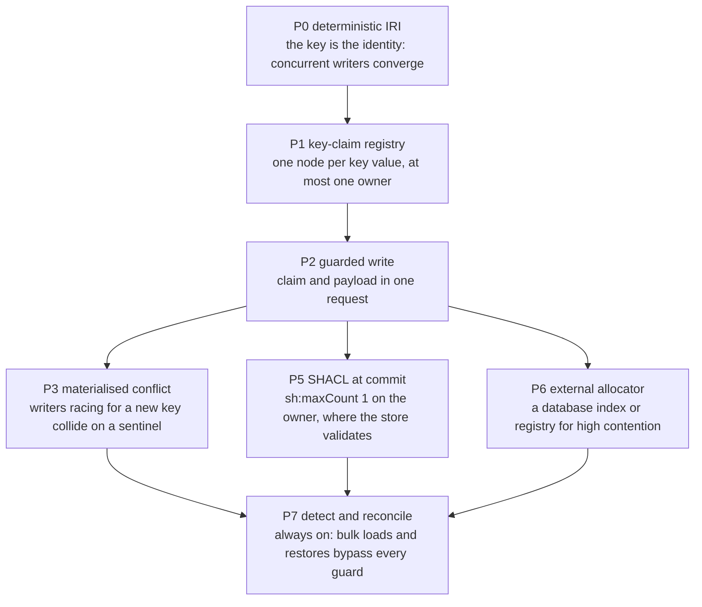

**P0, the key as the identity.** If an entity's IRI is derived from its key, a second insert of the same
thing is a no-op and uniqueness is structural. It suits only keys that are immutable and not personal
data: a changed key changes the identity, and a hash of an email can be reversed by trying a list of
emails.

**P1, the claim node.** For mutable or sensitive keys, the deterministic node is minted for the *key
value* instead, and owned by the entity, which keeps an opaque IRI:

```turtle
GRAPH <urn:g:keys> {
  <urn:key:person-email:v1:XUBJFDLLB7FTG552FYCFIMRUR4>     # HMAC of (scheme version, constraint, tenant, normalised email)
      a              pat:KeyClaim ;
      pat:constraint "person-email-unique" ;
      pat:claimedBy  <urn:person:8f2c1b7e-3e4a-4f7c-9a6d-2b1e0c5d7f90> .   # at most one
}
```

The claim IRI is a keyed hash (HMAC) under a secret only the platform holds, so the keys graph is an
index of every email without revealing any of them. All writers for one key now touch the same
subject, which is what makes conflict detection, locking and sharding work. "Find the person with
this email" becomes a one-triple lookup.

**P2, the guarded write.** The claim and the payload are written in one update that applies only if
no other owner holds the claim. Ownership is monotonic, since only a claim's own owner releases it, so
a follow-up `ASK` that sees the claim proves the write applied. The remaining gap is two different
writers racing for a key nobody holds yet, which P3, P5 or P6 closes depending on the store.

A `dal:UniquenessConstraint` declares one keyed constraint:

| Property | Says |
|---|---|
| `dal:constraintId` | the constraint's stable name, part of every claim IRI |
| `dal:keyProperty` | an RDF list of the properties whose values make the key |
| `dal:scopeProperty` | the property whose value scopes uniqueness, typically the tenant |
| `dal:normalizePipeline` | how key values are normalised before the claim is computed |
| `dal:claimScheme` | the claim scheme or schemes in use (rotation, below) |
| `dal:onViolation` | `dal:Reject` (baseline), `dal:Merge` or `dal:Quarantine` |
| `dal:mergeRelation` | the relation a merge records, required with `dal:Merge` |
| `dal:minEnforcementLevel` | `dal:Advisory`, `dal:Transactional` or `dal:Strong` |

**Normalisation is where uniqueness actually breaks.** `"A@B.com"` and `"a@b.com"`, an NFC and an NFD
`"café"`, a trailing space, a zero-width space: each pair has been treated as equal by a person and
different by a store. A constraint names one frozen pipeline, applied identically by the write path,
the reconciler and any backfill, and always in the application, since SPARQL cannot normalise Unicode
(guide §8.1). The pipelines are the minting specification's three:

| Pipeline | Steps | For |
|---|---|---|
| `dal:NfkcTrimCasefold` | NFKC case folding, then trim | caseless matching of human text, such as an email |
| `dal:NfkcTrimUppercase` | NFKC, trim, Unicode uppercase, NFKC again | codes conventionally upper case, such as a SKU |
| `dal:NfkcTrimLowercase` | NFKC, trim, Unicode lowercase, NFKC again | codes conventionally lower case |

**Rotating the claim secret.** Rotation changes every claim IRI, so it is never a single cutover. A
`dal:ClaimScheme` fixes every byte of a claim IRI (version, key identifier, digest, template) and moves
through four states:

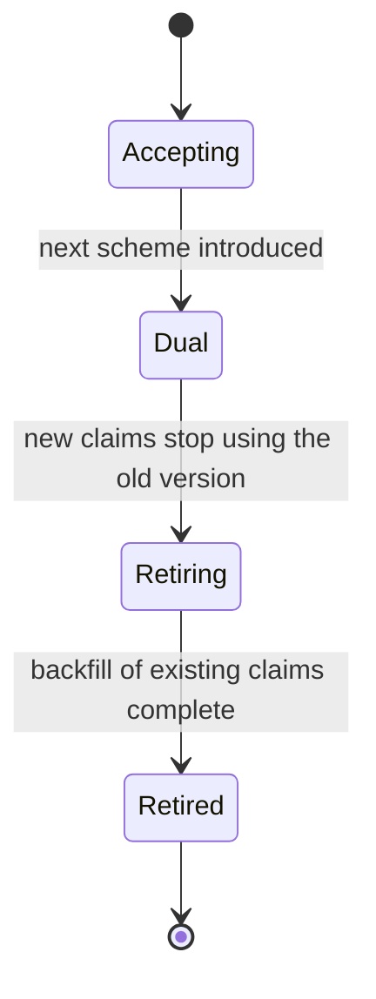

While two schemes are `dal:Dual`, the compiler selects a write that guards and inserts both versions'
claims for the same owner in one update, so no window opens in which a key is claimed under only one.

**Violations select a reconciler, not a different write.** The guarded write always prevents the race
at write time. But bulk loads, administrative `LOAD`s and restores bypass every guard, so a reconciler
runs regardless: "the reconciler is never the only strategy, and it is never absent" (guide §7.5).
`dal:onViolation` chooses which:

| `dal:onViolation` | Reconciler | What it does |
|---|---|---|
| `dal:Reject` (baseline) | `key-claim-duplicate-audit` | read-only: reports every over-claimed key |
| `dal:Merge` | `key-claim-merge-rewrite` | records `dal:mergeRelation` from each non-canonical owner to the lexicographically lowest owner IRI, never `owl:sameAs` |
| `dal:Quarantine` | `key-claim-quarantine` | copies the owners of every over-claimed key into a quarantine graph for review, deleting nothing |

None resolves a duplicate end to end. Rewriting references to a merge's canonical IRI, and retiring a
losing claim, stay with the caller, since only a claim's owner may retire it. A merge names a plain,
revocable relation the adopter's ontology defines, because `owl:sameAs` under a reasoner spreads to
every statement about both entities and cannot be retracted cleanly if the merge was wrong.

A key property must lie inside the aggregate it belongs to: with a composite boundary, a key property
the boundary shape cannot reach is refused.

### 7.7 Identity minting

**The question.** What IRI does each resource get, and who decides?

LATTICE does not pick an identity scheme for an adopter (ADR-A82). An IRI can name very different
things, with different needs for stability, privacy and ordering (identity guide §2):

| Resource role | Names | Typical stability |
|---|---|---|
| `dal:EntityRole` | a real or conceptual thing: a customer, a policy | long-lived |
| `dal:AggregateRootRole` | the unit of consistency | domain-defined |
| `dal:ComponentRole` | a part of an aggregate or artefact | depends on containment |
| `dal:LineageRole` | an enduring authored artefact family | long-lived |
| `dal:ContentRevisionRole` | one exact immutable content state | immutable |
| `dal:GraphLocatorRole` | where a graph is stored | deployment-local |
| `dal:KeyClaimRole` | a claim on a normalised key | retirable |
| `dal:EventOccurrenceRole` | something that happened, at a position | immutable, append-only |

A `dal:IdentityProfile` names one role and one strategy, so a class can take a different strategy per
role: an entity's own IRI may be a claimed surrogate while its event occurrences are position-derived.
Each role resolves as its own dimension, `identity:<Role>`.

| Strategy | Form | Deterministic | Key may change | Suits a personal-data key | Re-ingestion converges |
|---|---|---|---|---|---|
| `dal:NaturalKeyIdentity` | the encoded key in the IRI | yes | no | no | yes |
| `dal:DerivedHashIdentity` | a hash of the key | yes | no | no, unless keyed | yes |
| `dal:RandomSurrogateIdentity` | a UUID | no | yes | yes | no |
| `dal:SurrogateClaimedIdentity` | a UUID plus a keyed claim per key (P1) | the claim is | yes | yes | yes, by looking up the claim |
| `dal:ExternalRegistryIdentity` | issued by an outside registry | depends | depends | depends | if the registry is available |
| `dal:AdoptedIdentity` | an existing IRI, kept as it is | not applicable | not applicable | not applicable | yes |
| `dal:ContentAddressedIdentity` | a hash of canonical content | yes | not applicable | only if the content permits | yes |

**`dal:SurrogateClaimedIdentity` is the recommended general-purpose choice** for entities whose keys
are mutable or sensitive: the entity's IRI stays stable through key changes, and the claim gives
deterministic lookup and enforced uniqueness. A claimed identity names the uniqueness constraint it
claims (`dal:claimsConstraint`), and a natural-key or derived-hash identity the constraint it mints
from (`dal:keyConstraint`): without it the compiler refuses the profile, because the key it names would
not be the entity's key.

**Why personal data never goes in an IRI.** IRIs end up in logs, URLs, caches and dumps. A natural-key
IRI exposes the key outright, and an unkeyed hash of a low-entropy personal value (a national
insurance number, an email) is reversed by hashing every candidate. A keyed claim can be computed only
by the holder of the secret, which is why records of one person converge within a tenant, by looking
up the claim, and never correlate across tenants, whose secrets differ.

**Recipes, not code.** For each resolved role the compiler emits a self-contained **minting recipe**
(`dal:MintingRecipe`): canonical JSON with a digest, holding everything a minter needs, such as the
template, key properties, normalisation pipeline, digest scheme and widths. Missing members are refused
by name. `export-recipes` writes them out for the
[minting libraries](../../docs/architecture/decisions/ADR-A84-standalone-minting-libraries.md) or any
implementation of the
[identity minting specification](../../docs/architecture/identity-minting-specification.md), and
conformance is defined by test vectors, not by LATTICE's code.

**Event identities.** `dal:eventIdentityStrategy` chooses `dal:PositionDerivedEvent` (an IRI from
target, epoch and sequence), `dal:RandomOccurrenceEvent` or `dal:ExternalEventIdStrategy`. A
position-derived event has a hazard a random one does not: two writers that both believe they won
under broken isolation mint the identical subject, so a check that counts subjects can never fire.
Such a profile must require a separate uniqueness witness (`dal:uniquenessWitnessRequired`), such as
the transaction id. Its namespace is derived from the target's IRI (`dal:HashedTargetDerivation`,
which needs a `dal:digestScheme`) or allocated by a registry (`dal:RegistryTokenDerivation`).

**Fixed widths.** Positions inside identity-bearing strings use one exact width per profile
(`dal:epochWidth`, `dal:sequenceWidth`), 19 digits in the examples, the width of a signed 64-bit
integer. Unpadded `e10` sorts before `e3`, and "short in examples, long in production" is two schemes,
not one.

### 7.8 Epoch

**The question.** What stops a restore from making old positions mean new things?

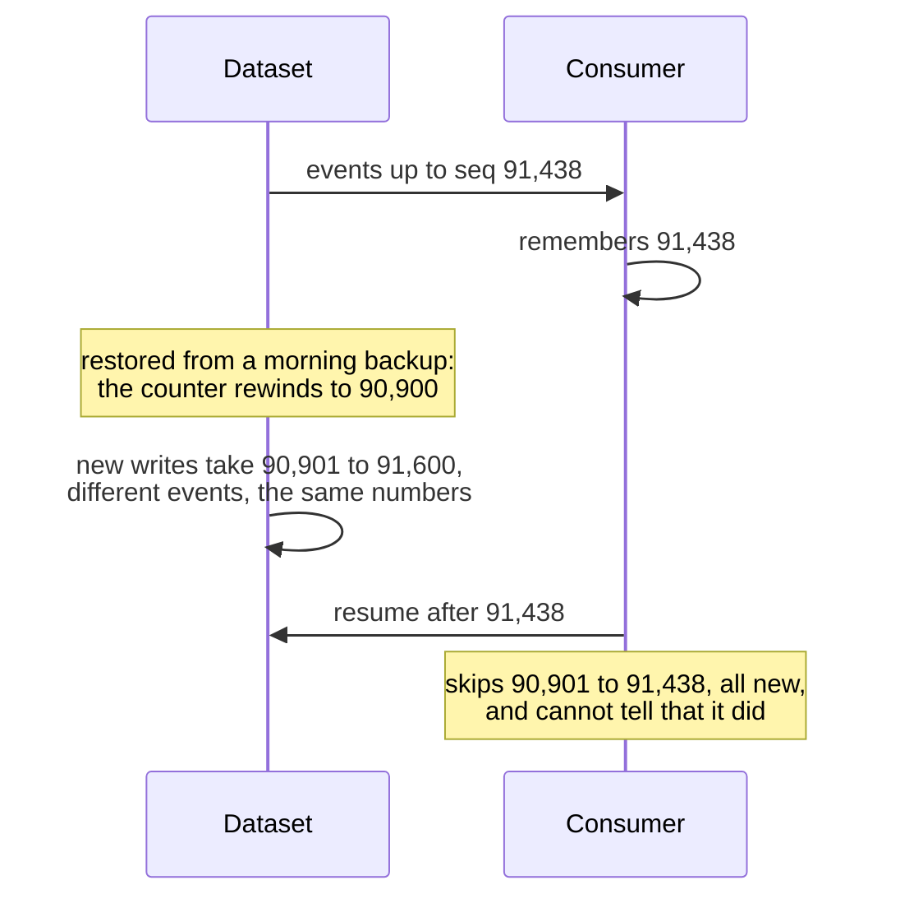

The fix is an **epoch** on the dataset, bumped on any restore, rebuild, re-key or migration, with
every position the pair `(epoch, seq)`. A consumer whose epoch no longer matches resynchronises
instead of resuming, and every open ETag goes stale at once, which is intended (guide §9, G4).

An epoch is safe only if two things hold (identity guide §10.3):

1. **The new epoch cannot come from the restored data**, or restoring the same backup twice reuses the
   epoch the first restore allocated. `dal:epochAuthority` says where it comes from:

   | Authority | Mechanism | Safety |
   |---|---|---|
   | `dal:ExternalHighWaterMark` | an outside system tracks the highest epoch ever issued, named by `dal:epochCoordinatorBinding` | fail-safe |
   | `dal:RestoreControlledEpoch` | the restore tooling allocates and records the epoch from its own log | as strong as the runbook |
   | `dal:WriterStartRefusal` | writers refuse to start until they see an externally acknowledged new epoch | fail-safe, at a cost in availability. Combinable with either above |
   | `dal:StoreLocalEpoch` | the epoch lives only in the dataset | warned: a double restore reuses an epoch |

2. **Every write guards on the dataset's current epoch.** `dal:epochGuardScope` is `dal:DatasetLevelGuard`
   (each write compares the dataset node) or `dal:RowLevelGuardOnly` (each write compares only the
   row's own epoch, warned). A row-level guard never sees a bump until the row is next written, so a
   stale client still matches. Under the dataset guard, a row keeps its older epoch until its next
   write rebases it, and its sequence continues, so the receipt chain crosses the boundary unbroken.

The restore runbook (guide §24.4), which housekeeping carries out: quiesce writers for at least the
maximum transaction time, allocate the new epoch from the declared authority, replay the erasure
register where the family holds personal data (§7.9), confirm the dataset-level guard, re-admit
writers, and run the reconciler, gap scan and fork audits before declaring the dataset healthy.

### 7.9 Privacy and erasure

**The question.** How is one person's data removed when the law requires it, from a store whose other
patterns keep history?

A `dal:PrivacyProfile` declares the data's class (`dal:PersonalData`, `dal:InternalData`,
`dal:PublicData`), how a subject is erased, and what wins when erasure meets claim monotonicity:

| Strategy | Erases by |
|---|---|
| `dal:PerSubjectGraphDrop` | dropping the subject's own aggregate graph |
| `dal:CryptoShred` | destroying the key the subject's data is encrypted under |
| `dal:NoErasure` | not erasing: refused for personal data |

A family holding personal data keeps **one aggregate per subject**, so erasing one person rewrites
nobody else's data. Its version rows, receipts and transaction claims carry opaque IRIs and positions
only. Erasure is by decision: a non-personal decision record is written first, then the payload is
dropped or its key destroyed, and the version row is tombstoned so the subject's IRI and positions
are never reused (guide §24.5).

**History models can defeat erasure.** A patch log or a snapshot per revision keeps a second,
immutable copy of the payload, which a graph drop does not reach (identity guide §11.6):

| History model | Compatible with personal data and graph-drop erasure? |
|---|---|
| receipt only | yes: receipts carry pseudonymous references only |
| patch log | only if every delta graph is per subject (`dal:perSubjectScoped true`), or the family uses `dal:CryptoShred` |
| snapshot per revision | the same condition |

The compiler refuses personal data with no erasure, and personal data with a replay-capable model that
is neither per-subject nor crypto-shredded.

**Key claims are personal data too.** A claim IRI is an HMAC pseudonym of the key, and pseudonymised
data is still personal data. `dal:erasurePrecedence` decides: under `dal:ErasureWins` the subject's
claims are physically deleted, which breaks the rule that only an owner releases its claim, and is
acceptable because the release is on the owner's behalf. Under `dal:MonotonicityWins` erasure of a
claimed key waits for an explicit reconciliation.

**Erasure must survive a restore.** A backup predates every erasure made after it was taken, so
restoring it would bring erased subjects back. An append-only erasure register held outside the
dataset and its backups (`dal:erasureRegisterBinding`) is replayed before readers or writers are
admitted (`dal:erasureReplayOnRestore true`).

---

## 8. Capability self-checks

The compiler builds no store interface and consults no live backend. For each target it computes an
unconditional `dal:CapabilityRequirement` from the resolved profile alone: the concurrency level the
family needs, whether resolution relied on reasoning, the uniqueness enforcement level.

An adopter may **optionally** supply a `dal:CapabilitySpec`, their own unverified statement of what
their environment provides, and the compiler checks the requirement against it:

```turtle
ex:MyFusekiEnvironment a dal:CapabilitySpec ;
    dal:appliesToTarget           ex:LoanApplication ;
    dal:providesCas               "LINEARIZABLE" ;
    dal:providesReasoning         false ;
    dal:providesCommitValidation  "NONE" .
```

A spec that says no reasoning is available also makes resolution drop reasoning-dependent scopes
(§6.3). Without a spec, nothing is dropped or downgraded: the compiler assumes the most any backend
could provide and records what its resolution depended on.

**Why unverified.** A compiler that needed a live store before producing anything would make every
adopter expose a running database to a design-time tool (ADR-A79). The truth about a store comes from
running the conformance tests against it (guide Chapter 27): a store's documentation says what its
isolation should be, and only the tests say what it is.

---

## 9. What the compiler produces

`python -m persistence compile` runs five stages and emits a `dal:CompiledProfile` per target:

| Stage | Output | Fails with |
|---|---|---|
| Load | one graph: this ontology, the adopter's configuration and applied ontology | malformed Turtle |
| Resolve | one value per dimension per target, each with the profile that won and how many candidates there were (`dal:ResolvedDimension`) | `ProfileAmbiguityError` |
| Validate | diagnostics: refusals and warnings (§12) | `CrossAxisViolation`, `BoundaryConflict`, `MissingBoundaryShapeError` |
| Select | one named template per generated operation | none: a lookup table |
| Emit | `dal:GeneratedOperation`s with reified `dal:ParameterBinding`s, minting recipes, the capability requirement | an encoder rejection |

The compiled profile names templates and parameters. It never embeds SPARQL text, so it is the same
whatever store will run it. `instantiate` mixes the parameters into the template library to produce
portable `.rq` files, and `export-recipes` writes the minting recipes as JSON. Neither assumes the other
is ever run, and an adopter who wants only the generated SPARQL can run both once and walk away.

**Which operations a target gets** follows from its dimensions:

| Configuration | Operations |
|---|---|
| `dal:Optimistic` with a named-graph boundary | `create-if-absent` (or `bootstrap-version-row` under `dal:PreCreatedRow`), `cas-replace`, `tombstone-delete` |
| `dal:Optimistic` with a composite boundary | `cas-replace` over the closure, and `bootstrap-version-row` under `dal:PreCreatedRow` |
| `dal:Optimistic` with no boundary | `cas-replace` guarded on `dal:valueGuardProperty` |
| `dal:AppendOnly`, or event grain with any concurrency other than `dal:Optimistic` | `bootstrap-version-row` and `append` |
| `dal:ProvidedConcurrency` or `dal:LockingConcurrency`, with commit grain | `unconditional-write` |
| each uniqueness constraint | `key-claim-write` (or its dual form during rotation), `key-claim-retire`, and the reconciler of §7.6 |
| every target | the audits: `gap-scan-audit`, `fork-detection-audit`, `revision-multi-txn-audit`, `txn-multi-revision-audit` |

Under `dal:DatasetLevelGuard`, the create, bootstrap, compare-and-set, tombstone and append operations
use their `-dataset-guard` variants. The value-guard and unconditional writes have none, and a
composite boundary currently binds only the first property its shape reaches. The compiler's own [README](../../tools/persistence/README.md) documents the parameters each
template takes, the obligations the generated SPARQL cannot enforce for the caller, and its known
limitations, among them: infrastructure graph IRIs are fixed constants rather than configurable,
declared shard counts are recorded but not yet applied, and retention and epoch bumps are left to
housekeeping.

---

## 10. Choosing a profile

The guide's decision procedure (Chapter 29), for each graph family, tenant or aggregate:

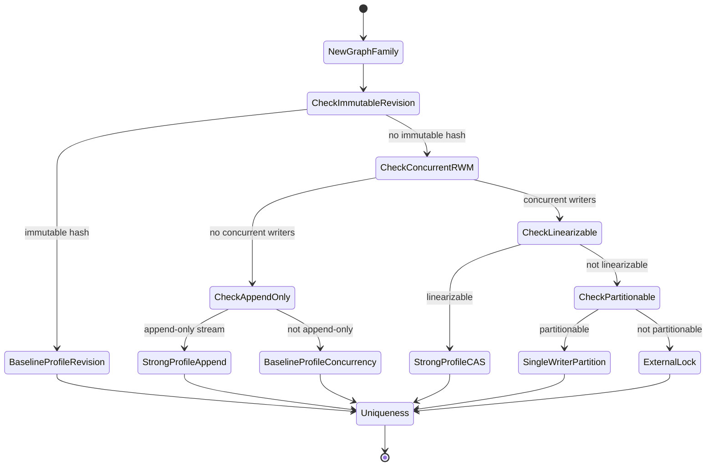

What each choice costs to run (guide §29.4):

| Choice | Gains | Pays | Must operate |
|---|---|---|---|
| baseline | simplicity, the store's own behaviour | no proven outcome, no dense order, no replay unless the store has it | the reconciler, and whatever the store needs |
| strong, compare-and-set | provable outcomes, lost updates impossible or loud, dense per-aggregate order, derived ETags | one extra hot statement per aggregate, receipt volume | transaction-claim pruning, log rotation with low-water marks and pinned heads, fork, duplicate and gap alerts, the epoch runbook |
| strong, append | gap-detectable streams, idempotent ingestion | writers take turns per stream, `opSeq` discipline | the same, and frozen stream keys |
| patch-log receipts | replay, change data capture, as-of reads | about twice the write volume, delta graphs | delta bucket rotation |

---

## 11. Worked examples

Each example is a fixture in [`examples/`](examples/), compiled by the tests in `tools/persistence`.

### 11.1 A minimal single-class profile

One class, a named-graph aggregate, compare-and-set, event grain, a patch log, shared sharded meta
graphs, and an application number unique per branch. The constraint attaches to the target through
its own `dal:appliesTo`, like any other profile:

```turtle
ex:LoanApplicationClass a dal:ClassScope ;
    dal:targetClass ex:LoanApplication ;
    dal:priority "20"^^xsd:integer .

ex:LoanApplicationStrongProfile a dal:DataAccessProfile ;
    dal:appliesTo           ex:LoanApplicationClass ;
    dal:strategy            dal:NamedGraphBoundary ;
    dal:graphIriTemplate    "urn:g:loan-application/{id}" ;
    dal:concurrencyProfile  dal:Optimistic ;
    dal:minConcurrencyLevel dal:Linearizable ;
    dal:orderingGrain       dal:EventGrain ;
    dal:receiptModel        dal:PatchLog ;
    dal:metaTopology        dal:SharedSharded ;
    dal:metaShards          "64"^^xsd:long .

ex:LoanApplicationNumberPerBranch a dal:UniquenessConstraint ;
    dal:constraintId        "loan-application-number-per-branch" ;
    dal:appliesTo            ex:LoanApplicationClass ;
    dal:keyProperty          ( ex:applicationNumber ) ;
    dal:scopeProperty        ex:branch ;
    dal:normalizePipeline    dal:NfkcTrimUppercase ;
    dal:onViolation          dal:Reject ;
    dal:minEnforcementLevel  dal:Transactional .
```

Full fixture: [`examples/baseline-single-class.ttl`](examples/baseline-single-class.ttl). Compiling it
(`python -m persistence compile spec/persistence.ttl examples/baseline-single-class.ttl --out
/tmp/compiled.ttl`) produces a `dal:CompiledProfile` with nine generated operations: create-if-absent,
cas-replace, tombstone-delete, key-claim write and retire, and the gap-scan, fork-detection,
revision-multi-txn and txn-multi-revision audits.

### 11.2 A shared class, two deployments

Two applied ontologies, lending and credit, both deploy the shared class `beh:Behaviour`, each into its
own graph family, and want different guarantees for it:

```turtle
ex:LendingBehaviourGraphs a dal:GraphPatternScope ;
    dal:graphPrefix "urn:g:lending/behaviour/" ;
    dal:coversClass beh:Behaviour ;
    dal:priority "10"^^xsd:integer .

ex:LendingBehaviourProfile a dal:DataAccessProfile ;
    dal:appliesTo ex:LendingBehaviourGraphs ;
    dal:concurrencyProfile dal:Optimistic ;
    dal:receiptModel dal:PatchLog .

ex:CreditBehaviourGraphs a dal:GraphPatternScope ;
    dal:graphPrefix "urn:g:credit/behaviour/" ;
    dal:coversClass beh:Behaviour ;
    dal:priority "10"^^xsd:integer .

ex:CreditBehaviourProfile a dal:DataAccessProfile ;
    dal:appliesTo ex:CreditBehaviourGraphs ;
    dal:concurrencyProfile dal:ProvidedConcurrency ;
    dal:receiptModel dal:ReceiptOnly .
```

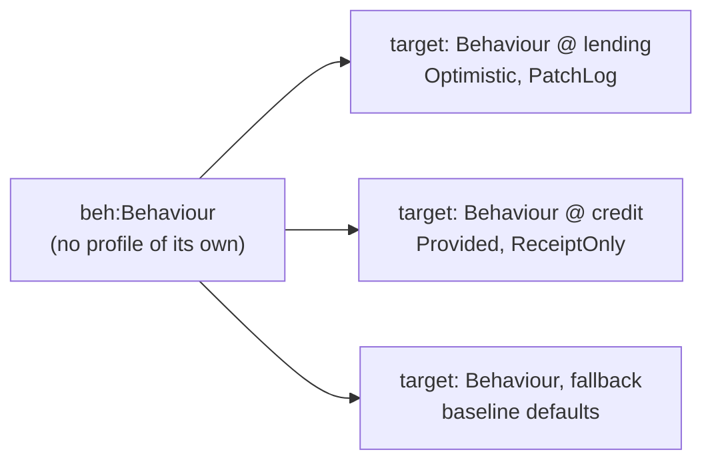

Full fixture, including the bare-class fallback and a reasoning-dependent `dal:EquivalentClassScope`
override: [`examples/lending-credit-shared-class.ttl`](examples/lending-credit-shared-class.ttl). The
compiler discovers **three** targets for `beh:Behaviour`: lending's deployment, credit's deployment,
and the unscoped fallback (§6.2). A `dal:DataAccessProfile` whose only scope is a bare
`dal:ClassScope` on a class outside its own namespace raises `dal:SharedClassProfileWarningShape`, a
warning rather than a refusal, since a deliberate global override is legitimate and is acknowledged
with `dal:acknowledgedSharedClassOverride`.

### 11.3 A composite-property aggregate, declared by a shape

An order and its line items form one aggregate. The customer the order refers to does not:

```turtle
ex:OrderAggregateShape a sh:NodeShape ;
    sh:targetClass ex:Order ;
    sh:property [ sh:path ex:lineItem ; sh:node ex:LineItemShape ; sh:minCount 1 ] .

ex:LineItemShape a sh:NodeShape ;
    sh:property [ sh:path ex:sku ; sh:datatype xsd:string ] .

ex:OrderBoundaryProfile a dal:AggregateBoundaryProfile ;
    dal:appliesTo         ex:OrderClass ;
    dal:strategy          dal:CompositePropertyBoundary ;
    dal:boundaryShape     ex:OrderAggregateShape ;
    dal:maxTraversalDepth "8"^^xsd:integer .
```

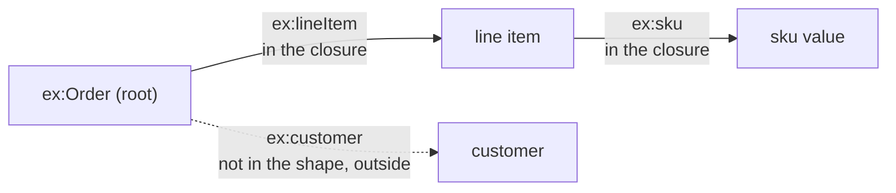

Full fixture: [`examples/composite-property-boundary-shacl.ttl`](examples/composite-property-boundary-shacl.ttl).
The compiler walks only `sh:property` and `sh:node`, so `sh:datatype`, `sh:minCount` and the rest are
left for the adopter's own validation. The generated update binds the closure's members in its `WHERE`
clause with a property path and rewrites them using the bound variables, since SPARQL allows a path in
a pattern but never in a `DELETE` or `INSERT` template. The version row's subject is the root
instance, since there is no graph to key it on.

### 11.4 Identity, epoch and privacy together

A claimant is personal data. Its entity IRI is a claimed surrogate (its email is mutable and
sensitive), its events are position-derived, its epoch comes from an external high-water mark, and its
data is erased by dropping the claimant's own graph:

```turtle
ex:ClaimantEntity a dal:ClassScope ;
    dal:targetClass ex:Claimant ;
    dal:priority "20"^^xsd:integer .

ex:ClaimantIdentity a dal:IdentityProfile ;
    dal:appliesTo          ex:ClaimantEntity ;
    dal:resourceRole       dal:EntityRole ;
    dal:identityStrategy   dal:SurrogateClaimedIdentity ;      # mutable, sensitive key (an email)
    dal:surrogateKind      dal:UuidV4Surrogate ;
    dal:mintedIriTemplate  "urn:claimant:{surrogate}" ;
    dal:claimsConstraint   ex:ClaimantEmailUnique ;            # the claim minted with the surrogate
    dal:namingAuthority    "adopter" .

ex:ClaimantEmailUnique a dal:UniquenessConstraint ;           # the key the claimed surrogate is minted from;
    dal:constraintId        "claimant-email-unique" ;          # without it the compiler refuses the identity profile
    dal:appliesTo            ex:ClaimantEntity ;
    dal:keyProperty          ( ex:email ) ;
    dal:scopeProperty        ex:tenant ;
    dal:normalizePipeline    dal:NfkcTrimCasefold ;
    dal:onViolation          dal:Reject ;
    dal:claimScheme          ex:ClaimantEmailSchemeV1 .

ex:ClaimantEmailSchemeV1 a dal:ClaimScheme ;                   # every byte of a claim IRI is fixed here,
    dal:schemeVersion      "v1" ;                              # so it changes only through rotation
    dal:schemeState        dal:Accepting ;
    dal:claimKeyId         "claimant-email-key-v1" ;           # names the secret, never holds it
    dal:claimDigestScheme  ex:ClaimantEmailMac ;               # HMAC-SHA-256, 128 bits, base32
    dal:claimIriTemplate   "urn:key:claimant-email:{schemeVersion}:{mac}" .

ex:ClaimantEvents a dal:IdentityProfile ;                      # a second role for the same class
    dal:appliesTo                     ex:ClaimantEntity ;
    dal:resourceRole                  dal:EventOccurrenceRole ;
    dal:identityStrategy              dal:DerivedHashIdentity ;
    dal:eventIdentityStrategy         dal:PositionDerivedEvent ;
    dal:occurrenceNamespaceDerivation dal:HashedTargetDerivation ;
    dal:uniquenessWitnessRequired     true ;
    dal:digestScheme                  ex:ClaimantEventDigest ;     # SHA-256, 128 bits, base32
    dal:mintedIriTemplate             "urn:ev:claimant:{namespace}/e{epoch}/{seq}" ;
    dal:epochWidth                    19 ;
    dal:sequenceWidth                 19 .

ex:ClaimantEpoch a dal:EpochProfile ;
    dal:appliesTo          ex:ClaimantEntity ;
    dal:epochAuthority     dal:ExternalHighWaterMark ;
    dal:epochCoordinatorBinding "postgres://coord/epoch_watermark" ;
    dal:epochGuardScope    dal:DatasetLevelGuard ;
    dal:erasureRegisterBinding  "postgres://coord/erasure_register" ;
    dal:erasureReplayOnRestore  true .

ex:ClaimantPrivacy a dal:PrivacyProfile ;
    dal:appliesTo          ex:ClaimantEntity ;
    dal:privacyClass       dal:PersonalData ;
    dal:erasureStrategy    dal:PerSubjectGraphDrop ;
    dal:erasurePrecedence  dal:ErasureWins .

ex:ClaimantReceipts a dal:DataAccessProfile ;
    dal:appliesTo          ex:ClaimantEntity ;
    dal:receiptModel       dal:ReceiptOnly ;          # required, given personal data + graph-drop erasure below
    dal:perSubjectScoped   true .
```

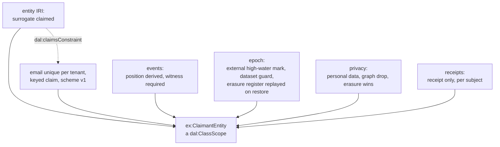

Why each piece is what it is:

- **The receipt model.** `dal:PersonalDataReceiptCompatibilityShape` would reject this scope with
  `dal:PatchLog` or `dal:SnapshotPerRevision` unless `dal:perSubjectScoped true` or
  `dal:CryptoShred` were also declared: not because receipts-only is preferred, but because the other
  two keep a second copy of the payload a graph drop cannot reach. An adopter who needs replay over
  personal data chooses crypto-shredding and specifies key custody.
- **Two identity roles.** `identity:EntityRole` and `identity:EventOccurrenceRole` resolve
  independently, and the compiler emits a minting recipe for each.
- **The event digest.** `ex:ClaimantEvents` needs a `dal:digestScheme` because its namespace is a
  digest of the target's IRI. A position-derived profile with `dal:RegistryTokenDerivation` needs none,
  and `dal:DigestSchemeRequiredShape` exempts exactly that combination (see `ex:ShipmentEvents` in
  `examples/identity-minting-coverage.ttl`).

Full fixture: [`examples/identity-epoch-privacy-profile.ttl`](examples/identity-epoch-privacy-profile.ttl).
The other identity, epoch, privacy and uniqueness fixtures, by the slice that added them:

| Fixture | Shows |
|---|---|
| [`identity-minting-anchors.ttl`](examples/identity-minting-anchors.ttl) | compiles to the seven recipes of `contracts/identity/anchor-vectors.json`, one per strategy |
| [`identity-minting-coverage.ttl`](examples/identity-minting-coverage.ttl) | four more recipes covering the remaining pipelines, encodings, surrogate kinds and namespace derivations. Both feed `packages/minting/testdata` |
| [`invalid-claimed-identity-without-key.ttl`](examples/invalid-claimed-identity-without-key.ttl), [`invalid-position-event-without-derivation.ttl`](examples/invalid-position-event-without-derivation.ttl) | refused identity profiles |
| [`epoch-dataset-level-guard.ttl`](examples/epoch-dataset-level-guard.ttl), [`warning-epoch-unsafe-restore.ttl`](examples/warning-epoch-unsafe-restore.ttl) | the epoch guard, and both discouraged values together |
| [`append-stream-dataset-guard.ttl`](examples/append-stream-dataset-guard.ttl) | an append-only stream under the dataset guard |
| [`extension-properties.ttl`](examples/extension-properties.ttl), [`invalid-lagwindow-missing.ttl`](examples/invalid-lagwindow-missing.ttl) | each extension property on its own profile node, and a lag-window read with no lag |
| [`invalid-personaldata-no-erasure.ttl`](examples/invalid-personaldata-no-erasure.ttl), [`invalid-personaldata-receipt-conflict.ttl`](examples/invalid-personaldata-receipt-conflict.ttl), [`privacy-receipt-compatible.ttl`](examples/privacy-receipt-compatible.ttl) | refused privacy combinations, and a compatible one declared across two profile nodes |
| [`uniqueness-merge-policy.ttl`](examples/uniqueness-merge-policy.ttl), [`uniqueness-quarantine-policy.ttl`](examples/uniqueness-quarantine-policy.ttl), [`invalid-merge-policy-no-relation.ttl`](examples/invalid-merge-policy-no-relation.ttl) | the violation policies, and a merge naming no relation |
| [`claim-scheme-dual-rotation.ttl`](examples/claim-scheme-dual-rotation.ttl) | two schemes in state `dal:Dual`, selecting the dual-guard write |

### 11.5 Every example, and the SPARQL it compiles to

Every example in [`examples/`](examples/) compiles to SPARQL, and the table below says where to
look for each kind of configuration. **The output is generated, not committed**, so on a fresh
checkout generate it first, from the repository root:

```bash
mise run bootstrap:persistence
mise run build:persistence-execution
```

The first installs this checkout's compiler. The second compiles every example and writes `ontology/persistence/execution/`, which git ignores:
one directory per example, holding the generated SPARQL in `sparql/`, one directory per target
(`<Class>`, or `<Class>.<deployment scope>` for a graph-pattern deployment), and any minting
recipes in `recipes/`. A refused example holds `refused.txt`, the compiler's refusal. Reading an
example beside its directory shows what each configuration choice does to the SPARQL. Every
target also gets the four audits (`gap-scan-audit`, `fork-detection-audit`,
`revision-multi-txn-audit`, `txn-multi-revision-audit`), omitted from the table.

| Mapping | Configuration | Generated, under `execution/<example>/` |
|---|---|---|
| named-graph aggregate, compare-and-set, a key per branch | [`baseline-single-class`](examples/baseline-single-class.ttl) | the strong write set: `sparql/LoanApplication/create-if-absent.rq`, `sparql/LoanApplication/cas-replace.rq`, `sparql/LoanApplication/tombstone-delete.rq`, the key claim write and retire, four audits |
| the same, with a declared capability spec | [`capability-spec-example`](examples/capability-spec-example.ttl) | the same SPARQL as `baseline-single-class`: a capability spec checks a profile, never changes what it generates |
| named graph under the dataset-level epoch guard | [`epoch-dataset-level-guard`](examples/epoch-dataset-level-guard.ttl) | `sparql/LoanApplication/cas-replace.rq`, which compares `urn:g:dataset`'s epoch |
| pre-created version rows, every extension property | [`extension-properties`](examples/extension-properties.ttl) | `sparql/Facility/bootstrap-version-row.rq` in place of create-if-absent |
| composite-property aggregate by SHACL shape | [`composite-property-boundary-shacl`](examples/composite-property-boundary-shacl.ttl) | `sparql/Order/cas-replace.rq`, the closure bound by a property path in `WHERE` |
| no boundary, value-based guard | [`value-based-cas`](examples/value-based-cas.ttl) | `sparql/Order/cas-replace.rq`, guarded on the property's old value |
| append-only stream under the dataset guard | [`append-stream-dataset-guard`](examples/append-stream-dataset-guard.ttl) | `sparql/DecisionStream/bootstrap-version-row.rq`, `sparql/DecisionStream/append.rq` |
| one shared class, two deployments and a fallback | [`lending-credit-shared-class`](examples/lending-credit-shared-class.ttl) | three target directories: `sparql/Behaviour.LendingBehaviourGraphs/` (compare-and-set), `sparql/Behaviour.CreditBehaviourGraphs/` (unconditional), `sparql/Behaviour/` (baseline) |
| a namespace-wide baseline | [`namespace-wide`](examples/namespace-wide.ttl) | `sparql/CreditDecision/unconditional-write.rq` |
| uniqueness: reject (the baseline policy) | [`baseline-single-class`](examples/baseline-single-class.ttl) | `sparql/LoanApplication/key-claim-duplicate-audit_loan-application-number-per-branch.rq` |
| uniqueness: merge | [`uniqueness-merge-policy`](examples/uniqueness-merge-policy.ttl) | `sparql/Customer/key-claim-merge-rewrite_customer-email-unique.rq` |
| uniqueness: quarantine | [`uniqueness-quarantine-policy`](examples/uniqueness-quarantine-policy.ttl) | `sparql/Device/key-claim-quarantine_device-serial-unique.rq` |
| claim-secret rotation, two schemes `dal:Dual` | [`claim-scheme-dual-rotation`](examples/claim-scheme-dual-rotation.ttl) | `sparql/Member/key-claim-write_member-handle-unique.rq`, guarding and inserting both versions' claims |
| identity, epoch and privacy for personal data (§11.4) | [`identity-epoch-privacy-profile`](examples/identity-epoch-privacy-profile.ttl) | `sparql/Claimant/` and two recipes in `recipes/` |
| one recipe per identity strategy (the anchors) | [`identity-minting-anchors`](examples/identity-minting-anchors.ttl) | seven targets in `sparql/`, seven recipes in `recipes/` |
| the remaining recipe features | [`identity-minting-coverage`](examples/identity-minting-coverage.ttl) | four targets and four recipes in its directory |
| personal data with a per-subject patch log | [`privacy-receipt-compatible`](examples/privacy-receipt-compatible.ttl) | `sparql/Beneficiary/` |
| keys (CCS F1, ADR-A114): key nodes per scheme and natural keys | [`persistent-foundation-keys`](examples/persistent-foundation-keys.ttl) | nine targets in `sparql/`: for each key class, the guarded claim on `fnd:keyValue` and its reject audit, for each keyed class, the claim on `fnd:naturalKey` (`sparql/AgreementIdentity/key-claim-write_agreement-natural-key-unique.rq`). Six key recipes in `recipes/`, which mint every key IRI of `ontology/foundation/examples/keys.ttl` |
| warning: both discouraged epoch values | [`warning-epoch-unsafe-restore`](examples/warning-epoch-unsafe-restore.ttl) | `sparql/CreditLine/` |
| warning: mixed receipt models in one family | [`warning-mixed-receipt-model`](examples/warning-mixed-receipt-model.ttl) | `sparql/` |
| warning: a bare class scope on a shared class | [`warning-shared-class-profile`](examples/warning-shared-class-profile.ttl) | `sparql/Behaviour/` |

Refused, each with its refusal in `refused.txt`: [`invalid-claimed-identity-without-key`](examples/invalid-claimed-identity-without-key.ttl), [`invalid-commitgrain-opseq`](examples/invalid-commitgrain-opseq.ttl), [`invalid-compositeboundary-missing-shape`](examples/invalid-compositeboundary-missing-shape.ttl), [`invalid-compositeboundary-receiptonly`](examples/invalid-compositeboundary-receiptonly.ttl), [`invalid-lagwindow-missing`](examples/invalid-lagwindow-missing.ttl), [`invalid-merge-policy-no-relation`](examples/invalid-merge-policy-no-relation.ttl), [`invalid-metashards-changed-no-ack`](examples/invalid-metashards-changed-no-ack.ttl), [`invalid-noboundary-cas`](examples/invalid-noboundary-cas.ttl), [`invalid-personaldata-no-erasure`](examples/invalid-personaldata-no-erasure.ttl), [`invalid-personaldata-receipt-conflict`](examples/invalid-personaldata-receipt-conflict.ttl), [`invalid-position-event-without-derivation`](examples/invalid-position-event-without-derivation.ttl), [`invalid-uniqueness-outside-boundary`](examples/invalid-uniqueness-outside-boundary.ttl).

**Regenerating.** The output reflects the compiler and the examples at the time it was generated.
Any change to `spec/persistence.ttl`, to an example, to the compiler or to its templates can change
it, so regenerate after such a change, and before reading the output against this table. The task
replaces `execution/` whole. Its output is deterministic, so a copy taken before the change and
`diff -r` show exactly what the change did to the generated SPARQL. Compiled profiles are not
written: their blank-node labels differ on every run.

---

## 12. Validation

A configuration is checked twice: by SHACL shapes in [`shapes/constraints.ttl`](shapes/constraints.ttl),
which any SHACL engine can run on a configuration graph, and by the compiler, which mirrors the
cross-axis checks on resolved values. The compiler also catches combinations declared on different
profile nodes, which node-local shapes cannot see.

**Refused**, because the configuration cannot work:

| Check | Why |
|---|---|
| no boundary with compare-and-set and no value guard | there is nothing to replace whole |
| composite boundary with receipts only | a receipt could not say what changed inside the closure |
| commit grain with `opSeq` required | the two contradict each other |
| a key property outside a composite boundary | the key would not belong to the aggregate |
| `dal:metaShards` changed without an acknowledged epoch bump | moving version rows is a migration |
| `dal:BucketAnyRetention` with an as-of floor | replay would read across a hole |
| a lag-window read without `dal:lagWindowMillis` | there is no bound |
| `dal:Merge` without `dal:mergeRelation` | a merge must name what it records |
| personal data with no erasure, or with replayable history not scoped per subject | no lawful erasure path |
| an identity profile missing its key constraint, digest scheme, witness, namespace derivation or accepted pattern | the recipe could not be built |
| a capability requirement the declared spec does not meet | the environment cannot run the profile |

**Warned**, because the configuration works and its trade-off should be a conscious one: the
store-local epoch, the row-level epoch guard, a weak ETag with compare-and-set, no global read where
a dataset tier is declared, an advisory contiguity check, sorted acquisition with a single guarded
update, declared shard counts not yet honoured, mixed receipt models in one graph family, and a
profile scoped to a bare class from another namespace.

---

## 13. Repository layout

```
ontology/persistence/
  spec/persistence.ttl       the dal: vocabulary
  shapes/constraints.ttl     SHACL shapes validating dal: configuration data (§12)
  examples/                  the worked examples of §11, one negative fixture per refused
                             combination, and the warning fixtures
  execution/                 the SPARQL and recipes each example compiles to: generated by
                             mise run build:persistence-execution, ignored by git (§11.5)
  docs/                      the precedence algorithm and the aggregate-boundary design
```

The compiler that consumes this ontology lives in [`tools/persistence`](../../tools/persistence/README.md),
following the repository's split between `ontology/` (semantic assets) and `tools/` (executable
reference implementations). The minting libraries live in `packages/minting`.

---

## 14. Cross references

| Document | Read it for |
|---|---|
| [rdf-sparql-patterns-guide.md](../../docs/architecture/rdf-sparql-patterns-guide.md) | the patterns this ontology configures, every failure they prevent, the full SPARQL, the conformance tests |
| [iri-identity-patterns.md](../../docs/architecture/iri-identity-patterns.md) | identity, minting, epochs, merge and erasure in depth |
| [identity-minting-specification.md](../../docs/architecture/identity-minting-specification.md) | the recipe format, pipelines, encodings and test vectors |
| [tools/persistence/README.md](../../tools/persistence/README.md) | using the compiler and its generated SPARQL, and its known limitations |
| [docs/precedence-and-resolution.md](docs/precedence-and-resolution.md), [docs/aggregate-boundaries.md](docs/aggregate-boundaries.md) | resolution and boundaries, for a reader who has not read the sketch |
| [persistence-profile-substrate.md](../../docs/developer/sketches/persistence-profile-substrate.md) | the original design sketch |
| [ADR-A78](../../docs/architecture/decisions/ADR-A78-persistence-profile-substrate-and-aggregate-boundaries.md), [ADR-A79](../../docs/architecture/decisions/ADR-A79-persistence-compiler-toolchain.md), [ADR-A80](../../docs/architecture/decisions/ADR-A80-housekeeping-component-boundary.md), [ADR-A82](../../docs/architecture/decisions/ADR-A82-framework-neutral-identity-pattern-selection.md), [ADR-A84](../../docs/architecture/decisions/ADR-A84-standalone-minting-libraries.md) | the governing decisions |
| [ADR-A114](../../docs/architecture/decisions/ADR-A114-external-and-natural-keys.md) | external and natural keys, which Persistence enforces for adopters who choose it |
