# SPC Reference Architecture

The architecture decomposes into four deployment-time phases and one runtime phase. Each phase has clearly defined inputs, outputs, responsibilities, and technology bindings.

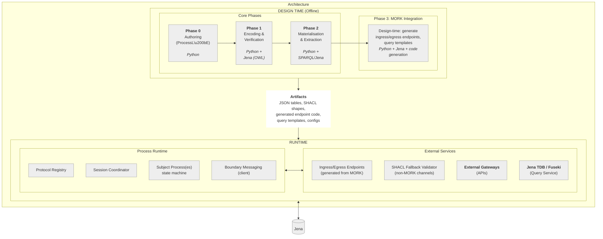
```mermaid
flowchart TB
    subgraph ARCH["Architecture"]
        subgraph DESIGN["DESIGN TIME (Offline)"]
            subgraph CORE["Core Phases"]
                P0["<b>Phase 0</b><br/>Authoring<br/>(ProcessL\u200bE)<br/><br/><i>Python</i>"]
                P1["<b>Phase 1</b><br/>Encoding &<br/>Verification<br/><br/><i>Python +<br/>Jena (OWL)</i>"]
                P2["<b>Phase 2</b><br/>Materialisation<br/>& Extraction<br/><br/><i>Python +<br/>SPARQL/Jena</i>"]

                P0 --> P1 --> P2
            end

            P2 --> P3

            subgraph MORKe["Phase 3: MORK Integration"]
                P3["Design-time: generate<br/>ingress/egress endpoints,<br/>query templates<br/><i>Python + Jena + code<br/>generation</i>"]
            end
        end

        ART["<b>Artifacts</b><br/>JSON tables, SHACL shapes,<br/>generated endpoint code,<br/>query templates, configs"]

        DESIGN --> ART

        subgraph RUNTIME["RUNTIME"]
            subgraph PROCESS["Process Runtime"]
                REG["Protocol Registry"]
                COORD["Session Coordinator"]
                SUBJECT["Subject Process(es)<br/>state machine"]
                CLIENT["Boundary Messaging (client)"]
            end

            subgraph SERVICES["External Services"]
                INGRESS["Ingress/Egress Endpoints<br/>(generated from MORK)"]
                SHACL["SHACL Fallback Validator<br/>(non-MORK channels)"]
                GATEWAYS["<b>External Gateways</b><br/>(APIs)"]
                FUSEKI["<b>Jena TDB / Fuseki</b><br/>(Query Service)"]
            end
        end

        ART --> RUNTIME
        PROCESS <--> SERVICES
    end

    RUNTIME <--> DB[("Jena")]

    classDef container fill:#fafafa,stroke:#666,stroke-width:1px;
    classDef phase fill:#eeeeee,stroke:#999,stroke-width:1px;
    classDef artifact fill:#ffffff,stroke:#ffffff;
    classDef runtime fill:#eeeeee,stroke:#999;
    classDef database fill:#eeeeee,stroke:#888;

    class P0,P1,P2,P3 phase;
    class ART artifact;
    class REG,COORD,SUBJECT,CLIENT,INGRESS,SHACL,GATEWAYS,FUSEKI runtime;
    class DB database;
```

## Phase 0: Protocol Authoring (ProcessLE → AST)

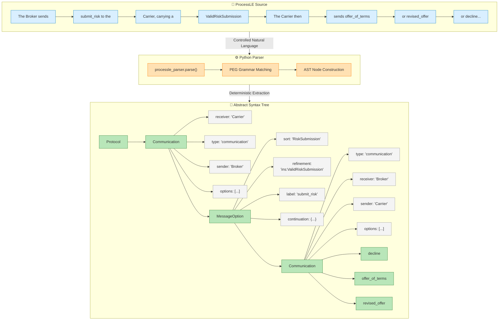
```mermaid
flowchart TB
    subgraph SOURCE["📝 ProcessLE Source"]
        S1["The Broker sends"]
        S2["submit_risk to the"]
        S3["Carrier, carrying a"]
        S4["ValidRiskSubmission"]
        S5["The Carrier then"]
        S6["sends offer_of_terms"]
        S7["or revised_offer"]
        S8["or decline..."]

        S1 --> S2 --> S3 --> S4 --> S5 --> S6 --> S7 --> S8
    end

    SOURCE -->|Controlled Natural Language| PARSER

    subgraph PARSER["⚙️ Python Parser"]
        P1["processle_parser.parse()"]
        P2["PEG Grammar Matching"]
        P3["AST Node Construction"]

        P1 --> P2 --> P3
    end

    PARSER -->|Deterministic Extraction| AST

    subgraph AST["🌳 Abstract Syntax Tree"]
        PROTOCOL["Protocol"]

        COMM1["Communication"]
        R1["receiver: 'Carrier'"]
        T1["type: 'communication'"]
        SEND1["sender: 'Broker'"]
        OPT1["options: [...]"]

        MSG["MessageOption"]
        SORT["sort: 'RiskSubmission'"]
        REF["refinement:<br/>'ins:ValidRiskSubmission'"]
        LABEL["label: 'submit_risk'"]
        CONT["continuation: {...}"]

        COMM2["Communication"]
        T2["type: 'communication'"]
        R2["receiver: 'Broker'"]
        SEND2["sender: 'Carrier'"]
        OPT2["options: [...]"]

        D["decline"]
        OFFER["offer_of_terms"]
        REVISED["revised_offer"]

        PROTOCOL --> COMM1

        COMM1 --> R1
        COMM1 --> T1
        COMM1 --> SEND1
        COMM1 --> OPT1
        COMM1 --> MSG

        MSG --> SORT
        MSG --> REF
        MSG --> LABEL
        MSG --> CONT
        MSG --> COMM2

        COMM2 --> T2
        COMM2 --> R2
        COMM2 --> SEND2
        COMM2 --> OPT2
        COMM2 --> D
        COMM2 --> OFFER
        COMM2 --> REVISED
    end

    classDef source fill:#d9efff,stroke:#1683c5;
    classDef parser fill:#ffe1b3,stroke:#ff7a00;
    classDef astContainer fill:#e7f7e7,stroke:#32843c;
    classDef astNode fill:#b9e6b9,stroke:#32843c;
    classDef property fill:#f4f4f4,stroke:#999;

    class S1,S2,S3,S4,S5,S6,S7,S8 source;
    class P1,P2,P3 parser;
    class PROTOCOL,COMM1,MSG,COMM2,D,OFFER,REVISED astNode;
    class R1,T1,SEND1,OPT1,SORT,REF,LABEL,CONT,T2,R2,SEND2,OPT2 property;
```

**Technology**: Python
**Inputs**: ProcessLE controlled natural language specifications (protocol definitions expressing global choreographies, participant roles, message types, branching, recursion, and subprocess calls).
**Outputs**: Abstract Syntax Tree (AST) representing the protocol structure. This AST is the parse tree of the ProcessLE grammar, structured as Python dataclasses or dictionaries that capture:
•	Global type structure (communication prefixes, branching, parallel composition, recursion)
•	Participant declarations with role names
•	Message label declarations with payload sort references
•	Subprocess call declarations with role mappings
•	Refinement predicate annotations (concept membership constraints referencing domain ontology IRIs)
•	Extension annotations (timeouts, retry policies, error handlers — from EXT ontologies)

#### Responsibilities
•	Parse ProcessLE source text into structured AST
•	Validate syntactic well-formedness of the ProcessLE input (grammar-level checks)
•	Resolve references to domain ontology concepts (validate that referenced IRIs exist in the imported domain ontology)
•	Produce a clean, validated AST ready for DL encoding

## Phase 1: DL Encoding and Verification

**Technology**: Python (for AST-to-RDF serialisation) + Apache Jena (for OWL reasoning and SHACL validation)
**Input**: AST from Phase 0, the fixed SPC T-Box (OWL 2 DL), domain ontology (OWL 2 EL), extension ontologies (EXT-Timer, EXT-Job, etc.)
**Output**: Verified protocol A-Box (RDF/OWL), loaded into a Jena TDB store or held in-memory as a Jena Model.

This phase has two sub-steps:

### A-Box Compilation (Python)

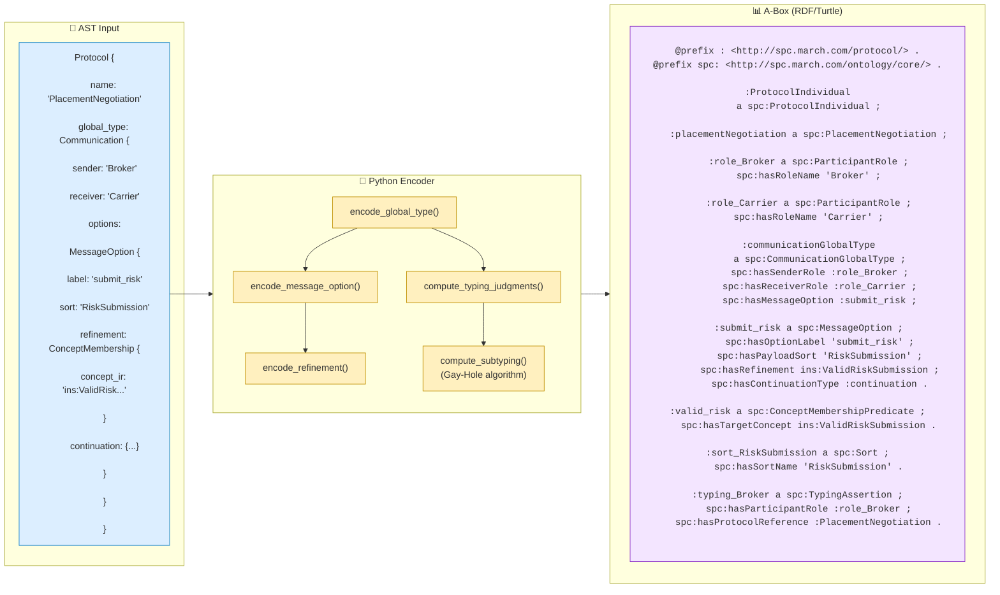
```mermaid
flowchart LR
    subgraph INPUT["🌳 AST Input"]
        AST["Protocol {<br/>
        name: 'PlacementNegotiation'<br/>
        global_type: Communication {<br/>
        sender: 'Broker'<br/>
        receiver: 'Carrier'<br/>
        options:<br/>
        MessageOption {<br/>
        label: 'submit_risk'<br/>
        sort: 'RiskSubmission'<br/>
        refinement: ConceptMembership {<br/>
        concept_ir: 'ins:ValidRisk...'<br/>
        }<br/>
        continuation: {...}<br/>
        }<br/>
        }<br/>
        }"]
    end

    AST --> ENCODER

    subgraph ENCODER["🐍 Python Encoder"]
        GLOBAL["encode_global_type()"]
        OPTION["encode_message_option()"]
        TYPING["compute_typing_judgments()"]
        REFINE["encode_refinement()"]
        SUBTYPE["compute_subtyping()<br/>(Gay-Hole algorithm)"]

        GLOBAL --> OPTION
        GLOBAL --> TYPING
        OPTION --> REFINE
        TYPING --> SUBTYPE
    end

    ENCODER --> AB

    subgraph AB["📊 A-Box (RDF/Turtle)"]
        RDF["<pre>
@prefix : &lt;http://spc.march.com/protocol/&gt; .
@prefix spc: &lt;http://spc.march.com/ontology/core/&gt; .

:ProtocolIndividual
    a spc:ProtocolIndividual ;

    :placementNegotiation a spc:PlacementNegotiation ;

    :role_Broker a spc:ParticipantRole ;
    spc:hasRoleName 'Broker' ;

    :role_Carrier a spc:ParticipantRole ;
    spc:hasRoleName 'Carrier' ;

    :communicationGlobalType
        a spc:CommunicationGlobalType ;
        spc:hasSenderRole :role_Broker ;
        spc:hasReceiverRole :role_Carrier ;
        spc:hasMessageOption :submit_risk ;

    :submit_risk a spc:MessageOption ;
        spc:hasOptionLabel 'submit_risk' ;
        spc:hasPayloadSort 'RiskSubmission' ;
        spc:hasRefinement ins:ValidRiskSubmission ;
        spc:hasContinuationType :continuation .

:valid_risk a spc:ConceptMembershipPredicate ;
    spc:hasTargetConcept ins:ValidRiskSubmission .

:sort_RiskSubmission a spc:Sort ;
    spc:hasSortName 'RiskSubmission' .

:typing_Broker a spc:TypingAssertion ;
    spc:hasParticipantRole :role_Broker ;
    spc:hasProtocolReference :PlacementNegotiation .
        </pre>"]
    end

    classDef input fill:#dceeff,stroke:#1683c5;
    classDef encoder fill:#fff0bf,stroke:#c19000;
    classDef rdf fill:#f3e5ff,stroke:#8d32c7;
    class AST input;
    class GLOBAL,OPTION,TYPING,REFINE,SUBTYPE encoder;
    class RDF rdf;
```

The Python encoder walks the AST and emits RDF triples (in Turtle, N-Triples, or directly via rdflib) that instantiate the SPC T-Box concepts. Each AST node becomes one or more A-Box individuals:

| AST Node   |      A-Box Individual(s) |
|----------|:-------------:|
| Communication p → q : {lᵢ⟨Sᵢ⟩.Gᵢ} |  A CommunicationGlobalType individual with hasSenderRole, hasReceiverRole, and hasMessageOption assertions for each branch |
| Message option lᵢ⟨Sᵢ⟩ |A MessageOption individual with hasOptionLabel, hasPayloadSort, hasRefinementPredicate, hasContinuationType|
| Recursion μt.G| A RecursiveGlobalType individual with hasRecBody |
| Parallel G₁  G₂ | A ParallelGlobalType individual with hasLeftComponent, hasRightComponent |
| Subprocess call | A CallBehavior-associated global type construct with hasProtocolReference, hasSubjectArgument |
| Refinement predicate {x: S | x ∈ C} | A ConceptMembershipPredicate individual with hasTargetConcept pointing to the domain ontology concept IRI |
| Extension annotations | Individuals from the relevant EXT ontology (e.g., TimerBinding, RetryPolicy) linked to the local type state | 

The compiler also generates typing assertions: for each participant, it computes the typing judgment Γ ⊢ B∶ T by walking the AST in tandem with the type rules (Section 1.4.5 of the foundations), and asserts the resulting TypingAssertion individuals. This is the "external type checking tool" described in Axiom 4.1.1's operational note.

The compiler also computes and asserts subtyping relations where needed (for internal choice typing and protocol refinement), using a direct Python implementation of the Gay-Hole algorithm. The asserted subtypeOf relations are then checked for consistency by the reasoner.

#### Verification (Jena)

The compiled A-Box is loaded into Jena alongside the SPC T-Box, domain ontology, and extension ontologies. Three verification steps execute:
1. OWL 2 DL Classification and Consistency. 
Jena's built-in reasoner, or Pellet/HermiT via Jena's reasoner interface, is used to:
-	Classify all A-Box individuals against the T-Box
-	Check consistency (no individual is a member of owl:Nothing)
-	Verify that asserted typing and subtyping relations are consistent with the T-Box constraints (Axioms 4.1.1, 4.2.1–4.2.8)
-	Verify partition axioms (every Behavior individual is exactly one of the nine subconcepts, etc)
2. SHACL Validation 
Jena's SHACL support, or TopBraid SHACL, are used to check for:
-	Linearity: No duplicate labels within a single communication type's message options
-	Coherence: Parallel compositions have disjoint participant sets
-	Contractiveness: Every recursion variable is guarded under a communication prefix
-	Projectability: For every communication type and every non-involved participant, all branch projections are identical 
-	Extension shapes: Timer durations are valid, retry policies have non-negative attempts, compensation graphs are acyclic, etc.
-	Sender-receiver distinctness: checking that sender ≠ receiver in every communication type
-	Branch non-emptiness: Every receive behaviour has at least one branch
3. External Validators (Python, invoked by the pipeline), check for:
-	Variable scoping: Check that recursion variable references are properly bound 
-	Subtyping computation verification: Re-run the Gay-Hole algorithm and compare results 
-	Call graph acyclicity: Traverse ProtocolDeclaration individuals and verify the call graph

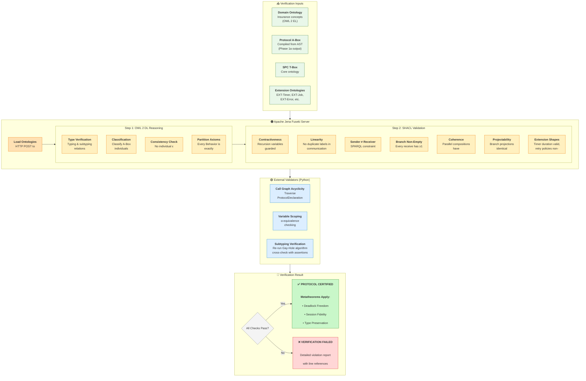
```mermaid
flowchart TB
    subgraph INPUTS["📥 Verification Inputs"]
        DOMAIN["<b>Domain Ontology</b><br/>Insurance concepts<br/>(OWL 2 EL)"]
        PROTOCOL["<b>Protocol A-Box</b><br/>Compiled from AST<br/>(Phase 1a output)"]
        SPC["<b>SPC T-Box</b><br/>Core ontology"]
        EXT["<b>Extension Ontologies</b><br/>EXT-Timer, EXT-Job,<br/>EXT-Error, etc."]
    end

    INPUTS --> FUSEKI

    subgraph FUSEKI["🟠 Apache Jena Fuseki Server"]
        LOAD["<b>Load Ontologies</b><br/>HTTP POST to"]

        subgraph OWL["Step 1: OWL 2 DL Reasoning"]
            TYPE["<b>Type Verification</b><br/>Typing & subtyping<br/>relations"]
            CLASSIFY["<b>Classification</b><br/>Classify A-Box<br/>individuals"]
            CONSIST["<b>Consistency Check</b><br/>No individual ε"]
            PARTITION["<b>Partition Axioms</b><br/>Every Behavior is<br/>exactly"]
        end

        subgraph SHACL["Step 2: SHACL Validation"]
            CONTRA["<b>Contractiveness</b><br/>Recursion variables<br/>guarded"]
            LINEAR["<b>Linearity</b><br/>No duplicate labels in<br/>communication"]
            SENDER["<b>Sender ≠ Receiver</b><br/>SPARQL constraint"]
            BRANCH["<b>Branch Non-Empty</b><br/>Every receive has ≥1"]
            COHERENCE["<b>Coherence</b><br/>Parallel compositions<br/>have"]
            PROJECT["<b>Projectability</b><br/>Branch projections<br/>identical"]
            EXT_SHAPE["<b>Extension Shapes</b><br/>Timer duration valid,<br/>retry policies non-"]
        end

        LOAD --> OWL
        OWL --> SHACL
    end

    FUSEKI --> VALIDATORS

    subgraph VALIDATORS["🟢 External Validators (Python)"]
        GRAPH["<b>Call Graph Acyclicity</b><br/>Traverse<br/>ProtocolDeclaration"]
        SCOPE["<b>Variable Scoping</b><br/>α-equivalence<br/>checking"]
        SUBTYPING["<b>Subtyping Verification</b><br/>Re-run Gay-Hole algorithm<br/>cross-check with assertions"]
    end

    VALIDATORS --> RESULT

    subgraph RESULT["📄 Verification Result"]
        DECISION{"All Checks Pass?"}

        PASS["✅ <b>PROTOCOL CERTIFIED</b><br/><br/>
        <b>Metatheorems Apply:</b><br/>
        • Deadlock Freedom<br/>
        • Session Fidelity<br/>
        • Type Preservation"]

        FAIL["❌ <b>VERIFICATION FAILED</b><br/><br/>
        Detailed violation report<br/>
        with line references"]

        DECISION -->|Yes| PASS
        DECISION -->|No| FAIL
    end

    classDef input fill:#e9f7e9,stroke:#3a7d44;
    classDef server fill:#ffe1b3,stroke:#f07800;
    classDef reasoning fill:#fff0bf,stroke:#f07800;
    classDef validator fill:#dceeff,stroke:#1683c5;
    classDef result fill:#f4f4f4,stroke:#777;
    classDef success fill:#c9f7c9,stroke:#258b25;
    classDef failure fill:#ffd6d6,stroke:#d22;

    class DOMAIN,PROTOCOL,SPC,EXT input;
    class LOAD server;
    class TYPE,CLASSIFY,CONSIST,PARTITION,CONTRA,LINEAR,SENDER,BRANCH,COHERENCE,PROJECT,EXT_SHAPE reasoning;
    class GRAPH,SCOPE,SUBTYPING validator;
    class DECISION result;
    class PASS success;
    class FAIL failure;
```

## Phase 2: Materialisation and Extraction

**Technology**: Python + SPARQL (against Jena) + custom extraction logic
**Input**: Verified protocol A-Box (in Jena store), SPC T-Box
**Output**:
1.	Local type A-Box individuals (one per participant per protocol)
2.	State machine tables (JSON)
3.	Payload SHACL shapes

This phase has three sub-steps:

### Projection Materialisation (SPARQL CONSTRUCT)

The projection operation is implemented as a set of SPARQL CONSTRUCT queries that operate on the global type A-Box individuals and produce local type A-Box individuals.

For each participant r in part(G):
Sender case (r is the sender in a communication type):
```
CONSTRUCT {
  ?localType a :OutputLocalType ;
    :hasOutputTarget ?receiver ;
    :hasOutputOption ?localOption .
  ?localOption a :TypeOption ;
    :hasOptionLabel ?label ;
    :hasPayloadSort ?sort ;
    :hasContinuationLocalType ?contLocal .
}
WHERE {
  ?globalType a :CommunicationGlobalType ;
    :hasSenderRole ?sender ;
    :hasReceiverRole ?receiver ;
    :hasMessageOption ?option .
  ?option :hasOptionLabel ?label ;
    :hasPayloadSort ?sort ;
    :hasContinuationType ?contGlobal .
  FILTER (?sender = <participant_r>)
  BIND(IRI(CONCAT(STR(?globalType), "_proj_", STR(?sender))) AS ?localType)
  BIND(IRI(CONCAT(STR(?option), "_local")) AS ?localOption)
  # Recursive projection of continuation handled by iteration
}
```

**Receiver case**: Symmetric, producing InputLocalType individuals.
**Non-participant case**: Uses the projectability guarantee: picks any branch's projection (they are all equal for non-involved participants, as verified in Phase 1).
**Recursion case**: Handled by iterative materialisation: the CONSTRUCT query runs repeatedly until no new triples are produced (fixpoint).

The materialised local type individuals are asserted back into the Jena store, forming a complete picture: global types + local types + typing assertions + subtyping relations.

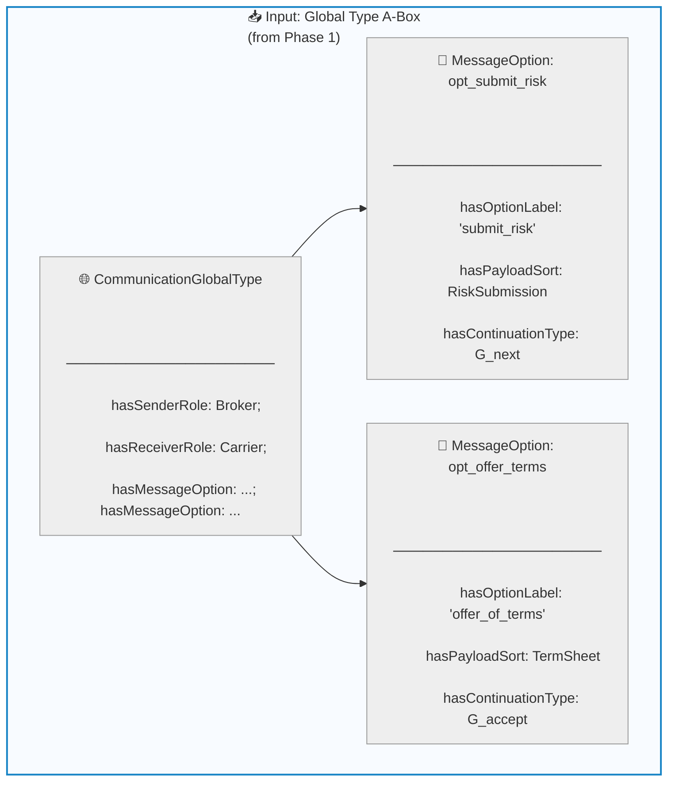
```mermaid
flowchart TB
    subgraph INPUT["📥 Input: Global Type A-Box<br/>(from Phase 1)"]
        CGT["🌐 CommunicationGlobalType<br/><br/>
        ─────────────────────<br/>
        hasSenderRole: Broker;<br/>
        hasReceiverRole: Carrier;<br/>
        hasMessageOption: ...; hasMessageOption: ..."]

        SUBMIT["📄 MessageOption: opt_submit_risk<br/><br/>
        ─────────────────────<br/>
        hasOptionLabel: 'submit_risk'<br/>
        hasPayloadSort: RiskSubmission<br/>
        hasContinuationType: G_next"]

        OFFER["📄 MessageOption: opt_offer_terms<br/><br/>
        ─────────────────────<br/>
        hasOptionLabel: 'offer_of_terms'<br/>
        hasPayloadSort: TermSheet<br/>
        hasContinuationType: G_accept"]

        CGT --> SUBMIT
        CGT --> OFFER
    end

    classDef container fill:#f8fbff,stroke:#1683c5,stroke-width:2px;
    classDef entity fill:#eeeeee,stroke:#999;
    class INPUT container;
    class CGT,SUBMIT,OFFER entity;
```
---
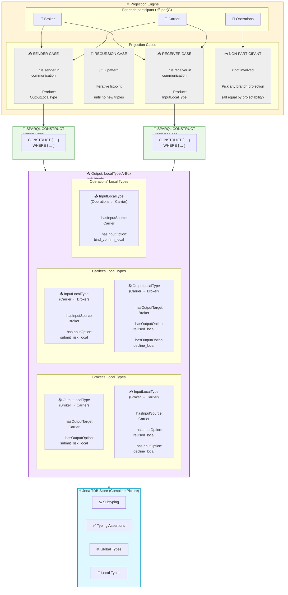
```mermaid
flowchart TB
    subgraph ENGINE["⚙️ Projection Engine"]
        subgraph PARTICIPANTS["For each participant r ∈ par(G)"]
            BROKER["👤 Broker"]
            CARRIER["👤 Carrier"]
            OPS["👤 Operations"]
        end

        subgraph CASES["Projection Cases"]
            SENDER["📤 SENDER CASE<br/><br/>
            r is sender in communication<br/><br/>
            Produce OutputLocalType"]

            RECURSION["🔄 RECURSION CASE<br/><br/>
            μt.G pattern<br/><br/>
            Iterative fixpoint<br/>
            until no new triples"]

            RECEIVER["📥 RECEIVER CASE<br/><br/>
            r is receiver in communication<br/><br/>
            Produce InputLocalType"]

            NONPART["⏭️ NON-PARTICIPANT<br/><br/>
            r not involved<br/><br/>
            Pick any branch projection<br/>
            (all equal by projectability)"]
        end

        BROKER --> SENDER
        BROKER --> RECEIVER
        CARRIER --> SENDER
        CARRIER --> RECEIVER
        OPS --> NONPART
    end

    SENDER --> SPARQL_S
    RECEIVER --> SPARQL_R

    subgraph SPARQL_S["🔧 SPARQL CONSTRUCT<br/>Sender Case"]
        QUERY_S["CONSTRUCT { ... }<br/>WHERE { ... }"]
    end

    subgraph SPARQL_R["🔧 SPARQL CONSTRUCT<br/>Receiver Case"]
        QUERY_R["CONSTRUCT { ... }<br/>WHERE { ... }"]
    end

    SPARQL_S --> OUTPUT
    SPARQL_R --> OUTPUT

    subgraph OUTPUT["📤 Output: LocalType A-Box<br/>Individuals"]
        subgraph BROKER_TYPES["Broker's Local Types"]
            BO["📤 OutputLocalType<br/>(Broker → Carrier)<br/><br/>
            hasOutputTarget: Carrier<br/>
            hasOutputOption: submit_risk_local"]

            BI["📥 InputLocalType<br/>(Broker ← Carrier)<br/><br/>
            hasInputSource: Carrier<br/>
            hasInputOption: revised_local<br/>
            hasInputOption: decline_local"]
        end

        subgraph CARRIER_TYPES["Carrier's Local Types"]
            CI["📥 InputLocalType<br/>(Carrier ← Broker)<br/><br/>
            hasInputSource: Broker<br/>
            hasInputOption: submit_risk_local"]

            CO["📤 OutputLocalType<br/>(Carrier → Broker)<br/><br/>
            hasOutputTarget: Broker<br/>
            hasOutputOption: revised_local<br/>
            hasOutputOption: decline_local"]
        end

        subgraph OPS_TYPES["Operations' Local Types"]
            OI["📥 InputLocalType<br/>(Operations ← Carrier)<br/><br/>
            hasInputSource: Carrier<br/>
            hasInputOption: bind_confirm_local"]
        end
    end

    OUTPUT --> DB

    subgraph DB["🗄️ Jena TDB Store (Complete Picture)"]
        SUBTYPE["⊆ Subtyping"]
        TYPING["✅ Typing Assertions"]
        GLOBAL["🌐 Global Types"]
        LOCAL["📍 Local Types"]
    end

    classDef engine fill:#fff4d8,stroke:#f08000,stroke-width:2px;
    classDef case fill:#eeeeee,stroke:#999;
    classDef sparql fill:#e8f7e8,stroke:#3a8f3a,stroke-width:2px;
    classDef output fill:#f5e6ff,stroke:#8d32c7,stroke-width:2px;
    classDef db fill:#dff7ff,stroke:#00a0c6,stroke-width:2px;

    class ENGINE engine;
    class SENDER,RECURSION,RECEIVER,NONPART case;
    class SPARQL_S,SPARQL_R sparql;
    class OUTPUT output;
    class DB db;
```

### Contrived Insurance Example

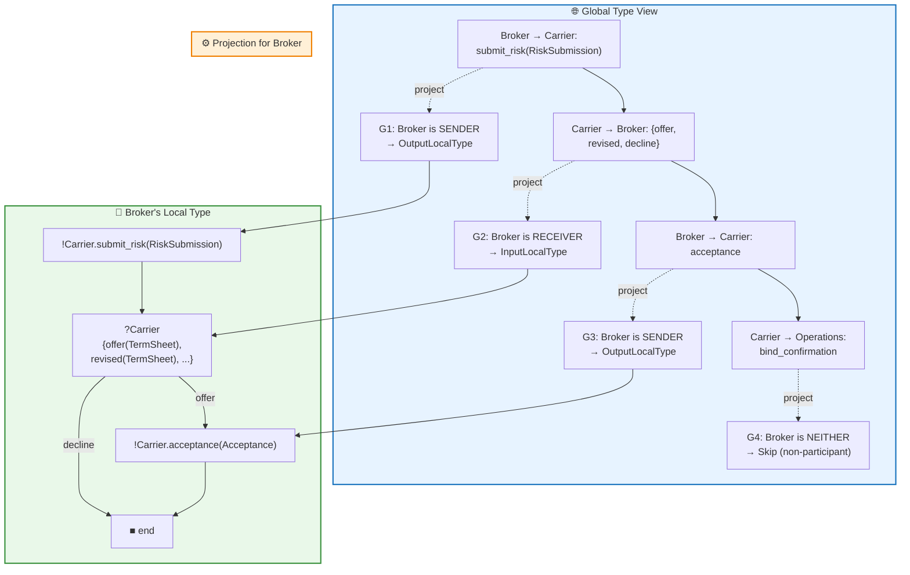
```mermaid
flowchart TB
    subgraph GLOBAL["🌐 Global Type View"]
        G1["Broker → Carrier:<br/>submit_risk(RiskSubmission)"]
        G2["Carrier → Broker: {offer,<br/>revised, decline}"]
        G3["Broker → Carrier: acceptance"]
        G4["Carrier → Operations:<br/>bind_confirmation"]

        G1 -. project .-> P1
        G2 -. project .-> P2
        G3 -. project .-> P3
        G4 -. project .-> P4

        G1 --> G2 --> G3 --> G4
    end

    subgraph PROJECTION["⚙️ Projection for Broker"]
        P1["G1: Broker is SENDER<br/>→ OutputLocalType"]
        P2["G2: Broker is RECEIVER<br/>→ InputLocalType"]
        P3["G3: Broker is SENDER<br/>→ OutputLocalType"]
        P4["G4: Broker is NEITHER<br/>→ Skip (non-participant)"]
    end

    P1 --> B1
    P2 --> B2
    P3 --> B3

    subgraph BROKER["📍 Broker's Local Type"]
        B1["!Carrier.submit_risk(RiskSubmission)"]
        B2["?Carrier<br/>{offer(TermSheet),<br/>revised(TermSheet), ...}"]
        B3["!Carrier.acceptance(Acceptance)"]
        END["■ end"]

        B1 --> B2
        B2 -->|offer| B3
        B2 -->|decline| END
        B3 --> END
    end

    classDef global fill:#e7f3ff,stroke:#1671bd,stroke-width:2px;
    classDef projection fill:#fff0d7,stroke:#f08000,stroke-width:2px;
    classDef local fill:#e9f8e9,stroke:#39913d,stroke-width:2px;

    class GLOBAL global;
    class PROJECTION projection;
    class BROKER local;
```

### State Machine Extraction (Python)

A Python script queries the materialised local type A-Box via SPARQL and performs a graph traversal to extract flat state machine tables. The algorithm proceeds like so:
1.	For each participant, retrieve the root local type individual
2.	Assign state ID 0 to the root
3.	BFS/DFS traversal of the local type graph:
-	Each OutputLocalType becomes a send state
-	Each InputLocalType becomes a recv state
-	Each EndLocalType becomes an end state
-	Each continuation link becomes a transition edge
-	Recursive back-references (detected by revisiting an already-assigned individual) become back-edges in the state table
-	CallBehavior references become call states with subprotocol name and return state
4.	For each state, extract:
-	Type (send/recv/end/call)
-	Partner (the target/source participant)
-	Valid labels (the label set from the type options)
-	Transitions (label → next state ID)
-	Payload shapes (IRI of the SHACL shape for each label's refinement predicate)
-	MORK flag (whether the label's payload is covered by a validated MORK mapping — set in Phase 3)
-	Timeout annotations (from EXT-Timer, if attached)
-	Retry annotations (from EXT-Job, if attached)
-	Error handlers (from EXT-Error, if attached)

The output is a JSON document per protocol.

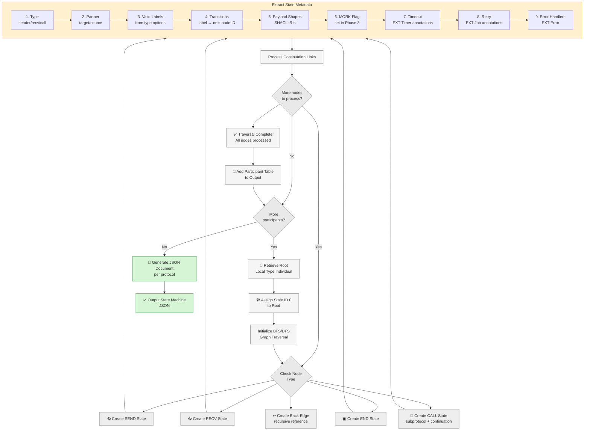
```mermaid
flowchart TB
    CHECK{"Check Node<br/>Type"}

    CHECK --> SEND["📤 Create SEND State"]
    CHECK --> RECEIVE["📥 Create RECV State"]
    CHECK --> ENDSTATE["▣ Create END State"]
    CHECK --> CALL["🔗 Create CALL State<br/>subprotocol + continuation"]
    CHECK --> BACKEDGE["↩ Create Back-Edge<br/>recursive reference"]

    SEND --> META
    RECEIVE --> META
    ENDSTATE --> META
    CALL --> META

    subgraph META["Extract State Metadata"]
        M1["1. Type<br/>sender/recv/call"]
        M2["2. Partner<br/>target/source"]
        M3["3. Valid Labels<br/>from type options"]
        M4["4. Transitions<br/>label → next node ID"]
        M5["5. Payload Shapes<br/>SHACL IRIs"]
        M6["6. MORK Flag<br/>set in Phase 3"]
        M7["7. Timeout<br/>EXT-Timer annotations"]
        M8["8. Retry<br/>EXT-Job annotations"]
        M9["9. Error Handlers<br/>EXT-Error"]

        M1 --> M2 --> M3 --> M4 --> M5 --> M6 --> M7 --> M8 --> M9
    end

    META --> LINKS["Process Continuation Links"]

    LINKS --> MORE{"More nodes<br/>to process?"}

    MORE -->|Yes| CHECK
    MORE -->|No| MOREPART{"More<br/>participants?"}

    MOREPART -->|Yes| RETRIEVE["🔎 Retrieve Root<br/>Local Type Individual"]
    RETRIEVE --> ASSIGN["🛠️ Assign State ID 0<br/>to Root"]
    ASSIGN --> INIT["Initialize BFS/DFS<br/>Graph Traversal"]
    INIT --> CHECK

    MOREPART -->|No| JSON["🧾 Generate JSON Document<br/>per protocol"]
    JSON --> COMPLETE["✅ Output State Machine<br/>JSON"]

    TRAVERSE["✅ Traversal Complete<br/>All nodes processed"]
    PARTICIPANTS["👥 Add Participant Table<br/>to Output"]

    MORE --> TRAVERSE
    TRAVERSE --> PARTICIPANTS
    PARTICIPANTS --> MOREPART

    classDef decision fill:#e9e9e9,stroke:#777;
    classDef state fill:#eeeeee,stroke:#999;
    classDef metadata fill:#fff1cf,stroke:#d39b22;
    classDef output fill:#d5f5d5,stroke:#309447;
    classDef link fill:#f5f5f5,stroke:#777;

    class CHECK,MORE,MOREPART decision;
    class SEND,RECEIVE,ENDSTATE,CALL,BACKEDGE state;
    class META metadata;
    class LINKS,TRAVERSE,PARTICIPANTS,RETRIEVE,ASSIGN,INIT link;
    class JSON,COMPLETE output;
```

### Payload Shape Extraction

For each refinement predicate {x: S | x ∈ C} referenced by a message option, extract or generate a SHACL shape that validates an A-Box individual for concept membership in C. This can be:
- Directly extracted from the domain ontology if it already contains SHACL shapes for C
- Generated from the OWL class definition of C (translating necessary conditions on C into SHACL property shapes)
- Authored manually for complex constraints and stored alongside the domain ontology

The extracted shapes are serialised as Turtle files and bundled with the state machine tables.

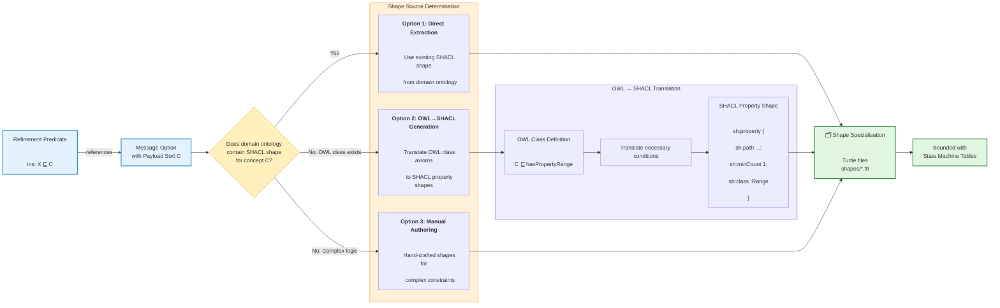
```mermaid
flowchart LR
    RP["Refinement Predicate<br/><br/>
    ins: X ⊑ C"]

    MO["Message Option<br/>with Payload Sort C"]

    RP -->|references| MO
    MO --> DECISION{"Does domain ontology<br/>contain SHACL shape<br/>for concept C?"}

    subgraph DETERMINE["Shape Source Determination"]
        DIRECT["<b>Option 1: Direct Extraction</b><br/><br/>
        Use existing SHACL shape<br/>
        from domain ontology"]

        OWL["<b>Option 2: OWL→SHACL<br/>Generation</b><br/><br/>
        Translate OWL class axioms<br/>
        to SHACL property shapes"]

        MANUAL["<b>Option 3: Manual Authoring</b><br/><br/>
        Hand-crafted shapes for<br/>
        complex constraints"]
    end

    DECISION -->|Yes| DIRECT
    DECISION -->|No: OWL class exists| OWL
    DECISION -->|No: Complex logic| MANUAL

    subgraph TRANSLATE["OWL → SHACL Translation"]
        OWL_CLASS["OWL Class Definition<br/><br/>
        C ⊑ hasPropertyRange"]
        CONDITIONS["Translate necessary conditions"]
        SHAPE["SHACL Property Shape<br/><br/>
        sh:property {<br/>
        sh:path ...;<br/>
        sh:minCount 1;<br/>
        sh:class :Range<br/>
        }"]

        OWL_CLASS --> CONDITIONS --> SHAPE
    end

    OWL --> OWL_CLASS
    DIRECT --> OUTPUT
    SHAPE --> OUTPUT
    MANUAL --> OUTPUT

    OUTPUT["🗂️ Shape Specialisation<br/><br/>
    Turtle files<br/>shapes/*.ttl"]

    OUTPUT --> TABLES["Bounded with<br/>State Machine Tables"]

    classDef input fill:#e4f2ff,stroke:#1683c5,stroke-width:2px;
    classDef decision fill:#fff0be,stroke:#d69b00;
    classDef option fill:#fff0d8,stroke:#f08000;
    classDef translate fill:#eeeeff,stroke:#7060d8;
    classDef output fill:#e1f6e1,stroke:#348e43,stroke-width:2px;

    class RP,MO input;
    class DECISION decision;
    class DETERMINE option;
    class TRANSLATE translate;
    class OUTPUT,TABLES output;
```

## Phase 3: MORK Integration (Design-Time Code Generation)

We cover this section quite lightly here, as MORK is a separate framework that we are merely integrating into our design. 

**Technology**: Python + Jena + code generation targetting any language for gateway services
**Input**: MORK mapping ontology (OWL), domain ontology, external API schemas (JSON Schema, XML Schema, ACORD specs), state machine tables from Phase 2
**Output**:
1.	Ingress endpoint code (transforms external data → A-Box individuals)
2.	Egress endpoint code (transforms A-Box subgraphs → external data formats)
3.	Pre-compiled SPARQL query templates (parameterised, for egress data retrieval)
4.	Query management configuration (template registry, parameter bindings)
5.	Updated state machine tables with MORK flags set

This is the most architecturally significant phase because it closes the type gap at the system boundary.

### Ingress Code Generation

For each external data source (API, XML feed, JSON, etc):

1.	Read the MORK mapping: The MORK ontology specifies field-to-property correspondences:
2.	client:premium_amount  →  ins:hasPremium   (xsd:decimal → xsd:decimal)
3.	client:quote_status    →  ins:hasStatus     (value map: "FIRM" → skos:firmQuote)
4.	client:attachment_point →  ins:hasAttachmentPoint
5.	Generate transformation code: For each mapping, produce a function (in the target language) that:
o	Reads the source field from the incoming JSON/XML document
o	Applies any type coercion or value mapping
o	Emits an RDF triple (or a structured record that can be serialised as RDF)
o	Mints an IRI for the new individual using the identityTemplateMapping from MORK
For an Elixir target, this might generate:
```elixir
def transform_quote(json) do
    individual_iri = mint_iri(json, "quote", [:quote_id, :effective_date])
    %{
        iri: individual_iri,
        type: "ins:Quote",
        properties: %{
            "ins:hasPremium => %{value: json["premium_amount"], type: :decimal},
            "ins:hasStatus => map_status(json["quote_status"]),
            ... etc
        }
    
     }
end
```

Alternatively, for sources where RML (RDF Mapping Language) is appropriate, the MORK mapping is compiled to RML rules, and the ingress endpoint executes an RML engine against the incoming data. This is appropriate for complex JSON and XML structures (ACORD) where declarative mapping is cleaner than imperative code.
6.	Generate the HTTP/AMQP endpoint: The ingress endpoint is a function that:
- Receives raw data (HTTP POST body, AMQP message payload)
- Calls the transformation function
- Materialises the resulting A-Box individual into the graph store (Jena TDB / Fuseki)
- Extracts the session ID and label from the materialised individual
- Routes the typed message into the BEAM runtime (via the session coordinator)

Critical point: The endpoint is generated code. It is not an interpreter. It does not reason about the mapping at runtime. The MORK mapping was validated at design time (Phase 3d below), and the generated code is a direct, deterministic implementation of that mapping.

For each label in the state machine table whose payload can be produced by a validated MORK ingress mapping, set morked => true. This tells the state machine to skip SHACL validation for that label.

### Egress Code Generation

For each outbound data flow (sending quotes back to client, sending bind confirmations to carrier portals):
7.	Design a SPARQL query template: The template retrieves the relevant subgraph from the store. 
- The template should be registered with a query management layer. The Jena ARQ engine can pre-compile parameterised queries for efficiency.
8.	Generate result-to-format conversion code: The SPARQL CONSTRUCT result is an RDF graph. The generated code walks this graph and produces the target format.
9.	Generate the egress endpoint: A function that:

- Accepts parameters (session ID, individual IRI, template name)
- Executes the pre-compiled SPARQL template against Jena/Fuseki with the supplied parameters
- Passes the result through the format conversion function
- Returns the formatted data (JSON, XML, etc.)
- The caller (coordinator, gateway, or external service) handles the actual API call

### JSON-LD Support
If the target API accepts JSON-LD (or if the target format can be expressed as a JSON-LD frame), use Jena's JSON-LD serialiser directly. A JSON-LD frame is defined at design time:
```json-ld
{
    @context: {
        "premium": "ins:hasPremium",
        "status": "ins:hasStatus"
    },
    "@type": "ins:Quote"
}
```

The SPARQL result is serialised through the frame, producing JSON in the exact shape the external API expects. This is the zero-code-generation path, with the frame acting as the mapping specification, and Jena handling serialisation.
If the target format is not JSON-LD-friendly (e.g., ACORD XML, proprietary CSV), generate a function that reads the CONSTRUCT result triples and emits the target format:
```elixir
def quote_to_external_json(rdf_graph) do
    quote = RDF.Graph.subject(rdf_graph, RDF.type(), IRI.new("ins:Quote"))
    %{
        "premium_amount" => RDF.Graph.object(rdf_graph, quote, IRI.new("ins:hasPremium")),
        "quote_status" => reverse_map_status(RDF.Graph.object(rdf_graph, quote, IRI.new("ins:hasStatus")))
        ... etc
     }
end
```

### Query Management Layer
At design time, generate a query registry with a persistent data structure to hold the mappings. At runtime, the egress service loads this registry, pre-compiles the SPARQL templates into Jena's ARQ prepared query objects, and serves requests by parameter substitution + execution + formatting. No dynamic query construction occurs at runtime. 

### MORK Mapping Validation

Before certifying a mapping:
1.	Extract the SHACL shape for the target concept (from Phase 2c)
2.	Generate test data from the source schema (or use real sample payloads)
3.	Run the generated ingress transformation on the test data
4.	Validate the produced A-Box individuals against the SHACL shape
5.	If validation passes: the mapping is certified, and the MORK flag is set for all affected labels in the state machine table
6.	If validation fails: the mapping is incomplete, and the developer must add missing field correspondences

## Runtime Technology Selection 

### Design-Time Pipeline vs. Runtime Pipeline Choices

The preceding pipeline is largely based on Python, though a JVM language could also fulfil this role (e.g., Scala/Kotlin/Groovy). The reasons behind this are two-fold. 
-	Python and Java share a wealth of supporting libraries, tools, and client implementations for working with semantic web technologies (RDF, OWL, SPARQL, etc). 
-	The pipeline for these tools is fairly complex, requiring complex algorithms and transformations that developers will need to code and maintain
The runtime execution engine for SPC on the other hand, can be generated from the specification by LLM (or other techniques), and has relatively low overheads in terms of maintenance and setup. Any team capable of configuring and maintaining a RabbitMQ cluster will be able to easily manage it, and that technology is already in-situ within Marsh.
Furthermore, this is a reference architecture, so a different path may be taken for a production system.

### Erlang/OTP as a Natural Fit for SPC Protocol Execution
We have selected the BEAM interpreter as our runtime execution platform. There are a variety of reasons for this, which include our alignment with AMQP as a messaging protocol – RabbitMQ is written in Erlang – and alignment in concurrency models. The obvious alternative for an “actor system” implementation would be Scala’s AKKA framework, however we posit that the overheads of running AKKA would outweigh the benefits, and the codebase would be significantly more complex, making it harder to generate the implementation from Coq or another proof engine (which is an active area of research for SPC).

#### Isomorphism with SPC Semantics

The choice of Erlang/OTP as a technology base is not a preferential one for Marsh, however it is based on a structural correspondence. The SPC calculus models autonomous subjects communicating via asynchronous message passing, each executing an independent state machine, with failures handled by supervision rather than defensive coding.

Erlang/OTP models autonomous processes communicating via asynchronous message passing, each executing an independent state machine, with failures handled by supervision rather than defensive coding. The runtime semantics are, in the non-trivial sense, the same semantics.

#### The Actor Model Correspondence
The SPC foundations (Section 1.3) adopt the actor model of Agha, Mason, Smith, and Talcott as their operational semantics. A configuration κ = ⟨α, μ, ρ⟩ consists of an actor mapping α (subject identifiers to actor states), a message pool μ (a multiset of in-transit messages), and a receptionist set ρ (externally visible subjects). The reduction rules define how actors send messages, receive messages, execute internal functions, make choices, and terminate.

Erlang's process model implements exactly this semantics:
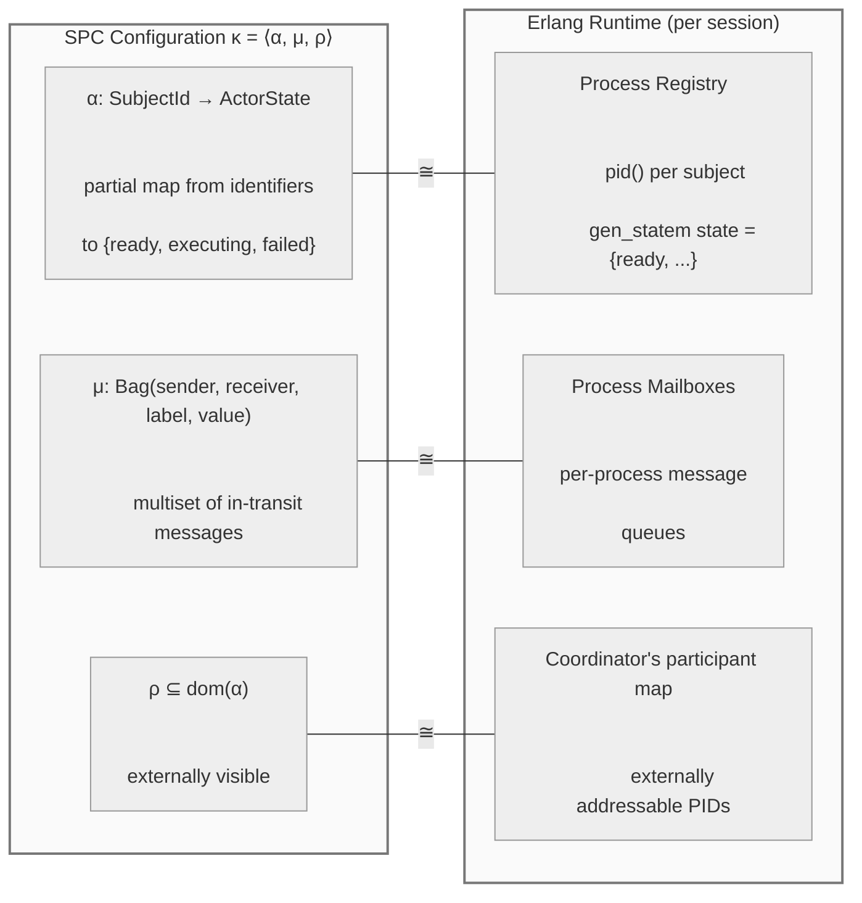
```mermaid
flowchart LR
    subgraph SPC["SPC Configuration κ = ⟨α, μ, ρ⟩"]
        ALPHA["α: SubjectId → ActorState<br/><br/>
        partial map from identifiers<br/>
        to {ready, executing, failed}"]

        MU["μ: Bag(sender, receiver, label, value)<br/><br/>
        multiset of in-transit messages"]

        RHO["ρ ⊆ dom(α)<br/><br/>
        externally visible"]
    end

    subgraph ERLANG["Erlang Runtime (per session)"]
        REG["Process Registry<br/><br/>
        pid() per subject<br/>
        gen_statem state = {ready, ...}"]

        MAIL["Process Mailboxes<br/><br/>
        per-process message<br/>
        queues"]

        PARTICIPANTS["Coordinator's participant map<br/><br/>
        externally addressable PIDs"]
    end

    ALPHA ---|"≅"| REG
    MU ---|"≅"| MAIL
    RHO ---|"≅"| PARTICIPANTS

    classDef container fill:#fafafa,stroke:#777,stroke-width:2px;
    classDef item fill:#eeeeee,stroke:#999;

    class SPC,ERLANG container;
    class ALPHA,MU,RHO,REG,MAIL,PARTICIPANTS item;
```

| SPC-Concept | Erlang Realisation| Fidelity |
|-------------|-------------------|----------|
| Subject identifier (s ∈ S)| Process identifier (pid()) or registered name (atom)| Exact. Erlang PIDs are globally unique, unforgeable references.|
|Actor state: ready (B)|gen_statem process in a named state, holding behaviour B as a state ID index into the protocol table|Exact. The gen_statem callback module is our state machine; the current state is the state ID.|
|Actor state: executing [B, κ]|Process in call state, with child session monitor reference as continuation|Direct. The call mechanism suspends the subject and resumes on child completion.|
|Actor state: failed (⊥)|Process terminated with non-normal reason; supervisor restart policy applies|OTP extends the SPC model by adding recovery, which the formalism lacks but the implementation requires.|
|Message pool μ|Each process has a private mailbox. Messages are enqueued by ! (send) or gen_statem:cast. The union of all mailboxes constitutes μ.|Faithful but not identical. SPC's μ is a global multiset; Erlang distributes it across per-process queues. The observable behaviour is equivalent for well-typed protocols because the session type discipline ensures each message has exactly one intended recipient.|
|Receptionist set ρ|The coordinator's participant map, or registered process names visible to the API layer|Exact. Receptionists are the externally addressable subjects.|
|Structural congruence (rec X.B = B[rec X.B / X])|Recursive types are unfolded at design time during state machine extraction. The runtime table already contains the unfolded cycle.|Exact. Recursion is resolved statically; the runtime sees only a graph with back-edges.|
|Expression totality (Axiom 1.3.4)|Not applicable at runtime.|Expressions were evaluated during payload construction. The interpreter does not evaluate expressions — it routes pre-constructed values.	Satisfied vacuously.|

The SPC metatheory proves properties (subject reduction, deadlock freedom, session fidelity) about actor configurations. The Erlang runtime instantiates those configurations. If the design-time pipeline guarantees well-typedness, then the runtime should, to an extent, inherit the metatheoretic properties, because the runtime is a faithful realisation of the formalism's operational semantics.

NB: there are some gaps to this reasoning. We introduce a coordinator process in the erlang implementation, to handle the mapping between identity and state. 

### The Subject Behaviour Machine
Erlang's gen_statem behaviour is a generic finite state machine with two modes: state_functions (where each state is a named callback function) and handle_event_function (where a single callback dispatches on state and event). We use handle_event_function because the SPC state space is dynamic – state IDs are integers loaded from a table, not atoms known at compile time.
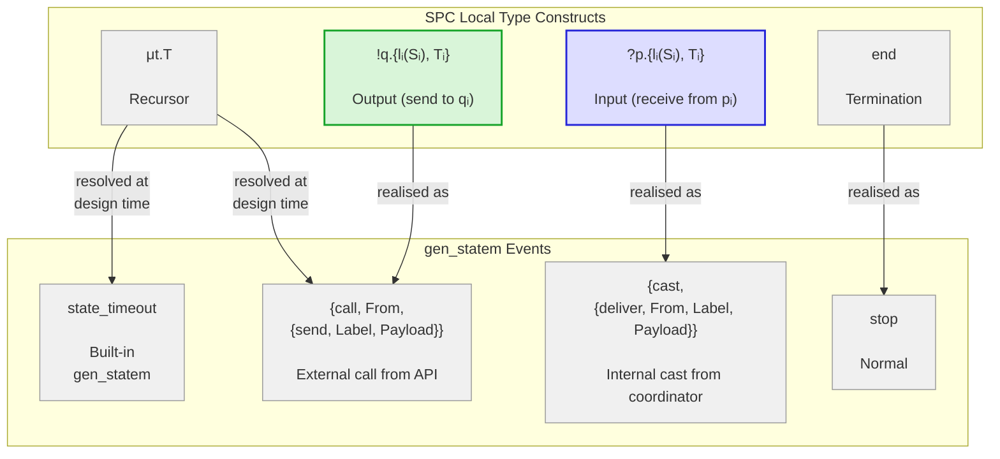
```mermaid
flowchart TB
    subgraph LOCAL["SPC Local Type Constructs"]
        REC["μt.T<br/><br/>Recursor"]
        OUT["!q.{lᵢ(Sᵢ), Tᵢ}<br/><br/>Output (send to qᵢ)"]
        IN["?p.{lᵢ(Sᵢ), Tᵢ}<br/><br/>Input (receive from pᵢ)"]
        END["end<br/><br/>Termination"]
    end

    subgraph EVENTS["gen_statem Events"]
        TIMEOUT["state_timeout<br/><br/>Built-in<br/>gen_statem"]

        CALL["{call, From,<br/>{send, Label, Payload}}<br/><br/>External call from API"]

        CAST["{cast,<br/>{deliver, From, Label, Payload}}<br/><br/>Internal cast from coordinator"]

        STOP["stop<br/><br/>Normal"]
    end

    REC -->|resolved at<br/>design time| TIMEOUT
    REC -->|resolved at<br/>design time| CALL
    OUT -->|realised as| CALL
    IN -->|realised as| CAST
    END -->|realised as| STOP

    classDef local fill:#f0f0f0,stroke:#999;
    classDef output fill:#d9f5d9,stroke:#16a329,stroke-width:2px;
    classDef input fill:#ddddff,stroke:#2525d8,stroke-width:2px;
    classDef event fill:#f0f0f0,stroke:#999;

    class REC,END local;
    class OUT output;
    class IN input;
    class TIMEOUT,CALL,CAST,STOP event;
```

Send states are driven by external calls, which the gen_statem receives as a {call, From, Request} event, validates (with label and payload) against the state table, transitions, and replies to the caller with the outcome. The synchronous call semantics provide natural backpressure: the caller blocks until the state machine confirms or rejects the transition.

Receive states are driven by internal casts. The coordinator delivers a message from the partner, which gen_statem receives as a {cast, Message} event, validates against the state table, transitions, and notifies the external subscriber (human or agent) asynchronously. The asynchronous cast semantics are correct here because the coordinator does not need confirmation, since the message has already been validated by the sending subject.

Timeouts use gen_statem's native state_timeout mechanism. When the subject enters a state with a timeout annotation, the transition handler returns 
{next_state, NewState, NewData, [{state_timeout, DurationMs, timeout_fired}]}

If no event arrives before the timeout, gen_statem delivers a {state_timeout, timeout_fired} event. If any event arrives, the timeout is automatically cancelled.

Recursion is invisible at runtime. The state machine table already contains cycles (state 5 transitions back to state 4 on label revised_offer). The gen_statem follows the table entry: it does not know or care that the transition represents a recursive unfolding. Recursion is a design-time concept; the runtime sees only a directed graph.

#### OTP Supervision and the Failure Model

The SPC formalism defines a failed actor state (⊥) but provides no recovery mechanism – failure is terminal. Real systems cannot afford this. OTP's supervision trees extend the formalism with a principled recovery model that does not violate the session type guarantees.

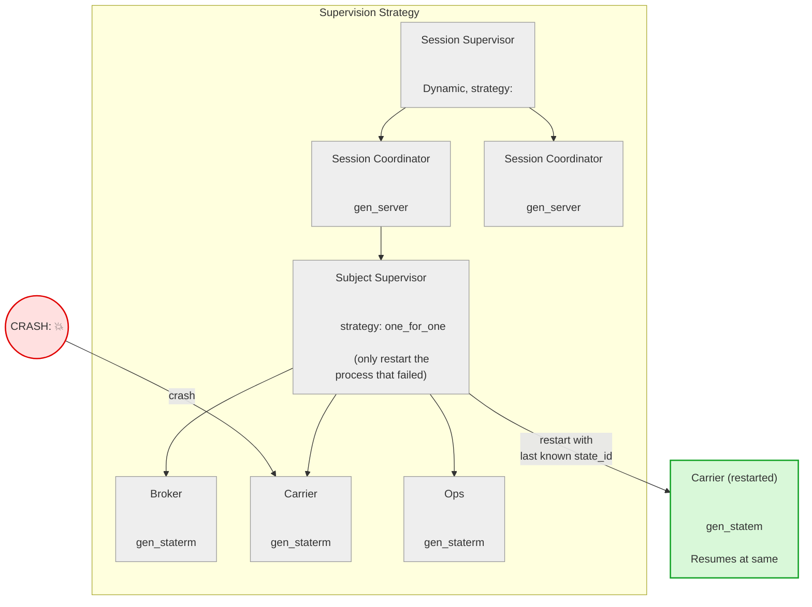
```mermaid
flowchart TB
    subgraph SUP["Supervision Strategy"]
        SESSION["Session Supervisor<br/><br/>
        Dynamic, strategy:"]

        COORD1["Session Coordinator<br/><br/>
        gen_server"]

        COORD2["Session Coordinator<br/><br/>
        gen_server"]

        SUBJECT_SUP["Subject Supervisor<br/><br/>
        strategy: one_for_one<br/>
        (only restart the process that failed)"]

        BROKER["Broker<br/><br/>
        gen_staterm"]

        CARRIER["Carrier<br/><br/>
        gen_staterm"]

        OPS["Ops<br/><br/>
        gen_staterm"]

        SESSION --> COORD1
        SESSION --> COORD2
        COORD1 --> SUBJECT_SUP

        SUBJECT_SUP --> BROKER
        SUBJECT_SUP --> CARRIER
        SUBJECT_SUP --> OPS
    end

    CRASH(("CRASH: 💥"))

    CRASH -->|crash| CARRIER

    SUBJECT_SUP -->|restart with<br/>last known state_id| RESTARTED

    RESTARTED["Carrier (restarted)<br/><br/>
    gen_statem<br/>
    Resumes at same"]

    classDef supervisor fill:#eeeeee,stroke:#999;
    classDef crash fill:#ffe0e0,stroke:#e00000,stroke-width:2px;
    classDef restarted fill:#d9f8d9,stroke:#16a329,stroke-width:2px;

    class SESSION,COORD1,COORD2,SUBJECT_SUP,BROKER,CARRIER,OPS supervisor;
    class CRASH crash;
    class RESTARTED restarted;
```

This capability is baked into Erlang/OTP, and its runtime behaviour guarantees are a fundamental property of systems built on the platform.

The one_for_one supervision strategy provides the behaviour we want at both levels of the “supervision tree”:
•	Session level: If one session's coordinator crashes, other sessions are unaffected. The crashed session is either restarted from a checkpoint or marked as failed. Sessions are independent — this is a direct consequence of the SPC coherence condition, which guarantees that parallel compositions have disjoint participant sets.
•	Subject level: If one subject process crashes, the other subjects in the same session continue operating. The crashed subject is restarted at its last committed state. This works because subject state is minimal (a single integer plus the session reference) and the protocol table is immutable and externally stored (in persistent_term). Restarting a subject process means spawning a new process with the same state ID — not reconstructing a complex in-memory data structure.

This recovery model is not available in frameworks that encode protocol state in the runtime engine's internal structures. If a Python async task crashes, the coroutine's stack frame is lost. If a Java thread crashes, the thread-local state is lost.

In Erlang, a process crash destroys only the process heap – and we have deliberately kept the process heap minimal (one integer, one PID, one atom). We store all other data in Erlang’s persistent_term mechanism (which is immutable, shared, and survives process death) or in the coordinator (a separate process that the supervision tree protects independently).

#### Zero-Cost Shared Immutable State
The protocol table is the largest data structure in the runtime, containing potentially thousands of state descriptors across dozens of participants. Every subject process must read it on every transition. In most languages, this requires either copying the data into each thread's memory, or protecting shared access with locks.

Erlang's persistent_term eliminates both problems. It stores terms in a global literal area that is shared across all processes without copying. A persistent_term:get/1 call returns a reference to the shared memory, rather than a copy. The cost is O(1) with no locking, no serialisation, and no garbage collection pressure.

For a protocol table serving 10,000 concurrent subject processes, persistent_term can store just one copy, due to the immutability properties the language, platform, and implementation provide. An equivalent Java architecture would either store 10,000 copies (one per thread) or use a ConcurrentHashMap with lock contention on every access. Equally problematic, an equivalent Python architecture would use a global dictionary protected by the Global Interpreter Lock, serialising all access (and other options suffer the same lock contention issue as Java).

**Concurrent Access Note:**
Java afficionados and Pythonistas may object that purpose built “thread-safe” structures like Java’s ConcurrentHashMap, provide safety and are fast an efficient and, in a sense, this is true. However, in the face of massive concurrency, whilst concurrent access to these data structures may be “safe”, it is not well-optimised. 

Lookup optimised thread-safe data structures mostly use a technique known as “lock-striping”, which partitions contention amongst multiple locks, rather than eliminating it altogether.
As concurrency scales to thousands or millions of lightweight processes (as is common on the BEAM runtime), even striped locks become hotspots: threads collide on the same stripe, leading to contention, context-switching overhead, and subtle risks of deadlock or priority inversion. 

In contrast, immutable data access like persistent_term storage, sidesteps these problems entirely. Because the data is never mutated, every process can read it concurrently without any synchronization whatsoever, which means read throughput scales linearly with the number of concurrent readers, with zero coordination cost. The trade-off is that updating or deleting a persistent_term triggers a global garbage collection of all processes that reference it. But protocol tables are immutable per version: they are loaded once at deployment time and never modified, therefore this trade-off does not apply to our runtime.

#### Concurrency Without Contention
The SPC runtime is massively concurrent: in production, thousands of sessions may be active simultaneously, each with several subject processes, each processing messages independently. The runtime must scale horizontally across CPU cores without introducing synchronisation bottlenecks.
Erlang's concurrency model (lightweight processes scheduled cooperatively across OS threads by the BEAM virtual machine) provides this scaling by default:
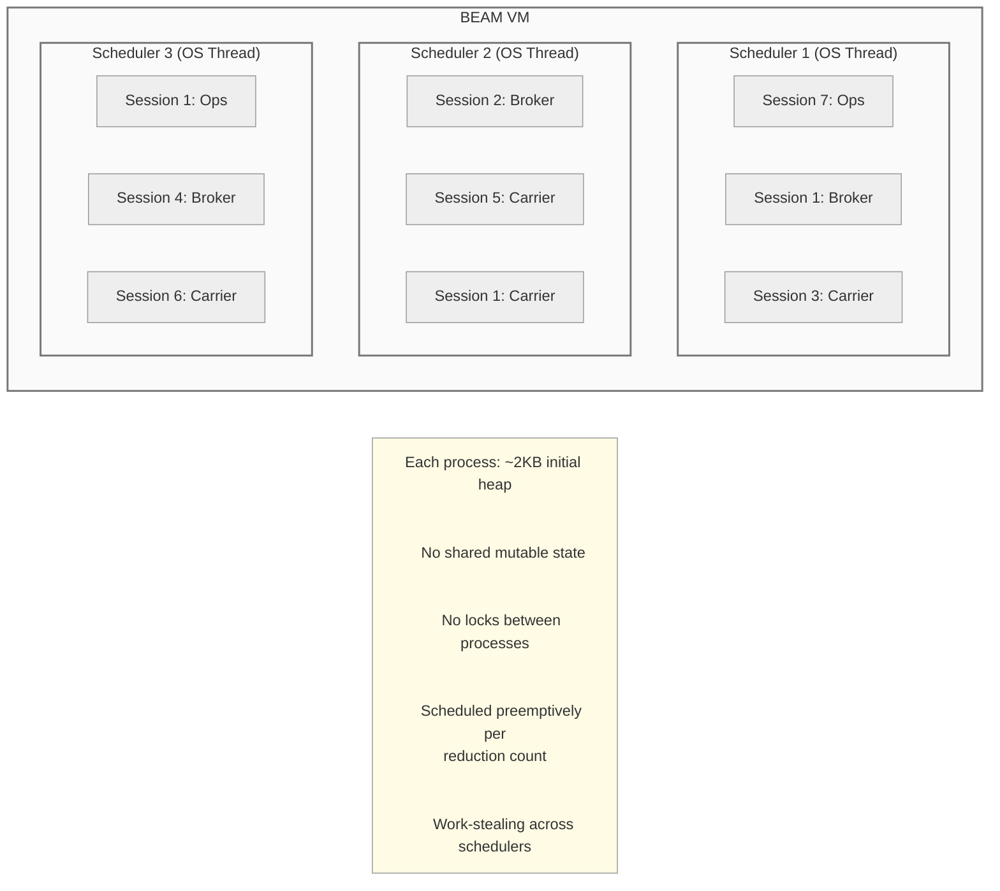
```mermaid
flowchart LR
    subgraph VM["BEAM VM"]
        subgraph S1["Scheduler 1 (OS Thread)"]
            S7["Session 7: Ops"]
            S1A["Session 1: Broker"]
            S3["Session 3: Carrier"]
        end

        subgraph S2["Scheduler 2 (OS Thread)"]
            S2A["Session 2: Broker"]
            S5["Session 5: Carrier"]
            S1B["Session 1: Carrier"]
        end

        subgraph S3SCH["Scheduler 3 (OS Thread)"]
            S1C["Session 1: Ops"]
            S4["Session 4: Broker"]
            S6["Session 6: Carrier"]
        end
    end

    NOTES["Each process: ~2KB initial heap<br/><br/>
    No shared mutable state<br/><br/>
    No locks between processes<br/><br/>
    Scheduled preemptively per<br/>reduction count<br/><br/>
    Work-stealing across<br/>schedulers"]

    classDef container fill:#fafafa,stroke:#777,stroke-width:2px;
    classDef process fill:#eeeeee,stroke:#999;
    classDef note fill:#fffbe5,stroke:#999;

    class VM,S1,S2,S3SCH container;
    class S7,S1A,S3,S2A,S5,S1B,S1C,S4,S6 process;
    class NOTES note;
```

This confers some excellent properties for SPC’s use-case:

**No shared mutable state**. Each subject process owns its state (one integer). The protocol table is immutable and shared via persistent_term. The coordinator owns the participant map, but no other process writes to it. There are no locks involved at runtime.

**Lightweight processes**. An Erlang process starts with approximately 2KB of heap. Spawning 30,000 processes (10,000 sessions × 3 participants) consumes only ~60MB of memory for process heaps. The protocol tables, shared via persistent_term, add a fixed overhead independent of process count. This is feasible on a single machine; most languages cannot support this level of concurrency without thread pool contention or coroutine scheduling overhead.

**Preemptive scheduling**. The BEAM schedules processes preemptively based on reduction counts (approximately one reduction per function call). A subject process performing seven map lookups per transition consumes roughly seven reductions: this is negligible. No subject process can starve another, even if one session is processing messages at high frequency while another is idle.

**Work-stealing**. The BEAM's scheduler threads implement work-stealing: if one scheduler's run queue is empty while another's is full, processes migrate. This provides automatic load balancing across cores without explicit partitioning.

**Distribution:** Multi-Node Sessions
Erlang's distribution layer, which leverages transparent message passing between processes on different BEAM nodes, enables multi-node SPC deployments. A session's subject processes can run on different machines, communicating via Erlang's built-in distribution protocol, with no changes to the interpreter logic.


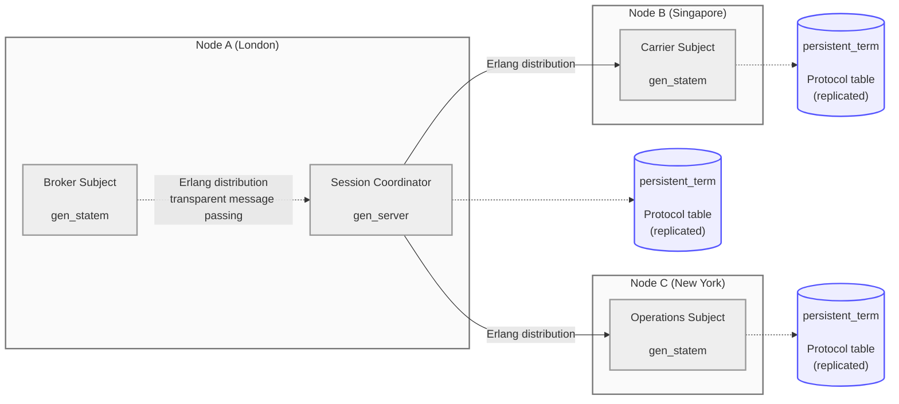
```mermaid
flowchart LR
    subgraph NODE_A["Node A (London)"]
        BROKER["Broker Subject<br/><br/>gen_statem"]
        COORD["Session Coordinator<br/><br/>gen_server"]

        BROKER -.->|"Erlang distribution<br/>transparent message passing"| COORD
    end

    subgraph NODE_B["Node B (Singapore)"]
        CARRIER["Carrier Subject<br/><br/>gen_statem"]
    end

    subgraph NODE_C["Node C (New York)"]
        OPS["Operations Subject<br/><br/>gen_statem"]
    end

    COORD -->|"Erlang distribution"| CARRIER
    COORD -->|"Erlang distribution"| OPS

    DB_A[("persistent_term<br/><br/>Protocol table<br/>(replicated)")]
    DB_B[("persistent_term<br/><br/>Protocol table<br/>(replicated)")]
    DB_C[("persistent_term<br/><br/>Protocol table<br/>(replicated)")]

    COORD -.-> DB_A
    CARRIER -.-> DB_B
    OPS -.-> DB_C

    classDef node fill:#fafafa,stroke:#777,stroke-width:2px;
    classDef process fill:#eeeeee,stroke:#999;
    classDef database fill:#eeeeff,stroke:#5555ff,stroke-width:2px;

    class NODE_A,NODE_B,NODE_C node;
    class BROKER,COORD,CARRIER,OPS process;
    class DB_A,DB_B,DB_C database;
```

The subject process code is identical whether the coordinator is on the same node or a different continent. gen_statem:call and gen_statem:cast work transparently across node boundaries. The only additional concern is network partition handling – Erlang's net_kernel provides partition detection, and the coordinator's monitor on subject processes (erlang:monitor/2) fires a DOWN message if a remote process becomes unreachable, triggering the same recovery logic as a local process crash. 

This is significant for the SPC domain. International business negotiations involve parties in different geographies operating in different time zones.

#### Zero Downtime Upgrades
Erlang’s runtime supports hot code-swapping that enables any OTP application to be upgrading with no downtime and built-in recovery/fallback in case of errors.

#### Prolog Kinship

There is a historical resonance worth noting. Erlang's syntax descends from Prolog — the language that underpins the InsurLE and Logical English work of Kowalski, Cummins, and colleagues. The SPC foundations draw on Cummins et al.'s computable contracting vision. The DL encoding compiles to OWL, whose reasoning semantics share deep roots with logic programming. And the runtime executes on a virtual machine whose instruction set was originally designed for a language that grew out of Prolog.

The entire pipeline – from ProcessLE's controlled natural language, through OWL reasoning, to Erlang execution – operates within a family of formalisms that share a common ancestor in first-order logic and its computational interpretations. ProcessLE sentences are logical rules. Our OWL T-Box is a description logic knowledgebase. SHACL shapes are constraint programs. The state machine tables are a computed fixpoint. Erlang processes are actors executing the fixpoint.

The choice of Erlang closes the circle: the runtime language is native to the same intellectual tradition as the specification language. Pattern matching in Erlang function heads is the same operation as unification in Prolog. The case expression over a map lookup is a computed analogue of a logic program's clause selection. The gen_statem callback structure (i.e., dispatch on state and event, produce a next state and actions) is a labelled transition system, viz the operational semantics that the SPC metatheory reasons about.

Other languages could implement the SPC runtime. Go has lightweight goroutines and channels. Rust has async tasks and message passing. Java has virtual threads (Project Loom). But none of these languages offer the combination of actor-model nativity, supervision trees, transparent distribution, zero-copy shared immutable state, zero-downtime upgrades, and syntactic kinship with the logical formalism being executed.

#### The Coherence Condition and Session Independence
The SPC foundations establish a critical structural property: in every parallel subterm G₁ | G₂, the participant sets are disjoint (part(G₁) ∩ part(G₂) = ∅). We should trace the consequence of this through to the runtime's session isolation model.

The coherence condition means that each participant appears in at most one branch of any parallel composition. The architectural consequence is that each subject process needs only a single active FSM per session – there is no interleaving state space explosion, because the projection (G₁ | G₂)↾r degenerates to a single sequential local type for each participant r. This is why the gen_statem state is a single integer rather than a product of integers.

SPC foundations also describe a Map of FSMs pattern (see “Open Issues”) for the case where a single actor participates in multiple sessions simultaneously. The Erlang architecture handles this naturally: each session spawns a fresh gen_statem process per participant. The "map from session ID to state" that the foundations describe is realised by the BEAM's process registry: each process is the FSM for its session, and message routing via the coordinator ensures that messages for session X never reach the process for session Y. The BEAM's per-process mailbox is the session-scoped message queue.

#### MORK and the Identity Resolution Correspondence
The SPC foundations describe MORK's role in solving the identity resolution problem: “MORK guarantees that an incoming message is already an A-Box individual with a resolved identity and type before it reaches the FSM runtime.”
This manifests in the runtime:

|SPC / MORK Concept|	Erlang Realisation|
|------------------|----------------------|
|MORK identityTemplateMapping / resolvesIdentityFor|Design-time generated ingress endpoint code (Elixir/Python) that transforms raw payloads into typed A-Box individuals before they enter the BEAM message flow|
|SessionID as deterministic ontological ID|The session_id atom/binary carried in every Erlang message tuple, assigned at session creation from the materialised A-Box individual's IRI|
|"Pre-Calculated Correlation"|The coordinator's participant map #{participant_name => pid()} is the runtime manifestation of the identity resolution. No runtime lookup is needed because the MORK mapping already determined which session and which role this message belongs to.|
|"Type Certainty" (payload satisfies T-Box)|The MORK-mapped flag in the state machine table (morked => true). When true, the gen_statem skips SHACL validation entirely — the type guarantee is structural, not checked|

There is a soundness argument here: MORK's design-time validation (the completeness theorem in the foundations) states that every individual produced by a validated mapping satisfies the refinement predicate. The Erlang runtime inherits this guarantee by construction.

#### The Call Mechanism and Subprocess Invocation

There is a correspondence to the SPC foundations' [Call] and [Call-Return] reduction rules in our design:

|SPC Reduction Rule|Erlang Mechanism|
|------------------|----------------|
|**[Call]**: Subject s enters executing state [B, κ_P] with continuation|The parent gen_statem enters a {suspended, ReturnStateId, ChildSessionRef} state. No protocol messages are processed. The process remains alive (for monitoring) but rejects all call and cast events with {error, suspended_for_subprocess}|
|init(G_P, s̄): Subprocess configuration initialised from global type with subject instantiation|The parent coordinator sends {spawn_subprocess, SubprotocolName, RoleMapping} to the session supervisor, which starts a new coordinator + subject tree. Role mapping (#{initiator => Broker, responder => Carrier}) is the runtime instantiation of s̄|
|κ ∥ κ_P: Parallel composition of configurations|The parent session and child session run as independent supervision subtrees under the same spc_session_sup. They share no state. The ∥ operator is realised by OTP's flat supervisor namespace – both trees exist simultaneously|
|**[Call-Return]**: All child subjects at end, calling subject resumes with B|The parent coordinator monitors the child coordinator. When the child coordinator exits normally (all subjects terminated), the parent receives {'DOWN', Ref, process, Pid, normal} and sends {subprocess_complete, ChildRef} to the suspended subject, which transitions to ReturnStateId. This ‘DOWN’ behaviour is guaranteed by the BEAM runtime.|
|Acyclicity of the call graph|Enforced at design time by the SHACL validator, not at runtime. The state machine tables cannot contain circular subprocess references because the extractor would have rejected the protocol|

The SPC foundations note that the acyclicity constraint produces a "bounded-stack machine whose state space is finite but potentially large." In Erlang, this bounded stack is realised as a bounded depth of nested supervisor trees: each call adds one level of supervision. The state space product |States| × |CallStack|^{max⁡_depth} is finite because max_depth is statically determined by the protocol's call graph height. It is also worthy of mention that Erlang process run in an infinite recursive tail-call, which is optimised by the runtime to occupy a single stack frame.

#### Structural Congruence and Recursion Unfolding
The SPC structural congruence rule rec X.B ≡ B[rec X.B / X]  is the operational rule that unfolds recursive types. The contractiveness condition guarantees that every unfolding reaches a communication prefix – so the unfolding process terminates and produces a finite graph.

In the Erlang runtime, this manifests directly:
- The state machine table is a finite directed graph where recursive types produce back-edges (e.g., state 5 transitions back to state 4 on revised_offer)
- The gen_statem has no concept of recursion – it follows edges in a graph. The "recursive type" is invisible; it is a cycle in the transition table
- The contractiveness guarantee means every cycle passes through at least one send or recv state – there are no empty loops, and every cycle performs observable work

This is the precise sense in which the SPC metatheory's well-formedness conditions eliminate classes of runtime bugs: an ill-formed protocol (non-contractive recursion) would produce an infinite unfolding at extraction time, which the extractor would detect and reject. The runtime should never encounter the problem.

## The Subsumption Rule and Runtime Implications
The SPC typing rule [T-Sub] allows widening a behaviour's type to any supertype. In this model, subsumption is entirely resolved at design time. When the type checker applies [T-Sub] to type an internal choice B₁ + B₂, it widens both branches to a common supertype. The state machine extractor then produces a state with the union of labels from both branches. 

At runtime, the gen_statem sees a single state with multiple valid labels — it does not know or care that those labels originated from a subsumption step. The label set in the state descriptor is the supertype's label set, already computed. 

This means the runtime's map lookup is the only operational residue of the entire subtyping theory. The complex coinductive subtyping definition, Gay-Hole algorithm (assuming we implement it), and variance analysis, all collapses to a single map membership test at runtime.

### Runtime Architecture (Erlang/OTP + Elixir on BEAM)
**Technology**: Erlang (core interpreter), Elixir (bridges: RDF, AMQP, HTTP clients, ingress/egress), Apache Jena Fuseki (query service, external).
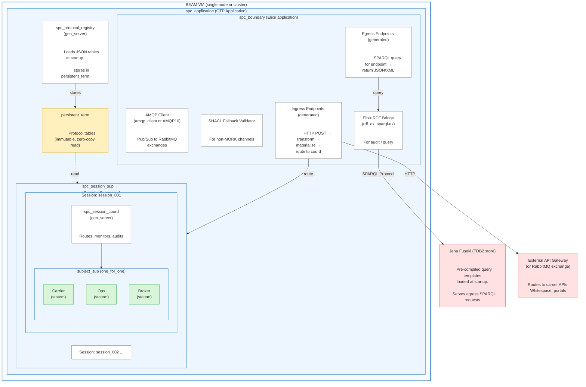
```mermaid
flowchart TB
    subgraph VM["BEAM VM (single node or cluster)"]
        subgraph APP["spc_application (OTP Application)"]
            REG["spc_protocol_registry<br/>(gen_server)<br/><br/>
            Loads JSON tables at startup,<br/>
            stores in persistent_term"]

            subgraph BOUNDARY["spc_boundary (Elixir application)"]
                AMQP["AMQP Client<br/>(amqp_client or AMQP10)<br/><br/>
                Pub/Sub to RabbitMQ<br/>exchanges"]

                EGRESS["Egress Endpoints (generated)<br/><br/>
                SPARQL query<br/>for endpoint →<br/>return JSON/XML"]

                SHACL["SHACL Fallback Validator<br/><br/>
                For non-MORK channels"]

                INGRESS["Ingress Endpoints (generated)<br/><br/>
                HTTP POST →<br/>transform →<br/>materialise →<br/>route to coord"]

                BRIDGE["Elixir RDF Bridge<br/>(rdf_ex, sparql-ex)<br/><br/>
                For audit / query"]
            end

            PT["persistent_term<br/><br/>
            Protocol tables<br/>(immutable, zero-copy read)"]

            subgraph SESSION_SUP["spc_session_sup<br/>(DynamicSupervisor)"]
                subgraph SESSION1["Session: session_001"]
                    COORD["spc_session_coord<br/>(gen_server)<br/><br/>
                    Routes, monitors, audits"]

                    subgraph SUBJECT_SUP["subject_sup (one_for_one)"]
                        CARRIER["Carrier<br/>(statem)"]
                        OPS["Ops<br/>(statem)"]
                        BROKER["Broker<br/>(statem)"]
                    end

                    COORD --> SUBJECT_SUP
                end

                SESSION2["Session: session_002 ..."]
            end

            REG -->|"stores"| PT
            PT -.->|"read"| SESSION_SUP
            INGRESS -->|"route"| SESSION_SUP
            EGRESS -->|"query"| BRIDGE
        end
    end

    FUSEKI["Jena Fuseki (TDB2 store)<br/><br/>
    Pre-compiled query templates<br/>loaded at startup.<br/>
    Serves egress SPARQL requests"]

    API["External API Gateway<br/>(or RabbitMQ exchange)<br/><br/>
    Routes to carrier APIs,<br/>Whitespace, portals"]

    BRIDGE -->|"SPARQL Protocol"| FUSEKI
    INGRESS -->|"HTTP"| API

    classDef vm fill:#f8fbff,stroke:#1671bd,stroke-width:2px;
    classDef app fill:#edf6ff,stroke:#1671bd;
    classDef boundary fill:#f4f9ff,stroke:#1671bd;
    classDef process fill:#ffffff,stroke:#777;
    classDef state fill:#d9f5d9,stroke:#36a348;
    classDef store fill:#fff0bd,stroke:#d39b00;
    classDef external fill:#ffe1e1,stroke:#e35b5b;

    class VM vm;
    class APP,BOUNDARY,SESSION_SUP,SESSION1,SUBJECT_SUP app;
    class REG,AMQP,EGRESS,SHACL,INGRESS,BRIDGE,COORD,SESSION2 process;
    class CARRIER,OPS,BROKER state;
    class PT store;
    class FUSEKI,API external;
```

### Runtime Message Flow: Inbound (External → SPC)

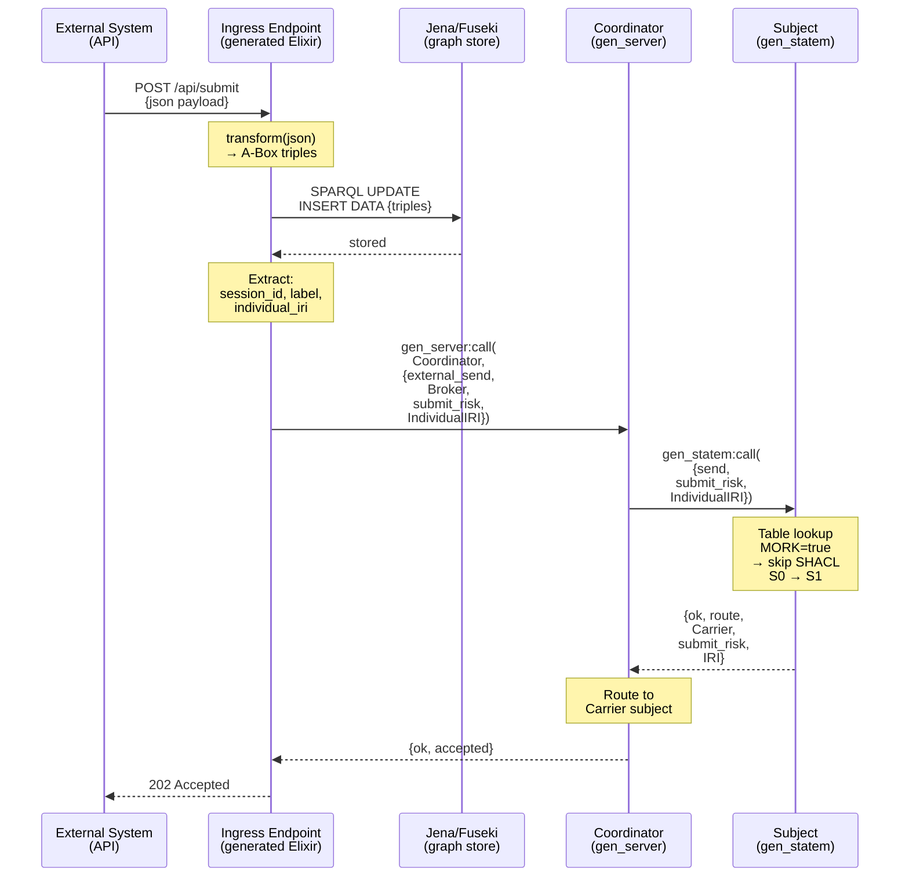
```mermaid
sequenceDiagram
    participant EXT as External System<br/>(API)
    participant ING as Ingress Endpoint<br/>(generated Elixir)
    participant DB as Jena/Fuseki<br/>(graph store)
    participant COORD as Coordinator<br/>(gen_server)
    participant SUBJECT as Subject<br/>(gen_statem)

    EXT->>ING: POST /api/submit<br/>{json payload}

    Note over ING: transform(json)<br/>→ A-Box triples

    ING->>DB: SPARQL UPDATE<br/>INSERT DATA {triples}
    DB-->>ING: stored

    Note over ING: Extract:<br/>session_id, label,<br/>individual_iri

    ING->>COORD: gen_server:call(<br/>  Coordinator,<br/>  {external_send,<br/>   Broker,<br/>   submit_risk,<br/>   IndividualIRI})

    COORD->>SUBJECT: gen_statem:call(<br/>  {send,<br/>   submit_risk,<br/>   IndividualIRI})

    Note over SUBJECT: Table lookup<br/>MORK=true<br/>→ skip SHACL<br/>S0 → S1

    SUBJECT-->>COORD: {ok, route,<br/>Carrier,<br/>submit_risk,<br/>IRI}

    Note over COORD: Route to<br/>Carrier subject

    COORD-->>ING: {ok, accepted}
    ING-->>EXT: 202 Accepted
```

Key architectural points:
1.	The payload is materialised into the graph store before it reaches the SPC interpreter. The gen_statem never sees raw JSON — it sees an IRI reference to a typed individual.
2.	The gen_statem's payload is an IRI (an atom or binary in Erlang), not the actual data. This keeps the process heap minimal. The data lives in Jena.
3.	The MORK flag means the gen_statem trusts the ingress endpoint's output without re-validation. This trust is earned at design time by the MORK completeness check.

### Runtime Message Flow: Outbound (SPC → External)

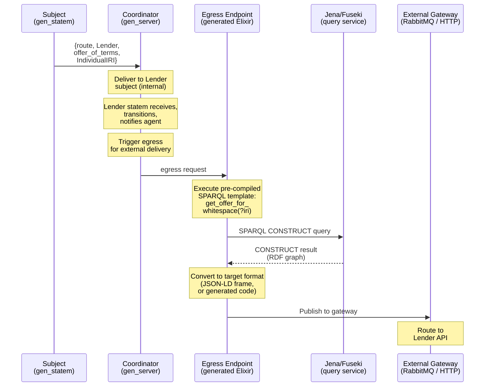
```mermaid
sequenceDiagram
    participant SUBJECT as Subject<br/>(gen_statem)
    participant COORD as Coordinator<br/>(gen_server)
    participant EGRESS as Egress Endpoint<br/>(generated Elixir)
    participant JENA as Jena/Fuseki<br/>(query service)
    participant GATEWAY as External Gateway<br/>(RabbitMQ / HTTP)

    SUBJECT->>COORD: {route, Lender,<br/>offer_of_terms,<br/>IndividualIRI}

    Note over COORD: Deliver to Lender<br/>subject (internal)

    Note over COORD: Lender statem receives,<br/>transitions,<br/>notifies agent

    Note over COORD: Trigger egress<br/>for external delivery

    COORD->>EGRESS: egress request

    Note over EGRESS: Execute pre-compiled<br/>SPARQL template:<br/>get_offer_for_<br/>whitespace(?iri)

    EGRESS->>JENA: SPARQL CONSTRUCT query
    JENA-->>EGRESS: CONSTRUCT result<br/>(RDF graph)

    Note over EGRESS: Convert to target format<br/>(JSON-LD frame,<br/>or generated code)

    EGRESS->>GATEWAY: Publish to gateway

    Note over GATEWAY: Route to<br/> Lender API
```

Key architectural point: The subject process (gen_statem) does NOT perform the egress call. The coordinator (or a dedicated egress worker) handles external delivery. The subject process's responsibility ends when it emits {route, Partner, Label, IRI}. This means:
- Slow APIs do not block the gen_statem
- HTTP failures do not crash the subject process
- The retry/backoff logic (from EXT-Job) lives in the egress layer, not in the interpreter
- The subject process remains a pure state machine: it transitions and routes, nothing else
External API calls can be handled in multiple ways:
1. Direct Elixir HTTP client (e.g., Finch, Req): The egress endpoint function calls the carrier API directly from the BEAM. Suitable for simple, low-latency integrations.
2. Post to RabbitMQ exchange: The egress endpoint publishes a message (with the formatted payload) to a RabbitMQ exchange with a routing key like carrier.AXA.{label}. A separate integration gateway (Java/Spring, Camel, or another BEAM application) consumes from the queue and handles the actual HTTP call, with its own retry/circuit-breaker logic. This decouples the SPC runtime from carrier API reliability.
3. Post to a topic (NATS, Kafka): Similar to RabbitMQ but with different delivery semantics. Appropriate for event-driven architectures.

The choice between these is operational, not architectural – the SPC subject process is unaffected. The coordinator's egress dispatch is a single function call whose implementation can be swapped.

### Apache Jena

Jena Fuseki runs as an external service (JVM, separate container). It is NOT embedded in the BEAM. This is essential for:
- Failure isolation: A Jena OOM or query timeout does not crash Erlang processes
- Independent scaling: Jena can be scaled, replicated, or replaced without touching the BEAM runtime
- Technology separation: The BEAM runtime has no Java dependency

Jena serves two purposes at runtime:
1. Ingress materialisation: Ingress endpoints write A-Box triples to Fuseki via SPARQL UPDATE. This is the data store for all business objects (quotes, claims, risk submissions) in their ontological form.
2. Egress query service: Egress endpoints read from Fuseki via pre-compiled SPARQL templates. The query templates were validated at design time; at runtime, they are executed with bound parameters.

This Jena instance does not have to perform:
- OWL reasoning at runtime (all reasoning happened at design time)
= SHACL validation in the critical path (SHACL fallback is invoked by the Elixir boundary layer, not by Jena serving queries)
- Type checking of any kind

The Fuseki endpoint is effectively a typed document store with a SPARQL query interface. The "typing" is structural – it was established by the MORK ingress transformation, not by runtime classification.

JSON-LD consideration: As discussed earlier, Jena's Fuseki can be configured to return SPARQL CONSTRUCT results in JSON-LD format directly. If the egress format is JSON-LD (or can be expressed as a JSON-LD frame application), the egress endpoint can skip the explicit format conversion step and receive JSON directly from Fuseki. 

## Architecture Thesis (Condensed)
### Mork Calculus at the Edges

An implementation of the SPC calculus faces a classic boundary problem: data arrives from Whitespace, from carrier APIs, from email extractors, in heterogeneous schemas with no guaranteed semantic alignment. The SPC framework describes runtime refinement checking because we cannot know at protocol definition time whether a given carrier's quote payload will satisfy some constraint such as ins:ValidQuote? 

A refinement predicate {q: Quote | q ∈ ins:ValidQuote} must therefore be checked at message receipt because the data's conformance is uncertain. With Mork, this uncertainty is eliminated at the boundary. 

#### LLM-Augmented Data Mapping

MORK's role is primarily as an output target for Large Language Model (LLM) mediated mapping, positioned to meet the demands of Semantic Enterprise Integration, where heterogeneous data sources (e.g., carrier APIs, document extraction pipelines, regulatory feeds, market data, and internal system feeds) must be unified under a common ontological model. 
As such, it targets several dimensions simultaneously:
1. Structural correspondence: how fields, entities, and nesting relationships in source schemas relate to classes, properties, and individuals in a target ontology.
2. Semantic alignment: which abstract concepts underlie source data elements, and how those concepts correspond to formal ontological definitions.
3. Executable transformation: how correspondence and alignment are compiled into concrete OWL assertions across T-Box (classes and class axioms), R-Box (property axioms), and A-Box (individual assertions and property instantiations).
4. Compositional ordering: where mappings frequently compose into directed acyclic graphs, forcing intake processes to individuate classes before asserting members, assert individuals before linking them via object properties, and resolve reference data before binding values.
5. Contextual application: where mapping generated axioms must be anchored not to the concurrent context, but to a parent mapping's outcome, requiring explicit redirection of the execution context.
6. Governance and provenance: where every mapping decision (whether generated by a human data architect or proposed by an LLM) must carry confidence, rationale, review status, and an auditable trace.
7. Constraint generation: where mappings serve not only to transform data but to produce validation shapes (SHACL), inference rules (SWRL), and query templates (SPARQL/Cypher) that enforce business semantics at runtime.

Upon these dimensions, Mork also services natural language processing (NLP): compiling business-language product criteria, eligibility rules, and data integration specifications into typed path expressions, SHACL shapes, SPARQL query templates, and SWRL rules. 

From these “mapping facts,” generated API binding code performs the translation deterministically at runtime. By the time a quote or claim enters the system, it is already an A-Box individual correctly typed against our T-Box. The mapping is validated once (when Mork generates it) and reviewed, not on every message received.

#### Consequences of Generative (Design-Time) Mapping
Given the “generative” approached described above, a refinement predicate check such as the one for q ∈ ins:ValidQuote is not a runtime discovery, but a structural consequence of how the individual was constructed. 

If the Mork mapping correctly maps the Whitespace quote schema to your ontology, then every quote arriving through that binding is, by construction, an ins:Quote with the required properties. Generated SHACL shapes can validate completeness (all required properties present), and if validation passes at ingestion, an individual's type membership is established permanently in the A-Box.

Thus, the Mork layer converts what the SPC framework treats as a runtime refinement check into a static mapping validation problem. 

#### An Aside: Subtyping Subtleties
There are some critical subtleties to be mindful of here. The OWL reasoner is capable of checking classification and consistency but cannot verify well formedness conditions (linearity, contractiveness, coherence, projectability), since these require SHACL.

The DL specification encodes typing judgments as reified assertions, not as entailments.  The OWL reasoner does not derive that Γ ⊢ B∶ T; someone (or some external tool) must assert it, and then the reasoner checks consistency. This means the reasoner is a consistency checker for typing assertions, not a type inference engine. 

Coinductive subtyping, in particular, is not handled by the reasoner. The bounded-unfolding workaround we provide, whilst sound, is incomplete. The DL spec's encoding of subtyping (Axioms 4.2.1–4.2.8) encodes subtyping as an asserted relation with constraints — it does not compute the relation. Someone must assert subtypeOf(T1,T2) and the reasoner checks whether the assertion is consistent with the constraints. This is weaker than what a purpose-built subtyping algorithm (like Gay-Hole's O(n²) algorithm) would provide.

#### Where Subtyping Arises in the Architecture

Subtyping in SPC serves a specific purpose: it enables the [T-Sub] rule (subsumption), which allows a behaviour with a more specific type to be used where a more general type is expected, which matters in two places:

Typing internal choice: When a subject has B₁ + B₂ where B₁ sends label ℓ₁ and B₂ sends label ℓ₂, both branches must have a common supertype. The singleton type !r.l₁⟨S₁⟩.T₁ must be a subtype of !r.{l₁⟨S₁⟩.T₁,l₂⟨S₂⟩.T₂}. This is the {l₁} ⊆ {l₁,l₂} check from [Sub-Out]. It is trivial: a set containment check on label sets, with no recursion involved.

Protocol refinement: When a protocol is specialised (say, a particular carrier only supports a subset of the standard message types), the specialised local type must be a subtype of the general one. A carrier who offers only {offerTerms,decline} instead of the full {offerTerms,revisedOffer,decline} has a local type where the output label set is a subset of the general carrier's. Again, this is label set containment plus structural comparison of matching branches.

Now let’s consider where coinductive subtyping would actually arise: when you have two recursive types and you need to compare their infinite unfoldings. For example:
```
T₁ = μt.!q.{l⟨S⟩.?q.{m⟨S'⟩.t}}
T₂ = μt.!q.{l⟨S⟩.?q.{m⟨S'⟩.?q.{n⟨S''⟩.t}}}
```

Is T₁ <: T₂? You would need to unfold both, compare, unfold again at the recursive call, compare again, and determine whether the relationship holds at all depths. This requires the coinductive reasoning.

### Three Phase Architecture (Functor Decomposition)
The architecture decomposes into three phases, each of which can be understood as a functorial mapping between categories of formal objects. This is not merely an analogy; the categorical language makes precise what each phase preserves and what it discards.

#### Phase I: Protocol Specification and Verification (Design Time)
This phase operates in the category DL of description logic knowledge bases. Its input is a protocol definition expressed as A-Box individuals instantiating the SPC T-Box. Its output is a verified, projected, extracted collection of state machine tables and payload validation shapes.

The objects in this phase are:
- The SPC T-Box T_SPC (the 106 axioms)
- A domain ontology T_domain (the NSDP insurance ontology)
- A protocol A-Box A_protocol (specific protocol definitions)
- Derived artifacts: local type A-Box individuals, state machine tables, SHACL payload shapes

#### Phase II: Boundary Mapping and Validation (Integration Time)
This phase operates across the boundary between external data schemas and the ontological representation. Its input is a collection of external API schemas (Whitespace, carrier ACORD XML, portal formats). Its output is a set of validated, deterministic transformation functions that convert raw data into well-typed A-Box individuals.

The key formal object here is the Mork mapping, which we will specify precisely below. A validated Mork mapping converts what would otherwise be a runtime refinement check into a structural invariant of the transformation itself.

#### Phase III: Runtime Execution (Session Time)
This phase operates in the trivial category of finite automata. Its input is a state machine table (a finite function from state × event to state × action). Its execution requires no reasoning, no entailment checking, and no type verification. It is a pure interpreter.

The coherence of the overall architecture rests on proving that the composition of these three phases preserves the safety properties established by the SPC metatheory. We now specify each phase in detail.

### Phase 1: Protocol Verification via the Reasoner

#### The SPC T-Box as a Fixed Categorical Object
The SPC T-Box T_SPC is a finite, fixed collection of OWL 2 DL axioms. It does not grow with the number of protocols, the number of participants, or the complexity of the domain. It is the image of the functor `O_structure: SPC^op→ DL`
applied to the abstract syntactic and typing structures of the Subject Process Calculus. The contravariance (where refinement in SPC corresponds to conservative extension in DL) is essential to the design: narrowing the space of possible behaviors corresponds to expanding the set of known facts.

The T-Box decomposes into layers, mirroring the three-layer integration architecture (structural, typing, and domain integration).

#### Protocol Definition as A-Box Instantiation
A specific protocol (e.g., the placement negotiation protocol from the insurance domain) is a collection of A-Box individuals that instantiate the T-Box concepts. This distinction is fundamental: the T-Box is the fixed type theory and each protocol is a model of that theory.

A protocol A-Box A_protocol contains individuals such as:
```
:PlacementNegotiation a 	:WellFormedGlobalType ; 
:hasSenderRole 		 		:Broker ; 
:hasReceiverRole 	 		:Carrier ; 
:hasMessageOption 	 		:opt_submitRisk .

:opt_submitRisk a 		    :MessageOption ; 
:hasOptionLabel 			"submitRisk" ; 
:hasPayloadSort 			:RiskSubmission_sort ; 
:hasRefinementPredicate 	:pred_validRiskSubmission ; 
:hasContinuationType 		:AwaitQuotePhase .

:pred_validRiskSubmission a :ConceptMembershipPredicate ; 
:hasTargetConcept 		  	ins:ValidRiskSubmission .
```

Each of these individuals is classified against the T-Box by the reasoner. The individual PlacementNegotiation is asserted to be a WellFormedGlobalType, so the reasoner checks whether this assertion is consistent with the T-Box axioms. If the axioms defining WellFormedGlobalType require linearity, contractiveness, coherence, and projectability, then the reasoner must verify that the A-Box individual satisfies all four conditions or report an inconsistency.

#### Well-Formedness Verification via SHACL
The OWL reasoner handles classification and consistency, but certain well-formedness conditions are more naturally expressed as shape constraints. Each of the four well-formedness conditions from Definition 4.3 of the foundations translates to a SHACL shape:

##### Linearity (all labels in a communication type are distinct)
This can be expressed as a SHACL shape targeting CommunicationGlobalType individuals, with a SPARQL-based constraint that detects duplicate labels among message options: For each pair of distinct message options ?o₁, ?o₂ linked from the same communication type, their labels must differ. If any pair shares a label, the shape reports a violation.

##### Contractiveness (every recursive variable is guarded under a communication prefix)
This is a syntactic condition on the structure of the protocol definition, which can be expressed as a SHACL shape that traverses the recursive structure and verifies that no recursion variable appears without an intervening communication type.

##### Coherence (parallel compositions have disjoint participant sets)
This can be expressed as a SHACL shape targeting ParallelGlobalType individuals, checking that no participant appears in both the left and right components.

##### Projectability (non-involved participants see identical projections across all branches)
This is the most complex shape, requiring comparison of projections across branches for each non-participant. It could be expressed as a SPARQL-based constraint that, for each communication type, each non-sender-non-receiver participant, and each pair of branches, verifies that the projections are equal.

**NB**: due to the cyclic dependency on projectability, an external program is a more likely candidate for enforcement.
The composition of these four shapes produces a single validation result: either the protocol passes all shapes (and is therefore well-formed) or it fails one or more (with specific violation reports identifying the offending construct).

**The metatheoretic consequence**: Theorem 1.8.5 proves that well-formed protocols guarantee deadlock freedom. The SHACL validation checks the premises of this theorem. If the premises hold, the conclusion follows by mathematical proof in the metalanguage. 

As alluded to previously, this is how programming language type checkers work: the enforce the premises (well-typedness) and the metatheory of the type system guarantees conclusions (e.g., type safety). Here the reasoner and SHACL validations perform the same role over ontological structures rather than source code.

##### Projection as Materialization

The projection operation (Definition 4.7 of the foundations) extracts a participant's local type from the global type. In the traditional implementation, this would be a function: `project∶ GlobalType → ParticipantRole → LocalType`.

In the ontological architecture, projection is a materialization step: a SPARQL CONSTRUCT query (or a set of SWRL rules) that operates on the protocol A-Box and produces new A-Box individuals representing the local types.
For the sender case, the CONSTRUCT query reads:
```
Given a CommunicationGlobalType with sender ?participant and receiver ?receiver, construct an OutputLocalType for ?participant with the same labels, payload sorts, and recursively projected continuations.
For the receiver case, symmetrically, construct an InputLocalType.
For the non-participant case (which depends on projectability): since the well-formedness validation has already verified that all branches project identically for non-involved participants, the projection simply takes any branch's projection.
```

The output of this materialization step is a collection of local type A-Box individuals (one per participant per protocol). These individuals are derived artifacts: they are computable from the protocol definition and do not need to be asserted manually. They are computed once, at protocol definition time, and stored as part of the protocol's verified artifact bundle.

The correctness of this step rests on Theorem 1.4.17 (Projection Commutes with Reduction), which ensures that the derived local types faithfully represent the participants' views of the protocol. The SPARQL CONSTRUCT query implements the case analysis of Definition 1.4.7, and its correctness can be verified by inspection against that definition.

#### State Machine Extraction
Each local type, once materialized as an A-Box individual, describes a finite (possibly recursive, but bounded) automaton. The extraction of this automaton is a graph traversal over the A-Box.

For a local type beginning with an output: OutputLocalType with target ?q and options {(l₁,S₁,T₁),(l₂,S₂,T₂),...}
the corresponding state machine state is: State n: type = SEND,partner = ?q,valid_labels = {l₁,l₂,...} Transition: on l₁ → state(T₁),on l₂ → state(T₂),...

For an input type: State m: type = RECEIVE,partner = ?p,valid_labels = {l₁,l₂,...} Transition: on l₁ → state(T₁),on l₂ → state(T₂),...

For end: State k: type = END

For recursive types, the unfolding is bounded by the protocol's finite structure. The contractiveness condition ensures that every recursive unfolding reaches a communication prefix, so the state machine has finitely many distinct states (up to the recursion bound). In practice, insurance protocols have natural termination conditions (deadlines, maximum negotiation rounds, regulatory timeframes), so the recursion depth is bounded by business rules.

The extracted state machine is serialized as a static artifact such as a JSON document, protocol buffer, or any other format suitable for loading into a runtime interpreter. For example:

```json
{
  "protocol": "BorrowingNegotiation",
  "participants": {
    "Broker": {
      "initial_state": 0,
      "states": {
        "0": {
          "type": "SEND",
          "partner": "Lender",
          "valid_labels": ["submitOffer"],
          "payload_shapes": {
            "submitRisk": "shapes/ValidSubmission.ttl"
          },
          "transitions": {
            "submitRisk": 1
          }
        },
        "1": {
          "type": "RECEIVE", "partner": "Lender",
          "valid_labels": ["offerTerms", "revisedOffer", "decline"],
          "transitions": { "offerTerms": 2, "revisedOffer": 2, "decline": 99 }
        }, 
    … etc
}
```

The artifact encodes the complete behavioral contract for each participant. Given this table, the runtime engine must verify, for any participant in any state, whether a proposed action (send or receive) is valid by a single table lookup.

A more detailed implementation guide is available in the reference architecture document accompanying this paper.

#### Payload Shape Extraction
Each message label in the protocol carries a refinement predicate constraining the payload. For the label "submitRisk" with predicate {x∶ RiskSubmission | x ∈ ins:ValidRiskSubmission}, the corresponding SHACL shape validates that an A-Box individual:
```
    Is of type ins:RiskSubmission
    Has all properties required by the ins:ValidRiskSubmission concept (ins:hasRiskClass, ins:hasSumInsured, ins:hasExposureSet, etc.)
    Satisfies any additional constraints defined in the domain ontology
```

These shapes are derived from the refinement predicates at protocol definition time. For each concept membership predicate {x ∈ C}, the shape is the SHACL expression of the necessary conditions for membership in C. For role assertion predicates {(x,y) ∈ R}, the shape requires the existence of the appropriate role assertion. For arithmetic predicates, the shape includes SPARQL-based constraint components.

The extracted shapes are serialized alongside the state machine tables. At runtime, if a payload arrives through a Mork-mapped channel, the shape validation is redundant (the Mork mapping already guarantees type membership). If a payload arrives through an unmapped channel (manual entry, email extraction), the shape validation serves as a defense-in-depth check.

## Phase 2. The Mork Boundary Closure
### The Boundary Problem

Without Mork, the system faces a fundamental epistemological problem at its boundary: data arrives from external systems (Whitespace, carrier APIs, email extractors) in heterogeneous schemas with no guaranteed semantic alignment. 

The framework addresses this through runtime refinement checking, to determine whether the incoming data satisfies the protocol's type constraints.

Such runtime checks are expensive (since they may require ontological reasoning), fragile (if they fail at the worst possible moment), and architecturally burdensome (due to the requirement for a reasoner in the critical path of message delivery).

Mork eliminates this problem by closing the boundary at integration time. A Mork mapping is a declarative specification of how an external schema maps to the domain ontology. It is produced by an LLM-assisted process (reading the external schema, generating candidate mappings) with human review. Once validated, the mapping is compiled into a deterministic transformation function that converts raw external data into well-typed A-Box individuals.

#### The Mork Mapping as a Natural Transformation
Let us define the formal structure. Consider two categories:

**Ext**: the category of external data schemas. Objects are schemas (JSON schemas, XML schemas, ACORD specifications). Morphisms are schema transformations (field renamings, type coercions, structural rearrangements).

**Ont**: the category of ontological individuals. Objects are A-Box individual descriptions (sets of type assertions and role assertions about a named individual). Morphisms are ontological updates (adding assertions, specializing types).

A Mork mapping for a particular external schema E and a target ontology concept C is a functor M_{E→C} : Inst(E) → Ind(C) from the category of instances of schema E to the category of individuals of concept C. More concretely, it is a function that takes a JSON object conforming to schema E and produces a set of RDF triples that, when asserted in the A-Box, constitute a well-typed individual of concept C.

The mapping is specified declaratively as a set of field-to-property correspondences, where each correspondence specifies:
- The source field path in the external schema
- The target property in the domain ontology
- Any type coercion or value mapping required
- Whether the mapping is mandatory or optional

The collection of correspondences constitutes the mapping. The compiled transformer applies each correspondence to an input document, producing a set of triples. The result is an A-Box individual with:
- A type assertion (:individual_x a ins:Quote)
- Role assertions for each mapped field (:individual_x ins:hasPremium "500000"^^xsd:decimal)
- Value-mapped assertions (:individual_x ins:hasStatus skos:firmQuote)

#### Mork Validation: Completeness Checking
If the protocol requires {q ∈ ins:ValidQuote}, and ins:ValidQuote is defined in the domain ontology as requiring properties ins:hasPremium, ins:hasLimit, ins:hasAttachmentPoint, ins:hasStatus, and ins:hasValidity, then the Mork mapping must map source fields to all five of these properties. If any is missing, the mapping is incomplete, and individuals produced by it will not satisfy the refinement predicate. 

This completeness check is performed at integration time. The procedure is:
- Extract the SHACL shape for ins:ValidQuote (either from the domain ontology directly, or derived from the refinement predicate as described in Section 8).
- Generate test data from the external schema (either actual test payloads or synthetic data covering all fields).
- Apply the Mork transformation to the test data, producing A-Box individuals.
- Run the SHACL shape validation against the produced individuals.

If validation passes, the mapping is certified: every individual produced by this mapping will satisfy the refinement predicate. If validation fails, the mapping must be corrected.

#### Mork Completeness Theorem (informal).
If a Mork mapping M_{E→C}  passes SHACL validation against the shape S_C derived from the refinement predicate for concept C, and if the external system E delivers data conforming to schema E, then for every instance d conforming to `E: M_{E→C}(d) ⊨ S_C`

That is, the produced individual satisfies the shape. 

The conditions under which this guarantee holds are:
- The external system actually delivers data conforming to its declared schema (if Whitespace sends malformed JSON, the transformer will error, which is detected)
- The Mork mapping has not been modified since validation (configuration management)
- The domain ontology's definition of the target concept has not changed since validation (version control)

All three conditions are operational discipline requirements, not theoretical limitations.

#### Elimination/Reduction of Runtime Refinement Checking
With Mork validated, the runtime refinement check "does value v satisfy predicate φ under ontology Ω?"
is replaced by "was value v produced by a validated Mork transformer?"

For channels with validated Mork mappings, the provenance check is trivially true by construction: the individual was created by the Mork ingress pipeline, which only produces individuals through validated transformers. The refinement predicate is satisfied by the structural properties of the transformation, not by runtime evaluation.

For channels without Mork mappings (manual entry, email extraction by LLM, novel carrier APIs not yet mapped), the SHACL validator must be invoked at runtime as a fallback. This is the one case where runtime reasoning remains necessary — but it is off the critical path for all mapped channels, and the set of mapped channels grows monotonically over time as new integrations are added.
