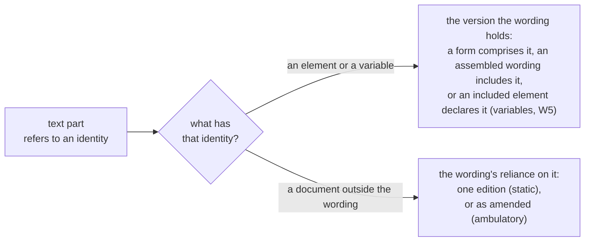

<!-- SPDX-License-Identifier: CC-BY-SA-4.0 -->

# Wording Ontology: what a contract's documents say, and how they are built

Literate specification for the Wording layer ([ADR-A112](../../docs/architecture/decisions/ADR-A112-wording-layer.md)).

---

## 1. Purpose and scope

A contract's text has a structure of its own, independent of what it means in law. Parts nest and
are ordered. Text embeds values supplied per instance and refers to defined words, other parts and
documents outside the text. Wording models that structure. What the text means in law (terms,
legal relations, parties) is the Instrument layer's, which states each term's meaning against the
wording element that expresses it ([ADR-A104](../../docs/architecture/decisions/ADR-A104-instrument-terms-and-legal-relations.md)
decision 2).

Wording imports Foundation, Vocabulary, Quantification and Eligibility, and is imported by
Instrument. It names no term of a higher layer.

This release (`0.7.0`) holds structure, text parts, references, document objects and variables
(since `0.1.0`), tables, assembly and the values an instance supplies (since `0.2.0`), textual
amendments with the shapes for the layer's laws (since `0.3.0`), and references by identity, with
editions and reliance for documents outside the wording (since `0.7.0`). Breaking changes are listed
in the release notes (§10).

## 2. Namespace and prefixes

```turtle-spec
@prefix wrd:  <https://www.nebularis.org/neuro-semantic/lattice/wording#> .
@prefix fnd:  <https://www.nebularis.org/neuro-semantic/lattice/foundation#> .
@prefix voc:  <https://www.nebularis.org/neuro-semantic/lattice/vocabulary#> .
@prefix qnt:  <https://www.nebularis.org/neuro-semantic/lattice/quantification#> .
@prefix elg:  <https://www.nebularis.org/neuro-semantic/lattice/eligibility#> .
@prefix prov: <http://www.w3.org/ns/prov#> .
@prefix skos: <http://www.w3.org/2004/02/skos/core#> .
@prefix owl:  <http://www.w3.org/2002/07/owl#> .
@prefix rdf:  <http://www.w3.org/1999/02/22-rdf-syntax-ns#> .
@prefix rdfs: <http://www.w3.org/2000/01/rdf-schema#> .
@prefix xsd:  <http://www.w3.org/2001/XMLSchema#> .
```

## 3. Extraction contract

- `turtle-spec` blocks generate `spec/wording.ttl`.
- `turtle-vocab` blocks generate `vocab/wording-vocab.ttl`.
- `turtle-shapes` blocks generate, in order, `shapes/structural.ttl` (§7) and
  `shapes/constraints.ttl` (§8).
- `turtle-example` blocks are illustrative only. The worked examples live in `examples/`.

```bash
python3 tools/literate_extract.py ontology/wording/README.md --layer wording --root . \
    --shapes shapes/structural.ttl shapes/constraints.ttl --check
```

## 4. Worked examples

Authored before this specification ([ADR-A-C2](../../docs/architecture/decisions/ADR-AC2-clean-room-authoring-procedure.md)).
Each file opens with its premise.

| Example | Shows |
|---|---|
| [`facility-agreement.ttl`](examples/facility-agreement.ttl) | a wording tree ordered by rank key, a clause as five text parts with a reference to a definition and to a variable, an annex that refers to a scanned document |
| [`trial-protocol.ttl`](examples/trial-protocol.ttl) | a schedule, an embedded variable with admissible values, a governing variable never shown in text, a reference to an external regulation, a clause classification, a table whose fields the form declares and whose entries (study arms) one trial supplies, a table whose fields and entries the form both declares, that trial's assembled protocol, and an amendment inserting a field |
| [`facility-form.ttl`](examples/facility-form.ttl) | a library form with a mandatory clause, a variation slot of two variants, an optional clause and a conditional clause reading a governing variable, and a facility assembled from it, with a multi-valued list of jurisdictions |
| [`reused-clause.ttl`](examples/reused-clause.ttl) | a lease form in two editions in which clause 5.1 is one version, though the definition it mentions is revised, the variable it shows redeclared and a regulation it cites relied on at a newer edition. Display text, a static and an ambulatory reliance, an attachment at one edition, and a lease assembled from the second edition |
| [`facility-amendment.ttl`](examples/facility-amendment.ttl) | an amendment letter that replaces, strikes and substitutes, and appends, producing the facility's own revisions of library clauses, the same change stated twice, and a draft release of the form adopting one revision as a new variant. Read with `facility-form.ttl` |

Clause 4.1 of the facility agreement, "The Borrower shall pay interest at {margin} per annum", is
five text parts:

```turtle-example
ex:cl-4-1-p0 a wrd:TextPart ; wrd:partIndex 0 ; wrd:partText "The " .
ex:cl-4-1-p1 a wrd:TextPart ; wrd:partIndex 1 ; wrd:refersToObject ex:def-borrower-identity ;
    wrd:displayText "Borrower" .
ex:cl-4-1-p2 a wrd:TextPart ; wrd:partIndex 2 ; wrd:partText " shall pay interest at " .
ex:cl-4-1-p3 a wrd:TextPart ; wrd:partIndex 3 ; wrd:refersToVariable ex:var-margin-identity .
ex:cl-4-1-p4 a wrd:TextPart ; wrd:partIndex 4 ; wrd:partText " per annum." .
```

## 5. Model

### 5.1 The ontology

```turtle-spec
<https://www.nebularis.org/neuro-semantic/wording>
	rdf:type owl:Ontology ;
	owl:versionIRI <https://www.nebularis.org/neuro-semantic/lattice/wording/0.7.0> ;
	owl:imports <https://www.nebularis.org/neuro-semantic/lattice/foundation/0.4.0> ,
				<https://www.nebularis.org/neuro-semantic/lattice/vocabulary/0.4.0> ,
				<https://www.nebularis.org/neuro-semantic/lattice/quantification/0.7.0> ,
				<https://www.nebularis.org/neuro-semantic/lattice/eligibility/0.10.0> .
```

### 5.2 Wordings and elements

A wording is the root of one document's tree: an agreement, policy, form, protocol, or endorsement issued as a document of its own. An element is any part beneath it. Any new text is a new version superseding the old, under the same persistent identity. What kind of part an element is (a section, a clause, a schedule) is modelled as a concept, 
rather than a class.

The equivalence assertion on `WordingNode` also says something the reduntant subclass triples alone cannot: that every `WordingNode` is a `Wording` or an `Element`, and nothing else. Used for `rdfs:range` assertions.

```turtle-spec
wrd:Wording a owl:Class ;
	rdfs:subClassOf fnd:Version , fnd:Governable , wrd:WordingNode ;
	rdfs:label "Wording"@en ;
	rdfs:comment "The root of one document's wording tree." ;
	fnd:utility "One should exist per document. Changed text leads to a new wording version with the same fnd:hasIdentity superseding the old." .

wrd:Element a owl:Class ;
	rdfs:subClassOf fnd:Version , fnd:Governable , wrd:WordingNode ;
	rdfs:label "Element"@en ;
	rdfs:comment "A nestable part of a wording." ;
	fnd:utility "Typed with wrd:elementType. Use one of the content classes of §5.6 where the part carries content of its own. A changed element requires a new element version." .

wrd:WordingNode a owl:Class ;
	owl:equivalentClass [ a owl:Class ; owl:unionOf ( wrd:Wording wrd:Element ) ] ;
	rdfs:label "Wording node"@en ;
	rdfs:comment "Anything in a wording tree: a wording or one of its elements." ;
	fnd:utility "WordingNode is NOT meant to be used to make assertions. It names the subject of properties that apply to a whole wording and to its parts alike." .
```

### 5.3 Part and whole

`wrd:directlyComprises` is the only part-whole edge intended for making assertions, whilst `wrd:comprises` provides its transitive closure. The direct edge has no transitive sub-property, so that OWL 2 DL allows it be irreflexive and asymmetric.

```turtle-spec
wrd:comprises a owl:ObjectProperty , owl:TransitiveProperty ;
	rdfs:label "comprises"@en ;
	rdfs:domain wrd:WordingNode ;
	rdfs:range wrd:Element ;
	rdfs:comment "The transitive part-whole relation of a wording tree. Subject: a wording node. Value: an element at any depth below it." ;
	fnd:utility "wrd:comprises is NOT intended to be used for making assertions. Instead, wrd:directlyComprises should be used, whilst a reasoner or a compiled closure can supply skip-level containment." .

wrd:isComprisedBy a owl:ObjectProperty , owl:TransitiveProperty ;
	rdfs:label "is comprised by"@en ;
	rdfs:comment "Subject: an element. Value: a wording node at any depth above it." ;
	owl:inverseOf wrd:comprises .

wrd:directlyComprises a owl:ObjectProperty , owl:IrreflexiveProperty , owl:AsymmetricProperty ;
	rdfs:label "directly comprises"@en ;
	rdfs:subPropertyOf wrd:comprises ;
	rdfs:domain wrd:WordingNode ;
	rdfs:range wrd:Element ;
	rdfs:comment "A direct edge of a wording tree. Subject: a wording node. Value: one of its immediate parts, an element." .

wrd:isDirectlyComprisedBy a owl:ObjectProperty , owl:IrreflexiveProperty , owl:AsymmetricProperty ;
	rdfs:label "is directly comprised by"@en ;
	rdfs:subPropertyOf wrd:isComprisedBy ;
	rdfs:comment "Subject: an element. Value: the wording node immediately above it." ;
	owl:inverseOf wrd:directlyComprises .
```

### 5.4 Order and identity

Identity is not position. A rank key orders siblings lexicographically, so a part can be inserted between two others without renumbering anything. An object id is the number or label a reader sees ("4.1", "Schedule 1"), derived after assembly. The object id should not be used as an identity.

```turtle-spec
wrd:rankKey a owl:DatatypeProperty , owl:FunctionalProperty ;
	rdfs:label "rank key"@en ;
	rdfs:domain wrd:Element ; rdfs:range xsd:string ;
	rdfs:comment "A lexicographic key placing an element among its siblings. Subject: an element. Value: a string, at most one." ;
	fnd:utility "Choose keys that leave room between them (a0, b0), so an insertion takes a key in between and no sibling changes." .

wrd:objectId a owl:DatatypeProperty , owl:FunctionalProperty ;
	rdfs:label "object id"@en ;
	rdfs:domain wrd:WordingNode ; rdfs:range xsd:string ;
	rdfs:comment "The number or label a reader sees: 4.1, 4.B(2), Schedule 1. Subject: a wording node. Value: a string, at most one." ;
	fnd:utility "Presentation only. Two versions of a clause may carry different object ids and remain the same clause." .
```

### 5.5 Typing

What kind of part an element is, and how it is classified, are concepts drawn under scheme contracts. A deployment typically binds its own schemes. A basic set of element types ship with this layer.

```turtle-spec
wrd:elementType a owl:ObjectProperty , owl:FunctionalProperty ;
	rdfs:label "element type"@en ;
	rdfs:domain wrd:WordingNode ;
	rdfs:range skos:Concept ;
	rdfs:comment "What kind of part a wording or element is: a section, a clause, a schedule. Subject: a wording node. Value: a concept under wrd-voc:ElementTypeContract, at most one." ;
	fnd:utility "Drawn under wrd-voc:ElementTypeContract. A section is a part with a determined meaning of its own (its parties, authority or capacity), as the Instrument layer reads it." .

wrd:classification a owl:ObjectProperty ;
	rdfs:label "classification"@en ;
	rdfs:domain wrd:WordingNode ;
	rdfs:range skos:Concept ;
	rdfs:comment "A classification of a wording or element, beside its type: safety reporting, governing law, data protection. Subject: a wording node. Value: a concept under wrd-voc:ClassificationContract, any number." ;
	fnd:utility "Drawn under wrd-voc:ClassificationContract. An element may carry several." .
```

### 5.6 Content classes

Kinds of content that differ in their properties. Each is an element.

```turtle-spec
wrd:Text a owl:Class ;
	rdfs:subClassOf wrd:Element ;
	rdfs:label "Text"@en ;
	rdfs:comment "An element whose content is an ordered sequence of text parts." .

wrd:Table a owl:Class ;
	rdfs:subClassOf wrd:Element ;
	rdfs:label "Table"@en ;
	rdfs:comment "An element whose content is fields and entries, with a cell for each field and entry. Fields are declared in the wording, entries in the wording or per instance." .

wrd:Variable a owl:Class ;
	rdfs:subClassOf wrd:Element ;
	rdfs:label "Variable"@en ;
	rdfs:comment "A declaration of a value an instance supplies." .

wrd:Reference a owl:Class ;
	rdfs:subClassOf wrd:Element ;
	rdfs:label "Reference"@en ;
	rdfs:comment "An element linking to another part, a document object or an external document." .

wrd:Metadata a owl:Class ;
	rdfs:subClassOf wrd:Element ;
	rdfs:label "Metadata"@en ;
	rdfs:comment "Descriptive or system metadata carried in the wording." .

[] a owl:AllDisjointClasses ;
	owl:members ( wrd:Text wrd:Table wrd:Variable wrd:Reference wrd:Metadata wrd:Field wrd:Entry wrd:VariationSlot ) .
```

### 5.7 Text parts

Text is represented as a sequence of parts, with each part being one of three forms: literal text, a reference to a variable, or a reference to another part or document. Parts are indexed from 0 without gaps, which gives a closed-world order without an RDF list. A part belongs to one text and is not a version. Changed text is a new text version with new parts.

**A reference names what it refers to, never which version** (§5.8). A reference part names a persistent identity: a variable's, another element's, a wording's, or a document's outside the wording. The wording holding the text fixes the version it means, so a revised definition, or a redeclared variable, leaves every text mentioning it at the same version. A reference part may carry the words shown at that point, as the drafter wrote them (`wrd:displayText`): an inflected form, such as "Lessee's" for the defined word "Lessee", or a variable's printed name.

```turtle-spec
wrd:TextPart a owl:Class ;
	rdfs:label "Text part"@en ;
	rdfs:comment "One inline piece of a text: literal text, a variable reference or an object reference." ;
	rdfs:subClassOf [ a owl:Restriction ; owl:onProperty wrd:partIndex ; owl:cardinality "1"^^xsd:nonNegativeInteger ] ;
	fnd:utility "Give each part exactly one of wrd:partText, wrd:refersToVariable or wrd:refersToObject, and index the parts of one text 0 to n-1." .

wrd:hasTextPart a owl:ObjectProperty , owl:InverseFunctionalProperty ;
	rdfs:label "has text part"@en ;
	rdfs:domain wrd:Text ; rdfs:range wrd:TextPart ;
	rdfs:comment "A part of a text. Each part belongs to exactly one text. Subject: a text. Value: a text part, which belongs to no other text." .

wrd:partIndex a owl:DatatypeProperty , owl:FunctionalProperty ;
	rdfs:label "part index"@en ;
	rdfs:domain wrd:TextPart ; rdfs:range xsd:nonNegativeInteger ;
	rdfs:comment "The part's position in its text, from 0. Subject: a text part. Value: a non-negative integer, exactly one." .

wrd:partText a owl:DatatypeProperty , owl:FunctionalProperty ;
	rdfs:label "part text"@en ;
	rdfs:domain wrd:TextPart ; rdfs:range xsd:string ;
	rdfs:comment "The literal text of a part, spaces included. Subject: a text part. Value: a string, at most one." .

wrd:refersToVariable a owl:ObjectProperty , owl:FunctionalProperty ;
	rdfs:label "refers to variable"@en ;
	rdfs:domain wrd:TextPart ; rdfs:range fnd:PersistentIdentity ;
	rdfs:comment "The variable whose value the part shows. Subject: a text part. Value: the variable's persistent identity, at most one, resolved to the version the wording holding the text declares (law W8)." .

wrd:refersToObject a owl:ObjectProperty , owl:FunctionalProperty ;
	rdfs:label "refers to object"@en ;
	rdfs:domain wrd:TextPart ;
	rdfs:range fnd:PersistentIdentity ;
	rdfs:comment "The part, wording or document the part names: a defined word's definition, another clause, an annex, a regulation. Subject: a text part. Value: the target's persistent identity, at most one, resolved to the version the wording holds, or for a document outside it to the edition the wording relies on (law W8)." .

wrd:displayText a owl:DatatypeProperty , owl:FunctionalProperty ;
	rdfs:label "display text"@en ;
	rdfs:domain wrd:TextPart ; rdfs:range xsd:string ;
	rdfs:comment "The words a reference part shows, as the drafter wrote them: an inflected form or a variable's printed name. Subject: a text part with a reference. Value: a string, at most one. Without one, a renderer shows the target's own label." .
```

### 5.8 References and documents

A document object is an attachment whose content is not digitised: a scanned plan, a certificate. An external document sits outside the contract altogether: a regulation, a separate agreement. Both are outside the wording tree, reached by a reference element or a text part.

**Editions.** A document outside the wording has one persistent identity, and an **edition** for each text in force: each edition is a Foundation version, with the date it came into force as its temporal scope and the next edition through `fnd:supersededBy`. A reference to it names its identity, never an edition.

**Reliance.** The wording holding a reference says which edition it means, in one of two ways that contract law distinguishes:

| Reliance | Property | Means | The edition is |
|---|---|---|---|
| static | `wrd:reliesOnEdition`, naming an edition | "the Regulation as in force on 1 January 2027" | the one named, fixed when the wording is drafted or assembled |
| ambulatory | `wrd:reliesAsAmended`, naming the document's identity | "the Regulation as amended from time to time" | whichever is in force when a case is evaluated: a value the evaluation context supplies, which no design-time check resolves |

An attachment is part of what the parties agreed, so it is relied on statically. A form states its reliances, and an assembled wording inherits them from the form it is assembled from, unless it states its own.

**How a reference resolves.** Each tier already holds what resolution needs, so nothing is stored for it:



Law W8 checks that every reference finds exactly one version, or exactly one reliance (§8). A clause that names identities is one element version in every edition of its form, however often what it mentions is revised. Containment still names versions, so a section whose definition is revised takes a new version: references by identity remove the ripple through references, not through containment.

```turtle-spec
wrd:DocumentObject a owl:Class ;
	rdfs:subClassOf prov:Entity , fnd:Version , wrd:LinkedDocument ;
	rdfs:label "Document object"@en ;
	rdfs:comment "An attachment the wording relies on whose content is not digitised." ;
	fnd:utility "Each instance is one edition, with the attachment's persistent identity. A wording relies on one edition of it (wrd:reliesOnEdition)." .

wrd:ExternalDocument a owl:Class ;
	rdfs:subClassOf prov:Entity , fnd:Version , wrd:LinkedDocument ;
	rdfs:label "External document"@en ;
	rdfs:comment "A document outside the contract, that its wording relies on." ;
	fnd:utility "Each instance is one edition, with the document's persistent identity and the date it came into force. A wording relies on one edition (wrd:reliesOnEdition) or on the document as amended (wrd:reliesAsAmended)." .

wrd:LinkedDocument a owl:Class ;
	owl:equivalentClass [ a owl:Class ; owl:unionOf ( wrd:DocumentObject wrd:ExternalDocument ) ] ;
	rdfs:label "Linked document"@en ;
	rdfs:comment "A document outside the wording tree that the wording relies on." ;
	fnd:utility "Assertions should NOT be made using this class. Its subclasses are declared explicitly. For use by SHACL validators." .

wrd:ReferenceTarget a owl:Class ;
	owl:equivalentClass [ a owl:Class ; owl:unionOf ( wrd:WordingNode wrd:LinkedDocument ) ] ;
	rdfs:label "Reference target"@en ;
	rdfs:comment "Anything whose identity a text part or a reference element may name: a wording, an element, or a linked document." ;
	fnd:utility "Assertions should NOT be made using this class. Its subclasses are declared explicitly. For use by SHACL validators." .

wrd:WordingNode rdfs:subClassOf wrd:ReferenceTarget .
wrd:LinkedDocument rdfs:subClassOf wrd:ReferenceTarget .

wrd:documentKind a owl:ObjectProperty , owl:FunctionalProperty ;
	rdfs:label "document kind"@en ;
	rdfs:domain wrd:LinkedDocument ;
	rdfs:range skos:Concept ;
	rdfs:comment "What kind of document it is, drawn under wrd-voc:DocumentKindContract. Subject: a linked document. Value: a concept under wrd-voc:DocumentKindContract, at most one." .

wrd:linksTo a owl:ObjectProperty ;
	rdfs:label "links to"@en ;
	rdfs:domain wrd:Reference ;
	rdfs:range fnd:PersistentIdentity ;
	rdfs:comment "What a reference element points to. Subject: a reference element. Value: the target's persistent identity, resolved as a text part's reference is (law W8)." .

wrd:reliesOnEdition a owl:ObjectProperty ;
	rdfs:label "relies on edition"@en ;
	rdfs:domain wrd:Wording ; rdfs:range wrd:LinkedDocument ;
	rdfs:comment "An edition of a document outside the wording that the wording relies on, as in force at that edition: a static reliance. Subject: a wording. Value: an edition, any number, at most one per document (law W8)." .

wrd:reliesAsAmended a owl:ObjectProperty ;
	rdfs:label "relies as amended"@en ;
	rdfs:domain wrd:Wording ; rdfs:range fnd:PersistentIdentity ;
	rdfs:comment "A document outside the wording that the wording relies on as amended from time to time: an ambulatory reliance. Subject: a wording. Value: the document's persistent identity, any number. The edition is whichever is in force when a case is evaluated." .

[] a owl:AllDisjointClasses ;
	owl:members ( wrd:Wording wrd:Element wrd:TextPart wrd:DocumentObject wrd:ExternalDocument wrd:PopulationMethod wrd:InclusionMode wrd:VariableValue
		wrd:FieldOrientation wrd:Amendment wrd:AmendmentOperation ) .
```

### 5.9 Variables

A variable declares a value an instance supplies. An embedded variable is shown in the text. A
governing variable is never shown, and decides which parts of a library wording an instance
includes. A value is a concept (drawn under a scheme contract), a quantity (in a value space,
optionally within admissible ranges), a literal, a party or another instrument. The value itself
is recorded per instance (§5.12).

```turtle-spec
wrd:EmbeddedVariable a owl:Class ;
	rdfs:subClassOf wrd:Variable ;
	rdfs:label "Embedded variable"@en ;
	rdfs:comment "A variable shown within text." .

wrd:GoverningVariable a owl:Class ;
	rdfs:subClassOf wrd:Variable ;
	rdfs:label "Governing variable"@en ;
	rdfs:comment "A variable never shown in text, read by inclusion conditions." .

[] a owl:AllDisjointClasses ;
	owl:members ( wrd:EmbeddedVariable wrd:GoverningVariable ) .

wrd:PopulationMethod a owl:Class ;
	rdfs:label "Population method"@en ;
	rdfs:comment "How a variable's value is obtained: entered, picked from a list, looked up, taken from another variable, derived by rule." .

wrd:variableKey a owl:DatatypeProperty , owl:FunctionalProperty ;
	rdfs:label "variable key"@en ;
	rdfs:domain wrd:Variable ; rdfs:range xsd:string ;
	rdfs:comment "The variable's stable key within its wording. Subject: a variable. Value: a string, at most one." .

wrd:populationMethod a owl:ObjectProperty ;
	rdfs:label "population method"@en ;
	rdfs:domain wrd:Variable ; rdfs:range wrd:PopulationMethod ;
	rdfs:comment "Subject: a variable. Value: a population method." .

wrd:populatedFrom a owl:ObjectProperty , owl:FunctionalProperty ;
	rdfs:label "populated from"@en ;
	rdfs:domain wrd:Variable ; rdfs:range wrd:Variable ;
	rdfs:comment "Another variable, often in another part, whose value this one takes. Subject: a variable. Value: another variable, at most one." .

wrd:valueContract a owl:ObjectProperty , owl:FunctionalProperty ;
	rdfs:label "value contract"@en ;
	rdfs:domain wrd:Variable ; rdfs:range voc:SchemeContract ;
	rdfs:comment "For a concept-valued variable, the scheme contract its values are drawn under. Subject: a variable. Value: a scheme contract, at most one." .

wrd:valueSpace a owl:ObjectProperty , owl:FunctionalProperty ;
	rdfs:label "value space"@en ;
	rdfs:domain wrd:Variable ; rdfs:range qnt:ValueSpace ;
	rdfs:comment "For a quantity-valued variable, the value space its values are in. Subject: a variable. Value: a value space, at most one." .

wrd:admissibleValues a owl:ObjectProperty ;
	rdfs:label "admissible values"@en ;
	rdfs:domain wrd:Variable ; rdfs:range qnt:RangeSet ;
	rdfs:comment "A range set every value must fall in. Subject: a variable. Value: a range set." .

wrd:multiValued a owl:DatatypeProperty , owl:FunctionalProperty ;
	rdfs:label "multi-valued"@en ;
	rdfs:domain wrd:Variable ; rdfs:range xsd:boolean ;
	rdfs:comment "True when an instance may supply several values, as for a list of territories. Single-valued when absent. Subject: a variable. Value: a boolean, at most one." .
```

**Chains of variables must not loop.** A variable populated from another, which is populated from
the first, directly or through others, can never have a value. A layer that reads values through
variables must check for such loops, and Instrument does: a placeholder in its stated meaning may
take its value from a variable or from a defined word whose own value comes from a variable, so one
loop may pass through words and variables alike. Instrument's shapes report each hop of such a loop,
and its reference binder reports the whole loop in order, with the clause stating each hop
(Instrument README §18.4).


### 5.10 Tables

A table has two axes. Its fields say what is recorded, and are always declared in the wording, each
with what it means and the variable its cells take a value for. Its entries are what a value is
recorded for: a section, a party's occupancy, a study arm, a lot, which exist only in an instance,
or a fixed list the form declares itself, such as a list of duties. A cell is the value of a
field's variable for one entry (§5.12), so one field yields one value per entry. Which axis is
drawn as rows is presentation, stated by `wrd:fieldsAs`. A long list whose rows are only values,
such as a list of territories, is a multi-valued variable, not a table.

```turtle-spec
wrd:Field a owl:Class ;
	rdfs:subClassOf wrd:Element ;
	rdfs:label "Field"@en ;
	rdfs:comment "A field of a table, declared in the wording: what each entry records a value for." ;
	fnd:utility "A table directly comprises its fields, in rank order. A field usually comprises its own variable too, so the variable has a place in the tree." .

wrd:fieldKey a owl:DatatypeProperty , owl:FunctionalProperty ;
	rdfs:label "field key"@en ;
	rdfs:domain wrd:Field ; rdfs:range xsd:string ;
	rdfs:comment "What the field means, as its heading reads: Maximum limits, Screening sample volume. Subject: a field. Value: a string, at most one." .

wrd:fieldVariable a owl:ObjectProperty , owl:FunctionalProperty ;
	rdfs:label "field variable"@en ;
	rdfs:domain wrd:Field ; rdfs:range wrd:Variable ;
	rdfs:comment "The variable every entry supplies a value for in this field. Subject: a field. Value: a variable, exactly one." .

wrd:Entry a owl:Class ;
	rdfs:subClassOf wrd:Element ;
	rdfs:label "Entry"@en ;
	rdfs:comment "An entry of a table that the wording declares, so every instance has it." ;
	fnd:utility "Declare entries only when the form fixes them. Entries an instance supplies are not elements: a cell names them with wrd:forEntry." .

wrd:entryKey a owl:DatatypeProperty , owl:FunctionalProperty ;
	rdfs:label "entry key"@en ;
	rdfs:domain wrd:Entry ; rdfs:range xsd:string ;
	rdfs:comment "What the entry is, as its heading reads: Safety reporting. Subject: an entry. Value: a string, at most one." .

wrd:FieldOrientation a owl:Class ;
	rdfs:label "Field orientation"@en ;
	rdfs:comment "Whether a table draws its fields as rows or as columns: Rows or Columns (wrd-voc)." .

wrd:fieldsAs a owl:ObjectProperty , owl:FunctionalProperty ;
	rdfs:label "fields as"@en ;
	rdfs:domain wrd:Table ; rdfs:range wrd:FieldOrientation ;
	rdfs:comment "Whether the table draws its fields as rows or as columns. Presentation only. Subject: a table. Value: a field orientation, at most one." .
```

### 5.11 Assembly

Assembly happens at design time: an instance is drawn from a library form once, and its wording is
then fixed. Nothing here is evaluated per event. Each element of a form comes into an instance in
one of four ways, its inclusion mode: always (Mandatory, the default), as the one chosen variant
of a variation slot (Variation), at the drafter's choice (Optional), or when an inclusion
condition over the instance's governing variables holds (Conditional).

A variation slot is an element in its own right, ranked among its siblings and carrying the number
its variants share ("1.4"). Its variants sit beneath it, unranked, each lettered ("1.4A") in the
form only. An instance includes exactly one of them, numbered as the slot. An inclusion condition is
an Eligibility admission profile, each of whose conditions reads one governing variable. Assembly
poses the instance's value for that variable as an `elg:Question`.

```turtle-spec
wrd:InclusionMode a owl:Class ;
	rdfs:label "Inclusion mode"@en ;
	rdfs:comment "How an element comes to be in an instance: Mandatory, Variation, Optional or Conditional (wrd-voc)." .

wrd:inclusionMode a owl:ObjectProperty , owl:FunctionalProperty ;
	rdfs:label "inclusion mode"@en ;
	rdfs:domain wrd:Element ; rdfs:range wrd:InclusionMode ;
	rdfs:comment "How the element comes to be in an instance. Mandatory when absent. Subject: an element. Value: one of the four inclusion modes, at most one." .

wrd:VariationSlot a owl:Class ;
	rdfs:subClassOf wrd:Element ;
	rdfs:label "Variation slot"@en ;
	rdfs:comment "A position in a form that holds exactly one of several variants in any instance." ;
	fnd:utility "Give the slot the shared object id (1.4) and a rank key. Its variants carry inclusion mode Variation and a lettered object id (1.4A), and no rank key: they are alternatives, not siblings. The slot's variants' conditions are checked as a set (§8)." .

wrd:hasVariant a owl:ObjectProperty ;
	rdfs:label "has variant"@en ;
	rdfs:subPropertyOf wrd:directlyComprises ;
	rdfs:domain wrd:VariationSlot ; rdfs:range wrd:Element ;
	rdfs:comment "One of the slot's variants. A variant is part of the slot, so it is in the tree. Subject: a variation slot. Value: an element, the variant of no other slot." ;
	fnd:utility "Assert wrd:hasVariant, not wrd:directlyComprises, from a slot to its variants. A reasoner derives the part-whole edge. Shapes read both." .

wrd:variantOf a owl:ObjectProperty ;
	rdfs:label "variant of"@en ;
	owl:inverseOf wrd:hasVariant ;
	rdfs:comment "The slot an element is a variant of. Subject: an element. Value: a variation slot, several only when they are versions of one slot (law W1)." .

wrd:includedWhen a owl:ObjectProperty , owl:FunctionalProperty ;
	rdfs:label "included when"@en ;
	rdfs:domain wrd:Element ; rdfs:range elg:AdmissionProfile ;
	rdfs:comment "The inclusion condition of a conditional element or a variant, over the instance's governing variables. Subject: an element. Value: an admission profile, at most one." .

wrd:readsVariable a owl:ObjectProperty , owl:FunctionalProperty ;
	rdfs:label "reads variable"@en ;
	rdfs:domain elg:Condition ; rdfs:range wrd:GoverningVariable ;
	rdfs:comment "The governing variable whose instance value an inclusion condition is decided against. Subject: an Eligibility condition. Value: a governing variable, at most one." .
```

### 5.12 The assembled wording and its values

An assembled wording is one instance's text: the elements it includes, and the values it supplies.
It is asserted as such, never inferred, since a contract written from scratch is assembled from no
form at all. An instrument version is expressed in exactly one assembled wording
([ADR-A104](../../docs/architecture/decisions/ADR-A104-instrument-terms-and-legal-relations.md)).
Library elements are included, not copied: many instances include the same element version.

A variable value records an instance's value for one variable, and for one entry when the
variable is a table field's. A multi-valued variable's values all sit on its one value record, so a
single-valued variable is a variable whose record holds one value.

```turtle-spec
wrd:AssembledWording a owl:Class ;
	rdfs:subClassOf wrd:Wording ;
	rdfs:label "Assembled wording"@en ;
	rdfs:comment "The wording of one instance, drawn from forms or written for it alone." ;
	fnd:utility "Assert it on every instance's wording. A wording not so typed is a library form. A changed instance text is a new assembled wording version with the same fnd:hasIdentity." .

wrd:assembledFrom a owl:ObjectProperty ;
	rdfs:label "assembled from"@en ;
	rdfs:domain wrd:AssembledWording ; rdfs:range wrd:Wording ;
	rdfs:comment "A library form the instance was drawn from. Subject: an assembled wording. Value: a wording, any number, none for a contract written from scratch." .

wrd:includes a owl:ObjectProperty ;
	rdfs:label "includes"@en ;
	rdfs:domain wrd:AssembledWording ; rdfs:range wrd:Element ;
	rdfs:comment "An element version the instance includes. Recorded at assembly, never recomputed. Subject: an assembled wording. Value: an element." .

wrd:hasValue a owl:ObjectProperty , owl:InverseFunctionalProperty ;
	rdfs:label "has value"@en ;
	rdfs:domain wrd:AssembledWording ; rdfs:range wrd:VariableValue ;
	rdfs:comment "A value the instance supplies. Each value record belongs to one assembled wording. Subject: an assembled wording. Value: a variable value." .

wrd:VariableValue a owl:Class ;
	rdfs:label "Variable value"@en ;
	rdfs:comment "An instance's value or values for one variable, and for one entry when the variable is a table field's." ;
	rdfs:subClassOf [ a owl:Restriction ; owl:onProperty wrd:forVariable ; owl:cardinality "1"^^xsd:nonNegativeInteger ] ;
	fnd:utility "Not a version: it is part of its assembled wording, and changes only with it." .

wrd:forVariable a owl:ObjectProperty , owl:FunctionalProperty ;
	rdfs:label "for variable"@en ;
	rdfs:domain wrd:VariableValue ; rdfs:range wrd:Variable ;
	rdfs:comment "The variable the record supplies a value for. Subject: a variable value. Value: a variable, exactly one." .

wrd:value a owl:ObjectProperty ;
	rdfs:label "value"@en ;
	rdfs:domain wrd:VariableValue ;
	rdfs:comment "A value that is a resource: a concept, a quantity, a party's occupancy, an instrument. Subject: a variable value. Value: any resource, several for a multi-valued variable." ;
	fnd:utility "Deliberately has no range: what a value is depends on the variable's declaration, which a shape checks (wording 0.3.0, law W6)." .

wrd:literalValue a owl:DatatypeProperty ;
	rdfs:label "literal value"@en ;
	rdfs:domain wrd:VariableValue ;
	rdfs:comment "A value that is a literal: a number, a date, a string. Subject: a variable value. Value: a literal, several for a multi-valued variable." .

wrd:forEntry a owl:ObjectProperty , owl:FunctionalProperty ;
	rdfs:label "for entry"@en ;
	rdfs:domain wrd:VariableValue ;
	rdfs:comment "The entry a table cell's value is for: a declared entry, or a section, a party's occupancy, a study arm. Only for a table field's variable. Subject: a variable value. Value: any resource, at most one." .
```

### 5.13 Amendments

An amendment is a change to text, stated in a document: an endorsement, an amendment letter. Each
records one of five operations, the element it changed (`wrd:amendsElement`, a `prov:used`) and
every version it produced (`prov:generated`, with `wrd:replacement` for the new element of an
insert, append or replace). Two documents stating the same change are two amendments generating
the same version. What a change means in law is the Instrument layer's
([ADR-A104](../../docs/architecture/decisions/ADR-A104-instrument-terms-and-legal-relations.md)).

A library element is shared by every instance that includes it, so an instance's amendment never
produces a new version of one. Amending a library element produces a bespoke element, with an
identity of its own, `prov:wasRevisionOf` the library version, which the instance's new assembled
wording includes in its place. A new element an instance adds to a library parent is likewise the
instance's own, `wrd:placedUnder` that parent. The instance's assembled wording directly comprises
its bespoke elements. Deleting a library element generates only the new assembled wording, which
leaves it out.

A revision may be proposed back to the library as a draft release of the form whose new element is
`prov:wasDerivedFrom` the bespoke one. The release supersedes the library element, or turns it into
a variation slot with the original and the revision as variants. It changes no existing instance.

```turtle-spec
wrd:Amendment a owl:Class ;
	rdfs:subClassOf prov:Activity ;
	rdfs:label "Amendment"@en ;
	rdfs:comment "A change to the text of a wording, stated in a document." ;
	fnd:utility "Record what it changed with wrd:amendsElement and every version it produced with prov:generated or wrd:replacement." .

wrd:AmendmentOperation a owl:Class ;
	rdfs:label "Amendment operation"@en ;
	rdfs:comment "What an amendment does: Insert, Delete, Replace, Strike and substitute, or Append (wrd-voc)." .

wrd:operation a owl:ObjectProperty , owl:FunctionalProperty ;
	rdfs:label "operation"@en ;
	rdfs:domain wrd:Amendment ; rdfs:range wrd:AmendmentOperation ;
	rdfs:comment "What the amendment does. Subject: an amendment. Value: one of the five operations, exactly one." .

wrd:amendsElement a owl:ObjectProperty , owl:FunctionalProperty ;
	rdfs:label "amends element"@en ;
	rdfs:subPropertyOf prov:used ;
	rdfs:domain wrd:Amendment ; rdfs:range wrd:Element ;
	rdfs:comment "The element version the amendment changed: the replaced or struck element, or the parent of an inserted or appended one. Subject: an amendment. Value: an element, exactly one." .

wrd:replacement a owl:ObjectProperty , owl:FunctionalProperty ;
	rdfs:label "replacement"@en ;
	rdfs:subPropertyOf prov:generated ;
	rdfs:domain wrd:Amendment ; rdfs:range wrd:Element ;
	rdfs:comment "The new element of an insert, append or replace. Subject: an amendment. Value: an element, at most one." .

wrd:struckText a owl:DatatypeProperty , owl:FunctionalProperty ;
	rdfs:label "struck text"@en ;
	rdfs:domain wrd:Amendment ; rdfs:range xsd:string ;
	rdfs:comment "The words a strike and substitute removes. Subject: an amendment. Value: a string, at most one." .

wrd:substitutedText a owl:DatatypeProperty , owl:FunctionalProperty ;
	rdfs:label "substituted text"@en ;
	rdfs:domain wrd:Amendment ; rdfs:range xsd:string ;
	rdfs:comment "The words a strike and substitute puts in their place. Subject: an amendment. Value: a string, at most one." .

wrd:expressedIn a owl:ObjectProperty , owl:FunctionalProperty ;
	rdfs:label "expressed in"@en ;
	rdfs:domain wrd:Amendment ; rdfs:range wrd:WordingNode ;
	rdfs:comment "The part of the amending document that states the change. Subject: an amendment. Value: a wording node, exactly one." .

wrd:placedUnder a owl:ObjectProperty , owl:FunctionalProperty ;
	rdfs:label "placed under"@en ;
	rdfs:domain wrd:Element ; rdfs:range wrd:Element ;
	rdfs:comment "The library element an instance's own new element is presented under. Not a part-whole edge: the element's parent is the instance's assembled wording. Subject: an element. Value: an element, at most one." .
```

## 6. Vocabulary

The inclusion modes, population methods, amendment operations and field orientations are closed sets of named individuals. Three scheme
contracts govern the typing properties. Element types have a baseline scheme bound
as each contract's fallback. It holds every element type this layer's documentation and examples
use, and is not closed: a deployment binds a scheme of its own, which may extend it, through a
`voc:SchemeBinding`. Classifications and document kinds have no baseline.

```turtle-vocab
@prefix wrd:     <https://www.nebularis.org/neuro-semantic/lattice/wording#> .
@prefix wrd-voc: <https://www.nebularis.org/neuro-semantic/lattice/wording/vocab#> .
@prefix fnd:     <https://www.nebularis.org/neuro-semantic/lattice/foundation#> .
@prefix voc:     <https://www.nebularis.org/neuro-semantic/lattice/vocabulary#> .
@prefix skos:    <http://www.w3.org/2004/02/skos/core#> .
@prefix owl:     <http://www.w3.org/2002/07/owl#> .
@prefix rdf:     <http://www.w3.org/1999/02/22-rdf-syntax-ns#> .
@prefix rdfs:    <http://www.w3.org/2000/01/rdf-schema#> .

<https://www.nebularis.org/neuro-semantic/wording-vocab>
	rdf:type owl:Ontology ;
	owl:versionIRI <https://www.nebularis.org/neuro-semantic/lattice/wording-vocab/0.7.0> ;
	owl:imports <https://www.nebularis.org/neuro-semantic/lattice/wording/0.7.0> .

wrd-voc:ElementTypeContract a voc:SchemeContract ;
	fnd:hasIdentity wrd-voc:ElementTypeContract-identity ;
	fnd:hasGovernanceState fnd:Active ;
	skos:prefLabel "Element type scheme contract"@en ;
	voc:constrainsProperty wrd:elementType ;
	voc:boundScheme wrd-voc:ElementTypes .

wrd-voc:ClassificationContract a voc:SchemeContract ;
	fnd:hasIdentity wrd-voc:ClassificationContract-identity ;
	fnd:hasGovernanceState fnd:Active ;
	skos:prefLabel "Classification scheme contract"@en ;
	voc:constrainsProperty wrd:classification .

wrd-voc:DocumentKindContract a voc:SchemeContract ;
	fnd:hasIdentity wrd-voc:DocumentKindContract-identity ;
	fnd:hasGovernanceState fnd:Active ;
	skos:prefLabel "Document kind scheme contract"@en ;
	voc:constrainsProperty wrd:documentKind .

wrd-voc:ElementTypes a voc:ConceptScheme ;
	fnd:hasIdentity wrd-voc:ElementTypes-identity ;
	fnd:hasGovernanceState fnd:Active ;
	skos:prefLabel "Baseline element types"@en ;
	skos:definition "The element types every wording may use. A baseline, not a closed set."@en .

wrd-voc:Section a skos:Concept ;
	skos:inScheme wrd-voc:ElementTypes ;
	skos:prefLabel "Section"@en ;
	skos:definition "A part with a determined meaning of its own, which may state its own parties, authority, classes or capacity."@en .

wrd-voc:Clause a skos:Concept ;
	skos:inScheme wrd-voc:ElementTypes ;
	skos:prefLabel "Clause"@en ;
	skos:definition "A numbered or titled unit of text stating one or more provisions."@en .

wrd-voc:Definition a skos:Concept ;
	skos:inScheme wrd-voc:ElementTypes ;
	skos:prefLabel "Definition"@en ;
	skos:definition "A unit of text giving the meaning of a word used elsewhere in the wording."@en .

wrd-voc:Schedule a skos:Concept ;
	skos:inScheme wrd-voc:ElementTypes ;
	skos:prefLabel "Schedule"@en ;
	skos:definition "A part holding the particulars of an instance, often as tables, read with the body of the wording."@en .

wrd-voc:Annex a skos:Concept ;
	skos:inScheme wrd-voc:ElementTypes ;
	skos:prefLabel "Annex"@en ;
	skos:altLabel "Appendix"@en ;
	skos:definition "A part attached to the body of the wording, often referring to a document object."@en .

wrd-voc:Endorsement a skos:Concept ;
	skos:inScheme wrd-voc:ElementTypes ;
	skos:prefLabel "Endorsement"@en ;
	skos:altLabel "Amendment letter"@en ;
	skos:definition "A document issued after a contract is made, stating changes to its wording."@en .

# ---- Inclusion modes: a closed set -------------------------------------------

wrd-voc:Mandatory a owl:NamedIndividual , wrd:InclusionMode ;
	rdfs:label "Mandatory"@en ;
	rdfs:comment "Always in an instance that includes its parent. The default when an element states no mode." .

wrd-voc:Variation a owl:NamedIndividual , wrd:InclusionMode ;
	rdfs:label "Variation"@en ;
	rdfs:comment "One variant of a variation slot. An instance includes exactly one variant of each slot it includes." .

wrd-voc:Optional a owl:NamedIndividual , wrd:InclusionMode ;
	rdfs:label "Optional"@en ;
	rdfs:comment "In an instance only when the drafter chooses it." .

wrd-voc:Conditional a owl:NamedIndividual , wrd:InclusionMode ;
	rdfs:label "Conditional"@en ;
	rdfs:comment "In an instance only when its inclusion condition (wrd:includedWhen) holds over the instance's governing variables." .

[] a owl:AllDifferent ;
	owl:distinctMembers ( wrd-voc:Mandatory wrd-voc:Variation wrd-voc:Optional wrd-voc:Conditional ) .

# ---- Population methods: a closed set ----------------------------------------

wrd-voc:FreeEntry a owl:NamedIndividual , wrd:PopulationMethod ;
	rdfs:label "Free entry"@en ;
	rdfs:comment "Entered by the drafter, within the variable's value space and admissible values." .

wrd-voc:PickList a owl:NamedIndividual , wrd:PopulationMethod ;
	rdfs:label "Pick list"@en ;
	rdfs:comment "Chosen from the concepts the variable's value contract allows." .

wrd-voc:ReferenceTableLookup a owl:NamedIndividual , wrd:PopulationMethod ;
	rdfs:label "Reference table lookup"@en ;
	rdfs:comment "Looked up from reference data held outside the wording, such as a party register." .

wrd-voc:TablePopulated a owl:NamedIndividual , wrd:PopulationMethod ;
	rdfs:label "Populated from a table"@en ;
	rdfs:comment "Filled from a table of the same wording." .

wrd-voc:SignatureProcess a owl:NamedIndividual , wrd:PopulationMethod ;
	rdfs:label "From the signature process"@en ;
	rdfs:comment "Supplied when the instance is signed or accepted, such as the date of acceptance." .

wrd-voc:DerivedByRule a owl:NamedIndividual , wrd:PopulationMethod ;
	rdfs:label "Derived by rule"@en ;
	rdfs:comment "Computed from other values by a declared rule." .

wrd-voc:DefaultedOverridable a owl:NamedIndividual , wrd:PopulationMethod ;
	rdfs:label "Defaulted, overridable"@en ;
	rdfs:comment "Defaulted from other facts, and changeable by the drafter within the admissible values." .

wrd-voc:FromAnotherVariable a owl:NamedIndividual , wrd:PopulationMethod ;
	rdfs:label "From another variable"@en ;
	rdfs:comment "Takes the value of the variable named by wrd:populatedFrom." .

# ---- Amendment operations: a closed set ---------------------------------------

wrd-voc:Insert a owl:NamedIndividual , wrd:AmendmentOperation ;
	rdfs:label "Insert"@en ;
	rdfs:comment "Adds a new element among the children of the amended element, at the rank key it carries." .

wrd-voc:Append a owl:NamedIndividual , wrd:AmendmentOperation ;
	rdfs:label "Append"@en ;
	rdfs:comment "Adds a new element after the last child of the amended element." .

wrd-voc:Replace a owl:NamedIndividual , wrd:AmendmentOperation ;
	rdfs:label "Replace"@en ;
	rdfs:comment "Puts a new element in the place of the amended one." .

wrd-voc:StrikeAndSubstitute a owl:NamedIndividual , wrd:AmendmentOperation ;
	rdfs:label "Strike and substitute"@en ;
	rdfs:comment "Removes words from the amended text and puts others in their place, producing a new text version." .

wrd-voc:Delete a owl:NamedIndividual , wrd:AmendmentOperation ;
	rdfs:label "Delete"@en ;
	rdfs:comment "Removes the amended element. In an instance, generates the new assembled wording that leaves it out." .

[] a owl:AllDifferent ;
	owl:distinctMembers ( wrd-voc:Insert wrd-voc:Append wrd-voc:Replace wrd-voc:StrikeAndSubstitute wrd-voc:Delete ) .

# ---- Field orientations: a closed set -----------------------------------------

wrd-voc:Rows a owl:NamedIndividual , wrd:FieldOrientation ;
	rdfs:label "Fields as rows"@en ;
	rdfs:comment "Each field is drawn as a row, each entry as a column." .

wrd-voc:Columns a owl:NamedIndividual , wrd:FieldOrientation ;
	rdfs:label "Fields as columns"@en ;
	rdfs:comment "Each field is drawn as a column, each entry as a row." .

[] a owl:AllDifferent ;
	owl:distinctMembers ( wrd-voc:Rows wrd-voc:Columns ) .

[] a owl:AllDifferent ;
	owl:distinctMembers ( wrd-voc:FreeEntry wrd-voc:PickList wrd-voc:ReferenceTableLookup wrd-voc:TablePopulated
		wrd-voc:SignatureProcess wrd-voc:DerivedByRule wrd-voc:DefaultedOverridable wrd-voc:FromAnotherVariable ) .
```

## 7. Shapes

The following shapes check the same intent in SHACL Core, with no reasoning. Validate with the spec in the data graph (or passed as the ontology graph), so that `sh:class` sees the subclass hierarchy.

Each `…SubjectShape` checks that a property is used on the kind of node it belongs to. Each class shape checks the values and cardinalities on that kind of node. The laws are §8's. A slot asserts `wrd:hasVariant`, so the shapes check its variants on that property, without deriving `wrd:directlyComprises`.

```turtle-shapes
@prefix wrd:  <https://www.nebularis.org/neuro-semantic/lattice/wording#> .
@prefix fnd:  <https://www.nebularis.org/neuro-semantic/lattice/foundation#> .
@prefix voc:  <https://www.nebularis.org/neuro-semantic/lattice/vocabulary#> .
@prefix qnt:  <https://www.nebularis.org/neuro-semantic/lattice/quantification#> .
@prefix elg:  <https://www.nebularis.org/neuro-semantic/lattice/eligibility#> .
@prefix wrd-voc: <https://www.nebularis.org/neuro-semantic/lattice/wording/vocab#> .
@prefix prov: <http://www.w3.org/ns/prov#> .
@prefix sh:   <http://www.w3.org/ns/shacl#> .
@prefix xsd:  <http://www.w3.org/2001/XMLSchema#> .

# ---- Wording nodes ----------------------------------------------------------

wrd:WordingNodeSubjectShape a sh:NodeShape ;
	sh:targetSubjectsOf wrd:directlyComprises , wrd:comprises , wrd:objectId , wrd:elementType , wrd:classification ;
	sh:class wrd:WordingNode ;
	sh:message "Only a wording or an element has parts, an object id, an element type or a classification." .

wrd:WordingNodeShape a sh:NodeShape ;
	sh:targetClass wrd:WordingNode ;
	sh:property [ sh:path wrd:directlyComprises ; sh:class wrd:Element ;
		sh:message "A wording node's parts are elements." ] ;
	sh:property [ sh:path wrd:objectId ; sh:maxCount 1 ; sh:datatype xsd:string ] ;
	sh:property [ sh:path wrd:elementType ; sh:maxCount 1 ; sh:nodeKind sh:IRI ] ;
	sh:property [ sh:path wrd:classification ; sh:nodeKind sh:IRI ] .

wrd:ElementSubjectShape a sh:NodeShape ;
	sh:targetSubjectsOf wrd:rankKey ;
	sh:class wrd:Element ;
	sh:message "Only an element has a rank key: it orders siblings, and a wording has none." .

wrd:ElementShape a sh:NodeShape ;
	sh:targetClass wrd:Element ;
	sh:property [ sh:path wrd:rankKey ; sh:maxCount 1 ; sh:datatype xsd:string ] .

# ---- Texts and text parts ---------------------------------------------------

wrd:TextSubjectShape a sh:NodeShape ;
	sh:targetSubjectsOf wrd:hasTextPart ;
	sh:class wrd:Text ;
	sh:message "Only a text has text parts." .

wrd:TextShape a sh:NodeShape ;
	sh:targetClass wrd:Text ;
	sh:property [ sh:path wrd:hasTextPart ; sh:class wrd:TextPart ] .

wrd:TextPartSubjectShape a sh:NodeShape ;
	sh:targetSubjectsOf wrd:partIndex , wrd:partText , wrd:refersToVariable , wrd:refersToObject , wrd:displayText ;
	sh:class wrd:TextPart ;
	sh:message "Only a text part has a part index, text, a reference or display text." .

wrd:VariableIdentityShape a sh:NodeShape ;
	sh:property [ sh:path [ sh:inversePath fnd:hasIdentity ] ; sh:minCount 1 ; sh:class wrd:Variable ] ;
	sh:message "A variable reference names a variable's persistent identity, never a version (§5.7)." .

wrd:TargetIdentityShape a sh:NodeShape ;
	sh:property [ sh:path [ sh:inversePath fnd:hasIdentity ] ; sh:minCount 1 ; sh:class wrd:ReferenceTarget ] ;
	sh:message "A reference names the persistent identity of a wording, an element or a document outside the wording, never a version (§5.8)." .

wrd:TextPartShape a sh:NodeShape ;
	sh:targetClass wrd:TextPart ;
	sh:property [ sh:path [ sh:inversePath wrd:hasTextPart ] ; sh:minCount 1 ; sh:maxCount 1 ;
		sh:message "A text part belongs to exactly one text." ] ;
	sh:property [ sh:path wrd:partIndex ; sh:minCount 1 ; sh:maxCount 1 ; sh:nodeKind sh:Literal ; sh:minInclusive 0 ;
		sh:message "A text part has exactly one index, from 0." ] ;
	sh:property [ sh:path wrd:partText ; sh:maxCount 1 ; sh:datatype xsd:string ] ;
	sh:property [ sh:path wrd:refersToVariable ; sh:maxCount 1 ; sh:node wrd:VariableIdentityShape ;
		sh:message "A variable reference names a variable's persistent identity, never a version (§5.7)." ] ;
	sh:property [ sh:path wrd:refersToObject ; sh:maxCount 1 ; sh:node wrd:TargetIdentityShape ;
		sh:message "A reference names the persistent identity of a wording, an element or a document outside the wording, never a version (§5.8)." ] ;
	sh:property [ sh:path wrd:displayText ; sh:maxCount 1 ; sh:datatype xsd:string ] ;
	sh:xone (
		[ sh:path wrd:partText ; sh:minCount 1 ]
		[ sh:path wrd:refersToVariable ; sh:minCount 1 ]
		[ sh:path wrd:refersToObject ; sh:minCount 1 ]
	) ;
	sh:message "A text part is exactly one of literal text, a variable reference or an object reference." .

# ---- References and linked documents ------------------------------------------

wrd:ReferenceSubjectShape a sh:NodeShape ;
	sh:targetSubjectsOf wrd:linksTo ;
	sh:class wrd:Reference ;
	sh:message "Only a reference element links to a target." .

wrd:ReferenceShape a sh:NodeShape ;
	sh:targetClass wrd:Reference ;
	sh:property [ sh:path wrd:linksTo ; sh:node wrd:TargetIdentityShape ;
		sh:message "A reference names the persistent identity of a wording, an element or a document outside the wording, never a version (§5.8)." ] .

wrd:DisplayTextShape a sh:NodeShape ;
	sh:targetSubjectsOf wrd:displayText ;
	sh:or ( [ sh:path wrd:refersToObject ; sh:minCount 1 ] [ sh:path wrd:refersToVariable ; sh:minCount 1 ] ) ;
	sh:message "Only a reference part has display text: a literal part's words are its text." .

wrd:RelianceShape a sh:NodeShape ;
	sh:targetSubjectsOf wrd:reliesOnEdition , wrd:reliesAsAmended ;
	sh:class wrd:Wording ;
	sh:message "Only a wording relies on a document outside it." ;
	sh:property [ sh:path wrd:reliesOnEdition ; sh:class wrd:LinkedDocument ;
		sh:message "A static reliance names an edition of a document outside the wording, never its identity (§5.8)." ] ;
	sh:property [ sh:path wrd:reliesAsAmended ;
		sh:node [ sh:property [ sh:path [ sh:inversePath fnd:hasIdentity ] ; sh:minCount 1 ; sh:class wrd:LinkedDocument ] ] ;
		sh:message "An ambulatory reliance names the persistent identity of a document outside the wording, never an edition (§5.8)." ] .

wrd:LinkedDocumentSubjectShape a sh:NodeShape ;
	sh:targetSubjectsOf wrd:documentKind ;
	sh:class wrd:LinkedDocument ;
	sh:message "Only a document object or an external document has a document kind." .

wrd:LinkedDocumentShape a sh:NodeShape ;
	sh:targetClass wrd:LinkedDocument ;
	sh:property [ sh:path wrd:documentKind ; sh:maxCount 1 ; sh:nodeKind sh:IRI ] .

# ---- Variables ----------------------------------------------------------------

wrd:VariableSubjectShape a sh:NodeShape ;
	sh:targetSubjectsOf wrd:variableKey , wrd:populationMethod , wrd:populatedFrom , wrd:valueContract ,
		wrd:valueSpace , wrd:admissibleValues , wrd:multiValued ;
	sh:class wrd:Variable ;
	sh:message "Only a variable has a key, a population method, a value contract, space or admissible values." .

wrd:VariableShape a sh:NodeShape ;
	sh:targetClass wrd:Variable ;
	sh:property [ sh:path wrd:variableKey ; sh:maxCount 1 ; sh:datatype xsd:string ] ;
	sh:property [ sh:path wrd:populationMethod ; sh:class wrd:PopulationMethod ] ;
	sh:property [ sh:path wrd:populatedFrom ; sh:maxCount 1 ; sh:class wrd:Variable ] ;
	sh:property [ sh:path wrd:valueContract ; sh:maxCount 1 ; sh:class voc:SchemeContract ] ;
	sh:property [ sh:path wrd:valueSpace ; sh:maxCount 1 ; sh:class qnt:ValueSpace ] ;
	sh:property [ sh:path wrd:admissibleValues ; sh:class qnt:RangeSet ] ;
	sh:property [ sh:path wrd:multiValued ; sh:maxCount 1 ; sh:datatype xsd:boolean ] .

# ---- Tables -------------------------------------------------------------------

wrd:FieldSubjectShape a sh:NodeShape ;
	sh:targetSubjectsOf wrd:fieldKey , wrd:fieldVariable ;
	sh:class wrd:Field ;
	sh:message "Only a field has a field key or a field variable." .

wrd:FieldShape a sh:NodeShape ;
	sh:targetClass wrd:Field ;
	sh:property [ sh:path wrd:fieldKey ; sh:maxCount 1 ; sh:datatype xsd:string ] ;
	sh:property [ sh:path wrd:fieldVariable ; sh:minCount 1 ; sh:maxCount 1 ; sh:class wrd:Variable ;
		sh:message "A field declares exactly one variable, which every entry supplies a value for." ] .

wrd:EntrySubjectShape a sh:NodeShape ;
	sh:targetSubjectsOf wrd:entryKey ;
	sh:class wrd:Entry ;
	sh:message "Only a declared entry has an entry key." .

wrd:EntryShape a sh:NodeShape ;
	sh:targetClass wrd:Entry ;
	sh:property [ sh:path wrd:entryKey ; sh:maxCount 1 ; sh:datatype xsd:string ] .

wrd:TableSubjectShape a sh:NodeShape ;
	sh:targetSubjectsOf wrd:fieldsAs ;
	sh:class wrd:Table ;
	sh:message "Only a table draws its fields as rows or columns." .

wrd:TableShape a sh:NodeShape ;
	sh:targetClass wrd:Table ;
	sh:property [ sh:path wrd:fieldsAs ; sh:maxCount 1 ; sh:in ( wrd-voc:Rows wrd-voc:Columns ) ;
		sh:message "A table draws its fields as Rows or as Columns." ] .

# ---- Assembly -----------------------------------------------------------------

wrd:AssemblySubjectShape a sh:NodeShape ;
	sh:targetSubjectsOf wrd:inclusionMode , wrd:includedWhen ;
	sh:class wrd:Element ;
	sh:message "Only an element has an inclusion mode or an inclusion condition." .

wrd:AssemblyShape a sh:NodeShape ;
	sh:targetClass wrd:Element ;
	sh:property [ sh:path wrd:inclusionMode ; sh:maxCount 1 ;
		sh:in ( wrd-voc:Mandatory wrd-voc:Variation wrd-voc:Optional wrd-voc:Conditional ) ;
		sh:message "An element has at most one inclusion mode, one of the four." ] ;
	sh:property [ sh:path wrd:includedWhen ; sh:maxCount 1 ; sh:class elg:AdmissionProfile ] .

wrd:VariationSlotSubjectShape a sh:NodeShape ;
	sh:targetSubjectsOf wrd:hasVariant ;
	sh:class wrd:VariationSlot ;
	sh:message "Only a variation slot has variants." .

wrd:VariationSlotShape a sh:NodeShape ;
	sh:targetClass wrd:VariationSlot ;
	sh:property [ sh:path wrd:hasVariant ; sh:minCount 1 ; sh:class wrd:Element ;
		sh:message "A variation slot has at least one variant, an element." ] .

wrd:ReadsVariableSubjectShape a sh:NodeShape ;
	sh:targetSubjectsOf wrd:readsVariable ;
	sh:class elg:Condition ;
	sh:property [ sh:path wrd:readsVariable ; sh:maxCount 1 ; sh:class wrd:GoverningVariable ;
		sh:message "An inclusion condition reads at most one variable, a governing one." ] .

# ---- The assembled wording and its values -------------------------------------

wrd:AssembledWordingSubjectShape a sh:NodeShape ;
	sh:targetSubjectsOf wrd:assembledFrom , wrd:includes , wrd:hasValue ;
	sh:class wrd:AssembledWording ;
	sh:message "Only an assembled wording is drawn from forms, includes elements or supplies values." .

wrd:AssembledWordingShape a sh:NodeShape ;
	sh:targetClass wrd:AssembledWording ;
	sh:property [ sh:path wrd:assembledFrom ; sh:class wrd:Wording ] ;
	sh:property [ sh:path wrd:includes ; sh:class wrd:Element ] ;
	sh:property [ sh:path wrd:hasValue ; sh:class wrd:VariableValue ] .

wrd:VariableValueSubjectShape a sh:NodeShape ;
	sh:targetSubjectsOf wrd:forVariable , wrd:value , wrd:literalValue , wrd:forEntry ;
	sh:class wrd:VariableValue ;
	sh:message "Only a variable value has a variable, a value or an entry." .

wrd:VariableValueShape a sh:NodeShape ;
	sh:targetClass wrd:VariableValue ;
	sh:property [ sh:path wrd:forVariable ; sh:minCount 1 ; sh:maxCount 1 ; sh:class wrd:Variable ;
		sh:message "A variable value is for exactly one variable." ] ;
	sh:property [ sh:path [ sh:inversePath wrd:hasValue ] ; sh:minCount 1 ; sh:maxCount 1 ;
		sh:message "A variable value belongs to exactly one assembled wording." ] ;
	sh:property [ sh:path wrd:forEntry ; sh:maxCount 1 ] ;
	sh:property [ sh:path wrd:value ; sh:nodeKind sh:BlankNodeOrIRI ] ;
	sh:property [ sh:path wrd:literalValue ; sh:nodeKind sh:Literal ] ;
	sh:or (
		[ sh:path wrd:value ; sh:minCount 1 ]
		[ sh:path wrd:literalValue ; sh:minCount 1 ]
	) ;
	sh:message "A variable value holds at least one value." .

wrd:ForEntryShape a sh:NodeShape ;
	sh:targetSubjectsOf wrd:forEntry ;
	sh:property [ sh:path ( wrd:forVariable [ sh:inversePath wrd:fieldVariable ] ) ; sh:minCount 1 ;
		sh:message "An entry applies only to a table field's variable." ] .

# ---- Amendments -----------------------------------------------------------------

wrd:AmendmentSubjectShape a sh:NodeShape ;
	sh:targetSubjectsOf wrd:operation , wrd:amendsElement , wrd:replacement , wrd:struckText ,
		wrd:substitutedText , wrd:expressedIn ;
	sh:class wrd:Amendment ;
	sh:message "Only an amendment has an operation, an amended element, a replacement, struck or substituted text, or a statement." .

wrd:AmendmentShape a sh:NodeShape ;
	sh:targetClass wrd:Amendment ;
	sh:property [ sh:path wrd:operation ; sh:minCount 1 ; sh:maxCount 1 ;
		sh:in ( wrd-voc:Insert wrd-voc:Append wrd-voc:Replace wrd-voc:StrikeAndSubstitute wrd-voc:Delete ) ;
		sh:message "An amendment has exactly one of the five operations." ] ;
	sh:property [ sh:path wrd:amendsElement ; sh:minCount 1 ; sh:maxCount 1 ; sh:class wrd:Element ;
		sh:message "An amendment changes exactly one element." ] ;
	sh:property [ sh:path wrd:replacement ; sh:maxCount 1 ; sh:class wrd:Element ] ;
	sh:property [ sh:path wrd:struckText ; sh:maxCount 1 ; sh:datatype xsd:string ] ;
	sh:property [ sh:path wrd:substitutedText ; sh:maxCount 1 ; sh:datatype xsd:string ] ;
	sh:property [ sh:path wrd:expressedIn ; sh:minCount 1 ; sh:maxCount 1 ; sh:class wrd:WordingNode ;
		sh:message "An amendment is stated in exactly one part of a document." ] ;
	sh:property [ sh:path [ sh:alternativePath ( wrd:replacement prov:generated ) ] ; sh:minCount 1 ;
		sh:message "An amendment generates at least one version." ] .

wrd:PlacedUnderShape a sh:NodeShape ;
	sh:targetSubjectsOf wrd:placedUnder ;
	sh:class wrd:Element ;
	sh:property [ sh:path wrd:placedUnder ; sh:maxCount 1 ; sh:class wrd:Element ;
		sh:message "An element is placed under at most one element." ] .
```

## 8. Laws

A consumer without the LATTICE runtime checks a wording, and every instance assembled from it, with
the shapes of §7 and these. They are SHACL-SPARQL, need no reasoning, and run with the spec in the
data graph.

| Law | Statement | Shape |
|---|---|---|
| W1 | An element's parents are all versions of one parent, and its root is a version of exactly one wording. No element comprises itself | `wrd:W1Shape` |
| W2 | A text's part indices run 0 to n−1, without gaps or repeats. Each part takes one form (§7) | `wrd:W2Shape` |
| W3 | A variant has mode Variation and is a slot's variant, and the reverse. An assembled wording that includes a slot includes exactly one of its variants, or a revision of one | `wrd:W3VariantShape`, `wrd:W3Shape`, `wrd:W3AssembledShape` |
| W4 | Only conditional elements and variants have an inclusion condition, and every condition of it reads a governing variable | `wrd:W4Shape` |
| W5 | An assembled wording includes every mandatory child of every element it includes, or a revision of it, unless a delete that generated it removed the child. Variables are declarations, shown by their values, and are not included | `wrd:W5Shape` |
| W6 | A value matches its variable: a concept is in a scheme bound to the value contract, a quantity is on the value space, a number lies within the admissible values, and a variable not multi-valued has one value | `wrd:W6Shape` |
| — | A cell's declared entry belongs to the table of the cell's field | `wrd:CellShape` |
| W7 | Object ids are derived after assembly, never stored as identity | a design rule (§5.4) |
| W8 | Every reference finds what it means in the wording holding it. A reference to an element or a variable finds exactly one version: the one a form comprises, or the one an assembled wording includes or, for a variable, declares through an included element. A reference to a document outside the wording finds exactly one reliance on it: in the wording itself, or for an assembled wording that states none, in the form it is assembled from | `wrd:W8FormShape`, `wrd:W8AssembledShape`, `wrd:W8RelianceShape` |

**A slot's conditions** are checked as a set. Every variant's conditions read the same governing
variables. Where each variant has one interval condition over the same governing variable, no two
variants' ranges overlap, and together they cover the variable's admissible values (every value,
when it declares none). Any other slot is reported, at severity Info, as unchecked. The reasoner's
check of every kind of condition is the computable contract substrate plan's slice C13a.

**Amendments** carry what each operation needs: an insert, append or replace a replacement, a strike
and substitute both texts, a delete neither. An instance's amendment never generates a new version
of a library element (§5.13).

```turtle-shapes
@prefix wrd:  <https://www.nebularis.org/neuro-semantic/lattice/wording#> .
@prefix wrd-voc: <https://www.nebularis.org/neuro-semantic/lattice/wording/vocab#> .
@prefix sh:   <http://www.w3.org/ns/shacl#> .
@prefix xsd:  <http://www.w3.org/2001/XMLSchema#> .

wrd:LawPrefixes
	sh:declare [ sh:prefix "wrd" ; sh:namespace "https://www.nebularis.org/neuro-semantic/lattice/wording#"^^xsd:anyURI ] ,
		[ sh:prefix "wrd-voc" ; sh:namespace "https://www.nebularis.org/neuro-semantic/lattice/wording/vocab#"^^xsd:anyURI ] ,
		[ sh:prefix "fnd" ; sh:namespace "https://www.nebularis.org/neuro-semantic/lattice/foundation#"^^xsd:anyURI ] ,
		[ sh:prefix "voc" ; sh:namespace "https://www.nebularis.org/neuro-semantic/lattice/vocabulary#"^^xsd:anyURI ] ,
		[ sh:prefix "qnt" ; sh:namespace "https://www.nebularis.org/neuro-semantic/lattice/quantification#"^^xsd:anyURI ] ,
		[ sh:prefix "elg" ; sh:namespace "https://www.nebularis.org/neuro-semantic/lattice/eligibility#"^^xsd:anyURI ] ,
		[ sh:prefix "prov" ; sh:namespace "http://www.w3.org/ns/prov#"^^xsd:anyURI ] ,
		[ sh:prefix "skos" ; sh:namespace "http://www.w3.org/2004/02/skos/core#"^^xsd:anyURI ] ,
		[ sh:prefix "rdfs" ; sh:namespace "http://www.w3.org/2000/01/rdf-schema#"^^xsd:anyURI ] .

# ---- W1: one tree -----------------------------------------------------------------

wrd:W1Shape a sh:NodeShape ;
	sh:targetClass wrd:Element ;
	sh:sparql [ sh:prefixes wrd:LawPrefixes ;
		sh:message "W1: an element's parents are versions of one parent." ;
		sh:select """
			SELECT $this ?value WHERE {
				?p wrd:directlyComprises|wrd:hasVariant $this .
				?value wrd:directlyComprises|wrd:hasVariant $this .
				FILTER (?p != ?value)
				FILTER NOT EXISTS { ?p fnd:hasIdentity ?i . ?value fnd:hasIdentity ?i }
			}""" ] ;
	sh:sparql [ sh:prefixes wrd:LawPrefixes ;
		sh:message "W1: an element is in a wording's tree." ;
		sh:select """
			SELECT $this ?value WHERE {
				$this ^(wrd:directlyComprises|wrd:hasVariant)* ?value .
				FILTER NOT EXISTS { ?parent wrd:directlyComprises|wrd:hasVariant ?value }
				FILTER NOT EXISTS { ?value a/rdfs:subClassOf* wrd:Wording }
			}""" ] ;
	sh:sparql [ sh:prefixes wrd:LawPrefixes ;
		sh:message "W1: an element's root is a version of exactly one wording." ;
		sh:select """
			SELECT $this ?value WHERE {
				$this ^(wrd:directlyComprises|wrd:hasVariant)+ ?root , ?value .
				FILTER NOT EXISTS { ?a wrd:directlyComprises|wrd:hasVariant ?root }
				FILTER NOT EXISTS { ?b wrd:directlyComprises|wrd:hasVariant ?value }
				FILTER (STR(?root) < STR(?value))
				FILTER NOT EXISTS { ?root fnd:hasIdentity ?i . ?value fnd:hasIdentity ?i }
			}""" ] ;
	sh:sparql [ sh:prefixes wrd:LawPrefixes ;
		sh:message "W1: an element does not comprise itself." ;
		sh:select """
			SELECT $this WHERE { $this (wrd:directlyComprises|wrd:hasVariant)+ $this }""" ] .

# ---- W2: part indices 0 to n-1 ------------------------------------------------------

wrd:W2Shape a sh:NodeShape ;
	sh:targetClass wrd:Text ;
	sh:sparql [ sh:prefixes wrd:LawPrefixes ;
		sh:message "W2: a text's part indices run from 0 without gaps or repeats." ;
		sh:select """
			SELECT $this ?value WHERE {
				$this wrd:hasTextPart ?part . ?part wrd:partIndex ?value .
				FILTER (EXISTS { $this wrd:hasTextPart ?other . ?other wrd:partIndex ?value . FILTER (?other != ?part) }
					|| (?value > 0 && NOT EXISTS { $this wrd:hasTextPart/wrd:partIndex ?before . FILTER (?before = ?value - 1) }))
			}""" ] .

# ---- W3: variants -----------------------------------------------------------------

wrd:W3VariantShape a sh:NodeShape ;
	sh:targetObjectsOf wrd:hasVariant ;
	sh:property [ sh:path wrd:inclusionMode ; sh:hasValue wrd-voc:Variation ;
		sh:message "W3: a slot's variant has inclusion mode Variation." ] .

wrd:W3Shape a sh:NodeShape ;
	sh:targetClass wrd:Element ;
	sh:sparql [ sh:prefixes wrd:LawPrefixes ;
		sh:message "W3: an element of mode Variation is a slot's variant." ;
		sh:select """
			SELECT $this WHERE {
				$this wrd:inclusionMode wrd-voc:Variation .
				FILTER NOT EXISTS { ?slot wrd:hasVariant $this }
			}""" ] .

wrd:W3AssembledShape a sh:NodeShape ;
	sh:targetClass wrd:AssembledWording ;
	sh:sparql [ sh:prefixes wrd:LawPrefixes ;
		sh:message "W3: an assembled wording includes one variant, or a revision of one, of every slot it includes." ;
		sh:select """
			SELECT $this ?value WHERE {
				$this wrd:includes ?value . ?value wrd:hasVariant ?any .
				FILTER NOT EXISTS { $this wrd:includes ?e . ?e prov:wasRevisionOf* ?v . ?value wrd:hasVariant ?v }
			}""" ] ;
	sh:sparql [ sh:prefixes wrd:LawPrefixes ;
		sh:message "W3: an assembled wording includes no more than one variant of a slot." ;
		sh:select """
			SELECT DISTINCT $this ?value WHERE {
				$this wrd:includes ?value , ?e1 , ?e2 .
				?value wrd:hasVariant ?v1 , ?v2 .
				?e1 prov:wasRevisionOf* ?v1 . ?e2 prov:wasRevisionOf* ?v2 .
				FILTER (?e1 != ?e2)
			}""" ] .

# ---- W4: inclusion conditions -----------------------------------------------------

wrd:W4Shape a sh:NodeShape ;
	sh:targetClass wrd:Element ;
	sh:sparql [ sh:prefixes wrd:LawPrefixes ;
		sh:message "W4: only a conditional element or a variant has an inclusion condition." ;
		sh:select """
			SELECT $this ?value WHERE {
				$this wrd:includedWhen ?value .
				FILTER NOT EXISTS { $this wrd:inclusionMode ?m . FILTER (?m IN (wrd-voc:Conditional, wrd-voc:Variation)) }
			}""" ] ;
	sh:sparql [ sh:prefixes wrd:LawPrefixes ;
		sh:message "W4: every condition of an inclusion condition reads a governing variable." ;
		sh:select """
			SELECT $this ?value WHERE {
				$this wrd:includedWhen/elg:hasCondition ?value .
				FILTER NOT EXISTS { ?value wrd:readsVariable ?g . ?g a/rdfs:subClassOf* wrd:GoverningVariable }
			}""" ] .

# ---- W5: mandatory parts ----------------------------------------------------------

wrd:W5Shape a sh:NodeShape ;
	sh:targetClass wrd:AssembledWording ;
	sh:sparql [ sh:prefixes wrd:LawPrefixes ;
		sh:message "W5: an assembled wording includes every mandatory child of an element it includes, or a revision of it." ;
		sh:select """
			SELECT $this ?value WHERE {
				$this wrd:includes ?parent . ?parent wrd:directlyComprises ?value .
				FILTER NOT EXISTS { ?value wrd:inclusionMode ?m . FILTER (?m != wrd-voc:Mandatory) }
				FILTER NOT EXISTS { ?value a/rdfs:subClassOf* wrd:Variable }
				FILTER NOT EXISTS { $this wrd:includes ?r . ?r prov:wasRevisionOf* ?value }
				FILTER NOT EXISTS { ?a wrd:operation wrd-voc:Delete ; wrd:amendsElement ?value ; prov:generated $this }
			}""" ] .

# ---- W6: values match their variables ---------------------------------------------

wrd:W6Shape a sh:NodeShape ;
	sh:targetClass wrd:VariableValue ;
	sh:sparql [ sh:prefixes wrd:LawPrefixes ;
		sh:message "W6: a concept value is in a scheme bound to the variable's value contract." ;
		sh:select """
			SELECT $this ?value WHERE {
				$this wrd:forVariable/wrd:valueContract ?contract ; wrd:value ?value .
				FILTER NOT EXISTS {
					{ ?contract voc:boundScheme ?scheme } UNION { ?binding voc:forContract ?contract ; voc:bindsScheme ?scheme }
					?value skos:inScheme ?scheme }
			}""" ] ;
	sh:sparql [ sh:prefixes wrd:LawPrefixes ;
		sh:message "W6: a quantity value is on the variable's value space." ;
		sh:select """
			SELECT $this ?value WHERE {
				$this wrd:forVariable/wrd:valueSpace ?space ; wrd:value ?value .
				?value qnt:onSpace ?other . FILTER (?other != ?space)
			}""" ] ;
	sh:sparql [ sh:prefixes wrd:LawPrefixes ;
		sh:message "W6: a numeric value lies within the variable's admissible values." ;
		sh:select """
			SELECT $this ?value WHERE {
				$this wrd:forVariable/wrd:admissibleValues ?set .
				{ $this wrd:literalValue ?value } UNION { $this wrd:value/qnt:numericValue ?value }
				FILTER (isNumeric(?value))
				FILTER NOT EXISTS { ?set qnt:hasRange ?r .
					FILTER NOT EXISTS { ?r qnt:lowerBound ?b . ?b qnt:boundValue/qnt:numericValue ?n .
						FILTER (?value < ?n || (?value = ?n && NOT EXISTS { ?b qnt:boundClosure qnt:Closed })) }
					FILTER NOT EXISTS { ?r qnt:upperBound ?b . ?b qnt:boundValue/qnt:numericValue ?n .
						FILTER (?value > ?n || (?value = ?n && NOT EXISTS { ?b qnt:boundClosure qnt:Closed })) }
				}
			}""" ] ;
	sh:sparql [ sh:prefixes wrd:LawPrefixes ;
		sh:message "W6: a variable that is not multi-valued has one value." ;
		sh:select """
			SELECT DISTINCT $this WHERE {
				$this wrd:forVariable ?variable ; wrd:value|wrd:literalValue ?a , ?b .
				FILTER (?a != ?b)
				FILTER NOT EXISTS { ?variable wrd:multiValued true }
			}""" ] .

# ---- Table cells --------------------------------------------------------------------

wrd:CellShape a sh:NodeShape ;
	sh:targetSubjectsOf wrd:forEntry ;
	sh:sparql [ sh:prefixes wrd:LawPrefixes ;
		sh:message "A cell's declared entry belongs to the table of the cell's field." ;
		sh:select """
			SELECT $this ?value WHERE {
				$this wrd:forVariable ?variable ; wrd:forEntry ?value .
				?value a wrd:Entry .
				FILTER NOT EXISTS {
					?field wrd:fieldVariable ?variable .
					{ ?table wrd:directlyComprises ?field } UNION { ?field wrd:placedUnder ?table }
					{ ?table wrd:directlyComprises ?value } UNION { ?value wrd:placedUnder ?table } }
			}""" ] .

# ---- A slot's conditions, as a set (C5-Q1) ----------------------------------------
# ponytail: interval conditions over one governing variable only, by candidate points
# (endpoints, a step either side, midpoints on dense spaces). The reasoner's check for
# every kind of condition is slice C13a.

wrd:SlotConditionsShape a sh:NodeShape ;
	sh:targetClass wrd:VariationSlot ;
	sh:sparql [ sh:prefixes wrd:LawPrefixes ;
		sh:message "A slot's variants' conditions all read the same governing variables." ;
		sh:select """
			SELECT $this ?value WHERE {
				$this wrd:hasVariant ?other , ?value .
				?other wrd:includedWhen/elg:hasCondition/wrd:readsVariable ?g .
				FILTER NOT EXISTS { ?value wrd:includedWhen/elg:hasCondition/wrd:readsVariable ?g }
			}""" ] ;
	sh:sparql [ sh:prefixes wrd:LawPrefixes ;
		sh:message "Two variants of a slot can both apply: their ranges overlap." ;
		sh:select """
			SELECT DISTINCT $this ?value WHERE {
				$this wrd:hasVariant/wrd:includedWhen/elg:hasCondition/wrd:readsVariable ?g .
				FILTER NOT EXISTS { $this wrd:hasVariant ?v . FILTER NOT EXISTS { ?v wrd:includedWhen/elg:hasCondition ?c } }
				FILTER NOT EXISTS { $this wrd:hasVariant/wrd:includedWhen/elg:hasCondition ?c .
					FILTER NOT EXISTS { ?c a elg:IntervalCondition ; wrd:readsVariable ?g } }
				FILTER NOT EXISTS { $this wrd:hasVariant/wrd:includedWhen ?p . ?p elg:hasCondition ?c1 , ?c2 . FILTER (?c1 != ?c2) }
				$this wrd:hasVariant ?va , ?value . FILTER (STR(?va) < STR(?value))
				?va wrd:includedWhen/elg:hasCondition/elg:requiredRangeSet/qnt:hasRange ?ra .
				?value wrd:includedWhen/elg:hasCondition/elg:requiredRangeSet/qnt:hasRange ?rb .
				{ ?ra (qnt:lowerBound|qnt:upperBound)/qnt:boundValue/qnt:numericValue ?e1 } UNION { ?rb (qnt:lowerBound|qnt:upperBound)/qnt:boundValue/qnt:numericValue ?e1 }
				{ ?ra (qnt:lowerBound|qnt:upperBound)/qnt:boundValue/qnt:numericValue ?e2 } UNION { ?rb (qnt:lowerBound|qnt:upperBound)/qnt:boundValue/qnt:numericValue ?e2 }
				OPTIONAL { ?g wrd:valueSpace/qnt:granularityFloor/qnt:numericValue ?grain }
				BIND (COALESCE(?grain, 1) AS ?step)
				BIND (EXISTS { ?g wrd:valueSpace/qnt:densityKind qnt:Discrete } AS ?discrete)
				{ BIND (0 AS ?k) } UNION { BIND (1 AS ?k) } UNION { BIND (2 AS ?k) } UNION { BIND (3 AS ?k) }
				FILTER (?k != 3 || !?discrete)
				BIND (IF(?k = 0, ?e1, IF(?k = 1, ?e1 + ?step, IF(?k = 2, ?e1 - ?step, (?e1 + ?e2) / 2))) AS ?x)
				FILTER NOT EXISTS { ?ra qnt:lowerBound ?b . ?b qnt:boundValue/qnt:numericValue ?n .
					FILTER (?x < ?n || (?x = ?n && NOT EXISTS { ?b qnt:boundClosure qnt:Closed })) }
				FILTER NOT EXISTS { ?ra qnt:upperBound ?b . ?b qnt:boundValue/qnt:numericValue ?n .
					FILTER (?x > ?n || (?x = ?n && NOT EXISTS { ?b qnt:boundClosure qnt:Closed })) }
				FILTER NOT EXISTS { ?rb qnt:lowerBound ?b . ?b qnt:boundValue/qnt:numericValue ?n .
					FILTER (?x < ?n || (?x = ?n && NOT EXISTS { ?b qnt:boundClosure qnt:Closed })) }
				FILTER NOT EXISTS { ?rb qnt:upperBound ?b . ?b qnt:boundValue/qnt:numericValue ?n .
					FILTER (?x > ?n || (?x = ?n && NOT EXISTS { ?b qnt:boundClosure qnt:Closed })) }
			}""" ] ;
	sh:sparql [ sh:prefixes wrd:LawPrefixes ;
		sh:message "No variant of a slot applies to some admissible value of its governing variable." ;
		sh:select """
			SELECT DISTINCT $this ?value WHERE {
				$this wrd:hasVariant/wrd:includedWhen/elg:hasCondition/wrd:readsVariable ?g .
				FILTER NOT EXISTS { $this wrd:hasVariant ?v . FILTER NOT EXISTS { ?v wrd:includedWhen/elg:hasCondition ?c } }
				FILTER NOT EXISTS { $this wrd:hasVariant/wrd:includedWhen/elg:hasCondition ?c .
					FILTER NOT EXISTS { ?c a elg:IntervalCondition ; wrd:readsVariable ?g } }
				FILTER NOT EXISTS { $this wrd:hasVariant/wrd:includedWhen ?p . ?p elg:hasCondition ?c1 , ?c2 . FILTER (?c1 != ?c2) }
				{ $this wrd:hasVariant/wrd:includedWhen/elg:hasCondition/elg:requiredRangeSet/qnt:hasRange ?r1 } UNION { ?g wrd:admissibleValues/qnt:hasRange ?r1 }
				{ $this wrd:hasVariant/wrd:includedWhen/elg:hasCondition/elg:requiredRangeSet/qnt:hasRange ?r2 } UNION { ?g wrd:admissibleValues/qnt:hasRange ?r2 }
				?r1 (qnt:lowerBound|qnt:upperBound)/qnt:boundValue/qnt:numericValue ?e1 . ?r2 (qnt:lowerBound|qnt:upperBound)/qnt:boundValue/qnt:numericValue ?e2 .
				OPTIONAL { ?g wrd:valueSpace/qnt:granularityFloor/qnt:numericValue ?grain }
				BIND (COALESCE(?grain, 1) AS ?step)
				BIND (EXISTS { ?g wrd:valueSpace/qnt:densityKind qnt:Discrete } AS ?discrete)
				{ BIND (0 AS ?k) } UNION { BIND (1 AS ?k) } UNION { BIND (2 AS ?k) } UNION { BIND (3 AS ?k) }
				FILTER (?k != 3 || !?discrete)
				BIND (IF(?k = 0, ?e1, IF(?k = 1, ?e1 + ?step, IF(?k = 2, ?e1 - ?step, (?e1 + ?e2) / 2))) AS ?x)
				FILTER NOT EXISTS { ?g wrd:admissibleValues ?set . FILTER NOT EXISTS { ?set qnt:hasRange ?ar .
					FILTER NOT EXISTS { ?ar qnt:lowerBound ?b . ?b qnt:boundValue/qnt:numericValue ?n .
						FILTER (?x < ?n || (?x = ?n && NOT EXISTS { ?b qnt:boundClosure qnt:Closed })) }
					FILTER NOT EXISTS { ?ar qnt:upperBound ?b . ?b qnt:boundValue/qnt:numericValue ?n .
						FILTER (?x > ?n || (?x = ?n && NOT EXISTS { ?b qnt:boundClosure qnt:Closed })) }
				} }
				FILTER NOT EXISTS { $this wrd:hasVariant/wrd:includedWhen/elg:hasCondition/elg:requiredRangeSet/qnt:hasRange ?ur .
					FILTER NOT EXISTS { ?ur qnt:lowerBound ?b . ?b qnt:boundValue/qnt:numericValue ?n .
						FILTER (?x < ?n || (?x = ?n && NOT EXISTS { ?b qnt:boundClosure qnt:Closed })) }
					FILTER NOT EXISTS { ?ur qnt:upperBound ?b . ?b qnt:boundValue/qnt:numericValue ?n .
						FILTER (?x > ?n || (?x = ?n && NOT EXISTS { ?b qnt:boundClosure qnt:Closed })) }
				}
				BIND (?x AS ?value)
			}""" ] .

wrd:SlotUncheckedShape a sh:NodeShape ;
	sh:targetClass wrd:VariationSlot ;
	sh:severity sh:Info ;
	sh:sparql [ sh:prefixes wrd:LawPrefixes ;
		sh:message "Unchecked: this slot's conditions are not all interval conditions over one governing variable (slice C13a checks them)." ;
		sh:select """
			SELECT $this WHERE {
				$this wrd:hasVariant/wrd:includedWhen ?profile .
				FILTER NOT EXISTS {
					$this wrd:hasVariant/wrd:includedWhen/elg:hasCondition/wrd:readsVariable ?g .
					FILTER NOT EXISTS { $this wrd:hasVariant ?v . FILTER NOT EXISTS { ?v wrd:includedWhen/elg:hasCondition ?c } }
					FILTER NOT EXISTS { $this wrd:hasVariant/wrd:includedWhen/elg:hasCondition ?c .
						FILTER NOT EXISTS { ?c a elg:IntervalCondition ; wrd:readsVariable ?g } }
					FILTER NOT EXISTS { $this wrd:hasVariant/wrd:includedWhen ?p . ?p elg:hasCondition ?c1 , ?c2 . FILTER (?c1 != ?c2) }
				}
			}""" ] .

# ---- W8: references find exactly one version, or one reliance ---------------------

wrd:W8FormShape a sh:NodeShape ;
	sh:targetClass wrd:Wording ;
	sh:sparql [ sh:prefixes wrd:LawPrefixes ;
		sh:message "W8: {?element} refers to {?identity}, of which this form comprises no version." ;
		sh:select """
			SELECT DISTINCT $this ?element ?identity WHERE {
				FILTER NOT EXISTS { $this a wrd:AssembledWording }
				$this wrd:directlyComprises+ ?element .
				{ ?element wrd:hasTextPart ?part . ?part wrd:refersToObject|wrd:refersToVariable ?identity } UNION { ?element wrd:linksTo ?identity }
				?any fnd:hasIdentity ?identity .
				FILTER EXISTS { ?any a/rdfs:subClassOf* wrd:Element }
				FILTER NOT EXISTS { $this wrd:directlyComprises+ ?version . ?version fnd:hasIdentity ?identity }
			}""" ] ;
	sh:sparql [ sh:prefixes wrd:LawPrefixes ;
		sh:message "W8: {?element} refers to {?identity}, of which this form comprises two versions, {?one} and {?other}." ;
		sh:select """
			SELECT DISTINCT $this ?element ?identity ?one ?other WHERE {
				FILTER NOT EXISTS { $this a wrd:AssembledWording }
				$this wrd:directlyComprises+ ?element .
				{ ?element wrd:hasTextPart ?part . ?part wrd:refersToObject|wrd:refersToVariable ?identity } UNION { ?element wrd:linksTo ?identity }
				$this wrd:directlyComprises+ ?one , ?other .
				?one fnd:hasIdentity ?identity . ?other fnd:hasIdentity ?identity .
				FILTER (STR(?one) < STR(?other))
			}""" ] .

wrd:W8AssembledShape a sh:NodeShape ;
	sh:targetClass wrd:AssembledWording ;
	sh:sparql [ sh:prefixes wrd:LawPrefixes ;
		sh:message "W8: {?element} refers to {?identity}, of which this assembled wording includes, or declares through an included element, no version." ;
		sh:select """
			SELECT DISTINCT $this ?element ?identity WHERE {
				$this wrd:includes ?element .
				{ ?element wrd:hasTextPart ?part . ?part wrd:refersToObject|wrd:refersToVariable ?identity } UNION { ?element wrd:linksTo ?identity }
				?any fnd:hasIdentity ?identity .
				FILTER EXISTS { ?any a/rdfs:subClassOf* wrd:Element }
				FILTER NOT EXISTS { $this wrd:includes ?version . ?version fnd:hasIdentity ?identity }
				FILTER NOT EXISTS { $this wrd:includes ?declarer . ?declarer wrd:directlyComprises ?variable . ?variable fnd:hasIdentity ?identity ; a/rdfs:subClassOf* wrd:Variable }
			}""" ] ;
	sh:sparql [ sh:prefixes wrd:LawPrefixes ;
		sh:message "W8: {?element} refers to {?identity}, of which this assembled wording holds two versions, {?one} and {?other}." ;
		sh:select """
			SELECT DISTINCT $this ?element ?identity ?one ?other WHERE {
				$this wrd:includes ?element .
				{ ?element wrd:hasTextPart ?part . ?part wrd:refersToObject|wrd:refersToVariable ?identity } UNION { ?element wrd:linksTo ?identity }
				{ $this wrd:includes ?one , ?other }
				UNION { $this wrd:includes ?d1 , ?d2 . ?d1 wrd:directlyComprises ?one . ?d2 wrd:directlyComprises ?other .
				  ?one a/rdfs:subClassOf* wrd:Variable . ?other a/rdfs:subClassOf* wrd:Variable }
				?one fnd:hasIdentity ?identity . ?other fnd:hasIdentity ?identity .
				FILTER (STR(?one) < STR(?other))
			}""" ] .

wrd:W8RelianceShape a sh:NodeShape ;
	sh:targetClass wrd:Wording ;
	sh:sparql [ sh:prefixes wrd:LawPrefixes ;
		sh:message "W8: {?element} refers to {?identity}, a document outside the wording, which this wording does not rely on: state a static reliance (wrd:reliesOnEdition) or an ambulatory one (wrd:reliesAsAmended)." ;
		sh:select """
			SELECT DISTINCT $this ?element ?identity WHERE {
				{ $this wrd:directlyComprises+ ?element } UNION { $this wrd:includes ?element }
				{ ?element wrd:hasTextPart ?part . ?part wrd:refersToObject|wrd:refersToVariable ?identity } UNION { ?element wrd:linksTo ?identity }
				?document fnd:hasIdentity ?identity ; a/rdfs:subClassOf* wrd:LinkedDocument .
				FILTER NOT EXISTS { $this wrd:reliesOnEdition/fnd:hasIdentity ?identity }
				FILTER NOT EXISTS { $this wrd:reliesAsAmended ?identity }
				FILTER NOT EXISTS { $this wrd:assembledFrom ?form . { ?form wrd:reliesOnEdition/fnd:hasIdentity ?identity } UNION { ?form wrd:reliesAsAmended ?identity } }
			}""" ] ;
	sh:sparql [ sh:prefixes wrd:LawPrefixes ;
		sh:message "W8: this wording relies on {?identity} twice ({?one}, {?other}): a reference to it must find exactly one reliance." ;
		sh:select """
			SELECT DISTINCT $this ?identity ?one ?other WHERE {
				{ $this wrd:reliesOnEdition ?one , ?other . ?one fnd:hasIdentity ?identity . ?other fnd:hasIdentity ?identity . FILTER (STR(?one) < STR(?other)) }
				UNION { $this wrd:reliesOnEdition ?one ; wrd:reliesAsAmended ?identity . ?one fnd:hasIdentity ?identity . BIND (?identity AS ?other) }
			}""" ] .

# ---- Amendments -------------------------------------------------------------------

wrd:AmendmentOperationShape a sh:NodeShape ;
	sh:targetClass wrd:Amendment ;
	sh:sparql [ sh:prefixes wrd:LawPrefixes ;
		sh:message "An insert, append or replace names its new element with wrd:replacement." ;
		sh:select """
			SELECT $this WHERE {
				$this wrd:operation ?op . FILTER (?op IN (wrd-voc:Insert, wrd-voc:Append, wrd-voc:Replace))
				FILTER NOT EXISTS { $this wrd:replacement ?new }
			}""" ] ;
	sh:sparql [ sh:prefixes wrd:LawPrefixes ;
		sh:message "A strike and substitute states both the struck and the substituted text, and only it states either." ;
		sh:select """
			SELECT $this WHERE {
				$this wrd:operation ?op .
				BIND (EXISTS { $this wrd:struckText ?s } AS ?struck)
				BIND (EXISTS { $this wrd:substitutedText ?t } AS ?substituted)
				FILTER (IF(?op = wrd-voc:StrikeAndSubstitute, !(?struck && ?substituted), ?struck || ?substituted))
			}""" ] ;
	sh:sparql [ sh:prefixes wrd:LawPrefixes ;
		sh:message "A delete or a strike and substitute has no replacement." ;
		sh:select """
			SELECT $this WHERE {
				$this wrd:operation ?op ; wrd:replacement ?new .
				FILTER (?op IN (wrd-voc:Delete, wrd-voc:StrikeAndSubstitute))
			}""" ] ;
	sh:sparql [ sh:prefixes wrd:LawPrefixes ;
		sh:message "An instance's amendment generates no new version of a library element: amend it with a bespoke element instead." ;
		sh:select """
			SELECT DISTINCT $this ?value WHERE {
				$this wrd:replacement|prov:generated ?value .
				?value fnd:hasIdentity ?i . ?library fnd:hasIdentity ?i . FILTER (?library != ?value)
				?form (wrd:directlyComprises|wrd:hasVariant)* ?library .
				?form a/rdfs:subClassOf* wrd:Wording . FILTER NOT EXISTS { ?form a wrd:AssembledWording }
				?instance (wrd:directlyComprises|wrd:hasVariant)* ?value . ?instance a wrd:AssembledWording .
			}""" ] .
```

## 9. How-to

**Author a form.** Make one `wrd:Wording` and its elements, each a `fnd:Version` with an identity
and a governance state, joined by `wrd:directlyComprises` and ordered by rank key. Give each element
its inclusion mode. For alternatives, add a `wrd:VariationSlot` carrying the shared number, with its
variants under `wrd:hasVariant`. For a conditional part, give it `wrd:includedWhen` an admission
profile whose conditions each read one governing variable (`facility-form.ttl`).

**Assemble an instance.** Make a `wrd:AssembledWording`, `wrd:assembledFrom` the form, that
`wrd:includes` every element version it uses: every mandatory child of what it includes, one variant
of every slot, and the optional and conditional parts that apply. Record each value as a
`wrd:VariableValue`, and each table cell as one for a field's variable and one entry.

**Amend it.** Record each change as a `wrd:Amendment`, `wrd:expressedIn` the part of the amending
document that states it. A change to a library element is a bespoke element `prov:wasRevisionOf`
it. A new element is the instance's own, `wrd:placedUnder` the library element it joins. The
instance's next assembled wording, with the same identity, directly comprises its bespoke elements,
includes them in place of what they revise, and supersedes the last (`facility-amendment.ttl`).

**Propose a revision upstream.** Draft a release of the form (`fnd:Draft`) whose new element is
`prov:wasDerivedFrom` the bespoke one, as a new version of the library element or as a new variant
of a slot. A steward finds every instance's revisions of a clause by `prov:wasRevisionOf`.

## 10. Release notes

Breaking versions at major version zero ([ADR-A113](../../docs/architecture/decisions/ADR-A113-breaking-changes-at-major-version-zero.md)):

- 0.3.0 (breaking): tables take fields and entries in place of rows and columns (CC-D6 amended).
  `wrd:Row`, `wrd:rowKey`, `wrd:rowVariable` and `wrd:forColumn` are renamed `wrd:Field`,
  `wrd:fieldKey`, `wrd:fieldVariable` and `wrd:forEntry`. New: `wrd:Entry`, `wrd:entryKey`,
  `wrd:fieldsAs`, amendments (§5.13) and `wrd:placedUnder`. `wrd:variantOf` is no longer functional,
  since a variant may sit in several versions of one slot. Shapes 0.3.0 add the laws of §8, which
  report data the 0.2.0 shapes accepted.
- 0.4.0 (`wording` and `wording-vocab`): re-pinned to Foundation 0.4.0 and the layers re-pinned
  with it, with no other change (CCS F1, ADR-A114).
- 0.5.0 (`wording` and `wording-vocab`): re-pinned to Quantification 0.7.0 and the layers re-pinned
  with it, with no other change (CCS C7b, ADR-A115).
- 0.6.0 (`wording` and `wording-vocab`, breaking): re-pinned to Eligibility 0.10.0, which re-pins
  Party 0.8.0, whose shares and composition rules are renamed, with no other change (CCS C7c).
- 0.7.0 (`wording` and `wording-vocab`, breaking, CCS C8b, the ADR-A112 addendum "references by
  identity"): `wrd:refersToObject`, `wrd:refersToVariable` and `wrd:linksTo` name a persistent
  identity, never a version, resolved within the wording holding the reference. Document objects and
  external documents are editions, `fnd:Version`s. New: `wrd:reliesOnEdition` (static) and
  `wrd:reliesAsAmended` (ambulatory) from a wording to a document outside it, and `wrd:displayText`.
  Shapes 0.4.0 (breaking): a reference names an identity, display text only on a reference part,
  reliances, and law W8, which reports a reference that finds no version, or two, or no reliance.
